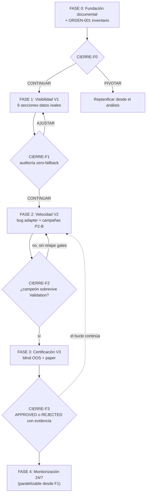

# PLAN ADAPTATIVO POR FASES — PÁGINA DE ESTRATEGIAS (ULTRARENTABLE)

## 1. Objetivo

Convertir la página `/estrategias` en la superficie operativa central del laboratorio: primero
visibilidad total de la evidencia real existente, después aceleración del bucle de investigación
(Fase 2 actual del proyecto), y por último promoción de estrategias certificadas a paper/fondeo.
Cada fase termina con un **análisis de cierre obligatorio** que decide continuar / ajustar / pivotar.

## 2. Restricciones fijas (no negociables)

1. **Repo principal intacto por defecto.** Todo el trabajo nace en la carpeta aislada
   `/home/ubuntu/workspace/pro/trading/estrategias-lab/` (fuera de `01 Ultrarentable`).
   El código solo entra a `JOSFER78/ultrarentable` vía rama `feature/estrategias-ORDEN-NNN`
   + CI `r0-stabilization` verde + revisión aprobada. Nunca commit directo a `main`.
2. **Doctrina heredada del repo** (`.agents/AGENTS.md`): ZERO-MOCK, ZERO-SIMULATION,
   ZERO-FORCING, ZERO-LOOKAHEAD, REAL-ONLY, EVIDENCE-GATED. Ausencia de dato =
   `NO_EVIDENCE` visible, jamás placeholder.
3. **Solo la Página de Estrategias.** Las demás secciones del sitio quedan fuera de scope;
   cualquier orden con anti-scope que las toque se rechaza.
4. **Frontend no calcula:** solo renderiza precalculado del backend (`:8000`).
5. **Sin estimaciones de esfuerzo** en este plan: el avance se mide por criterios de salida.

## 3. Contexto verificado (base fáctica del plan)

- La página ya existe y está viva: `apps/web/app/estrategias/` con 6 sub-secciones
  (`1-motor-en-vivo`, `2-explorador-excel`, `3-pipeline-11-gates`, `4-panel-investigador`,
  `5-estrategias-aprobadas`, `6-meta-estrategia`) + `page.tsx` hub con navegación `EstrategiasHeaderNav`.
- El hub ya consume endpoints reales: `/api/v2/strategy-lab/overview|strategies|sqx/status`,
  `/api/v2/certified/strategies`, `/api/v1/candidates`, `/api/v1/research-lab/*`.
  Ya implementa estados `NO EVIDENCE` y extracción SQX real.
- Proyecto en **Macrophase 2 (P2-B)**: iteración 001 terminó 0 aprobadas / 3 rechazadas
  (rejilla EMA/RSI/ATR insuficiente bajo costes reales). Siguiente bloque declarado en
  `02_CURRENT_ORDER.md`: evolución estructural ULTRA + ruta FONDEO separada.
- Bug abierto señalado: `.phase2/GO_NOW` → "Fix adapter import path" en
  `scripts/phase2_research_adapter.py`.
- CI: 5 workflows; `r0-stabilization.yml` con ~14 guards ejecutables
  (`scripts/stabilization/r0_*.py`). Es la definición mecánica de "hecho".
- Backend expone `GET /api/v1/system_health/status` (probes HTTP, HEALTHY/DEGRADED) y
  `SystemSupervisor` con heartbeats de 8 workers.
- Deuda documental detectada: 5+ documentos de estado contradictorios (versiones 3.2.0 vs
  5.3.0 vs 5.4.0; puertos 3000 vs 5000; counts de tests distintos). Autoridad real:
  `version_manifest.json` (5.4.0) + `services/engine_version.py`.
- Hermes (VPS) tiene plataformas Telegram activa y toolsets cron/terminal/web: capacidad de
  monitorización sin infraestructura nueva.

## 4. Modelo de gobernanza adaptativa

Cada fase es un ciclo cerrado:

```text
ENTRADA (criterios de entrada cumplidos)
  → EJECUCIÓN (tareas numeradas, delegadas a agentes IA vía órdenes)
  → SALIDA (Definition of Done verificable mecánicamente)
  → ANÁLISIS DE CIERRE (obligatorio: métricas + hechos)
  → DECISIÓN: CONTINUAR | AJUSTAR (scope de la siguiente fase) | PIVOTAR (replanificar)
  → se reescribe 07_ESTADO.md con la decisión y su evidencia
```

Reglas de decisión del análisis de cierre:
- **CONTINUAR:** todos los criterios de salida cumplidos con evidencia enlazada.
- **AJUSTAR:** ≥1 criterio incumplido con causa raíz identificada y corregible sin cambiar
  objetivo → la siguiente fase absorbe la corrección como ORDEN prioritaria.
- **PIVOTAR:** un criterio central resulta imposible o falso (p. ej.: endpoint inexistente,
  datos no reproducibles) → se detiene la cadena y se replanifica desde el análisis.
- Ningún resultado `0 aprobadas` de investigación es motivo de PIVOT por sí mismo: es un
  resultado científico válido (fail-closed). Se pivota solo ante evidencia rota o falsa.

El análisis de cierre lo ejecuta el agente `auditor` (distinto del implementador) y lo
aprueba el humano con un comentario en el documento de cierre.

## 5. Estructura del proyecto aislado

Crear en `/home/ubuntu/workspace/pro/trading/estrategias-lab/`:

```text
estrategias-lab/
├── README.md                      # Entrada, mapa, reglas de navegación
├── AGENTS.md                      # Doctrina + reglas para cualquier agente IA
├── .kilo/
│   ├── command/                   # /orden /handoff /review /estado /cierre-fase
│   └── agent/                     # planificador.md, implementador.md, auditor.md, documentador.md
├── 00_DOCTRINA.md                 # Principios inmutables (copia destilada de §2)
├── 01_OBJETIVOS_KPI.md            # KPIs V1 visibilidad / V2 velocidad / V3 conversión
├── 02_ARQUITECTURA_PAGINA.md      # Especificación de las 6 secciones y contratos
├── 03_CONTRATOS/
│   ├── page_sections.schema.json  # cada sección: endpoint, campos, estados, evidence_link
│   ├── evidence_link.schema.json  # {strategy_hash, dataset_hash, engine_version, commit_sha}
│   └── health_report.schema.json  # contrato de monitorización §9
├── 04_ORDENES/                    # ORDEN-NNN.md + _PLANTILLA_ORDEN.md
├── 05_HANDOFFS/                   # HANDOFF-NNN.md + _PLANTILLA_HANDOFF.md
├── 06_REVISIONES/                 # REV-NNN.md + _PLANTILLA_REVISION.md
├── 07_ESTADO.md                   # Única fuente viva (reescritura total, fecha + commit)
├── 08_CIERRES_DE_FASE/            # CIERRE-FN.md: métricas + decisión CONTINUAR/AJUSTAR/PIVOTAR
├── 09_EVIDENCIA/                  # Enlaces + SHA-256 de artefactos CI
└── 10_MONITOR/
    ├── health_endpoints.yaml      # inventario de servicios vigilados
    └── hermes_heartbeat.md        # contrato de integración con Hermes
```

Reglas de la documentación:
- `07_ESTADO.md` se reescribe completo en cada actualización (prohibido append histórico;
  el histórico vive en `08_CIERRES_DE_FASE/` y en git de la propia carpeta).
- Toda orden lleva: objetivo, scope explícito, **anti-scope**, archivos permitidos (glob),
  criterios de aceptación ejecutables (comando concreto), doctrina heredada.
- Todo handoff lleva: commit SHA, rama, comandos de verificación ejecutados y su salida,
  desviaciones respecto a la orden.

## 6. Delegación en IA (roles y ciclo)

| Agente (`.kilo/agent/`) | Responsabilidad | Salida obligatoria |
|---|---|---|
| `planificador` | Descompone KPIs en órdenes atómicas verificables | ORDEN-NNN.md |
| `implementador` | Ejecuta en worktree/rama aislada | HANDOFF-NNN.md + rama |
| `auditor` | Reproduce el handoff desde cero; ataca supuestos; ejecuta cierres de fase | REV-NNN.md / CIERRE-FN.md |
| `documentador` | Sincroniza 07_ESTADO.md, contratos y README | diff de estado |

Ciclo: ORDEN → HANDOFF → REVISIÓN → (APROBADO: merge condicionado + estado) |
(RECHAZADO: causa raíz → nueva orden). El auditor nunca es el mismo agente que implementó.
Compatibilidad multi-herramienta (Kilo, Codex, Claude, Antigravity): todo es Markdown +
JSON Schema + git; `AGENTS.md` es el contrato de entrada universal.

## 7. Fases del plan

### FASE 0 — Fundación y sistema documental
**Entrada:** ninguna (inicio).
**Tareas:**
1. Crear el árbol de §5 en `estrategias-lab/` e inicializar git propio en la carpeta.
2. Redactar `AGENTS.md`, `00_DOCTRINA.md`, `01_OBJETIVOS_KPI.md` con los KPIs:
   - V1: % de las 6 secciones renderizando datos reales con evidence_link (meta 100%).
   - V2: trials de investigación ejecutados por campaña y familias evaluadas.
   - V3: candidatos APPROVED y estrategias en paper.
3. Redactar `02_ARQUITECTURA_PAGINA.md`: especificación de cada una de las 6 secciones
   (fuente real ya existente vs hueco) basada en el inventario de la tarea 4.
4. Escribir los 3 schemas de `03_CONTRATOS/` validando contra `apps/web/lib/api.ts`
   (tipos existentes: `StrategyLabOverview`, `CertifiedStrategy`, `CandidateStrategy`, etc.).
5. Crear las 4 plantillas y los 5 comandos `.kilo/command/`.
6. Emitir `ORDEN-001`: inventario verificable endpoint→sección para las 6 sub-páginas
   (qué consume cada `page.tsx` hoy y qué devuelve el backend realmente).
**Salida (DoD):**
- Un agente externo ejecuta ORDEN-001 sin preguntas al humano.
- Los 3 schemas validan sintácticamente y cubren los tipos de `lib/api.ts` sin inventar campos.
- `07_ESTADO.md` existe y refleja exactamente la realidad del inventario.
**Análisis de cierre (CIERRE-F0):**
- ¿Hay secciones cuyo endpoint no existe o devuelve datos cosméticos? → registrarlas como
  huecos con prioridad para F1.
- ¿Los schemas cubren el estado cuádruple `PASS|FAIL|BLOCKED|NO_EVIDENCE` en cada métrica?
- Decisión: CONTINUAR a F1 solo con ORDEN-001 ejecutada y revisada.

### FASE 1 — Visibilidad inmediata (V1)
**Entrada:** CIERRE-F0 = CONTINUAR.
**Tareas:**
1. Con el inventario de F0, clasificar cada sección: COMPLETA / PARCIAL / HUECO.
2. Para cada HUECO: orden de backend para exponer el dato REAL existente en SQLite/evidencia
   (nunca calcular nada nuevo inventado; si no hay dato, el endpoint devuelve `NO_EVIDENCE`).
3. Proponer (solo si el inventario lo justifica) el endpoint agregado
   `GET /api/v2/estrategias/page-bundle` en una orden con anti-scope estricto.
4. Completar secciones PARCIALES del frontend: estados cuádruples visibles, evidence_link
   en cada celda cuantitativa (hash tooltip/navigable).
5. Sección `4-panel-investigador`: mostrar el estado real de Macrophase 2 (campañas,
   trials, familias) desde datos de `services/discovery` y artefactos phase2.
6. Sección `6-meta-estrategia`: candado visible con condición de desbloqueo exacta
   (≥1 campeón aprobado en Fase 2 de investigación), sin contenido ficticio.
7. Rama `feature/estrategias-ORDEN-NNN` + CI `r0-stabilization` verde + revisión.
**Salida (DoD):**
- V1 = 100%: auditoría automática (script del agente auditor) detecta 0 fallbacks cosméticos
  en las 6 secciones (búsqueda de literales prohibidos + verificación de evidence_links).
- `npm run typecheck` y `npm run build` verdes; guards R0 verdes.
**Análisis de cierre (CIERRE-F1):**
- Métricas: nº de huecos cerrados, nº de endpoints reales enlazados, resultados de la
  auditoría zero-fallback.
- ¿Quedan secciones sin dato físico posible (p. ej.: sección 5 vacía porque no hay
  aprobadas)? → verificar que es vacío-correcto y está etiquetado como tal.
- Decisión: CONTINUAR a F2, o AJUSTAR si la auditoría detecta datos sin provenance.

### FASE 2 — Velocidad de investigación (V2)
**Entrada:** CIERRE-F1 = CONTINUAR.
**Tareas:**
1. ORDEN prioritaria: cerrar el bug señalado en `.phase2/GO_NOW` (adapter import path en
   `scripts/phase2_research_adapter.py`), con test de regresión que lo demuestre.
2. Verificar R0 verde fresco en `main` (estado CI GitHub Actions); si está rojo, esa es la
   prioridad absoluta antes de campañas.
3. Ejecutar la campaña de evolución estructural ULTRA declarada en `02_CURRENT_ORDER.md`
   (familias signal×exit, deduplicación canónica, presupuesto acotado) vía workflow
   `phase2-live-data` (manual, workflow_dispatch).
4. Ejecutar campaña FONDEO solo donde exista dataset físico completo + modelo de costes
   canónico (condición explícita de la orden actual).
5. Publicar en sección 4 el resultado completo: trials, familias supervivientes, métricas
   IS vs Validation, con enlaces a artefactos de evidencia de GitHub Actions.
6. Documentar en `08_CIERRES_DE_FASE/` el aprendizaje científico (qué familias fallaron y
   por qué: costes/microestructura/régimen/múltiple-testing).
**Salida (DoD):**
- ≥1 campaña completa con artefacto de evidencia público enlazado en `09_EVIDENCIA/`.
- Trials/campaña y nº de familias registrados en KPIs.
- Resultados (sean 0 o N aprobadas) publicados en la página con provenance.
**Análisis de cierre (CIERRE-F2):**
- Métricas: trials ejecutados, familias comparadas por estabilidad en Validation,
  patrón de fallo dominante.
- Pregunta científica central: ¿la rejilla actual produce algún candidato que sobreviva
  Validation con costes reales? Si sí → F3 con campeón congelado. Si no → AJUSTAR:
  nueva orden para ampliar familias ejecutables (estructuras de régimen, exits distintos,
  costes instrumento-específicos) **sin tocar umbrales de gates**.
- PROHIBIDO como decisión: relajar gates o reutilizar datasets Binance legados.

### FASE 3 — Certificación y papel (V3)
**Entrada:** CIERRE-F2 con al menos 1 campeón familiar congelado
(`phase2-frozen-champion-v1`, dataset/param hash, Validation evidence) o, en su defecto,
decisión AJUSTAR que devuelva a F2.
**Tareas:**
1. Ejecutar Blind OOS aislado vía `phase2-blind-oos.yml` contra el campeón congelado
   (el workflow rechaza candidatos no congelados o con hash distinto por diseño).
2. Publicar el resultado en sección `3-pipeline-11-gates` (11 estados con evidence_link) y
   sección `5-estrategias-aprobadas` (FSM real: APPROVED→INCUBATION_PAPER→LIVE).
3. Si APPROVED: orden de incubación en `services/paper/` (sandbox con datos reales), con
   monitorización de fills/ledger; la página muestra el estado del paper con hashes.
4. Si REJECTED: autopsia cuantitativa publicada en sección 4 y vuelta a F2 con la hipótesis
   siguiente documentada. No se fuerza ningún candidato.
**Salida (DoD):**
- ≥1 estrategia en estado terminal documentado (APPROVED+paper o REJECTED con evidencia),
  visible en la página con su bundle de evidencia completo.
**Análisis de cierre (CIERRE-F3):**
- Métricas: resultado blind OOS (PF, ROI, nº trades), gates pasados/fallados,
  verificación del ledger de paper si aplica.
- Decisión: CONTINUAR a F4 + iteración de F2 en paralelo (el bucle no se detiene), o
  AJUSTAR hipótesis de investigación.

### FASE 4 — Operación y monitorización 24/7 (paralelizable desde F1)
**Entrada:** F1 cerrada (necesita la sección 1 como superficie de estado).
**Tareas:**
1. Definir `10_MONITOR/health_endpoints.yaml`: backend :8000 (`/api/v1/system_health/status`,
   `/api/v1/version`), web :3000 (`/estrategias` HTTP 200), SQX :8080/:8081, daemon de
   discovery, y los 5 workflows de GitHub Actions.
2. Contrato `health_report.schema.json` por servicio:
   `{service, status, last_beat_utc, latency_ms, metrics, evidence_ref}`.
3. Integración Hermes: cron cada 5 min recolecta/consulta los endpoints, compara
   `last_beat_utc` contra umbral de 3 latidos; alerta por Telegram (plataforma ya activa)
   con servicio degradado y enlace a log.
4. Monitoreo de agentes: regla "orden sin handoff en cola > umbral" → aviso Telegram
   (agente atascado).
5. Digest diario (08:00 UTC) a Telegram + actualización automática del resumen en
   `07_ESTADO.md`: estado CI, campañas en curso, aprobadas/rechazadas, salud de servicios.
6. Sección `1-motor-en-vivo` consume el agregado de salud con los mismos estados
   cuádruples que el resto de la página.
**Salida (DoD):**
- 7 verificaciones diarias consecutivas sin fallo no alertado.
- Digest diario operativo con datos 100% reales.
**Análisis de cierre (CIERRE-F4):**
- Métricas: disponibilidad observada, falsas alarmas, tiempo entre fallo y alerta.
- Decisión: AJUSTAR umbrales/alertas, o CONTINUAR a escalado (solo si se supera la decena
  de servicios: evaluar Uptime Kuma/Grafana como adaptador del mismo contrato, sin
  reescritura).

## 8. Flujo completo



## 9. Riesgos y mitigaciones

| Riesgo | Mitigación |
|---|---|
| Presión por "rentabilidad inmediata" relaja gates | Doctrina en AGENTS.md + decisión explícita en CIERRE-F2: prohibido tocar umbrales; auditor independiente |
| Reintroducir contradicción documental | 07_ESTADO.md única fuente, reescritura total, fecha+commit; docs obsoletos del repo NO se editan (fuera de scope) |
| Agente toca `main` fuera de scope | Anti-scope obligatorio por orden + worktrees + merge solo con R0 verde + REV aprobada |
| Bug del adapter bloquea campañas | Es la ORDEN prioritaria de F2, anterior a cualquier campaña |
| Campañas sin dataset custodiado | Orden de F2 exige dataset físico + manifest + hash antes de gastar trials |
| Servicios VPS caídos sin aviso | F4: 3 latidos perdidos = alerta Telegram |
| Página promete más de lo probado (precedente 0/3) | Secciones con vacío-correcto etiquetado y candado con condición visible |

## 10. Preguntas abiertas (con valor por defecto recomendado)

1. **Carpeta aislada:** usar `/home/ubuntu/workspace/pro/trading/estrategias-lab/` con git
   propio. ← recomendado; alternativa: dentro de `~/workspace/pro/trading/01 Ultrarentable/.kilo/`
   (rechazada: contaminaría el repo).
2. **Endpoint agregado `page-bundle`:** solo si el inventario de F0 muestra ≥3 llamadas en
   cascada por carga de página; si no, no se añade nada al backend. ← recomendado.
3. **Quién aprueba los cierres de fase:** el dueño del proyecto (tú) con comentario en el
   CIERRE-FN.md; el auditor solo recomienda. ← recomendado.
4. **Acceso a la VPS Oracle para F4:** se necesita acceso a Hermes/SSH; sin él, F4 queda
   limitada a monitorización local de este workspace y CI. ← señalar al llegar a F4.
5. **Docs obsoletos del repo (ESTADO.md, STATE_OF_TRUTH.md, README v5.3.0):** fuera de
   scope de este plan por restricción del usuario; se registran como deuda en 07_ESTADO.md.
   ← recomendado.

## 11. Validación del plan (cómo se comprueba que funciona)

- F0: agente independiente ejecuta ORDEN-001 sin intervención humana.
- F1: script de auditoría con 0 hallazgos de fallback cosmético; R0 verde en la rama.
- F2: artefacto de campaña existente en GitHub Actions y enlazado en 09_EVIDENCIA.
- F3: bundle de evidencia del campeón (o de su rechazo) consultable desde la página.
- F4: 7 días de digest con datos reales sin alertas perdidas.
- Global: `07_ESTADO.md` coincide con la realidad observable del repo y del CI en todo
  momento (verificación aleatoria por el auditor).
