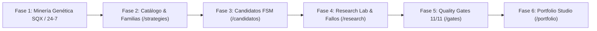

> ⚠️ **SUPERSEDED (2026-08-29)** — Este documento es HISTÓRICO y ya NO es la fuente de verdad. Motivo: declara motor activo v5.3.0 y servicios desactualizados; la realidad hoy es engine 5.4.0, API :8000, Web :3005 — ver docs/00_MASTER_IDEAS_Y_PLAN.md §2.4. **Fuente canónica vigente: `docs/00_MASTER_IDEAS_Y_PLAN.md`.** Contenido conservado intacto solo como referencia histórica. NO actualizar este archivo.

# 🎯 Ultrarentable V5.3.0 — Laboratorio Cuantitativo Autónomo (BingX + CME Globex + SQX)

> **Versión Activa del Motor: `v5.3.0`** (Dual-Track Multi-Asset 24/7 Engine: CME Micro Sizing & Asymmetric Ratchet Vault).  
> **Guía maestra de entrada para cualquier desarrollador, analista o agente IA que trabaje en el proyecto.**  
> Consulta obligatoria: [SYSTEM_DOCTRINE.md](file:///SYSTEM_DOCTRINE.md) y [SPEC_MASTER_ULTRA_VS_FONDEO.md](file:///SPEC_MASTER_ULTRA_VS_FONDEO.md).

---

## 🚫 1. DIRECTIVA MAESTRA UNIVERSAL: ZERO SIMULACIONES (REAL-ONLY)

1. **PROHIBICIÓN TOTAL DE INVENTAR O SIMULAR DATOS:**
   - Queda terminantemente prohibido el uso de generadores sintéticos (`random`, `randint`, `uniform`, `seed`) en motores de cálculo, validación, APIs o bases de datos.
   - Prohibido el auto-relleno de perfiles o datos falsos "para que se vea bonito".
2. **CERO FALLBACKS COMPLACIENTES:**
   - Si no hay datos físicos $\longrightarrow$ `SIN DATOS / NO EVIDENCE` o `ERROR / DESCONECTADO`.
3. **EVIDENCIA FÍSICA Y HASH SHA-256:**
   - Todo dato cuantitativo proviene de bases de datos SQLite WAL (`database.sqlite` / `ultrarentable.sqlite3`) o Parquets en disco. Cada estrategia posee un hash SHA-256 criptográfico inmutable.

---

## ⚖️ 2. Misión y Filosofía Dual Segregada

Ultrarentable es un laboratorio cuantitativo integral diseñado para **descubrir, validar genéticamente, certificar mediante 11 Evidence Gates y desplegar estrategias de trading algorítmico 100% automáticas** sobre derivados de criptomonedas (BingX Perpetuals), futuros regulados (CME Globex) y divisas (Interbank Forex).

El sistema opera bajo dos filosofías operativas completamente bifurcadas:

| Dimensión | 🚀 TRACK_ULTRA (Hiperescalado Asimétrico) | 🏛️ TRACK_FONDEO (CME / Prop Firms) |
| :--- | :--- | :--- |
| **Objetivo** | Crecimiento exponencial / Explosiones parabólicas ($\ge 1000\%$) | Pasar evaluaciones y sostener cobros mensuales constantes |
| **Apalancamiento** | Margen Aislado por bala 1R (\$100-\$1,000) | **Contratos Fijos** (1-3 micros/minis según cuenta) |
| **Drawdown Flotante** | Hasta el **80.0%** (oscilación intrabar tolerada) | $\le 4.50\%$ (Cerrojo estricto de seguridad) |
| **Drawdown Realizado** | Hasta el **75.0%** sobre balance cerrado | $\le 4.00\% - 4.50\%$ (Límite máximo tolerado) |
| **Pérdida Diaria (DLL)**| Sin límite diario nominal (controlado por bala 1R) | $\le 2.0\%$ (\$1,000 USD en cuenta base 50k) con 0 violaciones |
| **Dimensionamiento** | Balas sacrificables 1R (\$100 a \$1,000 USD) | Lotes / Contratos fijos (0% Compounding) |
| **Piramidación** | ✅ **Hiperpiramidación Free-Risk** (BE tras $+1.5\text{R}$) | ❌ **PROHIBIDA** (Evita sobreexposición) |
| **Gestión de Ganancias** | Bóveda Ratchet (*Inviolable Vault* 50%-85% a Spot USDT) | Retiros periódicos según reglas de la firma |
| **Cuentas Soportadas** | Cuentas propias (\$100 a \$1,000 USD por bala) | **25k, 50k, 100k, 150k, 250k, 300k** en Apex, Topstep, FTMO, etc. |
| **Universo de Activos** | **100% de los 22 activos globales** (Cripto, Índices, FX, Commodities) | CME Futures, Forex Majors y Cripto Majors (`BTC`, `ETH`) |

---

## 🔄 3. El Pipeline Cuantitativo de 6 Fases

Todas las fases presentan la misma interfaz tabular estilo **Excel unificado con Sheet Tabs (`TODAS`, `FONDEO`, `ULTRA`)**, control manual de refresco e inmunidad a parpadeos:



1. **Fase 1 (Minería):** Minería genética continua sobre 22 datasets históricos en disco.
2. **Fase 2 (Catálogo):** Normalización a AST canónico y hash SHA-256.
3. **Fase 3 (Candidatos):** Backtest determinista bar-by-bar sin sesgo de anticipación.
4. **Fase 4 (Research Lab):** Autopsias cuantitativas de candidatos rechazados y memoria de fallos.
5. **Fase 5 (Quality Gates):** Evaluación de las 11 Evidence Gates (DSR, Hurst, Parkinson, WFE, DLL).
6. **Fase 6 (Portfolio Studio):** Ensamblado multi-activo por Paridad de Riesgo Inversa (ERC), correlación empírica y debate de 5 agentes IA.

---

## 🛡️ 4. Las 11 Evidence Gates

- **Gate 1:** Integridad de datos y timestamps UTC monótonos (Cero lookahead).
- **Gate 2:** Significancia estadística de la muestra ($N \ge 30$ trades Fondeo / $N \ge 45$ ráfagas Ultra).
- **Gate 3:** Independencia de outliers (Top 2 trades $\le 15\%$ del profit total).
- **Gate 4 (Fondeo):** Deflated Sharpe Ratio ($\text{DSR} \ge 2.00$, $p < 0.05$).
- **Gate 5 (Fondeo):** Max Trailing Drawdown $\le 4.00\% - 4.50\%$ y 0 violaciones de DLL.
- **Gate 6 (Fondeo):** Consistency Rule $\le 30\%$ (ningún día aporta $> 30\%$ del profit).
- **Gate 7 (Fondeo):** Riesgo de Ruina Monte Carlo $P(\text{Ruin}) = 0.00\%$.
- **Gate 8 (Ultra):** Asimetría positiva $\text{Skewness} \ge +0.50$, Tail Gain $\ge 40\%$, Payoff $\ge 3.00$.
- **Gate 9 (Ultra):** Fricción Taker + Slippage adverso con expectativa neta $\mathbb{E}[R]_{\text{bala}} \ge 0.20\text{R}$.
- **Gate 10 (Ultra):** Walk-Forward Vault Harvest Efficiency $\ge 0.50$ con retención en Bóveda Ratchet.
- **Gate 11 (Ultra):** Supervivencia Monte Carlo en ráfagas de 10-20 balas ($P(\text{Ruina}) < 1.0\%$).

---

## 🏛️ 5. Topología de Servicios y Acceso 24/7

Todos los servicios operan 24/7 en la VPS Oracle Cloud gestionados por `systemd --user` con autorecuperación inmediata (`Restart=always`, `RestartSec=3s`):

| Servicio | Puerto Interno | Protocolo / Base | Rol Operativo |
| :--- | :---: | :--- | :--- |
| **Frontend Next.js** | `:3000` | Next.js 14 / App Router | Tablas Excel unificadas, Sheet Tabs, telemetría SSE |
| **API FastAPI Backend**| `:8000` | FastAPI / Python 3.11 | Motor de backtest, endpoints REST y streaming |
| **StrategyQuant X** | `:8080` / `:8081` | MCP Bridge JSON-RPC 2.0 | Minería genética en display virtual |
| **Base de Datos** | Local | SQLite WAL | `database.sqlite` / `ultrarentable.sqlite3` |

---

## 📁 6. Estructura del Repositorio

```text
ultrarentable/
├── README.md                                 # Visión general, arquitectura, servicios y arranque
├── SPEC_MASTER_ULTRA_VS_FONDEO.md            # Especificación profunda de la Bifurcación Dual
├── SYSTEM_DOCTRINE.md                        # Directiva Zero-Simulaciones, 6 Fases y 11 Evidence Gates
├── apps/
│   └── web/                                  # Frontend Next.js 14 (App Router)
│       ├── app/
│       │   ├── strategies/                   # Fase 2: Catálogo Canónico
│       │   ├── candidatos/                   # Fase 3: Candidatos y FSM
│       │   ├── research/                     # Fase 4: Research Lab y Memoria de Fallos
│       │   ├── gates/                        # Fase 5: Quality Gates Hub (11 Gates)
│       │   ├── portfolio/                    # Fase 6: Portfolio Studio y Debate IA
│       │   └── estrategias/                  # Hub Maestro de Estrategias Multi-Fase
│       └── lib/                              # Clientes API y utilidades
├── contracts/                                # Modelos Pydantic v2 Inmutables (Zero-Trust)
├── services/
│   ├── api/                                  # Backend FastAPI central (:8000)
│   ├── portfolio/                            # MetaEnsembleService, MetaValidationPipeline
│   ├── semantic_ai/                          # PortfolioDebateEngine (5 Agentes IA)
│   └── validation/                           # QuantValidationFabric
└── scripts/                                  # Verificación E2E y sincronización
```
