# ESPECIFICACIÓN MAESTRA CANÓNICA: ULTRARENTABLE (ULTRA) VS FONDEO INSTITUCIONAL (FONDEO)

> **ESTADO DE VERDAD ÚNICA (SSOT) — VERSIÓN V1.05**  
> Este documento define de forma inmutable, matemática y operativa la totalidad de las reglas, filosofías, catálogos de activos, gestión de riesgo y criterios de validación para las dos rutas del sistema: **Ruta ULTRA** y **Ruta FONDEO**.  
> **Cualquier agente de IA o desarrollador humano debe acatar estrictamente estas definiciones sin omitir ni alterar ninguna condición.**

---

## 1. COMPARATIVA ESTRUCTURAL Y FILOSÓFICA

```mermaid
flowchart TD
    subgraph RUTA_ULTRA [RUTA ULTRA: ASIMETRÍA HIPER-RENTABLE]
        U1[Subcuenta Bala Sacrificable: $1.000 USD] --> U2[Riesgo Base Agresivo: 7.5% por Trade]
        U2 --> U3[Interés Compuesto Dinámico: Equity Compounding]
        U3 --> U4[Piramidación en Beneficio: +1.5R con BE Stop]
        U4 --> U5[Drawdown Permitido en Bala: Hasta 80%]
        U5 --> U6[Cosecha Periódica a Bóveda Inviolable Ratchet Vault]
    end

    subgraph RUTA_FONDEO [RUTA FONDEO: EXÁMENES INSTITUCIONALES & PROP FIRMS]
        F1[Cuenta Institucional / Examen: $50.000 USD] --> F2[Riesgo Acotado: 0.5% - 1.0% por Trade]
        F3[Lotes Fijos / Contratos CME: Cero Compounding] --> F4[Piramidación Prohibida: Exposición Fija]
        F4 --> F5[Límite Máximo Trailing DD: 4.0% - 4.5%]
        F5 --> F6[Límite de Pérdida Diaria: 1.5% - 2.0%]
    end
```

### Tabla Comparativa Completa

| Dimensión Operativa | Ruta ULTRA (Hiper-Rentable Asimétrico) | Ruta FONDEO (Cuentas de Fondeo / Prop Firms) |
|---|---|---|
| **Propósito Principal** | Búsqueda de convexidad asimétrica extrema mediante subcuentas independientes sacrificables ("Balas"). Multiplicar el capital agresivamente y cosechar a Bóveda. | Superar exámenes y mantener cuentas fondeadas (Apex, Topstep, FTMO, MyFundedFX) respetando límites estrictos de Daily Loss y Trailing DD. |
| **Capital Inicial Base** | **$\$1.000\text{ USD}$** (Subcuenta Bala sacrificable). | **$\$50.000\text{ USD}$** (Cuenta tipo Prop Firm estándar). |
| **Objetivo de Retorno** | Multiplicar la subcuenta $\times 3$, $\times 5$ o $\times 10$ ($+200\%$ a $+1000\%$) y transferir ganancias a la Bóveda. | $+6.0\%$ a $+10.0\%$ ($\$3.000$ a $\$5.000\text{ USD}$) para aprobar el examen; consistencia mensual sostenida en fondeo real. |
| **Riesgo Base por Trade** | **$7.5\%$** de la equidad disponible de la subcuenta (Rango calibrado: $5.0\% - 10.0\%$). | **$0.5\% - 1.0\%$** del capital de la cuenta ($\$250 - \$500\text{ USD}$ por trade). |
| **Gestión de Posición / Sizing** | **Interés Compuesto Dinámico (Equity Compounding)**: El tamaño de posición se recalcula barra a barra según la equidad disponible. | **Lotes / Contratos Fijos CME**: Contratos estándar/micro (1 o 2 contratos) fijos. Cero interés compuesto dentro del examen. |
| **Piramidación (Pyramiding)** | **Habilitada (1 a 3 niveles)**: Solo sobre trades en beneficio flotante $\ge +1.5R$ moviendo el Stop Loss a Break-Even ($0R$) para riesgo nulo adicional. | **Deshabilitada / Prohibida**: Para evitar sobreapalancamiento intradía ante reversals repentinos. |
| **Apalancamiento Máximo** | **$5\text{x} - 20\text{x}$** en futuros perpetuos cripto (según margen aislado). | **$1\text{x} - 3\text{x}$** en contratos de futuros regulados CME. |
| **Drawdown Máximo Permitido** | **Hasta $80.0\%$** en la subcuenta bala. La bala solo muere si llega al $85.0\% - 100.0\%$ (liquidación de la bala). Las ganancias cosechadas en la Bóveda quedan 100% a salvo. | **$4.0\% - 4.5\%$** (Límite estricto de Apex/Topstep de $\$2.000 - \$2.500\text{ USD}$ sobre cuenta de $\$50.000$). DD $> 4.0\%$ = Descarte fatal. |
| **Límite de Pérdida Diaria** | Sin límite diario artificial (permite swings de 4h/1d con stops técnicos amplios). | **$\le 2.0\%$ diario** ($\le \$1.000\text{ USD}$ al día). Auto-flatten automático al alcanzar el $1.5\%$. |
| **Mecanismo de Bóveda** | **Ratchet Vault**: Cada vez que una bala supera $+200\%$, el $50\%$ del beneficio se traslada irrevocablemente a la Bóveda de Cosecha. | No aplica (el balance es administrado directamente por la firma de fondeo). |

---

## 2. CATÁLOGO DE ACTIVOS POR RUTA

### 2.1 Universo ULTRA (Rastreo Obligatorio de los 23 Activos Globales / 112 Datasets)
La Ruta ULTRA está diseñada para operar sobre **TODOS** los activos disponibles en disco, aprovechando tanto la volatilidad asimétrica del mercado cripto como las tendencias de futuros e índices tradicionales:

1. **Criptoactivos Líquidos y Volátiles (BingX Perpetual USDT Futures)**:
   - `BTC-USDT` (Bitcoin) — 1m, 5m, 15m, 1h, 4h, 1d
   - `ETH-USDT` (Ethereum) — 1m, 5m, 15m, 1h, 4h, 1d
   - `SOL-USDT` (Solana) — 1m, 5m, 15m, 1h, 4h, 1d
   - `SUI-USDT` (Sui) — 1m, 5m, 15m, 1h, 4h, 1d
   - `DOGE-USDT` (Dogecoin) — 1m, 5m, 15m, 1h, 4h, 1d
   - `AVAX-USDT` (Avalanche) — 1m, 5m, 15m, 1h, 4h, 1d
   - `BNB-USDT` (Binance Coin) — 1m, 5m, 15m, 1h, 4h, 1d
   - `LINK-USDT` (Chainlink) — 1m, 5m, 15m, 1h, 4h, 1d
   - `XRP-USDT` (Ripple) — 1m, 5m, 15m, 1h, 4h, 1d
   - `ADA-USDT` (Cardano) — 1m, 5m, 15m, 1h, 4h, 1d
   - `DOT-USDT` (Polkadot) — 1m, 5m, 15m, 1h, 4h, 1d
   - `NEAR-USDT` (Near) — 1m, 5m, 15m, 1h, 4h, 1d
   - `APT-USDT` (Aptos) — 1m, 5m, 15m, 1h, 4h, 1d
   - `MATIC-USDT` / `POL-USDT` (Polygon) — 1m, 5m, 15m, 1h, 4h, 1d
   - `PEPE-USDT` (Pepe) — 1m, 5m, 15m, 1h, 4h, 1d
2. **Índices y Futuros Tradicionales (CME)**:
   - `NQ` / `MNQ` (E-mini / Micro E-mini Nasdaq 100)
   - `ES` / `MES` (E-mini / Micro E-mini S&P 500)
   - `YM` / `MYM` (E-mini / Micro E-mini Dow Jones)
   - `RTY` / `M2K` (E-mini / Micro E-mini Russell 2000)
3. **Materias Primas & Metales Preciosos**:
   - `GC` / `MGC` (Oro / Micro Gold)
   - `SI` / `SIL` (Plata / Silver)
   - `CL` / `MCL` (Petróleo Crudo / Micro Crude Oil)
4. **Forex Mayor**:
   - `EURUSD` / `6E` (Euro / US Dollar)

### 2.2 Universo FONDEO (Activos Permitidos en Evaluaciones Institucionales)
En la Ruta FONDEO se filtran únicamente activos compatibles con los catálogos oficiales de Apex Trader Funding, Topstep, MyFundedFutures y FTMO:
- **Índices CME**: `NQ`, `MNQ`, `ES`, `MES`, `YM`, `RTY`.
- **Metales y Energía CME**: `GC`, `MGC`, `CL`, `MCL`.
- **Forex Spot / Futuros CME**: `6E`, `EURUSD`, `GBPUSD`, `USDJPY`.

---

## 3. PROTOCOLO DE VALIDACIÓN EN LOS 11 GATES CUANTITATIVOS

La plataforma somete a todas las estrategias a un pipeline inmutable de 11 Gates secuenciales. Los umbrales se adaptan rigurosamente a la naturaleza de cada ruta:

| Gate | Nombre | Criterio Ruta ULTRA | Criterio Ruta FONDEO |
|---|---|---|---|
| **Gate 1** | Ingesta & Calidad de Datos | SHA-256 verificado en disco, 0 duplicados, 0 velas sintéticas. | SHA-256 verificado en disco, 0 duplicados, 0 velas sintéticas. |
| **Gate 2** | Backtest con Fricción Real | Cost Drag $\le 30.0\%$ del beneficio bruto (Crypto Fees + Slippage). | Cost Drag $\le 20.0\%$ del beneficio bruto (Comisiones CME $\$2.50/\text{contrato}$). |
| **Gate 3** | Significancia Estadística | $\ge 15$ trades IS, $\ge 10$ trades OOS, Outlier ratio $\le 85\%$. | $\ge 30$ trades IS, $\ge 20$ trades OOS, Outlier ratio $\le 50\%$. |
| **Gate 4** | Rolling Walk-Forward (WFO) | WFE media $\ge 0.50$, consistencia ventanas OOS $\ge 50\%$. | WFE media $\ge 0.60$, consistencia ventanas OOS $\ge 60\%$. |
| **Gate 5** | Monte Carlo Stress (1.000 sims) | **Remuestreo geométrico de retornos % ($r_t$)**: Ruina $\le 5.0\%$, DD 95th $\le 80.0\%$. | **Remuestreo aditivo de dólares nominales ($)**: Ruina $\le 0.5\%$, DD 95th $\le 4.0\%$. |
| **Gate 6** | Slippage & Liquidity Shocks | Sobrevivir al menos escenario $+1\sigma$ de fricción. | Sobrevivir al menos escenario $+2\sigma$ de fricción. |
| **Gate 7** | Cobertura de Regímenes | Rentable en al menos 2 de 3 regímenes (Alcista, Bajista, Lateral). | Rentable en al menos 2 de 3 regímenes con DD controlado en cada uno. |
| **Gate 8** | Deflated Sharpe Ratio (DSR) | DSR Probability $\ge 50.0\%$ auditada contra trials reales en SQLite. | DSR Probability $\ge 65.0\%$ auditada contra trials reales en SQLite. |
| **Gate 9** | Anti-Overfitting & Novelty | Retención de PF $\ge 60\%$ ante perturbación de parámetros $\pm 10\%$. | Retención de PF $\ge 70\%$ ante perturbación de parámetros $\pm 10\%$. |
| **Gate 10** | Debate de Agentes IA | Consenso multidimensional positivo (Bull, Bear, Risk Officer). | Consenso multidimensional positivo con veto estricto por Drawdown. |
| **Gate 11** | Reconciliación NautilusTrader | Reconciliación trade-by-trade FastEngine vs Nautilus (Leverage $\le 100x$). | Reconciliación trade-by-trade FastEngine vs Nautilus (Leverage $\le 3x$). |

---

## 4. DOCTRINA DE PUREZA DIMENSIONAL (% Y MÚLTIPLOS R VS $)

1. **Capa Cuantitativa (Señales, Gates, Optimización y Backtest)**:
   - **TODO opera en $\%$ y múltiplos $R$**.
   - Retorno por trade: $r_t = \frac{\text{pnl\_usd}}{\text{equity\_before\_usd}} \times 100\%$.
   - Múltiplo $R$: $R = \frac{\text{pnl\_usd}}{\text{initial\_risk\_usd}}$.
   - Drawdown: $\text{DD}_t = \frac{\text{Peak}_t - \text{Equity}_t}{\text{Peak}_t} \times 100\%$.
   - **Prohibido evaluar la calidad de una estrategia en dólares nominales brutos**, para evitar distorsiones por tamaño de cuenta o interés compuesto.
2. **Capa de Liquidación Contable (Broker & Vault)**:
   - Los **$\$$ USD** se emplean exclusivamente para:
     - Registrar el depósito inicial de la cuenta.
     - Calcular el balance final liquidado.
     - Ejecutar retiros y transferencias a la Bóveda (Ratchet Vault).
     - Pagar tarifas de comisiones de red y exchange.

---

## 5. CONTROL DE VERSIONES Y TRAZABILIDAD CRIPTOGRÁFICA

- **Versión Activa Oficial**: `v1.05`
- **Sincronización Git**: Cada versión mayor o menor queda vinculada al commit hash de Git (`git rev-parse HEAD`), fecha UTC, mensaje de commit y autor.
- **Huella SHA-256 del Código**: La integridad del motor se audita mediante `compute_codebase_fingerprint()`. Cualquier discrepancia activa la alerta `code_drift_detected: true`.
- **Persistencia Inmutable**: Todo cambio se registra en `version_manifest.json`, `services/engine_version.py` y en la tabla SQLite WAL `engine_version_logs`.
