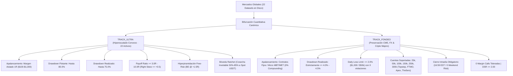
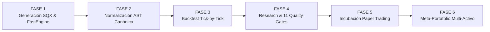

> ⚠️ **SUPERSEDED (2026-08-29)** — Este documento es HISTÓRICO y ya NO es la fuente de verdad. Motivo: doctrina V2 'canónica 2026' sustituida como SSOT; los principios vigentes viven en docs/ULTRARENTABLE_PRINCIPLES.md y .agents/AGENTS.md. **Fuente canónica vigente: `docs/00_MASTER_IDEAS_Y_PLAN.md`.** Contenido conservado intacto solo como referencia histórica. NO actualizar este archivo.

# 🏛️ DOCTRINA MAESTRA DEL SISTEMA: ULTRARENTABLE V2 (CANÓNICO 2026)
### *Especificación Cuantitativa, Matemática, Arquitectura y Directiva Universal Zero-Simulaciones*

---

> [!IMPORTANT]
> **DOCUMENTO CANÓNICO DE ARQUITECTURA Y DOCTRINA (FUENTE DE VERDAD OBLIGATORIA):**
> Este documento rige todas las decisiones de diseño, algoritmos de generación genética, compuertas de validación (*Quality Gates*), modelos de margen, ejecución en vivo y contratos de datos del proyecto **Ultrarentable V2**.
> Cualquier desarrollador o agente de Inteligencia Artificial que trabaje en este repositorio DEBE consultar y acatar estas especificaciones sin desviaciones ni relajación de umbrales.

---

## 🚫 1. GUARDARRAÍLES SUPREMOS: DOCTRINA ZERO-SIMULACIONES (REAL-ONLY)

1. **PROHIBICIÓN TOTAL DE INVENTAR O SIMULAR DATOS:**
   - Queda terminantemente prohibido el uso de funciones aleatorias o generadoras sintéticas (`random`, `randint`, `uniform`, `seed`) en motores de cálculo, validación, APIs, o bases de datos operacionales.
   - Prohibido inventar balances, curvas de equidad, trades, logs de eventos o perfiles de usuario.
2. **CERO FALLBACKS COMPLACIENTES:**
   - Si un servicio, dato o backend no tiene información, se gestiona con estados reales deterministas:
     - Falta de información $\longrightarrow$ `SIN DATOS / NO EVIDENCE`.
     - Fallo de servicio $\longrightarrow$ `ERROR / DESCONECTADO`.
3. **EVIDENCIA FÍSICA OBLIGATORIA Y HASH SHA-256:**
   - Todo dato presentado debe provenir exclusivamente de fuentes físicas reales (bases de datos SQLite WAL `database.sqlite` / `ultrarentable.sqlite3`, archivos en disco o APIs reales de exchanges).
   - Toda estrategia y candidato posee procedencia explícita y hash SHA-256 inmutable derivado de sus reglas AST.
4. **ARQUITECTURA ZERO-TRUST:**
   - La IA propone hipótesis de optimización o debate semántico; el motor de backtest (`FastEngine` / `EventBacktestEngine`) y las compuertas matemáticas (`Evidence Gates`) aprueban o rechazan de forma inmutable. Ningún módulo puede alterar el veredicto de otro.

---

## ⚖️ 2. BIFURCACIÓN DUAL SEGREGADA: TRACK_FONDEO VS TRACK_ULTRA

### 2.1. TRACK_FONDEO: Preservación de Capital y Consistencia Institucional
- **Tesis de Inversión:** El capital pertenece a firmas propietarias (Topstep, Apex, TradeDay, FTMO, Take Profit Trader, The5ers, FundedNext, E8). El objetivo financiero es **extraer flujo de caja mensual recurrente** pasando y manteniendo cuentas fondeadas sin rozar jamás los límites de pérdida.
- **Activos Aceptados:**
  - **Futuros CME:** MES, MNQ, MYM, M2K, GC, CL.
  - **Forex Majors:** EURUSD, GBPUSD, USDJPY, AUDUSD, USDCAD.
  - **Criptoactivos Institucionales:** Micro Bitcoin (`MBT`), Micro Ether (`MET`) en CME Globex, y pares CFD/Crypto (`BTCUSD`, `ETHUSD`) con apalancamiento 1:2 a 1:5 en prop firms autorizadas.
- **Régimen de Riesgo:** Probabilidad de ruina Monte Carlo estricta de **$0.00\%$** en 10,000 simulaciones. Pérdida máxima intradía con **$0$ violaciones**. Cierre forzado de sesión a las **16:59 EST** (cero riesgo *overnight* / *weekend gap*).
- **Prohibiciones Absolutas:** Prohibido el interés compuesto (*compounding*), prohibida la piramidación y prohibido el apalancamiento variable intradía.
- **Rendimiento de Meta-Estrategias en Fondeo:**
  - Una estrategia individual con $+300\%$ de retorno y $35\%$ de drawdown está **muerta y descalificada**.
  - Una meta-estrategia con $+50\%\text{--}80\%$ de retorno y $2.8\%\text{--}3.5\%$ de drawdown es **institucional, aprueba y se fondea**.

### 2.2. TRACK_ULTRA: Hiperescalado Asimétrico, Balas 1R y Convexidad Pura
- **Tesis de Inversión:** Explotación de tendencias no lineales y expansiones parabólicas de volatilidad en los **22 activos globales** (BingX USD-M Perpetuals, Futuros CME y Forex) mediante **convexidad pura de Taleb**. Se acepta un ratio de acierto moderado ($35\% - 45\%$) a cambio de ratios de pago masivos ($\ge 3.0\text{R} - 10.0\text{R}$).
- **Régimen de Balas Sacrificables:** Cada trade opera como una "Bala Aislada" ($1\text{R} = \$100 \text{ a } \$1,000$). La máxima pérdida está sellada a priori en $1\text{R}$. Si la bala falla, muere sin contagio al resto de la cuenta; si captura una tendencia explosiva, escala mediante **piramidación Free-Risk** (financiada exclusivamente con *House Money*).
- **Inmunidad al Freno Conservador:** Aplicar filtros de drawdown del $4.5\%$ a la ruta Ultra destruye la rentabilidad al abortar expansiones de volatilidad natural antes de que la piramidación madure. La tolerancia de drawdown flotante llega al **$80.0\%$** y el drawdown realizado al **$75.0\%$**.
- **Bóveda Ratchet Inviolable:** Para que la convexidad se traduzca en beneficio real tangible, entre el **$50\%$ y el $85\%$** del beneficio se transfiere de forma irrevocable a una Bóveda Spot USDT separada (Ratchet Vault) que jamás se re-arriesga en la misma serie.
- **Rendimiento de Meta-Estrategias en Ultra:**
  - En Ultra, la meta-estrategia no busca "apagar" los retornos explosivos, sino actuar como un **cargador multi-activo descorrelacionado** (ej. BTC + SOL + SUI + NQ). Mientras un activo consolida, otro explota, manteniendo el crecimiento exponencial continuo con Sharpe $> 2.50$.

---

## 🔄 3. PIPELINE CUANTITATIVO DE 6 FASES

1. **FASE 1: Generación e Ingesta de Candidatos (SQX Factory / Autopilot 24/7):**
   - Minería genética continua sobre 22 datasets históricos en disco.
   - Extracción de reglas de entrada/salida y normalización de drawdowns de USD a porcentajes relativos.
2. **FASE 2: Normalización y Traducción Canónica (`contracts/canonical_strategy.py`):**
   - Conversión a AST tipado inmutable `CanonicalStrategy` v2.0.0.
   - Cálculo del Hash SHA-256 de procedencia bit a bit de las reglas.
3. **FASE 3: Backtest Determinista Tick a Tick (`services/api/app/engine/fast_engine.py`):**
   - Ejecución determinista 100% libre de sesgo de anticipación (*lookahead bias*): señales en $t$, ejecución en apertura $t+1$.
   - Modelado microscópico de spreads, comisiones Taker ($0.05\%$) y slippage dinámico por volatilidad.
4. **FASE 4: Quant Validation Fabric (QVF) & 11 Evidence Gates:**
   - Evaluación bifurcada según el track (`TRACK_FONDEO` vs `TRACK_ULTRA`).
   - Stress testing, Deflated Sharpe Ratio (DSR), Monte Carlo de 10,000 iteraciones y Walk-Forward.
5. **FASE 5: Incubación en Paper Trading en Tiempo Real (14 Días Obligatorios):**
   - Validación forward con datos de mercado en vivo (BingX y Rithmic/CME).
   - Telemetría de latencia de ejecución, slippage real y divergencia respecto al backtest ($< 5\%$).
6. **FASE 6: Explotación y Despliegue en Meta-Portafolios Multi-Activo:**
   - Ensamblado multi-activo con asignación de pesos por Paridad de Riesgo Inversa (ERC).
   - Debate dinámico de los 5 agentes IA y certificación inmutable en SQLite WAL.

---

## 🛡️ 4. LAS 11 EVIDENCE GATES MAESTRAS

### Compuertas Universales de Integridad (Gates 1 - 3)
- **GATE 1: DATA INTEGRITY & ANTI-LOOKAHEAD:** Timestamps UTC monótonamente crecientes. Integridad de snapshot con Hash SHA-256 bit a bit. Cero fuga de datos futuros.
- **GATE 2: STATISTICAL SAMPLE SIGNIFICANCE:** Mínimo de trades cerrados: $N \ge 30$ (Fondeo) / $N \ge 45$ ráfagas (Ultra). Cobertura temporal multirégimen.
- **GATE 3: OUTLIER INDEPENDENCE:** Ningún trade individual puede concentrar $> 15\%$ del beneficio neto total.

### Compuertas TRACK_FONDEO (Gates 4 - 7)
- **GATE 4: DEFLATED SHARPE RATIO (DSR):** $\text{DSR} \ge 2.00$ ($p < 0.05$), corregido por asimetría, curtosis y número de ensayos múltiples.
- **GATE 5: MAXIMUM TRAILING DRAWDOWN & INTRADAY STRESS:** Max Realized Drawdown $\le 4.00\% - 4.50\%$ en todo el historial. Cero violaciones de Daily Loss Limit.
- **GATE 6: CONSISTENCY & SMOOTHNESS RATIO:** Regla del 30% de consistencia de prop firm ($\le 30\%$ del beneficio total en cualquier día individual).
- **GATE 7: ZERO RISK OF RUIN MONTE CARLO:** Probabilidad de Ruina $P(\text{Ruin}) = 0.00\%$ en 10,000 iteraciones estocásticas.

### Compuertas TRACK_ULTRA (Gates 8 - 11)
- **GATE 8: FAT TAILS & POSITIVE SKEWNESS:** Asimetría de retornos $\text{Skewness} \ge +0.50$. Tail Gain Ratio $\ge 40.0\%$ (al menos el 40% del profit procede de trades $\ge 3\text{R}$). Payoff Ratio $\ge 3.00$.
- **GATE 9: FRICTION & PYRAMID STRESS RESISTANCE:** Fricción Taker ($0.05\%$) + Slippage adverso (+3 bps por capa). Expectativa neta por bala $\mathbb{E}[R]_{\text{bala}} \ge 0.20\text{R}$.
- **GATE 10: WALK-FORWARD VAULT HARVEST EFFICIENCY (WVE):** $\text{WVE} = \frac{\text{Harvest Rate OOS}}{\text{Harvest Rate IS}} \ge 0.50$. Retención positiva y verificada en la Bóveda Ratchet en OOS.
- **GATE 11: BURST MONTE CARLO SURVIVAL:** Probabilidad de agotar una ráfaga de 10-20 balas $< 1.0\%$ en 10,000 permutaciones en bloque. Percentil 5% (p05) del ROI de Campaña > Capital Base inicial.

---

## 🏛️ 5. MATRIZ DE ASIGNACIÓN MULTI-ACTIVO & COMITÉ DE 5 AGENTES IA

1. **Regla Canónica de Ortogonalidad Dimensional:** Prohibido combinar estrategias que operen el mismo símbolo. Cada componente debe explotar un dataset descorrelacionado.
2. **Matriz de Covarianza y Correlación Empírica Real:** Calculada directamente sobre la serie temporal sincronizada de retornos diarios UTC $R \in \mathbb{R}^{T \times N}$, sin valores fijos ni heurísticas de texto.
3. **Ponderación Equal Risk Contribution (ERC):**
   $$w_i = \frac{1/\sigma_i}{\sum_{j=1}^N 1/\sigma_j}$$
4. **Diversification Ratio Real (Choueifaty):**
   $$DR = \frac{\sum w_i \sigma_i}{\sqrt{w^T \Sigma w}} \ge 1.10\text{x}$$
5. **Comité Cuantitativo de 5 Agentes IA (`PortfolioDebateEngine`):**
   - **Macro & Intermarket (🏦):** Desincronización macro y balance TradFi + Cripto (0-100 pts dinámicos).
   - **Crypto Microstructure (⚡):** Asimetría positiva, convexidad y apalancamiento aislado (0-100 pts dinámicos).
   - **Volatility & Hurst (📈):** Diversification ratio real y porcentaje de compresión de Drawdown (0-100 pts dinámicos).
   - **Risk & Correlation Sentinel (🛡️):** Auditoría estricta de correlación ($\bar{\rho} < 0.35$) y holgura de Drawdown (0-100 pts dinámicos).
   - **Adversarial Stress Tester (⚔️):** Resistencia a Cisne Negro ($1.30 \times DD$), fricción 2x y supervivencia Monte Carlo (0-100 pts dinámicos).
   - **Consenso Cuantitativo:**
     $$ConsensusScore = 0.20 \cdot S_{\text{macro}} + 0.15 \cdot S_{\text{crypto}} + 0.20 \cdot S_{\text{vol}} + 0.25 \cdot S_{\text{sentinel}} + 0.20 \cdot S_{\text{adv}}$$

---

## 📁 6. PERSISTENCIA EN SQLITE WAL Y ALINEACIÓN DE RENDIMIENTO

- **Base de Datos Principal:** `database.sqlite` / `ultrarentable.sqlite3` en modo WAL (`PRAGMA journal_mode=WAL`).
- **Tablas de Verdad:**
  - `candidates`: Estrategias individuales y submáquinas con `scorecard_json` verificado.
  - `portfolios`: Meta-Estrategias ensambladas con `allocation_json` y hash de procedencia.
  - `backtests`: Registros de ejecución determinista y `ledger_path`.
  - `failure_knowledge`: Base de autopsias cuantitativas para veto genético.
- **Frontend Anti-Flicker & Zero-Mocks:** Todas las páginas de resultados (Fases 2, 3, 4, 5 y 6) comparten la tabla Excel unificada con selector de Sheet Tabs (`TODAS`, `FONDEO`, `ULTRA`), control manual de refresco y cero parpadeos.
