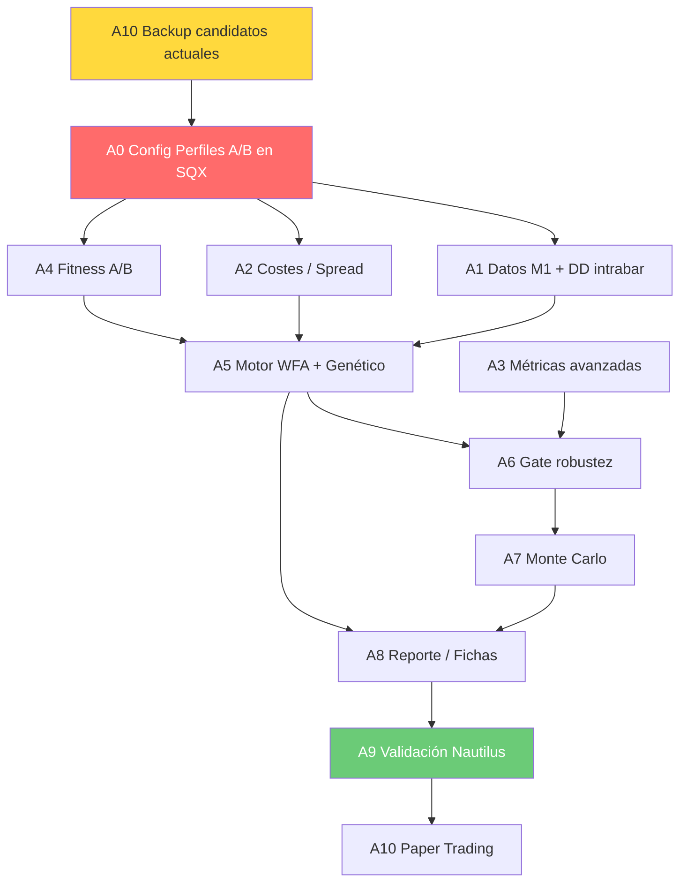

# 06 — Plan de Acción Multiagente Modular
## Implementación de mejoras del buscador SQX · Proyecto Ultrarentable

**Fecha:** 2026-08-09  
**Rol:** Documento de orquestación (accionable por orquestador para despachar subagentes)  
**Fuentes:**
- `plan_implementacion/MEMO_BUSCADOR_PERFILES_A_B.md` — diseño de mejora, agentes A1-A8
- `plan_implementacion/BLUEPRINT_CONTROLADOR_ESTRATEGIAS_MUNDIAL.md` — protocolo de validación
- `plan_implementacion/AUDITORIA_CANDIDATOS_KAMIKAZE.md` — estado actual (0 winners / 24 candidatos)
- `docs/Estado/auditoria/00_INDICE_Y_CABECERA.md` — diagnóstico XML real del SQX
- `plan_implementacion/GUIA_EXPERTO_USAR_SQUANT.md` — integración con GUI real

**Regla REAL-ONLY:** toda métrica proviene de lectura real de API/BD/XML. No se inventan valores.  
**Doctrina NO-SCRIPTS:** la interacción con SQX se hace vía GUI real (`computer_use` sobre Xvfb :99) y MCP (`http://127.0.0.1:8080/mcp`), NO mediante scripts hardcodeados que manipulen XML internos.

---

## 1. TABLA DE AGENTES — Tareas modulares con entregable y criterio de aceptación

| # | Agente | Tarea concreta | Entregable | Criterio de aceptación | Doc destino |
|---|--------|---------------|------------|------------------------|-------------|
| **A0** | **Config SQX (Perfiles A/B)** | Reconfigurar los Custom Projects de SQX creando Perfil A (Growth) y Perfil B (Fondeo) mediante GUI (`computer_use`). Incluye: datos M1/tick, spread realista, WFA activado, MC activado, fitness personalizada, databank ampliado. | Dos Custom Projects operativos en SQX (`Perfil_A_Growth`, `Perfil_B_Fondeo`) con screenshots de verificación de cada parámetro. | ① Los proyectos existen en SQX (verificado vía MCP `list_projects`). ② Cada parámetro crítico coincide con la plantilla `05_plantilla_sqx_perfiles_ab.md`. ③ Screenshot de la pestaña Builder muestra fitness custom, WFA=ON, MC=ON, spread≥2, datos≥2 años. | `auditoria/05_plantilla_sqx_perfiles_ab.md` + screenshots en `auditoria/evidencia/` |
| **A1** | **Datos M1 + DD intrabar** | Descargar datos M1 (o tick) de BTCUSDT via GUI de SQX Data Manager. Verificar que la reconstrucción intrabar de equity funciona (DD intradía ≠ DD sobre cierres). | Datasets M1 cargados en SQX cubriendo ≥2 años (ideal 3+). Informe de verificación DD intrabar vs cierre en un caso conocido. | ① Dataset visible en Data Manager de SQX (screenshot). ② Rango temporal ≥ 730 días. ③ DD intrabar de caso de prueba diverge ≥5% del DD sobre cierres (evidencia real). | `auditoria/07_datos_m1_dd_intrabar.md` |
| **A2** | **Costes / Spread por sesión** | Configurar en SQX spread variable (mínimo spread=2 para BTC), comisión 0.05%, slippage=2. Documentar el spread por sesión (Asia/Londres/NY). | Configuración de costes aplicada en ambos perfiles. Tabla de spread real por sesión con fuente. | ① Spread en Builder ≥ 2 (screenshot). ② Slippage ≥ 2. ③ Backtest de referencia con spread=0 vs spread=2 muestra degradación coherente (PF cae, DD sube). | `auditoria/08_costes_spread_sesion.md` |
| **A3** | **Métricas avanzadas** | Implementar/verificar cálculo de: CAGR, DD intradía, DD diario, Sharpe, tiempo en recuperación, peor mes, WFE, outlier dependency (top-2 trades). | Módulo de métricas funcional (en API o standalone). Suite de tests con curvas sintéticas. | ① Tests pasan con curvas sintéticas conocidas (valor esperado vs calculado, δ < 1%). ② WFE calculable sobre resultados WFA reales de SQX. | `auditoria/09_metricas_avanzadas.md` |
| **A4** | **Fitness A/B con restricciones** | Crear las dos funciones fitness en SQX vía Custom Fitness (GUI): `fitness_A = CAGR_oos × estabilidad` con restricciones Growth; `fitness_B = P(pasar_challenge) × P(sobrevivir_90d)` con restricciones Fondeo. | Fitness custom configuradas en los Custom Projects A y B. Las restricciones son de descarte (no penalización). | ① Fitness visible en Builder de cada perfil (screenshot). ② Candidato con DD>35% es descartado por Perfil A (evidencia). ③ Candidato con DD diario > 60% límite es descartado por Perfil B (evidencia). | `auditoria/10_fitness_ab_restricciones.md` |
| **A5** | **Motor TPE + Walk-Forward** | Activar en SQX: WFA anclado (6+ folds, gap 1 semana), retest con higher precision=ON. Configurar búsqueda con población diversa. NO implementar TPE externo en esta fase — usar el genético de SQX con WFA como validación post-generación. | WFA activado y funcionando en ambos perfiles. Primer run genético completado con WFA. | ① WFA = ON verificado en XML/screenshot. ② Primer batch de estrategias tiene métricas OOS reales (no solo IS). ③ Resultados WFA visibles en databank (columnas OOS). | `auditoria/11_motor_wfa_genetico.md` |
| **A6** | **Gate de robustez (4 pruebas)** | Implementar los 4 gates: sensibilidad de parámetros (±15%), vecindad rentable, coste estresado (spread×2), cross-instrumento. Aplicar sobre candidatos del databank. | Script/módulo de gates ejecutable. Informe de aplicación sobre los primeros candidatos. | ① Candidato sobreajustado conocido (de los 24 actuales) es rechazado por ≥2 gates. ② Cada gate tiene test unitario. ③ Informe documenta qué candidatos pasan/fallan cada gate. | `auditoria/12_gate_robustez.md` |
| **A7** | **Monte Carlo de trades** | Simulador MC: 10k reordenamientos de trades, reportar p5 CAGR, p95 DD, % equity final > 0. Para Perfil B: simulador de challenge (P de pasar). | Módulo MC funcional. Informe MC sobre primeros candidatos que pasen A6. | ① MC ejecutable sobre serie de trades real. ② Candidato con <90% simulaciones equity>0 es marcado como no robusto. ③ P(pasar challenge) calibrada contra reglas reales de fondeadora (evidencia). | `auditoria/13_monte_carlo.md` |
| **A8** | **Reporte / Ficha por estrategia** | Generar ficha completa por candidato: métricas IS/OOS/estresado, WFE, MC, gates, score final (POTENTIAL_WINNER / NEEDS_2ND_MOTOR / REJECTED_OVERFIT). | Template de ficha + fichas generadas para cada candidato que pase A6. | ① Ninguna ficha muestra métricas solo de IS. ② Score final asignado según scorecard de 3 capas. ③ Ficha incluye curva de equity IS+OOS. | `auditoria/14_fichas_estrategias.md` |
| **A9** | **Validación Nautilus (2º motor)** | Traducir candidatos POTENTIAL_WINNER o NEEDS_2ND_MOTOR a NautilusTrader. Ejecutar backtest en mismos datos. Comparar métricas. | Backtest Nautilus completado. Informe comparativo SQX vs Nautilus por candidato. | ① Δ retorno < 10%. ② Δ Max DD < 3pp. ③ Δ Sharpe < 0.5. ④ Si deltas exceden → candidato descartado con evidencia. | `auditoria/15_validacion_nautilus.md` |
| **A10** | **Backup + Paper Trading** | Backup de los 24 candidatos actuales antes de cambios. Preparar paper trading para Champions (post-Nautilus). | Backup verificado. Plan de paper trading con criterios de go/no-go. | ① Backup de BD + estrategias SQX exportadas (archivo .zip con timestamp). ② Paper trading definido: instrumento, duración mín 30 días, criterios de éxito/fallo. | `auditoria/16_backup_paper_trading.md` |

---

## 2. ORDEN DE DEPENDENCIAS Y PARALELIZACIÓN



### Fases paralelas

| Fase | Agentes en paralelo | Bloqueos | Duración estimada |
|------|---------------------|----------|--------------------|
| **Fase 0 — Backup** | A10 (backup) | Ninguno | 1h |
| **Fase 1 — Cimientos** | A0 (config perfiles) + A3 (métricas, independiente) | A0 bloquea a A1/A2/A4 | 4-6h |
| **Fase 2 — Datos y costes** | A1 (datos M1) ∥ A2 (costes) ∥ A4 (fitness) | Todos dependen de A0 | 4-8h |
| **Fase 3 — Generación** | A5 (run genético + WFA) | Depende de A1+A2+A4 | 12-24h (run SQX) |
| **Fase 4 — Filtrado** | A6 (gates) + A7 (MC) | A6 depende de A3+A5; A7 depende de A6 | 4-8h |
| **Fase 5 — Certificación** | A8 (fichas) → A9 (Nautilus) | Secuencial | 8-12h |
| **Fase 6 — Producción** | A10 (paper trading) | Depende de A9 | Continuo (30+ días) |

**Total estimado Fases 0-5:** 48-72 horas.

---

## 3. INTEGRACIÓN DE LA GUI REAL DE SQX (computer_use)

### Doctrina: GUI real, NO scripts hardcodeados

El proyecto prohíbe manipular directamente los XML internos de SQX (`project.cfx`, `Build-Task1.xml`) con scripts. Toda configuración se realiza a través de:

1. **`computer_use` sobre Xvfb :99** — captura SOM, click por elemento, type para valores.
2. **MCP en `http://127.0.0.1:8080/mcp`** — para operaciones soportadas (list_projects, run_project, get_databank, etc.).
3. **Web UI en `http://127.0.0.1:5050`** — para lectura/monitoreo cuando sea más eficiente.

### Protocolo de interacción GUI para cada agente

| Agente | Operación GUI | Método |
|--------|--------------|--------|
| A0 | Crear Custom Project, configurar Builder (fitness, WFA, MC, datos, spread) | `computer_use`: capture(app='java') → click tabs → type valores → verify con capture |
| A1 | Abrir Data Manager, descargar M1/tick, verificar rango | `computer_use`: capture → navegar a Data Manager → configurar descarga → verify |
| A2 | Modificar Settings > Costs en cada perfil | `computer_use`: capture → Settings tab → Costs → type spread/slippage → verify |
| A4 | Crear Custom Fitness formula en Builder | `computer_use`: capture → Fitness tab → Edit formula → type → verify |
| A5 | Activar WFA checkbox, configurar folds, lanzar run | `computer_use` + MCP `run_project` para lanzar; `computer_use` para config previa |
| A6-A7 | Leer resultados del databank para aplicar gates/MC | MCP `get_databank` para extraer métricas; procesamiento local |
| A8 | Exportar estrategias, capturar curvas de equity | `computer_use`: capture equity chart → export strategy file |
| A9 | N/A (Nautilus es externo) | Terminal: ejecutar backtests NautilusTrader |

### Patrón estándar de interacción GUI
```
1. computer_use(action='capture', app='java', mode='som')  → screenshot + AX tree
2. Identificar elemento por índice SOM
3. computer_use(action='click', element=N)                  → navegar
4. computer_use(action='type', text='valor')                → introducir valor
5. computer_use(action='capture', capture_after=true)       → verificar cambio
6. Guardar screenshot como evidencia en auditoria/evidencia/
```

> **Regla de seguridad:** Antes de cualquier cambio destructivo en SQX (eliminar proyecto, borrar databank), el agente debe pedir confirmación al orquestador.

---

## 4. FASE PRIORITARIA: Reconfiguración de Custom Projects (A0)

### ¿Por qué es prioritaria?
La auditoría del `project.cfx` actual (`00_INDICE_Y_CABECERA.md`) reveló que **todos los parámetros críticos están mal configurados**:
- Fitness = retorno neto bruto (sin penalizar DD/estabilidad)
- Spread = 0 (irreal)
- WFA = OFF, Monte Carlo = OFF
- Datos = solo 5.2 meses (insuficiente)
- Databank = capado a 24 estrategias

**Sin corregir esto, cualquier run genético producirá más candidatos overfit.**

### Configuración objetivo por perfil

#### Perfil A — Growth (ULTRA-rentable)
| Parámetro | Valor actual | Valor objetivo | Método de cambio |
|-----------|-------------|----------------|------------------|
| Fitness | NetProfit (bruto) | `CAGR_oos × estabilidad` (custom) | GUI: Builder > Fitness > Custom |
| Datos | BTCUSDT H1, 5.2 meses | BTCUSDT M1, ≥2 años | GUI: Data Manager + Builder > Data |
| Spread | 0 | ≥ 2 (variable si SQX lo permite) | GUI: Builder > Settings > Costs |
| Slippage | 1 | 2 | GUI: Builder > Settings > Costs |
| WFA | OFF | ON (6 folds, gap 5 barras M1) | GUI: Builder > Cross Checks > WFA |
| Monte Carlo | OFF | ON (reordering + parameter perturbation) | GUI: Builder > Cross Checks > MC |
| Precision | 1 (Selected TF) | 2+ (Every tick o M1) | GUI: Builder > Settings > Precision |
| MaxStrategies | 24 | 200+ | GUI: Builder > Databank > Max |
| Kelly sizing | NO | Fracción Kelly acotada f∈[0.005, 0.05] | GUI: Builder > Money Management |
| Restricciones | maxDD=30% | trades_oos≥150, folds_pos≥70%, maxDD_intradía≤35%, peor_mes≥-20% | GUI: Custom Fitness |

#### Perfil B — Fondeo (DD diario estricto)
| Parámetro | Valor actual | Valor objetivo | Método de cambio |
|-----------|-------------|----------------|------------------|
| Fitness | NetProfit (bruto) | `P(pasar_challenge) × P(sobrevivir_90d)` (custom) | GUI: Custom Fitness |
| DD diario | No medido intrabar | maxDD_diario_intradía ≤ 0.6 × límite fondeadora | GUI: Custom Fitness restricción |
| DD total | maxDD=30% | maxDD_total_intradía ≤ 0.5 × límite total | GUI: Custom Fitness restricción |
| Datos | H1, 5.2 meses | M1, ≥2 años (mismo que A) | GUI: Data Manager |
| Spread/Slip | 0/1 | ≥2 / ≥2 | GUI: Settings > Costs |
| WFA | OFF | ON (6 folds) | GUI: Cross Checks |
| MC | OFF | ON | GUI: Cross Checks |

### Checklist de verificación A0
- [ ] Backup completo realizado (A10 previo)
- [ ] Perfil A creado como Custom Project en SQX
- [ ] Perfil B creado como Custom Project en SQX
- [ ] Todos los parámetros verificados con screenshot
- [ ] MCP `list_projects` devuelve ambos proyectos
- [ ] Un test run corto (5 min) confirma que SQX arranca sin errores

---

## 5. VALIDACIÓN NAUTILUS — 2º Motor Obligatorio

### Rol de NautilusTrader en el pipeline
NautilusTrader es el **motor de backtest canónico del proyecto** (decisión tomada y documentada). Todo candidato que pase los gates de SQX (A6+A7+A8) **debe ser re-validado en Nautilus** antes de pasar a paper trading.

### Flujo de validación
```
Candidato pasa A8 (ficha score ≥ NEEDS_2ND_MOTOR)
    ↓
Exportar lógica de SQX (archivo .java/.mql → pseudocódigo → Python/Nautilus)
    ↓
Configurar backtest Nautilus con MISMOS datos y costes
    ↓
Ejecutar backtest Nautilus
    ↓
Comparar métricas clave:
  • Δ retorno total < 10%
  • Δ Max DD < 3 puntos porcentuales
  • Δ Sharpe < 0.5
    ↓
¿Deltas aceptables?
  SÍ → CHAMPION (avanza a paper trading)
  NO → REJECTED (documentar discrepancia, buscar causa: lookahead bias, bug, diferencia de motor)
```

### Umbrales de aceptación Nautilus
| Métrica | Tolerancia máxima | Acción si excede |
|---------|-------------------|------------------|
| Retorno total | ±10% relativo | Investigar diferencia de fills/spread |
| Max Drawdown | ±3 pp absolutos | Investigar manejo de equity intrabar |
| Sharpe Ratio | ±0.5 absoluto | Investigar cálculo de volatilidad |
| Número de trades | ±5% relativo | Investigar señales de entrada/salida |
| Profit Factor | ±0.2 absoluto | Investigar distribución de P&L |

### Prerrequisitos para A9
- NautilusTrader instalado y funcional en la VPS
- Adaptador de datos BingX/BTCUSDT configurado
- Traductor SQX→Nautilus operativo (manual o semi-automático)
- Datos M1 identicos cargados en ambos motores

---

## 6. ROADMAP 48-72h — Hitos concretos y revisables

### Cronograma detallado

| Hito | Hora (desde T0) | Agente(s) | Entregable verificable | Gate de paso |
|------|-----------------|-----------|------------------------|---------------|
| **H0 — Backup** | T+0h → T+1h | A10 | `.zip` de BD + estrategias exportadas | Archivo existe, tamaño > 0, puede descomprimirse |
| **H1 — Perfiles A/B creados** | T+1h → T+6h | A0 | Custom Projects en SQX con config correcta | Screenshots + MCP `list_projects` confirma |
| **H2 — Datos M1 descargados** | T+1h → T+8h | A1 (∥ con A0/A2) | Dataset M1 ≥2 años en Data Manager | Screenshot Data Manager con rango temporal |
| **H3 — Costes configurados** | T+6h → T+8h | A2 | Spread≥2, slip≥2 en ambos perfiles | Screenshot Settings + backtest degradado |
| **H4 — Métricas implementadas** | T+1h → T+8h | A3 (∥ con todo) | Módulo de métricas + tests pasando | `pytest` 0 fallos |
| **H5 — Fitness custom activa** | T+6h → T+10h | A4 | Fitness A y B en Builder | Screenshot Fitness tab |
| **H6 — Primer run genético A** | T+10h → T+30h | A5 | Batch ≥50 estrategias con WFA OOS | Databank con columnas OOS pobladas |
| **H7 — Primer run genético B** | T+10h → T+30h | A5 (∥ con H6) | Batch ≥50 estrategias fondeo | Databank con columnas OOS pobladas |
| **H8 — Gates aplicados** | T+30h → T+36h | A6 | Informe de gates sobre batch H6/H7 | ≥1 candidato pasa ≥3/4 gates (o doc de 0 pasan) |
| **H9 — Monte Carlo** | T+36h → T+40h | A7 | MC sobre candidatos que pasaron A6 | Informe MC con percentiles |
| **H10 — Fichas generadas** | T+40h → T+44h | A8 | Fichas completas con score final | Score asignado a cada candidato |
| **H11 — Validación Nautilus** | T+44h → T+56h | A9 | Backtest Nautilus de POTENTIAL_WINNER | Deltas dentro de tolerancia |
| **H12 — Paper trading listo** | T+56h → T+60h | A10 | Plan de paper trading activado | Criterios go/no-go documentados |

### Diagrama temporal (48-72h)

```
Hora:  0    4    8    12   16   20   24   28   32   36   40   44   48   52   56   60   64   68   72
       |----|----|----|----|----|----|----|----|----|----|----|----|----|----|----|----|----|----|----|

A10:   ██ backup
A0:    ▓▓▓▓▓▓▓▓▓ perfiles A/B
A1:       ▓▓▓▓▓▓▓▓▓▓▓ datos M1                    (paralelo con A0 parcial)
A2:              ▓▓▓▓ costes                        (tras A0)
A3:    ▓▓▓▓▓▓▓▓▓▓▓ métricas                        (independiente)
A4:              ▓▓▓▓▓▓ fitness                     (tras A0)
A5:                    ▓▓▓▓▓▓▓▓▓▓▓▓▓▓▓▓▓▓▓▓▓▓▓▓▓▓ run genético (larga, 12-20h)
A6:                                            ▓▓▓▓▓▓▓▓ gates
A7:                                                    ▓▓▓▓▓▓ MC
A8:                                                          ▓▓▓▓▓▓ fichas
A9:                                                                ▓▓▓▓▓▓▓▓▓▓▓▓▓ Nautilus
A10:                                                                             ▓▓▓▓ paper plan

Revisiones del orquestador: ★ en H1, H6/H7, H8, H10, H11
```

### Puntos de revisión del orquestador

| Revisión | Momento | Qué se revisa | Decisión |
|----------|---------|---------------|----------|
| **R1** | Tras H1 | Config A/B correcta | Go/No-go para descargar datos y lanzar runs |
| **R2** | Tras H6/H7 | Calidad del primer batch | ¿Reconfigurar y relanzar? ¿Ampliar población? |
| **R3** | Tras H8 | Resultados gates | ¿Hay candidatos viables? Si 0 pasan, rediseñar espacio de búsqueda |
| **R4** | Tras H10 | Fichas con scores | ¿Hay POTENTIAL_WINNER para Nautilus? Si solo NEEDS_2ND_MOTOR, enviar igualmente |
| **R5** | Tras H11 | Validación Nautilus | Go/No-go para paper trading |

---

## 7. DOCUMENTACIÓN — Dónde se guarda cada entregable

Todos los entregables se documentan bajo `docs/Estado/auditoria/` con numeración secuencial:

| Archivo | Agente | Contenido |
|---------|--------|----------|
| `00_INDICE_Y_CABECERA.md` | Orquestador | Índice + diagnóstico de cabecera (ya existe) |
| `01_matriz_causa_raiz.md` | Auditor | Matriz de errores principales (ya existe) |
| `02_configuracion_actual_sqx.md` | Auditor | Configuración real extraída del XML (ya existe) |
| `03_diagnostico_plantilla_sqx_real.md` | Agente 1 | Auditoría profunda del Build-Task1.xml |
| `04_pipeline_validacion_multimotor.md` | Agente 2 | Pipeline SQX→Nautilus + gates |
| `05_plantilla_sqx_perfiles_ab.md` | Agente 3 | Plantillas Builder para Perfil A y B |
| **`06_plan_accion_multiagente.md`** | **Agente 4** | **Este documento** |
| `07_datos_m1_dd_intrabar.md` | A1 | Verificación datos M1 + DD intrabar |
| `08_costes_spread_sesion.md` | A2 | Costes, spread por sesión |
| `09_metricas_avanzadas.md` | A3 | Métricas: CAGR, WFE, Sharpe, outlier dep. |
| `10_fitness_ab_restricciones.md` | A4 | Fitness custom + restricciones duras |
| `11_motor_wfa_genetico.md` | A5 | Configuración WFA + resultados primer run |
| `12_gate_robustez.md` | A6 | 4 gates de robustez aplicados |
| `13_monte_carlo.md` | A7 | Simulación MC + percentiles |
| `14_fichas_estrategias.md` | A8 | Fichas por candidato con score final |
| `15_validacion_nautilus.md` | A9 | Backtest Nautilus + comparativa |
| `16_backup_paper_trading.md` | A10 | Backup + plan paper trading |
| `evidencia/` | Todos | Screenshots, exports, logs de verificación |

### Convenciones de documentación
- **Cada documento incluye:** fecha, agente autor, fuentes, regla REAL-ONLY.
- **Evidencia obligatoria:** todo claim se respalda con screenshot, output de comando, o lectura de API/BD.
- **No se inventan métricas:** si un valor no es computable, se documenta como "no computable" con la razón.
- **Formato de métricas:** siempre indicar IS/OOS, periodo, instrumento, y costes usados.

---

## 8. RESUMEN EJECUTIVO PARA EL ORQUESTADOR

### Acción inmediata (T+0)
1. **Ejecutar A10 (backup)** — proteger los 24 candidatos actuales.
2. **Despachar A0 (config perfiles)** — es el bloqueante principal.
3. **Despachar A3 (métricas)** en paralelo — no tiene dependencias.

### Cadena crítica
```
A10(backup) → A0(perfiles) → [A1∥A2∥A4] → A5(run genético) → A6(gates) → A7(MC) → A8(fichas) → A9(Nautilus) → A10(paper)
```

### Riesgos identificados

| Riesgo | Probabilidad | Impacto | Mitigación |
|--------|-------------|---------|------------|
| Run genético no produce candidatos viables (como los 24 actuales) | Media | Alto | Revisar config en R2; ampliar espacio de búsqueda (multi-TF, filtros sesión/régimen) |
| Datos M1 no disponibles para ≥2 años en SQX | Baja | Alto | Descargar de fuente externa (BingX API, Binance) e importar |
| Nautilus no puede reproducir lógica SQX | Media | Medio | Empezar con estrategias simples; crear traductor semi-automático |
| SQX GUI inestable bajo `computer_use` | Baja | Medio | Fallback a MCP para operaciones soportadas |
| Run genético tarda >24h | Media | Medio | Reducir población inicial, aumentar después si hay tracción |

### Criterio de éxito del plan completo
**Mínimo:** ≥1 candidato con score POTENTIAL_WINNER validado en Nautilus y listo para paper trading.  
**Deseable:** ≥3 candidatos diversificados (≥2 familias de estrategia) con WFE≥0.60, MC>90% positivo, deltas Nautilus dentro de tolerancia.

---

*Documento generado como entregable del Agente 4 (planificación). Accionable por el orquestador para despachar subagentes A0-A10 según el orden de dependencias definido.*
