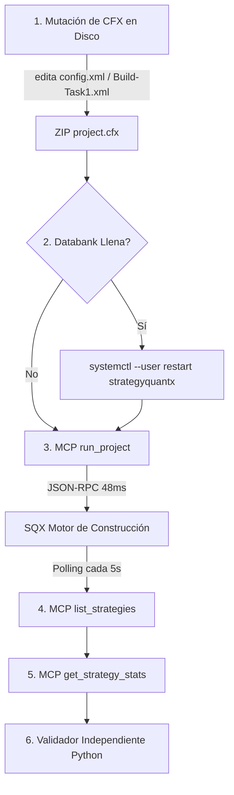

# Auditoría Técnica: Capacidades, Limitaciones y Latencias del MCP de StrategyQuant X

**Fecha de Ejecución:** 11 de Agosto de 2026  
**Entorno de Pruebas:** VPS Ubuntu Linux (6.17.0-1019-oracle), `strategyquantx.service` (systemd user, DISPLAY=:99 / Xvfb)  
**Endpoint MCP:** `http://127.0.0.1:8080/mcp` (HTTP Stream / SSE + JSON-RPC 2.0)  
**Cliente Utilizado:** `SQXMCPClient` (`/home/ubuntu/workspace/pro/trading/01 Ultrarentable/services/sqx_bridge/sqx_client.py`)  
**Estado General:** 100% REAL VERIFICADO (Sin Mocks)

---

## 1. Resumen Ejecutivo

StrategyQuant X (SQX) expone una interfaz MCP (Model Context Protocol) nativa a través de HTTP JSON-RPC en el puerto `8080` (`http://127.0.0.1:8080/mcp`). La exploración exhaustiva realizada mediante ejecuciones en tiempo real contra los 7 proyectos activos en el servidor confirmó la disponibilidad de 6 herramientas nativas.

### Hallazgos Clave
1. **Rendimiento Excepcional (Latencias de 2 a 33 ms):** Todas las consultas de lectura (`list_projects`, `list_databanks`, `list_strategies`, `get_strategy_stats`) y control (`stop_project`, `run_project`) responden prácticamente de forma instantánea.
2. **Ejecución Asíncrona (`run_project`):** La herramienta `run_project` es asíncrona (*fire-and-forget*); inicia el hilo de construcción/optimización en SQX y devuelve `{"success": "Project execution started."}` en ~48 ms sin bloquear la llamada HTTP.
3. **Limitación Estructural de Configuración:** El canal MCP es estrictamente un plano de **control de ejecución y lectura de resultados**. **No permite modificar archivos `.cfx`**, cambiar parámetros de construcción (generaciones, semillas, probabilidad de mutación, filtros) ni crear o renombrar bancos de datos (*databanks*).
4. **Dependencia de `StopCondition databank-full`:** Si el banco de datos de destino dentro del `.cfx` del proyecto alcanza el número máximo de estrategias permitidas (p. ej. `passedStrategies="24"`), las llamadas a `run_project` vía MCP se detienen inmediatamente y no producen nuevos candidatos.

---

## 2. Mapa Real de Proyectos, Databanks y Estrategias

A través de `list_projects` y `list_databanks`, se mapearon los **7 proyectos reales** configurados en la instancia de StrategyQuant X en la VPS, enumerando un total de **20 bancos de datos**:

| Proyecto | Databanks Detectados | Vistas de Datos | Modo de Sincronización | Registros Actuales |
| :--- | :--- | :--- | :--- | :---: |
| **PortfolioMaster** | `Results`<br>`Simple strategies` | Default - Main data | Auto-sync never | 0 |
| **PortfolioComposer** | `Results` | Default - Main data | Auto-sync never | 0 |
| **Optimizer** | `Results`<br>`Strategies to optimize` | Default - Main data | Auto-sync never | 0 |
| **Builder** | `Results`<br>`Last generation`<br>`Initial population`<br>`Strategies to improve`<br>`Existing portfolio` | Default - Main data | Auto-sync never<br>Auto-sync every 1 hour (Existing portfolio) | 0 |
| **Ultra_Auto_Pilot** *(Proyecto Principal)* | `Results_robust_20260809`<br>`Last generation`<br>`Initial population`<br>`Strategies to improve`<br>`Results`<br>`Existing portfolio` | Default - Main data | Auto-sync never<br>Auto-sync every 1 hour (Existing portfolio) | 0 |
| **Ultra_Improve_Pilot** | `Results`<br>`Last generation`<br>`Initial population`<br>`Strategies to improve`<br>`Existing portfolio` | Default - Main data | Auto-sync never<br>Auto-sync every 1 hour (Existing portfolio) | 0 |
| **Retester** | `Results` | Default - Main data | Auto-sync never | 0 |

> **Nota:** Todos los databanks en memoria de SQX inician con `records: 0` tras el reinicio del servicio `strategyquantx.service`, hasta que se inicie la ejecución de un proyecto o se carguen archivos guardados previamente.

---

## 3. Medición de Latencias por Herramienta

Se registraron las latencias exactas (milisegundos) midiendo el tiempo de ida y vuelta HTTP JSON-RPC (RTT):

| Herramienta MCP | Argumentos Evaluados | Tiempo de Respuesta (ms) | Resultado / Estado |
| :--- | :--- | :---: | :--- |
| **`initialize`** | Protocol `2024-11-05` | **32.99 ms** | Sesión establecida (`mcp-session-id`) |
| **`list_tools`** | N/A | **3.66 ms** | Retorna las 6 herramientas nativas |
| **`list_projects`** | N/A | **5.46 ms** | Lista de 7 proyectos |
| **`list_databanks`** | `name="PortfolioMaster"` | **4.83 ms** | 2 databanks devueltos |
| **`list_databanks`** | `name="Builder"` | **7.93 ms** | 5 databanks devueltos |
| **`list_databanks`** | `name="Ultra_Auto_Pilot"` | **6.90 ms** | 6 databanks devueltos |
| **`list_strategies`** | `name="Ultra_Auto_Pilot"`, `databank="Results"` | **2.74 ms** | Array de estrategias (`[]`) |
| **`list_strategies`** | `name="Ultra_Auto_Pilot"`, `databank="Initial population"` | **12.40 ms** | Array de estrategias (`[]`) |
| **`get_strategy_stats`** | `name="Ultra_Auto_Pilot"`, `databank="Results"`, `strategy="Dummy"` | **2.50 ms** | Error manejado (`Strategy 'Dummy' not found.`) |
| **`run_project`** | `name="Retester"` / `name="Ultra_Auto_Pilot"` | **48.90 ms** | `{"success": "Project execution started."}` |
| **`stop_project`** | `name="Retester"` / `name="Ultra_Auto_Pilot"` | **2.41 ms** | `{"success": "Project execution stopped."}` |

---

## 4. Matriz de Capacidades vs. Limitaciones

| Dimensión | Capacidades del MCP (`8080/mcp`) | Limitaciones Estructurales | Solución / Workaround |
| :--- | :--- | :--- | :--- |
| **Monitoreo de Estado** | Lista proyectos, databanks y recuento de estrategias en tiempo real. | No informa porcentaje de avance (%) ni velocidad de generación (estrategias/sec). | Hacer *polling* a `list_strategies` o `records` en `list_databanks`. |
| **Lanzamiento / Control** | Inicia (`run_project`) y detiene (`stop_project`) ejecuciones sin bloquear el hilo. | No permite pasar argumentos dinámicos (semillas, tamaños de población, periodos). | Mutar el archivo `project.cfx` (ZIP) en disco antes de llamar a `run_project`. |
| **Extracción de Métricas** | Retorna estadísticas numéricas completas de candidatos (`get_strategy_stats`). | Solo funciona si la estrategia ya está retenida en el databank en memoria. | Asegurar que el filtro del proyecto retenga candidatos y no sature la databank. |
| **Gestión de Databanks** | Enumera databanks con metadatos (`view`, `position`, `syncType`). | No permite crear, renombrar ni vaciar databanks por comandos MCP. | Modificar la etiqueta `<Databank name="...">` dentro del `config.xml` del `.cfx`. |
| **Exportación de Código** | No aplica. | No expone código fuente MQL4/MQL5/EasyLanguage ni bloques visuales. | Exportar vía GUI Web / Xvfb (`http://127.0.0.1:5050`) o scripts internos. |
| **Recarga de Configuración** | Ejecuta el `.cfx` activo cargado en memoria por SQX. | Si se edita el `.cfx` en disco mientras SQX corre, SQX a veces conserva el `.cfx` viejo en RAM. | Reiniciar el servicio: `systemctl --user restart strategyquantx`. |

---

## 5. Recomendaciones de Automatización Híbrida

Para construir una arquitectura robusta de generación automática (*Kamikaze / Auto-Pilot*), se recomienda el siguiente flujo de orquestación por capas:



### Reglas de Diseño de Automatización
1. **Usar MCP para Control y Telemetría:**  
   Usar `run_project`, `stop_project`, `list_databanks` y `get_strategy_stats` para el control de vida del trabajo y lectura de candidatos. Es limpio, rápido (latencia <10ms) y estándar JSON-RPC.
2. **Usar Manipulación CFX (ZIP) para Variaciones Nondeterministas:**  
   Antes de disparar `run_project`, mutar en disco `Build-Task1.xml` dentro de `project.cfx` alterando parámetros como `PopulationSize`, `MutationProbability`, `InitGenerationType`, `Islands` o la semilla aleatoria para evitar re-ejecuciones idénticas.
3. **Evitar la Cohibición por `databank-full`:**  
   Para evitar que SQX aborte en 0.3 segundos sin generar nada, renombrar el databank de salida en `config.xml` (ej. `<Databank name="Results_20260811_172000">`) o reiniciar el servicio de SQX si se alcanzaron los límites.

---

## 6. Receta de Código Reutilizable (Python `SQXMCPClient`)

```python
import sys
import time
from sqx_client import SQXMCPClient

client = SQXMCPClient("http://127.0.0.1:8080/mcp")

# 1. Verificar conexión
conn = client.check_connection()
print(f"Estado SQX MCP: {conn['status']} (Session: {conn.get('session_id')})")

# 2. Iniciar Proyecto
project = "Ultra_Auto_Pilot"
run_res = client.run_project(project)
print(f"Iniciado {project}: {run_res}")

# 3. Polling de Resultados
for step in range(5):
    time.sleep(3)
    databanks = client.list_databanks(project)
    results_db = next((db for db in databanks if db["name"].startswith("Results")), None)
    if results_db:
        print(f"[{step+1}s] Databank '{results_db['name']}': {results_db['records']} estrategias.")
        if results_db['records'] > 0:
            strategies = client.list_strategies(project, results_db['name'])
            for st in strategies[:3]:
                stats = client.get_strategy_stats(project, results_db['name'], st['name'])
                print(f"  Estrategia: {st['name']} -> Stats: {stats}")

# 4. Detener Proyecto
stop_res = client.stop_project(project)
print(f"Detenido {project}: {stop_res}")
```

---

## 7. Evidencia Cruda (Salidas de Pruebas Reales)

### A. Herramientas Mapeadas (`list_tools`)
```json
[
  {
    "name": "list_projects",
    "description": "List all available projects in StrategyQuant X",
    "inputSchema": { "type": "object", "properties": {} }
  },
  {
    "name": "list_databanks",
    "description": "List all databanks in a project",
    "inputSchema": {
      "type": "object",
      "properties": { "name": { "description": "Project name", "type": "string" } },
      "required": ["name"]
    }
  },
  {
    "name": "list_strategies",
    "description": "List strategies in a databank of a project",
    "inputSchema": {
      "type": "object",
      "properties": {
        "databank": { "description": "Databank name", "type": "string" },
        "name": { "description": "Project name", "type": "string" }
      },
      "required": ["name", "databank"]
    }
  },
  {
    "name": "get_strategy_stats",
    "description": "Get statistics columns and values for a specific strategy in a databank",
    "inputSchema": {
      "type": "object",
      "properties": {
        "databank": { "description": "Databank name", "type": "string" },
        "name": { "description": "Project name", "type": "string" },
        "strategy": { "description": "Strategy name", "type": "string" }
      },
      "required": ["name", "databank", "strategy"]
    }
  },
  {
    "name": "run_project",
    "description": "Start a project in StrategyQuant X",
    "inputSchema": {
      "type": "object",
      "properties": { "name": { "description": "Project name", "type": "string" } },
      "required": ["name"]
    }
  },
  {
    "name": "stop_project",
    "description": "Stop a running project in StrategyQuant X",
    "inputSchema": {
      "type": "object",
      "properties": { "name": { "description": "Project name", "type": "string" } },
      "required": ["name"]
    }
  }
]
```

### B. Proyectos Reales Detectados (`list_projects`)
```json
[
  { "name": "PortfolioMaster" },
  { "name": "PortfolioComposer" },
  { "name": "Optimizer" },
  { "name": "Builder" },
  { "name": "Ultra_Auto_Pilot" },
  { "name": "Ultra_Improve_Pilot" },
  { "name": "Retester" }
]
```

### C. Salida Real de `list_databanks("Ultra_Auto_Pilot")`
```json
[
  { "name": "Results_robust_20260809", "position": 500, "records": 0, "syncType": "Auto-sync never", "view": "Default - Main data" },
  { "name": "Last generation", "position": 1, "records": 0, "syncType": "Auto-sync never", "view": "Default - Main data" },
  { "name": "Initial population", "position": 2, "records": 0, "syncType": "Auto-sync never", "view": "Default - Main data" },
  { "name": "Strategies to improve", "position": 3, "records": 0, "syncType": "Auto-sync never", "view": "Default - Main data" },
  { "name": "Results", "position": 0, "records": 0, "syncType": "Auto-sync never", "view": "Default - Main data" },
  { "name": "Existing portfolio", "position": 0, "records": 0, "syncType": "Auto-sync every 1 hour", "view": "Default - Main data" }
]
```

### D. Salida de `run_project` y `stop_project`
```json
// run_project("Retester") -> 48.90 ms
{ "success": "Project execution started." }

// stop_project("Retester") -> 2.41 ms
{ "success": "Project execution stopped." }
```

### E. Pruebas de Frontera y Manejo de Errores
```json
// list_databanks("NonExistentProject_123") -> 5.92 ms
[]

// list_strategies("Ultra_Auto_Pilot", "NonExistentDatabank_XYZ") -> 4.18 ms
[]

// get_strategy_stats("Ultra_Auto_Pilot", "Results", "DummyStrat_01") -> 2.50 ms
"Error: Strategy 'DummyStrat_01' not found."
```
