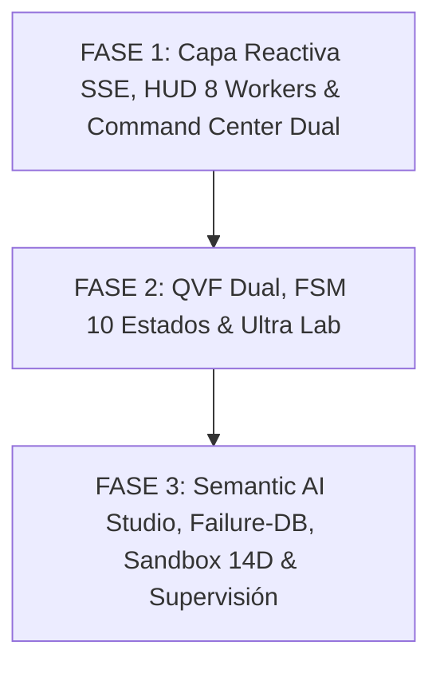

# PLAN ADAPTATIVO DE ADAPTACIÓN DE LA WEB INTERFACE (3 FASES) — ULTRARENTABLE V2 (2026)

> **Directiva:** REAL-ONLY. Toda la interfaz web debe consumir exclusivamente datos reales del backend FastAPI (`/api/v2/`), eventos Server-Sent Events (SSE) y contratos Pydantic v2 inmutables con hashes SHA-256 de procedencia. Prohibidos mocks y fallbacks ficticios.
> **Ubicación de Documentación:** `/home/ubuntu/workspace/pro/trading/01 Ultrarentable/docs/Investigacion/05_PLAN_ADAPTACION_WEB_INTERFACE_3_FASES.md`

---

## 🗺️ Mapa de las 3 Fases de Adaptación Web

---

## 📌 DESGLOSE DE LAS 3 FASES

### 🔹 FASE 1: Capa Reactiva SSE, HUD Global de 8 Workers y Command Center Dual
- **Alcance:**
  1. **Contratos TypeScript (`apps/web/types/`):** Modelos estrictos sincronizados con `contracts/` de backend (`CanonicalStrategy`, `StrategyLifecycleStatus`, `TelemetryMessage`, `WorkerStatusRecord`, `SystemHealthResponse`, `ValidationTrack`).
  2. **Cliente Reactivo SSE (`apps/web/hooks/useTelemetryStream.ts`):** Conexión no bloqueante a `/api/v2/telemetry/stream` con auto-reconexión exponencial, buffer circular inmutable de logs y fallback a `/api/v2/telemetry/health`.
  3. **TopBar HUD Global (`apps/web/components/layout/Header.tsx`):** Barra superior con badges vivos para los 8 Workers (`DataWorker`, `SQXWorker`, `FastBacktestWorker`, `ValidationWorker`, `MonteCarloWorker`, `SemanticAIWorker`, `PortfolioWorker`, `PaperTradingWorker`).
  4. **Navegación Modular (`apps/web/components/layout/Sidebar.tsx`):** Menú estructurado por áreas cuantitativas V2 (`Command Center`, `Ultra Lab`, `Candidatos FSM`, `Bifurcación QVF`, `IA Semántica & Failure-DB`, `Paper Sandbox`, `Fondeo CME`, `Supervisión`).
  5. **Command Center V2 (`apps/web/app/page.tsx`):**
     - Selector dinámico de doctrina: `TRACK_FONDEO (CME / Prop 50K)` vs `TRACK_ULTRA (BingX USD-M Perpetuals)`.
     - Tarjetas de KPIs del `SystemSupervisor` en vivo.
     - Widget de Bóveda Ratchet en tiempo real.
     - Tabla canónica de candidatos con hashes SHA-256 verificados.

---

### 🔹 FASE 2: Quant Validation Fabric Dual, FSM de 10 Estados y Ultra Lab
- **Alcance:**
  1. **Visualizador de FSM (`apps/web/app/candidatos/page.tsx`):**
     - Máquina de Estados Finitos de 10 estados discretos (`GENERATED` $\to$ `BACKTESTED` $\to$ `OOS_PASSED` $\to$ `ROBUSTNESS_PASSED` $\to$ `EVIDENCE_APPROVED` $\to$ `CANDIDATE` $\to$ `INCUBATION_PAPER` $\to$ `LIVE_ACTIVE` $\to$ `REJECTED` / `RETIRED`).
     - Historial inmutable de transiciones y firma SHA-256 de procedencia.
  2. **Compuertas QVF Dual (`apps/web/app/bifurcacion/page.tsx`):**
     - Tab `TRACK_FONDEO`: Criterios restrictivos CME ($DSR \ge 2.0$, Max DD $\le 4.5\%$, 0 violaciones DLL, Outliers Top 2 $< 15\%$).
     - Tab `TRACK_ULTRA`: Criterios de convexidad extrema (Payoff Ratio $\ge 3.0$, Skewness $\ge 1.5$, Tail Gain $\ge 60\%$, $E(Bala) \ge 0.20R$).
  3. **Ultra Lab & Bóveda Ratchet (`apps/web/app/ultra/page.tsx`):**
     - Simulador interactivo de ráfagas de 20 balas para BingX USD-M Perpetuals en margen aislado.
     - Ciclo de vida visual de la bala en 6 estados (`INICIO`, `CONFIRMACION`, `CRECIMIENTO_RECYCLING`, `COSECHA_VAULT`, `PROTECCION`, `CIERRE`).
     - Piramidación House Money ($40\%$) con $SL_{\text{FreeRisk}} \ge +0.5R$.
     - Visualizador 3D/Canvas de la Bóveda de Cosecha Ratchet ($2x \to 50\%, 3x \to 65\%, 5x \to 75\%, 10x \to 85\%$).
  4. **Panel Fondeo CME (`apps/web/app/fondeo/page.tsx`):**
     - Challenge 5D, reglas de prop firms (Topstep, MFFU), trailing drawdown intra-trade y matriz de correlación.

---

### 🔹 FASE 3: Semantic AI Studio, Failure-DB Explorer, Paper Sandbox 14 Días y Supervisión
- **Alcance:**
  1. **Failure-DB & Semantic AI Studio (`apps/web/app/research/page.tsx`):**
     - Explorador de las 11 categorías de fallos cuantitativos (`FailureKnowledgeDB`).
     - Radar interactivo de patrones en lista negra y top indicadores fallidos.
     - Panel de los 5 agentes IA (`Interpreter`, `Critic`, `Improver`, `RegimeAnalyst`, `AdversarialResearcher`) con trazabilidad de mutaciones aprobadas por el Evidence Gate.
  2. **Paper Trading Sandbox (`apps/web/app/ejecucion/page.tsx`):**
     - Contador regresivo de incubación en vivo de 14 días.
     - Gráfico mark-to-market de fills con latencia de 50ms y slippage dinámico.
     - Medidor continuo de degradación estadística respecto al backtest baseline ($|\Delta \text{Sharpe}| \le 30\%$, $\text{Max DD} \le 1.25\times$).
     - Disparador de promoción automática a `LIVE_ACTIVE` o rechazo/retiro.
  3. **Centro de Supervisión y Resiliencia (`apps/web/app/sistema/page.tsx`):**
     - Consola de logs de eventos canónicos en streaming SSE.
     - Panel de control de los 8 workers con métricas de throughput y estado de self-healing.
