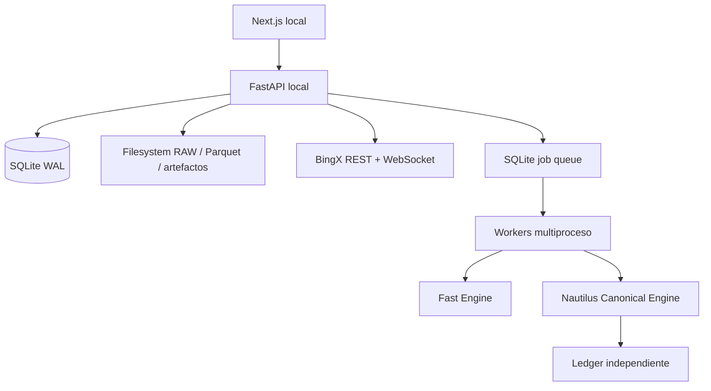

# Arquitectura objetivo — local first

## Principios

- Sin Docker obligatorio.
- Rutas portables.
- Una base SQLite para el MVP.
- Artefactos grandes fuera de la base de datos.
- Procesos locales con límites configurables.
- Interfaces preparadas para sustituir SQLite por PostgreSQL y la cola local por Ray en el futuro.
