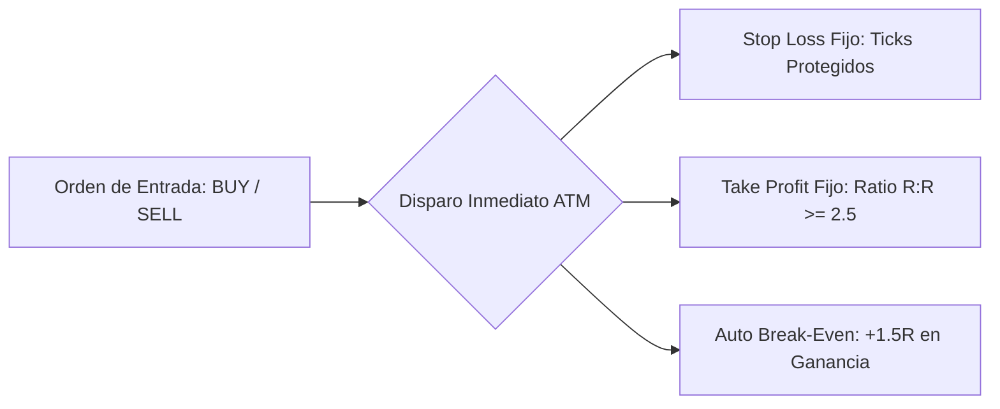

# 📘 Runbook Operativo: Sistema de Pruebas en Demo NinjaTrader 8 (Sim101) & Ultrarentable V2

> **Objetivo:** Configurar y operar un entorno de simulación idéntico a una evaluación de Prop Firm ($50,000 USD, reglas CME reales) o subcuenta hiper-rentable ($1,000 USD) utilizando datos en tiempo real de CME y conectividad con Ultrarentable V2.

---

## 1. Configuración de la Cuenta de Prueba (`Sim101`)

### 1.1 Calibración del Balance Inicial
1. En NinjaTrader 8, dirígete a la ventana principal (**Control Center**).
2. Haz clic en la pestaña inferior **Accounts**.
3. Haz clic derecho sobre la cuenta **`Sim101`** $\rightarrow$ **Edit Account**.
4. Modifica los siguientes parámetros:
   * **Initial Cash:** `$50,000.00`
   * **Denomination:** `USD`
5. Haz clic en **OK** y luego clic derecho $\rightarrow$ **Reset Account** para inicializar el balance a $50,000.00 exactos.

### 1.2 Reglas de Gestión de Riesgo (Guardarraíles Canónicos)
| Parámetro de Riesgo | Valor Examen ($50K) | Acción del Operador / Bot |
|---|---|---|
| **Capital Inicial** | **$50,000 USD** | Base de partida. |
| **Objetivo de Aprobación (+6.0%)** | **+$3,000 USD** ($53,000 balance) | Certificación de examen completada. |
| **Límite de Pérdida Diaria (DLL)** | **-$1,000 USD** (-2.0%) | **Auto-Flatten inmediato y desconexión hasta el día siguiente.** |
| **Trailing Drawdown Máximo** | **-$2,000 USD** (-4.0%) | Límite fatal de descalificación. |
| **Riesgo por Trade** | **$40 a $400 USD** (0.08% - 0.80%) | Máximo 2 contratos micros (MNQ/MES) o 1 mini (NQ/ES). |
| **Horario de Operación (RTH)** | **13:30 a 20:00 UTC** (08:30 a 15:00 CT) | Cierre forzoso a las 15:45 CT (20:45 UTC). Cero overnight. |

---

## 2. Configuración de Plantillas ATM (Chart Trader)

Las estrategias **ATM (Automated Trade Management)** permiten que cada orden manual envíe automáticamente un Stop Loss, un Take Profit y un disparador de Break-Even.

### 2.1 Cómo Crear la Plantilla ATM en NinjaTrader 8
1. Abre un gráfico (**New $\rightarrow$ Chart**) del símbolo deseado (ej. `MNQ 09-26` o `MES 09-26`).
2. En la barra superior, activa **Chart Trader** $\rightarrow$ **Chart Trader**.
3. En el panel lateral derecho, en la sección **ATM Strategy**, haz clic en el desplegable $\rightarrow$ **Custom**.
4. Configura los parámetros según la siguiente matriz:



### 2.2 Tabla de Configuración de Ticks por Instrumento

| Activo | Ticks Stop Loss | Puntos SL | Riesgo USD/Contrato | Ticks Take Profit | Beneficio USD/Contrato | Ratio R:R | Disparador Break-Even (+1.5R) |
|---|---|---|---|---|---|---|---|
| **MNQ** (Micro Nasdaq) | **40 ticks** | 10.0 pts | $20.00 USD | **100 ticks** | $50.00 USD | **1:2.5** | 60 ticks (+15 pts) $\rightarrow$ SL a BE +2 ticks |
| **MES** (Micro S&P 500) | **16 ticks** | 4.0 pts | $20.00 USD | **48 ticks** | $60.00 USD | **1:3.0** | 24 ticks (+6 pts) $\rightarrow$ SL a BE +2 ticks |
| **NQ** (Mini Nasdaq) | **32 ticks** | 8.0 pts | $160.00 USD | **80 ticks** | $400.00 USD | **1:2.5** | 48 ticks (+12 pts) $\rightarrow$ SL a BE +2 ticks |
| **ES** (Mini S&P 500) | **16 ticks** | 4.0 pts | $200.00 USD | **48 ticks** | $600.00 USD | **1:3.0** | 24 ticks (+6 pts) $\rightarrow$ SL a BE +2 ticks |
| **MGC** (Micro Oro) | **20 ticks** | 2.0 pts | $20.00 USD | **60 ticks** | $60.00 USD | **1:3.0** | 30 ticks (+3 pts) $\rightarrow$ SL a BE +2 ticks |
| **MCL** (Micro Petróleo) | **25 ticks** | 0.25 pts | $25.00 USD | **75 ticks** | $75.00 USD | **1:3.0** | 38 ticks (+0.38 pts) $\rightarrow$ SL a BE +2 ticks |

5. En el menú de la estrategia ATM, haz clic derecho sobre el nombre $\rightarrow$ **Save as Template** $\rightarrow$ Nómbrala `UR_ATM_MNQ`, `UR_ATM_MES`, etc.

---

## 3. Despliegue de Bots Algorítmicos C# en NinjaTrader 8

Los scripts C# generados por Ultrarentable V2 se encuentran en `data/exports/ninjatrader/`.

### 3.1 Cómo Importar y Compilar una Estrategia
1. En el *Control Center* de NinjaTrader 8, ve a **Tools** $\rightarrow$ **New** $\rightarrow$ **NinjaScript Editor**.
2. En el panel izquierdo del editor, expande **Strategies**.
3. Haz clic derecho sobre **Strategies** $\rightarrow$ **New Strategy...** (o abre el archivo `.cs` exportado).
4. Copia y pega el código completo generado en `data/exports/ninjatrader/UR_Prop_MNQ_TrendBreakout.cs`.
5. Presiona **F5** (o el icono de compilar con la flecha verde).
6. Verifica que suene el timbre de compilación exitosa y aparezca `NinjaScript generated successfully` en la barra inferior.

### 3.2 Activar el Bot en el Gráfico
1. Abre el gráfico de `MNQ` con temporalidad de 5 minutos o 15 minutos.
2. Haz clic derecho en el gráfico $\rightarrow$ **Strategies**.
3. Selecciona `UR_Prop_MNQ_TrendBreakout`.
4. En el panel derecho de propiedades:
   * **Account:** Selecciona `Sim101`.
   * **Enabled:** Cambia a `True`.
   * **DailyLossLimit:** `1000`
   * **MaxTrailingDrawdown:** `2000`
   * **EnableTelemetry:** `True` (para enviar fills al backend de Ultrarentable).
5. Haz clic en **OK**. El bot comenzará a analizar cada cierre de vela y ejecutará las órdenes automáticamente.

---

## 4. Telemetría y Monitoreo en Vivo en Ultrarentable V2

Cuando el bot de NinjaTrader o el operador ejecutan órdenes, las actualizaciones se reflejan en el sistema:

1. **Dashboard de Ejecución:** `http://localhost:5000/ejecucion`
   * Monitoreo del balance en tiempo real, equidad flotante y drawdown acumulado.
2. **Evaluador de Retos de Fondeo:** `http://localhost:5000/fondeo` y `http://localhost:5000/prop-firms`
   * Cálculo del colchón de pérdida diaria (*Daily Loss Cushion*).
   * Verificación de la regla de consistencia (ningún día individual puede superar el 40% del total de ganancias).
   * Días mínimos de operativa requeridos (5 días hábiles).

---

## 5. Checklist Diario para el Trader de Pruebas

```markdown
- [ ] 1. Verificar conexión activa con círculo VERDE en NinjaTrader Continuum.
- [ ] 2. Confirmar que la cuenta seleccionada en Chart Trader o Bot sea Sim101 ($50,000 USD).
- [ ] 3. Comprobar que la hora del sistema esté en RTH (13:30 - 20:00 UTC).
- [ ] 4. Comprobar que no haya noticias de alto impacto (FOMC / NFP / CPI) en los próximos 15 minutos.
- [ ] 5. Operar únicamente cuando se cumpla la señal técnica con la plantilla ATM correspondiente.
- [ ] 6. Ante cualquier pérdida acumulada de -$800 a -$1,000 USD en la sesión: AUTO-FLATTEN y detenerse.
- [ ] 7. Al cerrar la sesión RTH a las 15:45 CT: Asegurarse de que la posición quede 100% FLAT.
```
