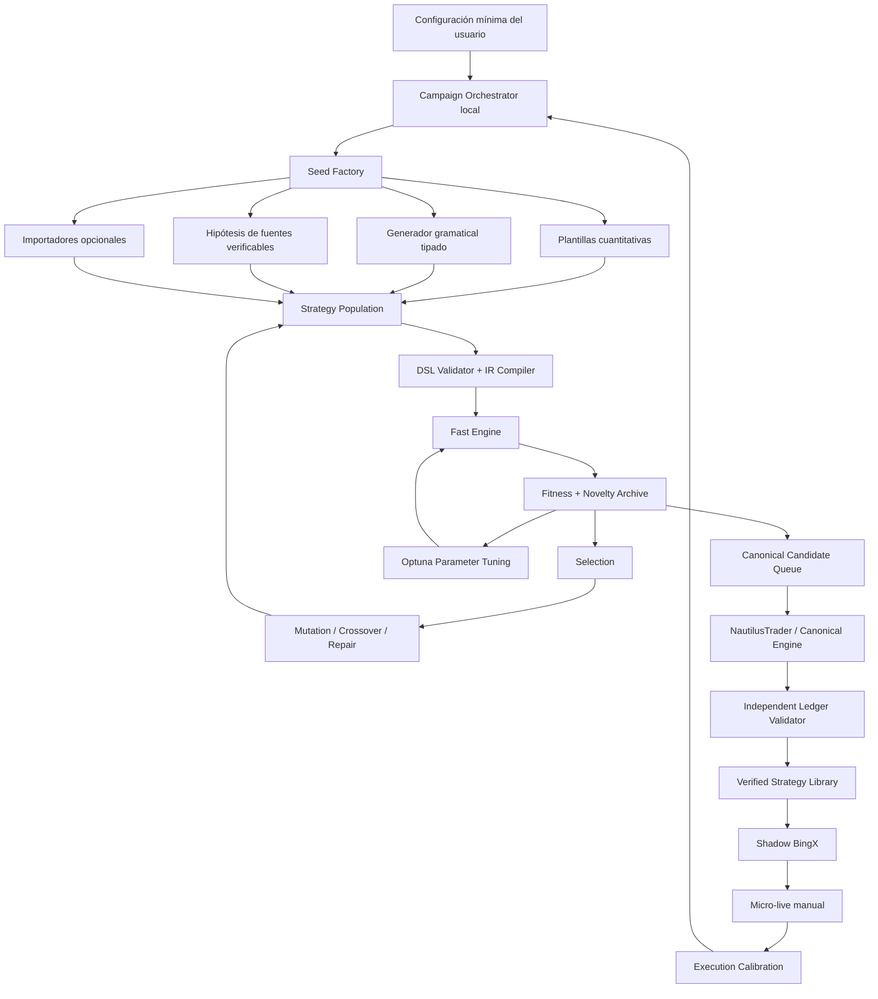

# Arquitectura — Fábrica Autónoma de Estrategias BingX

## Decisión central

El usuario no necesita saber diseñar estrategias, indicadores ni combinaciones de parámetros.

La DSL v1.0.0 y su compilador IR son infraestructura interna. El editor manual queda disponible como modo avanzado y de auditoría, pero la experiencia principal debe ser una **Campaña Autónoma**.

El usuario solo debe poder indicar, como máximo:

- mercado o conjunto de símbolos de BingX;
- temporalidades permitidas;
- periodo histórico;
- capital inicial de simulación;
- presupuesto de cómputo o duración máxima;
- objetivo de búsqueda, por defecto multiplicador neto >= 11x;
- modo de búsqueda: exploración amplia, mejora de ganadores o investigación de régimen.

Todos los demás elementos —reglas, indicadores, umbrales, salidas, leverage, allocation, compound, piramidación y órdenes— los decide y optimiza el sistema dentro de los límites reales del instrumento.

## Qué significa “autónomo”

El sistema debe realizar por sí mismo cinco funciones distintas:

1. **Crear estructuras de estrategia**: entradas, salidas, dirección, filtros de régimen y gestión de posición.
2. **Elegir y optimizar parámetros**: periodos, umbrales, leverage, tamaño, stops, take profits, trailing y piramidación.
3. **Modificar estrategias existentes**: mutaciones, cruces, sustitución de bloques y reparación basada en motivos de fallo.
4. **Investigar hipótesis externas**: papers, repositorios y fuentes verificables, convirtiéndolas a DSL sin ejecutar código externo.
5. **Aprender de los resultados**: conservar linaje, evitar duplicados y orientar la siguiente generación hacia familias prometedoras sin perder diversidad.

## Límites honestos

No es posible probar literalmente “todas las estrategias posibles”: el espacio combinatorio es prácticamente ilimitado. El objetivo real es disponer de una gramática amplia, generación continua y búsqueda adaptativa capaz de recorrer millones de candidatos de forma reproducible.

Tampoco se puede garantizar encontrar un 1000% neto. `>= 1000%` es un objetivo de búsqueda histórica. Un candidato solo puede declararse hallazgo cuando supera costes y reglas reales en el motor canónico.

## Arquitectura funcional



## Motores de creación

### 1. Generador gramatical tipado

Usa la DSL y el AST como gramática segura. Debe generar árboles válidos por construcción, no JSON aleatorio.

Tipos básicos:

- `PriceSeries`
- `VolumeSeries`
- `BooleanSeries`
- `Scalar`
- `IntegerPeriod`
- `Direction`
- `OrderIntent`
- `PositionConfig`

Bloques iniciales:

- OHLCV, returns, range, gaps;
- SMA, EMA, WMA, RSI, ATR, ADX, Bollinger, Donchian, MACD;
- highest/lowest, breakout, cross, slope, percentile;
- volume ratio, volume z-score;
- mark/index basis, funding y open interest cuando exista dataset;
- hora, día, sesión y ventanas temporales;
- AND, OR, NOT y comparaciones tipadas;
- long, short o ambos;
- market/limit/trigger/reduce-only;
- stop, target, trailing, time exit y signal exit;
- leverage, allocation, compound y piramidación.

Cada árbol debe respetar profundidad, número de nodos y tipos. El límite de complejidad sirve para que el motor pueda ejecutarlo y mutarlo, no como filtro financiero.

### 2. Programación genética

Debe trabajar con dos clases de genes:

- **genes estructurales**: indicadores, operadores, entradas, salidas, órdenes y arquitectura;
- **genes numéricos**: periodos, umbrales, leverage, allocation y distancias.

Operadores:

- mutación de nodo;
- mutación de subárbol;
- cambio de indicador compatible;
- cambio de operador lógico;
- inserción/eliminación de condición;
- cruce de entradas;
- cruce de salidas;
- cruce de gestión monetaria;
- mutación de dirección;
- mutación de timeframe;
- reparación de tipos y referencias.

### 3. Optimizador de parámetros

El generador evoluciona la estructura. Optuna optimiza parámetros continuos, enteros y categóricos de familias ya prometedoras.

Secuencia recomendada:

1. exploración aleatoria o QMC para cobertura inicial;
2. TPE multivariante para espacios condicionales;
3. CMA-ES para subconjuntos numéricos estables;
4. búsqueda local alrededor de los mejores supervivientes.

Las semillas y los procesos deben registrarse. El paralelismo no debe ocultar la falta de reproducibilidad.

### 4. Agente investigador

El agente de IA no decide si una estrategia es rentable. Solo puede:

- recuperar una fuente real;
- guardar URL, título, fecha, autor, licencia y hash del contenido;
- extraer una hipótesis;
- identificar datos requeridos;
- convertirla a una propuesta DSL;
- explicar qué parte procede de la fuente y qué parte es inferencia;
- enviar la propuesta al mismo pipeline de compilación y backtest.

No puede ejecutar Python de terceros ni copiar estrategias como “ganadoras”.

### 5. Importadores opcionales

Se pueden añadir adaptadores para StrategyQuant X, Build Alpha, Pine Script, Freqtrade u otros formatos, pero su salida debe convertirse a la DSL interna y validarse con datos BingX. Ninguna herramienta externa será autoridad final.

## Reparación automática

Cada candidato fallido debe producir un código de fallo, no solo una puntuación:

- `NO_TRADES`
- `TOO_FEW_TRADES`
- `LIQUIDATED`
- `NEGATIVE_EQUITY`
- `FEES_DOMINATE`
- `FUNDING_DOMINATE`
- `INVALID_ORDER`
- `INSUFFICIENT_MARGIN`
- `MISSING_SERIES`
- `DATA_GAP`
- `NON_REPRODUCIBLE`

El reparador puede generar descendientes dirigidos:

- si no opera, relajar umbrales o cambiar timeframe;
- si liquida, modificar leverage, allocation, salida o piramidación;
- si las comisiones dominan, reducir frecuencia o favorecer límites;
- si el funding domina, cambiar dirección o duración;
- si faltan series, sustituir bloques o solicitar dataset;
- si el resultado no se reproduce, invalidar el linaje.

Reducir leverage para evitar liquidación no es imponer un filtro de riesgo: es permitir que la estrategia sobreviva y compita por mayor equity final.

## Función de selección Kamikaze

Reglas duras:

```text
invalid / look-ahead / non-reproducible / liquidated / equity <= 0 => descartada
```

Para supervivientes:

```text
primary_fitness = log(final_equity / initial_equity)
```

No penalizar por drawdown, Sharpe, volatilidad, estabilidad ni concentración.

Para mantener exploración, usar **novelty** como mecanismo separado, no como métrica financiera. La población de la siguiente generación puede reservar, por ejemplo:

- 60% mejores por equity final;
- 20% candidatos novedosos;
- 10% semillas nuevas;
- 10% reparaciones dirigidas.

Estos porcentajes deben ser configurables y no inventar resultados.

## Campaña autónoma

Estados reales:

- `CREATED`
- `GENERATING`
- `FAST_EVALUATING`
- `TUNING`
- `CANONICAL_QUEUED`
- `CANONICAL_RUNNING`
- `VERIFIED`
- `PAUSED`
- `FAILED`
- `COMPLETED`

Una campaña guarda:

- configuración completa;
- universo BingX y snapshots de reglas;
- datasets y checksums;
- semilla maestra;
- generaciones y población;
- candidatos y linaje;
- mutaciones y cruces;
- estudios Optuna;
- resultados fast/canonical;
- errores y checkpoints;
- versión del código.

Debe poder pausarse, reanudarse y continuar después de cerrar el PC.

## Experiencia de usuario

### Modo Autopilot

Formulario mínimo:

- símbolos: AUTO o selección;
- timeframes: AUTO o selección;
- periodo histórico;
- presupuesto: número de pruebas o tiempo;
- capital inicial;
- objetivo: 11x por defecto;
- búsqueda: amplia / mejorar ganadores / por régimen.

Botón: `INICIAR BÚSQUEDA AUTÓNOMA`.

### Modo avanzado

Permite inspeccionar o editar DSL, límites de gramática, operadores, semillas y rangos. No debe ser obligatorio.

### Strategy Library

Muestra estrategias generadas con:

- origen;
- padres;
- generación;
- DSL;
- IR;
- parámetros;
- datasets;
- estado;
- resultado rápido;
- resultado canónico;
- motivo de descarte;
- historial de modificaciones.

## Orden correcto de implementación

### Fase E — Fast Engine determinista

Antes de generar millones de estrategias debe existir un ejecutor real de la IR:

- OHLCV y series auxiliares;
- señales sin look-ahead;
- entrada en la siguiente observación disponible;
- long/short;
- fees y funding;
- margen y liquidación aproximada documentada;
- ledger y equity;
- artefactos reproducibles;
- tests de propiedades.

### Fase F — Strategy Factory y optimización autónoma

- gramática tipada;
- generador de población;
- DEAP;
- Optuna;
- reparador;
- novelty archive;
- deduplicación por hash;
- ProcessPoolExecutor local;
- checkpoints SQLite/filesystem;
- Campaigns UI real.

### Fase G — Motor canónico

- NautilusTrader;
- ejecución event-driven;
- modelo BingX versionado;
- mark/last/index;
- fees/funding/margen/liquidación;
- fills y ledger;
- validador independiente.

### Fase H — Investigación IA

- conectores a fuentes;
- registro de procedencia;
- extracción de hipótesis;
- conversión a DSL;
- feedback de resultados;
- sin ejecución de código externo.

## Condición de aceptación del objetivo 1000%

Una estrategia solo puede mostrarse como `TARGET_HIT` cuando:

- `final_equity >= initial_equity * 11`;
- el resultado es neto de fees, funding y slippage modelado;
- no hubo liquidación total;
- el dataset está aprobado y tiene checksum;
- el resultado se reproduce con la misma semilla;
- pasó el motor canónico;
- el ledger independiente coincide dentro de tolerancia;
- todos los artefactos existen físicamente.

No es obligatorio que exista un `TARGET_HIT`; el sistema debe mostrar honestamente cuando todavía no ha encontrado ninguno.
