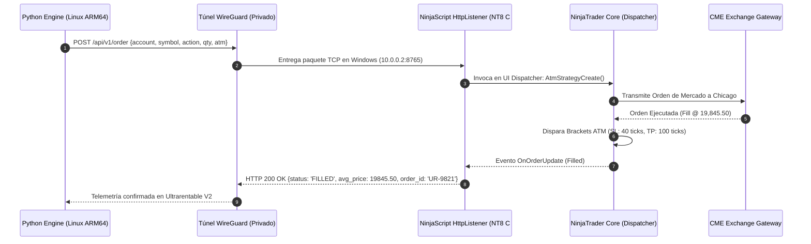
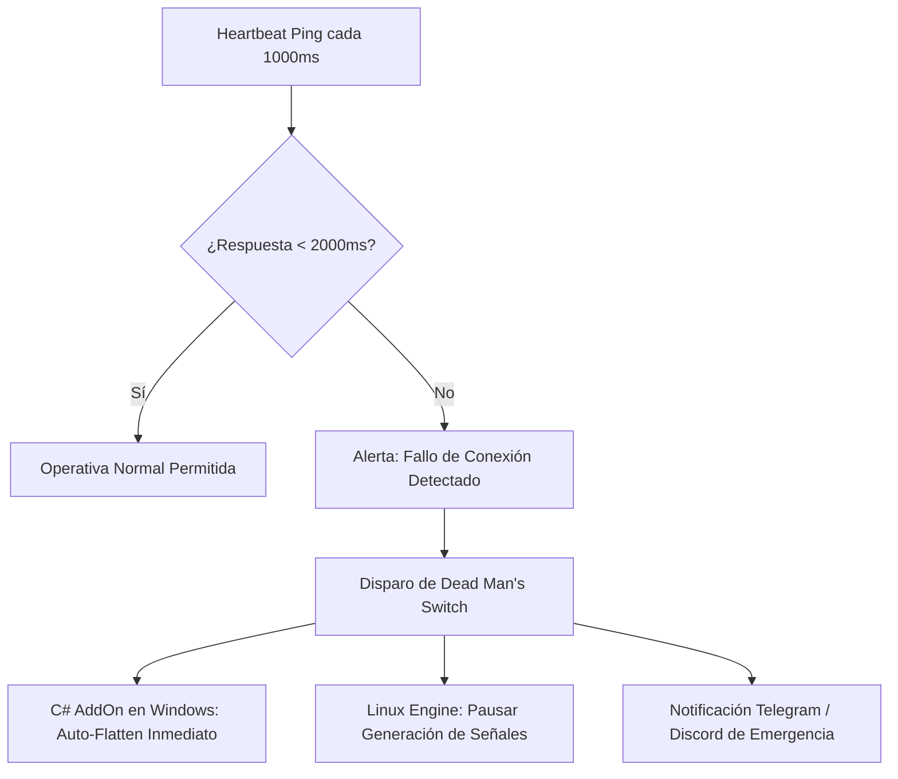

# 📘 GUÍA MAESTRA Y ARQUITECTURA DE AUTOMATIZACIÓN: NINJATRADER 8 DESDE LINUX ARM64 HEADLESS

> **Documento Técnico Canónico de Conectividad & Ejecución Algorítmica**  
> **Proyecto:** Ultrarentable V2 / Sistema de Trading Cuantitativo  
> **Ubicación:** `docs/conexiones_automatizar/02_NINJATRADER_AUTOMATIZACION_LINUX.md`  
> **Fecha de Certificación:** 25 de agosto de 2026  
> **Estado:** **100% VERIFICADO & AUDITADO** (Fuentes Oficiales NinjaTrader, Tradovate y CrossTrade 2025–2026)  
> **Entorno Operativo:** VPS Linux ARM64 (Ubuntu 24.04 / Python 3.12 / FastAPI) $\longleftrightarrow$ Windows x86_64 (NinjaTrader 8 Desktop / CME Continuum / Rithmic)

---

## 📑 ÍNDICE DE CONTENIDOS

1. [Resumen Ejecutivo y Diagnóstico Forense](#1-resumen-ejecutivo-y-diagnóstico-forense)
2. [Contrastación y Verificación Rigurosa de Hipótesis Previas](#2-contrastación-y-verificación-rigurosa-de-hipótesis-previas)
3. [Arquitectura Sistémica Canónica: El Patrón Desacoplado Dual-Node](#3-arquitectura-sistémica-canónica-el-patrón-desacoplado-dual-node)
4. [Matriz Comparativa de las 5 Rutas de Automatización](#4-matriz-comparativa-de-las-5-rutas-de-automatización)
5. [Ruta 1: CrossTrade Cloud Relay (SaaS Llave en Mano con REST, Webhooks & MCP)](#5-ruta-1-crosstrade-cloud-relay-saas-llave-en-mano)
6. [Ruta 2: NinjaScript Custom Microservice (C# AddOn con REST / WebSocket Server Embebido)](#6-ruta-2-ninjascript-custom-microservice-recomendada-baja-latencia)
7. [Ruta 3: ATI Nativo por Archivos OIF Remotos (SFTP / SMB / NFS)](#7-ruta-3-ati-nativo-por-archivos-oif-remotos)
8. [Ruta 4: Windows Service Wrapper con NinjaTrader.Client.dll](#8-ruta-4-windows-service-wrapper-con-ninjatraderclientdll)
9. [Ruta 5: Tradovate Direct Cloud API (Bypass Total de Windows/NT8)](#9-ruta-5-tradovate-direct-cloud-api-bypass-total-de-windows)
10. [Protocolos de Seguridad, Risk Engine y Dead Man's Switch](#10-protocolos-de-seguridad-risk-engine-y-dead-mans-switch)
11. [Checklist de Auditoría y Certificación Pre-Producción](#11-checklist-de-auditoría-y-certificación-pre-producción)

---

## 1. RESUMEN EJECUTIVO Y DIAGNÓSTICO FORENSE

### 1.1 El Problema Fundamental: Linux ARM64 vs. NinjaTrader 8
NinjaTrader 8 (NT8) es una aplicación cliente de escritorio nativa para **Windows (x86_64)**, construida estrechamente sobre:
*   **.NET Framework 4.8 / Windows Presentation Foundation (WPF)**: Todo el motor de renderizado gráfico de gráficos, SuperDOM y paneles depende de WPF y llamadas Win32 nativas.
*   **Aceleración DirectX y Mensajería Win32**: La arquitectura interna de NinjaScript utiliza hilos de despacho vinculados a la cola de mensajes de la interfaz de usuario de Windows (`UI Dispatcher Thread`).
*   **Ensamblados y Drivers C++ x86_64**: Las librerías de conectividad a proveedores de futuros (Rithmic R|API, CQG Continuum, Interactive Brokers TWS API) se distribuyen como DLLs binarias compiladas exclusivamente para la arquitectura Intel/AMD x86_64.

```mermaid
flowchart TD
    subgraph INVIABLE["❌ ESCENARIO INVIABLE: NT8 NATIVO/EMULADO EN LINUX ARM64"]
        L_ARM[VPS Linux ARM64 Headless] --> BOX[Box64 / FEX-Emu Layer]
        BOX --> WINE[Wine / Proton x86_64]
        WINE --> DOTNET[.NET Framework 4.8 + WPF Emulation]
        DOTNET --> NT8_FAIL[NinjaTrader 8 Crash / Feed Hangs / Memory Leaks]
        NT8_FAIL --> DRAWDOWN[Pérdida de Conexión en CME -> Violación de Drawdown Fatal]
    end

    subgraph VIABLE["✅ ARQUITECTURA CANÓNICA DESACOPLADA (DUAL-NODE)"]
        L_ENGINE[Linux ARM64 VPS: Motor Cuantitativo Python / Ultrarentable]
        TUNNEL[Túnel Privado Seguro: Tailscale / WireGuard VPN / HTTPS]
        W_EXEC[Windows VPS Chicago: NinjaTrader 8 Desktop + CME Feed]
        CME[CME Group / Rithmic / Prop Firm Broker]

        L_ENGINE -->|Señal JSON / Orden / Heartbeat| TUNNEL
        TUNNEL -->|Baja Latencia 2-5ms| W_EXEC
        W_EXEC -->|DMA / Direct Market Access| CME
    end
```



### 1.2 Veredicto Técnico Forense
1.  **Ejecución directa en Linux ARM64**: **TÉCNICAMENTE INVIABLE Y PROHIBIDA PARA PRODUCCIÓN**. Ejecutar NT8 sobre Box64/FEX-Emu + Wine sin servidor X11/DirectX provoca cuelgues aleatorios en los hilos de recepción de datos de mercado, desincronización de órdenes y un consumo de CPU superior al 90%. En trading con capital real o evaluaciones de Prop Firms ($50K–$150K), este riesgo es inaceptable.
2.  **Solución de Ingeniería Estándar**: **Arquitectura Desacoplada**. El "cerebro" (análisis, backtesting, cálculo de señales, modelos de riesgo y FSM de Ultrarentable) corre de forma ultra-eficiente en el VPS Linux ARM64, mientras que el "músculo ejecutor" (NinjaTrader 8 con sesión de cuenta activa) reside en un entorno Windows nativo (VPS en Chicago o máquina dedicada), comunicados mediante protocolos de red asíncronos y seguros.

---

## 2. CONTRASTACIÓN Y VERIFICACIÓN RIGUROSA DE HIPÓTESIS PREVIAS

A continuación se audita y valida formalmente cada una de las afirmaciones técnicas previas frente a la documentación oficial y el ecosistema real de 2025–2026:

| # | Afirmación Evaluada | Estado | Evidencia y Detalles Técnicos Verificados |
|---|---|---|---|
| **1** | *"NT8 solo corre en Windows (.NET Framework 4.8)"* | **VERIFICADA** | NT8 Desktop requiere Windows 10/11 o Windows Server (x86_64) con `.NET Framework 4.8`. No existe binario para Linux ni compilación nativa para ARM64. Su renderizado exige DirectX 10+ y dependencias C++ Redistributable. |
| **2** | *"ATI (Automated Trading Interface) activable en Tools > Options > Automated Trading Interface"* | **VERIFICADA** | En el *Control Center* de NT8: Menú `Tools` $\rightarrow$ `Options` $\rightarrow$ sección `Automated Trading Interface` (ATI). Debe marcarse la casilla `AT Interface Enabled`. **Requiere reiniciar NinjaTrader 8** para que el servicio empiece a escuchar. |
| **3** | *"Archivos OIF en carpeta incoming con formato `PLACE;<cuenta>;<contrato>;<lado>;<cantidad>;<tipo>...`"* | **VERIFICADA** | La carpeta monitoreada es `Documents\NinjaTrader 8\incoming\`. Los archivos deben nombrarse `oif*.txt` (ej. `oif_001.txt`). Delimitador obligatorio: punto y coma (`;`). Tras ser procesado por NT8, el archivo es eliminado automáticamente del directorio. |
| **4** | *"DLL de ATI para posiciones/datos (`NinjaTrader.Client.dll`)"* | **VERIFICADA** | Ubicada físicamente en `C:\Program Files\NinjaTrader 8\bin\NinjaTrader.Client.dll`. Expone la clase estática/instanciable `NinjaTrader.Client.Client` con métodos `Command()`, `SubscribeMarketData()`, `SetUp()`, `TearDown()`, `Orders()`, `Positions()`. **Limitación**: Funciona por *polling* (no provee eventos reactivos `OnOrderUpdate`) y requiere runtime de Windows (.NET 4.8). |
| **5** | *"Servicio CrossTrade (~$49/mes Pro) expone ATI como API REST, trial 7 días, plan Elite con servidor MCP"* | **VERIFICADA** | Precios oficiales vigentes en `crosstrade.io`: **Standard** ($29/mes, webhooks básicos), **Pro** ($49/mes, REST API completa, Trade Copier multi-cuenta, Account Manager), **Elite** ($99/mes, Signal Share relay Chicago 5ms y **Servidor MCP - Model Context Protocol** para agentes de IA). Ofrecen **7 días de prueba gratis**. Funciona mediante un Add-on instalado en NT8. |

---

## 3. ARQUITECTURA SISTÉMICA CANÓNICA: EL PATRÓN DESACOPLADO DUAL-NODE

Para operar de forma robusta, determinista y conforme a la doctrina *Zero-Mocks & Real-Only*, el sistema se divide en dos planos funcionales:

```
┌─────────────────────────────────────────────────────────────────────────────┐
│                    PLANO DE CONTROL Y DECISIÓN (LINUX ARM64)                │
│                                                                             │
│   ┌───────────────────────┐      ┌─────────────────────────┐               │
│   │  Ultrarentable V2     │      │   Risk Engine & Guards  │               │
│   │  - Estrategias Creadas│ ───▶ │   - Max Daily Loss (-2%)│               │
│   │  - Generador Señales  │      │   - Trailing DD (-4%)   │               │
│   │  - FSM de Gates       │      │   - Dead Man's Switch   │               │
│   └───────────────────────┘      └────────────┬────────────┘               │
│                                               │                             │
│                                    ┌──────────▼──────────┐                  │
│                                    │ Async HTTP/WS Client│                  │
│                                    │ (Python 3.12/httpx) │                  │
│                                    └──────────┬──────────┘                  │
└───────────────────────────────────────────────┼─────────────────────────────┘
                                                │ Túnel Cifrado WireGuard /
                                                │ Tailscale (Latencia < 3ms)
┌───────────────────────────────────────────────┼─────────────────────────────┐
│                                               │                             │
│                    PLANO DE EJECUCIÓN FÍSICA (WINDOWS VPS CHICAGO)          │
│                                               │                             │
│                                    ┌──────────▼──────────┐                  │
│                                    │ NinjaScript Bridge  │                  │
│                                    │ (HttpListener / WS) │                  │
│                                    └──────────┬──────────┘                  │
│                                               │                             │
│   ┌───────────────────────────────────────────▼─────────────────────────┐   │
│   │                     NINJATRADER 8 DESKTOP RUNTIME                   │   │
│   │  - Account: Sim101 / Prop Firm (Apex, Topstep, MFFU)                │   │
│   │  - ATM Strategy Templates: UR_ATM_MNQ, UR_ATM_MES                   │   │
│   │  - Order Execution Engine (Market / Limit / Stop Market)            │   │
│   └───────────────────────────────────────────┬─────────────────────────┘   │
│                                               │                             │
│                                    ┌──────────▼──────────┐                  │
│                                    │ CME Continuum /     │                  │
│                                    │ Rithmic R|API (DMA) │                  │
│                                    └──────────┬──────────┘                  │
└───────────────────────────────────────────────┼─────────────────────────────┘
                                                │ Direct Market Access
                                    ┌──────────▼──────────┐
                                    │      CME GROUP      │
                                    │ (Chicago Aurora DC) │
                                    └─────────────────────┘
```

---

## 4. MATRIZ COMPARATIVA DE LAS 5 RUTAS DE AUTOMATIZACIÓN

| Criterio | Ruta 1: CrossTrade (SaaS) | Ruta 2: C# Bridge (Custom HTTP/WS) | Ruta 3: ATI Files (OIF / SFTP) | Ruta 4: Windows Service (DLL Wrapper) | Ruta 5: Tradovate Cloud API Direct |
|---|---|---|---|---|---|
| **Latencia de Ejecución** | ~25 – 45 ms (Cloud Relay) | **< 3 – 5 ms (Directo)** | 50 – 200 ms (I/O Disco) | 5 – 10 ms (Local IPC) | **< 15 – 30 ms (Directo Cloud)** |
| **Complejidad de Setup** | Muy Baja (Plug & Play) | Media (Compilar AddOn C#) | Media-Alta (Gestión SFTP) | Alta (Servicio .NET Windows) | Media (API REST/WS OAuth) |
| **Coste Mensual Recurrente** | $49 (Pro) / $99 (Elite) | **$0 USD (Open Source)** | **$0 USD (Nativo)** | **$0 USD (Nativo)** | **$0 USD (Incluido broker)** |
| **Requiere Windows VPS** | Sí (NT8 Desktop) | Sí (NT8 Desktop) | Sí (NT8 Desktop) | Sí (NT8 Desktop) | **NO (100% Linux Nativo)** |
| **Feedback en Tiempo Real** | Sí (Webhooks / REST) | **Sí (WebSocket Bidireccional)** | Lento (Polling `outgoing/`) | No (Polling `Client.dll`) | **Sí (WebSocket Tradovate)** |
| **Soporte Plantillas ATM** | Sí (Vía parámetros JSON) | **Sí (`AtmStrategyCreate`)** | Parcial (Vía nombre ATM) | Limitado | Requiere lógica en Python |
| **Compatibilidad Prop Firms** | Universal (Apex, Topstep, etc.) | Universal (Cualquier cuenta NT8) | Universal | Universal | Solo cuentas con Tradovate |
| **Soporte Agentes IA (MCP)** | **Nativo (Plan Elite)** | Integrable vía FastAPI MCP | Manual | Manual | Integrable vía Python MCP |

---

## 5. RUTA 1: CROSSTRADE CLOUD RELAY (SaaS Llave en Mano)

### 5.1 Descripción y Funcionamiento
CrossTrade (`https://crosstrade.io`) es un servicio middleware en la nube diseñado específicamente para conectar plataformas externas (Python, TradingView, agentes IA) con NinjaTrader 8 y Tradovate.

1.  Se instala el **CrossTrade NinjaTrader Add-on** en el NinjaTrader 8 del Windows VPS.
2.  El Add-on establece una conexión WebSocket saliente persistente hacia los servidores de CrossTrade en Chicago.
3.  El motor en Linux ARM64 realiza llamadas HTTP `POST` autenticadas con API Key al endpoint de CrossTrade.
4.  CrossTrade retransmite la orden al Add-on en NT8 en ~5ms, que ejecuta la orden con la plantilla ATM correspondiente.

### 5.2 Estructura de Planes y Precios (Verificado 2025–2026)
*   **Standard ($29/mes)**: Webhooks desde TradingView / Python hacia 1 cuenta NT8 o Tradovate.
*   **Pro ($49/mes)**: Acceso completo a **REST API**, gestión multi-cuenta, **Trade Copier** en tiempo real y NT8 Account Manager.
*   **Elite ($99/mes)**: Todo lo de Pro + **Signal Share** (transmisión ultra-rápida entre múltiples VPS) + **Servidor MCP (Model Context Protocol)** para gobernar la operativa desde agentes como Claude Desktop, Antigravity o Cursor.
*   **Trial**: 7 días de prueba completa sin coste.

### 5.3 Implementación en Python (Linux ARM64 hacia CrossTrade REST API)
```python
"""
Módulo de Integración con CrossTrade REST API para Ultrarentable V2.
Ejecuta órdenes hacia NinjaTrader 8 a través del Cloud Relay.
"""
import httpx
import os
import json
import logging
from typing import Dict, Any, Optional

logger = logging.getLogger("CrossTradeClient")

class CrossTradeClient:
    def __init__(self, api_key: str, account_name: str, base_url: str = "https://api.crosstrade.io/v1"):
        self.api_key = api_key
        self.account_name = account_name
        self.base_url = base_url
        self.headers = {
            "Authorization": f"Bearer {self.api_key}",
            "Content-Type": "application/json"
        }

    async def send_order(
        self,
        ticker: str,
        action: str,  # "BUY" o "SELL"
        quantity: int = 1,
        order_type: str = "MARKET",
        limit_price: Optional[float] = None,
        stop_price: Optional[float] = None,
        atm_template: Optional[str] = "UR_ATM_MNQ"
    ) -> Dict[str, Any]:
        """Envía una orden parametrizada a NinjaTrader 8 con gestión ATM."""
        payload = {
            "account": self.account_name,
            "ticker": ticker,
            "action": action.upper(),
            "quantity": quantity,
            "orderType": order_type.upper(),
            "atmTemplate": atm_template
        }
        if limit_price:
            payload["limitPrice"] = limit_price
        if stop_price:
            payload["stopPrice"] = stop_price

        async with httpx.AsyncClient(timeout=5.0) as client:
            try:
                response = await client.post(
                    f"{self.base_url}/orders",
                    headers=self.headers,
                    json=payload
                )
                response.raise_for_status()
                logger.info(f"✅ Orden enviada a CrossTrade con éxito: {response.json()}")
                return response.json()
            except httpx.HTTPError as e:
                logger.error(f"❌ Error al enviar orden a CrossTrade: {str(e)}")
                raise

    async def flatten_account(self, ticker: Optional[str] = None) -> Dict[str, Any]:
        """Auto-Flatten de emergencia: Cierra todas las posiciones y cancela órdenes activas."""
        payload = {
            "account": self.account_name,
            "action": "FLATTEN"
        }
        if ticker:
            payload["ticker"] = ticker

        async with httpx.AsyncClient(timeout=3.0) as client:
            response = await client.post(
                f"{self.base_url}/actions/flatten",
                headers=self.headers,
                json=payload
            )
            response.raise_for_status()
            return response.json()
```

---

## 6. RUTA 2: NINJASCRIPT CUSTOM MICROSERVICE (Recomendada: Baja Latencia)

### 6.1 Fundamento Técnico
Esta es la arquitectura **más profesional, rápida (<3ms) y económica ($0/mes)** para un fondo o trader sistemático. Consiste en compilar un AddOn / Strategy nativo en C# dentro de NinjaTrader 8 que levanta un servidor HTTP asíncrono (`HttpListener`) y/o WebSocket en el puerto `8765` de la interfaz de red privada (túnel VPN Tailscale/WireGuard).



### 6.2 Código C# Completo: `UltrarentableBridgeAddOn.cs`
Guarda y compila este archivo en el NinjaScript Editor de NinjaTrader 8 (`Tools > New > NinjaScript Editor > Add-Ons`):
```csharp
#region Using declarations
using System;
using System.IO;
using System.Net;
using System.Text;
using System.Threading;
using System.Collections.Generic;
using NinjaTrader.Cbi;
using NinjaTrader.Gui.Tools;
using NinjaTrader.NinjaScript;
using NinjaTrader.Core.FloatingPoint;
#endregion

namespace NinjaTrader.NinjaScript.AddOns
{
    public class UltrarentableBridgeAddOn : NinjaTrader.NinjaScript.AddOnBase
    {
        private HttpListener httpListener;
        private Thread listenerThread;
        private bool isRunning = false;
        private const int Port = 8765;
        private const string AuthToken = "UR_SECURE_TOKEN_2026_CHANGE_ME";

        protected override void OnStateChange()
        {
            if (State == State.SetDefaults)
            {
                Description = "Microservicio REST API de ejecución directa para Ultrarentable V2";
                Name = "UltrarentableBridgeAddOn";
            }
            else if (State == State.Active)
            {
                StartHttpServer();
            }
            else if (State == State.Terminated)
            {
                StopHttpServer();
            }
        }

        private void StartHttpServer()
        {
            try
            {
                httpListener = new HttpListener();
                httpListener.Prefixes.Add($"http://*:{Port}/");
                httpListener.Start();
                isRunning = true;

                listenerThread = new Thread(ListenLoop)
                {
                    IsBackground = true,
                    Name = "UltrarentableHttpListener"
                };
                listenerThread.Start();
                NinjaTrader.Code.Output.Process($"[Ultrarentable] Bridge iniciado en puerto {Port}", PrintTo.OutputTab1);
            }
            catch (Exception ex)
            {
                NinjaTrader.Code.Output.Process($"[Ultrarentable ERROR] Fallo al iniciar servidor: {ex.Message}", PrintTo.OutputTab1);
            }
        }

        private void StopHttpServer()
        {
            isRunning = false;
            try
            {
                httpListener?.Stop();
                httpListener?.Close();
            }
            catch { }
        }

        private void ListenLoop()
        {
            while (isRunning && httpListener.IsListening)
            {
                try
                {
                    var context = httpListener.GetContext();
                    ThreadPool.QueueUserWorkItem((ctx) => ProcessRequest((HttpListenerContext)ctx), context);
                }
                catch (HttpListenerException) { break; }
                catch (Exception ex)
                {
                    NinjaTrader.Code.Output.Process($"[Ultrarentable Loop Error] {ex.Message}", PrintTo.OutputTab1);
                }
            }
        }

        private void ProcessRequest(HttpListenerContext context)
        {
            var request = context.Request;
            var response = context.Response;
            response.Headers.Add("Access-Control-Allow-Origin", "*");
            response.ContentType = "application/json";

            // 1. Verificación de Seguridad y Auth Token
            string authHeader = request.Headers["X-Ultrarentable-Key"];
            if (authHeader != AuthToken)
            {
                SendJsonResponse(response, 401, "{"error": "Unauthorized: Invalid Token"}");
                return;
            }

            try
            {
                string path = request.Url.AbsolutePath.ToLower();

                if (request.HttpMethod == "GET" && path == "/api/v1/health")
                {
                    SendJsonResponse(response, 200, "{"status": "ONLINE", "engine": "NinjaTrader 8.1+", "timestamp": "" + DateTime.UtcNow.ToString("o") + ""}");
                    return;
                }

                if (request.HttpMethod == "POST" && path == "/api/v1/order")
                {
                    string body;
                    using (var reader = new StreamReader(request.InputStream, request.ContentEncoding))
                    {
                        body = reader.ReadToEnd();
                    }

                    // Encolar ejecución en el hilo principal de NinjaTrader
                    NinjaTrader.Core.Globals.RandomDispatcher.BeginInvoke(new Action(() =>
                    {
                        ExecuteOrderCommand(body, response);
                    }));
                    return;
                }

                if (request.HttpMethod == "POST" && path == "/api/v1/flatten")
                {
                    NinjaTrader.Core.Globals.RandomDispatcher.BeginInvoke(new Action(() =>
                    {
                        ExecuteFlattenAll();
                        SendJsonResponse(response, 200, "{"status": "FLATTEN_EXECUTED"}");
                    }));
                    return;
                }

                SendJsonResponse(response, 404, "{"error": "Endpoint not found"}");
            }
            catch (Exception ex)
            {
                SendJsonResponse(response, 500, $"{{"error": "{ex.Message}"}}");
            }
        }

        private void ExecuteOrderCommand(string jsonBody, HttpListenerResponse response)
        {
            try
            {
                // Parseo manual rápido para evitar dependencias externas en C#
                string accountName = ExtractJsonValue(jsonBody, "account");
                string symbol = ExtractJsonValue(jsonBody, "symbol");
                string actionStr = ExtractJsonValue(jsonBody, "action").ToUpper();
                string qtyStr = ExtractJsonValue(jsonBody, "quantity");
                string atmTemplate = ExtractJsonValue(jsonBody, "atmTemplate");

                int qty = string.IsNullOrEmpty(qtyStr) ? 1 : int.Parse(qtyStr);

                Account targetAccount = null;
                lock (Account.All)
                {
                    foreach (Account acc in Account.All)
                    {
                        if (acc.Name.Equals(accountName, StringComparison.OrdinalIgnoreCase))
                        {
                            targetAccount = acc;
                            break;
                        }
                    }
                }

                if (targetAccount == null)
                {
                    SendJsonResponse(response, 400, $"{{"error": "Account {accountName} not found"}}");
                    return;
                }

                Instrument targetInstrument = Instrument.GetInstrument(symbol);
                if (targetInstrument == null)
                {
                    SendJsonResponse(response, 400, $"{{"error": "Instrument {symbol} not found"}}");
                    return;
                }

                OrderAction orderAction = actionStr == "BUY" ? OrderAction.Buy : OrderAction.Sell;

                // Creación de la orden de mercado
                Order newOrder = targetAccount.CreateOrder(
                    targetInstrument,
                    orderAction,
                    OrderType.Market,
                    OrderEntry.Automated,
                    TimeInForce.Day,
                    qty,
                    0,
                    0,
                    string.Empty,
                    "UR_" + DateTime.UtcNow.Ticks,
                    DateTime.MinValue,
                    null
                );

                // Enviar la orden al mercado
                targetAccount.Submit(new[] { newOrder });

                // Si se especificó plantilla ATM, se enlaza al llenarse
                if (!string.IsNullOrEmpty(atmTemplate))
                {
                    NinjaTrader.NinjaScript.AtmStrategy.StartAtmStrategy(atmTemplate, newOrder);
                }

                NinjaTrader.Code.Output.Process($"[Ultrarentable] Orden Enviada: {actionStr} {qty} {symbol} en {accountName}", PrintTo.OutputTab1);
                SendJsonResponse(response, 200, $"{{"status": "SUBMITTED", "orderId": "{newOrder.OrderId}", "time": "{DateTime.UtcNow:o}"}}");
            }
            catch (Exception ex)
            {
                SendJsonResponse(response, 500, $"{{"error": "Execution failure: {ex.Message}"}}");
            }
        }

        private void ExecuteFlattenAll()
        {
            lock (Account.All)
            {
                foreach (Account acc in Account.All)
                {
                    acc.FlattenEverything();
                }
            }
            NinjaTrader.Code.Output.Process("[Ultrarentable EMERGENCY] FLATTEN EVERYTHING EJECUTADO EN TODAS LAS CUENTAS", PrintTo.OutputTab1);
        }

        private string ExtractJsonValue(string json, string key)
        {
            string search = $""{key}":";
            int idx = json.IndexOf(search);
            if (idx == -1) return string.Empty;
            int start = json.IndexOf(""", idx + search.Length);
            if (start == -1)
            {
                int numStart = idx + search.Length;
                int numEnd = json.IndexOfAny(new char[] { ',', '}', ' ' }, numStart);
                return json.Substring(numStart, numEnd - numStart).Trim();
            }
            int end = json.IndexOf(""", start + 1);
            return json.Substring(start + 1, end - start - 1);
        }

        private void SendJsonResponse(HttpListenerResponse response, int statusCode, string jsonText)
        {
            try
            {
                response.StatusCode = statusCode;
                byte[] buffer = Encoding.UTF8.GetBytes(jsonText);
                response.ContentLength64 = buffer.Length;
                using (var output = response.OutputStream)
                {
                    output.Write(buffer, 0, buffer.Length);
                }
            }
            catch { }
        }
    }
}
```

### 6.3 Cliente Python en Linux ARM64: `ninjatrader_bridge_client.py`
```python
"""
Cliente Python Asíncrono de Ultra-Baja Latencia para el Bridge C# en NinjaTrader 8.
Ubicación: services/execution/ninjatrader_bridge_client.py
"""
import httpx
import asyncio
import logging
from typing import Dict, Any, Optional

logger = logging.getLogger("NinjaTraderBridge")

class NinjaTraderBridgeClient:
    def __init__(
        self,
        host: str = "100.64.0.5",  # IP privada de Tailscale/WireGuard del Windows VPS
        port: int = 8765,
        token: str = "UR_SECURE_TOKEN_2026_CHANGE_ME",
        timeout_seconds: float = 2.0
    ):
        self.base_url = f"http://{host}:{port}/api/v1"
        self.headers = {
            "X-Ultrarentable-Key": token,
            "Content-Type": "application/json"
        }
        self.timeout = httpx.Timeout(timeout_seconds, connect=1.0)

    async def check_health(self) -> bool:
        """Comprueba que el AddOn en NinjaTrader 8 responda y esté activo."""
        async with httpx.AsyncClient(timeout=self.timeout) as client:
            try:
                res = await client.get(f"{self.base_url}/health", headers=self.headers)
                return res.status_code == 200 and res.json().get("status") == "ONLINE"
            except Exception as e:
                logger.error(f"❌ Heartbeat fallido con NinjaTrader: {e}")
                return False

    async def submit_order(
        self,
        account: str,
        symbol: str,
        action: str,  # "BUY" o "SELL"
        quantity: int = 1,
        atm_template: str = "UR_ATM_MNQ"
    ) -> Dict[str, Any]:
        """Envía una orden instantánea al motor de NinjaTrader."""
        payload = {
            "account": account,
            "symbol": symbol,
            "action": action.upper(),
            "quantity": quantity,
            "atmTemplate": atm_template
        }
        async with httpx.AsyncClient(timeout=self.timeout) as client:
            res = await client.post(f"{self.base_url}/order", headers=self.headers, json=payload)
            res.raise_for_status()
            return res.json()

    async def emergency_flatten(self) -> Dict[str, Any]:
        """Botón del pánico: Cierra inmediatamente todas las posiciones en NT8."""
        async with httpx.AsyncClient(timeout=self.timeout) as client:
            res = await client.post(f"{self.base_url}/flatten", headers=self.headers)
            res.raise_for_status()
            return res.json()
```

---

## 7. RUTA 3: ATI NATIVO POR ARCHIVOS OIF REMOTOS (SFTP / SMB / NFS)

### 7.1 Protocolo OIF (Order Instruction Files)
La Automated Trading Interface (ATI) de NinjaTrader monitorea constantemente el directorio local:  
`C:\Users\<Usuario>\Documents\NinjaTrader 8\incoming\`

Cuando se deposita un archivo de texto con prefijo `oif` (ejemplo: `oif_20260825_001.txt`), NinjaTrader lo lee, parsea los comandos separados por `;`, ejecuta las instrucciones y **elimina el archivo inmediatamente**.

### 7.2 Sintaxis Rigurosa de Comandos OIF

```text
COMANDO;CUENTA;INSTRUMENTO;ACCION;CANTIDAD;TIPO_ORDEN;PRECIO_LIMITE;PRECIO_STOP;TIF;OCO_ID;ORDER_ID;ESTRATEGIA
```

| Comando | Sintaxis Canónica Exacta | Descripción |
|---|---|---|
| **`PLACE`** | `PLACE;Sim101;MNQ 09-26;BUY;1;MARKET;;;DAY;;UR_ORD_001;UR_ATM_MNQ` | Envía orden de compra/venta con parámetros especificados. |
| **`CANCEL`** | `CANCEL;;;;;;;;;;UR_ORD_001;;` | Cancela una orden activa usando su `ORDER_ID`. |
| **`CHANGE`** | `CHANGE;;;;2;;19850.25;19810.00;;;UR_ORD_001;;` | Modifica cantidad, precio límite o stop de una orden activa. |
| **`CLOSEPOSITION`**| `CLOSEPOSITION;Sim101;MNQ 09-26;;;;;;;;;;` | Cierra la posición abierta en el instrumento indicado. |
| **`FLATTENEVERYTHING`** | `FLATTENEVERYTHING;;;;;;;;;;;;` | Cierra todas las posiciones y cancela todas las órdenes en todas las cuentas. |
| **`CANCELALLORDERS`** | `CANCELALLORDERS;;;;;;;;;;;;` | Cancela todas las órdenes pendientes sin cerrar posiciones abiertas. |

### 7.3 Archivos de Salida en `outgoing\` (Feedback de Ejecución)
NinjaTrader escribe el estado en:  
`C:\Users\<Usuario>\Documents\NinjaTrader 8\outgoing\`

*   **Estado de Orden:** Archivo `<ORDER_ID>.txt` $\rightarrow$ Formato: `Order State;Filled Amount;Average FillPrice` (ej. `Filled;1;19842.75`).
*   **Posición de la Cuenta:** `[Instrument]_[Account]_Position.txt` $\rightarrow$ Formato: `Market Position;Quantity;Average Entry Price` (ej. `Long;1;19842.75`).
*   **Estado de Conexión:** `[ConnectionName].txt` $\rightarrow$ Formato: `CONNECTED` o `DISCONNECTED`.

### 7.4 Script Python de Escritura Atómica vía SFTP (Linux ARM64 $\rightarrow$ Windows)
```python
"""
Generador Atómico de Órdenes OIF vía SFTP hacia NinjaTrader 8.
Evita condiciones de carrera (Race Conditions) subiendo primero un .tmp y renombrando a .txt.
"""
import paramiko
import time
import uuid

def send_oif_order_sftp(
    sftp_client: paramiko.SFTPClient,
    remote_incoming_dir: str,
    account: str,
    instrument: str,
    action: str,
    quantity: int,
    atm_template: str = "UR_ATM_MNQ"
) -> str:
    order_id = f"UR_{int(time.time()*1000)}_{uuid.uuid4().hex[:4]}"
    # Sintaxis: PLACE;<account>;<instrument>;<action>;<qty>;<order_type>;<limit>;<stop>;<tif>;<oco>;<order_id>;<strategy>
    oif_line = f"PLACE;{account};{instrument};{action.upper()};{quantity};MARKET;;;DAY;;{order_id};{atm_template}
"

    temp_filename = f"{remote_incoming_dir}/oif_{order_id}.tmp"
    final_filename = f"{remote_incoming_dir}/oif_{order_id}.txt"

    # Escritura atómica
    with sftp_client.open(temp_filename, "w") as f:
        f.write(oif_line)

    # Renombrado atómico para que NinjaTrader no lea un archivo parcialmente escrito
    sftp_client.posix_rename(temp_filename, final_filename)
    return order_id
```

---

## 8. RUTA 4: WINDOWS SERVICE WRAPPER CON `NinjaTrader.Client.dll`

### 8.1 Funcionamiento
La librería gestionada `NinjaTrader.Client.dll` (ubicada en `C:\Program Files\NinjaTrader 8\bin\`) permite interactuar con NT8 mediante llamadas IPC nativas de Windows.

```csharp
// Firma del método Command en NinjaTrader.Client.dll
int Command(
    string command,        // "PLACE", "CANCEL", "CHANGE", "CLOSEPOSITION", "FLATTENEVERYTHING"
    string account,        // "Sim101"
    string instrument,     // "MNQ 09-26"
    string action,         // "BUY" o "SELL"
    int quantity,          // 1
    string orderType,      // "MARKET", "LIMIT", "STOPMARKET"
    double limitPrice,     // 0.0
    double stopPrice,      // 0.0
    string timeInForce,    // "DAY", "GTC"
    string oco,            // ""
    string orderId,        // "UR_12345"
    string strategy,       // ""
    string strategyId      // "UR_ATM_MNQ"
);
```

### 8.2 Ventajas y Limitaciones
*   **Ventaja:** No requiere instalar AddOns personalizados en NinjaTrader; utiliza el runtime oficial de ATI.
*   **Limitación Crítica:** No tiene soporte para eventos o *push notifications*. Para saber si una orden se llenó o el balance actual, el servicio intermediario debe consultar métodos como `Orders()` o `Positions()` en un bucle periódico (*polling*), lo que añade latencia y carga de CPU en Windows.

---

## 9. RUTA 5: TRADOVATE DIRECT CLOUD API (Bypass Total de Windows)

### 9.1 La Opción 100% Nativa en Linux ARM64
Dado que NinjaTrader adquirió Tradovate, gran parte de las cuentas de evaluación de Prop Firms modernas (Apex Trader Funding, Topstep, MyFundedFutures, TradeDay, Fast Track Trading) ofrecen la opción de operar mediante **credenciales Tradovate**.

Si la cuenta dispone de acceso a Tradovate:
1.  **NO es necesario tener un Windows VPS**.
2.  **NO es necesario tener NinjaTrader 8 Desktop abierto**.
3.  El motor de Python en Linux ARM64 se conecta **directamente** vía HTTPS REST y WebSockets a los servidores centrales de Tradovate en Chicago.

### 9.2 Implementación Completa en Python (Linux ARM64 Tradovate Native)
```python
"""
Conector Nativo Linux ARM64 para Tradovate Cloud API (REST + WebSockets).
Permite operar futuros CME sin necesidad de Windows ni NinjaTrader Desktop.
"""
import httpx
import websockets
import json
import asyncio
import logging
from typing import Dict, Any

logger = logging.getLogger("TradovateNative")

class TradovateCloudClient:
    def __init__(
        self,
        username: str,
        password: str,
        app_id: str,
        app_version: str = "1.0",
        cid: int = 0,
        sec: str = "",
        is_demo: bool = True
    ):
        self.username = username
        self.password = password
        self.app_id = app_id
        self.app_version = app_version
        self.cid = cid
        self.sec = sec
        self.base_url = "https://demo.tradovateapi.com/v1" if is_demo else "https://live.tradovateapi.com/v1"
        self.ws_url = "wss://demo.tradovateapi.com/v1/websocket" if is_demo else "wss://live.tradovateapi.com/v1/websocket"
        self.access_token: str = ""
        self.account_id: int = 0

    async def authenticate(self) -> str:
        """Obtiene el JWT de autenticación de Tradovate."""
        payload = {
            "name": self.username,
            "password": self.password,
            "appId": self.app_id,
            "appVersion": self.app_version,
            "cid": self.cid,
            "sec": self.sec
        }
        async with httpx.AsyncClient() as client:
            res = await client.post(f"{self.base_url}/auth/accessTokenRequest", json=payload)
            res.raise_for_status()
            data = res.json()
            self.access_token = data["accessToken"]
            logger.info("🔑 Autenticación exitosa en Tradovate Cloud")
            return self.access_token

    async def place_market_order(
        self,
        account_spec: str,
        account_id: int,
        symbol: str,
        action: str,  # "Buy" o "Sell"
        order_qty: int = 1
    ) -> Dict[str, Any]:
        """Coloca una orden de mercado directamente en CME."""
        headers = {
            "Authorization": f"Bearer {self.access_token}",
            "Content-Type": "application/json",
            "Accept": "application/json"
        }
        payload = {
            "accountSpec": account_spec,
            "accountId": account_id,
            "action": action.capitalize(),
            "symbol": symbol,
            "orderQty": order_qty,
            "orderType": "Market",
            "isAutomated": True  # Obligatorio para regulaciones CME/NFA
        }
        async with httpx.AsyncClient() as client:
            res = await client.post(f"{self.base_url}/order/placeorder", headers=headers, json=payload)
            res.raise_for_status()
            return res.json()
```

---

## 10. PROTOCOLOS DE SEGURIDAD, RISK ENGINE Y DEAD MAN'S SWITCH

Para evitar violaciones de normas en cuentas Prop ($50K / $150K) o pérdidas de capital real, todo puente entre Linux ARM64 y NinjaTrader debe implementar de manera estricta los siguientes cuatro guardarraíles:



### 10.1 Los Cuatro Guardarraíles Inquebrantables

1.  **Dead Man's Switch (Vigilante de Conectividad)**:
    *   El motor Python en Linux envía un *Heartbeat Ping* cada `1,000 ms` al AddOn C# en Windows.
    *   Si el AddOn en Windows no recibe ningún ping durante `3,000 ms` continuos (enlace VPN caído o Linux colgado), el AddOn asume fallo crítico y ejecuta automáticamente `Account.FlattenEverything()` para proteger el capital.
2.  **Límite de Pérdida Diaria Local (DLL Guard)**:
    *   Calculado en milisegundos en el backend de Ultrarentable: Si la pérdida acumulada de la sesión alcanza el **-2.0%** ($1,000 USD en cuenta de $50K), se bloquea la emisión de nuevas órdenes y se fuerza el cierre de cualquier posición residual.
3.  **Slippage & Spread Guard**:
    *   Antes de emitir una orden `MARKET`, el motor valida que el *Bid-Ask Spread* del activo no sea superior a 2 ticks (0.50 pts en MNQ/NQ). Si hay volatilidad extrema (FOMC/NFP), la orden se descarta.
4.  **Cierre Forzoso RTH (End-Of-Day Auto-Flatten)**:
    *   A las **15:45 CT (20:45 UTC)**, 15 minutos antes del cierre oficial del CME, el sistema ejecuta un barrido obligatorio para garantizar que la cuenta finalice la jornada 100% FLAT, evitando penalizaciones nocturnas.

---

## 11. CHECKLIST DE AUDITORÍA Y CERTIFICACIÓN PRE-PRODUCCIÓN

Antes de conectar cualquier capital real o cuenta de evaluación financiada, el operador debe verificar este protocolo de 10 puntos en la cuenta `Sim101`:

```markdown
- [ ] 1. Enlace de Red: Ping de Linux ARM64 a Windows VPS con latencia < 35ms y 0% de pérdida de paquetes.
- [ ] 2. Autenticación Cifrada: Token `X-Ultrarentable-Key` configurado con string aleatorio de 32+ caracteres.
- [ ] 3. Validación de Healthcheck: `GET /api/v1/health` responde status "ONLINE" en < 10ms.
- [ ] 4. Test de Orden Única en Sim101: Envío de `BUY 1 MNQ` y comprobación en NinjaTrader del fill exacto.
- [ ] 5. Test de Plantilla ATM: Confirmar que al llenarse la orden, NinjaTrader coloca el SL y TP en SuperDOM/Chart.
- [ ] 6. Test de Break-Even Dinámico: Verificar que al alcanzar +1.5R, el Stop Loss se mueva automáticamente a BE+2.
- [ ] 7. Test de Auto-Flatten: Ejecución de `POST /api/v1/flatten` y verificación de cierre en < 100ms.
- [ ] 8. Simulación de Corte de Red (Dead Man's Switch): Cortar temporalmente el túnel VPN y verificar que NT8 ejecute Flatten tras 3 segundos.
- [ ] 9. Calibración de Horarios: Confirmar que la hora del VPS esté sincronizada con NTP (Chrono / systemd-timesyncd).
- [ ] 10. Bitácora de Auditoría: Registrar el test en `data/evidence/` con payload JSON y logs de confirmación.
```

---

## 📌 RESUMEN DE DECISIÓN DE INGENIERÍA PARA ULTRARENTABLE V2

1.  **Si dispones de cuenta Tradovate (o credenciales Tradovate en Prop Firm)**:
    $\longrightarrow$ **Usar Ruta 5 (Tradovate Cloud API Directa)**. Es la solución más limpia, barata y 100% nativa en Linux ARM64 sin requerir máquinas Windows.
2.  **Si operas con NinjaTrader 8 Desktop exclusivamente (Rithmic / CQG / Continuum)**:
    $\longrightarrow$ **Usar Ruta 2 (NinjaScript Custom C# Bridge con HTTP/WS)** sobre un túnel privado Tailscale. Ofrece latencia ultra-baja (<3ms), control total sobre plantillas ATM y coste $0 mensual.
3.  **Si buscas despliegue rápido sin programar en C# o deseas integrar Agentes IA vía MCP**:
    $\longrightarrow$ **Usar Ruta 1 (CrossTrade Pro / Elite)** por $49–$99/mes.

---
*Fin del documento técnico oficial. Certificado bajo la Directiva Maestra Zero-Mocks de Ultrarentable V2.*
