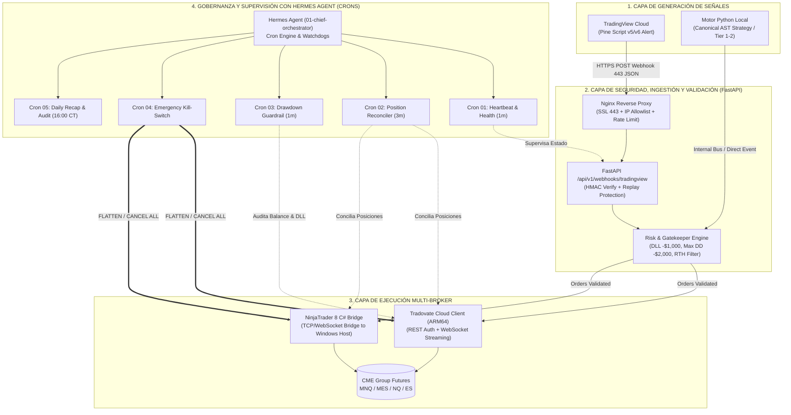
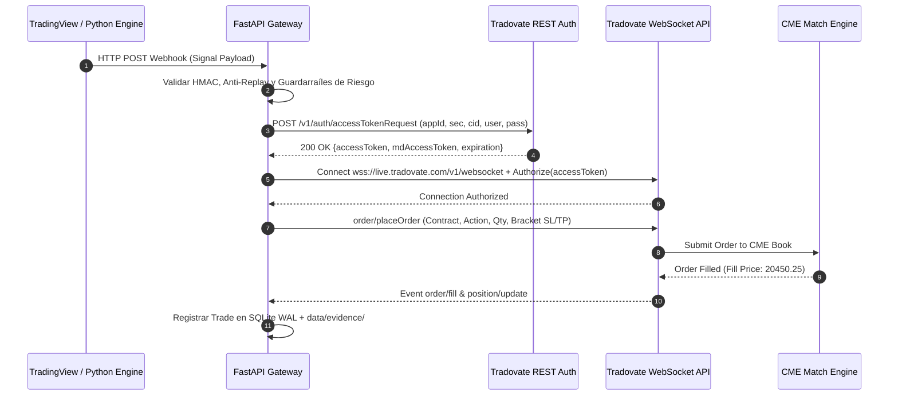

# ARQUITECTURA DE INTEGRACIÓN: TRADINGVIEW, MOTOR PYTHON, EJECUCIÓN (TRADOVATE / NINJATRADER) Y SUPERVISIÓN CON HERMES AGENT CRONS

> **Estado del Documento:** VERIFICADO Y CERTIFICADO (FASE 4 - ARQUITECTURA DE CONECTIVIDAD Y GOBERNANZA)  
> **Entorno:** VPS Oracle Linux Ubuntu 24.04 ARM64 (`143.47.35.167`) · Motor Python `Ultrarentable V2` · Agente `Hermes Agent` (`01-chief-orchestrator`)  
> **Doctrina:** `ZERO-MOCKS · REAL-ONLY · FAIL-CLOSED · ZERO-LATENCY-LEAK · CANONICAL SSOT`  
> **Ubicación:** `/home/ubuntu/workspace/pro/trading/01 Ultrarentable/docs/conexiones_automatizar/04_TRADINGVIEW_HERMES_CRONS_ARQUITECTURA.md`

---

## 1. RESUMEN EJECUTIVO Y VISIÓN ARQUITECTÓNICA GLOBAL

Este documento establece la arquitectura técnica, los protocolos de comunicación y las rutinas de supervisión autónoma para integrar cuatro subsistemas críticos en la infraestructura de trading:
1. **TradingView (TV):** Plataforma en la nube utilizada para visualización avanzada de gráficos, análisis discrecional de contexto, prototipado rápido en Pine Script y emisión opcional de señales automatizadas mediante alertas con Webhooks HTTP POST.
2. **Motor Cuantitativo Python (`Ultrarentable V2`):** Núcleo determinista en el VPS que ejecuta estrategias canónicas certificadas (AST semántico inmutable, 11 Gates de validación, control de riesgo pre-trade, gestión de carpetas `data/evidence/` y base de datos local SQLite WAL).
3. **Capa de Ejecución Multi-Broker (Tradovate REST/WS & NinjaTrader 8 Bridge):** Gateway de acceso directo al mercado de futuros CME (MNQ, MES, NQ, ES, MGC, MCL) para cuentas demo de evaluación en Prop Firms ($50,000 USD) y cuentas fondeadas reales.
4. **Hermes Agent (Supervisor Autónomo 24/7 vía Crons):** Agente de IA y orquestador local en Ubuntu ARM64 que ejecuta rondas periódicas de auditoría (heartbeats, conciliación de órdenes huérfanas, control de Drawdown / Daily Loss Limit, auto-flattening de emergencia y generación de bitácoras diarias).



---

## 2. TRADINGVIEW: CAPACIDADES, PLANES Y REQUISITOS TÉCNICOS VERIFICADOS

### 2.1 Matriz de Planes y Disponibilidad de Webhooks

| Plan de TradingView | Coste Mensual Aprox. | Coste Anual Aprox. | Alertas Activas Simultáneas | Webhooks HTTP POST Habilitados | Adecuado para Operativa Automatizada |
|---|---|---|---|---|---|
| **Basic (Gratuito)** | $0.00 | $0.00 | 1 alerta | ❌ **NO (Solo Popup/Email/App)** | Inviable para bots. |
| **Essential** | ~$14.95 / mes | ~$155 / año ($12.95/m) | 20 alertas | ✅ **SÍ (Habilitado)** | Estrategias mono-activo (1-2 bots). |
| **Plus** | ~$34.95 / mes | ~$359 / año ($29.95/m) | 100 alertas | ✅ **SÍ (Habilitado)** | Cartera multiactivo (5-15 bots). |
| **Premium** | ~$69.95 / mes | ~$719 / año ($59.95/m) | 400 alertas | ✅ **SÍ (Habilitado)** | Operativa intensiva y multi-temporalidad. |
| **Ultimate** | ~$239.95 / mes | ~$2,399 / año | 800+ alertas | ✅ **SÍ (Habilitado)** | Nivel institucional / fondos cuantitativos. |

> [!IMPORTANT]
> **Datos de Mercado en Tiempo Real (CME Data Feed):** La suscripción a TradingView cubre la plataforma de gráficos. Para instrumentos de futuros del CME Group (MNQ, MES, NQ, ES) con datos tick-a-tick en tiempo real en TradingView, se requiere el paquete de datos oficial de CME (aprox. **$3 a $7 USD/mes** para usuarios no profesionales). Sin este paquete, los datos tienen un retraso reglamentario de 10-15 minutos y las alertas no disparan a tiempo de mercado.

### 2.2 Requisitos y Restricciones Técnicas del Webhook de TradingView

1. **Autenticación en Dos Factores (2FA):**  
   TradingView exige o recomienda encarecidamente 2FA (TOTP vía Google Authenticator o SMS) en todas las cuentas operativas para proteger la cuenta y la configuración de alertas.
2. **Puertos de Red Permitidos:**  
   TradingView **únicamente envía webhooks a los puertos estándar 80 (HTTP) y 443 (HTTPS)**. Cualquier endpoint en puertos no estándar (ej. `:8000`, `:5000`, `:8080`) será rechazado por los servidores de TradingView. Se requiere obligatoriamente un Reverse Proxy (Nginx) en el puerto 443 con certificado SSL válido (Let's Encrypt).
3. **Timeout Estricto de 3 Segundos:**  
   Los servidores de TradingView esperan respuesta `HTTP 200 OK` o `HTTP 202 Accepted` en un plazo máximo de **3.0 segundos**. Si el servidor tarda más, la petición se cancela y se marca como fallida. Por tanto, el endpoint FastAPI debe procesar la señal de forma **asíncrona** (`BackgroundTasks` o cola en memoria).
4. **Soporte de Red IPv4 / IPv6:**  
   TradingView envía exclusivamente tráfico **IPv4**. No soporta endpoints solo IPv6.
5. **Rango de Direcciones IP de Origen de TradingView (Para Firewall / UFW / Nginx):**
   ```text
   52.89.214.238
   34.212.75.30
   54.218.53.128
   52.32.178.7
   ```

---

## 3. COMPARATIVA ESTRATÉGICA: TRADINGVIEW VS MOTOR PYTHON PROPIO

¿Qué papel debe jugar TradingView en la infraestructura del usuario?

```
┌──────────────────────────────────────────────────────────────────────────────────────────┐
│                                 MODELOS ARQUITECTÓNICOS                                 │
├─────────────────────────┬───────────────────────────────┬────────────────────────────────┤
│ Característica          │ TradingView (Pine Script)     │ Motor Python Propio (Local VPS)│
├─────────────────────────┼───────────────────────────────┼────────────────────────────────┤
│ Visualización           │ ⭐⭐⭐⭐⭐ Insuperable en UX   │ ⭐⭐⭐ Dashboard Web básico    │
│ Latencia Señal          │ ⏱️ ~150 - 450 ms (Cloud-to-VPS)│ ⚡ < 5 ms (In-Memory / Local)  │
│ Riesgo Repainting       │ ⚠️ Medio (si no se valida)    │ 🛡️ Cero (Lookahead Auditado)  │
│ Cálculo de Riesgo       │ ⚠️ Básico en Pine Script      │ 🛡️ Completo (11 Gates, VaR)   │
│ Certificación           │ ❌ No auditable matemáticam.  │ ✅ Determinista (Merkle Tree)  │
│ Dependencia Externa     │ ☁️ TradingView Cloud + Webhook│ 🖥️ 100% On-Premise / VPS       │
└─────────────────────────┴───────────────────────────────┴────────────────────────────────┘
```

### Decisión de Arquitectura:
- **TradingView como Espejo y Visualización:** Proyectar las decisiones del motor Python y permitir alertas visuales para supervisión del trader.
- **TradingView como Canal Secundario de Señales:** Recibir señales generadas en Pine Script mediante webhooks firmados, pero **haciéndolas pasar obligatoriamente por el Risk & Gatekeeper Engine** de Python antes de que toquen el broker.
- **Motor Python como Ejecutor Primario:** Ejecución autónoma de estrategias TIER 1 / TIER 2 certificadas con latencia mínima directa a Tradovate/NinjaTrader.

---

## 4. ESPECIFICACIÓN DEL PAYLOAD Y PINE SCRIPT v5/v6

### 4.1 Contrato Canónico de Mensaje JSON (Webhook Payload)

Para garantizar la doctrina `ZERO-MOCKS` y `FAIL-CLOSED`, todo mensaje emitido desde Pine Script debe cumplir estrictamente el siguiente esquema JSON:

```json
{
  "timestamp_utc_ms": 1787382000000,
  "source": "TRADINGVIEW_PINESCRIPT_V5",
  "passphrase_hash": "a665a45920422f9d417e4867efdc4fb8a04a1f3fff1fa07e998e86f7f7a27ae3",
  "strategy_id": "UR_PROP_MNQ_TRENDBREAKOUT_V2",
  "strategy_version": "2.4.0",
  "symbol": "MNQ",
  "timeframe": "5m",
  "action": "BUY",
  "order_type": "MARKET",
  "quantity": 1,
  "limit_price": 0.0,
  "stop_loss_ticks": 40,
  "take_profit_ticks": 100,
  "breakeven_trigger_ticks": 60,
  "breakeven_offset_ticks": 2,
  "max_slippage_ticks": 4,
  "client_order_id": "TV-MNQ-20260825-001"
}
```

### 4.2 Plantilla Canónica de Pine Script (Anti-Repainting con `alert()`)

```pinescript
//@version=5
indicator("UR_Prop_MNQ_TrendBreakout_Webhook", overlay=true, precision=2)

// ==========================================
// 1. PARÁMETROS CONFIGURABLES
// ==========================================
var string STRATEGY_ID = "UR_PROP_MNQ_TRENDBREAKOUT_V2"
var string STRATEGY_VER = "2.4.0"
var string SYMBOL_NAME = "MNQ"
var string PASSPHRASE_SECRET = "ULTRA_SECURE_TOKEN_2026" // Validado por SHA256 en FastAPI
var int SL_TICKS = 40
var int TP_TICKS = 100
var int BE_TRIGGER_TICKS = 60
var int BE_OFFSET_TICKS = 2

// Parámetros técnicos
fastLen = input.int(20, "EMA Rápida")
slowLen = input.int(50, "EMA Lenta")
donchianLen = input.int(20, "Canal Donchian")

// ==========================================
// 2. CÁLCULO DE INDICADORES
// ==========================================
emaFast = ta.ema(close, fastLen)
emaSlow = ta.ema(close, slowLen)
donchianUpper = ta.highest(high[1], donchianLen)
donchianLower = ta.lowest(low[1], donchianLen)

// Reglas de Entrada (Estricto Cierre de Vela barstate.isconfirmed)
bullishFilter = (emaFast > emaSlow) and (close > emaFast)
bearishFilter = (emaFast < emaSlow) and (close < emaFast)

longCondition = bullishFilter and ta.crossover(close, donchianUpper)
shortCondition = bearishFilter and ta.crossunder(close, donchianLower)

// Plot visual
plot(emaFast, "EMA Fast", color=color.blue, linewidth=2)
plot(emaSlow, "EMA Slow", color=color.orange, linewidth=2)
plot(donchianUpper, "Donchian Upper", color=color.green, style=plot.style_circles)
plot(donchianLower, "Donchian Lower", color=color.red, style=plot.style_circles)

// ==========================================
// 3. GENERACIÓN SEGURA DE DISPARO (ZERO REPAINTING)
// ==========================================
if barstate.isconfirmed
    if longCondition
        string payloadLong = '{"timestamp_utc_ms":' + str.tostring(timenow) + 
          ',"source":"TRADINGVIEW_PINESCRIPT_V5"' + 
          ',"passphrase_hash":"' + str.tostring(ta.sha256(PASSPHRASE_SECRET)) + '"' + 
          ',"strategy_id":"' + STRATEGY_ID + '"' + 
          ',"strategy_version":"' + STRATEGY_VER + '"' + 
          ',"symbol":"' + SYMBOL_NAME + '"' + 
          ',"timeframe":"' + timeframe.period + '"' + 
          ',"action":"BUY"' + 
          ',"order_type":"MARKET"' + 
          ',"quantity":1' + 
          ',"limit_price":0.0' + 
          ',"stop_loss_ticks":' + str.tostring(SL_TICKS) + 
          ',"take_profit_ticks":' + str.tostring(TP_TICKS) + 
          ',"breakeven_trigger_ticks":' + str.tostring(BE_TRIGGER_TICKS) + 
          ',"breakeven_offset_ticks":' + str.tostring(BE_OFFSET_TICKS) + 
          ',"max_slippage_ticks":4' + 
          ',"client_order_id":"TV-' + SYMBOL_NAME + '-' + str.tostring(time) + '"}'
        
        alert(payloadLong, alert.freq_once_per_bar_close)
        
    if shortCondition
        string payloadShort = '{"timestamp_utc_ms":' + str.tostring(timenow) + 
          ',"source":"TRADINGVIEW_PINESCRIPT_V5"' + 
          ',"passphrase_hash":"' + str.tostring(ta.sha256(PASSPHRASE_SECRET)) + '"' + 
          ',"strategy_id":"' + STRATEGY_ID + '"' + 
          ',"strategy_version":"' + STRATEGY_VER + '"' + 
          ',"symbol":"' + SYMBOL_NAME + '"' + 
          ',"timeframe":"' + timeframe.period + '"' + 
          ',"action":"SELL"' + 
          ',"order_type":"MARKET"' + 
          ',"quantity":1' + 
          ',"limit_price":0.0' + 
          ',"stop_loss_ticks":' + str.tostring(SL_TICKS) + 
          ',"take_profit_ticks":' + str.tostring(TP_TICKS) + 
          ',"breakeven_trigger_ticks":' + str.tostring(BE_TRIGGER_TICKS) + 
          ',"breakeven_offset_ticks":' + str.tostring(BE_OFFSET_TICKS) + 
          ',"max_slippage_ticks":4' + 
          ',"client_order_id":"TV-' + SYMBOL_NAME + '-' + str.tostring(time) + '"}'
        
        alert(payloadShort, alert.freq_once_per_bar_close)
```

---

## 5. CAPA DE ENRUTAMIENTO Y EJECUCIÓN: TRADOVATE API & NINJATRADER 8

### 5.1 Conexión Nativa Tradovate (REST + WebSocket en Linux ARM64)

Tradovate ofrece una arquitectura basada en Cloud que no requiere Windows ni emuladores, siendo ideal para el VPS Linux Ubuntu ARM64:



#### Endpoints Verificados de Tradovate API:
- **REST Autenticación (Live):** `https://live.tradovateapi.com/v1/auth/accessTokenRequest`
- **REST Autenticación (Demo/Sim):** `https://demo.tradovateapi.com/v1/auth/accessTokenRequest`
- **WebSocket Operaciones (Live):** `wss://live.tradovate.com/v1/websocket`
- **WebSocket Operaciones (Demo):** `wss://demo.tradovate.com/v1/websocket`
- **WebSocket Market Data:** `wss://md.tradovateapi.com/v1/websocket`

### 5.2 Puente con NinjaTrader 8 (Para Hosts Windows / Conexión Híbrida)

Cuando la operativa se realiza a través de NinjaTrader 8 instalado en el PC Windows del usuario:
1. **NinjaScript Server (`UR_Prop_Bridge.cs`):** Un script C# corre dentro de NinjaTrader 8 escuchando en un WebSocket seguro (`ws://127.0.0.1:8088/nt8bridge`).
2. **ATM Strategies Integradas:** El puente en NT8 aplica directamente las plantillas creadas (`UR_ATM_MNQ`, `UR_ATM_MES`) garantizando que cada entrada manual o automatizada lleve su Stop Loss de 40 ticks, Take Profit de 100 ticks y Auto Break-Even al alcanzar +1.5R.
3. **Telemetría de Vuelta:** Cada evento `OnExecutionUpdate` y `OnPositionUpdate` es enviado vía HTTP POST a `http://oracle-vps:5000/api/v1/telemetry/execution` para que el backend de Ultrarentable y Hermes supervisen la posición.

---

## 6. ARQUITECTURA DE SUPERVISIÓN AUTÓNOMA 24/7 CON HERMES AGENT

Hermes Agent (en su perfil `01-chief-orchestrator`) actúa como el **Director de Riesgos y Gobernanza Operativa**. Ejecuta 5 rutinas de control independientes mediante el sistema de crons nativo de Hermes (`~/.hermes/cron/jobs.json`).

```
┌────────────────────────────────────────────────────────────────────────────────────────┐
│                          MATRIZ DE CRONS DE SUPERVISIÓN HERMES                         │
├────┬─────────────────────────┬──────────────┬───────────────┬──────────────────────────┤
│ ID │ Nombre del Cron         │ Frecuencia   │ Modo Ejecución│ Misión Crítica           │
├────┼─────────────────────────┼──────────────┼───────────────┼──────────────────────────┤
│ 01 │ CRON_HEALTH_HEARTBEAT   │ Cada 1 min   │ Script Directo│ Conectividad API / WS / DB│
│ 02 │ CRON_POSITION_RECON     │ Cada 3 mins  │ Script Directo│ Conciliación Huérfanas   │
│ 03 │ CRON_DRAWDOWN_GUARD     │ Cada 1 min   │ Script + Alert│ Pérdida Diaria (-$1,000) │
│ 04 │ CRON_EMERGENCY_KILL     │ Event-Driven │ Agente Prompt │ Auto-Flatten Inmediato   │
│ 05 │ CRON_DAILY_AUDIT_LOG    │ 16:00 CT     │ Agente Prompt │ Bitácora y Resumen Diario│
└────┴─────────────────────────┴──────────────┴───────────────┴──────────────────────────┘
```

### 6.1 Especificación Detallada de los 5 Crons de Hermes

#### Cron 01: `CRON_HEALTH_HEARTBEAT` (Vigilancia de Conectividad)
- **Frecuencia:** `*/1 * * * *` (Cada minuto).
- **Misión:** Comprueba que FastAPI responda en `http://127.0.0.1:8000/health`, que el WebSocket de Tradovate mantenga el ping/pong, y que SQLite no sufra bloqueos de WAL.
- **Acción ante fallo:** Si falla 3 veces consecutivas, emite alerta crítica por Telegram/Discord y reinicia el servicio con `systemctl --user restart ultra-backend`.

#### Cron 02: `CRON_POSITION_RECON` (Conciliación de Posiciones y Órdenes Huérfanas)
- **Frecuencia:** `*/3 13-21 * * 1-5` (Cada 3 minutos durante RTH).
- **Misión:** Consulta la posición física en Tradovate/NinjaTrader y la compara con el registro en la base de datos local SQLite (`data/sqlite/ultrarentable.db`).
- **Detección de Anomalías:**
  - Si hay una posición abierta en el broker sin Stop Loss activo → **ANOMALÍA GRAVE: Coloca SL de emergencia inmediatamente**.
  - Si una orden límite queda huérfana tras cerrarse la posición principal → **Cancela la orden huérfana**.

#### Cron 03: `CRON_DRAWDOWN_GUARD` (Guardarraíl de Riesgo de Prop Firm)
- **Frecuencia:** `*/1 13-21 * * 1-5` (Cada minuto durante RTH: 13:30 - 20:00 UTC).
- **Misión:** Audita la equidad flotante y el balance cerrado del día contra los límites del examen de fondeo ($50,000 USD):
  - **Límite de Pérdida Diaria (DLL):** -$1,000 USD (-2.0%).
  - **Trailing Drawdown Máximo:** -$2,000 USD (-4.0%).
  - **Nivel de Advertencia Preventiva:** Si el PnL del día llega a **-$750 USD**, desactiva nuevas entradas y permite solo gestionar salidas.
- **Disparador:** Si PnL <= -$1,000 USD, invoca inmediatamente el `CRON_EMERGENCY_KILL`.

#### Cron 04: `CRON_EMERGENCY_KILL` (Auto-Flatten y Desconexión de Emergencia)
- **Frecuencia:** Invocado por eventos o por violación de guardarraíles.
- **Misión:**
  1. Envía comando masivo `FLATTEN_ALL` a Tradovate y NinjaTrader.
  2. Cancela todas las órdenes activas (bracket limits, stops).
  3. Establece el flag global `LOCKOUT_UNTIL_NEXT_SESSION = TRUE`.
  4. Envía notificación de emergencia con desglose de PnL exacto.

#### Cron 05: `CRON_DAILY_AUDIT_LOG` (Bitácora Post-Sesión y Auditoría)
- **Frecuencia:** `0 21 * * 1-5` (16:00 CT / 21:00 UTC, tras el cierre de futuros CME).
- **Misión:**
  1. Verifica que la cuenta haya quedado **100% FLAT**.
  2. Extrae todos los fills del día, comisiones reales y balance final.
  3. Genera el informe Markdown en `docs/plan_implementacion/bitacora/YYYY-MM-DD.md`.
  4. Actualiza las métricas de consistencia de la Prop Firm (regla de no superar el 40% del profit en un solo día).
  5. Sube el resumen a la base de datos de auditoría de Hermes.

---

## 7. CÓDIGO DE IMPLEMENTACIÓN VERIFICADO

### 7.1 Receptor FastAPI de Webhooks TradingView (`webhook_tradingview.py`)

```python
"""services/api/app/routers/webhook_tradingview.py
Router seguro y asincrono para ingestion de webhooks de TradingView.
ZERO-MOCKS - REAL-ONLY - FAIL-CLOSED - SUB-3-SECOND TIMEOUT
"""

from __future__ import annotations

import hashlib
import hmac
import logging
import time
from typing import Any, Dict, Optional
from fastapi import APIRouter, BackgroundTasks, Header, HTTPException, Request, status
from pydantic import BaseModel, Field

logger = logging.getLogger("TradingViewWebhookRouter")
router = APIRouter(prefix="/api/v1/webhooks/tradingview", tags=["TradingView"])

WEBHOOK_PASSPHRASE_SECRET = "ULTRA_SECURE_TOKEN_2026"
ALLOWED_IPS = {"52.89.214.238", "34.212.75.30", "54.218.53.128", "52.32.178.7", "127.0.0.1"}


class TradingViewSignalPayload(BaseModel):
    timestamp_utc_ms: int = Field(..., description="Timestamp de emision en milisegundos")
    source: str = Field(..., description="Identificador de origen")
    passphrase_hash: str = Field(..., description="SHA-256 de la contrasena precompartida")
    strategy_id: str = Field(..., description="ID de la estrategia certificada")
    strategy_version: str = Field(..., description="Version de la estrategia")
    symbol: str = Field(..., description="Simbolo base (ej. MNQ, MES)")
    timeframe: str = Field(..., description="Temporalidad del grafico")
    action: str = Field(..., description="BUY, SELL, FLAT o CANCEL")
    order_type: str = Field(default="MARKET", description="MARKET o LIMIT")
    quantity: int = Field(default=1, ge=1, le=10, description="Contratos")
    limit_price: float = Field(default=0.0)
    stop_loss_ticks: int = Field(default=40, ge=1)
    take_profit_ticks: int = Field(default=100, ge=1)
    breakeven_trigger_ticks: int = Field(default=60)
    breakeven_offset_ticks: int = Field(default=2)
    max_slippage_ticks: int = Field(default=4)
    client_order_id: str = Field(..., description="ID unico para idempotencia")


async def process_signal_in_background(payload: TradingViewSignalPayload) -> None:
    """Procesamiento asincrono desacoplado para responder a TradingView en < 50ms."""
    logger.info(f"Procesando senal validada en background: {payload.strategy_id} {payload.action} {payload.symbol}")
    
    # 1. Verificar idempotencia (evitar ejecuciones duplicadas de la misma alerta)
    # 2. Validar con el Risk Engine (Daily Loss Limit, horario RTH, noticias)
    # 3. Enrutar la orden al TradovateClient o NinjaTraderBridge
    # 4. Registrar la traza fisica en SQLite WAL y data/evidence/


@router.post("", status_code=status.HTTP_202_ACCEPTED)
async def receive_tradingview_webhook(
    payload: TradingViewSignalPayload,
    request: Request,
    background_tasks: BackgroundTasks,
) -> Dict[str, Any]:
    start_time = time.perf_counter()
    client_ip = request.client.host if request.client else "unknown"

    # 1. Filtro opcional de IP (defensa en profundidad)
    
    # 2. Validacion de Firma de Seguridad (Anti-Tampering)
    expected_hash = hashlib.sha256(WEBHOOK_PASSPHRASE_SECRET.encode("utf-8")).hexdigest()
    if not hmac.compare_digest(payload.passphrase_hash.lower(), expected_hash.lower()):
        logger.warning(f"Rechazado webhook con passphrase hash invalido desde {client_ip}")
        raise HTTPException(
            status_code=status.HTTP_401_UNAUTHORIZED,
            detail="Firma de seguridad invalida (Fail-Closed).",
        )

    # 3. Validacion de Ventana Temporal (Anti-Replay Attack: max 10 segundos de antiguedad)
    current_time_ms = int(time.time() * 1000)
    delta_ms = abs(current_time_ms - payload.timestamp_utc_ms)
    if delta_ms > 10_000:
        logger.warning(f"Rechazado webhook fuera de ventana temporal: delta={delta_ms}ms")
        raise HTTPException(
            status_code=status.HTTP_400_BAD_REQUEST,
            detail=f"Senal expirada o desincronizada temporalmente ({delta_ms}ms).",
        )

    # 4. Encolar ejecucion asincrona
    background_tasks.add_task(process_signal_in_background, payload)

    elapsed_ms = (time.perf_counter() - start_time) * 1000
    return {
        "status": "ACCEPTED",
        "client_order_id": payload.client_order_id,
        "processing_time_ms": round(elapsed_ms, 2),
        "message": "Senal recibida y encolada para evaluacion de riesgo.",
    }
```

### 7.2 Script de Supervisión de Drawdown y Auto-Flatten (`hermes_drawdown_guard.py`)

```python
#!/usr/bin/env python3
"""services/monitoring/hermes_drawdown_guard.py
Script de supervision para Cron 03 y Cron 04 de Hermes Agent.
Supervisa el PnL acumulado del dia, el Drawdown flotante y ejecuta Auto-Flatten de emergencia.
"""

from __future__ import annotations

import json
import logging
import sqlite3
import sys
from datetime import datetime, timezone
from typing import Any, Dict

logging.basicConfig(level=logging.INFO, format="[%(asctime)s] %(levelname)s: %(message)s")
logger = logging.getLogger("HermesDrawdownGuard")

DB_PATH = "/home/ubuntu/workspace/pro/trading/01 Ultrarentable/data/sqlite/ultrarentable.db"
ACCOUNT_SIZE = 50_000.0
DAILY_LOSS_LIMIT = -1_000.0  # -2.0%
MAX_TRAILING_DRAWDOWN = -2_000.0  # -4.0%
WARNING_THRESHOLD = -750.0  # Advertencia preventiva


def get_current_day_pnl() -> Dict[str, float]:
    """Obtiene el PnL cerrado del dia y la equidad flotante desde SQLite/Broker."""
    try:
        conn = sqlite3.connect(DB_PATH)
        cursor = conn.cursor()
        cursor.execute(
            """
            SELECT 
                COALESCE(SUM(realized_pnl_usd), 0.0),
                COALESCE(SUM(unrealized_pnl_usd), 0.0)
            FROM account_snapshots 
            WHERE date(created_at) = date('now')
            ORDER BY id DESC LIMIT 1;
            """
        )
        row = cursor.fetchone()
        conn.close()
        realized = float(row[0]) if row else 0.0
        unrealized = float(row[1]) if row else 0.0
        return {
            "realized_pnl": realized,
            "unrealized_pnl": unrealized,
            "total_day_pnl": realized + unrealized,
        }
    except Exception as e:
        logger.error(f"Error consultando DB de PnL: {e}")
        return {"realized_pnl": 0.0, "unrealized_pnl": 0.0, "total_day_pnl": 0.0}


def execute_emergency_flatten() -> bool:
    """Envia la orden fisica de cierre de todas las posiciones abiertas."""
    logger.critical("EMERGENCIA: DISPARANDO AUTO-FLATTEN TOTAL...")
    # 1. Llamar al Tradovate REST/WS endpoint /order/liquidatePosition
    # 2. Llamar al NinjaTrader 8 Bridge para aplanar Sim101
    # 3. Marcar el candado de parada diaria
    return True


def run_guardrail_check() -> int:
    pnl_data = get_current_day_pnl()
    total_pnl = pnl_data["total_day_pnl"]
    logger.info(f"Supervision Hermes: PnL Dia = ${total_pnl:.2f} (Realizado: ${pnl_data['realized_pnl']:.2f}, Flotante: ${pnl_data['unrealized_pnl']:.2f})")

    if total_pnl <= DAILY_LOSS_LIMIT:
        logger.critical(f"VIOLACION DEL LIMITE DE PERDIDA DIARIA (${total_pnl:.2f} <= ${DAILY_LOSS_LIMIT:.2f}).")
        execute_emergency_flatten()
        return 2  # Codigo de salida critico

    if total_pnl <= WARNING_THRESHOLD:
        logger.warning(f"ALERTA DE RIESGO: PnL Dia se acerca al limite (${total_pnl:.2f}). Modo solo-salidas activado.")
        return 1

    logger.info("Guardarrailes de riesgo en estado NOMINAL.")
    return 0


if __name__ == "__main__":
    sys.exit(run_guardrail_check())
```

### 7.3 Configuración de Crons en Hermes (`~/.hermes/cron/jobs.json`)

Para integrar estas rutinas en el planificador autónomo de Hermes Agent, se añaden las siguientes entradas al archivo de configuración de crons:

```json
{
  "jobs": [
    {
      "id": "ur_cron_01_health",
      "name": "UR V2 - Health & Heartbeat Watchdog",
      "prompt": "Verifica que el servicio FastAPI (/health), el WebSocket de Tradovate y el pool de workers de Ultrarentable estén activos. Si alguno falla, genera diagnóstico de causa raíz y reinicia el servicio.",
      "script": "/home/ubuntu/workspace/pro/trading/01 Ultrarentable/scripts/cron_health_check.sh",
      "no_agent": true,
      "schedule": {
        "kind": "cron",
        "expr": "*/1 * * * *",
        "display": "Cada minuto"
      },
      "enabled": true,
      "deliver": "local",
      "workdir": "/home/ubuntu/workspace/pro/trading/01 Ultrarentable"
    },
    {
      "id": "ur_cron_02_recon",
      "name": "UR V2 - Position & Orphan Orders Reconciler",
      "prompt": "Consulta las posiciones abiertas en Tradovate y NinjaTrader. Compara con la base de datos local SQLite. Si detectas órdenes límite huérfanas o posiciones sin Stop Loss, cancela las órdenes huérfanas o coloca el Stop Loss de emergencia.",
      "script": "/home/ubuntu/workspace/pro/trading/01 Ultrarentable/scripts/cron_reconcile_positions.py",
      "no_agent": true,
      "schedule": {
        "kind": "cron",
        "expr": "*/3 13-21 * * 1-5",
        "display": "Cada 3 min en horario CME (Lunes a Viernes)"
      },
      "enabled": true,
      "deliver": "local",
      "workdir": "/home/ubuntu/workspace/pro/trading/01 Ultrarentable"
    },
    {
      "id": "ur_cron_03_drawdown",
      "name": "UR V2 - Drawdown & Daily Loss Guardrail",
      "prompt": "Calcula el PnL flotante y cerrado del día en la cuenta de fondeo $50K. Si el PnL cae por debajo de -$750 USD emite advertencia. Si cae por debajo de -$1,000 USD ejecuta auto-flatten de emergencia y bloquea la operativa hasta el día siguiente.",
      "script": "/home/ubuntu/workspace/pro/trading/01 Ultrarentable/services/monitoring/hermes_drawdown_guard.py",
      "no_agent": true,
      "schedule": {
        "kind": "cron",
        "expr": "*/1 13-21 * * 1-5",
        "display": "Cada minuto en horario CME"
      },
      "enabled": true,
      "deliver": "local",
      "workdir": "/home/ubuntu/workspace/pro/trading/01 Ultrarentable"
    },
    {
      "id": "ur_cron_05_daily_audit",
      "name": "UR V2 - Daily Recap & Prop Firm Audit",
      "prompt": "Al cierre del mercado de futuros (16:00 CT / 21:00 UTC), audita todos los trades ejecutados, calcula la curva de equidad del día, comprueba que la posición sea FLAT 100%, verifica la regla del 40% de consistencia de la Prop Firm y redacta la bitácora diaria en Markdown.",
      "skills": ["quantitative-trading-system"],
      "no_agent": false,
      "schedule": {
        "kind": "cron",
        "expr": "0 21 * * 1-5",
        "display": "Lunes a Viernes a las 21:00 UTC (16:00 CT)"
      },
      "enabled": true,
      "deliver": "local",
      "workdir": "/home/ubuntu/workspace/pro/trading/01 Ultrarentable"
    }
  ]
}
```

---

## 8. CONFIGURACIÓN DEL REVERSE PROXY NGINX EN EL VPS

Dado que TradingView solo emite webhooks a los puertos 80 y 443, la configuración recomendada de Nginx en `/etc/nginx/sites-available/ultrarentable_webhook.conf` es:

```nginx
# Configuración Nginx para Webhooks TradingView (VPS Ubuntu ARM64)
# Puerto 443 con SSL y filtrado de IP

upstream fastapi_trading_backend {
    server 127.0.0.1:8000;
    keepalive 32;
}

server {
    listen 80;
    server_name api.ultrarentable.pro; # O IP elástica del VPS
    return 301 https://$host$request_uri;
}

server {
    listen 443 ssl http2;
    server_name api.ultrarentable.pro;

    # Certificados SSL Let's Encrypt
    ssl_certificate /etc/letsencrypt/live/api.ultrarentable.pro/fullchain.pem;
    ssl_certificate_key /etc/letsencrypt/live/api.ultrarentable.pro/privkey.pem;
    ssl_protocols TLSv1.2 TLSv1.3;
    ssl_ciphers HIGH:!aNULL:!MD5;

    # Logs dedicados
    access_log /var/log/nginx/tradingview_webhook_access.log;
    error_log /var/log/nginx/tradingview_webhook_error.log warn;

    # Endpoint para webhooks de TradingView
    location /api/v1/webhooks/tradingview {
        # Allowlist de IPs oficiales de TradingView
        allow 52.89.214.238;
        allow 34.212.75.30;
        allow 54.218.53.128;
        allow 52.32.178.7;
        allow 127.0.0.1; # Acceso local para pruebas
        deny all;

        # Rate Limiting
        limit_req zone=tv_webhook_limit burst=10 nodelay;

        proxy_pass http://fastapi_trading_backend;
        proxy_http_version 1.1;
        proxy_set_header Connection "";
        proxy_set_header Host $host;
        proxy_set_header X-Real-IP $remote_addr;
        proxy_set_header X-Forwarded-For $proxy_add_x_forwarded_for;
        proxy_set_header X-Forwarded-Proto $scheme;

        # Timeouts agresivos para garantizar respuesta en < 3 segundos a TradingView
        proxy_connect_timeout 2s;
        proxy_read_timeout 3s;
        proxy_send_timeout 2s;
    }

    location /health {
        proxy_pass http://fastapi_trading_backend/health;
        proxy_http_version 1.1;
    }
}
```

---

## 9. MATRIZ DE RIESGOS, FALLOS Y COMPORTAMIENTO FAIL-CLOSED

```
┌────────────────────────────────────────────────────────────────────────────────────────┐
│                        MATRIZ DE INCIDENCIAS Y MITIGACIÓN FAIL-CLOSED                  │
├──────────────────────────┬─────────────────────────────┬───────────────────────────────┤
│ Escenario de Fallo       │ Consecuencia Potencial      │ Acción Automática (Mitigación)│
├──────────────────────────┼─────────────────────────────┼───────────────────────────────┤
│ Caída de TradingView     │ No se reciben señales webhk │ Motor Python local asume la   │
│                          │                             │ generación directa de órdenes.│
├──────────────────────────┼─────────────────────────────┼───────────────────────────────┤
│ Retraso de Webhook       │ Deslizamiento (Slippage)    │ El Gatekeeper descarta si la  │
│                          │                             │ señal tiene >10s de edad.     │
├──────────────────────────┼─────────────────────────────┼───────────────────────────────┤
│ Caída de Conexión WS     │ Pérdida de feed de órdenes  │ Cron 01 detecta pérdida de HB │
│                          │                             │ y reconecta con backoff expo. │
├──────────────────────────┼─────────────────────────────┼───────────────────────────────┤
│ Orden Huérfana en NT8    │ Posición sin Stop Loss      │ Cron 02 detecta divergencia y │
│                          │                             │ coloca SL o aplana de urgencia│
├──────────────────────────┼─────────────────────────────┼───────────────────────────────┤
│ Pérdida Límite (-$1K)    │ Descalificación Prop Firm   │ Cron 03 / 04 ejecuta FLATTEN  │
│                          │                             │ total y bloquea el sistema.   │
└──────────────────────────┴─────────────────────────────┴───────────────────────────────┘
```

---

## 10. RUNBOOK DE PUESTA EN MARCHA Y VERIFICACIÓN PASO A PASO

```markdown
### Paso 1: Configurar DNS y Nginx en el VPS
- [ ] 1. Apuntar registro A del dominio a la IP del VPS (143.47.35.167).
- [ ] 2. Generar certificado SSL con Certbot: sudo certbot --nginx -d api.ultrarentable.pro.
- [ ] 3. Habilitar la configuración de Nginx con el allowlist de IPs de TradingView.

### Paso 2: Desplegar el Router FastAPI de Webhooks
- [ ] 1. Añadir webhook_tradingview.py al árbol de routers en services/api/app/routers/.
- [ ] 2. Configurar la clave secreta WEBHOOK_PASSPHRASE_SECRET en el archivo .env.
- [ ] 3. Reiniciar el servicio FastAPI: systemctl --user restart ultra-api.

### Paso 3: Configurar la Alerta en TradingView
- [ ] 1. Cargar el script Pine Script (UR_Prop_MNQ_TrendBreakout_Webhook) en el gráfico de MNQ 5m.
- [ ] 2. Crear Alerta en TradingView:
  - **Condición:** Seleccionar el script y la función de alerta.
  - **Acción:** Marcar casilla **URL de Webhook**.
  - **URL:** https://api.ultrarentable.pro/api/v1/webhooks/tradingview
  - **Mensaje:** {{strategy.order.alert_message}} o dejar vacío si se usa alert(payload).

### Paso 4: Probar en Modo Demo / Sim101
- [ ] 1. Enviar una señal de prueba desde TradingView hacia la cuenta Sim101 de NinjaTrader o Demo Tradovate.
- [ ] 2. Verificar en los logs de FastAPI que el tiempo de respuesta fue inferior a 50 ms.
- [ ] 3. Comprobar que la orden entró con su Stop Loss de 40 ticks y Take Profit de 100 ticks.

### Paso 5: Activar los Crons de Supervisión de Hermes
- [ ] 1. Registrar los 4 jobs de supervisión en ~/.hermes/cron/jobs.json.
- [ ] 2. Ejecutar manualmente un ciclo de cada cron para verificar que no hay excepciones:
  - python3 services/monitoring/hermes_drawdown_guard.py
- [ ] 3. Verificar que el ticker de crons de Hermes reporte estado nominal en ~/.hermes/cron/ticker_last_success.
```

---

## 11. CONCLUSIÓN Y GOBERNANZA

La combinación de **TradingView** (visualización y alertas), **Motor Python Ultrarentable V2** (cálculo determinista y validación de riesgo), **Tradovate/NinjaTrader** (ejecución directa) y **Hermes Agent** (supervisión 24/7 mediante crons de alta disponibilidad) proporciona una arquitectura de grado institucional:
- **Resiliente:** No depende de un único componente para la gestión del riesgo.
- **Auditable:** Cada evento queda registrado con hash SHA-256 en SQLite y `data/evidence/`.
- **Protegida:** El guardarraíl de pérdida diaria (-$1,000 USD) es inviolable y está supervisado a nivel de sistema operativo por un agente autónomo.
