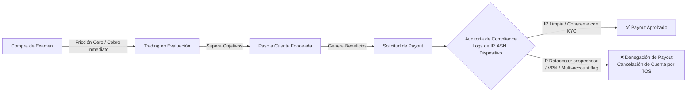
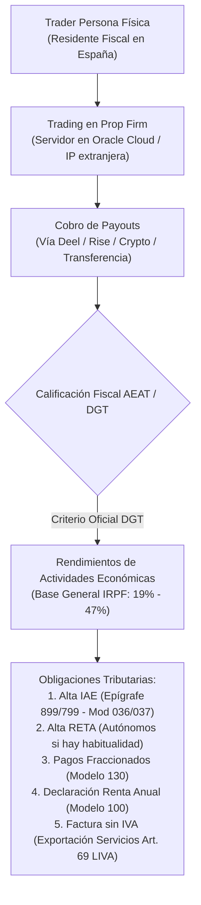
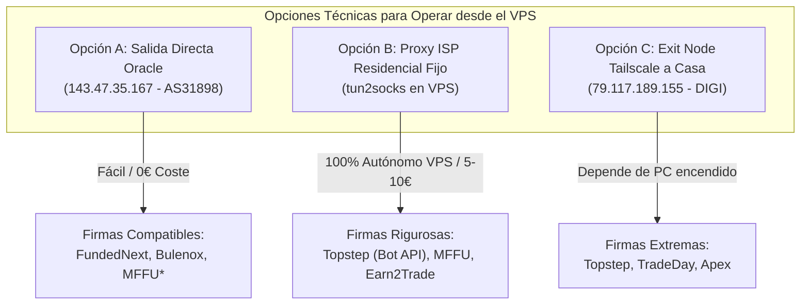

# ⚖️ Marco Normativo, Legal, Contractual y Fiscal sobre el Uso de IPs, VPS y VPNs en Prop Firms de Futuros

> **Pregunta Fundamental del Usuario:** *"¿Qué ley o norma hay con las IPs al operar futuros en prop firms desde un VPS Linux en España?"*
>
> **Respuesta Ejecutiva Resumida:** 
> 1. **No existe ninguna ley estatal ni normativa de reguladores financieros (CFTC, NFA, SEC, CNMV, ESMA) que prohíba a un trader usar un VPS o una VPN.** De hecho, en el trading institucional y profesional de futuros, los servidores dedicados, el co-location en centros de datos (como CME Aurora) y los entornos remotos son el estándar de la industria.
> 2. **La restricción de IPs y VPNs proviene de una combinación de 3 fuentes distintas:**
>    - **Leyes de Sanciones Internacionales y Prevención de Blanqueo de Capitales (OFAC / FinCEN / AML / KYC):** Obligan a las entidades a verificar que el usuario no opera desde jurisdicciones sancionadas (Rusia, Irán, etc.).
>    - **Políticas de Licencias de Datos de Mercado de CME Group:** Restricciones de usuarios no profesionales, credenciales no compartidas (*Unit of Count*) y límites de dispositivos concurrentes.
>    - **Términos de Servicio Contractuales Privados (TOS) de cada Prop Firm:** Cláusulas de antifraude diseñadas para detectar granjas clandestinas de pase de exámenes (*prop farming*), arbitraje de latencia contra el simulador, multicuentas que superan el límite de capital y cuentas compartidas (*account sharing*).
> 3. **Implicaciones para el residente español:** Operar desde un VPS con IP extranjera **no altera la residencia fiscal española** (Art. 9 LIRPF). Los ingresos de prop firms (*payouts*) tributan en la **Base General del IRPF como Rendimientos de Actividades Económicas** (no como ganancias patrimoniales del ahorro), exigiendo alta en IAE y RETA si es habitual.

---

## 🎯 Navegación y Enlaces Bidireccionales
- 📌 **Ficha Maestra:** [[Ultrarentable]]
- 🛡️ **Guía Técnica de Conectividad:** [[01_VPN_IP_SEGURO_VPS_FONDEO]]
- 🎯 **Solución IP Única Residencial:** [[05_IP_UNICA_RESIDENCIAL_SALIDA_TODO]]
- 🤖 **Automatización NinjaTrader en Linux:** [[02_NINJATRADER_AUTOMATIZACION_LINUX]]
- 🌐 **Arquitectura API Tradovate:** [[03_TRADOVATE_API_AUTOMATIZACION]]
- 📊 **Watchdogs y Crons Hermes:** [[04_TRADINGVIEW_HERMES_CRONS_ARQUITECTURA]]

---

## 📑 Índice General

1. [La Pirámide Normativa: Desmitificación Jurídica](#1-la-pirámide-normativa-desmitificación-jurídica)
2. [Nivel 1: Reguladores Financieros Estatales (CFTC, NFA, SEC, CNMV, ESMA)](#2-nivel-1-reguladores-financieros-estatales-cftc-nfa-sec-cnmv-esma)
3. [Nivel 2: Normativa Internacional de Sanciones, AML, OFAC y KYC](#3-nivel-2-normativa-internacional-de-sanciones-aml-ofac-y-kyc)
4. [Nivel 3: Normativa de Bolsas y Mercados de Futuros (CME Group)](#4-nivel-3-normativa-de-bolsas-y-mercados-de-futuros-cme-group)
5. [Nivel 4: Términos Contractuales Privados (TOS) y la Anatomía del Payout Denial](#5-nivel-4-términos-contractuales-privados-tos-y-la-anatomía-del-payout-denial)
6. [Auditoría Comparativa Oficial de Políticas de IP por Prop Firm (2026)](#6-auditoría-comparativa-oficial-de-políticas-de-ip-por-prop-firm-2026)
7. [Marco Fiscal y Legal en España (AEAT, DGT, IRPF, IVA, RETA)](#7-marco-fiscal-y-legal-en-españa-aeat-dgt-irpf-iva-reta)
8. [Diagnóstico Forense y Recomendaciones Operativas para el VPS Oracle ARM64](#8-diagnóstico-forense-y-recomendaciones-operativas-para-el-vps-oracle-arm64)

---

## 1. La Pirámide Normativa: Desmitificación Jurídica

Existe una confusión generalizada entre traders minoristas sobre qué es "ilegal" por ley y qué es una simple "violación contractual" de los términos de una empresa privada.

```
       ▲
      / \     NIVEL 1: Leyes Financieras Estatales (CFTC, NFA, CNMV, ESMA)
     /   \    -> NO prohíben VPS ni VPNs. Uso institucional masivo de servidores.
    /-----\
   /       \   NIVEL 2: Sanciones Internacionales y AML (OFAC, FinCEN, Ley 10/2010)
  /         \  -> Obliga a bloquear países sancionados y verificar identidad real.
 /-----------\
/             \ NIVEL 3: Políticas de Mercado de CME Group (Licencias de Datos)
/               \-> Prohíbe compartir credenciales y conexiones simultáneas no autorizadas.
/-----------------\
/                   \ NIVEL 4: Términos Contractuales Privados (TOS Prop Firms)
/                     \-> Cláusulas antifraude: prohíben granjas, bots tóxicos y multicuentas.
-----------------------
```

### Tabla Resumen de Naturaleza Normativa

| Ámbito | ¿Es Ley del Estado? | ¿Quién lo emite? | ¿Prohíbe VPS / VPN? | Consecuencia del Incumplimiento |
|---|---|---|---|---|
| **Regulación Financiera** | **SÍ** | CFTC, NFA, CNMV, ESMA | ❌ **NO.** Es 100% legal operar con servidores remotos. | N/A para el uso de servidores. |
| **Sanciones y AML** | **SÍ (Derecho Internacional / Penal)** | OFAC, FinCEN, Tesoro EE.UU., UE | ⚠️ **CONDICIONAL:** Ilegal si se usa para evadir bloqueos a países sancionados. | Congelación de fondos, multas penales para la entidad, baneo permanente. |
| **Licencias de Mercado** | **CONTRATOS DE MERCADO** | CME Group, ICE, Eurex | ⚠️ **CONDICIONAL:** Exige no compartir credenciales ni superar dispositivos simultáneos. | Reclasificación a "Usuario Profesional" ($105+/mes) o corte de datos. |
| **Términos de Servicio (TOS)** | **DERECHO PRIVADO CONTRACTUAL** | Cada Prop Firm (Topstep, Apex, etc.) | ⚠️ **A CRITERIO DE CADA FIRMA:** Unas lo prohíben, otras lo regulan con IP fija. | Cancelación de cuenta, pérdida de la cuota y **denegación del Payout**. |
| **Fiscalidad Española** | **SÍ (Derecho Tributario)** | AEAT / DGT (Hacienda) | ❌ **NO.** No le importa tu IP técnica; le importa dónde resides fiscalmente. | Sanciones tributarias por no declarar ingresos extranjeros. |

---

## 2. Nivel 1: Reguladores Financieros Estatales (CFTC, NFA, SEC, CNMV, ESMA)

### 2.1 Naturaleza Jurídica Real de las Prop Firms
Las empresas de fondeo minoristas (*retail prop firms*) como Topstep, Apex, MyFundedFutures, Bulenox o Take Profit Trader **NO son brokers, ni entidades bancarias, ni intermediarios financieros registrados (FCM - Futures Commission Merchants, ni ESI - Empresas de Servicios de Inversión)**.

1. **Fase de Evaluación (*Challenge / Combine*):**
   - Jurídicamente, el usuario compra un servicio educativo y de evaluación técnica en un entorno **100% simulado (demo)**.
   - El dinero pagado es una tarifa de evaluación (*fee*), no un depósito de capital en una cuenta de corretaje a nombre del cliente.
   - La CFTC y la CNMV no regulan los entornos de videojuegos o simuladores de evaluación educativa, salvo que exista estafa piramidal, fraude publicitario o captación no autorizada de pasivo.

2. **Fase Financiada (*Funded / Performance Account*):**
   - **Modelo Mayoritario (*Simulated Funded / B-Book*):** La prop firm mantiene la cuenta en simulación con datos de mercado reales, asume el riesgo contra su propio balance y paga al trader una comisión/reparto de beneficios (*payout*) según el rendimiento en el simulador.
   - **Modelo Minoritario (*Live Brokerage / Sub-Account*):** La firma abre una subcuenta omnibus en un broker/FCM real (Dorman Trading, Phillip Capital, Edge Clear, NinjaTrader Brokerage) donde el capital pertenece a la entidad corporativa y el trader actúa como contratista autorizado.

### 2.2 ¿Qué dicen los Reguladores sobre el uso de VPS y Automatización?
- **CFTC (Commodity Futures Trading Commission) & NFA (National Futures Association):**
  - No existe ninguna regulación que limite el uso de VPS, servidores en la nube (AWS, Google Cloud, Oracle) o VPNs para la ejecución de órdenes en los mercados de derivados.
  - La industria de futuros profesionales (CTAs, CPOs, Hedge Funds) opera de forma estándar desde centros de datos co-ubicados (*co-location*) para minimizar latencias.
  - La NFA exige a sus miembros registrados (FCMs y CPOs) medidas de ciberseguridad (NFA Interpretive Notice 9070), requiriendo que los accesos remotos sean seguros, lo que avala el uso de redes privadas seguras y autenticación multifactor.
- **CNMV (Comisión Nacional del Mercado de Valores - España) & ESMA (Europa):**
  - Bajo la **Ley 6/2023, de 17 de marzo, de los Mercados de Valores y de los Servicios de Inversión (LMVSI)** y la directiva europea **MiFID II**, la CNMV supervisa a las entidades que prestan servicios de inversión o custodian fondos de terceros en España.
  - La CNMV no regula las cuentas de evaluación de prop firms porque no captan depósitos para ser invertidos en mercados regulados a nombre del cliente.
  - La CNMV ha emitido alertas y advertencias de consumo señalando que estas empresas no ofrecen la protección de los Fondos de Garantía de Inversiones (FOGAIN), pero **no existe prohibición legal alguna para que un ciudadano español contrate un desafío con una empresa extranjera ni para que conecte un servidor Linux a dicho servicio**.

---

## 3. Nivel 2: Normativa Internacional de Sanciones, AML, OFAC y KYC

Esta es la **raíz legal obligatoria** por la cual todas las prop firms monitorizan obligatoriamente las direcciones IP y restringen las VPNs durante el registro y los pagos.

```mermaid
flowchart TD
    Tr["Trader Conectándose"] --> VPN["VPN / Proxy Anónimo"]
    VPN --> WAF["Cloudflare / DataDome WAF"]
    WAF --> Filter{"¿IP pertenece a DataCenter / VPN conocida?"}
    Filter -->|Sí| Flag["Flag de Seguridad: Posible Evasión Geográfica"]
    Filter -->|No| Pass["Tráfico Permitido"]
    Flag --> Compliance["Auditoría de Compliance / OFAC"]
    Compliance --> Check{"¿Coincide KYC con Ubicación Real?"}
    Check -->|No / Sospecha| Block["Baneo de Cuenta / Retención de Fondos (AML Block)"]
    Check -->|Sí (Explicado)| OK["Aprobación de Payout"]
```

### 3.1 OFAC (Office of Foreign Assets Control) y Leyes Antiterroristas
- Las prop firms con sede en EE.UU. (o que utilizan pasarelas financieras sujetas a jurisdicción estadounidense como Stripe, Rise, Deel o transferencias bancarias en USD) están sujetas a las normativas del **Departamento del Tesoro de EE.UU. a través de la OFAC**.
- La OFAC prohíbe terminantemente realizar transacciones comerciales o financieras con individuos ubicados en **países o regiones sancionadas**:
  - *Jurisdicciones sancionadas globales:* Cuba, Irán, Corea del Norte, Siria, regiones ocupadas de Ucrania (Crimea, Donetsk, Luhansk), y personas o entidades incluidas en la lista SDN (*Specially Designated Nationals*).
  - *Restricciones sectoriales:* Determinadas operaciones con Rusia y Bielorrusia.
- **Responsabilidad Penal de la Prop Firm:** Si una prop firm paga un *payout* a una persona en una región sancionada que utilizó una VPN para fingir estar en España o EE.UU., la empresa se enfrenta a sanciones millonarias del gobierno estadounidense y la revocación de sus cuentas bancarias.

### 3.2 Por qué el KYC audita la IP de Conexión
1. **Verificación de Residencia Real:** En el momento del KYC (Know Your Customer) mediante proveedores como SumSub, Veriff o Persona, se contrasta la dirección del documento de identidad con la **geolocalización de la IP de subida**.
2. **Prohibición de VPN en el KYC:** Si realizas el KYC conectado a una VPN o desde una IP de Datacenter de un país distinto al de tu documento de identidad, el sistema marca la verificación como **"High Risk / Fraud Alert"**, denegando la verificación.
3. **Registro Histórico de Logins:** Cuando solicitas un retiro de fondos (*Payout*), el software de Compliance cruza el histórico de todas las IPs desde las que se enviaron órdenes. Si detectan que durante el examen la cuenta se operó desde una IP residencial en España, pero los días de mayor ganancia se operó desde una IP de Datacenter en Ucrania o Singapur, la cuenta se congela bajo sospecha de evasión de sanciones o cesión de cuenta a terceros.

---

## 4. Nivel 3: Normativa de Bolsas y Mercados de Futuros (CME Group)

CME Group (que engloba CME, CBOT, NYMEX y COMEX) tiene normas muy estrictas sobre la distribución y consumo de sus datos de mercado en tiempo real.

### 4.1 Definición de Usuario: Non-Professional vs. Professional
Para acceder a las tarifas reducidas de datos de mercado minoristas (aprox. 3-5/mes por paquete de mercado en vez de los más de 05/mes de tarifa profesional por cada mercado):
- El trader debe firmar digitalmente el **CME Subscriber Agreement**.
- **Requisitos de No Profesional:**
  1. Operar exclusivamente a título personal y privado.
  2. No estar registrado como CTA, CPO, broker o asesor de inversiones ante la CFTC/NFA/SEC o regulador equivalente internacional.
  3. No utilizar fondos de terceros ni compartir la información con otras personas o entidades.

### 4.2 Regla de Conexiones Concurrentes y "Unit of Count"
- **Límite de Terminales:** CME establece que un usuario no profesional puede tener acceso a datos de mercado en tiempo real en un **máximo de 2 dispositivos/terminales simultáneos** para un mismo distribuidor.
- **Prohibición de Compartición de Credenciales:** Está estrictamente prohibido compartir el usuario y contraseña de datos de mercado con otra persona o sistema independiente.
- **Impacto de Múltiples IPs Simultáneas:** Si los servidores de CME o los proveedores de datos (Rithmic, Tradovate, CQG) detectan que un mismo usuario se conecta a la vez desde dos direcciones IP geográficamente incompatibles (ej. Madrid y Virginia), el sistema interpreta que se trata de **dos usuarios distintos compartiendo una única licencia**, lo que provoca la suspensión inmediata del feed de datos y la facturación de multas o tarifas profesionales retroactivas a la prop firm.

### 4.3 Política de Datos No-Display (*Non-Display Market Data Policy*)
- CME define el uso *Non-Display* como el procesamiento automatizado de datos de mercado por parte de algoritmos, programas o servidores (ATS - *Automated Trading Systems*) sin que exista necesariamente una persona mirando la pantalla gráfica en ese instante.
- En el ámbito de las prop firms minoristas, la licencia de datos suele cubrirse a través de la plataforma autorizada (NinjaTrader, Tradovate, Rithmic, Quantower). Sin embargo, si un usuario monta un sistema de *scraping* o extracción masiva de cotizaciones para alimentar motores externos sin intermediación de la API autorizada, incurre en una infracción directa de la política de datos del exchange.

### 4.4 Trazabilidad de Órdenes: Tag 50 (Operator ID)
- En el protocolo FIX / Globex de CME, cada orden remitida al mercado debe llevar asignado un **Tag 50 Operator ID**, que identifica unívocamente a la persona o al equipo responsable del sistema automatizado (ATS).
- Aunque el Tag 50 es un identificador lógico que gestiona el broker/FCM y no una IP en sí misma, los sistemas de auditoría cruzan el Tag 50 con la IP de origen del mensaje para garantizar la trazabilidad forense ante investigaciones de manipulación de mercado (como *spoofing* o *layering* bajo la Regla 575 de CME).

---

## 5. Nivel 4: Términos Contractuales Privados (TOS) y la Anatomía del Payout Denial

El **99% de las cancelaciones de cuentas y denegaciones de pagos por motivos de IP no se deben a leyes estatales ni a la policía**, sino a los **Términos de Servicio (TOS)** que el trader acepta al pagar la evaluación.

### 5.1 El Modelo de Negocio de las Prop Firms y por qué Auditan en el Payout
- **Durante la Evaluación (Fase de Cobro):** La prop firm busca la menor fricción posible. Rara vez bloquean a un usuario durante el examen por usar una IP de datacenter, ya que el usuario ha pagado su tarifa y la estadística indica que el 90-95% suspenderá por gestión de riesgo o drawdown.
- **En la Solicitud de Retiro (Fase de Pago / Payout Review):** En este punto, la empresa debe desembolsar dinero de su propia tesorería. El departamento de Riesgos y Compliance somete la cuenta a una **auditoría forense automatizada**. Si encuentran cualquier indicio de infracción en sus TOS (incluyendo IP flags), aplican la cláusula de rescisión contractual para denegar el pago.



### 5.2 Las 5 Amenazas que las Prop Firms combaten analizando IPs

1. **Granjas de Pase de Exámenes (*Pass-Your-Challenge Services / Prop Farming*):**
   - Empresas clandestinas que cobran a particulares por pasarles las evaluaciones usando bots de alta frecuencia o traders en masa.
   - *Patrón de detección:* Cientos de cuentas de diferentes usuarios conectándose desde el mismo rango de IPs de proveedores como Hetzner, OVH, Contabo u Oracle Cloud, o compartiendo el mismo *browser fingerprint*.
2. **Arbitraje de Latencia y Explotación del Motor Demo (*Toxic Flow*):**
   - Estrategias que explotan los microsegundos de retraso entre el feed real de CME y el motor de simulación de la plataforma para ejecutar órdenes garantizadas sin slippage real.
   - Suelen ejecutarse desde servidores VPS en centros de datos con ultrabaja latencia.
3. **Evasión del Límite Máximo de Capital (*Max Allocation / Multi-Accounting*):**
   - Cada prop firm establece un límite máximo de cuentas financiadas por persona/hogar (ej. Topstep máx. 3 cuentas Express Funded; Apex máx. 20 cuentas PA).
   - Algunos operadores abren cuentas adicionales a nombre de amigos o familiares para multiplicar su capital. Las prop firms detectan esto cuando varias cuentas con distinto titular operan exactamente desde la misma IP o comparten huella digital.
4. **Cuentas Compartidas (*Account Sharing*) y *Reverse Trading*:**
   - Dos cuentas de distintos usuarios abren posiciones contrarias (una largo, otra corto) en el mismo segundo ante una noticia macro para asegurar que una de las dos duplique la cuenta.
   - La correlación de timestamps e IPs identifica la colusión de forma inmediata.
5. **Evasión de Jurisdicciones Prohibidas:**
   - Uso de VPNs comerciales para ocultar que el operador reside en un país donde la prop firm no tiene permitido operar legalmente.

### 5.3 Cómo Auditan Técnicamente tu Conexión

Las prop firms modernas no se limitan a mirar un número de IP; utilizan motores de seguridad perimetral avanzados (Cloudflare Enterprise, DataDome, MaxMind GeoIP2, IPQualityScore, FingerprintJS):

| Factor Analizado | Qué Detecta el Sistema | Riesgo |
|---|---|---|
| **ASN & Tipo de IP** | Identifica si la IP pertenece a un ISP residencial (Telefónica, Digi, Orange) o a un centro de datos / hosting (Oracle AS31898, AWS AS16509, Hetzner AS24940). | 🔴 **Alto** en firmas estrictas (Topstep, TradeDay) |
| **VPN / Proxy Flag** | Base de datos de IPs públicas de NordVPN, ExpressVPN, Surfshark, Mullvad. | 🔴 **Crítico** (bloqueo automático o error 403) |
| **Fraud Score / IPQS** | Puntuación de 0 a 100 basada en abuso previo de esa IP (spam, bots, scrapers). | 🟠 **Medio/Alto** en IPs compartidas de VPS baratos |
| **Device Fingerprint** | Huella del navegador: Canvas, WebGL, fuentes instaladas, resolución, cabeceras HTTP, WebRTC. | 🔴 **Crítico** para detectar si varias cuentas usan el mismo ordenador |
| **Viajes Imposibles (*Impossible Travel*)** | Iniciar sesión en Madrid a las 14:00 y en Nueva York a las 14:15. | 🔴 **Crítico** (dispara congelación inmediata) |
| **Fuga de WebRTC / DNS** | La IP de la interfaz es una VPN de EE.UU., pero la consulta WebRTC / DNS revela servidores DNS de España. | 🟠 **Medio** (evidencia clara de uso de túnel) |

---

## 6. Auditoría Comparativa Oficial de Políticas de IP por Prop Firm (2026)

A continuación se detalla la normativa contractual verificada de las principales empresas de fondeo de futuros:

```
┌─────────────────────────────────────────────────────────────────────────────┐
│                 MATRIZ DE COMPATIBILIDAD CON VPS Y DATACENTER               │
├──────────────────────┬─────────────┬──────────────┬─────────────┬───────────┤
│ Prop Firm            │ Política    │ Política     │ Bots /      │ Riesgo en │
│                      │ VPN         │ VPS          │ Algoritmos  │ Oracle IP │
├──────────────────────┼─────────────┼──────────────┼─────────────┼───────────┤
│ Topstep              │ ❌ Prohibido │ ❌ Prohibido* │ ✅ Permitidos│ 🔴 ALTO   │
│ MyFundedFutures      │ ⚠️ Cuidado  │ ✅ Permitido  │ ✅ Permitidos│ 🟡 MEDIO  │
│ Apex Trader Funding  │ ⚠️ Restring.│ ⚠️ Cuidado   │ ❌ Prohibidos│ 🔴 ALTO   │
│ Bulenox              │ ⚠️ Restring.│ ✅ Permitido  │ ✅ Permitidos│ 🟢 BAJO   │
│ FundedNext           │ ⚠️ Permitido│ ✅ IP Fija    │ ✅ Permitidos│ 🟢 BAJO   │
│ Take Profit Trader   │ ⚠️ Restring.│ ⚠️ Cuidado   │ ❌ Prohibidos│ 🔴 ALTO   │
│ TradeDay             │ ❌ Prohibido │ ❌ Prohibido  │ ⚠️ Restring. │ 🔴 ALTO   │
│ Earn2Trade           │ ⚠️ Restring.│ ✅ Permitido  │ ✅ Permitidos│ 🟡 MEDIO  │
└──────────────────────┴─────────────┴──────────────┴─────────────┴───────────┤
 *Topstep exige que el trading se origine en el dispositivo personal del trader.│
```

---

### 6.1 Topstep
- **Términos Oficiales sobre VPN / Proxies:** ❌ **Estrictamente Prohibido.** El uso de VPNs, proxies, redes Tor o cualquier mecanismo de ofuscación de geolocalización está expresamente prohibido en los TOS. Provoca errores automáticos de acceso (*403 Forbidden*) y baneo de cuenta.
- **Términos sobre VPS / Hosting:** ❌ **Prohibido en entorno abierto.** Topstep exige que las sesiones de trading se originen desde el hardware personal y la red local del titular de la cuenta. El uso de servidores en centros de datos comerciales (AWS, Oracle, Hetzner) activa las alertas de servicios de terceros (*Pass-your-challenge*).
- **Política de Bots:** ✅ **Permitidos vía API oficial (TopstepX / Tradovate),** siempre que se ejecuten localmente en la máquina del usuario y no utilicen estrategias de arbitraje de latencia, HFT o manipulación del simulador.
- **Veredicto Oracle VPS:** 🔴 **Incompatible en conexión directa.** Requiere obligatoriamente salir por la IP Residencial de casa (Túnel Tailscale) o proxy ISP dedicado.

---

### 6.2 MyFundedFutures (MFFU)
- **Términos Oficiales sobre VPN:** ⚠️ **Desaconsejado.** Prohibido terminantemente durante el registro, KYC y solicitudes de Payout. Prohibido usar VPN para saltar geobloqueos de países sancionados.
- **Términos sobre VPS:** ✅ **Permitido.** Se permite el uso de VPS siempre que cuente con una **IP estática dedicada** y mantenga una absoluta **consistencia de IP**. Si vas a operar desde una IP de servidor, se recomienda informar preventivamente a soporte o mantener dicha IP fija durante toda la vida de la cuenta.
- **Política de Bots:** ✅ **Permitidos EAs y algoritmos propios.** Prohibido el HFT, el arbitraje y la compra de bots comerciales masivos compartidos entre cientos de usuarios.
- **Veredicto Oracle VPS:** 🟢/🟡 **Compatible con IP estática (`143.47.35.167`),** siempre que no cambie y se verifique previamente con soporte.

---

### 6.3 Apex Trader Funding
- **Términos Oficiales sobre VPN / Proxies:** ⚠️ **Prohibido para ocultar identidad o ubicación.** Prohibido compartir IPs entre diferentes usuarios o superar el límite de 20 cuentas por hogar.
- **Términos sobre VPS:** ⚠️ **Tolerado para trade copiers propios,** pero los departamentos de auditoría revisan exhaustivamente las IPs de datacenter al momento de pagar para descartar cuentas gestionadas por terceros.
- **Política de Bots:** ❌ **Estrictamente Prohibido el trading 100% algorítmico/automatizado en las evaluaciones.** Apex establece explícitamente en sus reglas que sus programas están diseñados para evaluar la operativa humana discrecional. Solo permiten *Trade Copiers* manuales entre cuentas del mismo titular.
- **Veredicto Oracle VPS:** 🔴 **Incompatible para bots automáticos.** Solo admisible para copiado de operaciones con ejecución manual supervisada.

---

### 6.4 Bulenox
- **Términos Oficiales sobre VPN:** ⚠️ **Restringido.** Permitido para estabilidad de conexión; prohibido para falsear país de residencia en el KYC.
- **Términos sobre VPS:** ✅ **Totalmente Permitido.** Bulenox es una de las firmas más flexibles con el uso de servidores dedicados y VPS para garantizar estabilidad frente a caídas de red domésticas.
- **Política de Bots:** ✅ **Permitidos algoritmos y trade copiers.** Conectar software externo mediante Rithmic puede conllevar tarifas de conexión adicionales según la plataforma.
- **Veredicto Oracle VPS:** 🟢 **Totalmente Compatible en conexión directa.**

---

### 6.5 FundedNext (Futuros y Forex)
- **Términos Oficiales sobre VPN:** ⚠️ **Permitido con condiciones.** Exige que el país de conexión coincida con el KYC y que se utilicen IPs consistentes (no saltar de país en país).
- **Términos sobre VPS:** ✅ **Permitido explícitamente con IP dedicada.** FundedNext estipula en sus reglas que el VPS debe ser de uso exclusivo del titular con **IP estática privada**. Prohíbe VPS compartidos donde operen múltiples usuarios.
- **Política de Bots:** ✅ **Permitidos EAs y sistemas automáticos.**
- **Veredicto Oracle VPS:** 🟢 **Totalmente Compatible en conexión directa (`143.47.35.167` es IP fija y dedicada).**

---

### 6.6 Take Profit Trader (TPT)
- **Términos Oficiales sobre VPN / VPS:** ⚠️ **Muy Estricto.** Prohibido el uso de servidores o VPNs que enruten el tráfico a través de regiones no autorizadas o que generen saltos continuos de IP.
- **Política de Bots:** ❌ **Terminantemente Prohibido.** TPT prohíbe cualquier tipo de bot, algoritmo o sistema automatizado de ejecución. Solo permite ejecución 100% manual por parte del trader (con permiso para trade copiers entre cuentas propias).
- **Veredicto Oracle VPS:** 🔴 **Incompatible para bots.** Riesgo extremo de baneo automático por patrones de ejecución de software.

---

### 6.7 TradeDay
- **Términos Oficiales sobre VPN / VPS:** ❌ **Estrictamente Prohibido.** TradeDay no permite el uso de VPS, VPNs, proxies ni servicios como Apple Private Relay. Exigen operar desde la ubicación física residencial registrada del usuario.
- **Auditorías:** Realizan revisiones obligatorias de seguridad en el paso a cuenta real y en solicitudes de retiro.
- **Veredicto Oracle VPS:** 🔴 **Incompatible en conexión directa.** Requiere salida residencial estricta.

---

## 7. Marco Fiscal y Legal en España (AEAT, DGT, IRPF, IVA, RETA)

Un aspecto crítico que genera grandes dudas es si la conexión desde un VPS ubicado en el extranjero o el uso de IPs internacionales tiene consecuencias fiscales para un residente en España.



---

### 7.1 La Residencia Fiscal NO Depende de tu Dirección IP
- **Artículo 9 de la Ley 35/2006 del IRPF (LIRPF):** Una persona física es residente fiscal en territorio español si se cumple cualquiera de estos tres criterios:
  1. **Permanencia física:** Permanecer más de 183 días durante el año natural en territorio español.
  2. **Núcleo de intereses económicos:** Que radique en España el núcleo principal o la base de sus actividades o intereses económicos, de forma directa o indirecta.
  3. **Presunción familiar:** Que residan habitualmente en España el cónyuge no separado legalmente y los hijos menores de edad.
- **Conclusión Jurídica:** Conectarte a Internet a través de un VPS en Fráncfort, una IP de Oracle en Madrid o una VPN de Miami **no altera en lo más mínimo tu residencia fiscal**. La Agencia Tributaria (AEAT) determina la residencia por presencia física real, cuentas bancarias, consumo doméstico y geolocalización de tarjetas de crédito, no por el ASN de tu conexión SSH.
- **Riesgo de Ocultación:** Pretender que no se tributa en España por haber operado desde una IP extranjera constituye una infracción tributaria muy grave (defraudación / delito fiscal según cuantía).

---

### 7.2 Calificación de los Payouts ante la AEAT y la DGT

Existe una diferencia fiscal radical entre el trading con capital propio y el trading en cuentas de fondeo:

#### A) Trading con Capital Propio (Broker Tradicional - Interactive Brokers, etc.)
- **Calificación:** **Ganancias y Pérdidas Patrimoniales** derivadas de la transmisión de elementos patrimoniales (Art. 33 LIRPF).
- **Tributación:** Tributan en la **Base Imponible del Ahorro** a tipos fijos reducidos:
  - Hasta 6.000 €: **19%**
  - De 6.000 € a 50.000 €: **21%**
  - De 50.000 € a 200.000 €: **23%**
  - De 200.000 € a 300.000 €: **27%**
  - Más de 300.000 €: **28%**
- **Compensación:** Las pérdidas se compensan directamente con las ganancias del mismo ejercicio (y hasta 4 años siguientes).

#### B) Trading con Prop Firms (Cuentas Simuladas y Evaluaciones)
- **Naturaleza del Contrato:** En una prop firm, el trader **no arriesga su propio capital en el mercado ni posee los activos subyacentes**. El trader firma un contrato de prestación de servicios comerciales / software / consultoría donde percibe una remuneración proporcional al beneficio simulado obtenido.
- **Criterio de la DGT (Dirección General de Tributos):**
  - Se califica como **Rendimiento de Actividades Económicas** (Art. 27 LIRPF), al existir ordenación por cuenta propia de medios de producción y recursos humanos con la finalidad de intervenir en la producción o distribución de bienes o servicios.
  - **Tributación:** Se integran en la **Base Imponible General del IRPF**, tributando por la escala progresiva del impuesto (desde el 19% hasta el **47% - 50%** según la Comunidad Autónoma de residencia).

---

### 7.3 Obligaciones Fiscales y Laborales del Trader Fondeado en España

1. **Censo de Empresarios y Profesionales (Modelo 036 / 037):**
   - Alta en el Impuesto sobre Actividades Económicas (IAE).
   - *Epígrafes habituales:* **Epígrafe 899** (*Otros profesionales n.c.p.*) o **Epígrafe 799** (*Otros servicios financieros n.c.p.* sin intermediación de fondos de terceros).
2. **Régimen Especial de Trabajadores Autónomos (RETA):**
   - Obligatorio si la actividad se realiza de forma **habitual, personal y directa**. Si se perciben cobros periódicos y recurrentes de prop firms, la Seguridad Social exige el alta en autónomos con cotización por ingresos reales.
3. **Pagos Fraccionados Trimestrales (Modelo 130):**
   - Obligación de liquidar trimestralmente un pago a cuenta del **20% del rendimiento neto** (ingresos menos gastos deducibles) acumulado del año.
4. **Declaración Anual de la Renta (Modelo 100):**
   - Declaración de los ingresos anuales integrados en la Base General.

---

### 7.4 Deducibilidad de Gastos de Infraestructura y Trading
Al tributar como Actividad Económica en estimación directa, el trader tiene derecho a **deducir todos los gastos necesarios para la obtención de los ingresos** (Art. 28 LIRPF), siempre que estén debidamente contabilizados y justificados mediante factura:

- ✅ **Coste de las Evaluaciones (*Challenges*) y Cuotas Mensuales de Prop Firms.**
- ✅ **Coste del Servidor VPS (Facturas de Oracle Cloud, AWS, etc.).**
- ✅ **Licencias de Software de Trading (NinjaTrader, TradingView, StrategyQuant X).**
- ✅ **Conexión a Internet y Fibra Óptica** (proporción afecta a la actividad si se trabaja desde el domicilio).
- ✅ **Hardware específico (Monitores, PC de trading)** mediante amortización fiscal.
- ✅ **Cursos de formación técnica y suscripciones a datos de mercado.**

---

### 7.5 IVA y Facturación a Prop Firms Internacionales
La relación con las prop firms suele canalizarse mediante contratos mercantiles con entidades extranjeras (habitualmente en EE.UU., Reino Unido, Chipre, Emiratos Árabes o Irlanda):

1. **Prop Firms Fuera de la Unión Europea (EE.UU., EAU, etc. - ej. Topstep, Apex):**
   - **Regla de Localización (Art. 69 de la Ley 37/1992 del IVA):** El servicio se entiende prestado en la sede del destinatario (fuera de la UE).
   - **Tratamiento:** Operación **NO sujeta a IVA español**.
   - **Factura:** Se emite factura sin IVA con la mención: *"Operación no sujeta a IVA por aplicación de las reglas de localización del artículo 69 de la Ley 37/1992"*.
2. **Prop Firms Dentro de la Unión Europea (ej. Chipre, República Checa, Irlanda):**
   - **Tratamiento:** Entrega intracomunitaria de servicios con **Inversión del Sujeto Pasivo**.
   - **Requisitos:** Obligación de estar dado de alta en el **ROI (Registro de Operadores Intracomunitarios - VIES)** y presentar trimestralmente el **Modelo 349**.

---

### 7.6 Modelo 720 / 721 y Trazabilidad Internacional
- **¿Aplica el Modelo 720 a las Cuentas de Fondeo?:**
  - **NO en fase de evaluación ni en cuentas simuladas.** En estas fases no existe una cuenta bancaria ni una cartera de valores abierta en el extranjero a nombre del trader (no hay fondos custodiados a tu nombre).
  - **SÍ únicamente si la firma abre una cuenta de corretaje real directa (FCM)** en un broker extranjero a nombre del titular y el saldo medio o al cierre supera los 50.000 €.
- **Trazabilidad Bancaria (DAC7, CESOP y Pasarelas de Pago):**
  - Plataformas de pago utilizadas por prop firms como **Deel, Rise, Wise, Revolut o Stripe** están sujetas a las directivas europeas de intercambio automático de información tributaria (**DAC7 y CESOP**).
  - La AEAT recibe información automatizada sobre transferencias transfronterizas e ingresos recibidos en cuentas fintech. Pretender cobrar *payouts* sin declarar constituye una contingencia fiscal de alto riesgo.

---

## 8. Diagnóstico Forense y Recomendaciones Operativas para el VPS Oracle ARM64

### 8.1 Estado Forense Actual del Servidor
- **IP Pública:** `143.47.35.167`
- **Organización:** `AS31898 Oracle Corporation` (Datacenter Madrid, España)
- **Diagnóstico:** Es una **IP estática, dedicada y limpia** (no compartida con otros usuarios), pero pertenece a un ASN de Hosting/Datacenter.



---

### 8.2 Árbol de Decisión por Prop Firm

Si vas a operar desde el VPS Linux Ubuntu ARM64 donde reside Hermes:

1. **Para operar en FundedNext o Bulenox:**
   - ✅ **Conexión Directa por IP Oracle (`143.47.35.167`).**
   - *Motivo:* Ambas firmas permiten explícitamente VPS dedicados para bots y EAs con IP estática. Cero coste y máxima estabilidad.
2. **Para operar en MyFundedFutures (MFFU):**
   - ⚠️ **Conexión Directa comunicada o Proxy ISP.**
   - *Recomendación:* La IP es fija y dedicada. Se puede operar directamente, pero es aconsejable mantener la misma IP y no alternar con conexiones móviles durante la sesión.
3. **Para operar en Topstep o TradeDay:**
   - ❌ **PROHIBIDO salir por la IP de Oracle directamente.**
   - *Solución Obligatoria:* Utilizar el **Túnel Tailscale Exit Node hacia la IP Residencial de casa (`79.117.189.155`)** o un **Proxy Residencial Estático ISP** configurado mediante `tun2socks` en el VPS.
4. **Para operar en Take Profit Trader o Apex Trader Funding:**
   - ❌ **PROHIBIDO conectar bots automatizados.**
   - *Motivo:* Sus términos prohíben la ejecución algorítmica automatizada, independientemente de la IP utilizada.

---

### 8.3 Protocolo de Seguridad Previo al Primer Payout

Antes de solicitar un retiro de beneficios (*Payout*) en cualquier empresa de fondeo:

1. **Consistencia de IP:** Revisa en el dashboard de la firma que no existan registros de IPs de países extraños o conexiones VPN accidentales.
2. **KYC Limpio:** Realiza la verificación de identidad (DNI / Pasaporte / Factura de suministros) **siempre desde tu móvil o PC de casa conectado a tu red residencial doméstica (DIGI `79.117.189.155`)**, jamás a través de un VPS ni bajo ninguna VPN.
3. **Facturación Correcta:** Emite la factura correspondiente de prestación de servicios según el régimen de IVA aplicable (Art. 69 LIVA para fuera de la UE) e intégrala en tu contabilidad de autónomo para el Modelo 130 y la Renta.
4. **Kill-Switch de Red:** Mantén siempre activo en el VPS el script de supervisión (*Network Watchdog*) para que, en caso de caída del túnel o cambio imprevisto de IP, los bots cancelen órdenes y detengan la operativa inmediatamente.

---

### 📌 Documentos de Referencia Relacionados en este Workspace
- [[01_VPN_IP_SEGURO_VPS_FONDEO]] — Guía de configuración técnica de Tailscale, WireGuard y NordVPN en ARM64.
- [[05_IP_UNICA_RESIDENCIAL_SALIDA_TODO]] — Arquitectura de IP Única Residencial para todo el ecosistema de trading.
- [[02_NINJATRADER_AUTOMATIZACION_LINUX]] — Protocolos de conexión de NinjaTrader y Rithmic en Linux.
- [[03_TRADOVATE_API_AUTOMATIZACION]] — Integración de API directa de Tradovate con WebSockets.
- [[04_TRADINGVIEW_HERMES_CRONS_ARQUITECTURA]] — Automatización y watchdog de riesgo con Hermes.
