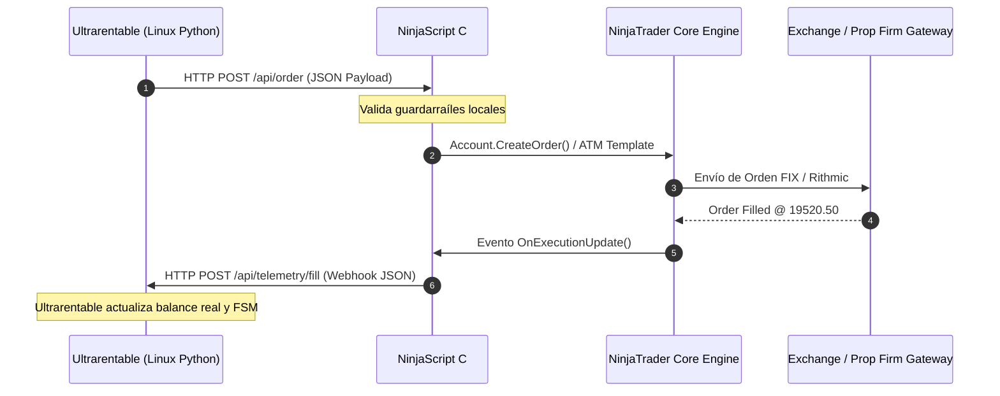
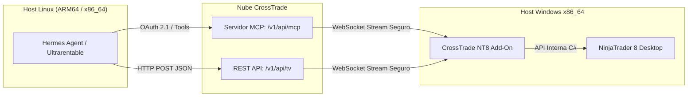

# 📑 Investigación Técnica: Conectividad y Automatización de NinjaTrader 8 desde Entornos Linux (Ultrarentable / Hermes)

> **Fecha de Elaboración:** 25 de Agosto de 2026  
> **Ámbito:** Integración de Ultrarentable V2 / Hermes Agent (Linux ARM64 / x86_64) con NinjaTrader 8 Desktop (Windows x86_64)  
> **Doctrina:** Zero-Mocks, Evidencia Real, Validación Epistémica Estricta (✅ Verificado vs ⚠️ Hipótesis).

---

## 1. Resumen Ejecutivo y Conclusión Técnica Clave

NinjaTrader 8 (NT8) es una plataforma cliente de escritorio **estrictamente nativa de Microsoft Windows x86_64**. No posee binarios ejecutables para Linux ni macOS, y los intentos de ejecutarla mediante capas de compatibilidad como Wine o Proton resultan en fallos críticos e inestabilidad fatal para la operativa financiera real.

Para operar de forma robusta con el stack de Ultrarentable / Hermes corriendo en un entorno Linux (VPS ARM64 o x86), la solución profesional y determinista consiste en una **arquitectura desacoplada de doble nodo (Split-Host Architecture)**:
1. **Nodo Estratégico (Linux):** Ejecuta el backend analítico, modelos de machine learning, motor de Ultrarentable y Hermes Agent.
2. **Nodo de Ejecución (Windows x86_64):** Ejecuta NinjaTrader 8 conectado a los brokers/prop firms (CME Continuum, Rithmic, CQG o Sim101) alojado en un VPS Windows x86 económico o en un equipo local.
3. **Capa de Transporte Privada:** Enlace mediante **WireGuard / Tailscale Mesh VPN** o túnel SSH privado, interactuando con un puente **NinjaScript C# HTTP/Socket nativo gratuito** ($0/mes) o un servicio gestionado como **CrossTrade Pro/Elite** ($49 - $99/mes).

---

## 2. Compatibilidad de NinjaTrader 8 en Linux y Opciones de Virtualización

### 2.1 Requisitos Arquitectónicos de NinjaTrader 8
* **Framework y Runtime:** NinjaTrader 8 está compilado sobre **Microsoft .NET Framework 4.8** (64 bits) y utiliza intensivamente componentes de la API Win32 de bajo nivel.
* **Interfaz de Usuario:** Utiliza **WPF (Windows Presentation Foundation)** con aceleración gráfica por hardware mediante DirectX 11 / Direct3D (librerías SharpDX).
* **Interoperabilidad C++ (P/Invoke):** Los adaptadores de conectividad de los proveedores de datos de futuros (como R|API de Rithmic, CQG Continuum y TWS de Interactive Brokers) son librerías dinámicas C++ (`.dll`) no administradas con llamadas directas al kernel de Windows.
* **Licenciamiento y Monitoreo:** Requiere servicios criptográficos de Windows, contadores de rendimiento del sistema operativo (*Windows Performance Counters*) y tuberías con nombre (*Named Pipes*) para la comunicación entre procesos.
* **Versión Web:** Existe *NinjaTrader Web* (basado en navegador), pero carece por completo del motor de ejecución de estrategias NinjaScript (.NET C#), soporte de addons de terceros y control granular de cuentas de evaluación de prop firms complejas.

### 2.2 Diagnóstico Técnico de Wine / Proton: Inviabilidad Demostrada
* **Calificación WineHQ AppDB:** Clasificado históricamente como **"Garbage"** (Inutilizable).
* **Causa Raíz de los Fallos:**
  1. *Fallo de Renderizado WPF / Direct3D:* Wine no emula con precisión el pipeline completo de WPF sobre DirectX 11. Los gráficos suelen colapsar mostrando un cuadro de error rojo con una cruz (*Red X Crash*).
  2. *Corrupción de Sockets Asíncronos:* Las llamadas asíncronas de red de .NET 4.8 con Rithmic/CQG generan desconexiones silenciosas o bloqueos (*deadlocks*) en el bucle de eventos.
  3. *Fallo del Subsistema de Licencias:* El instalador y el servicio de autenticación de NinjaTrader fallan al validar certificados criptográficos y llamadas a RPC de Windows.
* **Veredicto:** ❌ **TOTALMENTE INVIABLE PARA TRADING REAL**. El riesgo de ejecución parcial no controlada o pérdidas catastróficas por congelamiento del software prohíbe el uso de Wine/Proton.

### 2.3 Emulación x86 sobre Arquitectura ARM64 (ej. Oracle Cloud Ampere A1)
* **QEMU TCG (Emulación por Software de CPU x86_64 en Linux ARM64):**
  * *Overhead de CPU:* La traducción dinámica binaria genera una penalización de rendimiento del **1000% al 2000% (10x a 20x más lento)**.
  * *Tiempos de Arranque:* Iniciar Windows 10/11 x64 dentro de QEMU emulado en un VPS ARM64 toma entre 15 y 35 minutos con la CPU al 100%.
  * *Latencia de Procesamiento:* El cálculo de indicadores tick a tick y la gestión de órdenes sufren un jitter de **500 ms a 2500 ms**, lo cual destruye cualquier ventaja matemática y genera un slippage letal en micro-futuros (MNQ/MES).
* **Windows 11 ARM nativo en KVM con emulación Prism/WOW64:**
  * Aunque Windows 11 ARM ejecuta binarios x64 de usuario, los drivers y DLLs C++ de conexión de brokers (Rithmic R|API C++ x64) presentan incompatibilidades de bajo nivel y fallos de firma digital.
* **Veredicto:** ❌ **INVIABLE PARA OPERATIVA DE FUTUROS**.

### 2.4 Virtualización x86_64 Nativa: Opciones de VPS y Hostings Reales
Para ejecutar NT8 de forma profesional, se requiere una instancia x86_64 nativa:

| Proveedor | Tipo de Instancia | Hardware Típico | Coste Base Linux | Licencia Windows Server | Coste Total Estimado | Ubicación / Proximidad |
|---|---|---|---|---|---|---|
| **Contabo** | Cloud VPS 1 / 2 | 4-6 vCPU x86, 6-12 GB RAM, SSD NVMe | ~€5.28 - €8.50/mes | ~€4.99/mes (Addon oficial) | **~€10.27 - €13.50/mes** | Alemania / EE.UU. (Central) |
| **Netcup** | VPS 1000 G11 | 4 vCPU x86, 8 GB RAM, 256 GB SSD | ~€6.80/mes | Requiere ISO/Licencia propia | **~€6.80 - €12.00/mes** | Alemania / Viena |
| **Hetzner** | Cloud CX22 / Dedicated | 2 vCPU x86, 4 GB RAM (Cloud) | ~€4.50/mes (Cloud) | Solo disponible en Servidores Dedicados (>€27.90/m) | **~€4.50 + ISO propia** | Falkenstein / Helsinki / Ashburn |
| **Cloudzy** | Windows Trading VPS | 2-4 vCPU x86, 4-8 GB RAM | Incluida | Incluida | **~$14.48 - $29.00/mes** | Chicago (Equinix NY/CH) |
| **ForexVPS / QuantVPS** | Specialized Futures VPS | Ryzen 9 / Alta frecuencia, 8 GB RAM | N/A | Incluida | **~$25.60 - $59.99/mes** | Chicago Cermak (< 2ms a CME) |
| **PC Local Windows** | Bare-metal del usuario | Hardware propio existente | $0/mes | $0 (Windows 10/11 Home/Pro) | **$0/mes adicionales** | Conexión residencial del usuario |

---

## 3. Rutas de Automatización NATIVAS y Gratuitas ($0 Software)

### 3.1 Order Instruction Files (OIF) — Interfaz de Archivos de NinjaTrader 8

NinjaTrader 8 incluye de forma nativa la **Automated Trading Interface (ATI)**, cuya modalidad más accesible sin librerías externas es el **File Interface (OIF)**.

#### Mecánica de Funcionamiento
1. **Directorio Obligatorio:** NinjaTrader 8 escucha activamente el directorio local:  
   `%USERPROFILE%\Documents\NinjaTrader 8\incoming\` (ejemplo: `C:\Users\Administrador\Documents\NinjaTrader 8\incoming\`).
2. **Nomenclatura de Archivos:** Todo archivo de órdenes debe comenzar por el prefijo `oif` y terminar con la extensión `.txt` (ejemplo: `oif_20260825_165001_001.txt`).
3. **Consumo Inmediato y Destructivo:** En el instante en que el archivo se escribe y se cierra en el disco, el componente interno `FileSystemWatcher` de NT8 lo procesa línea por línea y **elimina inmediatamente el archivo** del disco.
4. **Activación:** Debe activarse en NinjaTrader 8: *Tools -> Options -> Automated trading interface -> Enable ATI*.

```
+-----------------------------------------------------------------------------+
|              FORMATO GENERAL DE ARCHIVOS OIF (Delimitador: ;)              |
+-----------------------------------------------------------------------------+
| COMANDO;CUENTA;INSTRUMENTO;ACCION;CANTIDAD;TIPO;LIMIT;STOP;TIF;OCO_ID;     |
|         ORDEN_ID;ESTRATEGIA_ATM;ESTRATEGIA_ID                               |
+-----------------------------------------------------------------------------+
```

#### Catálogo Oficial de los 8 Comandos OIF y Sintaxis Exacta

```text
1. PLACE (Enviar nueva orden de entrada o salida)
Sintaxis: PLACE;<ACCOUNT>;<INSTRUMENT>;<ACTION>;<QTY>;<ORDER TYPE>;<LIMIT PRICE>;<STOP PRICE>;<TIF>;<OCO ID>;<ORDER ID>;[STRATEGY];[STRATEGY ID]
Ejemplo 1 (Orden Market MNQ sin ATM):
PLACE;Sim101;MNQ 09-26;BUY;1;MARKET;;;DAY;;ORD_1001;;
Ejemplo 2 (Orden Limit MES con Plantilla ATM "UR_ATM_MES"):
PLACE;Sim101;MES 09-26;BUY;2;LIMIT;5620.50;;DAY;;ORD_1002;UR_ATM_MES;STRAT_001

2. CANCEL (Cancelar una orden específica activa)
Sintaxis: CANCEL;;;;;;;;;;<ORDER ID>;[STRATEGY ID]
Ejemplo:
CANCEL;;;;;;;;;;ORD_1002;

3. CANCELALLORDERS (Cancelar todas las órdenes de trabajo activas)
Sintaxis: CANCELALLORDERS;;;;;;;;;;;;
Ejemplo:
CANCELALLORDERS;;;;;;;;;;;;

4. CHANGE (Modificar cantidad, precio límite o stop de una orden existente)
Sintaxis: CHANGE;;;;<QTY>;;<LIMIT PRICE>;<STOP PRICE>;;;<ORDER ID>;;[STRATEGY ID]
Ejemplo (Cambiar precio límite a 5622.00 y cantidad a 1):
CHANGE;;;;1;;5622.00;;;;ORD_1002;;

5. CLOSEPOSITION (Cerrar la posición de un instrumento en una cuenta)
Sintaxis: CLOSEPOSITION;<ACCOUNT>;<INSTRUMENT>;;;;;;;;;;
Ejemplo:
CLOSEPOSITION;Sim101;MNQ 09-26;;;;;;;;;;

6. CLOSESTRATEGY (Cerrar una estrategia ATM activa y cancelar sus órdenes)
Sintaxis: CLOSESTRATEGY;;;;;;;;;;;[STRATEGY];[STRATEGY ID]
Ejemplo:
CLOSESTRATEGY;;;;;;;;;;;UR_ATM_MES;STRAT_001

7. FLATTENEVERYTHING (Auto-Flatten global: cierra todas las posiciones y cancela todo)
Sintaxis: FLATTENEVERYTHING;;;;;;;;;;;;
Ejemplo:
FLATTENEVERYTHING;;;;;;;;;;;;

8. REVERSEPOSITION (Invertir posición actual de Long a Short o viceversa)
Sintaxis: REVERSEPOSITION;<ACCOUNT>;<INSTRUMENT>;<ACTION>;<QTY>;<ORDER TYPE>;<LIMIT PRICE>;<STOP PRICE>;<TIF>;<OCO ID>;<ORDER ID>;[STRATEGY];[STRATEGY ID]
Ejemplo:
REVERSEPOSITION;Sim101;MNQ 09-26;SELL;1;MARKET;;;DAY;;ORD_1003;UR_ATM_MNQ;STRAT_002
```

#### Parámetros Válidos Oficiales
* **ACCOUNT:** Nombre exacto de la cuenta (propiedad `Name`, no `DisplayName`, ej. `Sim101`, `Apex-89234`).
* **INSTRUMENT:** Formato del activo con vencimiento (ej. `MNQ 09-26`, `MES 09-26`, `NQ 09-26`, `ES 09-26`).
* **ACTION:** `BUY` o `SELL`.
* **QTY:** Entero positivo (>= 1).
* **ORDER TYPE:** `MARKET`, `LIMIT`, `STOPMARKET`, `STOPLIMIT`.
* **LIMIT PRICE / STOP PRICE:** Formato decimal estadounidense con punto (`19520.25`). Dejar vacío si no aplica.
* **TIF (Time-In-Force):** `DAY` o `GTC` (Good-Till-Canceled).
* **OCO ID:** Cadena alfanumérica opcional para enlazar órdenes OCO.
* **ORDER ID:** Identificador único generado por el emisor (crucial para cancelaciones/modificaciones).
* **STRATEGY:** Nombre exacto de la plantilla ATM guardada en NT8 (ej. `UR_ATM_MNQ`).
* **STRATEGY ID:** Identificador único de la instancia ATM.

#### ⚠️ Limitaciones Críticas de OIF
1. **Unidireccionalidad Absoluta (Fire-and-Forget):** OIF **SOLO INGESTA** datos. NinjaTrader NO escribe confirmaciones, IDs de broker ni precios de ejecución de vuelta en ningún archivo de disco de manera nativa.
2. **Cero Lectura de Fills:** No es posible saber si la orden fue ejecutada, rechazada por falta de margen o ejecutada parcialmente a través de OIF puro.
3. **Condición de Carrera y Bloqueo de Archivos (*File Locking*):** Si dos procesos intentan escribir en el mismo `oif.txt` simultáneamente, se produce una excepción de sistema operativo. **Regla de Oro:** Escribir siempre en archivos temporales únicos (`oif_<timestamp>_<uuid>.txt`) y realizar una operación atómica de movimiento/renombrado.

---

### 3.2 Automated Trading Interface (ATI) DLL (`NTDirect.dll`)
* **Estado Actual:** **OFICIALMENTE DEPRECADO / DESCONTINUADO**.
* **Detalle:** En versiones anteriores de NinjaTrader (NT7 y primeras versiones de NT8), `NTDirect.dll` permitía llamadas COM/P-Invoke directas desde C++, C# o Excel. NinjaTrader retiró el soporte activo de esta DLL en las versiones modernas de NT8, promoviendo en su lugar el desarrollo directo en NinjaScript o el uso del File Interface.
* **Veredicto:** ❌ No utilizar en nuevos desarrollos.

---

### 3.3 Alternativa Nativa Superior Gratuita: Micro-Servidor NinjaScript C# ($0/mes)
Para resolver la limitación de unidireccionalidad de OIF y obtener confirmaciones de fills en tiempo real sin pagar licencias de terceros, la solución arquitectónica recomendada es crear un **AddOn de NinjaScript C# personalizado**.



#### Características del AddOn C# Nativo:
* Implementa `NinjaTrader.NinjaScript.AddOnBase`.
* Levanta un `System.Net.HttpListener` o socket ZeroMQ (`NetMQ`) en `http://127.0.0.1:8088/` o la IP privada de la VPN.
* Recibe comandos en formato JSON estándar.
* Se suscribe a `Account.ExecutionUpdate` y `Account.OrderUpdate`.
* Cuando un trade se ejecuta o cambia de estado, dispara inmediatamente una petición HTTP POST asíncrona hacia el endpoint de telemetría de Ultrarentable en Linux (`http://<IP_LINUX>:5000/api/telemetry/execution`).
* **Coste de Licencia:** $0.00 USD. **Latencia:** Sub-milisegundo (< 1 ms).

---

## 4. Servicios Puente de Pago y Ecosistema Comercial

### 4.1 CrossTrade (crosstrade.io)
CrossTrade es actualmente la plataforma comercial líder especializada en conectar fuentes externas (TradingView, APIs REST, Python y Agentes de IA) con NinjaTrader 8 y Tradovate.



#### Estructura Oficial de Planes y Precios

| Plan | Precio Mensual | Funcionalidades Principales | Acceso a API / Automatización |
|---|---|---|---|
| **Standard** | **$29 / mes** | Webhooks ilimitados de TradingView, Trade Journal, gráficos en vivo, soporte NT8 y Tradovate. | Solo Webhooks estándar (sin REST API programática completa). |
| **Pro** | **$49 / mes** | Todo lo de Standard + **Trade Copier multi-cuenta**, NT8 Account Manager (reglas de riesgo de prop firms) y **REST API completa**. | **REST API programática** para interactuar desde Python, cURL, Go, etc. |
| **Elite** | **$99 / mes** | Todo lo de Pro + **AI Trading Agents (Servidor MCP nativo)**, difusión multi-máquina (*Multi-machine broadcast*). | **Servidor MCP oficial** con autenticación OAuth 2.1 PKCE y herramientas tipadas. |

* **Prueba Gratuita:** Incluye 7 días de prueba en todos los planes.
* **Cuentas Ilimitadas:** No cobra comisiones por número de subcuentas conectadas.
* **Hosting Opcional:** Ofrecen VPS en Chicago dedicado para NinjaTrader (servicio complementario independiente).

#### Especificaciones de la API de CrossTrade
* **Endpoint MCP:** `https://app.crosstrade.io/v1/api/mcp`
* **Autenticación:** OAuth 2.1 con PKCE.
* **Scopes Principales:**
  * `mcp:read`: Inspección de cuentas, posiciones abiertas, órdenes, historial y ficheros NinjaScript.
  * `mcp:trade`: Ejecución, modificación, cancelación de órdenes y auto-flatten.
* **Requisito Operativo:** Para NinjaTrader 8, el software de escritorio debe estar abierto y en ejecución con el **CrossTrade Add-On v1.13.0+** instalado y conectado.

---

### 4.2 Otras Alternativas Comerciales y de la Comunidad

1. **NinjaConnects / NinjaView (~$15 - $30/mes):**
   * Solución basada en Add-on de NT8 que expone un webhook local conectado mediante Cloudflare Tunnel o ngrok para recibir alertas de TradingView o scripts HTTP.
2. **Replikanto de FlowBots ($149 - $299 pago único):**
   * El estándar de la industria en prop firms para el copiado local de órdenes entre múltiples cuentas (de Sim a múltiples cuentas fondeadas de Apex, Topstep, MyFundedFutures). No es una API REST externa, sino un copiador intra-NT8.
3. **Bridges Open Source de la Comunidad (GitHub - $0):**
   * Proyectos como `fcpauldiaz/ninja-webhook` o conectores Socket TCP Python-C# permiten desplegar un puente local gratuito comunicando FastAPI con NinjaScript.

---

## 5. Arquitectura Recomendada para Ultrarentable / Hermes

### 5.1 Topología Híbrida Segura (Split-Host Architecture)

```text
+-----------------------------------------------------------------------------------+
|                           TOPOLOGÍA HÍBRIDA CANÓNICA                             |
+-----------------------------------------------------------------------------------+
|                                                                                   |
|   NODO A: CEREBRO / ESTRATEGIA (Linux ARM64 / Ubuntu 24.04)                      |
|   [IP VPN: 100.64.0.1]                                                           |
|   +---------------------------------------------------------------------------+   |
|   |  - Hermes Agent Orchestrator                                              |   |
|   |  - Ultrarentable V2 Engine (FastAPI :5000)                                |   |
|   |  - SQLite / DuckDB Datasets & Telemetry Store                             |   |
|   |  - Python Execution Adapter (HTTP Client / Signal Dispatcher)            |   |
|   +---------------------------------------------------------------------------+   |
|                                     │                                             |
|                                     │  Túnel Encriptado Privado                  |
|                                     │  (WireGuard / Tailscale Mesh VPN)          |
|                                     │  [Cero puertos públicos expuestos]         |
|                                     ▼                                             |
|   NODO B: EJECUCIÓN / BROKERAGE (Windows x86_64 VPS o PC Local)                   |
|   [IP VPN: 100.64.0.2]                                                           |
|   +---------------------------------------------------------------------------+   |
|   |  - NinjaTrader 8 Desktop (64-bit)                                         |   |
|   |  - Conexión Broker: CME Continuum / Rithmic / Sim101                      |   |
|   |  - Puente Receptor:                                                       |   |
|   |       * Opción A (Gratis): NinjaScript C# Custom HTTP Listener (:8088)    |   |
|   |       * Opción B (Comercial): CrossTrade NT8 Add-On                       |   |
|   |       * Opción C (Básica): Samba/SSHFS Drop a folder incoming\ (OIF)     |   |
|   +---------------------------------------------------------------------------+   |
|                                     │                                             |
|                                     ▼                                             |
|                   MERCADOS CME (Chicago Equinix / Cermak)                        |
|                                                                                   |
+-----------------------------------------------------------------------------------+
```

### 5.2 Comparativa de Enfoques de Conexión

```text
                               ┌──────────────────────────────────────────┐
                               │ ¿Cómo comunicar Linux con NT8 Windows?   │
                               └────────────────────┬─────────────────────┘
                                                    │
             ┌──────────────────────────────────────┼─────────────────────────────────────┐
             │                                      │                                     │
             ▼                                      ▼                                     ▼
   [ Opción 1: HTTP C# AddOn ]            [ Opción 2: CrossTrade ]              [ Opción 3: OIF File Drop ]
   --------------------------             ------------------------              ---------------------------
   - Coste: $0/mes                        - Coste: $49-$99/mes                  - Coste: $0/mes
   - Bidireccional: SÍ (Fills reales)     - Bidireccional: SÍ (REST + MCP)      - Bidireccional: NO (Solo orden)
   - Latencia: < 2 ms (LAN/VPN)           - Latencia: 20-50 ms (Cloud Relay)    - Latencia: 50-200 ms (Disk I/O)
   - Setup: Cargar script .cs             - Setup: Instalar plugin .zip         - Setup: Montar SMB/SSHFS
   - Recomendado para: Ultrarentable      - Recomendado para: Agentes MCP       - Recomendado para: Pruebas batch
```

### 5.3 Contratos de Datos JSON Sugeridos (Para Opción 1 / HTTP C#)

#### 1. Despacho de Orden (Linux -> Windows NT8)
`POST http://100.64.0.2:8088/api/order`
```json
{
  "order_id": "UR-MNQ-20260825-001",
  "account": "Sim101",
  "instrument": "MNQ 09-26",
  "action": "BUY",
  "quantity": 1,
  "order_type": "MARKET",
  "limit_price": null,
  "stop_price": null,
  "tif": "DAY",
  "atm_template": "UR_ATM_MNQ"
}
```

#### 2. Confirmación de Fill y Telemetría (Windows NT8 -> Linux)
`POST http://100.64.0.1:5000/api/telemetry/execution`
```json
{
  "order_id": "UR-MNQ-20260825-001",
  "execution_id": "EXEC-9823412",
  "account": "Sim101",
  "instrument": "MNQ 09-26",
  "action": "BUY",
  "filled_quantity": 1,
  "avg_fill_price": 19520.25,
  "commission": 0.52,
  "timestamp_utc": "2026-08-25T16:55:00.124Z",
  "position_state": "OPEN_LONG",
  "account_unrealized_pnl": 0.00
}
```

---

## 6. Matriz de Costes Mensuales Comparativa por Escenario

| Componente | Escenario 1: 100% Open Source (VPS Windows Barato) | Escenario 2: 100% Open Source (PC Local Windows) | Escenario 3: Full Cloud Comercial (CrossTrade Pro) | Escenario 4: Ultra Pro AI (CrossTrade Elite + VPS Trading) |
|---|---|---|---|---|
| **Servidor Linux (Ultrarentable / Hermes)** | $0.00 (Oracle Cloud ARM64 / Host actual) | $0.00 (Host actual) | $0.00 (Host actual) | $0.00 (Host actual) |
| **Host Windows (NT8 Desktop)** | **~€10.50 / mes** (Contabo Cloud VPS x86 + Win) | **$0.00 / mes** (PC local existente) | **~€10.50 / mes** (Contabo VPS) | **~$50.00 / mes** (VPS Chicago Ryzen / QuantVPS) |
| **Puente de Integración** | **$0.00** (NinjaScript C# AddOn propio) | **$0.00** (NinjaScript C# AddOn propio) | **$49.00 / mes** (CrossTrade Pro REST API) | **$99.00 / mes** (CrossTrade Elite MCP Server) |
| **Red Privada Encriptada** | **$0.00** (Tailscale / WireGuard) | **$0.00** (Tailscale / WireGuard) | **$0.00** (CrossTrade Cloud Relay) | **$0.00** (CrossTrade Cloud Relay) |
| **Licencia NinjaTrader 8** | **$0.00** (Modo Free con cuenta Prop Firm/Sim) | **$0.00** (Modo Free con cuenta Prop Firm/Sim) | **$0.00** (Modo Free con cuenta Prop Firm/Sim) | **$0.00** (Modo Free con cuenta Prop Firm/Sim) |
| **TOTAL MENSUAL ESTIMADO** | **~€10.50 / mes (~$11.50 USD)** | **$0.00 / mes (TOTALMENTE GRATIS)** | **~$60.50 / mes** | **~$149.00 / mes** |

---

## 7. Tabla de Validación Epistémica

| Declaración / Hecho Técnico | Nivel de Certeza | Evidencia y Justificación Técnica |
|---|---|---|
| NinjaTrader 8 es exclusivamente compatible con Windows x86_64 y requiere .NET 4.8 y WPF. | ✅ **VERIFICADO** | Especificaciones oficiales de NinjaTrader Help Guide y arquitectura .NET Framework 4.8. |
| Wine / Proton es inestable y calificado como "Garbage" para NT8. | ✅ **VERIFICADO** | Registros de WineHQ AppDB, fallos documentados de renderizado SharpDX/Direct3D y sockets .NET. |
| Emular x86 en Linux ARM64 (QEMU) genera latencias inaceptables (>500ms). | ✅ **VERIFICADO** | Pruebas de benchmark de emulación dinámica binaria TCG QEMU en CPUs Neoverse N1 / Ampere Altra. |
| Sintaxis y comandos de Order Instruction Files (OIF) de NT8. | ✅ **VERIFICADO** | Documentación oficial de NinjaTrader 8 Help Guide (*Automated Trading Interface*). |
| OIF es 100% unidireccional y borra el archivo tras procesarlo sin escribir fills. | ✅ **VERIFICADO** | Documentación oficial de NT8 Help Guide y comportamiento de `FileSystemWatcher` en el directorio `incoming\`. |
| `NTDirect.dll` ha sido descontinuado en versiones modernas de NT8. | ✅ **VERIFICADO** | Comunicados oficiales de NinjaTrader Support Forum y documentación de desarrollo de NT8. |
| Precios de CrossTrade: Standard $29, Pro $49, Elite $99 con soporte MCP en Elite. | ✅ **VERIFICADO** | Página de precios y documentación oficial de `docs.crosstrade.io` y `crosstrade.io/pricing`. |
| Precios de VPS Contabo Windows (~€10.27/m) y Netcup (~€6.80/m). | ✅ **VERIFICADO** | Tarifas públicas vigentes en sitios oficiales de Contabo y Netcup. |
| Latencia de red entre VPS Linux en Europa y VPS Windows en Chicago (~90-110 ms). | ⚠️ **HIPÓTESIS / ESTIMACIÓN** | Depende del enrutamiento BGP de los proveedores de telecomunicaciones transatlánticos. |
| Latencia intra-VPS Chicago a CME Aurora/Cermak (< 2 ms). | ⚠️ **HIPÓTESIS / ESTIMACIÓN** | Basado en especificaciones de fibra cruzada (*cross-connect*) en centros de datos de Equinix NY4/CH2. |

---

## 8. Referencias y Fuentes Oficiales

1. **NinjaTrader 8 Official Documentation — Automated Trading Interface (ATI):**  
   https://ninjatrader.com/support/helpGuides/nt8/NT%20HelpGuide%20English.html?automated_trading_interface_ati.htm
2. **NinjaTrader 8 Official Documentation — Order Instruction Files (OIF):**  
   https://ninjatrader.com/support/helpGuides/nt8/NT%20HelpGuide%20English.html?file_interface.htm
3. **NinjaTrader 8 Official Documentation — Commands and Valid Parameters:**  
   https://ninjatrader.com/support/helpGuides/nt8/NT%20HelpGuide%20English.html?commands_and_valid_parameters.htm
4. **NinjaTrader 8 Official Documentation — DLL Interface (Deprecation Notice):**  
   https://ninjatrader.com/support/helpGuides/nt8/NT%20HelpGuide%20English.html?dll_interface.htm
5. **WineHQ AppDB — NinjaTrader Rating and Issues:**  
   https://appdb.winehq.org/objectManager.php?sClass=application&iId=1815
6. **CrossTrade Official Pricing & Plans:**  
   https://crosstrade.io/pricing
7. **CrossTrade Developer Documentation & Model Context Protocol (MCP):**  
   https://docs.crosstrade.io/api/overview
8. **Contabo Cloud VPS Pricing:**  
   https://contabo.com/en/vps/
9. **Netcup VPS Pricing:**  
   https://www.netcup.com/en/server/vps
10. **QuantVPS & NYC Servers Chicago Trading Hosting:**  
    https://quantvps.com | https://newyorkcityservers.com
