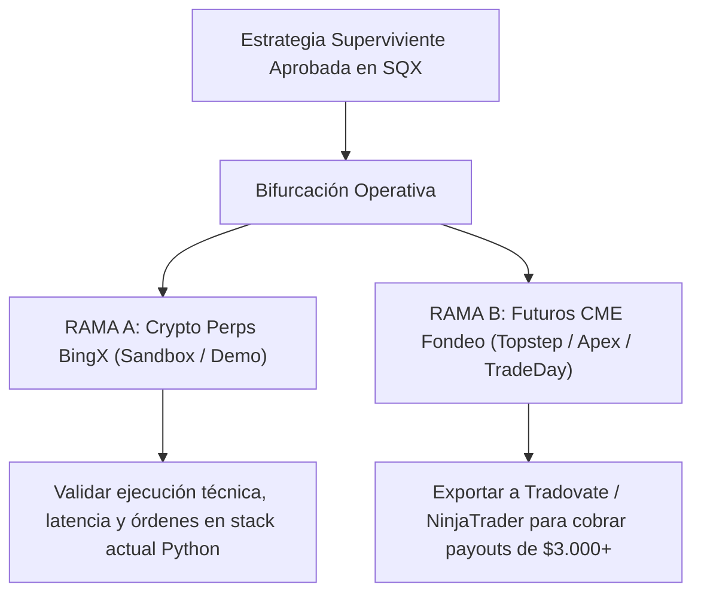

# DECISIÓN DE MERCADO — Bifurcación Operativa Fondeo (Fase 4)

> **Proyecto:** Ultrarentable · **Fecha:** 2026-08-15  
> **Doctrina:** REAL-ONLY · **Prioridad:** FONDEO-PRIMERO

---

## 1. Contexto de la Decisión

Con el generador de StrategyQuant X produciendo candidatos aprobados bajo control de riesgo (`Strategy 1.0.54` y `Strategy 1.0.32`), se abre la bifurcación operativa para desplegar los algoritmos:

---

## 2. Comparativa Detallada de las Ramas

| Dimensión | RAMA A: Crypto Perps BingX Sandbox | RAMA B: Futuros CME Prop Firm (MES / MNQ) |
|---|---|---|
| **Objetivo Principal** | Validación técnica de ejecución del stack Python (`services/api/`) en demo | Superar examen de fondeo de $50K y cobrar retiros reales ($3.000–$4.000) |
| **Mercado** | Criptomonedas continuas 24/7 (BTC, ETH) | Futuros CME regulados (Índices S&P 500, Nasdaq) |
| **Capital Requerido** | **$0 USD** (cuenta demo/sandbox BingX) | **$20 – $150 USD** (coste de examen / combine mensual o one-time) |
| **Riesgo Máximo** | **$0 USD** | Limitado al coste de la evaluación (sin riesgo de pérdida sobre el balance) |
| **Pila de Ejecución** | FastAPI + cliente BingX REST ya implementado en el repositorio | NinjaTrader 8 / Tradovate / TopstepX (vía código C# / EasyLanguage / Webhooks) |
| **Límite de Pérdida** | Controlado por el motor Python | DLL de la firma (≤ 2.5% diario) y Trailing DD (≤ 4.0% total) |
| **Tiempo de Validación** | 1 a 2 semanas de telemetría continua | 2 a 14 días para completar objetivo del 6% |

---

## 3. Hoja de Ruta para Cada Rama

### Si se selecciona RAMA A (Sandbox BingX Crypto):
1. Importar el candidato (`Strategy 1.0.54`) al compilador DSL de `services/api/app/dsl/`.
2. Conectar el cliente demo de BingX (`services/api/app/ingestion/client.py`).
3. Ejecutar en paper trading en el VPS durante 7 días para verificar slip, comisiones y latencia real.

### Si se selecciona RAMA B (Futuros CME Fondeo):
1. Exportar la estrategia desde SQX en formato nativo NinjaTrader 8 (`.cs`) o EasyLanguage (`.txt`).
2. Configurar el contrato micro (`MES` o `MNQ`) con riesgo fijo de $200–$250 por trade (0.4%–0.5%).
3. Vincular a la cuenta de prueba/evaluación de la firma elegida (ej. TradeDay 14-day trial o Topstep 50K).

---

## 4. Consulta para el Usuario

¿Qué ruta prefieres priorizar para la primera ejecución en vivo?
- **Opción 1 (Recomendada):** **RAMA B (Futuros CME Fondeo)** — Apuntar directamente a la obtención de cuenta financiada para cobrar retiros de $3.000+.
- **Opción 2:** **RAMA A (Crypto Perps BingX Sandbox)** — Validar primero el pipeline de ejecución automatizada en demo antes de adquirir evaluación de futuros.
- **Opción 3:** **Híbrida en paralelo** — Desplegar Rama A en background en el VPS mientras se prepara la exportación de Rama B para futuros.
