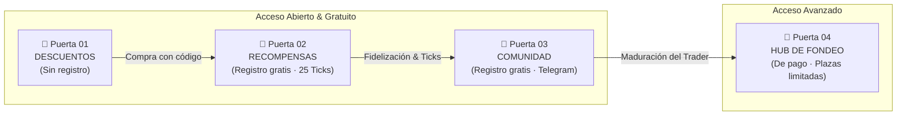
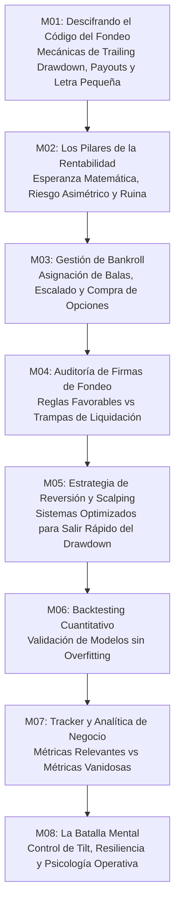
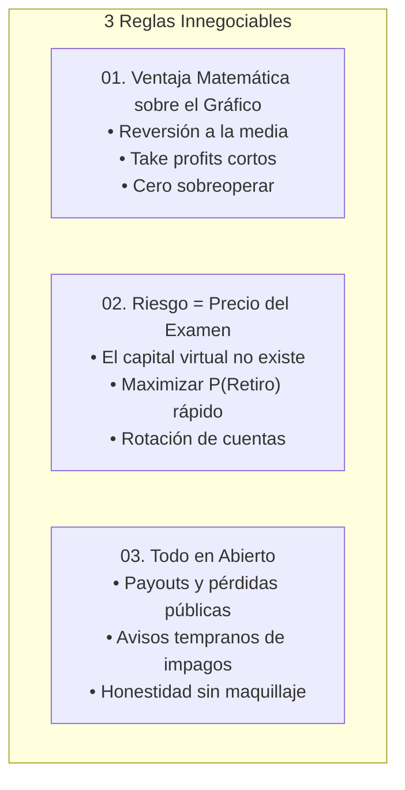
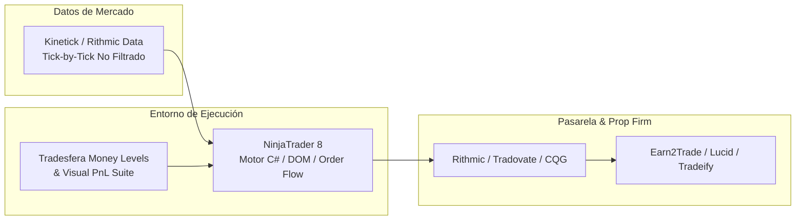
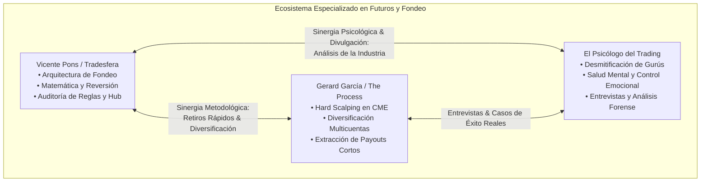

# 🌐 Ecosistema Tradesfera: Arquitectura, Modelo de Negocio y Metodología en Prop Firms de Futuros

> **Documento de Investigación Analítica y Desglose Técnico del Ecosistema Tradesfera**  
> **Entidad Analizada:** [Tradesfera.com](https://tradesfera.com/) | **Fundador:** Vicente Pons Martínez  
> **Última Actualización Documental:** 26 de Agosto de 2026 | **Ámbito:** Futuros CME (MES, MNQ, ES, NQ, YM, RTY, CL, GC) y Cuentas de Fondeo.

---

## 🎯 Navegación y Referencias Cruzadas
- 📌 **Ficha Maestra:** [[Ultrarentable]]
- 🔗 **Módulos Relacionados:** [[Motor de Fondeo y Prop Firms]] | [[Investigacion/04_SISTEMA_MUNDIAL_PROP_FIRMS_FUTUROS|04 Sistema Mundial Prop Firms Futuros]] | [[Investigacion/03_CATALOGO_MAESTRO_34_PROP_FIRMS|03 Catálogo Maestro 34 Prop Firms]] | [[Gestion de Capital — Balas y Estados]]
- 🌐 **Web Oficial:** [tradesfera.com](https://tradesfera.com/)
- 👥 **Alianzas Estratégicas:** [Gerard García (@GerardGarciafx)](https://www.youtube.com/@GerardGarciafx) | [El Psicólogo del Trading (@Elpsicologodeltrading)](https://www.youtube.com/@Elpsicologodeltrading)

---

## 🧭 1. Resumen Ejecutivo y Tesis Fundamental

**Tradesfera** no opera como una academia de trading tradicional orientada a la venta masiva de cursos de análisis técnico subjetivo. Su posicionamiento estructural es el de un **ecosistema integral de ingeniería y recursos cuantitativos para operadores de cuentas de fondeo (*prop trading firms*) en futuros del CME Group**.

### Tesis Operativa de Tradesfera:
1. **Asimetría del Modelo Prop:** Las empresas de fondeo están diseñadas estadísticamente para que la gran mayoría de los aspirantes suspendan las evaluaciones debido a reglas restrictivas de *trailing drawdown* intradía y pérdidas máximas diarias (*daily loss limits*).
2. **Reversión del Riesgo:** El verdadero riesgo financiero del trader **no es el saldo virtual de la cuenta (\$50,000 o \$150,000), sino el coste marginal de adquisición del examen (\$30 - \$150)**.
3. **Optimización Matemática de la Extracción:** La rentabilidad se logra mediante sistemas con esperanza matemática positiva adaptados específicamente a las reglas de la firma (operativa de reversión a la media, objetivos de beneficio cortos y rotación rápida hacia el primer retiro/payout antes del deterioro de la cuenta).
4. **Doctrina de Transparencia Extrema:** Publicación íntegra de balances en un **Libro Mayor público auditado** donde se registran tanto los retiros netos cobrados como las evaluaciones fallidas.

```mermaid
flowchart TD
    subgraph Tradesfera_Core [Núcleo Metodológico Tradesfera]
        V[Vicente Pons / Ingeniería] -->|Diseño| P1[Ventaja Matemática sobre el Gráfico]
        V -->|Gestión| P2[Riesgo = Precio del Examen]
        V -->|Auditoría| P3[Transparencia Total en Abierto]
    end

    subgraph Cuatro_Puertas [Ecosistema de las 4 Puertas]
        P1 & P2 & P3 --> D[01. Descuentos\nCódigo: TRADESFERA]
        P1 & P2 & P3 --> R[02. Recompensas\nTicks & Fidelización]
        P1 & P2 & P3 --> C[03. Comunidad\nTelegram Privado Anti-Ruido]
        P1 & P2 & P3 --> H[04. Hub\nFormación, Sala 24/7 & Software]
    end

    subgraph Validacion [Evidencia Física]
        H & C --> LM[Libro Mayor Público\n167.839 € | 198 Retiros | 26.6% Pass Rate]
    end
```

---

## 👤 2. Perfil del Fundador: Vicente Pons Martínez

**Vicente Pons** aporta un perfil diferencial dentro de la comunidad de trading en habla hispana:
- **Formación de Base:** Ingeniero de formación, aplica principios de optimización matemática, análisis de procesos y control estocástico a los mercados financieros.
- **Especialización:** Trader especializado exclusivamente en el mercado de **futuros regulados de Chicago (CME Group)** y en la explotación matemática de las reglas de las firmas de fondeo.
- **Posicionamiento Cultural ("Anti-Gurú"):** 
  - Rechazo frontal de las narrativas de "hacerse millonario en 3 meses" o "libertad financiera inmediata".
  - Desmitificación del trading discrecional mágico: el éxito se aborda como un negocio de gestión de bankroll, control del riesgo de ruina y ejecución probabilística repetitiva.
  - Normalización de las pérdidas: las evaluaciones fallidas se asumen como el coste de adquisición de opciones (*cost of goods sold* en un negocio comercial).

---

## 🚪 3. Arquitectura del Ecosistema: El Modelo de las 4 Puertas

Tradesfera estructura su relación con el usuario a través de un embudo modular de **cuatro puntos de acceso ("cuatro puertas")**, donde tres de ellas son 100% gratuitas:



---

### 🚪 Puerta 01: Descuentos Oficiales (Código `TRADESFERA`)
- **Acceso:** Totalmente libre, sin necesidad de registro ni tarjeta.
- **Propósito:** Proveer al trader el **descuento máximo activo garantizado** en las mejores firmas de fondeo de futuros mediante un identificador unificado: `TRADESFERA`.
- **Firmas Principales Afiliadas y Condiciones Auditadas:**
  - **Lucid Trading (-40%):** Firma destacada por su velocidad de ciclo operativo (fondeo en 2 días y ventana de retiros en 5 días).
  - **Earn2Trade (-50%):** La firma más veterana y consolidada del sector de futuros; fondeo en 4 días, sin cambios de reglas inesperados y retiros con condiciones abiertas.
  - **Tradeify (-25%):** Firma de alto crecimiento con gran volumen de tramitación de payouts; fondeo en 3 días y políticas de trailing drawdown favorables.
- **Transparencia en el Modelo de Afiliación:** Tradesfera declara abiertamente que percibe una comisión de afiliación por cada compra referida. Esta monetización institucional financia el mantenimiento del ecosistema gratuito (servidores, comunidad, tickets de soporte y catálogo de recompensas).

---

### 🚪 Puerta 02: Sistema de Recompensas y Ticks
- **Acceso:** Gratuito tras crear cuenta en `account.tradesfera.com`.
- **Incentivo Inicial:** **25 Ticks de bienvenida** acreditados en el balance al registrarse.
- **Mecánica Operativa del Loop de Recompensas:**
  1. **Compra con código:** El usuario adquiere una evaluación en cualquier firma soportada utilizando el cupón `TRADESFERA`.
  2. **Verificación de recibo:** El usuario sube el justificante de pago o factura PDF a su panel de usuario.
  3. **Acreditación de Ticks:** El sistema valida la transacción e inyecta los Ticks correspondientes según el importe y el rango del trader.
- **Estructura de Niveles de Usuario:**

| Nivel | Rango | Perfil de Operador | Multiplicador / Ventajas |
| :--- | :--- | :--- | :--- |
| 🥉 **Bronze** | Inicial | Nuevo usuario registrado | Ratio base de acumulación (1x) |
| 🥈 **Silver** | Activo | Trader en fase recurrente de evaluaciones | Mayor ratio de acumulación por euro gastado |
| 🥇 **Gold** | Regular | Traders fondeados con retiros activos | Acceso prioritario a recompensas exclusivas |
| 💎 **Diamond** | Élite | Operadores de máximo volumen | Valor maximizado por Tick y soporte directo |

> [!NOTE]
> Los miembros inscritos en el **Hub** inician automáticamente su andadura con un nivel bonificado dentro del programa de Recompensas.

- **Catálogo de Canje Disponible:**
  - Evaluaciones gratuitas de prop firms (\$25K, \$50K, \$100K).
  - Sesiones de mentoría privada 1 a 1 con Vicente Pons.
  - Indicadores técnicos propietarios para NinjaTrader 8 (ej. *Tradesfera Money Levels*).
  - Ebooks técnicos, guías de microestructura y minicursos específicos.

---

### 🚪 Puerta 03: Comunidad Privada de Telegram ("Anti-Ruido")
- **Acceso:** Gratuito mediante invitación por email tras verificar la cuenta en Tradesfera.
- **Cuatro Pilares Operativos del Canal:**
  1. **Realidad Operativa:** Miembros compartiendo ejecuciones en cuentas reales y financiadas. Se auditan tanto los payouts cobrados como las pérdidas y cuentas quemadas.
  2. **Resolución de Dudas Técnicas:** Soporte diario de la comunidad y del propio Vicente Pons sobre reglas complejas de firmas (*consistency rules*, colchones de seguridad, cortes de liquidez CME a las 15:50 CT).
  3. **Radar del Sector Prop Firm:** Detección temprana de cambios contractuales en firmas, demoras en pagos, ofertas engañosas o nuevas firmas fiables antes de que trascienda a canales generalistas.
  4. **Política Estricta Anti-Gurú:** Prohibición terminante de spam, autopromoción, venta de servicios externos, enlaces de afiliados personales o captación no autorizada (política de un solo aviso previo a la expulsión definitiva).

---

### 🚪 Puerta 04: Hub de Fondeo y Sala de Trading 24/7
- **Naturaleza:** Programa integral de mentoría, formación técnica, software y operativa en vivo. Modalidad de acceso de pago con convocatorias periódicas cerradas y lista de espera.
- **Cuatro Entregables Principales:**
  1. **Material Grabado de por Vida:** 8 módulos exhaustivos con acceso perpetuo y actualizaciones continuas sin coste adicional.
  2. **Mentoría en Directo (6 Meses):** 3 sesiones semanales interactivas (2 enfocadas en análisis de mercado y operativa técnica + 1 dedicada a psicología del trading y control emocional).
  3. **Sala 24/7 de Operativa en Vivo:** Retransmisión continua de la operativa real de Vicente Pons con un retraso técnico mínimo (delay de 5 minutos), permitiendo estudiar en directo la colocación de órdenes, gestión de stops, escalado y errores de mercado.
  4. **Suite de Herramientas Propietarias:**
     - *Tradesfera Tracker:* Base de datos para monitorizar la rentabilidad real de cada cuenta, costes de examen y ROI por firma.
     - *Indicador PnL Visual & Money Levels* para NinjaTrader 8.
     - *Plantillas Cuantitativas de Bankroll y Backtesting* para modelar curvas de equidad y riesgo de ruina.

#### Desglose de los 8 Módulos Formativos del Hub:



#### Matriz de Encaje Honesto del Hub:

| ✅ Perfil Apto (Sí Encajas) | ❌ Perfil No Apto (No Encajas) |
| :--- | :--- |
| Comprende que las evaluaciones fallidas son un coste operativo del negocio. | Busca fórmulas milagrosas, sistemas automáticos del 100% de acierto o recetas mágicas. |
| Dispuesto a operar bajo modelos probabilísticos y de reversión estadística. | Espera generar ingresos recurrentes inmediatos en menos de 90 días con capital mínimo (\$500). |
| Valora una comunidad reducida, técnica y sin ruido sobre canales masivos de señales. | Desea alertas directas de "copiar y pagar" sin entender la lógica subyacente de la entrada. |

---

## 📊 4. Auditoría Forense del Libro Mayor Público

La piedra angular de la credibilidad de Tradesfera reside en su **Libro Mayor público**, actualizado a fecha de **22 de julio de 2026**. Los números reflejan la actividad física en cuentas bancarias:

```text
┌──────────────────────────────────────────────────────────────────────────────────────────────────┐
│                             MÉTRICAS AUDITADAS DEL LIBRO MAYOR TRADESFERA                         │
├────────────────────────────────┬────────────────────────────────┬────────────────────────────────┤
│ 💰 CAPITAL COBRADO             │ 📥 NÚMERO DE RETIROS           │ 🎯 TASA DE FONDEO REAL         │
│         167.839 €              │           198                  │            26,6 %              │
│ (Neto recibido en banco)       │ (Ingresos bancarios reales)    │ (Sobre el 100% de compras)     │
└────────────────────────────────┴────────────────────────────────┴────────────────────────────────┘
```

### Análisis Matemático del Modelo Económico:
1. **Ticket Medio por Retiro:**
   $$\bar{P}_{retiro} = \frac{167.839\ \text{€}}{198\ \text{retiros}} \approx 847,67\ \text{€}\ \text{por transferencia efectuada}$$
   *Interpretación:* Los retiros promedio son de tamaño moderado (\~\$900), confirmando la estrategia de **extraer capital de forma temprana y frecuente** en lugar de dejar engordar el balance hasta chocar contra el *trailing drawdown*.

2. **Esperanza Matemática del Trader de Fondeo ($E_{trader}$):**
   $$E = \left[ P(\text{Paso}) \times P(\text{Retiro} \mid \text{Paso}) \times \bar{R}_{payout} \right] - \left( C_{eval} + C_{activacion} + C_{reset} \right)$$
   - Con una **Tasa de Aprobación Real del 26,6%** (muy superior a la media de la industria, situada habitualmente en torno al 4%-8%), el coste medio de consecución de una cuenta fondeada se sitúa en aproximadamente 3.76 evaluaciones compradas.
   - Si el coste medio por examen con descuento es de \~45 €, el coste de adquisición de una cuenta apta para cobro ronda los **169,20 €**.
   - Con un payout medio de **847,67 €**, el **Retorno sobre la Inversión en Exámenes (ROI)** supera holgadamente el **400%**, validando la solidez estadística del método.

---

## ⚖️ 5. Los Tres Principios Innegociables del Método Tradesfera



### Regla 01: Se opera la ventaja matemática, no el gráfico
- **Lógica:** El análisis técnico tradicional está repleto de sesgos subjetivos. Tradesfera aboga por setups cuantitativos de **reversión a la media** con objetivos de toma de beneficios definidos y rápidos.
- **Disciplina:** Si las condiciones estadísticas de la sesión no se cumplen, no se abre ninguna posición. Todo lo demás se considera ruido y narrativa.

### Regla 02: El riesgo no es el capital virtual; es el precio del examen
- **Lógica:** Las cuentas de \$50,000 conceden únicamente un margen real de drawdown de \$2,000 a \$2,500. El saldo nominal es irrelevante.
- **Táctica:** Se asume que las empresas de fondeo tienen una vida útil finita para cada cuenta. El objetivo no es conservar la cuenta durante años, sino **extraer el primer y segundo payout** en el menor número de sesiones posible para recuperar la inversión del examen con múltiplos asimétricos.

### Regla 03: Lo que se cobra y lo que se pierde, todo en abierto
- **Lógica:** La industria está saturada de capturas de ganancias simuladas en cuentas demo no auditadas.
- **Compromiso:** Se publica el historial cronológico completo de retiros e insolvencias de firmas. Si una entidad modifica sus reglas en perjuicio del trader o muestra demoras de liquidación, se alerta de inmediato a la comunidad.

---

## 🛠️ 6. Infraestructura Técnica de Partners y Conectividad

Tradesfera descarta plataformas de análisis minoristas no optimizadas para ejecución institucional y estandariza su operativa sobre un stack profesional de futuros CME:



### Desglose de Componentes Tecnológicos:
1. **NinjaTrader 8 (Plataforma Primaria):**
   - Software de referencia para la operativa de futuros en Estados Unidos.
   - Ejecución mediante *SuperDOM*, *Chart Trader* avanzado y procesamiento multi-cuenta con sincronización de órdenes.
   - Desarrollo de herramientas propietarias en lenguaje C# / NinjaScript.
2. **Kinetick (Proveedor Oficial de Datos CME):**
   - Feed de datos de mercado directo de baja latencia y sin filtrado de ticks.
   - Esencial para el cálculo preciso de niveles de reversión a la media, volumen acumulado y detección de zonas de alta liquidez.
3. **Pasarelas de Conexión de Cuentas Fondeadas:**
   - Compatibilidad completa con **Rithmic R|Trader Pro** (baja latencia y control de riesgo a nivel de servidor) y **Tradovate API** para integración con entornos web.

---

## 🤝 7. Sinergias Estratégicas: Gerard García y El Psicólogo del Trading

Dentro del ecosistema de trading de habla hispana especializado en futuros y prop firms, Tradesfera mantiene conexiones metodológicas, de contenido y análisis crítico con referentes del sector:



### 1. Gerard García (@GerardGarciafx) y su Enfoque "Hard Scalping":
- **Metodología Complementaria:** Gerard García es pionero en la divulgación de operativas de muy corto plazo (*Hard Scalping*) sobre los microfuturos y contratos grandes del Nasdaq (NQ/MNQ) y S&P 500 (ES/MES).
- **Alineación con Tradesfera:**
  - **Diversificación Multicuentas:** Ambos coinciden en no poner todos los huevos en una sola firma. La estrategia consiste en operar cestas de cuentas en paralelo con copiadores de órdenes locales.
  - **Retiros Frecuentes:** Prioridad absoluta en cobrar el primer payout tan pronto como se alcancen los días mínimos requeridos por la firma, blindando el capital inicial.

### 2. El Psicólogo del Trading (@Elpsicologodeltrading):
- **Divulgación y Auditoría Social:** Canal de referencia en la desarticulación de modelos fraudulentos en redes sociales y en el tratamiento honesto de la psicología del trading.
- **Aportes al Ecosistema:**
  - Espacio de debate continuo donde Vicente Pons y otros traders contrastados exponen los datos crudos del fondeo.
  - Formación en **control del tilt**, gestión de la frustración tras la pérdida de cuentas fondeadas y blindaje de la rutina personal.

---

## 🧩 8. Integración con la Arquitectura de 01 Ultrarentable

El análisis de Tradesfera aporta pilares fundamentales para el diseño de nuestro propio motor algorítmico y de gestión en **01 Ultrarentable**:

1. **Adopción del Paradigma de Opciones en Prop Firms:** 
   - El motor de capital de Ultrarentable modela cada prueba de fondeo como una opción financiera de coste fijo $C_{eval}$ con payoff asimétrico.
2. **Motor de Selección Dinámica de Ofertas:**
   - Monitorización continua de cupones activos para minimizar el coste medio ponderado de adquisición de cuentas ($C_{eval}$).
3. **Protocolo de Extracción Inmediata (Early Payout Protocol):**
   - Una vez alcanzado el colchón de seguridad (*safety buffer*), el bot detiene el apalancamiento y solicita la retirada íntegra disponible para materializar el beneficio en dinero físico bancario.

---

## 📚 9. Conclusión y Dictamen Técnico

**Tradesfera** representa un salto cualitativo hacia la madurez y la honestidad en la industria de las cuentas de fondeo de futuros. Su modelo combina:
- Un embudo de conversión limpio y alineado con los intereses del usuario (3 puertas gratuitas que aportan valor tangible antes de cualquier oferta de pago).
- Un sistema de incentivos cerrado (Ticks) que reinvierte las comisiones de afiliación en recursos útiles para la comunidad.
- Un compromiso inquebrantable con la evidencia física mediante su **Libro Mayor auditado**.

Este estándar de rigor probabilístico y transparencia operativa constituye el benchmark de referencia a replicar y potenciar en nuestros propios sistemas de trading algorítmico.
