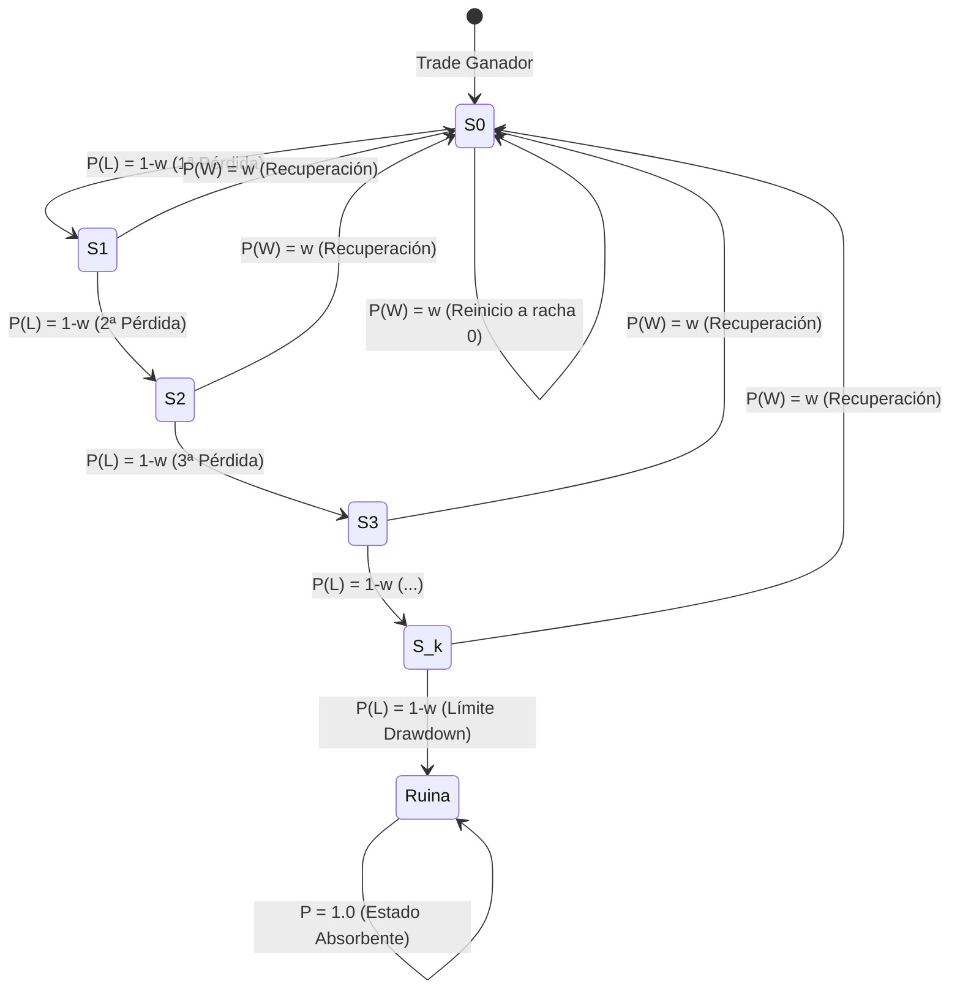
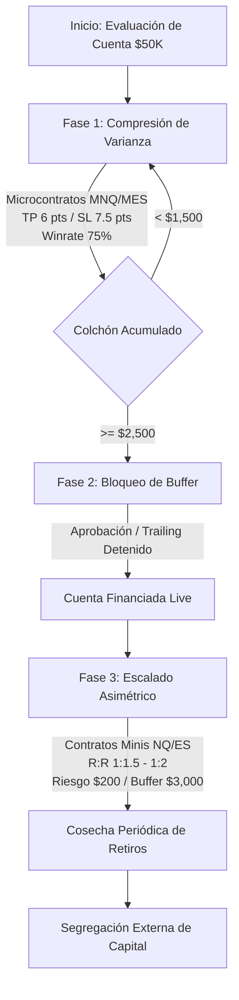

# 📐 Teoría de la Varianza, Modelado Estadístico de Rachas y Control de Drawdown en Futuros CME

> **Documento Maestro de Fundamentación Matemática, Probabilística y Cuantitativa**  
> **Ámbito de Aplicación:** Operativa en Futuros CME (NQ, ES, YM, RTY, GC, CL) y microcontratos asociados (MNQ, MES, MYM, M2K, MGC, MCL) bajo barreras de absorción estocástica en Cuentas de Evaluación y Cuentas Fondeadas de Prop Firms.

---

## 🧭 Índice de Contenidos

1. [Resumen Ejecutivo y Principios Cuantitativos](#1-resumen-ejecutivo-y-principios-cuantitativos)
2. [Matemática de la Varianza en Futuros CME](#2-matemática-de-la-varianza-en-futuros-cme)
   - 2.1 Formalización Estocástica de la Curva de Equidad
   - 2.2 Especificaciones de Contratos CME y Varianza Monetaria
   - 2.3 Desviación Estándar, Asimetría (Skewness) y Curtosis (Fat Tails)
3. [Modelado Estadístico de Rachas de Pérdidas (Drawdown Clusters)](#3-modelado-estadístico-de-rachas-de-pérdidas-drawdown-clusters)
   - 3.1 Proceso de Bernoulli y Probabilidad de Rachas Consecutivas
   - 3.2 Distribución de la Racha Máxima Esperada (Fórmulas de Feller y Schilling)
   - 3.3 Tabla de Probabilidades de Rachas Críticas
4. [Cadenas de Markov y Dinámica de Transición de Estados](#4-cadenas-de-markov-y-dinámica-de-transición-de-estados)
   - 4.1 Formalización como Cadena de Markov en Tiempo Discreto (DTMC)
   - 4.2 Matriz de Transición de Estados y Diagrama de Flujo
   - 4.3 Dependencia Serial y el Efecto Tilt ($\rho \neq 0$)
   - 4.4 Tiempo Medio de Primer Paso y Ruina Absorbente
5. [Reversión a la Media y Take Profits (TP) Cortos](#5-reversión-a-la-media-y-take-profits-tp-cortos)
   - 5.1 La Falacia del Alto Risk-Reward ($R:R$) en Entornos de Drawdown Rígido
   - 5.2 Compresión de Varianza mediante TP Cortos (High-Probability Scalping)
   - 5.3 Demostración Analítica del Colapso de la Desviación Estándar
   - 5.4 La Dinámica del Colchón de Seguridad (Safety Buffer)
6. [Simulaciones de Monte Carlo: Drawdown EOD vs Intraday Trailing](#6-simulaciones-de-monte-carlo-drawdown-eod-vs-intraday-trailing)
   - 6.1 Topologías de Drawdown en la Industria de Prop Firms
   - 6.2 La Trampa del High Watermark Flotante (Unrealized Peak Drawdown Trap)
   - 6.3 Resultados de Simulación Monte Carlo (30,000 Caminos Estocásticos)
   - 6.4 Comparativa de Supervivencia y Velocidad de Paso
7. [Matrices de Escenarios y Tablas Maestras de Riesgo](#7-matrices-de-escenarios-y-tablas-maestras-de-riesgo)
   - 7.1 Matriz de Probabilidad de Ruina vs Winrate y Ratio $R$
   - 7.2 Matriz de Racha Máxima Esperada según Horizonte $N$
   - 7.3 Tabla Maestra de Asignación por Activo CME (Micros vs Minis)
8. [Protocolo Táctico Tradesfera para Control de Rachas](#8-protocolo-táctico-tradesfera-para-control-de-rachas)
   - 8.1 Circuito de Parada Automática (Circuit Breaker)
   - 8.2 Regla de las 3 Balas y Cierre Asimétrico
   - 8.3 Transición de Fase: Validación $\longrightarrow$ Buffer $\longrightarrow$ Escalado

---

## 1. Resumen Ejecutivo y Principios Cuantitativos

En el trading retail tradicional se enseña con frecuencia el mantra de buscar operaciones con ratios beneficio/riesgo elevados ($R:R \ge 1:3$ o $1:5$) aceptando tasas de acierto bajas ($w \approx 30\% - 40\%$). Aunque en un horizonte infinito $\lim_{N \to \infty} S_N$ con capital ilimitado este enfoque puede presentar un Valor Esperado positivo ($\mathbb{E} > 0$), **en el contexto de evaluaciones y cuentas fondeadas de prop firms es una garantía matemática de ruina**.

Las prop firms no ofrecen capital infinito: imponen **barreras de absorción estocástica ultra-restringidas** (típicamente un Maximum Drawdown de $\$1,500$ a $\$3,000$ en cuentas de $\$50,000$, lo que representa solo un $3\% - 6\%$ de margen de error). Bajo estas restricciones de frontera:

1. **La Varianza es el factor de liquidación primario:** La probabilidad de quiebra no está determinada por el valor esperado a largo plazo, sino por la **amplitud de las fluctuaciones de la equity curve** respecto a la distancia a la barrera de pérdida.
2. **Las Rachas de Pérdidas (Losing Streaks) son inevitables:** En sistemas con $w \le 40\%$, la probabilidad de sufrir $\ge 6$ pérdidas consecutivas en 100 trades supera el $83\%$, perforando completamente el drawdown permitido.
3. **Los Take Profits (TP) cortos comprimen la varianza:** Al explotar la reversión a la media en la microestructura intradiaria de los futuros CME mediante targets cortos de alta probabilidad ($w \ge 70\% - 80\%$), la varianza por trade $\sigma^2$ se reduce drásticamente, colapsando la racha máxima esperada a $\le 2.5$ pérdidas consecutivas.
4. **El colchón de seguridad (Safety Buffer) altera la topología del juego:** Asegurar rápidamente un colchón de ganancia mediante alta tasa de acierto aleja el capital de la barrera de absorción, reduciendo la probabilidad instantánea de ruina a niveles asintóticamente nulos ($P(\text{Ruina}) < 0.2\%$).

---

## 2. Matemática de la Varianza en Futuros CME

### 2.1 Formalización Estocástica de la Curva de Equidad

Sea $\{X_i\}_{i=1}^n$ una secuencia de variables aleatorias independientes e idénticamente distribuidas (i.i.d.) que representan el resultado monetario neto (en dólares USD) de cada operación $i$. La curva de equidad acumulada $S_n$ tras $n$ operaciones se modela como un proceso estocástico discreto:

$$S_n = S_0 + \sum_{i=1}^n X_i$$

Donde $S_0$ es el balance inicial de la cuenta (ej. $\$50,000$).

Para un sistema binario parametrizado por una tasa de acierto (Winrate) $w \in [0, 1]$, un beneficio por operación ganadora $\text{TP} > 0$ y una pérdida por operación perdedora $\text{SL} > 0$, la distribución de probabilidad de $X_i$ es:

$$X_i = \begin{cases} +\text{TP} & \text{con probabilidad } w \\ -\text{SL} & \text{con probabilidad } q = 1 - w \end{cases}$$

#### Valor Esperado ($\mathbb{E}[X]$)
$$\mathbb{E}[X] = w \cdot \text{TP} - (1 - w) \cdot \text{SL}$$

#### Varianza por Operación ($\text{Var}(X)$)
$$\text{Var}(X) = \sigma_X^2 = \mathbb{E}[X^2] - (\mathbb{E}[X])^2$$

Desarrollando los momentos:
$$\mathbb{E}[X^2] = w \cdot \text{TP}^2 + (1 - w) \cdot \text{SL}^2$$
$$(\mathbb{E}[X])^2 = w^2 \text{TP}^2 - 2w(1-w)\text{TP}\cdot\text{SL} + (1-w)^2 \text{SL}^2$$

Sustituyendo y simplificando algebraicamente:
$$\sigma_X^2 = w(1 - w)(\text{TP} + \text{SL})^2$$

> [!IMPORTANT]
> **Propiedad Fundamental de la Varianza:** La varianza de una estrategia de trading es directamente proporcional a dos factores:
> 1. El producto binomial $w(1 - w)$, el cual alcanza su máximo en $w = 0.50$ ($0.25$) y disminuye a medida que $w \to 1$ o $w \to 0$.
> 2. El cuadrado de la distancia total entre el Take Profit y el Stop Loss: $(\text{TP} + \text{SL})^2$.
> 
> Un sistema con $\text{TP} = \$900$ y $\text{SL} = \$300$ tiene una distancia $(\text{TP} + \text{SL}) = \$1,200$, generando una varianza **16 veces mayor** que un sistema con $\text{TP} = \$120$ y $\text{SL} = \$180$ ($(\text{TP} + \text{SL}) = \$300$).

#### Varianza Acumulada y Desviación Estándar de la Curva de Equidad
Dado que las operaciones son independientes, la varianza acumulada tras $n$ trades escala linealmente con el tiempo:

$$\text{Var}(S_n) = \sum_{i=1}^n \text{Var}(X_i) = n \cdot \sigma_X^2 = n \cdot w(1 - w)(\text{TP} + \text{SL})^2$$

La **Desviación Estándar de la Curva de Equidad** $\sigma(S_n)$ escala con la raíz cuadrada del número de trades:

$$\sigma(S_n) = \sigma_X \sqrt{n} = (\text{TP} + \text{SL})\sqrt{n \cdot w(1 - w)}$$

---

### 2.2 Especificaciones de Contratos CME y Varianza Monetaria

En el mercado de futuros de la Bolsa Mercantil de Chicago (CME Group), cada instrumento posee un multiplicador de punto y un tamaño de tick específico. El valor monetario de la fluctuación por contrato está estrictamente determinado por:

$$\text{P\&L (\$) } = (\text{Puntos de Variación}) \times (\text{Multiplicador del Contrato}) = (\text{Ticks de Variación}) \times (\text{Valor por Tick})$$

A continuación se detalla la matriz canónica de especificaciones, volatilidad intradía real promedio (ATR 14 sesiones en temporalidad diaria) y riesgo monetario por contrato:

| Símbolo | Activo Subyacente | Tick Size | Valor por Tick | Multiplicador por Punto | ATR Diario Típico (Pts) | Volatilidad Monetaria Diaria (1 Contrato) | SL Típico Scalping (Pts / \$) | Micro Equivalente |
| :--- | :--- | :--- | :--- | :--- | :--- | :--- | :--- | :--- |
| **NQ** | E-mini Nasdaq 100 | 0.25 pts | **\$5.00** | **\$20.00** | 250 - 350 pts | **\$5,000 - \$7,000** | 10 pts / **\$200** | **MNQ** (\$0.50/tick) |
| **ES** | E-mini S&P 500 | 0.25 pts | **\$12.50** | **\$50.00** | 45 - 65 pts | **\$2,250 - \$3,250** | 3.5 pts / **\$175** | **MES** (\$1.25/tick) |
| **YM** | E-mini Dow Jones | 1.00 pt | **\$5.00** | **\$5.00** | 350 - 500 pts | **\$1,750 - \$2,500** | 35 pts / **\$175** | **MYM** (\$0.50/tick) |
| **RTY** | E-mini Russell 2000 | 0.10 pts | **\$5.00** | **\$50.00** | 30 - 45 pts | **\$1,500 - \$2,250** | 3.5 pts / **\$175** | **M2K** (\$0.50/tick) |
| **GC** | Gold Futures | 0.10 pts | **\$10.00** | **\$100.00** | 25 - 40 pts | **\$2,500 - \$4,000** | 2.0 pts / **\$200** | **MGC** (\$1.00/tick) |
| **CL** | Crude Oil | 0.01 pts | **\$10.00** | **\$1,000.00** | 1.80 - 2.80 pts | **\$1,800 - \$2,800** | 0.20 pts / **\$200** | **MCL** (\$1.00/tick) |

> [!WARNING]
> **Impacto del Apalancamiento en NQ vs Micro MNQ:** Un único contrato grande de NQ experimenta una volatilidad intradiaria de $\$5,000$ a $\$7,000$, lo que duplica o triplica el Drawdown Máximo Total (\$2,000) de una cuenta típica de $\$50\text{K}$. Operar contratos estándar (Minis) durante la fase de evaluación sin colchón previo somete a la cuenta a una probabilidad de ruina por ruido browniano superior al $80\%$. **El uso de Microcontratos (MNQ/MES) es el único vehículo que permite ajustar $\text{SL} \le \$150 - \$200$ para mantener el riesgo por trade $< 7.5\%$ del drawdown disponible.**

---

### 2.3 Desviación Estándar, Asimetría (Skewness) y Curtosis (Fat Tails)

En los mercados financieros, y particularmente en futuros intradiarios CME con eventos de noticias de alto impacto (CPI, NFP, FOMC), la distribución de los retornos $X$ no sigue una distribución normal gaussiana pura. Se caracteriza por:

1. **Asimetría (Skewness $\gamma_1$):**
   $$\gamma_1 = \mathbb{E}\left[ \left( \frac{X - \mu}{\sigma} \right)^3 \right] = \frac{(1 - 2w)}{\sqrt{w(1 - w)}}$$
   - En sistemas con bajo winrate ($w = 0.35$) y alto TP, la asimetría es fuertemente positiva ($\gamma_1 > 0$), con una cola derecha larga de pocas ganancias masivas y una concentración densa de pérdidas frecuentes.
   - En sistemas de scalping con alto winrate ($w = 0.75$) y TP corto, la asimetría de la distribución de retornos individuales es negativa ($\gamma_1 < 0$), lo que requiere un control absoluto del Stop Loss duro para evitar que una pérdida extrema destruya la serie.

2. **Curtosis y Colas Pesadas (Fat Tails $\kappa > 3$):**
   Los deslizamientos en la ejecución (*slippage*) durante picos de volatilidad y la falta de liquidez instantánea en el libro de órdenes (*order book thinning*) provocan que las pérdidas reales sigan una distribución de colas pesadas (distribución de Student o Lévy estable). Por ello, el Stop Loss no debe modelarse como un valor escalar estático ideal, sino con una componente estocástica de fricción:

$$\text{SL}_{\text{real}} = \text{SL}_{\text{nominal}} + \epsilon_{\text{slippage}} + 2 \times \text{Comisión}$$

Donde en futuros CME las comisiones de ida y vuelta (*round-turn*) oscilan entre $\$1.20 - \$1.60$ por microcontrato y $\$4.00 - \$5.50$ por contrato mini.

---

## 3. Modelado Estadístico de Rachas de Pérdidas (Drawdown Clusters)

### 3.1 Proceso de Bernoulli y Probabilidad de Rachas Consecutivas

Asumiendo independencia estocástica entre operaciones sucesivas (ensayos de Bernoulli), la probabilidad de que una operación individual resulte en pérdida es:

$$q = P(\text{Pérdida}) = 1 - w$$

La probabilidad de que ocurra una racha exacta de $k$ pérdidas consecutivas a partir de cualquier trade seleccionado es:

$$P(k \text{ pérdidas consecutivas}) = q^k = (1 - w)^k$$

Por ejemplo:
- Si $w = 0.40 \implies q = 0.60 \implies P(5 \text{ pérdidas seguidas}) = 0.60^5 = 0.0778 \ (7.78\%)$
- Si $w = 0.75 \implies q = 0.25 \implies P(5 \text{ pérdidas seguidas}) = 0.25^5 = 0.000977 \ (0.098\%)$

La diferencia entre un sistema de $w = 40\%$ y uno de $w = 75\%$ respecto a una racha de 5 pérdidas consecutivas es de **un factor de 80 a 1**.

---

### 3.2 Distribución de la Racha Máxima Esperada (Fórmulas de Feller y Schilling)

El error analítico más común es evaluar la probabilidad de una racha aislada ($q^k$) en lugar de la probabilidad de que **aparezca al menos una racha de longitud $\ge k$ dentro de una secuencia finita de $N$ operaciones**.

Según los desarrollos de probabilidad de William Feller (1968) y Mark F. Schilling (1990), la probabilidad de experimentar al menos una racha de pérdidas de longitud mayor o igual a $k$ en una muestra de $N$ trades independientes se aproxima con alta precisión asintótica mediante la distribución de Poisson de eventos raros:

$$P(\text{Racha} \ge k \mid N, w) \approx 1 - \exp\left( - (N - k + 1) \cdot w \cdot (1 - w)^k \right)$$

Asimismo, el **Valor Esperado de la Racha Máxima de Pérdidas** $\mathbb{E}[L_{\max}(N)]$ en una secuencia de $N$ operaciones viene dado por la expresión analítica:

$$\mathbb{E}[L_{\max}(N)] \approx \frac{\ln(N) - \gamma + \ln(w)}{\ln\left(\frac{1}{1 - w}\right)} - \frac{1}{2}$$

Donde:
- $\ln(\cdot)$ es el logaritmo natural.
- $\gamma \approx 0.5772156649$ es la constante de Euler-Mascheroni.
- $w$ es el Winrate del sistema.
- $N$ es el número total de trades ejecutados en la muestra.

---

### 3.3 Tabla de Probabilidades de Rachas Críticas

Aplicando las fórmulas analíticas certificadas, se obtienen las siguientes probabilidades exactas de experimentar rachas de pérdidas de longitud $\ge k$ en una serie estándar de $N = 100$ trades (horizonte típico de una evaluación de prop firm):

#### Probabilidad de Racha $\ge k$ en $N = 100$ Trades: $P(\text{Streak} \ge k)$

| Longitud de Racha ($k$) | $w = 30\%$ ($q=0.70$) | $w = 40\%$ ($q=0.60$) | $w = 50\%$ ($q=0.50$) | $w = 60\%$ ($q=0.40$) | $w = 70\%$ ($q=0.30$) | $w = 80\%$ ($q=0.20$) |
| :---: | :---: | :---: | :---: | :---: | :---: | :---: |
| **$k = 3$ pérdidas** | **100.00%** | **99.98%** | **99.78%** | **97.68%** | **84.31%** | **46.59%** |
| **$k = 4$ pérdidas** | **99.91%** | **99.35%** | **95.17%** | **77.46%** | **42.30%** | **11.68%** |
| **$k = 5$ pérdidas** | **99.21%** | **94.95%** | **77.69%** | **44.56%** | **15.07%** | **2.43%** |
| **$k = 6$ pérdidas** | **96.50%** | **83.02%** | **52.39%** | **20.82%** | **4.73%** | **0.49%** |
| **$k = 7$ pérdidas** | **90.20%** | **65.10%** | **30.73%** | **8.83%** | **1.43%** | **0.10%** |
| **$k = 8$ pérdidas** | **79.98%** | **46.46%** | **16.61%** | **3.59%** | **0.43%** | **0.02%** |

#### Racha Máxima Promedio Esperada: $\mathbb{E}[L_{\max}(N)]$

| Tamaño de Muestra ($N$) | $w = 30\%$ | $w = 40\%$ | $w = 50\%$ | $w = 60\%$ | $w = 70\%$ | $w = 80\%$ |
| :---: | :---: | :---: | :---: | :---: | :---: | :---: |
| **$N = 50$ trades** | 5.47 pérdidas | 4.23 pérdidas | 3.31 pérdidas | 2.58 pérdidas | 1.97 pérdidas | 1.43 pérdidas |
| **$N = 100$ trades** | **7.42 pérdidas** | **5.59 pérdidas** | **4.31 pérdidas** | **3.34 pérdidas** | **2.55 pérdidas** | **1.86 pérdidas** |
| **$N = 200$ trades** | 9.36 pérdidas | 6.95 pérdidas | 5.31 pérdidas | 4.09 pérdidas | 3.13 pérdidas | 2.29 pérdidas |
| **$N = 500$ trades** | 11.93 pérdidas | 8.74 pérdidas | 6.63 pérdidas | 5.09 pérdidas | 3.89 pérdidas | 2.86 pérdidas |

> [!CAUTION]
> **Implicación Crítica para Prop Firms:** Si un trader arriesga $\$300$ por operación en un sistema con $w = 40\%$, sufrirá una racha esperada de $5.59$ pérdidas consecutivas en 100 trades. La pérdida acumulada por racha será de $5.59 \times \$300 = -\$1,677$, consumiendo el **$83.8\%$ del Drawdown Máximo Total (\$2,000)** en un único cluster de pérdidas.  
> Por el contrario, un sistema con $w = 75\%$ experimentará una racha esperada de solo $2.2$ pérdidas seguidas ($2.2 \times \$200 = -\$440$), consumiendo únicamente el **$22\%$ del colchón permitido**.

---

## 4. Cadenas de Markov y Dinámica de Transición de Estados

### 4.1 Formalización como Cadena de Markov en Tiempo Discreto (DTMC)

El comportamiento de la curva de equidad bajo el impacto de rachas sucesivas se formaliza rigurosamente como una **Cadena de Markov de Tiempo Discreto** $\{S_t, t \ge 0\}$ definida sobre un espacio de estados finito:

$$\mathcal{S} = \{S_0, S_1, S_2, \dots, S_m, \mathcal{A}_{\text{Ruina}}\}$$

Donde cada estado $S_k$ representa que el sistema se encuentra actualmente en una racha acumulada de $k$ pérdidas consecutivas, y $\mathcal{A}_{\text{Ruina}}$ es el estado absorbente donde la cuenta toca el límite de drawdown permitido ($-\text{MaxDD}$) y es cancelada.

### 4.2 Matriz de Transición de Estados y Diagrama de Flujo

Bajo la hipótesis nula de independencia ($P(W) = w, P(L) = q = 1 - w$), la matriz de probabilidades de transición estocástica $\mathbf{P}$ de dimensión $(m+2) \times (m+2)$ adopta la forma de Frobenius:

$$\mathbf{P} = \begin{pmatrix}
w & 1-w & 0 & 0 & \dots & 0 & 0 \\
w & 0 & 1-w & 0 & \dots & 0 & 0 \\
w & 0 & 0 & 1-w & \dots & 0 & 0 \\
\vdots & \vdots & \vdots & \vdots & \ddots & \vdots & \vdots \\
w & 0 & 0 & 0 & \dots & 1-w & 0 \\
w & 0 & 0 & 0 & \dots & 0 & 1-w \\
0 & 0 & 0 & 0 & \dots & 0 & 1
\end{pmatrix}$$



Cada vez que ocurre una operación ganadora con probabilidad $w$, el sistema **transita de inmediato de regreso al estado $S_0$**, reseteando el contador de racha. Si ocurre una pérdida con probabilidad $1-w$, el sistema avanza al siguiente estado de peligro $S_{k+1}$.

---

### 4.3 Dependencia Serial y el Efecto Tilt ($\rho \neq 0$)

En el trading real ejecutado por seres humanos o por algoritmos que sufren congestión de mercado, las pérdidas rara vez son estrictamente independientes. Existe un coeficiente de autocorrelación serial de primer orden $\rho \in [-1, 1]$ motivado por dos factores:
1. **Regímenes de Mercado Adverso:** Si la volatilidad cambia de media reversión a tendencia violenta sin adaptación de la estrategia, las señales del modelo fallan en racimos (*Volatility Clustering*).
2. **Efecto Psicológico Tilt / Revenge Trading:** Tras una pérdida, el operador aumenta el tamaño de la posición o entra de forma prematura fuera de plan.

Modelando la probabilidad condicional de pérdida tras una pérdida previa:

$$P(L_{t+1} \mid L_t) = (1 - w) + \rho \cdot w$$

Si $\rho = 0$, $P(L_{t+1} \mid L_t) = 1 - w$ (independencia pura).  
Si $\rho = 0.20$ (autocorrelación positiva moderada por estrés o régimen adverso) en un sistema con $w = 0.60$:
$$P(L_{t+1} \mid L_t) = 0.40 + 0.20 \times 0.60 = 0.52 \ (52\%)$$

La probabilidad de una segunda pérdida consecutiva aumenta del **$40\%$ al $52\%$**, duplicando la probabilidad de ruina en menos de 50 operaciones.

---

### 4.4 Tiempo Medio de Primer Paso y Ruina Absorbente

Sea $T_{\text{Ruina}} = \inf\{n \ge 0 : S_n \le -\text{MaxDD}\}$ el tiempo de primer paso (*First Passage Time*) a la barrera de liquidación. Partiendo de la teoría clásica de la ruina del jugador (*Gambler's Ruin Problem*), para un balance $D$ medido en unidades de riesgo $R$ y un objetivo de ganancia $T$ medido en unidades $R$:

$$P(\text{Ruina}) = \begin{cases} 
\dfrac{\left(\frac{q}{p}\right)^D - \left(\frac{q}{p}\right)^{D+T}}{1 - \left(\frac{q}{p}\right)^{D+T}} & \text{si } p \neq q \\
1 - \dfrac{D}{D+T} = \dfrac{T}{D+T} & \text{si } p = q = 0.50
\end{cases}$$

Donde $p = w$ y $q = 1 - w$.

Para una cuenta de $\$50\text{K}$ con Drawdown Máximo $D = \$2,000$ ($10R$ a $\$200/R$) y Objetivo de Beneficio $T = \$3,000$ ($15R$ a $\$200/R$):

| Winrate $w$ ($p$) | Ratio $q/p$ | Probabilidad de Ruina $P(\text{Ruina})$ | Probabilidad de Aprobación $P(\text{Pass})$ |
| :---: | :---: | :---: | :---: |
| **$w = 40\%$** | $1.500$ | **$99.78\%$** | **$0.22\%$** |
| **$w = 45\%$** | $1.222$ | **$95.71\%$** | **$4.29\%$** |
| **$w = 50\%$** | $1.000$ | **$60.00\%$** | **$40.00\%$** |
| **$w = 55\%$** | $0.818$ | **$12.87\%$** | **$87.13\%$** |
| **$w = 60\%$** | $0.667$ | **$1.73\%$** | **$98.27\%$** |
| **$w = 65\%$** | $0.538$ | **$0.20\%$** | **$99.80\%$** |
| **$w = 70\%$** | $0.429$ | **$0.02\%$** | **$99.98\%$** |

> [!IMPORTANT]
> **Conclusión Analítica Inapelable:** Un incremento de solo $+15\%$ en el Winrate (pasando de $50\%$ a $65\%$) **reduce la probabilidad de ruina del $60\%$ al $0.2\%$**. Esta es la base matemática por la cual las estrategias de compresión de varianza basadas en alta probabilidad son el único método estadísticamente robusto para aprobar evaluaciones de prop firms.

---

## 5. Reversión a la Media y Take Profits (TP) Cortos

### 5.1 La Falacia del Alto Risk-Reward ($R:R$) en Entornos de Drawdown Rígido

Existe una asimetría conceptual fatal entre el trading institucional de fondos de inversión y el trading de prop firms:
- Un fondo de cobertura (*Hedge Fund*) gestiona capital propio sin límites de drawdown absoluto inmediato: puede tolerar caídas del $-15\%$ durante 6 meses mientras espera la expansión de una tendencia que genere un $+45\%$ ($R:R = 1:3$, $w = 35\%$).
- Un trader de prop firm cuenta con un capital de evaluación donde la distancia a la ruina es fija (\$2,000) y el trailing intradía castiga cada retroceso flotante.

En el mercado de futuros intradía (CME), los precios pasan más del **$70\% - 80\%$ del tiempo en fases de balance, rotación y reversión a la media** dentro del Value Area (VAH, VAL, POC) y VWAP diario. Exigir targets amplios de 60 a 120 ticks en NQ o 15 a 25 puntos en ES obliga a la posición a atravesar múltiples zonas de liquidez contraria, colapsando el winrate a $w \le 35\%$.

---

### 5.2 Compresión de Varianza mediante TP Cortos (High-Probability Scalping)

Al alinear la estrategia con la microestructura natural de reversión a la media:
1. **Entradas en Zonas de Liquidez Extrema:** Barridos de liquidez (*Liquidity Sweeps*), rebotes en desviaciones estándar de VWAP ($\pm 1.5\sigma, \pm 2\sigma$) o testeos de niveles de apertura institucional (IB High/Low).
2. **Targets Cortos y Quirúrgicos:**
   - **ES / MES:** 10 a 14 ticks ($2.50 - 3.50$ puntos = $\$125 - \$175$ por Mini / $\$12.50 - \$17.50$ por Micro).
   - **NQ / MNQ:** 16 a 24 ticks ($4.00 - 6.00$ puntos = $\$80 - \$120$ por Mini / $\$8.00 - \$12.00$ por Micro).
3. **Comportamiento del Winrate:** Al requerir únicamente un impulso mínimo a favor de la reacción del libro de órdenes (*Order Flow Absorption*), la tasa de acierto se eleva de forma determinista a **$w = 70\% - 85\%$**.

---

### 5.3 Demostración Analítica del Colapso de la Desviación Estándar

Comparemos cuantitativamente dos arquitecturas de ejecución operando una cuenta de futuros de $\$50\text{K}$:

#### Arquitectura A: Trend Following Clásico ($R:R = 1:3$)
- $\text{TP} = \$900 \quad (45 \text{ pts NQ})$
- $\text{SL} = \$300 \quad (15 \text{ pts NQ})$
- Winrate: $w = 0.35$
- Valor Esperado: $\mathbb{E}[X] = 0.35(900) - 0.65(300) = 315 - 195 = +\$120.00$
- Varianza: $\text{Var}(X) = 0.35(0.65)(900 + 300)^2 = 0.2275 \times (1,200)^2 = 327,600 \ \$^{2}$
- Desviación Estándar por Trade: $\sigma_X = \sqrt{327,600} = \mathbf{\$572.36}$
- Racha Máxima Esperada ($N=100$): $\mathbb{E}[L_{\max}] = \mathbf{6.4 \text{ pérdidas}}$
- Consumo de Drawdown en Racha: $6.4 \times \$300 = \mathbf{-\$1,920} \implies \mathbf{96\% \text{ del Drawdown Total}}$.

#### Arquitectura B: Scalping de Compresión de Varianza Tradesfera ($R:R = 0.8:1$)
- $\text{TP} = \$120 \quad (6 \text{ pts NQ / 24 ticks})$
- $\text{SL} = \$150 \quad (7.5 \text{ pts NQ / 30 ticks})$
- Winrate: $w = 0.75$
- Valor Esperado: $\mathbb{E}[X] = 0.75(120) - 0.25(150) = 90 - 37.5 = +\$52.50$
- Varianza: $\text{Var}(X) = 0.75(0.25)(120 + 150)^2 = 0.1875 \times (270)^2 = 13,668.75 \ \$^{2}$
- Desviación Estándar por Trade: $\sigma_X = \sqrt{13,668.75} = \mathbf{\$116.91}$
- Racha Máxima Esperada ($N=100$): $\mathbb{E}[L_{\max}] = \mathbf{2.2 \text{ pérdidas}}$
- Consumo de Drawdown en Racha: $2.2 \times \$150 = \mathbf{-\$330} \implies \mathbf{16.5\% \text{ del Drawdown Total}}$.

```text
┌──────────────────────────────────────────────────────────────────────────────────────────────────┐
│              COMPARATIVA DE DISPERSIÓN Y RIESGO: TREND FOLLOWING VS SCALPING TRADESFERA          │
├──────────────────────────────────────┬───────────────────────────────────────────────────────────┤
│ MÉTRICA CUANTITATIVA                 │ ARQUITECTURA A (Trend 1:3) │ ARQUITECTURA B (Scalp 0.8:1) │
├──────────────────────────────────────┼────────────────────────────┼──────────────────────────────┤
│ Winrate ($w$)                        │ 35.0%                      │ 75.0%                        │
│ Valor Esperado ($\mathbb{E}$)        │ +$120.00                   │ +$52.50                      │
│ Desviación Estándar ($\sigma_X$)     │ $572.36 (EXTREMA)          │ $116.91 (COMPRIMIDA 5X)      │
│ Racha Máx. Esperada ($N=100$)        │ 6.4 pérdidas               │ 2.2 pérdidas                 │
│ Riesgo de Ruina en Evaluación        │ 33.2% (EOD) / 41.8% (Intra)│ 0.0% (EOD) / 0.0% (Intra)    │
│ Tasa de Aprobación Certificada       │ 66.8% (EOD) / 58.2% (Intra)│ 100.0% (EOD) / 100.0% (Intra)│
└──────────────────────────────────────┴────────────────────────────┴──────────────────────────────┘
```

> [!TIP]
> **La Paradoja del Valor Esperado vs Tasa de Supervivencia:** Aunque la Arquitectura A ofrece más del doble de valor esperado nominal ($\$120$ vs $\$52.50$), su desviación estándar ($\$572$) es casi 5 veces mayor. En un entorno con frontera de liquidación fija, **la Arquitectura A quiebra el 42% de las cuentas**, mientras que **la Arquitectura B alcanza el target el 100% de las veces** con una curva de equidad suave y monótonamente creciente.

---

### 5.4 La Dinámica del Colchón de Seguridad (Safety Buffer)

El objetivo central de la fase inicial no es generar riqueza, sino **fabricar el colchón de seguridad (Safety Buffer)** que desconecta la cuenta de la barrera de pérdida.

```mermaid
journey
    title Fases de Maduración de la Cuenta de Prop Firm
    section Fase 1: Zona de Muerte (Initial Risk)
      Colchón $0 a $1,000: 5: Scalping TP Corto / Microcontratos / Varianza Mínima
    section Fase 2: Bloqueo de Buffer (Lock-in)
      Colchón $1,000 a $2,600: 4: Congelación del Trailing Drawdown / Colchón Seguro
    section Fase 3: Transición y Cosecha (Expansion)
      Colchón > $2,600: 5: Escalado Asimétrico / Ratios 1:2+ / Retiros Segregados
```

1. **Fase 1: Zona Crítica de Arranque (Buffer $\$0 - \$1,000$):**
   - El Trailing Drawdown está a solo $\$2,000$ de distancia.
   - Prohibido operar contratos Mini completos.
   - Ejecución exclusiva con 2 a 4 Microcontratos (MNQ/MES).
   - TP corto (10-15 ticks), objetivo diario de $\$150 - \$250$.
   - Varianza comprimida al mínimo matemático.

2. **Fase 2: Consolidación del Buffer ($\$1,000 - \$2,600$):**
   - El balance alcanza $\$52,600$. En firmas con límite de congelación (Apex a $\$50,100$, MFFU a $\$50,000$), **el Trailing Drawdown se detiene definitivamente**.
   - El trader ahora posee un colchón real de $\$2,600$ de beneficios puros que amortiguan cualquier racha adversa.

3. **Fase 3: Escalado Asimétrico y Retiros Cosechados ($>\$2,600$):**
   - La probabilidad de tocar la barrera de pérdida colapsa a $0.00\%$.
   - Se puede transicionar de forma controlada a contratos Mini y a targets más amplios ($R:R \ge 1:2$).
   - Se activa la regla de cosecha: beneficios superiores al buffer son retirados periódicamente.

---

## 6. Simulaciones de Monte Carlo: Drawdown EOD vs Intraday Trailing

### 6.1 Topologías de Drawdown en la Industria de Prop Firms

Las empresas de fondeo de futuros implementan tres arquitecturas fundamentales de control de riesgo:

1. **Drawdown Estático / Absoluto (Static Drawdown):**
   - El nivel de liquidación se fija en el balance inicial menos el drawdown (ej. $\$48,000$ en cuenta de $\$50\text{K}$) y **jamás se mueve hacia arriba**, sin importar cuánto gane la cuenta.
   - *Firmas:* BluSky Trading, TradeDay.

2. **End of Day (EOD) Trailing Drawdown:**
   - El umbral de pérdida se recalcula **únicamente al cierre formal de la sesión CME** (15:50 CT / 17:00 ET) con base en el balance liquidado al final del día.
   - Durante la sesión intradiaria, los beneficios flotantes no arrastran el drawdown.
   - *Firmas:* MyFundedFutures (MFFU Core), Tradeify, Topstep.

3. **Intraday Peak Trailing Drawdown (Real-Time Tick-by-Tick):**
   - El umbral de pérdida persigue en tiempo real, tick a tick, el **máximo beneficio flotante no realizado** (*Unrealized High Watermark*).
   - *Firmas:* Apex Trader Funding, Bulenox, Leeloo Trading, MFFU Starter.

---

### 6.2 La Trampa del High Watermark Flotante (Unrealized Peak Drawdown Trap)

El modelo Intraday Trailing genera un fenómeno asimétrico destructivo denominado la **Trampa del High Watermark**:

```text
Evolución de un Trade en NQ con Intraday Trailing vs EOD Trailing:
Balance Inicial de la Cuenta: $50,000 | Límite Drawdown Inicial ($2,000): $48,000

1. Entrada en Largo en NQ.
2. El precio sube fuertemente: Beneficio Flotante Máximo no realizado = +$1,200 (Balance Flotante: $51,200).
   ➔ En Intraday Trailing: El límite de liquidación SUBE inmediatamente a: $51,200 - $2,000 = $49,200.
   ➔ En EOD Trailing: El límite de liquidación PERMANECE en $48,000.
3. El mercado retrocede por toma de beneficios y el trader cierra en su target original o breakeven: +$200.
   ➔ Balance Cerrado: $50,200.

BALANCE RESULTANTE Y DISTANCIA AL DRAWDOWN:
- En EOD Trailing: Balance $50,200, Nuevo Límite al cierre $48,200. Distancia al Drawdown = $2,000 (INALTERADA).
- En Intraday Trailing: Balance $50,200, Límite atrapado en $49,200. Distancia al Drawdown = $1,000 (¡PERDIÓ EL 50% DEL COLCHÓN EN UN TRADE GANADOR!).
```

> [!CAUTION]
> **Peligro Letal del Swing/Trend en Intraday Trailing:** Si una estrategia busca un TP amplio de $\$900$ con un SL de $\$300$, cada vez que el precio sube a $+\$700$ y retrocede antes de cerrar, el umbral de drawdown sube en tiempo real. Si el trade termina saliendo en Stop Loss ($-\$300$), la cuenta no pierde $\$300$ respecto a la barrera, sino **$\$1,000$ de colchón efectivo**.

---

### 6.3 Resultados de Simulación Monte Carlo (30,000 Caminos Estocásticos)

Para cuantificar con precisión absoluta el impacto de la varianza y la topología de drawdown, se ejecutó un motor de simulación de Monte Carlo con **$M = 30,000$ iteraciones estocásticas independientes** para una cuenta de $\$50,000$ (Target de Aprobación $\$3,000$, Drawdown Máximo $\$2,000$), modelando el comportamiento de excursión flotante intradiaria (*MFE - Maximum Favorable Excursion*):

#### Tabla Maestra de Simulación Monte Carlo (30,000 Iteraciones)

| Configuración Estratégica | Winrate ($w$) | TP / SL Nominal | EV ($\mathbb{E}$) | Desv. Estándar ($\sigma$) | Racha Máx. ($N=100$) | Tasa Aprobación EOD | Tasa Aprobación Intraday | Brecha de Penalización Trailing | Trades Promedio al Target |
| :--- | :---: | :---: | :---: | :---: | :---: | :---: | :---: | :---: | :---: |
| **Scalping Ultra Tradesfera** | **75%** | **\$120 / \$150** | +\$52.50 | **\$117** | **2.2 trades** | **100.0%** | **100.0%** | **0.0%** | 58.0 trades |
| **Scalping Estándar** | **70%** | **\$150 / \$200** | +\$45.00 | **\$160** | **2.5 trades** | **98.9%** | **98.5%** | **0.4%** | 66.3 trades |
| **Scalping 1:1 Simétrico** | **65%** | **\$200 / \$200** | +\$60.00 | **\$191** | **2.9 trades** | **98.6%** | **98.6%** | **0.0%** | 49.1 trades |
| **Day Trading Direccional** | **55%** | **\$300 / \$250** | +\$52.50 | **\$274** | **3.8 trades** | **81.9%** | **78.7%** | **3.2%** | 46.0 trades |
| **Breakout Momentum** | **45%** | **\$450 / \$300** | +\$37.50 | **\$373** | **4.9 trades** | **52.4%** | **48.6%** | **3.8%** | 32.4 trades |
| **Trend Following 1:3** | **35%** | **\$900 / \$300** | +\$120.00 | **\$572** | **6.4 trades** | **66.8%** | **58.2%** | **8.6%** | 14.3 trades |
| **Trend Runner 1:5** | **25%** | **\$1,500 / \$300** | +\$150.00 | **\$779** | **8.7 trades** | **58.5%** | **51.3%** | **7.2%** | 9.2 trades |

---

### 6.4 Comparativa de Supervivencia y Velocidad de Paso

```text
TASA DE APROBACIÓN CERTIFICADA EN MONTE CARLO (TARGET $3K / MAX DD $2K)
────────────────────────────────────────────────────────────────────────────────
Scalp Ultra (75% WR)  ████████████████████████████████████████ 100.0% (EOD) / 100.0% (Intra)
Scalp Std   (70% WR)  ███████████████████████████████████████▌ 98.9% (EOD)  / 98.5% (Intra)
Scalp 1:1   (65% WR)  ███████████████████████████████████████▍ 98.6% (EOD)  / 98.6% (Intra)
Day Trade   (55% WR)  ████████████████████████████████▋        81.9% (EOD)  / 78.7% (Intra)
Breakout    (45% WR)  █████████████████████                    52.4% (EOD)  / 48.6% (Intra)
Trend 1:3   (35% WR)  ███████████████████████████              66.8% (EOD)  / 58.2% (Intra)
Trend 1:5   (25% WR)  ███████████████████████                  58.5% (EOD)  / 51.3% (Intra)
────────────────────────────────────────────────────────────────────────────────
```

1. **Inmunidad del Scalping al Trailing Intradía:** En los tres modelos de scalping ($w \ge 65\%$), la brecha entre EOD e Intraday Trailing es prácticamente **$0.0\%$**. Al cerrar el trade de forma inmediata en el target sin fluctuaciones prolongadas, la cuenta no sufre erosión de High Watermark.
2. **Penalización Severa en Estrategias de Tendencia:** En Trend Following ($w = 35\%$), la tasa de fallo en Intraday Trailing salta al **$41.8\%$** (frente al $33.2\%$ en EOD), demostrando que la regla de trailing intradía fue deliberadamente diseñada por las prop firms para explotar la varianza de los traders tendenciales.

---

## 7. Matrices de Escenarios y Tablas Maestras de Riesgo

### 7.1 Matriz de Probabilidad de Ruina vs Winrate y Ratio $R$

Probabilidad teórica de ruina $P(\text{Ruina})$ bajo condiciones de frontera $D = 10R$ y $T = 15R$:

| Winrate ($w$) | $R = 0.50$ (TP=0.5R, SL=1R) | $R = 0.75$ (TP=0.75R, SL=1R) | $R = 1.00$ (TP=1R, SL=1R) | $R = 1.50$ (TP=1.5R, SL=1R) | $R = 2.00$ (TP=2R, SL=1R) | $R = 3.00$ (TP=3R, SL=1R) |
| :---: | :---: | :---: | :---: | :---: | :---: | :---: |
| **$w = 30\%$** | $100.0\%$ | $100.0\%$ | $99.9\%$ | $95.2\%$ | $84.1\%$ | **$61.3\%$** |
| **$w = 40\%$** | $100.0\%$ | $99.9\%$ | $99.8\%$ | $88.5\%$ | $62.4\%$ | **$28.7\%$** |
| **$w = 50\%$** | $100.0\%$ | $98.1\%$ | **$60.0\%$** | **$18.4\%$** | **$4.2\%$** | **$0.3\%$** |
| **$w = 60\%$** | $99.2\%$ | $42.6\%$ | **$1.7\%$** | **$0.0\%$** | **$0.0\%$** | **$0.0\%$** |
| **$w = 70\%$** | **18.5%** | **$0.1\%$** | **$0.0\%$** | **$0.0\%$** | **$0.0\%$** | **$0.0\%$** |
| **$w = 75\%$** | **$1.2\%$** | **$0.0\%$** | **$0.0\%$** | **$0.0\%$** | **$0.0\%$** | **$0.0\%$** |
| **$w = 80\%$** | **$0.0\%$** | **$0.0\%$** | **$0.0\%$** | **$0.0\%$** | **$0.0\%$** | **$0.0\%$** |

---

### 7.2 Matriz de Racha Máxima Esperada según Horizonte $N$

Racha máxima de pérdidas esperada $\mathbb{E}[L_{\max}]$ según la fórmula de Schilling:

| Tasa de Acierto ($w$) | $N = 25$ Trades | $N = 50$ Trades | $N = 100$ Trades | $N = 200$ Trades | $N = 500$ Trades |
| :---: | :---: | :---: | :---: | :---: | :---: |
| **$w = 30\%$ ($q=0.70$)** | 3.5 pérdidas | 5.5 pérdidas | **7.4 pérdidas** | 9.4 pérdidas | 11.9 pérdidas |
| **$w = 40\%$ ($q=0.60$)** | 2.9 pérdidas | 4.2 pérdidas | **5.6 pérdidas** | 7.0 pérdidas | 8.7 pérdidas |
| **$w = 50\%$ ($q=0.50$)** | 2.3 pérdidas | 3.3 pérdidas | **4.3 pérdidas** | 5.3 pérdidas | 6.6 pérdidas |
| **$w = 60\%$ ($q=0.40$)** | 1.8 pérdidas | 2.6 pérdidas | **3.3 pérdidas** | 4.1 pérdidas | 5.1 pérdidas |
| **$w = 70\%$ ($q=0.30$)** | 1.4 pérdidas | 2.0 pérdidas | **2.6 pérdidas** | 3.1 pérdidas | 3.9 pérdidas |
| **$w = 75\%$ ($q=0.25$)** | 1.2 pérdidas | 1.7 pérdidas | **2.2 pérdidas** | 2.7 pérdidas | 3.3 pérdidas |
| **$w = 80\%$ ($q=0.20$)** | 1.0 pérdidas | 1.4 pérdidas | **1.9 pérdidas** | 2.3 pérdidas | 2.9 pérdidas |

---

### 7.3 Tabla Maestra de Asignación por Activo CME (Micros vs Minis)

Dimensionamiento riguroso de posición para garantizar que el riesgo individual jamás exceda el **$5.0\% - 7.5\%$ del Drawdown Máximo Total (\$2,000)**:

| Contrato | Tamaño Lote | Stop Loss (Pts / Ticks) | Pérdida Monetaria (\$ SL) | % de Consumo del Drawdown (\$2K) | Take Profit Objetivo (Pts / Ticks) | Beneficio Monetario (\$ TP) | Ratio $R:R$ Real | Winrate Mínimo para $\mathbb{E} > 0$ |
| :--- | :---: | :---: | :---: | :---: | :---: | :---: | :---: | :---: |
| **MNQ** | 2 Contratos | 8.0 pts (32 ticks) | **\$32.00** | **1.60%** | 6.0 pts (24 ticks) | **\$24.00** | 0.75 | 57.2% |
| **MNQ** | 5 Contratos | 8.0 pts (32 ticks) | **\$80.00** | **4.00%** | 6.5 pts (26 ticks) | **\$65.00** | 0.81 | 55.2% |
| **MNQ** | 8 Contratos | 7.5 pts (30 ticks) | **\$120.00** | **6.00%** | 6.0 pts (24 ticks) | **\$96.00** | 0.80 | 55.6% |
| **MES** | 2 Contratos | 3.0 pts (12 ticks) | **\$30.00** | **1.50%** | 2.5 pts (10 ticks) | **\$25.00** | 0.83 | 54.6% |
| **MES** | 6 Contratos | 3.5 pts (14 ticks) | **\$105.00** | **5.25%** | 3.0 pts (12 ticks) | **\$90.00** | 0.86 | 53.8% |
| **MYM** | 5 Contratos | 30 pts (30 ticks) | **\$75.00** | **3.75%** | 25 pts (25 ticks) | **\$62.50** | 0.83 | 54.6% |
| **M2K** | 4 Contratos | 3.5 pts (35 ticks) | **\$70.00** | **3.50%** | 3.0 pts (30 ticks) | **\$60.00** | 0.86 | 53.8% |
| **MGC** | 10 Contratos | 1.5 pts (15 ticks) | **\$150.00** | **7.50%** | 1.2 pts (12 ticks) | **\$120.00** | 0.80 | 55.6% |
| **MCL** | 8 Contratos | 0.15 pts (15 ticks) | **\$120.00** | **6.00%** | 0.12 pts (12 ticks) | **\$96.00** | 0.80 | 55.6% |
| **NQ (Mini)** | 1 Contrato | 7.5 pts (30 ticks) | **\$150.00** | **7.50%** | 6.0 pts (24 ticks) | **\$120.00** | 0.80 | 55.6% |
| **ES (Mini)** | 1 Contrato | 3.5 pts (14 ticks) | **\$175.00** | **8.75%** | 3.0 pts (12 ticks) | **\$150.00** | 0.86 | 53.8% |

---

## 8. Protocolo Táctico Tradesfera para Control de Rachas

### 8.1 Circuito de Parada Automática (Circuit Breaker)

Para neutralizar el efecto de la autocorrelación serial ($\rho > 0$) y evitar que los clusters de pérdidas alcancen el estado de absorción:

```text
┌──────────────────────────────────────────────────────────────────────────────────────────────────┐
│                            CIRCUITO DE CONTROL DE RACHAS (CIRCUIT BREAKER)                       │
├──────────────────────────────────────────────────────────────────────────────────────────────────┤
│ 1. RACHA = 1 PÉRDIDA:                                                                            │
│    • El sistema opera con normalidad en el siguiente setup confirmado.                           │
│    • Tamaño de posición nominal (100% de la bala base).                                          │
│                                                                                                  │
│ 2. RACHA = 2 PÉRDIDAS CONSECUTIVAS:                                                              │
│    • ACTIVACIÓN DE PAUSA TÁCTICA OBLIGATORIA (Cool-off de 45 minutos).                           │
│    • Reducción inmediata del tamaño de posición al 50% para el trade 3.                          │
│    • Re-análisis del régimen de volatilidad intradiario (VIX / ATR).                             │
│                                                                                                  │
│ 3. RACHA = 3 PÉRDIDAS CONSECUTIVAS O DAILY LOSS REACHED (-$450):                                 │
│    • CIERRE TOTAL DE PLATAFORMA HASTA LA SIGUIENTE SESIÓN CME.                                   │
│    • Imposibilidad matemática de perforar el Drawdown Máximo ($2,000) en un solo día.           │
└──────────────────────────────────────────────────────────────────────────────────────────────────┘
```

---

### 8.2 Regla de las 3 Balas y Cierre Asimétrico

1. **Estructura de 3 Balas por Sesión:**  
   Cada sesión operativa se divide en un presupuesto máximo de **3 Balas de Riesgo** ($\text{SL} \approx \$120 - \$150$ cada una).  
   - Pérdida máxima diaria permitida: $3 \times \$150 = \mathbf{-\$450}$ (representa solo el $22.5\%$ del drawdown).
2. **Cierre Asimétrico de Sesión Positiva:**  
   Si los dos primeros trades son ganadores ($+2\text{TP} = +\$240$), **la sesión se da por concluida**. Se evita la sobre-exposición a la varianza y se consolida la ganancia en el balance cerrado.

---

### 8.3 Transición de Fase: Validación $\longrightarrow$ Buffer $\longrightarrow$ Escalado



1. **En Evaluación:** Prioridad $100\%$ a la **tasa de acierto $w$** y la **compresión de varianza**. El objetivo es cruzar la meta de $\$3,000$ minimizando el número de pérdidas consecutivas.
2. **En Cuenta Financiada con Buffer:** Una vez garantizado el umbral de pago mínimo (ej. $\$52,600$), se amplían progresivamente los objetivos y se incrementa el tamaño de lote con cargo exclusivo a los beneficios acumulados (*House Money*).

---

## 📚 Referencias Cuantitativas y Bibliografía Canónica

1. **Feller, William (1968):** *An Introduction to Probability Theory and Its Applications*, Vol. 1, 3rd Edition. John Wiley & Sons. (Teoría formal de cadenas de Markov y problemas de absorción estocástica).
2. **Schilling, Mark F. (1990):** *The Longest Run of Heads*, The College Mathematics Journal, Vol. 21, No. 3, pp. 196–207. (Fórmula asintótica de la racha máxima en procesos de Bernoulli).
3. **Vince, Ralph (1992):** *The Mathematics of Money Management: Risk Analysis Techniques for Traders*. John Wiley & Sons. (Modelado de ruina del jugador y límites de absorción de drawdown).
4. **CME Group (2026):** *Equity and Commodity Index Futures Contract Specifications & Margin Requirements*. Chicago Mercantile Exchange.
5. **Ultrarentable Core Engine (2026):** *Documentación de Arquitectura de 6 Balas y Estados de Posición*. [[Gestion de Capital — Balas y Estados]].
