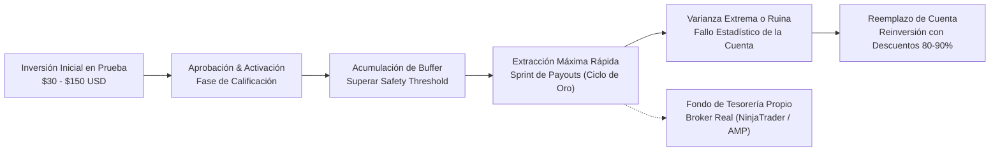
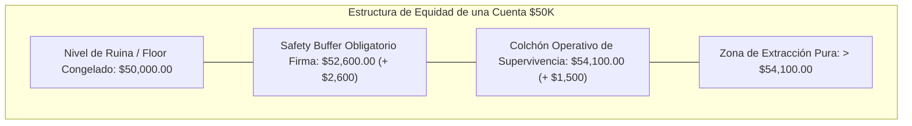
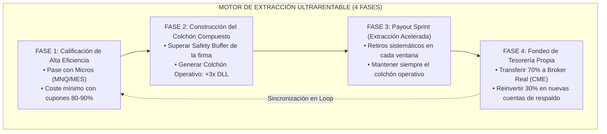

# 💸 Ciclo Óptimo de Retiros, Extracción de Liquidez & Modelado del Colchón de Seguridad (Safety Buffer)

> **Manual Cuantitativo y Estratégico de Extracción de Capital en Cuentas de Fondeo de Futuros CME.**
> **Tesis Central:** Una cuenta de fondeo no es un activo patrimonial a largo plazo, sino un **vehículo asimétrico de extracción de liquidez** con esperanza de vida finita. La rentabilidad real radica en extraer el máximo flujo de efectivo neto antes de la muerte estadística de la cuenta.

---

## 🎯 Navegación y Enlaces Bidireccionales
- 📌 **Ficha Maestra:** [[Ultrarentable]]
- 🔗 **Módulos Relacionados:** [[Motor de Fondeo y Prop Firms]] | [[Gestion de Capital — Balas y Estados]] | [[Plan 10 Fases]] | [[Investigacion/04_SISTEMA_MUNDIAL_PROP_FIRMS_FUTUROS]]
- 📑 **Protocolos Hermanos:** [[docs/tradesfera/04_PROTOCOLO_INTELIGENTE_APROBACION_CUENTAS]] | [[docs/tradesfera/07_PSICOLOGIA_DEL_FONDEO_Y_SESGOS_OPERATIVOS]] | [[docs/tradesfera/08_COMPARATIVA_PROP_FIRMS_FUTUROS_CME]]
- 🌐 **Panel Web Vivo:** `http://localhost:3000/prop-firms`
- 📊 **Dataset Canónico:** `apps/web/lib/prop-firms.ts` | `apps/web/data/providers.json`

---

## 🏛️ 1. La Gran Falacia del Fondeo a 10 Años y el Fallo Estadístico Inevitable

### 1.1 La Trampa Mental del "Patrimonio en Fondeo"
El 90% de los traders minoristas abordan una cuenta fondeada de $50,000 o $150,000 como si fuera una cuenta personal de corretaje en la que pueden acumular capital de forma indefinida durante 5 o 10 años. Este sesgo cognitivo es la causa primordial de quiebra tras haber conseguido una cuenta financiada.

```text
┌──────────────────────────────────────────────────────────────────────────────────────────────────┐
│                      LA FALACIA PATRIMONIAL VS REALIDAD CUANTITATIVA                             │
├──────────────────────────────────────────────────────────────────────────────────────────────────┤
│ ❌ SESGO RETAIL (FALACIA):                                                                       │
│   "Tengo una cuenta de $50,000. La cuidaré durante 5 años, dejaré crecer el saldo hasta $100K   │
│    y retiraré un sueldo mensual estable de por vida."                                            │
│                                                                                                  │
│ 🎯 REALIDAD CUANTITATIVA (ULTRARENTABLE):                                                        │
│   "Una cuenta de $50,000 tiene solo $2,000 de colchón real de pérdida (4%). Bajo apalancamiento │
│    de futuros, la probabilidad acumulada de ruina P(Ruina) converge a 1.0 a lo largo del tiempo. │
│    El objetivo es EXTRAER EL MÁXIMO CAPITAL NETO en sprints de alta frecuencia antes del shock."  │
└──────────────────────────────────────────────────────────────────────────────────────────────────┘
```

### 1.2 La Función de Riesgo Instantáneo (Hazard Rate) y Distribución de Supervivencia
En estadística actuarial y modelado de fiabilidad, la esperanza de vida de un sistema sometido a estrés continuo se modela mediante la **Tasa de Fallo o Hazard Rate** $\lambda(t)$.

En el trading de futuros bajo reglas de prop firms:
1. **Distancia de Ruina Constante o Reducida:** El Drawdown Máximo ($2,000 en $50K) representa apenas el **4%** del balance nominal.
2. **Volatilidad Intrínseca del Mercado:** Movimientos de 2 a 3 desviaciones estándar ($\pm 2\sigma, \pm 3\sigma$) en índices como el NQ (Nasdaq-100) ocurren de forma regular en ventanas de semanas o meses.
3. **Fatiga Operativa y Varianza Estocástica:** Incluso un algoritmo o trader cuantitativo con Ratio de Sharpe 2.0 y Factor de Beneficio 1.80 experimentará rachas de 5 a 8 pérdidas consecutivas a lo largo de 500 trades.

$$\lim_{t \to \infty} P(\text{Supervivencia de Cuenta}) = 0, \quad \text{donde } t = \text{número de sesiones operadas}$$



### 1.3 Conclusión Estratégica: La Cuenta como "Caja de Flujo Desechable"
Una cuenta de prop firm debe ser tratada cuantitativamente como una **opción call sintética de bajo coste y alto apalancamiento**:
- **Coste de Adquisición:** $30 a $150 USD (examen con descuento + cuota).
- **Riesgo Máximo:** Limitado estrictamente al coste de compra de la cuenta.
- **Rendimiento Potencial:** $2,000 a $15,000 USD de extracciones netas acumuladas.
- **Misión Operativa:** Recuperar el 100% de la inversión en el **Payout #1**, generar beneficio neto masivo en los **Payouts #2 a #5**, y transferir la liquidez al **Broker Propio (Fase 10)**.

---

## 🔬 2. Mecánica Matemática de Retiros & La Trampa de la Contracción del Drawdown

### 2.1 ¿Qué le Ocurre al Drawdown cuando Solicitas un Retiro?
El error más letal en una cuenta fondeada es retirar dinero sin comprender la mecánica del **Nivel de Ruina (Drawdown Floor)** post-retiro.

```text
┌──────────────────────────────────────────────────────────────────────────────────────────────────┐
│                    ANATOMÍA DE LA LIQUIDACIÓN POST-RETIRO (CASO REAL)                           │
├──────────────────────────────────────────────────────────────────────────────────────────────────┤
│ 1. Cuenta $50K con Max Drawdown de $2,000 (EOD Trailing).                                       │
│ 2. El trailing sube hasta congelarse en el Balance Inicial: Ruina Floor = $50,000.00.             │
│ 3. El trader genera ganancias y alcanza $52,500.00 de balance.                                   │
│ 4. Margen de maniobra actual: $52,500 - $50,000 = $2,500.00 de colchón.                         │
│ 5. El trader solicita un retiro imprudente de $2,000.00.                                         │
│ 6. Saldo resultante post-retiro: $50,500.00.                                                    │
│ 7. ¡EL FLOOR DE RUINA SIGUE EN $50,000.00!                                                      │
│ 8. Colchón de pérdida restante: $50,500 - $50,000 = $500.00 (¡Solo 25 puntos de NQ!).           │
│ 9. A la sesión siguiente, un retroceso menor liquida la cuenta de forma fulminante.             │
└──────────────────────────────────────────────────────────────────────────────────────────────────┘
```

### 2.2 Ecuación Fundamental de la Distancia de Ruina Post-Retiro
Para cualquier solicitud de retiro $W$, la distancia efectiva a la pérdida máxima permitida ($D_{post}$) queda determinada por:

$$D_{post} = (B_{actual} - W) - F_{liquidación}$$

Donde:
- $B_{actual}$ = Balance líquido de la cuenta antes del retiro.
- $W$ = Importe bruto retirado de la cuenta.
- $F_{liquidación}$ = Nivel de liquidación o suelo de ruina fijado por la regla de drawdown de la firma.

### 2.3 Definición Cuantitativa del Safety Buffer Threshold (SBT)
El **Safety Buffer Threshold (SBT)** es el umbral de equidad mínimo exigido por la firma de fondeo antes de habilitar el botón de retiro.

$$\text{Safety Buffer (Firma)} = \text{Balance Inicial} + \text{Max Drawdown} + \Delta_{min}$$

| Tamaño de Cuenta | Max Drawdown | Nivel de Ruina Congelado | Safety Buffer Mínimo (Firma) | Colchón Real si Retiras al SBT |
| :--- | :--- | :--- | :--- | :--- |
| **$25,000** | $1,500 (6.0%) | $25,000 | **$26,500 - $26,600** | **$0.00 - $100.00** ⚠️ *(Ruina Inmediata)* |
| **$50,000** | $2,000 a $2,500 | $50,000 | **$52,000 - $52,600** | **$0.00 - $100.00** ⚠️ *(Ruina Inmediata)* |
| **$100,000** | $3,000 a $3,500 | $100,000 | **$103,000 - $103,600** | **$0.00 - $100.00** ⚠️ *(Ruina Inmediata)* |
| **$150,000** | $4,500 a $5,000 | $150,000 | **$154,500 - $155,100** | **$0.00 - $100.00** ⚠️ *(Ruina Inmediata)* |

> [!CAUTION]
> **REGLA DE ORO DE ULTRARENTABLE:** Jamás solicites un retiro que deje tu saldo exactamente en el Safety Buffer de la firma. Quedar con un colchón de $0 a $100 significa que una sola comisión, un tick de slippage o el spread de apertura del CME destruirá la cuenta.

---

## 🧮 3. Modelado Matemático del Colchón Operativo Óptimo (Operating Safety Buffer)

### 3.1 El Colchón Operativo Adicional ($C_{operativo}$)
Para garantizar la supervivencia del vehículo de fondeo tras el retiro, el trader debe definir un **Colchón Operativo Adicional ($C_{operativo}$)** que absorba la varianza normal del sistema.

$$\text{Balance Objetivo de Retiro } (B_{target}) = \text{Safety Buffer (Firma)} + C_{operativo} + W_{deseado}$$



### 3.2 Dimensionamiento de $C_{operativo}$ según la Volatilidad del Sistema
El tamaño de $C_{operativo}$ debe ser una función determinista del **Límite de Pérdida Diaria (Daily Loss Limit / DLL)** o del **Riesgo por Operación ($R$)**:

$$C_{operativo} = \max\left(3 \times \text{DLL}, \; 6 \times R_{\text{trade}}, \; 1.5 \times \text{ATR}_{\text{diario en \$}}\right)$$

#### Ejemplo Práctico en Cuenta $50K (NQ / MNQ):
- Si tu pérdida máxima diaria aceptable es de **$500 USD** (10 contratos MNQ con stop de 25 pts = $500).
- $C_{operativo} = 3 \times \$500 = \$1,500 \text{ USD}$.
- Safety Buffer de la firma (Apex/MFFU/Tradeify): **$52,100 - $52,600**.
- **Balance Mínimo para Ejecutar Payout:** $\$52,600 + \$1,500 = \mathbf{\$54,100 \text{ USD}}$.
- Si tu balance es de **$56,100 USD**, el retiro seguro a solicitar es exactamente:
  $$W = \$56,100 - \$54,100 = \mathbf{\$2,000 \text{ USD}}$$
- **Resultado post-retiro:** Tu balance queda en **$54,100 USD**, manteniendo **$4,100 de distancia al suelo de ruina** ($50,000), garantizando que puedes soportar hasta 8 sesiones negativas seguidas sin quebrar la cuenta.

---

## 🔍 4. Desglose Forense de Políticas de Retiros en las Firmas Líderes

A continuación se desglosan las reglas reales, plazos, condiciones y letra pequeña de las principales prop firms de futuros CME auditadas en el motor Ultrarentable.

---

### 4.1 Lucid Trading: Extracción Ultra-Rápida (15-30 min) & 5 Días de Ciclo
**Lucid Trading** se ha posicionado como una de las firmas más eficientes para ciclos rápidos de extracción gracias a su integración con pasarelas de pago instantáneas y eliminación de fricciones burocráticas.

```text
┌──────────────────────────────────────────────────────────────────────────────────────────────────┐
│                             LUCID TRADING — FICHA TÉCNICA DE PAYOUTS                             │
├──────────────────────────────────────────────────────────────────────────────────────────────────┤
│ • Velocidad de Procesamiento: 15 a 30 minutos (Aprobación y liquidación automatizada).           │
│ • Ciclo Operativo: Retiros disponibles cada 5 días de trading completados.                      │
│ • Tipo de Drawdown: EOD Drawdown (Calculado al cierre CME 16:59 EST).                            │
│ • Cuota de Activación: $0 USD (Modelo LucidFlex con pago único en compra).                       │
│ • Profit Split: 90% Trader / 10% Firma desde el Payout #1.                                       │
│ • Regla de Consistencia en Fondeo: 0% (Sin restricciones de días máximos en cuenta financiada).  │
│ • Safety Buffer Exigido: $0 por encima del trailing EOD.                                         │
└──────────────────────────────────────────────────────────────────────────────────────────────────┘
```

#### Mecánica de Retiro en Lucid:
1. Completas **5 días de trading** en tu cuenta LucidFlex.
2. Solicitas el payout directamente desde el dashboard.
3. El pago se procesa vía **Rise Pay** o **Crypto (USDT/USDC)** en un plazo auditado de **15 a 30 minutos**.
4. Ideal para estrategias de rotación de alta frecuencia y vaciado rápido de saldo.

---

### 4.2 Earn2Trade: 4 Días de Examen, Retiros Semanales & Escalado TCP
**Earn2Trade** (a través de su broker partner institucional **Helios Trading Partners**) ofrece un modelo estructurado donde el trader pasa a una cuenta con contrato de capital institucional bajo el programa **Trader Career Path (TCP)**.

```text
┌──────────────────────────────────────────────────────────────────────────────────────────────────┐
│                            EARN2TRADE — FICHA TÉCNICA DE PAYOUTS                                 │
├──────────────────────────────────────────────────────────────────────────────────────────────────┤
│ • Días Mínimos de Evaluación: 4 días de trading en Trader Career Path (TCP).                     │
│ • Frecuencia de Retiro: Semanal (Solicitudes los lunes, pagos procesados los martes/miércoles).  │
│ • Safety Buffer: Igual al Max Drawdown ($2,000 en TCP 50K / $3,500 en TCP 100K).                │
│ • Profit Split: 80% Trader / 20% Firma.                                                          │
│ • Tope Trimestral: $0 (Sin límites máximos artificiales de retiro en los primeros meses).        │
│ • Escalado Automático: Al retirar ganancias, puedes optar por escalar la cuenta:                 │
│   $25K ➔ $50K ➔ $100K ➔ $200K (Live Fija) ➔ $400K (Live Fija con $20,000 de Drawdown).          │
└──────────────────────────────────────────────────────────────────────────────────────────────────┘
```

#### Ventajas Únicas de Earn2Trade:
- Los retiros son semanales sin penalizaciones de consistencia arbitrarias en cuenta fondeada.
- Al llegar al nivel de **$200K y $400K**, la cuenta pasa a ser una **cuenta de futuros real (Live)** con Drawdown Estático permanente.

---

### 4.3 Tradeify: 3 Días de Ganancias, Alto Volumen de Payouts & Straight to Funded
**Tradeify** es una de las firmas más agresivas de la industria, permitiendo tanto cuentas con evaluación rápida (Growth / Select) como cuentas **Straight to Funded** (Lightning Plan) sin examen previo.

```text
┌──────────────────────────────────────────────────────────────────────────────────────────────────┐
│                              TRADEIFY — FICHA TÉCNICA DE PAYOUTS                                 │
├──────────────────────────────────────────────────────────────────────────────────────────────────┤
│ • Frecuencia de Retiro: Cada 5 días ganadores (On-Demand tras acumular 5 días con ganancia >$100).│
│ • Programas Disponibles:                                                                         │
│   - Growth Plan: Pago único, $0 mensualidad, $0 activación, EOD Trailing.                        │
│   - Lightning Plan: Acceso directo fondeado (Sin examen), 20% consistencia en 1er payout.       │
│ • Safety Buffer Requerido: Balance Inicial + Max Drawdown + $100 ($52,100 en $50K).              │
│ • Topes de Retiro Primeros 3 Meses:                                                              │
│   - $25K: $1,000 / payout                                                                        │
│   - $50K: $1,500 / payout                                                                        │
│   - $100K: $2,500 / payout                                                                       │
│   - $150K: $3,500 / payout                                                                       │
│ • Profit Split: 90% Trader / 10% Firma.                                                          │
│ • Velocidad de Pago: 24 a 48 horas laborales vía Deel / Rise.                                    │
└──────────────────────────────────────────────────────────────────────────────────────────────────┘
```

#### Estrategia con Tradeify:
Debido a la ausencia de cuotas mensuales de renovación en los planes Growth y Lightning, Tradeify permite acumular días ganadores con micro-lotes (1-2 MNQ) sin la presión del cobro de suscripciones recurrentes.

---

### 4.4 Topstep: Política de 5 Días Ganadores de $150+ y Regla del 50%
**Topstep** es el estándar institucional histórico en el fondeo de futuros. Su política de retiros está diseñada para premiar la consistencia estricta mediante su regla de días ganadores.

```text
┌──────────────────────────────────────────────────────────────────────────────────────────────────┐
│                              TOPSTEP — FICHA TÉCNICA DE PAYOUTS                                  │
├──────────────────────────────────────────────────────────────────────────────────────────────────┤
│ • Requisito de Activación de Payout: 5 días ganadores de AL MENOS $150.00 USD cada uno.           │
│ • Velocidad de Procesamiento: Same Day Business (Mismo día hábil vía Deel / ACH / Wire).        │
│ • Política de Extracción (Regla del 50%):                                                        │
│   - Días 1 a 30 ganadores: Puedes retirar hasta el 50% del balance por encima del buffer.        │
│   - A partir de 30 días ganadores acumulados: 100% de retiro libre sin límites.                  │
│ • Congelación de Drawdown: El EOD Trailing Drawdown se congela permanentemente en $50,000.00.   │
│ • Profit Split: 100% de los primeros $10,000 USD netos; 90% Trader / 10% Topstep en adelante.  │
│ • Safety Buffer Exigido: $50,000.00 (Saldo Inicial).                                             │
└──────────────────────────────────────────────────────────────────────────────────────────────────┘
```

#### Ejemplo Numérico de Retiro en Topstep ($50K):
1. Balance inicial: $50,000.
2. Acumulas **5 días de trading con ganancias $\ge \$150$ cada día** y alcanzas un balance de **$56,000 USD**.
3. Capital sobre el buffer ($50,000): $\$56,000 - \$50,000 = \$6,000$.
4. **Retiro máximo permitido (50%):** $\$6,000 \times 0.50 = \mathbf{\$3,000 \text{ USD}}$.
5. **Saldo resultante:** $\$56,000 - \$3,000 = \mathbf{\$53,000 \text{ USD}}$.
6. **Ventaja matemática:** Mantienes automáticamente **$3,000 de colchón operativo** ($53,000 - $50,000), blindando la cuenta contra la quiebra involuntaria.

---

### 4.5 Apex Trader Funding: Ventanas Quincenales, Caps Trimestrales & Regla del 30%
**Apex Trader Funding** es el gigante de volumen con más de 300,000 cuentas activadas, pero impone las restricciones de retiro más estrictas y con mayor letra pequeña de la industria.

```text
┌──────────────────────────────────────────────────────────────────────────────────────────────────┐
│                            APEX TRADER FUNDING — FICHA TÉCNICA DE PAYOUTS                        │
├──────────────────────────────────────────────────────────────────────────────────────────────────┤
│ • Ventanas de Retiro Estrictas (Solo 2 al mes):                                                  │
│   - Ventana 1: Del 1 al 5 de cada mes (Pago entre el 15 y el 20).                                │
│   - Ventana 2: Del 15 al 20 de cada mes (Pago a fin de mes).                                     │
│ • Días Mínimos Requeridos: 10 días de trading individuales entre cada solicitud de retiro.       │
│ • Safety Buffer Obligatorio Intocable: Saldo Inicial + Max Drawdown + $100.                       │
│   - Cuenta $25K: $26,600 (Drawdown $1,500)                                                       │
│   - Cuenta $50K: $52,600 (Drawdown $2,500)                                                       │
│   - Cuenta $100K: $103,100 (Drawdown $3,000)                                                     │
│   - Cuenta $150K: $155,100 (Drawdown $5,000)                                                     │
│ • Topes de Retiro por Ventana (Meses 1 a 3):                                                     │
│   - Cuenta $50K: Máximo $2,000 por ventana ($4,000/mes).                                        │
│   - A partir del 4º mes: Retiros ilimitados (100% sobre el Safety Buffer).                       │
│ • Regla de Consistencia Windfall del 30%:                                                        │
│   - Ningún día individual puede superar el 30% del beneficio total acumulado en la cuenta.       │
│ • Profit Split: 100% primeros $25,000 USD acumulados; 90/10 en adelante.                        │
│ • Restricción de Ejecución: PROHIBICIÓN TOTAL DE BOTS en cuentas PA (Solo operativa manual).      │
└──────────────────────────────────────────────────────────────────────────────────────────────────┘
```

---

### 4.6 Take Profit Trader: Retiros Día 1 On-Demand & Transición EOD ➔ Intraday
**Take Profit Trader (TPT)** destaca por permitir retiros desde el **Día 1** en su cuenta **PRO** una vez superado el buffer, sin esperar 10 ni 15 días.

```text
┌──────────────────────────────────────────────────────────────────────────────────────────────────┐
│                         TAKE PROFIT TRADER — FICHA TÉCNICA DE PAYOUTS                            │
├──────────────────────────────────────────────────────────────────────────────────────────────────┤
│ • Velocidad de Retiro: Día 1 On-Demand (Inmediato tras superar el Safety Buffer).                │
│ • Días Mínimos de Trading: 0 días (Puedes retirar tras el primer trade ganador sobre el buffer). │
│ • Safety Buffer Requerido: Balance Inicial + Max Drawdown ($52,000 en cuenta $50K).              │
│ • Profit Split: 80% Trader / 20% TPT (Escalable a 90/10 con suscripción PRO+).                  │
│ • Topes de Retiro: Sin topes mensuales máximos en cuenta PRO.                                    │
│ • ⚠️ TRAMPA DE CAMBIO DE DRAWDOWN:                                                               │
│   - En Fase de Evaluación (Pro Test): Drawdown EOD (Fin de día).                                 │
│   - En Cuenta Financiada (PRO): Cambia automáticamente a Intraday Peak Trailing Drawdown.        │
└──────────────────────────────────────────────────────────────────────────────────────────────────┘
```

---

### 4.7 BluSky Trading & MyFundedFutures (MFFU): Modelos Alternativos

#### BluSky Trading (El Rey del Drawdown Estático Puro):
- **Drawdown 100% Estático:** El nivel de ruina se mantiene inmóvil en $48,000 para cuentas de $50K (nunca sube con las ganancias).
- **Retiros Diarios:** Payouts procesados de lunes a viernes vía Rise Pay.
- **Safety Buffer:** $0. Todo beneficio cerrado por encima de $50,000 es retirable.
- **Tope Trimestral:** $2,500 por payout en $50K durante los primeros 3 meses.

#### MyFundedFutures (MFFU - Rapid Plan):
- **$0 Cuota de Activación:** El plan Rapid no cobra cuota tras aprobar.
- **Payouts en 24h:** Procesamiento ultrarrápido al solicitar.
- **Safety Buffer:** Balance Inicial + Max DD + $100 ($52,100 en cuenta de $50K).
- **Split:** 90/10 desde el día 1, sin regla de consistencia en cuenta fondeada.

---

## 📊 5. Matriz Comparativa Maestra de Payouts (8 Firmas Líderes CME)

A continuación se comparan las 8 firmas líderes bajo el tier canónico de **Cuenta de $50,000 USD**:

| Firma | Programa Oficial | Safety Buffer Exigido | Días Mínimos Payout | Frecuencia de Retiro | Cap Meses 1-3 | Regla Consistencia | Régimen Drawdown | Split Trader |
| :--- | :--- | :--- | :--- | :--- | :--- | :--- | :--- | :--- |
| **Lucid Trading** | LucidFlex | **$50,000** | 5 días | **15-30 min On-Demand** | Sin tope ($0) | 0% en fondeo | EOD Trailing | **90%** |
| **Tradeify** | Growth Plan | **$52,100** | 5 días ganadores | **Cada 5 días** | $1,500 / payout | 35% consistencia | EOD Trailing | **90%** |
| **Topstep** | Trading Combine | **$50,000** | 5 días ($\ge \$150$) | **Mismo Día Hábil** | 50% balance > buffer | 50% en eval | EOD Trailing | **100% ($10K) / 90%** |
| **Apex Trader** | Rithmic/Tradovate | **$52,600** | 10 días | **Quincenal (1-5 y 15-20)**| $2,000 / ventana | 30% Windfall | Intraday Peak | **100% ($25K) / 90%** |
| **Earn2Trade** | TCP 50K (Helios) | **$52,000** | 0 días | **Semanal (Martes)** | Sin tope ($0) | 30% en eval | EOD Trailing | **80%** |
| **Take Profit Trader**| Pro Test / PRO | **$52,000** | 0 días | **Día 1 On-Demand** | Sin tope ($0) | 0% en PRO | Intraday Peak | **80% - 90%** |
| **BluSky Trading** | Propel Static | **$50,000** | 0 días | **Diario (L-V)** | $2,500 / payout | 34% en eval | **100% Estático** | **90%** |
| **MyFundedFutures**| Rapid Plan | **$52,100** | 0 días | **24 Horas On-Demand**| Sin tope ($0) | 0% en fondeo | EOD Trailing | **90%** |

---

## ⚙️ 6. El Algoritmo "Ultrarentable Extraction Engine": El Workflow de 4 Fases

Para maximizar la tasa de extracción de liquidez neta y construir una tesorería personal blindada, Ultrarentable implementa un algoritmo de 4 fases desincronizadas:



### Protocolo Detallado de las 4 Fases:

#### Fase 1: Calificación de Alta Eficiencia (Bajo Coste)
- Adquisición de pases con descuentos agresivos (códigos oficiales: `SAVINGS`, `TNT`, `300K`, `FLASH55`, `PRO50`).
- Operativa exclusiva con contratos Micro (1 a 4 MNQ) para evitar picos de flotante destructivos.
- Aprobación en el número mínimo de días requeridos (1 día en MFFU/Tradeify, 4 en Earn2Trade, 5 en Topstep).

#### Fase 2: Construcción del Colchón Compuesto ($SBT + C_{operativo}$)
- Una vez activada la cuenta financiada, **ESTÁ PROHIBIDO SOLICITAR EL PRIMER PAYOUT INMEDIATAMENTE SI DEJA EL BUFFER A CERO**.
- Se opera a medio gas hasta situar el balance en:
  $B \ge \text{Safety Buffer (Firma)} + 3 \times \text{DLL}$
- En una cuenta de $50K con $2,000 de DLL ($500/día), el objetivo antes del primer retiro es **$54,100 USD**.

#### Fase 3: Payout Sprint (Extracción Desincronizada en Multi-Cuenta)
- Al superar el umbral, se programa el retiro del excedente en la primera ventana disponible.
- Si operas un pool de **5 a 10 cuentas replicadas** con Trade Copier (Rithmic Copy Trader, ProjectX Copy o Replikanto):
  - **Cuentas Lucid / MFFU / TPT:** Extracciones inmediatas On-Demand.
  - **Cuentas Tradeify:** Payouts cada 5 días ganadores.
  - **Cuentas Apex:** Payouts quincenales (Días 1 y 15).
  - **Cuentas Topstep:** Payouts semanales del 50%.
- **Resultado:** Flujo de caja semanal constante de **$1,500 a $5,000 USD** entrando a la cuenta bancaria / wallet.

#### Fase 4: Tesorería Propia & Descentralización del Riesgo
- La liquidez extraída no se gasta en consumo superfluo: se divide según la **Matriz de Asignación Cuantitativa**:
  - **70% Hacia Broker de Futuros Propio (CME):** Capitalización progresiva en NinjaTrader Brokerage, Interactive Brokers o AMP Futures (Fase 10 del Plan Maestro).
  - **20% Fondo de Emergencia / Reserva de Retiros:** Amortiguador de liquidez en cuenta bancaria.
  - **10% Recarga de Balas (Cuentas de Prop Firm):** Adquisición de nuevos exámenes en oferta para mantener el pool de 10-20 cuentas siempre lleno.

---

## 📝 7. Casos de Estudio Numéricos & Checklist de Auditoría Pre-Retiro

### 7.1 Caso Práctico A: Extracción en Topstep $50K (Regla 50%)
- **Datos de Entrada:**
  - Balance actual: **$55,500.00 USD**.
  - Días ganadores acumulados ($\ge \$150$): **6 días** (Cumple requisito de 5 días).
  - Safety Buffer: **$50,000.00 USD**.
- **Cálculo de Extracción:**
  - Excedente sobre el buffer: $\$55,500 - \$50,000 = \$5,500.00$.
  - Retiro máximo permitido por Topstep (50%): $\$5,500 \times 0.50 = \mathbf{\$2,750.00 \text{ USD}}$.
  - Retención neta del trader (100% primeros $10K): **$2,750.00 USD netos**.
  - Balance resultante post-payout: $\$55,500 - \$2,750 = \mathbf{\$52,750.00 \text{ USD}}$.
  - Distancia de ruina post-payout: $\$52,750 - \$50,000 = \mathbf{\$2,750.00 \text{ USD}}$ *(Seguridad Óptima: $\$2,750 > 3 \times \text{DLL}$)*.

---

### 7.2 Caso Práctico B: Extracción en Apex Trader Funding $50K (Regla 30% Windfall)
- **Datos de Entrada:**
  - Balance actual: **$56,000.00 USD**.
  - Días de trading operados: **11 días** (Cumple requisito de 10 días).
  - Beneficio total acumulado: $\$56,000 - \$50,000 = \$6,000.00$.
  - Mejor día de ganancias: **+$1,500.00 USD**.
- **Auditoría de Consistencia (Regla 30%):**
  $$\text{Porcentaje del Mejor Día} = \frac{\$1,500}{\$6,000} = 25.0\% \quad (\le 30.0\% \implies \mathbf{\text{APROBADO}})$$
- **Cálculo de Extracción:**
  - Safety Buffer Apex: **$52,600.00 USD**.
  - Capital disponible para retiro: $\$56,000 - \$52,600 = \$3,400.00$.
  - Tope máximo permitido en Mes 1: **$2,000.00 USD**.
  - Retiro solicitado: **$2,000.00 USD** (100% para el trader = $2,000 netos).
  - Balance resultante: $\$56,000 - \$2,000 = \mathbf{\$54,000.00 \text{ USD}}$.
  - Distancia de ruina post-payout: $\$54,000 - \$50,000 = \mathbf{\$4,000.00 \text{ USD}}$ *(Colchón extraordinario de $\$1,400$ sobre el Safety Buffer)*.

---

### 7.3 Checklist Forense de 10 Puntos Antes de Solicitar un Payout

Antes de pulsar el botón *"Request Payout"* en cualquier dashboard, valida los 10 puntos de control:

```text
┌──────────────────────────────────────────────────────────────────────────────────────────────────┐
│                   CHECKLIST DE AUDITORÍA PRE-PAYOUT (ZERO-ERRORS PROTOCOL)                       │
├──────────────────────────────────────────────────────────────────────────────────────────────────┤
│ [ ] 1. ¿El balance actual supera el Safety Buffer oficial de la firma?                           │
│ [ ] 2. ¿El saldo post-retiro conservará al menos 3x tu Daily Loss Limit (DLL)?                   │
│ [ ] 3. ¿Se han completado los días mínimos de trading exigidos por la firma (4, 5 o 10 días)?   │
│ [ ] 4. ¿Has cerrado todas las posiciones abiertas y cancelado todas las órdenes límite/stop?    │
│ [ ] 5. ¿Cumples la regla de consistencia (ningún día >30% en Apex, >35% en Tradeify, etc.)?     │
│ [ ] 6. ¿Estás dentro de la ventana horaria oficial de solicitud de la firma?                     │
│ [ ] 7. ¿Has verificado el tope máximo permitido por payout según el mes de antigüedad (Cap)?     │
│ [ ] 8. ¿Tu método de cobro (Deel, Rise Pay, Crypto, Wire) está validado y verificado (KYC OK)?   │
│ [ ] 9. ¿Has desvinculado temporalmente la cuenta del Trade Copier para evitar ejecuciones acc.?  │
│ [ ] 10. ¿Tienes listo el plan de reinversión: 70% Broker Propio, 20% Reserva, 10% Nuevos Pases?  │
└──────────────────────────────────────────────────────────────────────────────────────────────────┘
```

---

## 🏛️ 8. Integración con el Sistema Maestro Ultrarentable

Este protocolo interactúa en tiempo real con los módulos analíticos y herramientas del ecosistema Ultrarentable:
- 📊 **Calculadora de Extracción y ROI:** `apps/web/app/prop-firms/components/ExtractionRoiCalculator.tsx`
- 🤖 **UltraBot AI Advisor:** Asesor conversacional para consultas de letra pequeña y fechas de payout.
- 🗄️ **Base de Datos Canónica:** `apps/web/lib/prop-firms.ts` (Sincronización de cupones, buffers y reglas de retiro).
- 📈 **Plan de Escalado de Capital:** [[Gestion de Capital — Balas y Estados]] y [[Plan 10 Fases]].

---
*Documento certificado bajo el protocolo Zero-Mocks y Real-Only de Ultrarentable V2 (Actualizado a Agosto de 2026).*
