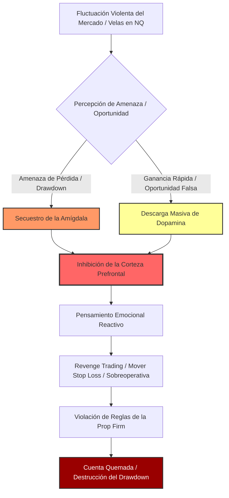
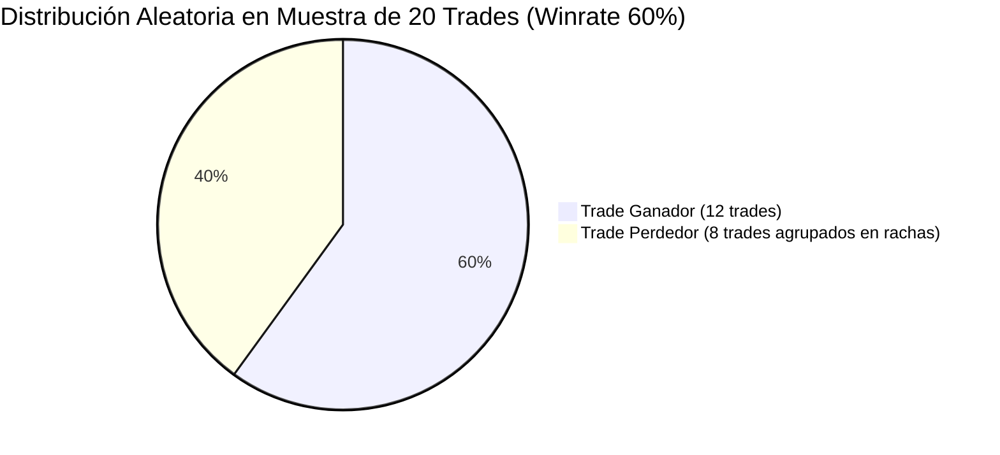
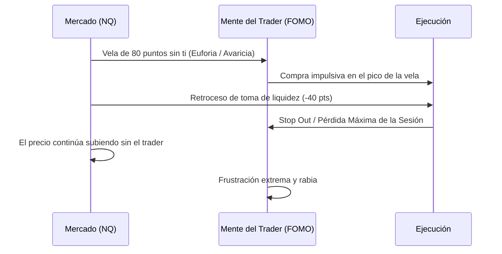
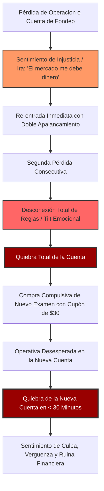
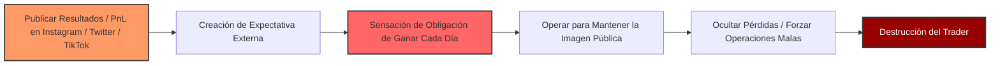

# 🧠 TRATADO MAESTRO: PSICOLOGÍA DEL FONDEO, GESTIÓN DE SESGOS Y NEUROCIENCIA OPERATIVA EN FUTUROS CME

> **Doctrina Psicológica y Conductual Unificada para Cuentas de Evaluación y Fondeo Real**  
> *Síntesis técnica de las enseñanzas de **Víctor Corrales (@Elpsicologodeltrading)**, **Gerard García (@GerardGarciafx)** y **Vicente Pons (Tradesfera)**.*  
> **Proyecto:** 01 Ultrarentable V2 | **Fecha:** 26 de Agosto de 2026 | **Ámbito:** Futuros CME (NQ, ES, YM, RTY, CL, GC, MNQ, MES).

---

## 🎯 0. Navegación y Enlaces Bidireccionales
- 📌 **Ficha Maestra:** [[Ultrarentable]]
- 🔗 **Módulos y Arquitectura:** [[04_SISTEMA_MUNDIAL_PROP_FIRMS_FUTUROS]] | [[03_CATALOGO_MAESTRO_34_PROP_FIRMS]] | [[Gestion de Capital — Balas y Estados]] | [[Plan 10 Fases]]
- 🌐 **Terminal y Módulos Web:** `http://localhost:3000/prop-firms` | `http://localhost:3000/portfolio`
- 📚 **Archivo Canónico:** `docs/tradesfera/07_PSICOLOGIA_DEL_FONDEO_Y_SESGOS_OPERATIVOS.md`

---

## 🏛️ 1. Introducción y el Triángulo Doctrinario del Psicotrading Institucional

El trading en empresas de fondeo de futuros (*Prop Firms*) no es una actividad técnica con un componente psicológico menor; es un **desafío neuropsicológico de alta intensidad** ejecutado bajo reglas asimétricas impuestas por un tercero. El 95% de los operadores no fracasan por falta de lectura de gráficos o desconocimiento de la acción del precio, sino por el **colapso de su estructura de toma de decisiones bajo presión**.

Este manual unifica los tres enfoques más sólidos y contrastados del ecosistema hispanohablante:

```text
                                  ▲
                                 / \
                                /   \
                               /     \
                              /       \
                             /  VÍCTOR \
                            / CORRALES  \
                           / (@ElPsico-  \
                          /  logodel-     \
                         /   Trading)      \
                        /───────────────────\
                       /  Neurociencia,      \
                      /   Sesgos Cognitivos,  \
                     /    Desapego de PnL y    \
                    /     Probabilidad Pura     \
                   /                             \
                  /                               \
                 /                                 \
  GERARD GARCÍA ◄───────────────────────────────────► VICENTE PONS
 (@GerardGarciafx)                                  (Tradesfera)
 Hard Scalping bajo Fuego,                          Ingeniería de Prop Firms,
 Gestión de Drawdown Real,                         Matemática Anti-Trampas,
 Circuit Breakers, Disciplina                       Sunk Cost y Transparencia
 de PA/Live y Perfil Bajo                          del Libro Mayor
```

### 1.1 Síntesis de los 3 Maestros de Referencia

| Especialista | Ecosistema / Enfoque | Pilar Central | Aportación Fundamental a este Tratado |
|---|---|---|---|
| **Víctor Corrales** (`@Elpsicologodeltrading`) | Neuropsicología y Terapia Conductual Aplicada al Trading | *Desensibilización Monetaria y Sesgos Cognitivos* | Comprensión del secuestro amigdalino, reestructuración del pensamiento probabilístico, anulación del termostato financiero limitante y control del circuito dopaminérgico. |
| **Gerard García** (`@GerardGarciafx`) | Hard Scalping en Futuros CME & Operativa Multicuenta | *Gestión de Presión en Cuentas PA/Live y Cero Ego* | Reglas de ejecución bajo fuego, transición mental de Evaluación a PA, contención del *revenge trading* mediante circuit breakers físicos y doctrina del *Silent Trader* (perfil bajo). |
| **Vicente Pons** (`Tradesfera`) | Ingeniería de Sistemas, Desmitificación de Prop Firms y Transparencia | *Matemática del Riesgo Asimétrico y Anti-Coste Hundido* | Desmontaje de la trampa del capital nominal (\$50K vs \$2.5K reales), eliminación de la falacia del coste hundido en cuentas en drawdown, y auditoría forense mediante Libro Mayor. |

---

## 🔬 2. Neurobiología del Trading: La Batalla entre la Amígdala y la Corteza Prefrontal

Para dominar la psicología del fondeo, es imprescindible comprender la cascada biológica que ocurre en el cerebro humano ante la fluctuación del capital en tiempo real.



### 2.1 El Secuestro Amigdalino (*Amygdala Hijack*) en Futuros
Cuando una posición en el Nasdaq (NQ) o E-mini S&P (ES) se mueve en contra a gran velocidad, el cerebro no distingue entre una amenaza física de muerte y una pérdida monetaria. La **amígdala cerebral** dispara una respuesta de lucha o huida (*fight or flight*):
- **Taquicardia y respiración superficial**: Reducción del flujo de oxígeno a las zonas de razonamiento lógico.
- **Inactivación de la Corteza Prefrontal (PFC)**: La región responsable de la planificación a largo plazo, el cálculo de probabilidades y el autocontrol queda desconectada.
- **Conductas automáticas de defensa**: Mover el Stop Loss para "evitar que me toque", promediar a la baja (*martingala impulsiva*) o congelarse ante la pantalla viendo cómo se evapora la cuenta.

### 2.2 La Trampa Dopaminérgica del Scalping
Víctor Corrales y Gerard García coinciden en que el trading de futuros intradía actúa directamente sobre el sistema de recompensa del cerebro:
- El cerebro libera más dopamina ante una **recompensa incierta e intermitente** (ganar dinero aleatoriamente con un clic) que ante una recompensa segura.
- Esta neuroquímica es idéntica a la de las máquinas tragaperras. El trader que opera sin un plan rígido busca inconscientemente el **chute de dopamina**, transformando la sesión de trading en una sesión de ludopatía interactiva.

---

## 💵 3. Presión del Dinero Virtual vs Real: La Ilusión del Saldo Nominal

### 3.1 La Falacia Matemática de la Cuenta de $50,000 (Doctrina Vicente Pons)

Uno de los mayores venenos psicológicos inculcados por el marketing de las empresas de fondeo es el **anclaje en el saldo nominal**:

$$\text{Saldo Publicitado} = \$50,000 \quad \neq \quad \text{Capital Real Operable} = \$2,500 \text{ (Max Drawdown)}$$

> [!WARNING]
> **LECCIÓN FUNDAMENTAL DE TRADESFERA:**
> Si compras una cuenta de $\$50,000$ con un drawdown máximo de $\$2,500$, **NUNCA HAS TENIDO UNA CUENTA DE $\$50,000$**. Tienes una micro-cuenta de **$\$2,500$ de capital de riesgo total**. 
> Si arriesgas $\$500$ por operación creyendo que es un comedido $1\%$ de $\$50,000$, en realidad estás arriesgando el **$20\%$ de tu capital real de quiebra**. Con 5 operaciones fallidas consecutivas, tu cuenta está matemáticamente destruida.

```text
┌──────────────────────────────────────────────────────────────────────────────────────────────────┐
│                           ILUSIÓN MONETARIA VS REALIDAD MATEMÁTICA                               │
├──────────────────────────────────────────────────┬───────────────────────────────────────────────┤
│ PERSPECTIVA DEL TRADER NOVATO (ILUSIÓN)          │ PERSPECTIVA DEL TRADER PROFESIONAL (REALIDAD) │
├──────────────────────────────────────────────────┼───────────────────────────────────────────────┤
│ • Saldo: $50,000 USD                             │ • Saldo Real Disponible: $2,500 USD           │
│ • Arriesgar $500 por trade = 1.0% de la cuenta   │ • Arriesgar $500 por trade = 20.0% de ruina   │
│ • "Puedo meter 3 contratos de NQ fácilmente"     │ • "1 contrato de NQ puede quemar mi cuenta"   │
│ • Sensación de holgura y exceso de confianza     │ • Conciencia quirúrgica de cada punto / tick  │
│ • Apalancamiento implícito: Brutal y suicida     │ • Uso obligatorio de Micro Futuros (MNQ/MES) │
└──────────────────────────────────────────────────┴───────────────────────────────────────────────┘
```

### 3.2 El "Shock del Fondeado": El Abismo Emocional entre Evaluación y PA/Live (Gerard García)

Gerard García describe con precisión quirúrgica el fenómeno que destruye al 80% de los traders que aprueban un examen:

1. **Fase de Evaluación (Evaluación Demo):**
   - El trader opera desinhibido, agresivo y rápido. "Total, solo me ha costado 35$ el examen con cupón".
   - El desapego al dinero virtual genera una toma de decisiones fluida. El trader aprueba la prueba en pocos días.
2. **Fase Fondeada / PA (Performance Account / Live Sim):**
   - El trader paga la cuota de activación (\$140 - \$150 USD).
   - **Aparece el Pánico a la Pérdida del Estatus**: "Ya soy trader fondeado, no puedo permitirme perder esta cuenta".
   - El dinero simulado pasa a tener **valor psicológico real** porque representa retiros potenciales y reconocimiento social.
   - El operador sufre **parálisis por análisis**: duda en las entradas válidas, entra tarde por miedo a quedarse fuera, sale antes de tiempo con ganancias mínimas (\$50) y deja correr pérdidas completas (-\$300) esperando no tocar el drawdown.
   - **Resultado:** La cuenta fondeada se quema en las primeras 48 a 72 horas.

```mermaid
graph LR
    subgraph Evaluación (Desinhibición)
        A1[Coste: $35] --> A2[Cero Miedo] --> A3[Ejecución Fluida] --> A4[APROBADO]
    end
    
    subgraph Fondeado PA (Parálisis)
        B1[Pago Activación $149] --> B2[Miedo a Perder Cuenta] --> B3[Parálisis / Dudas] --> B4[Cierre Prematuro Ganancias] --> B5[Stop Completo en Pérdidas] --> B6[CUENTA QUEMADA EN 48H]
    end
    
    A4 -. Transición .-> B1
    
    style A4 fill:#090,stroke:#333,stroke-width:2px,color:#fff
    style B6 fill:#900,stroke:#333,stroke-width:2px,color:#fff
```

### 3.3 El Protocolo de Desensibilización Monetaria (Víctor Corrales)

Para anular este shock, Víctor Corrales propone la **Desconexión Total del Símbolo de Dólar**:
1. **Ocultar el PnL Flotante en la Plataforma:** Configurar NinjaTrader, Tradovate o TradingView para mostrar **Puntos, Ticks o Unidades R**, jamás dinero en dólares (\$ USD).
2. **Mentalidad de Ficha de Casino / Unidad de Trabajo:** El capital de la cuenta no es dinero para pagar el alquiler o comprar caprichos; es el inventario de una fábrica. Si vendes piezas de madera, no lloras cada vez que utilizas un tablón para fabricar una mesa.
3. **El Colchón de Seguridad Innegociable (*Buffer Strategy*):**
   - Cuando se recibe una cuenta PA, **está terminantemente prohibido solicitar un retiro en el primer ciclo que deje la cuenta al borde del abismo**.
   - Se debe construir primero un colchón de seguridad equivalente al menos a **2 veces el drawdown inicial** (ej. llevar la cuenta de \$50K a \$54K) operando exclusivamente con micro-contratos (MNQ/MES) antes de operar tamaño estándar o solicitar payouts.

---

## 🎯 4. Desconexión Emocional y Pensamiento en Probabilidades

### 4.1 La Doctrina del Pensamiento Probabilístico (Mark Douglas $\times$ Víctor Corrales)

Víctor Corrales subraya que la frustración y la rabia en el trading nacen de una **expectativa errónea de certidumbre**. El cerebro humano está programado evolutivamente para buscar patrones seguros de causa y efecto. Sin embargo, el mercado es un entorno de incertidumbre radical.

$$\mathbb{E}[Trade] = (P_{\text{win}} \times W) - (P_{\text{loss}} \times L) - \text{Comisiones}$$

#### Las 5 Verdades Fundamentales del Fondeo:
1. **Cualquier cosa puede suceder en cualquier momento:** No existe ningún soporte, resistencia, Order Block o FVG que garantice una reacción del 100%.
2. **No necesitas saber qué va a pasar a continuación para hacer dinero:** Solo necesitas una ventaja estadística ejecutada con estricta consistencia en una muestra grande de operaciones.
3. **Hay una distribución aleatoria entre ganancias y pérdidas en cualquier serie de trades:** Aunque tu sistema tenga un 60% de acierto, puedes encadenar 5 o 6 pérdidas seguidas de forma perfectamente natural (Distribución de Bernoulli).
4. **Un trade individual es irrelevante:** Tu éxito se define en bloques de 50 a 100 operaciones, nunca en la operación que tienes abierta ahora mismo.
5. **El mercado no es personal:** El algoritmo interbancario o los participantes institucionales no saben quién eres, no te conocen y no tienen ninguna conspiración en tu contra.



### 4.2 Disociación entre Calidad del Trade y Resultado del Trade

```text
┌──────────────────────────────────────────────────────────────────────────────────────────────────┐
│                               MATRIZ DE CALIDAD DE EJECUCIÓN                                     │
├─────────────────────────────────────┬────────────────────────────────────────────────────────────┤
│                                     │                      RESULTADO MONETARIO                   │
│                                     ├────────────────────────────┬───────────────────────────────┤
│                                     │          GANANCIA          │            PÉRDIDA            │
├────────────┬────────────────────────┼────────────────────────────┼───────────────────────────────┤
│            │ BUENA                  │ 🟢 TRADE PERFECTO          │ 🔵 PÉRDIDA PROFESIONAL        │
│            │ (Siguió el plan al     │  • Ejecutó su ventaja      │  • Coste operativo del negocio│
│ CALIDAD DE │  100%, respetó stop)   │  • Refuerzo positivo sano  │  • Mantuvo la ventaja intacta │
│ EJECUCIÓN  ├────────────────────────┼────────────────────────────┼───────────────────────────────┤
│            │ MALA                   │ 🔴 GANANCIA TÓXICA         │ 💀 PÉRDIDA DESTRUCTIVA        │
│            │ (Violó reglas, quitó   │  • Refuerzo perverso       │  • Autosabotaje evidente      │
│            │  stop, trade impulsivo)│  • Conduce a quemar cuentas│  • Destrucción de disciplina  │
└────────────┴────────────────────────┴────────────────────────────┴───────────────────────────────┘
```

> [!CAUTION]
> **EL PELIGRO MORTAL DE LA GANANCIA TÓXICA:**
> Víctor Corrales advierte: Ganar dinero en una operación saltándose las reglas (ej. promediar a la baja sin stop y que el precio se dé la vuelta salvándote de milagro) es **el peor evento que le puede ocurrir a un trader**. El cerebro registra que "romper las reglas produce beneficio", creando una ruta neuronal autodestructiva que garantizará la quiebra futura de la cuenta.

---

## 🛑 5. Control del FOMO y la Sobreoperativa (*Overtrading*)

### 5.1 La Anatomía del FOMO (*Fear Of Missing Out*) en el Nasdaq (Gerard García)

El NQ es el instrumento más volátil y emocional del CME. Su velocidad de desplazamiento genera espejismos continuos de riqueza instantánea:

1. **El Gatillo:** El trader abre la pantalla a las 9:35 EST y observa una vela expansiva de 80 puntos sin retroceso.
2. **El Pensamiento Automático:** *"¡Se me va el movimiento del día! Si hubiera entrado con 2 contratos ya llevaría \$3,200 ganados. Tengo que entrar ya"*.
3. **La Acción Impulsiva:** El trader compra en el máximo absoluto de la vela (*Buying the Top*).
4. **La Trampa de Liquidez:** Las instituciones toman beneficios; el precio retrocede con violencia 40 puntos para testear el VWAP o el origen del movimiento.
5. **El Stop Out:** El trader es liquidado en el retroceso justo antes de que el precio continúe su tendencia original.



### 5.2 La Trampa del "Aburrimiento Operativo"
El trader novato confunde la actividad con la productividad. En el trading profesional:
- **Menos es Más:** El 85% del tiempo de un trader de éxito consiste en **esperar pasivamente** a que el precio alcance su zona de alta probabilidad y confirme el gatillo.
- **La Búsqueda de Estimulación:** Sentarse frente a los gráficos y no operar durante dos horas produce una sensación de incomodidad que empuja al operador a "inventar" operaciones donde solo hay ruido de mercado.

### 5.3 Cortafuegos Innegociables contra la Sobreoperativa

| Regla | Parámetro Estricto | Mecanismo de Control |
|---|---|---|
| **Número Máximo de Disparos (Balas)** | 2 a 3 operaciones por día | Si se ejecutan 3 operaciones (ganadoras o perdedoras), la sesión ha terminado. |
| **Pérdida Máxima Diaria (Max Daily Loss)** | $1.5\%$ del drawdown real (ej. $-\$350$ en cuenta de \$50K) | Cierre automático mediante el gestor de riesgo de Rithmic / Tradovate. |
| **Ventana Temporal Acotada (Killzone)** | 09:30 a 11:30 EST (Nueva York) | Prohibido operar en horas de bajo volumen (almuerzo NY) o fuera de sesión. |
| **Regla de 1 Solo Setup Activo** | 1 patrón técnico específico (ej. Break & Retest + Delta) | Si el mercado no presenta ese setup exacto, el teclado no se toca. |

---

## ⚡ 6. Erradicación del 'Revenge Trading' y la Trampa de los Resets Baratos

### 6.1 El Bucle de Destrucción del Revenge Trading

El *Revenge Trading* (operativa por venganza) es la principal causa de quiebra masiva de cuentas de fondeo en el mundo:



### 6.2 La Trampa de los Resets y Ofertas del 80%-90% (Doctrina Vicente Pons)

Vicente Pons ha denunciado incansablemente el modelo de negocio perverso de ciertas prop firms:
- **El Modelo de Negocio de la Ludopatía:** Las firmas ofrecen descuentos del 80% o 90% en cuentas de \$50K por \$30-\$40 USD.
- **La Ilusión del Reset Fácil:** Cuando el trader pierde una cuenta, en lugar de realizar una autopsia rigurosa de sus errores, piensa: *"No pasa nada, compro otra cuenta por 33$ y me la juego con 5 contratos de NQ a ver si la paso hoy mismo"*.
- **La Espiral del Gasto Oculto:** El trader no se da cuenta de que ha gastado **\$1,500 o \$2,000 USD en 40 compras de cuentas y resets sucesivos**, sin haber consolidado un solo método consistente.

### 6.3 Protocolo R.I.P. (Reseteo Inmediato Post-Pérdida) de Gerard García

Ante la pérdida de una cuenta o el alcance del stop diario:
1. **Regla de Cuarentena Obligatoria (Cooling-off Period de 24 Horas):**
   - **PROHIBIDO TERMINANTEMENTE** comprar una nueva cuenta de evaluación, pagar un reset o abrir una cuenta alternativa en las siguientes 24 horas naturales.
2. **Cierre Físico del Ordenador:**
   - Desconectar la plataforma y levantarse físicamente del escritorio. El trader bajo *tilt* no puede permanecer en la misma habitación que su estación de trabajo.
3. **Auditoría Forense en Frío:**
   - Pasadas 12 horas, cuando la frecuencia cardíaca y los niveles de cortisol se hayan normalizado, se registra la pérdida en el Libro Mayor analizando si fue un fallo técnico o una indisciplina emocional.

---

## ⚓ 7. La Falacia del Coste Hundido en Cuentas con Drawdown Severo

### 7.1 La Psicología del "Agónico en Drawdown"

La **Falacia del Coste Hundido** (*Sunk Cost Fallacy*) se manifiesta cuando un trader tiene una cuenta de \$50,000 cuyo límite de drawdown de \$2,500 ya ha consumido \$2,300 (quedándole solo \$200 de margen antes de ser suspendida):

```text
                               ESTADO AGÓNICO DE LA CUENTA
                               
      $50,000 (Balance Inicial)
         │
         ▼ ─────────────────────────── [Drawdown Consumido: -$2,300]
      $47,700 (Balance Actual)
         │  ▲
         │  │ 💥 MARGEN RESTANTE: $200 (¡Cualquier retroceso de 10 pts en NQ te mata!)
         ▼  ▼
      $47,500 ─── [LÍMITE MORTAL DE LIQUIDACIÓN]
```

### 7.2 El Error Psicológico Fatal
El operador piensa: *"He invertido 3 semanas de trabajo y la cuota de activación en esta cuenta. No puedo dejarla morir. Voy a meter 2 contratos de NQ en una operación para recuperar \$1,500 de golpe y salvarla"*.

**Consecuencia Inevitable:** 
- Con un margen de \$200, 2 contratos de NQ representan \$40 por punto. Con un deslizamiento o retroceso de **solo 5 puntos (ruido puro de mercado)**, la cuenta queda fulminada en 3 segundos.
- El trader sufre una sobrecarga de estrés y frustración devastadora que contamina todas sus demás cuentas operativas.

### 7.3 Doctrina de Eutanasia Operativa y Aceptación de la Pérdida (Vicente Pons)

Vicente Pons establece una directriz tajante para la gestión de cuentas en coma inducido:

1. **Reconocimiento de la Asimetría de Probabilidad:** Una cuenta que ha consumido más del $75\%$ de su drawdown tiene una probabilidad matemática de recuperación inferior al $8\%$ con una gestión de riesgo estándar.
2. **Eutanasia Operativa o Paso a Micro-Lotes (MNQ):**
   - **Opción A (Recomendada):** Dar la cuenta por **amortizada y perdida psicológicamente**. Retirarla del panel visual del trader para que no genere ansiedad de fondo.
   - **Opción B (Rehabilitación Ultra-Lenta):** Si se decide continuar, se reduce el tamaño a **1 solo micro-contrato (MNQ)** arriesgando \$15-\$20 por trade. Si se recupera en varias semanas de trading perfecto, excelente; si se pierde, el impacto emocional es nulo.
3. **Cero Fondos Adicionales en Resets Inútiles:** No pagar extensiones de tiempo ni resets sobre cuentas moribundas si el proceso de toma de decisiones sigue viciado.

---

## 🤫 8. La Doctrina del "Silent Trader": Perfil Bajo y Gestión de Expectativas

### 8.1 El Veneno de las Redes Sociales y el "Trading Show" (Gerard García)

Uno de los pilares más defendidos por Gerard García es la **erradicación del ego público y el mantenimiento de un estricto perfil bajo**:



### 8.2 La Carga Invisible de las Expectativas del Entorno (Víctor Corrales)

Víctor Corrales destaca el impacto destructivo de involucrar a familiares y amigos en el proceso operativo diario:
- Decirle a tu pareja, padres o amigos: *"Hoy voy a ganar \$500 en el Nasdaq para pagar las vacaciones"* añade un **peso emocional insoportable** sobre cada clic del ratón.
- Durante la sesión, cada tick en contra ya no es solo una fluctuación estadística; es la pérdida de las vacaciones familiares o la vergüenza de admitir un fracaso ante seres queridos.

### 8.3 El Decálogo del Trader Invisible (*The Silent Operator*)

1. **Nadie a tu alrededor necesita saber cuánto dinero ganas o pierdes al día.**
2. **Prohibido subir capturas de PnL no retirado a redes sociales.** Una cuenta fondeada no es dinero real hasta que el dinero está acreditado en tu cuenta bancaria.
3. **El trading es un oficio solitario, frío, aburrido y de despacho.** Si buscas validación social, aplausos o adrenalina, inscríbete en un club deportivo, no en los mercados financieros.
4. **Cero euforia en los días de ganancias máximas; cero drama en los días de pérdida máxima.** Mantener una línea emocional plana (Ataraxia estoica).
5. **Tu valor como ser humano no está correlacionado con tu PnL del día.**

---

## 🧘 9. Protocolos de Reseteo Mental: Rutinas Pre, Intra y Post Mercado

Para profesionalizar la operativa en futuros CME, la preparación mental debe estructurarse como la de un atleta de élite o un piloto de aviación civil mediante **checklists de obligado cumplimiento**.

```mermaid
graph TD
    subgraph 1. Rutina Pre-Mercado (45 min antes)
        A1[Higiene Biológica & Respiración 4-7-8] --> A2[Filtro de Noticias Macro ForexFactory]
        A2 --> A3[Marcado de Zonas & Escenarios IF-THEN]
        A3 --> A4[Aceptación Explícita de la Pérdida del Día]
    end
    
    subgraph 2. Rutina Intra-Mercado (En Vivo)
        B1[PnL Oculto / Modo Puntos] --> B2[Monitorización Somática del Estrés]
        B2 --> B3[Ejecución de Balas 1, 2 o 3]
        B3 --> B4[Cierre Inmediato por Max Loss o Target]
    end
    
    subgraph 3. Rutina Post-Mercado (Inmediatamente al terminar)
        C1[Desconexión Física de Plataforma] --> C2[Registro en Libro Mayor & Journaling Emocional]
        C2 --> C3[Autopsia Técnica en Frío]
        C3 --> C4[Desconexión Total y Vida Fuera de Pantallas]
    end
    
    A4 --> B1
    B4 --> C1
    
    style A4 fill:#090,stroke:#333,stroke-width:2px,color:#fff
    style B4 fill:#090,stroke:#333,stroke-width:2px,color:#fff
    style C1 fill:#900,stroke:#333,stroke-width:2px,color:#fff
```

### 9.1 Protocolo Pre-Mercado (45 a 60 Minutos Antes de la Apertura)

#### Checklist de Despegue Operativo:
- [ ] **1. Estado Fisiológico Óptimo:** ¿He dormido al menos 7 horas? ¿He tomado agua? ¿Mi nivel de estrés basal es inferior a 4/10? Si estoy enfermo, con resaca o bajo crisis personal, **NO SE OPERA HOY**.
- [ ] **2. Respiración de Centramiento:** 5 minutos de respiración diafragmática (Protocolo Box Breathing: 4s inhalar, 4s retener, 4s exhalar, 4s retener) para activar el sistema nervioso parasimpático y desactivar la amígdala.
- [ ] **3. Calendario Macroeconómico:** Inspeccionar ForexFactory / investing.com. Identificar publicaciones de alto impacto (CPI, PPI, FOMC, NFP, ISM, Declaraciones de la FED).
  * *Regla de Oro:* Estar completamente plano (fuera del mercado) **5 minutos antes y 5 minutos después** de cualquier dato rojo.
- [ ] **4. Mapeo Técnico Estático:** Trazar niveles clave de liquidez en gráfico de 1H y 15M (Máximos/Mínimos del día anterior, Niveles Overnight, VWAP previo, Zonas de Oferta/Demanda). Definir escenarios condicionales (*"Si el precio llega al nivel X y muestra absorción en Delta, buscaré compra; si rompe con volumen, esperaré el retest"*).
- [ ] **5. Declaración de Aceptación de Pérdida (Contrato Mental):**
  > *"Hoy acepto perder un máximo de \$350 USD (mi límite diario). Esta pérdida no amenaza mi capital, ni mi supervivencia, ni mi capacidad como trader. Mi único trabajo hoy es ejecutar mi plan con disciplina militar. El resultado le pertenece a la probabilidad."*

---

### 9.2 Protocolo Intra-Mercado (Durante la Sesión de Trading)

1. **Ocultación Absoluta de Contadores de Dinero:**
   - La ventana de *Account Balance* y *Unrealized PnL* debe permanecer minimizada o cubierta.
   - Solo se visualizan los ticks del contrato y la distancia técnica al Stop Loss y Take Profit.
2. **Escaneo Somático de Alerta Temprana:**
   - Si detectas: mandíbula apretada, puños cerrados, sudor en las palmas, respiración entrecortada o ganas imperiosas de "hacer clic ya", **RETIRA LAS MANOS DEL RATÓN**.
   - Ponte de pie, aléjate 2 metros de la pantalla y realiza 3 respiraciones profundas antes de volver a mirar el gráfico.
3. **Gestión de Balas:**
   - **Bala 1:** Entrada de alta probabilidad según setup.
   - Si es Ganadora: Evaluar si el mercado ofrece una segunda oportunidad clara; si no, cerrar la sesión en verde.
   - Si es Perdedora: Esperar al menos 15 minutos antes de contemplar la Bala 2 para limpiar el sesgo de recencia.
   - Si la Bala 2 es Perdedora: **SESIÓN CERRADA AUTOMÁTICAMENTE**.

---

### 9.3 Protocolo Post-Mercado (Inmediatamente al Finalizar la Operativa)

1. **El Ritual de Desconexión (*The Kill Switch*):**
   - Cerrar NinjaTrader / Tradovate / TradingView.
   - No dejar gráficos abiertos "para ver qué habría pasado". Ver lo que el precio hace sin ti genera FOMO retrospectivo y fatiga mental innecesaria.
2. **Journaling Cuantitativo y Emocional (El Libro Mayor):**
   - Registrar cada operación en la bitácora con los siguientes campos obligatorios:
     * *Captura de pantalla de la entrada y la salida.*
     * *Cumplimiento de reglas (0 a 100%).*
     * *Nivel de calma emocional durante el trade (1 = pánico/euforia, 10 = ataraxia total).*
     * *Identificación de sesgos presentes (FOMO, impaciencia, duda, sobreconfianza).*
3. **Cierre de Ciclo Psicológico:**
   - Salir a caminar al aire libre, hacer deporte, leer o pasar tiempo con la familia.
   - Separar de forma tajante la identidad como persona de la actividad como operador de mercados financieros.

---

## 📊 10. Matriz Comparativa de Sesgos Cognitivos en Cuentas de Fondeo

| Sesgo Cognitivo | Manifestación Típica en Futuros | Consecuencia en la Prop Firm | Antídoto Conductual / Protocolo |
|---|---|---|---|
| **Sesgo de Disposición** | Cerrar rápido trades en verde (+$80) por miedo a que se esfumen y dejar correr trades en rojo esperando que vuelvan. | Destruye la esperanza matemática ($R:R < 1$); una sola pérdida borra 4 ganancias. | Utilizar órdenes OCO (*Bracket Orders*) con Stop y Target fijos; prohibido tocar el trade una vez ejecutado. |
| **Falacia del Jugador (Montecarlo)** | *"He perdido 3 trades seguidos en NQ, el 4º TIENE que ser ganador por estadística"*. | Aumentar el lotaje en el 4º trade creyendo que la victoria es inminente $\to$ Quiebra. | Recordar que cada evento es independiente. Una moneda no tiene memoria de sus tiradas previas. |
| **Sesgo de Anclaje** | Obsesionarse con el pico más alto de la cuenta (ej. \$53,400) y negarse a cerrar en \$52,800. | Comerse un retroceso completo de vuelta a \$50,000 por no querer "vender con descuento". | Operar la estructura actual del gráfico, no el recuerdo de un saldo anterior en la pantalla. |
| **Sesgo de Recencia** | Darle excesivo peso a los últimos 2 trades (miedo si fueron pérdidas; euforia si fueron ganancias). | Cambiar de estrategia tras dos pérdidas seguidas o sobreapalancarse tras dos aciertos. | Evaluar el sistema exclusivamente en bloques de 50 a 100 operaciones auditadas. |
| **Sesgo de Confirmación** | Buscar en Twitter/Telegram analistas que piensen igual que tú sobre si el mercado va a subir o bajar. | Mantener una posición perdedora contra la tendencia basándose en opiniones ajenas. | Operar únicamente la acción del precio objetiva en tus gráficos; silenciar redes sociales durante la sesión. |
| **Aversión a la Pérdida Asimétrica** | El dolor psicológico de perder \$500 es el doble de intenso que el placer de ganar \$500. | Negarse a aceptar un stop loss técnico pequeño y terminar asumiendo la pérdida máxima permitida. | Aceptación matemática previa del coste del trade antes de pulsar el botón de compra o venta. |

---

## 🛠️ 11. Cuaderno de Bitácora y Diario de Psicotrading (Plantilla Operativa)

Para garantizar la aplicación práctica de este tratado, se implementa la siguiente plantilla de registro diario en Obsidian / Markdown:

```markdown
### 📝 REGISTRO DIARIO DE PSICOTRADING — ULTRARENTABLE V2
**Fecha:** AAAA-MM-DD | **Sesión:** NY Open (09:30 - 11:30 EST) | **Instrumento:** [MNQ / NQ / MES / ES]
**Cuenta(s) Operada(s):** [Firma - Tipo de Cuenta - ID]

#### 1. Evaluación Psico-Biológica Previa
- Estado de Descanso (1-10): [ ]
- Nivel de Estrés / Claridad Mental (1-10): [ ]
- Aceptación Explícita de Pérdida ($ USD / R): [ $____ / ___ R ]
- Eventos Macro del Día: [ ]

#### 2. Operaciones Ejecutadas
| # | Hora | Tipo (L/S) | Contratos | Setup Técnico | Resultado (Pts/R) | Resultado ($) | ¿Siguió el Plan? (S/N) |
|---|---|---|---|---|---|---|---|
| 1 | 09:42 | Long | 1 MNQ | Retest VWAP + Delta Divergence | +24 pts (+2.4R) | +$48.00 | Sí |
| 2 | 10:15 | Short | 1 MNQ | Failed Breakout HOD | -10 pts (-1.0R) | -$20.00 | Sí |

#### 3. Auditoría de Sesgos y Conducta Intra-Mercado
- ¿Hubo impulsos de FOMO o entradas fuera de zona?: [ ]
- ¿Se respetó el número máximo de balas diarias (Máx 3)?: [ ]
- ¿Se mantuvo el PnL oculto durante la ejecución?: [ ]
- Nivel de Ataraxia / Calma Emocional (1-10): [ ]

#### 4. Conclusiones y Tareas de Mejora
- **Acierto Conductual del Día:** [Describir qué regla se respetó con éxito]
- **Fuga Emocional a Corregir:** [Describir cualquier momento de duda, prisa o tensión]
- **Estado de la Cuenta respecto al Buffer:** [Colchón de seguridad actual]
```

---

## 🏆 12. Conclusión y Síntesis Axiomática del Fondeo

El éxito en las cuentas de fondeo de futuros se resume en **tres axiomas inquebrantables**:

1. **La Supervivencia Precede a la Rentabilidad (Tradesfera):** Tu único trabajo como operador de prop firms es defender el drawdown. Los beneficios son una consecuencia secundaria automática de no morir en el mercado.
2. **El Mercado Premia la Frialdad Mecánica, no el Deseo (Gerard García):** El mercado no sabe lo que necesitas ganar, no le importa tu historia personal y liquidará sin piedad a cualquiera que intente imponer su voluntad mediante sobreapalancamiento.
3. **El Trading es un Negocio de Probabilidades y Desapego (Víctor Corrales):** Transforma cada trade en una ejecución estadística vacía de emoción. Cuando el resultado de una operación ya no altera tu paz mental, habrás alcanzado la consistencia definitiva.

---

> **Certificación Documental Ultrarentable V2:**  
> Documento validado para integración con el ecosistema de evaluación automatizada, motor de riesgo y módulos web de `01 Ultrarentable`.
