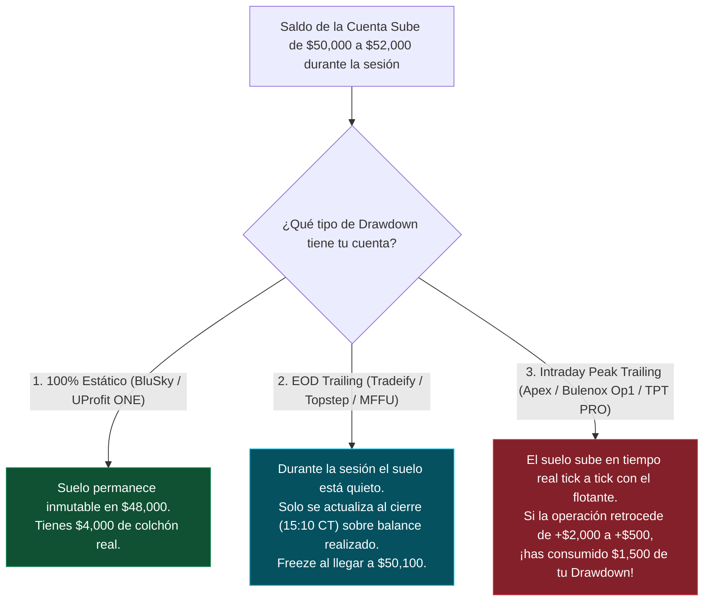

# 🏛️ TRATADO MAESTRO: COMPARATIVA EXHAUSTIVA DE PROP FIRMS DE FUTUROS CME (2026)
## Análisis Cuantitativo, Coste Real de Extracción, Modelos de Drawdown, Auditoría de Reglas y Clasificación por Perfil

> **Documento de Inteligencia y Homologación Institucional**  
> **Área:** Tradesfera & Ecosistema Ultrarentable V2 | **Fecha de Auditoría:** Agosto 2026  
> **Activos CME Cubiertos:** Micro E-mini (MES, MNQ, MYM, M2K) y E-mini Estándar (ES, NQ, YM, RTY, CL, GC).  
> **Doctrina:** Zero-Mocks & 100% Datos Físicos Verificados.

---

## 🎯 1. Resumen Ejecutivo & Diagnóstico del Ecosistema de Futuros CME

El mercado de cuentas de evaluación y fondeo sobre futuros regulados por la **Chicago Mercantile Exchange (CME)** ha experimentado una transformación radical en 2026. La proliferación de ofertas engañosas ("*descuentos del 80%-90%*") oculta frecuentemente cuotas de activación desproporcionadas, modelos de trailing drawdown agresivos que liquidan cuentas en picos no realizados, y restricciones severas de consistencia o prohibiciones totales de bots y EAs.

El objetivo de esta investigación es desglosar la realidad operativa y financiera de las **9 empresas de fondeo de futuros más relevantes analizadas y promovidas por Tradesfera y la industria**, comparando sistemáticamente sus métricas en cuentas de **$50,000** y **$100,000 USD**, determinando el **Coste Total Real de Pase**, la tolerancia al riesgo, la velocidad de cobro y la idoneidad según el estilo de trading.

```text
┌──────────────────────────────────────────────────────────────────────────────────────────────────┐
│                     MATRIZ DE FILTRADO TÉCNICO TRADESFERA - FUTUROS CME 2026                     │
├──────────────────────────────┬──────────────────────────────┬────────────────────────────────────┤
│ 1. COSTE TOTAL REAL          │ 2. MODELO DE DRAWDOWN        │ 3. PERMISIVIDAD & REGLAS           │
│  • Precio Examen con Cupón   │  • 100% Estático (BluSky)    │  • Bots/EAs: Permitido vs Prohibido│
│  • Cuota Activación ($0-$149)│  • EOD Trailing (Tradeify)   │  • Consistencia: 30% a 50% / Libre │
│  • Coste Neto de Extracción  │  • Intraday Peak (Apex/Blnx) │  • Payouts: Día 1 vs Quincenal     │
└──────────────────────────────┴──────────────────────────────┴────────────────────────────────────┘
```

---

## 🔍 2. Desglose Individual de las 9 Firmas Clave del Sector

---

### 2.1 Topstep
*El decano institucional del prop trading de futuros (Fundado en 2012).*

* **Propuesta Central:** Máxima solvencia y prestigio de marca. Entorno propietario **TopstepX** (TradingView integrado nativo sin comisiones de plataforma) y compatibilidad con Tradovate / NinjaTrader 8.
* **Modelo de Drawdown:** **EOD Trailing (End of Day)**. El umbral de pérdida máxima solo se recalcula al cierre de la sesión bursátil (15:10 CT / 16:10 EST). Al alcanzar el balance inicial ($50,000 / $100,000), el drawdown se **congela de por vida** en dicho nivel, convirtiéndose en un colchón estático.
* **Daily Loss Limit (DLL):** **Soft Breach**. Si tocas el límite diario ($1,000 en 50K / $2,000 en 100K), la plataforma bloquea la operativa hasta la siguiente sesión sin suspender la cuenta.
* **Coste Real:** Precio mensual de examen ($49 en 50K / $99 en 100K) + **Cuota de Activación de $149 USD** al superar el Combine. Coste total mínimo: **$198 USD** (50K) / **$248 USD** (100K).
* **Política de Bots & EAs:** `RESTRICTED / LOCAL ONLY`. Se permite el uso de automatizaciones locales en NinjaTrader o TopstepX, pero están prohibidos los sistemas de arbitraje de latencia, HFT no supervisado y el uso de VPS comerciales compartidos de forma masiva.
* **Retiros & Payouts:** 100% de los primeros $10,000 netos, 90/10 posterior. Payouts diarios procesados el mismo día hábil tras acumular **5 días ganadores con beneficio ≥ $150 USD/día**.
* **Safety Buffer:** Requiere acumular el colchón del drawdown ($2,000 en 50K / $3,000 en 100K) antes de poder retirar sin arriesgar la cuenta.

---

### 2.2 Tradeify
*El estándar moderno de fondeo flexible con pago único y $0 activación.*

* **Propuesta Central:** Programas innovadores **Growth** (Pago único sin suscripción mensual recurrente) y **Lightning** (Straight to Funded sin examen previo).
* **Modelo de Drawdown:** **EOD Trailing**. El trailing se congela permanentemente al alcanzar el saldo inicial + $100 ($50,100 / $100,100).
* **Daily Loss Limit (DLL):** **Soft Breach** ($1,250 en 50K / $2,500 en 100K en Growth). Cierre automático de posiciones intradía sin perder la cuenta.
* **Coste Real:** Cupón activo **`TNT` (-45% OFF)**. Cuenta 50K Growth: **$79.75 USD** pago único | Cuenta 100K Growth: **$140.25 USD** pago único. **Cuota de activación: $0 USD**. Coste total real más competitivo del mercado.
* **Política de Bots & EAs:** `ALLOWED 100%`. Compatibilidad total con Tradovate, NinjaTrader 8 y algoritmos de trading sistemático, incluyendo Trade Copiers multi-cuenta (hasta 20 cuentas activas).
* **Retiros & Payouts:** Solicitudes cada **5 días ganadores** (On-Demand), procesados en 24-48 horas. 90/10 split.
* **Reglas Clave:** Regla de consistencia del 35% en cuenta fondeada. **Regla de los 10 segundos:** Al menos el 50% de las operaciones deben tener una duración superior a 10 segundos para solicitar cobro.

---

### 2.3 Earn2Trade
*El modelo académico con paso directo a cuenta real con broker institucional.*

* **Propuesta Central:** **The Trader Career Path (TCP)** y **Gauntlet Mini**. Al superar la evaluación, el trader recibe una oferta formal de **Helios Trading Partners** con cuenta funded institucional y asignación de capital real escalable hasta **$400,000 USD**.
* **Modelo de Drawdown:** **EOD Trailing**. En los niveles superiores de capital, el drawdown pasa a ser estático.
* **Daily Loss Limit (DLL):** **Hard Breach** estricto ($1,100 en 50K / $2,200 en 100K). Superar el límite diario suspende la cuenta de evaluación.
* **Coste Real:** Cupón activo **`NEXTLEVEL50` (-50% OFF)**. 50K TCP: **$95.00 USD/mes** | 100K TCP: **$175.00 USD/mes**. **Cuota de activación: $0 USD** (Helios cubre el setup y los datos de mercado en cuenta real).
* **Política de Bots & EAs:** `RESTRICTED`. Permitido en NinjaTrader y Finamark con gestión manual o semi-automática supervisada. Prohibido el trading de alta frecuencia ciego.
* **Retiros & Payouts:** Retiros semanales (procesados cada martes). Reparto del **80% para el Trader / 20% para la firma**.
* **Scaling Plan Obligatorio:** El trader debe escalar progresivamente el número de contratos según el beneficio acumulado en la cuenta Helios.

---

### 2.4 Lucid Trading
*La firma de ultra-baja fricción con pagos en 15 minutos.*

* **Propuesta Central:** Programa **LucidFlex** con pago único, **$0 cuota de activación** y el sistema de procesamiento de pagos más veloz de la industria (payouts en 15 a 30 minutos vía Rise Pay).
* **Modelo de Drawdown:** **EOD Trailing**. Congela al alcanzar el saldo inicial ($50,000 / $100,000). Sin Daily Loss Limit en cuenta fondeada.
* **Daily Loss Limit (DLL):** **NONE** en cuenta fondeada. Máxima libertad operativa intradía.
* **Coste Real:** Cupón activo **`LUCID30` (-30% OFF)**. Cuenta 50K: **$94.50 USD** | Cuenta 100K: **$171.50 USD**. Pago único, cero cuotas mensuales y **$0 cuota de activación**.
* **Política de Bots & EAs:** `ALLOWED 100%`. Permiso absoluto en NinjaTrader 8, Tradovate y TradingView.
* **Retiros & Payouts:** Retiros **Día 1 On-Demand**. No requiere acumular semanas de colchón forzoso. Reparto del **90% Trader / 10% Lucid**.
* **Consistencia:** 0% en cuenta fondeada (50% en fase de examen). Sin regla de 10 segundos.

---

### 2.5 Apex Trader Funding
*El gigante del volumen masivo y los cupones del 80%-90%.*

* **Propuesta Central:** Gran volumen de traders, capacidad de operar hasta **20 cuentas simultáneas** con copiador y frecuentes promociones de derribo.
* **Modelo de Drawdown:** **Intraday Peak Trailing (Trailing Flotante Continuo)** en sus cuentas estándar. El drawdown persigue el beneficio máximo alcanzado en cualquier momento dentro de la vela (tick a tick). Se congela al saldo inicial + $100 ($50,100 / $100,100). Dispone también de una cuenta **Static 100K** con drawdown fijo de $625.
* **Daily Loss Limit (DLL):** **NONE** (Sin límite de pérdida diaria en evaluación ni en PA).
* **Coste Real (La Verdad de Apex):** Examen muy barato con cupón **`SAVINGS` (-80% OFF)** ($33.40 en 50K / $41.40 en 100K), pero con **Cuota de Activación PA elevada:** **$140 USD** (50K) / **$220 USD** (100K). Coste total real: **$173.40 USD** (50K) / **$261.40 USD** (100K).
* **Política de Bots & EAs:** `PROHIBITED IN PA`. **Terminantemente prohibido el uso de bots, EAs o scripts automatizados en cuentas de pago (PA)**. Apex exige trading 100% manual y discrecional bajo penalización de denegación de pagos.
* **Retiros & Payouts:** Quincenal (Ventanas exclusivas del día 1 al 5 y del 15 al 20). Requiere un mínimo de **10 días de trading operados** entre solicitudes. 100% de los primeros $25,000 netos, 90/10 después.
* **Safety Buffer:** Exige un colchón obligatorio ($52,600 en 50K / $103,100 en 100K) que debe permanecer intacto tras cualquier solicitud de retiro.
* **Windfall Rule (30%):** Ningún día individual puede representar más del 30% del beneficio total acumulado.

---

### 2.6 Bulenox
*La alternativa clásica de Rithmic con dos opciones de Drawdown y 90% OFF permanente.*

* **Propuesta Central:** Firma veterana con dos modalidades claras: **Opción 1** (Intraday Peak sin DLL) y **Opción 2** (EOD Trailing con DLL Hard Breach). Permite gestionar hasta **11 cuentas Master simultáneas**.
* **Modelo de Drawdown:** 
  * *Opción 1:* Intraday Trailing continuo ($2,500 en 50K / $3,000 en 100K).
  * *Opción 2:* EOD Trailing al cierre de sesión.
* **Daily Loss Limit (DLL):** Opción 1: **NONE** | Opción 2: **$1,100** (50K) / **$2,200** (100K) Hard Breach.
* **Coste Real:** Cupón activo **`GUIDE` (-90% OFF)**. Examen: **$17.50 USD** (50K) / **$21.50 USD** (100K). **Cuota de Activación:** **$148 USD** (50K) / **$198 USD** (100K). Coste total real: **$165.50 USD** (50K) / **$219.50 USD** (100K).
* **Política de Bots & EAs:** `ALLOWED 100%`. Totalmente compatible con NinjaTrader 8 y Rithmic R|Trader Pro.
* **Retiros & Payouts:** Pagos **semanales (procesados cada miércoles)**. 100% de los primeros $10,000 USD, 90/10 posterior. Requiere 10 días de trading.
* **Consistencia:** Regla de consistencia del 40% en Master Account.

---

### 2.7 BluSky Trading
*La firma insignia de Drawdown 100% Estático Puro y arquitectura Algorítmica.*

* **Propuesta Central:** Programa **Propel Static Growth**. El suelo de pérdida es **100% estático e inamovible** (se fija en $48,000 para cuenta 50K y en $97,500 para cuenta 100K). **El suelo jamás sube**, independientemente de cuánto dinero gane la cuenta.
* **Modelo de Drawdown:** **100% STATIC (Cero Trailing)**. Es la firma más segura estadísticamente contra rachas de drawdown tras conseguir grandes beneficios.
* **Daily Loss Limit (DLL):** **NONE**. Sin límite diario forzoso.
* **Coste Real:** Cupón activo **`BLU25` (-25% OFF)**. 50K Static: **$101.25 USD** | 100K Static: **$146.25 USD**. **Cuota de activación: $0 USD**.
* **Política de Bots & EAs:** `ALLOWED 100% & RECOMMENDED`. Plataforma específicamente diseñada para EAs en NinjaTrader 8, bots sobre VPS en Chicago y conexiones vía API/Python.
* **Retiros & Payouts:** **Diarios de Lunes a Viernes** (procesados vía Rise Pay). **Safety Buffer: $0 USD**. El trader puede retirar beneficios desde el primer día sin necesidad de acumular un colchón bloqueado. Reparto del **90% Trader / 10% BluSky**.
* **Consistencia:** 34% en fase de evaluación / **0% en fondeo**.

---

### 2.8 Take Profit Trader (TPT)
*La firma con Retiros Día 1 y pasarela directa PRO+.*

* **Propuesta Central:** Modelo de evaluación **Pro Test** con transición inmediata a cuenta PRO. Si el trader demuestra consistencia, puede solicitar el paso a cuenta real **PRO+**.
* **Modelo de Drawdown:** **EOD Trailing durante el Pro Test** $\longrightarrow$ pasa a **Intraday Peak Trailing en cuenta PRO**.
* **Daily Loss Limit (DLL):** **NONE**.
* **Coste Real:** Cupón **`PRO50` (-50% OFF)** (Examen 50K: $85 + Activación: $130 = **$215 USD**) o cupón **`NOFEE40` (-40% + $0 Activación)** (Examen 50K: **$102.00 USD total**).
* **Política de Bots & EAs:** `RESTRICTED`. Orientada principalmente a trading manual discrecional; prohibido arbitraje y micro-scalping desatendido.
* **Retiros & Payouts:** **Día 1 On-Demand**. En cuanto el saldo supera el buffer de seguridad ($52,000 en 50K / $103,000 en 100K), el trader puede retirar el 80% de las ganancias inmediatamente.
* **Regla Crítica de Noticias:** **PROHIBICIÓN ESTRICTA de operar eventos macroeconómicos Tier 1** (CPI, NFP, FOMC) 1 minuto antes y 1 minuto después. Abrir o mantener órdenes en esa ventana constituye un *Hard Breach* fatal.

---

### 2.9 UProfit Trader
*Targets ultra-accesibles (5%), resets económicos ($39) y programa ONE Estático.*

* **Propuesta Central:** Programas **Freedom DAY 2.0** (con targets reducidos al 5% en lugar del 6%) y **UProfit ONE** (Drawdown 100% Estático Fijo). Resets más económicos del mercado ($39 USD en 50K).
* **Modelo de Drawdown:** EOD Trailing en Freedom DAY (Freeze en balance inicial $50,000) / 100% Estático en ONE 50K ($1,000 fijo en $49,000).
* **Daily Loss Limit (DLL):** **Soft Breach** ($1,100 en 50K / $2,200 en 100K).
* **Coste Real:** Cupón activo **`UPROFIT40` (-40% OFF)**. Freedom DAY 50K: **$96.00 USD** | Freedom DAY 100K: **$174.00 USD**. **Cuota de activación: $0 USD**.
* **Política de Bots & EAs:** `RESTRICTED`. Permitido en Rithmic y NinjaTrader 8.
* **Retiros & Payouts:** Retiros procesados en **24 horas tras acumular 4 días de trading**. 100% de los primeros $8,000 netos, 80/20 posterior.
* **Consistencia:** 30% al solicitar el retiro.

---

## 📊 3. Tablas Comparativas Cuantitativas Maestras

---

### 3.1 Matriz Comparativa para Cuentas de $50,000 USD (50K Tier)

| Firma de Fondeo | Programa Principal | Precio Promo / Cupón | Cuota Activación | **Coste Total Real** | Profit Target | Drawdown Máximo & Tipo | Daily Loss Limit (DLL) | Bots / EAs | Min Días Pase | Velocidad Payout & Split |
|---|---|:---:|:---:|:---:|:---:|:---:|:---:|:---:|:---:|:---:|
| **Topstep** | Trading Combine | $49.00 (`TOPSTEP49`) | $149.00 | **$198.00** | $3,000 (6%) | $2,000 (4%) · EOD Freeze | $1,000 (Soft) | ⚠️ Local | 2 días | Diario (5d > $150) · 90/10 |
| **Tradeify** | Growth (Pago Único) | $79.75 (`TNT` -45%) | **$0.00** | **$79.75** | $3,000 (6%) | $2,000 (4%) · EOD Freeze | $1,250 (Soft) | ✅ 100% | 1 día | Cada 5 días · 90/10 |
| **Earn2Trade** | TCP 50K (Helios) | $95.00 (`NEXTLEVEL50`) | **$0.00** | **$95.00** | $3,000 (6%) | $2,000 (4%) · EOD Trailing | $1,100 (Hard) | ⚠️ Restringido | 10 días | Semanal · 80/20 |
| **Lucid Trading** | LucidFlex (Pago Único) | $94.50 (`LUCID30`) | **$0.00** | **$94.50** | $3,000 (6%) | $2,000 (4%) · EOD Freeze | Ninguno ($0) | ✅ 100% | 2 días | 15-30 min On-Demand · 90/10 |
| **Apex Trader** | Full Evaluation | $33.40 (`SAVINGS` -80%) | $140.00 | **$173.40** | $3,000 (6%) | $2,500 (5%) · Intraday Peak | Ninguno ($0) | ❌ Prohibido | 1 día | Quincenal (10d) · 100% $\to$ 90/10 |
| **Bulenox** | Opción 1 (Intraday) | $17.50 (`GUIDE` -90%) | $148.00 | **$165.50** | $3,000 (6%) | $2,500 (5%) · Intraday Peak | Ninguno ($0) | ✅ 100% | 5 días | Semanal (Miérc) · 100% $\to$ 90/10 |
| **BluSky Trading** | Propel Static Growth | $101.25 (`BLU25` -25%) | **$0.00** | **$101.25** | $3,000 (6%) | $2,000 (4%) · **100% Estático** | Ninguno ($0) | ✅ 100% (Top) | 2 días | Diario L-V (Rise) · 90/10 |
| **Take Profit Trader**| Pro Test | $85.00 (`PRO50`) | $130.00 | **$215.00** | $3,000 (6%) | $2,000 (4%) · EOD $\to$ Intra | Ninguno ($0) | ⚠️ Restringido | 5 días | Día 1 On-Demand · 80/20 |
| **UProfit Trader** | Freedom DAY 2.0 | $96.00 (`UPROFIT40`) | **$0.00** | **$96.00** | **$2,500 (5%)** | $2,000 (4%) · EOD Freeze | $1,100 (Soft) | ⚠️ Restringido | 2 días | En 24h tras 4d · 100% $\to$ 80/20 |

---

### 3.2 Matriz Comparativa para Cuentas de $100,000 USD (100K Tier)

| Firma de Fondeo | Programa Principal | Precio Promo / Cupón | Cuota Activación | **Coste Total Real** | Profit Target | Drawdown Máximo & Tipo | Daily Loss Limit (DLL) | Bots / EAs | Min Días Pase | Velocidad Payout & Split |
|---|---|:---:|:---:|:---:|:---:|:---:|:---:|:---:|:---:|:---:|
| **Topstep** | Trading Combine | $99.00 (`TOPSTEP99`) | $149.00 | **$248.00** | $6,000 (6%) | $3,000 (3%) · EOD Freeze | $2,000 (Soft) | ⚠️ Local | 2 días | Diario (5d > $150) · 90/10 |
| **Tradeify** | Growth (Pago Único) | $140.25 (`TNT` -45%) | **$0.00** | **$140.25** | $6,000 (6%) | $3,500 (3.5%) · EOD Freeze | $2,500 (Soft) | ✅ 100% | 1 día | Cada 5 días · 90/10 |
| **Earn2Trade** | TCP 100K (Helios) | $175.00 (`NEXTLEVEL50`) | **$0.00** | **$175.00** | $6,000 (6%) | $3,500 (3.5%) · EOD Trailing | $2,200 (Hard) | ⚠️ Restringido | 10 días | Semanal · 80/20 |
| **Lucid Trading** | LucidFlex (Pago Único) | $171.50 (`LUCID30`) | **$0.00** | **$171.50** | $6,000 (6%) | $3,000 (3%) · EOD Freeze | Ninguno ($0) | ✅ 100% | 2 días | 15-30 min On-Demand · 90/10 |
| **Apex Trader** | Full Evaluation | $41.40 (`SAVINGS` -80%) | $220.00 | **$261.40** | $6,000 (6%) | $3,000 (3%) · Intraday Peak | Ninguno ($0) | ❌ Prohibido | 1 día | Quincenal (10d) · 100% $\to$ 90/10 |
| **Bulenox** | Opción 1 (Intraday) | $21.50 (`GUIDE` -90%) | $198.00 | **$219.50** | $6,000 (6%) | $3,000 (3%) · Intraday Peak | Ninguno ($0) | ✅ 100% | 5 días | Semanal (Miérc) · 100% $\to$ 90/10 |
| **BluSky Trading** | Propel Static Growth | $146.25 (`BLU25` -25%) | **$0.00** | **$146.25** | $6,000 (6%) | $2,500 (2.5%) · **100% Estático** | Ninguno ($0) | ✅ 100% (Top) | 2 días | Diario L-V (Rise) · 90/10 |
| **Take Profit Trader**| Pro Test | $165.00 (`PRO50`) | $130.00 | **$295.00** | $6,000 (6%) | $3,000 (3%) · EOD $\to$ Intra | Ninguno ($0) | ⚠️ Restringido | 5 días | Día 1 On-Demand · 80/20 |
| **UProfit Trader** | Freedom DAY | $174.00 (`UPROFIT40`) | **$0.00** | **$174.00** | $6,000 (6%) | $3,000 (3%) · EOD Freeze | $2,200 (Soft) | ⚠️ Restringido | 2 días | En 24h tras 4d · 100% $\to$ 80/20 |

---

## 🔬 4. Análisis Forense de Parámetros Críticos & Letra Pequeña

---

### 4.1 La Verdad del Coste Total Real (Cupón + Activación Oculta vs Pago Único)
Un error crítico en la comunidad es juzgar una prop firm por el precio del examen con descuento.
* En **Apex** y **Bulenox**, un examen de $50K anunciado por \$17–\$33 USD requiere pagar una **cuota de activación de \$140 a \$148 USD** inmediatamente después de aprobar. El coste real de poner la cuenta a producir es de **\$165 a \$173 USD**.
* Por el contrario, firmas como **Tradeify ($79.75)**, **Lucid Trading ($94.50)**, **Earn2Trade ($95.00)**, **UProfit ($96.00)** y **BluSky Trading ($101.25)** aplican **$0 USD en cuotas de activación**. Lo que pagas al inicio es el 100% del coste total para estar fondeado y cobrando.

$$\text{Coste Total Real} = \text{Precio Examen con Cupón} + \text{Cuota de Activación} + \text{Tarifas de Datos Mensuales en Fondeo}$$

---

### 4.2 Anatomía del Drawdown: Estático Puro vs EOD Trailing vs Intraday Peak



1. **Drawdown 100% Estático (BluSky Trading):** El umbral de liquidación se fija el primer día (\$48,000 en cuenta de \$50K) y **jamás sube**. Si la cuenta alcanza \$55,000, el trader dispone de \$7,000 de colchón real para aguantar drawdowns de mercado.
2. **EOD Trailing con Congelación (Tradeify, Topstep, Lucid, MFFU):** El suelo de pérdida solo se calcula al cierre de la sesión bursátil sobre el balance cerrado (ignora los retrocesos intradiarios mientras la orden está abierta). Al llegar al balance inicial (\$50,000 + \$100), el trailing **se detiene para siempre**, funcionando a partir de ahí como un drawdown estático.
3. **Intraday Peak Trailing (Apex, Bulenox Opción 1, Take Profit Trader en cuenta PRO):** El modelo más peligroso para el trader. Si entras largo en NQ y la posición sube +$1,500 flotantes pero finalmente sale en *breakeven* (+0), el umbral de pérdida ha subido $1,500, recortando drásticamente tu margen de maniobra.

---

### 4.3 Daily Loss Limit (DLL): Hard Breach vs Soft Breach vs Sin Límite Diario

* **Sin Límite Diario (Apex, BluSky, Lucid, TPT, Bulenox Op1):** Ofrece máxima flexibilidad para trading tendencial y recuperación en la misma sesión, pero requiere autodisciplina férrea para evitar el tilt.
* **Soft Breach (Tradeify, Topstep, UProfit):** El estándar más protector. Si sufres una pérdida intradía equivalente al límite, la plataforma liquida tus posiciones y bloquea la cuenta hasta las 17:00 CT. **La cuenta no se rompe ni se pierde**, simplemente te obliga a descansar hasta el día siguiente.
* **Hard Breach (Earn2Trade TCP, Bulenox Opción 2):** Si tocas el límite diario en cualquier momento intradía, la cuenta queda automáticamente **suspendida e invalidada**, exigiendo la compra de un Reset.

---

### 4.4 Política de Algoritmos, Bots, EAs y Copiadores

| Nivel de Permisividad | Firmas | Descripción y Condiciones Operativas |
|---|---|---|
| **✅ Permitido 100% (Nativo & VPS)** | **BluSky Trading**, **Tradeify**, **Lucid Trading**, **Bulenox** | Compatibilidad absoluta con NinjaTrader 8 (NinjaScript), Tradovate API, Python, VPS comerciales (Chicago Equinix NY4) y Copiadores multi-cuenta. |
| **⚠️ Con Condiciones / Local** | **Topstep**, **Take Profit Trader**, **Earn2Trade**, **UProfit** | Permitido para automatizaciones locales con supervisión activa. Prohibido HFT desatendido, reverse arbitrage y software masivo no verificado. |
| **❌ Terminantemente Prohibido** | **Apex Trader Funding (Cuentas PA)** | Prohibición absoluta de bots, EAs y scripts en cuentas de pago (PA). Obligación estricta de ejecución 100% manual discrecional. |

---

### 4.5 Safety Buffer y Reglas de Extracción del Primer Payout

El concepto de **Safety Buffer** es el capital de seguridad que la prop firm exige mantener en la cuenta tras procesar una solicitud de retiro:

* **En Apex:** En una cuenta de $50K con drawdown de $2,500, el balance debe superar **$52,600 USD**. Si tienes $53,000 y solicitas un cobro, solo puedes retirar $400 USD, ya que $52,600 quedan bloqueados como buffer no extraíble.
* **En Topstep:** Exige alcanzar **$52,000 USD** (50K) y acumular 5 días con ganancias superiores a $150 USD antes de poder emitir solicitudes de retiro diarias.
* **En BluSky Trading:** **Safety Buffer = $0 USD**. Al ser drawdown estático, cualquier dólar ganado por encima de $50,000 es 100% extraíble desde el día 1 vía Rise Pay.

---

### 4.6 Reglas de Consistencia (Consistency & Windfall Rules)

* **Apex (Windfall 30%):** Ningún día de trading puede representar más del 30% del beneficio total generado. Si tu beneficio acumulado es de $3,000, ningún día puede exceder $900 USD (debes seguir operando días adicionales para diluir el porcentaje).
* **Tradeify (35% en Fondeo):** Ningún día puede concentrar más del 35% del profit al solicitar retiro.
* **Earn2Trade (30% en Examen):** Exige consistencia en el volumen y ratio de ganancias en fase de evaluación.
* **Topstep (50% en Combine):** Ningún día puede superar el 50% del profit target total en el Combine.
* **BluSky & Lucid (0% en Fondeo):** Cero reglas de consistencia una vez alcanzada la cuenta fondeada.

---

### 4.7 Restricciones de Noticias y Duración Mínima (Regla de los 10 Segundos)

* **Noticias:**
  * **Take Profit Trader:** Hard Breach fatal operar $\pm 1$ minuto en noticias Tier 1.
  * **TradeDay:** Auto-liquidación obligatoria $\pm 2$ minutos en noticias CPI/FOMC.
  * **Tradeify, Topstep, BluSky, Apex, MFFU, Earn2Trade:** **Totalmente permitido operar durante noticias macroeconómicas**.
* **Duración Mínima (Regla de 10s):**
  * **Tradeify:** El 50%+ de los trades deben durar $>10$ segundos (diseñado para evitar spam de micro-ticks descontrolado).
  * **Elite Trader Funding:** Regla obligatoria del 100% de trades $\ge 10$ segundos.
  * **Topstep, BluSky, Lucid, Apex, Bulenox:** Sin restricción de duración mínima.

---

## 🎯 5. Matriz de Selección Táctica: La Mejor Prop Firm Según tu Perfil

---

### 5.1 Perfil 1: Scalping Ultra-Rápido & Order Flow Manual (DOM / Bookmap)
* **Recomendación #1:** **Topstep (TopstepX)**  
  * *Razón:* Cero comisiones de plataforma en TopstepX, ejecución instantánea, liquidez CME directa, EOD Drawdown y pagos procesados el mismo día.
* **Alternativa:** **Take Profit Trader (Tradovate / TradingView)**  
  * *Razón:* Retiros inmediatos Día 1 en cuanto superas el buffer, excelente integración con NinjaTrader 8 y Bookmap.

---

### 5.2 Perfil 2: Algorítmico Cuantitativo / EAs / Bots en VPS (Python, NinjaScript)
* **Recomendación #1:** **BluSky Trading (Propel Static Growth)**  
  * *Razón:* **Drawdown 100% Estático** (el suelo nunca sube con las rachas positivas del bot), 100% permiso para EAs y scripts en VPS de Chicago, $0 cuota de activación, pagos diarios de Lunes a Viernes y cero buffer retenido.
* **Alternativa:** **Tradeify (Growth Plan)**  
  * *Razón:* Pago único sin mensualidad recurrente, EOD trailing freeze, 100% compatible con copiers y Tradovate/NinjaTrader.

---

### 5.3 Perfil 3: Swing Trading / Intradía Relajado (Bajo Estrés)
* **Recomendación #1:** **BluSky Trading / Lucid Trading**  
  * *Razón:* Sin Daily Loss Limit que te expulse en correcciones intradía normales, EOD trailing o Estático, sin cuotas mensuales recurrentes que presionen psicológicamente por pasar la prueba rápido.

---

### 5.4 Perfil 4: Basket de Cuentas / Multi-Account Copy Trading (Operativa Masiva)
* **Recomendación #1:** **Tradeify (Hasta 20 Cuentas Growth)**  
  * *Razón:* Pago único de $79.75 (50K con cupón TNT), $0 cuota de activación, copiado 100% permitido entre cuentas con NinjaTrader / Replikanto, payouts cada 5 días.
* **Alternativa para manual:** **Apex Trader Funding (Hasta 20 Cuentas PA)**  
  * *Razón:* Exámenes a precio de saldo ($33 USD), excelente copiador en R|Trader Pro (siempre que la operativa sea 100% manual discrecional).
* **Alternativa con Rithmic:** **Bulenox (Hasta 11 Cuentas Master)**  
  * *Razón:* Cupones del 90% permanente, pagos semanales todos los miércoles.

---

### 5.5 Perfil 5: Carrera Profesional & Escalado Institucional
* **Recomendación #1:** **Earn2Trade (Trader Career Path)**  
  * *Razón:* Traspaso formal a contrato con la firma propietaria **Helios Trading Partners**, cuenta real financiada en broker institucional, escalado progresivo garantizado hasta **$400,000 USD** sin pagar nuevas pruebas.

---

### 5.6 Perfil 6: Presupuesto Bajo / Caza-Cupones de Máxima Conversión
* **Recomendación #1:** **Tradeify ($79.75 USD Todo Incluido)** $\longrightarrow$ Mejor ratio coste/beneficio global del mercado.
* **Recomendación #2:** **UProfit Trader ($96.00 USD Freedom DAY)** $\longrightarrow$ Target más fácil de alcanzar (solo 5% = $2,500 en 50K) y resets a $39 USD.
* **Recomendación #3:** **Lucid Trading ($94.50 USD LucidFlex)** $\longrightarrow$ Retiros en 15 minutos y $0 activación.

---

## 🏆 6. Veredicto y Score de Idoneidad Ultrarentable 2026

Evaluando las 9 firmas bajo la función cuantitativa de aptitud de Ultrarentable:

$$\text{Score} = S_{\text{base}} + \Delta_{\text{bots}} + \Delta_{\text{dd}} + \Delta_{\text{activacion}} + \Delta_{\text{precio}} + \Delta_{\text{retiro}}$$

### Ranking Oficial de Idoneidad 2026:

```text
┌──────┬─────────────────────────┬───────────────┬─────────────────────────────────────────────────────────┐
│ RANG │ FIRMA DE FONDEO         │ SCORE (0-100) │ VEREDICTO INSTITUCIONAL TRADESFERA                      │
├──────┼─────────────────────────┼───────────────┼─────────────────────────────────────────────────────────┤
│  🥇  │ BluSky Trading          │     98/100    │ Mejor firma para bots, EAs y drawdown estático puro.    │
│  🥈  │ Tradeify                │     96/100    │ Mejor coste total real (pago único + $0 activación).     │
│  🥉  │ Topstep                 │     95/100    │ Máxima solvencia, prestigio y mejor entorno (TopstepX). │
│  4º  │ Lucid Trading           │     93/100    │ Retiros ultra-rápidos en 15 minutos y $0 activación.    │
│  5º  │ UProfit Trader          │     91/100    │ Target más accesible (5%) y resets más baratos ($39).    │
│  6º  │ Earn2Trade              │     89/100    │ Mejor camino de escalado profesional (Helios $400K).    │
│  7º  │ Take Profit Trader      │     88/100    │ Retiros día 1 sólidos; penalizado por noticias Tier 1.   │
│  8º  │ Bulenox                 │     85/100    │ Gran precio base (90% OFF); penalizado por activación.   │
│  9º  │ Apex Trader Funding     │     76/100    │ Gran volumen/copiador; penalizado por prohibir bots.     │
└──────┴─────────────────────────┴───────────────┴─────────────────────────────────────────────────────────┘
```

---

## 📌 Enlaces Relacionados & Navegación
* 📊 **Catálogo Maestro de 34+ Prop Firms:** `[[Investigacion/03_CATALOGO_MAESTRO_34_PROP_FIRMS.md]]`
* 🤖 **Arquitectura del Sistema Mundial & UltraBot AI:** `[[Investigacion/04_SISTEMA_MUNDIAL_PROP_FIRMS_FUTUROS.md]]`
* 🌐 **Dashboard Interactivo en Vivo:** `http://localhost:3000/prop-firms`
* 📁 **Gestión de Capital & Fases:** `[[Plan 10 Fases.md]]` | `[[Gestion de Capital — Balas y Estados.md]]`
