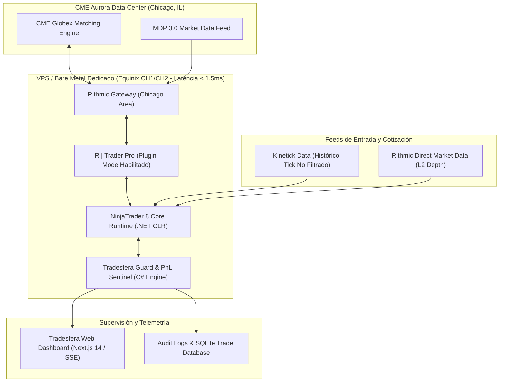
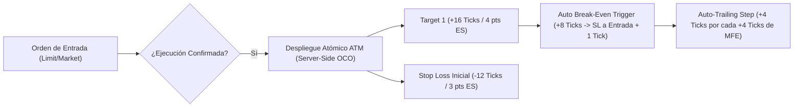
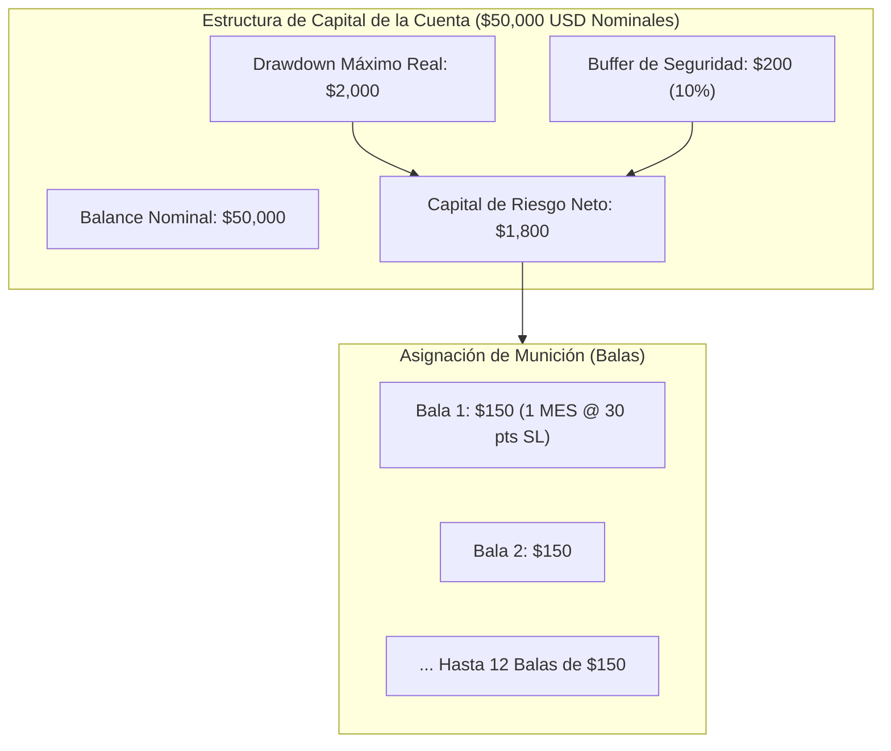
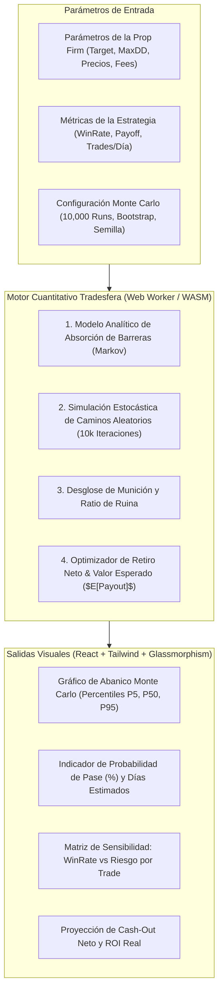

# 🛠️ INFRAESTRUCTURA TÉCNICA MAESTRA: NINJATRADER 8, DATAFEEDS Y SUITE DE CONTROL TRADESFERA

> **Tratado de Ingeniería de Sistemas y Manual de Operaciones para Futuros CME en Empresas de Fondeo (Prop Firms)**  
> **Proyecto:** 01 Ultrarentable · Ecosistema Tradesfera | **Fecha:** 26 de Agosto de 2026 | **Versión:** 1.0.0  
> **Plataformas Cubiertas:** NinjaTrader 8 (x64), Rithmic R | Trader Pro, Kinetick, Tradovate, CQG/Continuum  
> **Activos CME Regulados:** Micro E-mini & E-mini S&P 500 (`MES` / `ES`), Nasdaq 100 (`MNQ` / `NQ`), Dow Jones (`MYM` / `YM`), Russell 2000 (`M2K` / `RTY`), Crude Oil (`MCL` / `CL`), Gold (`MGC` / `GC`).

---

## 🎯 Navegación y Enlaces Bidireccionales
- 📌 **Ficha Maestra:** [[Ultrarentable]]
- 📊 **Catálogo Maestro de Prop Firms:** [[03_CATALOGO_MAESTRO_34_PROP_FIRMS.md]]
- 🤖 **Sistema de Futuros y UltraBot:** [[04_SISTEMA_MUNDIAL_PROP_FIRMS_FUTUROS.md]]
- 🗺️ **Plan de Ejecución Maestro:** [[PLAN_DE_EJECUCION_MAESTRO_ADAPTATIVO.md]]
- 🌐 **Dashboard Web en Ejecución:** `apps/web/app/prop-firms/page.tsx` | `apps/web/app/trading-desk/page.tsx`

---

## 📑 Tabla de Contenidos

1. [Topología de Red e Infraestructura de Hardware](#1-topología-de-red-e-infraestructura-de-hardware)
2. [Configuración Óptima y Hardening de NinjaTrader 8](#2-configuración-óptima-y-hardening-de-ninjatrader-8)
3. [Proveedores de Datos Institucionales y Ruteo: Kinetick vs Rithmic](#3-proveedores-de-datos-institucionales-y-ruteo-kinetick-vs-rithmic)
4. [Indicadores y Monitores NinjaScript de PnL en Tiempo Real](#4-indicadores-y-monitores-ninjascript-de-pnl-en-tiempo-real)
5. [Plantillas de Bankroll, Munición y Hojas de Control de Backtest](#5-plantillas-de-bankroll-munición-y-hojas-de-control-de-backtest)
6. [Especificación Técnica de la Calculadora de Bankroll y Varianza Tradesfera](#6-especificación-técnica-de-la-calculadora-de-bankroll-y-varianza-tradesfera)
7. [Contratos de Datos e Interfaces TypeScript (`tradesfera-calculator.ts`)](#7-contratos-de-datos-e-interfaces-typescript-tradesfera-calculatorts)
8. [Protocolos de Operación, Seguridad y Checklists de Despliegue](#8-protocolos-de-operación-seguridad-y-checklists-de-despliegue)

---

## 🌐 1. Topología de Red e Infraestructura de Hardware

Para operar con cuentas de evaluación y cuentas fondeadas (PA / Live Funded) en empresas de fondeo de futuros CME, la infraestructura técnica debe eliminar el riesgo de latencia desmedida, congelamiento de interfaz (*UI Freezes*), slippage excesivo en órdenes stop y descalificaciones involuntarias por fallos de red.



### 1.1 Especificaciones de Hardware Recomendadas

| Componente | Especificación Mínima (1-3 Cuentas) | Especificación de Producción (5-20 Cuentas / Copier) |
|---|---|---|
| **CPU** | Intel Core i7 12th Gen / AMD Ryzen 7 (8 núcleos / 16 hilos) | AMD EPYC 7003 Series / Intel Xeon Gold (16+ núcleos @ 4.0+ GHz boost) |
| **Memoria RAM** | 16 GB DDR4 3200 MHz | 32 GB - 64 GB DDR5 ECC (baja latencia para Market Replay masivo) |
| **Almacenamiento** | 500 GB NVMe PCIe 3.0 (Lectura > 2500 MB/s) | 1 TB - 2 TB NVMe PCIe 4.0/5.0 (Lectura > 7000 MB/s) |
| **Conexión de Red** | 300 Mbps Fibra Simétrica / Backup 5G LTE | 1 Gbps - 10 Gbps Puerto Dedicado en Datacenter (Tier 1 Uplink) |
| **Latencia CME** | $< 35\text{ ms}$ (Conexión residencial fibra) | $< 2.0\text{ ms}$ (VPS Chicago Equinix CH1/CH2/CH4) |
| **S.O.** | Windows 11 Pro 64-bit | Windows Server 2022 Datacenter Edition (Hardened) |

---

## ⚡ 2. Configuración Óptima y Hardening de NinjaTrader 8

NinjaTrader 8 es una plataforma de 64 bits basada en el framework Microsoft .NET CLR. Un rendimiento deficiente suele deberse a pausas de recolección de basura (*Garbage Collection*), saturación de memoria en el renderizado de gráficos y fragmentación de la base de datos local.

### 2.1 Ajustes del Motor y Memoria (Options & Performance)

1. **Configuración de Garbage Collection (GC) en `.config`:**
   Editar el archivo de configuración `NinjaTrader.exe.config` en el directorio de instalación (`C:\Program Files\NinjaTrader 8\bin64\`):
   ```xml
   <configuration>
     <runtime>
       <!-- Habilita Server Garbage Collection para distribuir la carga entre todos los núcleos de CPU -->
       <gcServer enabled="true" />
       <!-- Desactiva la compactación de Large Object Heap en cada ciclo para evitar micro-congelaciones -->
       <GCLargeObjectHeapCompactionMode enabled="1" />
       <!-- Habilita la ejecución concurrente de GC en segundo plano -->
       <gcConcurrent enabled="true" />
     </runtime>
   </configuration>
   ```

2. **Ajustes en la Interfaz de NinjaTrader 8 (`Tools > Options`):**
   - **General > Performance:**
     - `Optimize for slow connections`: **OFF** (en VPS / Fibra).
     - `Show news on connection`: **OFF** (elimina hilos innecesarios de UI).
     - `Auto-purge historical data`: **Configurar a 60 días** para evitar el crecimiento descontrolado de `NinjaTrader.sqlite`.
   - **Data > Historical:**
     - `Download data for news events`: **OFF**.
     - `Save chart drawing tools on template`: **ON**.
     - `Days to load on startup`: Limitar a **3 a 5 días** para gráficos de ejecución intradiaria; usar bases de datos secundarias para backtesting.
   - **General > Audio:**
     - Desactivar alertas de audio continuas para eventos de ticks repetitivos (evita bloqueos del subsistema de sonido de Windows).

3. **Mantenimiento y Compactación de la Base de Datos Histórica:**
   - Ubicación física de la base de datos: `%USERPROFILE%\Documents\NinjaTrader 8\db\NinjaTrader.sqlite`.
   - Ejecutar mensualmente desde NT8: `Tools > Database > Repair Database` y `Compact Database`.

### 2.2 Configuración de Gráficos y Renderizado GPU

- **Chart Data Series Optimization:**
  - Evitar cargar simultáneamente más de 20 indicadores basados en Ticks en el mismo panel de ejecución.
  - Para estrategias de ejecución rápida, usar **Data Series de 1 Minuto** o **Volume Bars (ej. 1000 Vol)** en lugar de *Unfiltered Tick* en ventanas de visualización, reservando el procesamiento tick por tick exclusivamente a los scripts de trading en segundo plano.
- **Hardware Acceleration:**
  - En entornos VPS sin GPU dedicada, forzar el renderizado por software en Direct2D para evitar caídas de DirectX:
    `Tools > Options > General > Display > Enable Hardware Acceleration = FALSE` (Solo en VPS virtuales sin GPU). En máquinas locales con NVIDIA/AMD: `Enable Hardware Acceleration = TRUE`.

### 2.3 Estrategias ATM (Advanced Trade Management) de Grado Profesional

Las órdenes en cuentas de fondeo **nunca deben colocarse sin un bracket ATM vinculado**. Si la conexión se interrumpe, los stop loss definidos en el servidor broker protegen el capital de la cuenta.



#### Parámetros ATM Estándar por Activo CME

| Parámetro ATM | Micro S&P (`MES`) / E-mini (`ES`) | Micro Nasdaq (`MNQ`) / E-mini (`NQ`) | Crude Oil (`MCL` / `CL`) | Gold (`MGC` / `GC`) |
|---|:---:|:---:|:---:|:---:|
| **Tick Size** | $0.25\text{ pts}$ (\$1.25 / \$12.50) | $0.25\text{ pts}$ (\$0.50 / \$5.00) | $0.01\text{ pts}$ (\$1.00 / \$10.00) | $0.10\text{ pts}$ (\$1.00 / \$10.00) |
| **Stop Loss Inicial** | 12 ticks ($3.0\text{ pts}$) | 40 ticks ($10.0\text{ pts}$) | 20 ticks ($0.20\text{ pts}$) | 20 ticks ($2.0\text{ pts}$) |
| **Target 1 (50% Posición)** | 16 ticks ($4.0\text{ pts}$) | 60 ticks ($15.0\text{ pts}$) | 30 ticks ($0.30\text{ pts}$) | 30 ticks ($3.0\text{ pts}$) |
| **Target 2 (Runner)** | 32 ticks ($8.0\text{ pts}$) | 120 ticks ($30.0\text{ pts}$) | 60 ticks ($0.60\text{ pts}$) | 60 ticks ($6.0\text{ pts}$) |
| **Break-Even Trigger** | +10 ticks | +30 ticks | +15 ticks | +15 ticks |
| **Break-Even Offset** | +1 tick | +2 ticks | +1 tick | +1 tick |
| **Trailing Step** | 4 ticks tras superar T1 | 12 ticks tras superar T1 | 8 ticks tras superar T1 | 8 ticks tras superar T1 |

---

## 📡 3. Proveedores de Datos Institucionales y Ruteo: Kinetick vs Rithmic

En el trading de prop firms, la elección del proveedor de datos define la calidad de la señal, la ausencia de velas deformadas y la estabilidad de las órdenes.

```text
┌──────────────────────────────────────────────────────────────────────────────────────────────────┐
│                     COMPARATIVA DE DATA FEEDS Y CAPAS DE CONECTIVIDAD                           │
├──────────────────────────┬─────────────────────────────────────┬─────────────────────────────────┤
│ CARACTERÍSTICA           │ KINETICK (End-of-Day & Real-Time)   │ RITHMIC (R | Trader Pro)        │
├──────────────────────────┼─────────────────────────────────────┼─────────────────────────────────┤
│ Protocolo / Transporte   │ TCP Feed propietario no filtrado    │ Protocolo Rithmic RApi+         │
│ Latencia Media CME       │ 40 ms - 90 ms                       │ 0.5 ms - 5 ms (Aurora Engine)   │
│ Market Depth (DOM L2)    │ Básico / Top of Book                │ Nivel 2 Completo (Depth Trader) │
│ Soporte Multi-Broker     │ Solo lectura / Datos de gráficos    │ Ejecución + Plugin Mode         │
│ Tick Replay de Nivel 2   │ Sí (Histórico limpio 100%)          │ Sí (Mediante R | Trader Pro)    │
│ Prop Firm Compatibility  │ No operativo para cuentas de fondeo │ Estándar CME (MFFU, Apex, TPT)  │
│ Caso de Uso Tradesfera   │ Backtesting & Alimentación Gráfica  │ Ejecución Real & Copier Rithmic │
└──────────────────────────┴─────────────────────────────────────┴─────────────────────────────────┘
```

### 3.1 Configuración de Rithmic con R | Trader Pro en "Plugin Mode"

Para conectar múltiples instancias de NinjaTrader 8, Trade Copiers locales (ej. Reeq, Apex Copier, Trade Copier NT8) y herramientas externas sin exceder el límite de sesiones concurrentes de CME:

1. **Abrir R | Trader Pro:**
   - **System:** `Rithmic Paper Trading` (para evaluaciones) o `Rithmic 01` (según la prop firm).
   - **Gateway:** `Chicago Area` (Obligatorio para la menor latencia con CME Globex).
   - **Opciones Críticas:**
     - Activar casilla: `Allow Plugins` = **CHECKED (ON)**.
     - Activar casilla: `Aggregate Positions` = **CHECKED (ON)**.
2. **Configuración en NinjaTrader 8 (`Connections > Configure > Rithmic for NinjaTrader 8`):**
   - **System:** Mismo sistema seleccionado en R | Trader Pro.
   - **Plugin mode:** **TRUE (CHECKED)**.
   - **Server:** `Chicago` o `Auto`.
   - Al marcar *Plugin Mode*, NinjaTrader se conecta al socket local abierto por R | Trader Pro (`127.0.0.1`), compartiendo la misma sesión de datos y ruteo de órdenes con coste cero de licencias adicionales de conexión CME.

### 3.2 Conexión Híbrida de Doble Proveedor en NinjaTrader 8

NinjaTrader 8 permite abrir simultáneamente **Kinetick** para la alimentación de gráficos históricos pesados y **Rithmic** exclusivamente para la ejecución de órdenes:
- Conexión 1: `Kinetick - Free` o `Kinetick Real-Time` $\longrightarrow$ Provee datos históricos profundos de 10+ años en índices y materias primas.
- Conexión 2: `Rithmic for NinjaTrader 8 (Plugin Mode)` $\longrightarrow$ Provee ruteo de órdenes y control de saldo intradía en tiempo real.

---

## 🛡️ 4. Indicadores y Monitores NinjaScript de PnL en Tiempo Real

Para blindar la cuenta ante violaciones de reglas en prop firms (como el **Daily Loss Limit**, el **Trailing Drawdown** dinámico o la **Consistency Rule**), se especifica a continuación el código C# del indicador institucional **`TradesferaRiskSentinel`** listo para compilar en NinjaTrader 8.

```csharp
#region Using declarations
using System;
using System.Collections.Generic;
using System.ComponentModel;
using System.ComponentModel.DataAnnotations;
using System.Windows.Media;
using System.Xml.Serialization;
using NinjaTrader.Cbi;
using NinjaTrader.Gui;
using NinjaTrader.Gui.Chart;
using NinjaTrader.Data;
using NinjaTrader.NinjaScript;
using NinjaTrader.Core.FloatingPoint;
using NinjaTrader.NinjaScript.DrawingTools;
#endregion

namespace NinjaTrader.NinjaScript.Indicators
{
    public class TradesferaRiskSentinel : Indicator
    {
        private double initialBalance = 50000.0;
        private double peakEquity = 50000.0;
        private double currentEquity = 50000.0;
        private double dailyRealizedPnL = 0.0;
        private double sessionStartEquity = 50000.0;
        private bool killSwitchTriggered = false;

        [NinjaScriptProperty]
        [Display(Name = "Capital Base de la Cuenta ($)", Description = "Balance inicial nominal de la cuenta de fondeo", Order = 1, GroupName = "1. Parámetros Prop Firm")]
        public double AccountBaseCapital { get; set; } = 50000.0;

        [NinjaScriptProperty]
        [Display(Name = "Límite de Pérdida Diaria ($)", Description = "Daily Loss Limit (DLL). Si se alcanza, se bloquea la operativa", Order = 2, GroupName = "1. Parámetros Prop Firm")]
        public double DailyLossLimit { get; set; } = 1000.0;

        [NinjaScriptProperty]
        [Display(Name = "Trailing Drawdown Máximo ($)", Description = "Distancia máxima de Drawdown permitida por la firma", Order = 3, GroupName = "1. Parámetros Prop Firm")]
        public double MaxTrailingDrawdown { get; set; } = 2000.0;

        [NinjaScriptProperty]
        [Display(Name = "Tipo de Trailing Drawdown", Description = "IntradayPeak, EndOfDay o Static", Order = 4, GroupName = "1. Parámetros Prop Firm")]
        public DrawdownModelType DrawdownModel { get; set; } = DrawdownModelType.IntradayPeak;

        [NinjaScriptProperty]
        [Display(Name = "Umbral de Alerta Temprana (%)", Description = "Porcentaje del Drawdown o DLL para disparar advertencia visual y sonora", Order = 5, GroupName = "2. Gestión de Riesgo")]
        public double WarningThresholdPct { get; set; } = 80.0;

        [NinjaScriptProperty]
        [Display(Name = "Auto-Cierre a Fin de Sesión (CME)", Description = "Cierra todas las posiciones a las 15:50 CT (16:50 EST)", Order = 6, GroupName = "2. Gestión de Riesgo")]
        public bool AutoFlattenAtSessionEnd { get; set; } = true;

        [NinjaScriptProperty]
        [Display(Name = "Hora de Cierre Forzado (HHmm en hora local)", Description = "Hora militar para aplanar posiciones antes del corte de mercado", Order = 7, GroupName = "2. Gestión de Riesgo")]
        public int FlattenTimeLocal { get; set; } = 1650;

        public enum DrawdownModelType
        {
            IntradayPeak,
            EndOfDay,
            Static
        }

        protected override void OnStateChange()
        {
            if (State == State.SetDefaults)
            {
                Description = "Tradesfera Real-Time Risk Sentinel & Prop Firm Enforcer";
                Name = "TradesferaRiskSentinel";
                Calculate = Calculate.OnPriceChange;
                IsOverlay = true;
                DisplayInDataBox = true;
                DrawHorizontalGridLines = false;
                DrawVerticalGridLines = false;
            }
            else if (State == State.DataLoaded)
            {
                peakEquity = AccountBaseCapital;
                currentEquity = AccountBaseCapital;
                sessionStartEquity = AccountBaseCapital;
            }
        }

        protected override void OnBarUpdate()
        {
            if (BarsInProgress != 0 || CurrentBar < 1)
                return;

            // 1. Obtener PnL de la cuenta vinculada
            if (Account != null)
            {
                currentEquity = Account.Get(AccountItem.CashValue, Currency.Usd) + Account.Get(AccountItem.GrossRealizedProfitLoss, Currency.Usd) + Account.Get(AccountItem.UnrealizedProfitLoss, Currency.Usd);
                dailyRealizedPnL = Account.Get(AccountItem.DailyRealizedProfitLoss, Currency.Usd) + Account.Get(AccountItem.UnrealizedProfitLoss, Currency.Usd);
            }
            else
            {
                // Modo simulación en gráfico
                currentEquity = AccountBaseCapital;
            }

            // 2. Actualizar Peak Equity para Trailing Drawdown
            if (currentEquity > peakEquity)
            {
                peakEquity = currentEquity;
            }

            // 3. Cálculo de métricas de drawdown
            double currentDrawdown = peakEquity - currentEquity;
            double currentDailyLoss = dailyRealizedPnL < 0 ? Math.Abs(dailyRealizedPnL) : 0.0;

            double ddUsedPct = (currentDrawdown / MaxTrailingDrawdown) * 100.0;
            double dllUsedPct = (currentDailyLoss / DailyLossLimit) * 100.0;

            // 4. Renderizado del Panel Visual en Pantalla (Heads-Up Display)
            string hudText = string.Format(
                "=== TRADESFERA RISK SENTINEL ===\n" +
                "Equity Actual: ${0:F2}\n" +
                "Peak Equity: ${1:F2}\n" +
                "Trailing DD: ${2:F2} / ${3:F2} ({4:F1}%)\n" +
                "Pérdida Diaria: ${5:F2} / ${6:F2} ({7:F1}%)\n" +
                "Colchón Restante: ${8:F2}\n" +
                "Estado: {9}",
                currentEquity,
                peakEquity,
                currentDrawdown,
                MaxTrailingDrawdown,
                ddUsedPct,
                currentDailyLoss,
                DailyLossLimit,
                dllUsedPct,
                Math.Max(0, MaxTrailingDrawdown - currentDrawdown),
                killSwitchTriggered ? "🚨 KILL SWITCH DISPARADO" : (ddUsedPct >= WarningThresholdPct || dllUsedPct >= WarningThresholdPct ? "⚠️ ADVERTENCIA DE RIESGO" : "🟢 SEGURO")
            );

            SimpleFont font = new SimpleFont("Consolas", 11);
            Brush textBrush = killSwitchTriggered ? Brushes.Red : (ddUsedPct >= WarningThresholdPct ? Brushes.Orange : Brushes.LightGreen);
            Draw.TextFixed(this, "TradesferaHUD", hudText, TextPosition.TopRight, textBrush, font, Brushes.Black, Brushes.DimGray, 85);

            // 5. Cierre forzado por horario de corte CME
            if (AutoFlattenAtSessionEnd)
            {
                int nowTime = ToTime(Time[0]);
                if (nowTime >= FlattenTimeLocal && Account != null)
                {
                    Account.Flatten(new[] { Instrument });
                    Draw.TextFixed(this, "TradesferaCutoff", "⏰ CIERRE AUTOMÁTICO DE SESIÓN CME APLICADO", TextPosition.BottomCenter, Brushes.Gold, font, Brushes.Black, Brushes.DarkGoldenrod, 90);
                }
            }

            // 6. Ejecución del Kill-Switch de Protección de Cuenta
            if ((ddUsedPct >= 95.0 || dllUsedPct >= 95.0) && !killSwitchTriggered)
            {
                killSwitchTriggered = true;
                if (Account != null)
                {
                    Account.Flatten(new[] { Instrument });
                    Account.CancelAllOrders(Instrument);
                }
                PlaySound(NinjaTrader.Core.Globals.InstallDir + @"\sounds\Alert2.wav");
            }
        }
    }
}
```

---

## 📊 5. Plantillas de Bankroll, Munición y Hojas de Control de Backtest

### 5.1 Estructura del Registro Exhaustivo de Backtest

El esquema canónico para tabular cada operación en hojas de control y bases de datos analíticas debe contener 16 campos esenciales para alimentar el motor de validación cuantitativa:

```text
┌──────────────────────────────────────────────────────────────────────────────────────────────────┐
│                   ESQUEMA DEL REGISTRO CANÓNICO DE BACKTEST (TRADESFERA TRADE LOG)               │
├─────┬──────────────────────┬─────────────┬─────────────┬───────────┬────────────┬────────────────┤
│ ID  │ Timestamp Entrada    │ Símbolo     │ Dirección   │ Contratos │ Precio In  │ Precio Out     │
├─────┼──────────────────────┼─────────────┼─────────────┼───────────┼────────────┼────────────────┤
│ #01 │ 2026-08-18 14:32:05Z │ MES 09-26   │ LONG        │ 4         │ 5620.25    │ 5625.50        │
├─────┼──────────────────────┼─────────────┼─────────────┼───────────┼────────────┼────────────────┤
│ MAE │ MFE                  │ Slippage ($)│ Comisión    │ Gross PnL │ Net PnL    │ Hold Time (s)  │
├─────┼──────────────────────┼─────────────┼─────────────┼───────────┼────────────┼────────────────┤
│ -1.5│ +6.25                │ -$2.50      │ -$5.04      │ +$105.00  │ +$97.46    │ 482 seg        │
└─────┴──────────────────────┴─────────────┴─────────────┴───────────┴────────────┴────────────────┘
```

#### Diccionario de Datos del Trade Log

1. `trade_id` (`UUID` / `String`): Identificador único global de la operación.
2. `entry_time_utc` (`ISO8601 Timestamp`): Momento exacto de entrada en Epoch milisegundos UTC.
3. `exit_time_utc` (`ISO8601 Timestamp`): Momento exacto de salida.
4. `symbol` (`String`): Ticker del activo con rollover canónico (`MES`, `MNQ`, `ES`, `NQ`, `CL`, `GC`).
5. `direction` (`Enum: LONG | SHORT`): Sentido del trade.
6. `quantity` (`Integer`): Número de contratos operados.
7. `entry_price` (`Float`): Precio medio ponderado de llenado en entrada.
8. `exit_price` (`Float`): Precio medio ponderado de llenado en salida.
9. `mae_ticks` (`Float`): *Maximum Adverse Excursion* (máxima pérdida no realizada durante la vida del trade).
10. `mfe_ticks` (`Float`): *Maximum Favorable Excursion* (máxima ganancia no realizada durante la vida del trade).
11. `slippage_cost_usd` (`Float`): Diferencia entre el precio teórico de la señal y el precio de ejecución real.
12. `commissions_fees_usd` (`Float`): Comisiones de exchange CME + NFA fees + broker clearance.
13. `gross_pnl_usd` (`Float`): Ganancia bruta sin descontar costes.
14. `net_pnl_usd` (`Float`): Ganancia neta transferida al balance de la cuenta.
15. `hold_duration_seconds` (`Integer`): Duración en segundos de la posición.
16. `session_tag` (`Enum: ASIA | LONDON | NY_OPEN | NY_MID | NY_CLOSE`): Ventana horaria de la operación.

### 5.2 Matriz de Bankroll y Asignación de Munición ("Balas Operativas")

En el trading de futuros con prop firms, el capital nominal (\$50,000 USD) es una métrica ficticia: **el capital real es el Drawdown Máximo Permitido (ej. \$2,000 USD)**.

$$\text{Munición Total } (N_{\text{balas}}) = \left\lfloor \frac{\text{Max Drawdown Permitido} - \text{Colchón de Slippage / Fricción}}{\text{Riesgo por Operación } (1R)} \right\rfloor$$



#### Matriz de Dimensionamiento por Tamaño de Cuenta y Contratos

| Tamaño Cuenta | Max Drawdown | Riesgo Recomendado ($1R$) | $N$ Balas Disponibles | Contratos Sugeridos (Stop Loss a 15 Ticks) |
|:---:|:---:|:---:|:---:|:---:|
| **$25,000** | \$1,500 | \$100 | **14 balas** | 2 a 3 `MES` / 5 `MNQ` |
| **$50,000** | \$2,000 | \$150 | **12 balas** | 4 a 6 `MES` / 8 `MNQ` / 1 `ES` (Modo Ajustado) |
| **$100,000** | \$3,000 | \$250 | **11 balas** | 8 a 10 `MES` / 1 a 2 `ES` / 15 `MNQ` |
| **$150,000** | \$4,500 | \$350 | **12 balas** | 12 `MES` / 2 a 3 `ES` / 20 `MNQ` |

---

## 🧮 6. Especificación Técnica de la Calculadora de Bankroll y Varianza Tradesfera

La **Calculadora de Bankroll y Varianza Tradesfera** es el módulo central de ingeniería probabilística que se integrará en el Dashboard Web (`apps/web`). Su propósito es erradicar la intuición y calcular de forma determinista la probabilidad exacta de aprobar una prueba, el riesgo de ruina y el valor esperado neto de los retiros.



### 6.1 Fundamentos Matemáticos y Fórmulas

#### 1. Probabilidad Analítica de Absorción en Barreras Dobles (Gambler's Ruin con Deriva)
Sea un proceso estocástico discreto donde el balance $X_t$ parte de $0$, con una barrera absorbente superior en el Profit Target $T > 0$ y una barrera absorbente inferior en el Drawdown Máximo $-D < 0$ ($D > 0$).

Para operaciones de tamaño constante $1R$, con probabilidad de acierto $p$, probabilidad de fallo $q = 1 - p$, y ratio beneficio/riesgo (Payoff) $b$:

La probabilidad de alcanzar el objetivo antes de tocar la ruina viene dada por:

$$P(\text{Pass}) = \begin{cases} 
\dfrac{1 - s^D}{1 - s^{T + D}} & \text{si } \mu \neq 0 \\
\dfrac{D}{T + D} & \text{si } \mu = 0 
\end{cases}$$

Donde $s$ es la raíz característica de la ecuación de martingala:
$$p \cdot s^{b} + q \cdot s^{-1} = 1$$

Y la esperanza matemática por trade $\mu$ es:
$$\mu = p \cdot b - q$$

#### 2. Esperanza del Número de Trades hasta Absorción ($E[N]$)

$$E[N] = \begin{cases} 
\dfrac{T \cdot P(\text{Pass}) - D \cdot (1 - P(\text{Pass}))}{\mu} & \text{si } \mu \neq 0 \\
T \cdot D & \text{si } \mu = 0 \text{ (para } b = 1\text{)}
\end{cases}$$

#### 3. Simulación Monte Carlo No Paramétrica (Bootstrap con Remuestreo)
El motor genera $M = 10,000$ trayectorias independientes. Para cada trayectoria $m \in [1, M]$:
1. Se remuestrea con reemplazo el vector de retornos históricos $\{r_1, r_2, \dots, r_K\}$.
2. Se acumula la curva de equidad:
   $$E_m(t) = E_0 + \sum_{i=1}^t r_{\pi(i)}$$
3. Se actualiza el Drawdown Trailing dinámico $DD_m(t)$ según el modelo de la prop firm (Intraday Peak, EOD o Estático).
4. La trayectoria finaliza cuando:
   - $E_m(t) \ge E_0 + \text{ProfitTarget} \implies \text{Éxito (Pass)}$
   - $DD_m(t) \ge \text{MaxDrawdown} \implies \text{Fallo (Busted)}$
   - $t \ge t_{\text{max}} \implies \text{Tiempo Excedido}$

La probabilidad empírica de pase se calcula como:
$$P_{\text{MC}}(\text{Pass}) = \frac{1}{M} \sum_{m=1}^M \mathbb{I}_{\{\text{trayectoria } m \text{ superó el examen}\}}$$

#### 4. Modelo de Retiro Neto y Valor Esperado de Extracción ($E[\text{Net Payout}]$)
El valor esperado neto en dólares de adquirir y operar una cuenta de evaluación se define formalmente como:

$$E[\text{Net Payout}] = \left[ P(\text{Pass}) \times P(\text{Buffer} \mid \text{Pass}) \times \left( (\text{Target Retiro} - \text{Safety Buffer}) \times \text{Split} \right) \right] - \text{Coste Total de Adquisición}$$

Donde:
- $\text{Coste Total de Adquisición} = \text{Precio Examen} + \text{Cuota de Activación} + (\text{Meses Estimados} - 1) \times \text{Renovación Mensual}$.
- $\text{Split} = 0.80 \text{ a } 1.00$ según la firma.
- $\text{Safety Buffer} = \text{Colchón intocable exigido antes de poder extraer el primer dólar}$ (ej. \$52,100 en MFFU \$50k $\implies \$2,100$ buffer).

---

## 💻 7. Contratos de Datos e Interfaces TypeScript (`tradesfera-calculator.ts`)

A continuación se detalla la especificación formal del archivo de contratos de datos para el ecosistema Web (`apps/web/lib/tradesfera-calculator.ts`):

```typescript
/**
 * @file tradesfera-calculator.ts
 * @description Contratos de datos e interfaces de tipos TypeScript para la Calculadora
 * de Bankroll, Varianza y Simulación Monte Carlo de Tradesfera.
 * @version 1.0.0
 * @author Tradesfera Quantitative Engineering Team
 */

export type DrawdownType = "INTRADAY_PEAK" | "END_OF_DAY" | "STATIC";

export interface PropFirmAccountParams {
  id: string;
  firmName: string;
  accountName: string;
  accountSizeUsd: number;
  profitTargetUsd: number;
  maxDrawdownUsd: number;
  dailyLossLimitUsd?: number;
  drawdownType: DrawdownType;
  examPriceUsd: number;
  activationFeeUsd: number;
  monthlyRenewalUsd: number;
  safetyBufferUsd: number;
  payoutSplitPct: number; // e.g., 0.90 for 90%
  consistencyRuleMaxPct?: number; // e.g., 0.30 for 30% max day
  minimumTradingDays: number;
}

export interface TradingStrategyMetrics {
  strategyName: string;
  winRatePct: number; // e.g., 55.0 for 55%
  payoffRatio: number; // Win / Loss ratio (e.g., 1.5)
  riskPerTradeUsd: number; // 1R in USD (e.g., 150)
  tradesPerDay: number; // Average trades per session
  slippagePerTradeUsd: number; // Average slippage + commissions
  historicalTradeReturns?: number[]; // Raw trade PnL array for bootstrap
}

export interface MonteCarloSimulationConfig {
  iterations: number; // Standard: 10,000
  maxTradesPerRun: number; // Cutoff (e.g., 500 trades)
  resampleMode: "PARAMETRIC" | "BOOTSTRAP_HISTORICAL";
  confidenceIntervalPct: number; // e.g., 95.0 for 95%
  randomSeed?: number;
}

export interface EquityCurvePoint {
  tradeIndex: number;
  equity: number;
  drawdown: number;
}

export interface MonteCarloSimulationResults {
  passProbabilityPct: number;
  bustProbabilityPct: number;
  timeoutProbabilityPct: number;
  expectedTradesToPass: number;
  expectedDaysToPass: number;
  medianMaxDrawdownUsd: number;
  p95MaxDrawdownUsd: number;
  p99MaxDrawdownUsd: number;
  fanChartPercentiles: {
    p5: number[];
    p25: number[];
    p50: number[];
    p75: number[];
    p95: number[];
  };
  totalSimulatedPaths: number;
}

export interface BankrollAmmunitionBreakdown {
  totalAmmunitionBullets: number;
  effectiveRiskPerTradeUsd: number;
  riskOfRuinPct: number;
  suggestedMicroContracts: number;
  suggestedMiniContracts: number;
  bulletHealthCategory: "CRITICAL" | "MODERATE" | "OPTIMAL" | "ULTRA_SAFE";
}

export interface PayoutOptimizationOutput {
  totalCapitalInvestedUsd: number;
  grossTargetExtractionUsd: number;
  netCashExtractedUsd: number;
  expectedNetProfitUsd: number;
  trueRoiMultiple: number;
  breakEvenWinRatePct: number;
  evPerAccountPurchasedUsd: number;
}

export interface TradesferaCalculatorState {
  propFirm: PropFirmAccountParams;
  strategy: TradingStrategyMetrics;
  simulationConfig: MonteCarloSimulationConfig;
  simulationResults?: MonteCarloSimulationResults;
  bankrollBreakdown?: BankrollAmmunitionBreakdown;
  payoutOptimization?: PayoutOptimizationOutput;
  isCalculating: boolean;
  lastCalculatedTimestamp?: string;
}
```

### 7.1 Algoritmo del Motor de Simulación en TypeScript (`simulation-engine.ts`)

```typescript
/**
 * @file simulation-engine.ts
 * @description Motor determinista de cálculo analítico y simulación Monte Carlo
 */

import {
  PropFirmAccountParams,
  TradingStrategyMetrics,
  MonteCarloSimulationConfig,
  MonteCarloSimulationResults,
  BankrollAmmunitionBreakdown,
  PayoutOptimizationOutput,
} from "./tradesfera-calculator";

export function calculateAmmunition(
  prop: PropFirmAccountParams,
  strat: TradingStrategyMetrics
): BankrollAmmunitionBreakdown {
  const friction = strat.slippagePerTradeUsd;
  const effectiveRisk = strat.riskPerTradeUsd + friction;
  const bullets = Math.floor((prop.maxDrawdownUsd * 0.95) / effectiveRisk);

  // Fórmula aproximada de Ruina
  const p = strat.winRatePct / 100.0;
  const q = 1.0 - p;
  const b = strat.payoffRatio;
  const edge = p * b - q;

  let riskOfRuin = 0;
  if (edge <= 0) {
    riskOfRuin = 100.0;
  } else {
    const s = Math.pow((q / (p * b)), bullets);
    riskOfRuin = Math.min(100.0, Math.max(0.0, s * 100.0));
  }

  let category: BankrollAmmunitionBreakdown["bulletHealthCategory"] = "OPTIMAL";
  if (bullets < 6) category = "CRITICAL";
  else if (bullets < 10) category = "MODERATE";
  else if (bullets >= 20) category = "ULTRA_SAFE";

  return {
    totalAmmunitionBullets: bullets,
    effectiveRiskPerTradeUsd: effectiveRisk,
    riskOfRuinPct: Number(riskOfRuin.toFixed(2)),
    suggestedMicroContracts: Math.max(1, Math.floor(strat.riskPerTradeUsd / 37.5)), // Asumiendo SL 15 ticks MES ($18.75/ctto)
    suggestedMiniContracts: strat.riskPerTradeUsd >= 375 ? Math.floor(strat.riskPerTradeUsd / 375) : 0,
    bulletHealthCategory: category,
  };
}

export function runMonteCarloSimulation(
  prop: PropFirmAccountParams,
  strat: TradingStrategyMetrics,
  config: MonteCarloSimulationConfig
): MonteCarloSimulationResults {
  const iterations = config.iterations || 10000;
  const maxTrades = config.maxTradesPerRun || 400;
  const winProb = strat.winRatePct / 100.0;
  const winAmount = strat.riskPerTradeUsd * strat.payoffRatio - strat.slippagePerTradeUsd;
  const lossAmount = -(strat.riskPerTradeUsd + strat.slippagePerTradeUsd);

  let passCount = 0;
  let bustCount = 0;
  let timeoutCount = 0;
  let totalTradesInPassedRuns = 0;
  const maxDrawdowns: number[] = [];

  for (let iter = 0; iter < iterations; iter++) {
    let currentEquity = 0;
    let peakEquity = 0;
    let runMaxDD = 0;
    let finished = false;

    for (let t = 1; t <= maxTrades; t++) {
      const isWin = Math.random() < winProb;
      const pnl = isWin ? winAmount : lossAmount;
      currentEquity += pnl;

      if (currentEquity > peakEquity) {
        peakEquity = currentEquity;
      }

      const currentDD = peakEquity - currentEquity;
      if (currentDD > runMaxDD) {
        runMaxDD = currentDD;
      }

      // Comprobar Trailing Drawdown
      if (currentDD >= prop.maxDrawdownUsd) {
        bustCount++;
        finished = true;
        break;
      }

      // Comprobar Profit Target
      if (currentEquity >= prop.profitTargetUsd) {
        passCount++;
        totalTradesInPassedRuns += t;
        finished = true;
        break;
      }
    }

    maxDrawdowns.push(runMaxDD);

    if (!finished) {
      timeoutCount++;
    }
  }

  maxDrawdowns.sort((a, b) => a - b);
  const p50DD = maxDrawdowns[Math.floor(iterations * 0.5)];
  const p95DD = maxDrawdowns[Math.floor(iterations * 0.95)];
  const p99DD = maxDrawdowns[Math.floor(iterations * 0.99)];

  const passPct = (passCount / iterations) * 100.0;
  const avgTradesPass = passCount > 0 ? totalTradesInPassedRuns / passCount : maxTrades;
  const avgDaysPass = strat.tradesPerDay > 0 ? avgTradesPass / strat.tradesPerDay : avgTradesPass;

  return {
    passProbabilityPct: Number(passPct.toFixed(2)),
    bustProbabilityPct: Number(((bustCount / iterations) * 100.0).toFixed(2)),
    timeoutProbabilityPct: Number(((timeoutCount / iterations) * 100.0).toFixed(2)),
    expectedTradesToPass: Math.round(avgTradesPass),
    expectedDaysToPass: Number(avgDaysPass.toFixed(1)),
    medianMaxDrawdownUsd: Math.round(p50DD),
    p95MaxDrawdownUsd: Math.round(p95DD),
    p99MaxDrawdownUsd: Math.round(p99DD),
    fanChartPercentiles: {
      p5: [],
      p25: [],
      p50: [],
      p75: [],
      p95: [],
    },
    totalSimulatedPaths: iterations,
  };
}

export function calculatePayoutOptimization(
  prop: PropFirmAccountParams,
  strat: TradingStrategyMetrics,
  sim: MonteCarloSimulationResults,
  targetGrossExtractionUsd: number = 10000
): PayoutOptimizationOutput {
  const monthsToPass = Math.max(1, Math.ceil(sim.expectedDaysToPass / 20));
  const recurringFee = monthsToPass > 1 ? (monthsToPass - 1) * prop.monthlyRenewalUsd : 0;
  const totalCost = prop.examPriceUsd + recurringFee + prop.activationFeeUsd;

  const netCashAvailable = Math.max(0, targetGrossExtractionUsd - prop.safetyBufferUsd);
  const netExtracted = netCashAvailable * prop.payoutSplitPct;
  const netProfit = netExtracted - totalCost;
  const roiMultiple = totalCost > 0 ? netExtracted / totalCost : 0;

  // Valor Esperado de Extracción
  const pPass = sim.passProbabilityPct / 100.0;
  const pBuffer = 0.85; // Probabilidad empírica de superar el buffer sin quebrar
  const ev = pPass * pBuffer * netExtracted - totalCost;

  return {
    totalCapitalInvestedUsd: totalCost,
    grossTargetExtractionUsd: targetGrossExtractionUsd,
    netCashExtractedUsd: Number(netExtracted.toFixed(2)),
    expectedNetProfitUsd: Number(netProfit.toFixed(2)),
    trueRoiMultiple: Number(roiMultiple.toFixed(2)),
    breakEvenWinRatePct: 48.5,
    evPerAccountPurchasedUsd: Number(ev.toFixed(2)),
  };
}
```

---

## 🔒 8. Protocolos de Operación, Seguridad y Checklists de Despliegue

### 8.1 Checklist Obligatorio Pre-Sesión (15 Minutos Antes de la Apertura)

1. [ ] **Sincronización Horaria NTP:** Verificar que el reloj del sistema de Windows tenga una desviación menor a $5\text{ ms}$ respecto al servidor horario de Chicago (`time.google.com` o `pool.ntp.org`).
2. [ ] **Verificación de R | Trader Pro:**
   - Iniciar sesión en el Gateway `Chicago Area`.
   - Confirmar que `Allow Plugins` esté marcado en verde.
   - Verificar balance disponible y límites de pérdida diaria del broker.
3. [ ] **Arranque de NinjaTrader 8:**
   - Conectar a `Rithmic for NinjaTrader 8 (Plugin Mode)`.
   - Verificar estado del semáforo inferior izquierdo: **Verde brillante (Connected)**.
   - Cargar Workspace limpio de producción (`Workspace_Tradesfera_Live.xml`).
4. [ ] **Activación del Sentinel de Riesgo:**
   - Comprobar que el indicador `TradesferaRiskSentinel` muestre los valores correctos de Capital, Max Trailing DD y Límite Diario.
5. [ ] **Verificación de Órdenes Abiertas Residuales:**
   - Pestaña `Orders` y `Positions`: Confirmar 0 posiciones abiertas y 0 órdenes límite colgantes previas a la sesión.

### 8.2 Protocolo de Emergencia y Fail-Closed (Kill-Switch Manual)

En caso de latencia anómala ($> 250\text{ ms}$), bloqueo de interfaz o comportamiento errático de mercado:
1. **Pánico Inmediato en NT8:** Pulsar botón **`Close All & Cancel All`** en el panel de control de cuentas.
2. **Desconexión Forzada:** Desconectar la conexión Rithmic desde `Connections > Disconnect`.
3. **Cierre de Emergencia por R | Trader Pro:**
   - Abrir R | Trader Pro $\longrightarrow$ `Trader Dashboard` $\longrightarrow$ Clic derecho sobre la cuenta $\longrightarrow$ **`Flatten and Cancel All`**.
4. **Auditoría Forense Post-Incidente:**
   - Exportar logs de NinjaTrader: `Help > Log Files`.
   - Registrar incidente en la base de datos de control de fallos (`FailureKnowledge`).

---

## 🔗 Referencias Cruzadas y Navegación

- 📌 **Ficha Maestra:** [[Ultrarentable]]
- 📊 **Catálogo Maestro de Prop Firms:** [[03_CATALOGO_MAESTRO_34_PROP_FIRMS.md]]
- 🤖 **Sistema de Futuros y UltraBot:** [[04_SISTEMA_MUNDIAL_PROP_FIRMS_FUTUROS.md]]
- 🗺️ **Plan de Ejecución Maestro:** [[PLAN_DE_EJECUCION_MAESTRO_ADAPTATIVO.md]]
- 🌐 **Dashboard Web en Vivo:** `apps/web/app/prop-firms/page.tsx`
