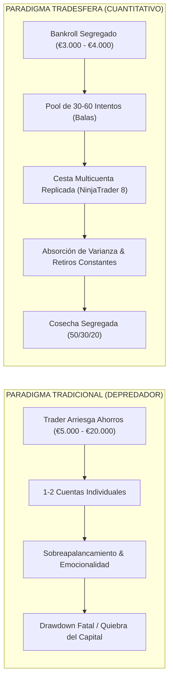
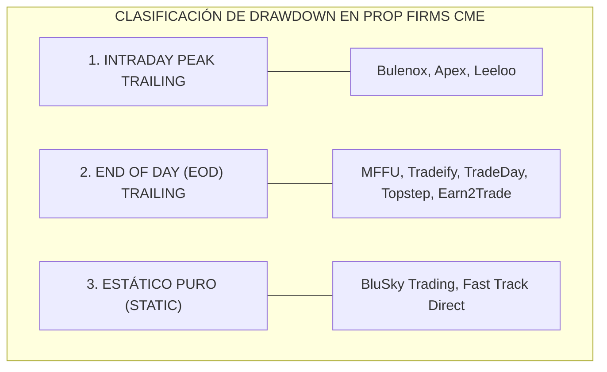
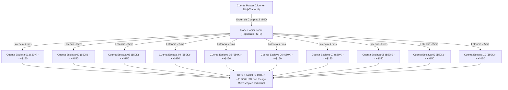
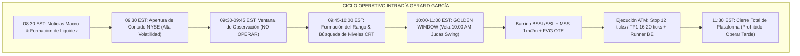
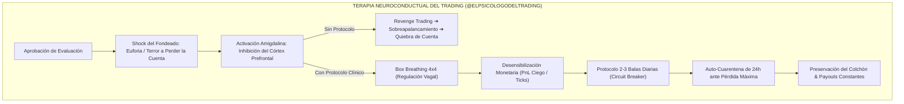
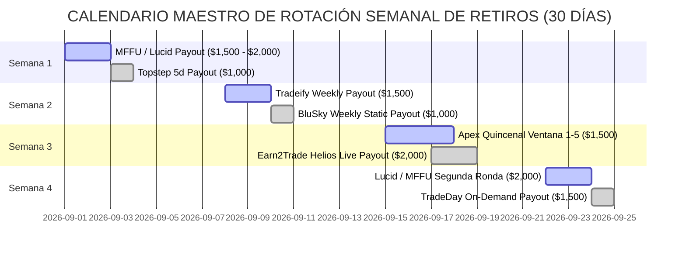
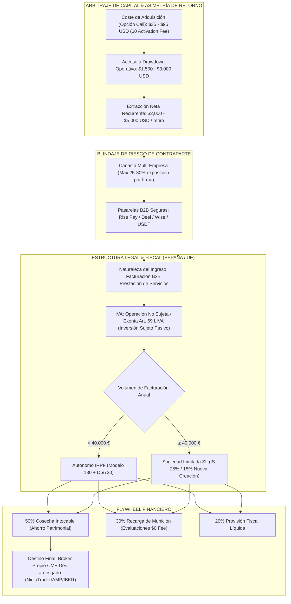

# 🏛️ Dossier Maestro: Tratado Integral del Sistema Inteligente de Fondeo de Futuros CME — Metodología Tradesfera V2

> **Tratado Unificado de Ingeniería Financiera, Microestructura Cuantitativa, Asimetría de Capital, Psicotrading Clínico, Estrategias de Campo y Gestión Fiscal**  
> **Proyecto:** 01 Ultrarentable | **Área:** Motor de Fondeo & Prop Firms | **Fecha:** 27 de Agosto de 2026  
> **Fuentes de Autoridad Analizadas:** Vicente Pons Martínez (`tradesfera.com`), Gerard García (@GerardGarciafx), Víctor Corrales Urrutia (@Elpsicologodeltrading).

---

## 🎯 Navegación y Enlaces Bidireccionales del Proyecto

- 📌 **Ficha Maestra Central:** [[Ultrarentable]]
- 🔗 **Sub-notas Maestras de Arquitectura & Capital:**
  - [[Motor de Fondeo y Prop Firms]] — *Matriz Comparativa Global de Prop Firms de Futuros CME*
  - [[Gestion de Capital — Balas y Estados]] — *Modelo de Balas, Transición de 6 Estados y Cosecha Segregada*
  - [[Plan 10 Fases]] — *Plan de Evolución de Fases Cuantitativas del Motor Ultrarentable*
  - [[Dashboard Web]] — *Consola Web y Calculadoras Interactivas (`apps/web`)*
- 📑 **Corpus Documental Especializado Tradesfera (16 Módulos):**
  - [[01_ECOSISTEMA_TRADESFERA_Y_MODELO_DE_NEGOCIO]] — *Las 4 Puertas, Fundador, Public Ledger (167K€) y Partners*
  - [[02_MATEMATICA_BANKROLL_Y_CAPITAL_MUNICION]] — *Formulación KaTeX de Munición, EV, N Intentos, Binomial y Regla 50/30/20*
  - [[03_TEORIA_VARIANZA_Y_CONTROL_DE_RACHAS]] — *Colas Pesadas CME, Rachas Negativas, TP Cortos y Monte Carlo*
  - [[04_PROTOCOLO_INTELIGENTE_APROBACION_CUENTAS]] — *Drawdown Forense (Intraday Peak vs EOD vs Estático), Micro/Mini y Consistencia*
  - [[05_SISTEMA_MULTICUENTA_Y_COPYTRADING]] — *Cestas de 5-20 Cuentas, Replicanto NT8 y Latencias <5ms*
  - [[06_CICLO_OPTIMO_RETIROS_Y_PAYOUTS]] — *Desmitificación del Holding, Buffers de Seguridad y Reglas de Cobro*
  - [[07_PSICOLOGIA_DEL_FONDEO_Y_SESGOS_OPERATIVOS]] — *Doctrina de Perfil Bajo, Erradicación del Revenge Trading y Hard Stop*
  - [[08_COMPARATIVA_PROP_FIRMS_FUTUROS_CME]] — *Matriz Peras con Peras $50K/$100K, Costes Reales Totales y Cupones*
  - [[09_INFRAESTRUCTURA_TECNICA_NINJATRADER_TOOLS]] — *Setup NinjaTrader 8, Feeds Kinetick/Rithmic y Spec TypeScript Web*
  - [[11_ESTRATEGIAS_Y_HORARIOS_GERARD_GARCIA_FUTUROS]] — *Metodología Gerard García: Hard Scalping, Killzones NY, PO3, CRT, FVG y ATM*
  - [[12_MAESTRIA_PSICOLOGICA_Y_PROTOCOLOS_EL_PSICOLOGO_DEL_TRADING]] — *Psicología Clínica Víctor Corrales: Shock del Fondeado, Box Breathing 4x4 y Auto-Cuarentena*
  - [[13_SISTEMA_TACTICO_MAXIMA_EXTRACCION_POR_EMPRESA]] — *Tácticas Quirúrgicas Topstep, Tradeify, Lucid, Earn2Trade, Apex y BluSky*
  - [[14_HACKS_SHORTS_Y_REGLAS_RAPIDAS_DE_FONDEO]] — *Micro-Hacks, Shorts, Micro-Pacing 15s, PnL Ciego, MIT vs Stop y 15 Mandamientos*
  - [[15_ARBITRAJE_DE_NEGOCIO_PROMOS_Y_FISCALIDAD]] — *Arbitraje de Capital, Caza de Promos $0 Fee, Riesgo Contraparte, Fiscalidad B2B y Flywheel*
  - [[16_PLAYBOOK_OPERATIVO_DIARIO_Y_CHECKLIST_EJECUCION]] — *Playbook Militar Diario de 3 Fases (Pre/In/Post) y Checklists 1 Página*
  - [[README]] — *Índice General, Taxonomía, Glosario Técnico y Guía de Inicio Rápido*

---

## 📑 Índice General del Tratado

1. **Introducción & Marco Paradigmático del Fondeo de Futuros**
2. **Dimensión I: El Ecosistema Tradesfera & Las 4 Puertas**
3. **Dimensión II: Fundamentos Matemáticos del Bankroll de Munición**
4. **Dimensión III: Varianza, Rachas Negativas & Microestructura de Futuros CME**
5. **Dimensión IV: Protocolo Inteligente de Aprobación de Evaluaciones**
6. **Dimensión V: Arquitectura de Escalado Multicuenta & Copytrading**
7. **Dimensión VI: Ciclo Óptimo de Retiros, Safety Buffers & Payouts**
8. **Dimensión VII: Psicología del Fondeo, Sesgos Cognitivos & Perfil Bajo**
9. **Dimensión VIII: Matriz Comparativa Oficial de Prop Firms Líderes 2026**
10. **Dimensión IX: Infraestructura Tecnológica & Integración en Ultrarentable V2**
11. **Dimensión X: Metodología Operativa, Horarios & Hard Scalping Gerard García**
12. **Dimensión XI: Maestría Psicológica, Shock del Fondeado & Protocolos Clínicos Víctor Corrales**
13. **Dimensión XII: Sistema Táctico de Máxima Extracción por Empresa & Calendario Semanal**
14. **Dimensión XIII: Micro-Hacks, Shorts y Reglas Rápidas de Fondeo**
15. **Dimensión XIV: Arbitraje de Negocio, Caza de Promos, Riesgo Contraparte & Fiscalidad B2B**
16. **Dimensión XV: Playbook Militar Diario de Ejecución & Checklists de Campo**
17. **Dimensión XVI: Síntesis Holística, Directiva Maestra de Ejecución y Epílogo**

---

## 🏛️ 1. Introducción & Marco Paradigmático del Fondeo de Futuros

La industria de las empresas de fondeo (*prop trading firms*) en los mercados de futuros regulados por la **Chicago Mercantile Exchange (CME)** ha experimentado una profunda transformación estructural. Durante años, la retórica del sector se vio dominada por promesas de enriquecimiento rápido y enfoques suicidas de apalancamiento único, donde el trader arriesgaba sus ahorros en una o dos evaluaciones aisladas, cayendo indefectiblemente víctima de la varianza estadística natural del mercado.

Frente a este modelo depredador, el ecosistema **Tradesfera**, fundado y liderado por el ingeniero y trader **Vicente Pons Martínez** (`tradesfera.com`), junto con la doctrina operativa de **Gerard García** (@GerardGarciafx) y los análisis de comportamiento de **El Psicólogo del Trading** (@Elpsicologodeltrading), ha formalizado un marco cuantitativo riguroso basado en dos pilares indiscutibles:

$$\text{1. Arbitraje de Asimetría de Capital} \quad \text{y} \quad \text{2. Gestión Probabilística del Bankroll como Munición}$$



### 1.1 Arbitraje de Asimetría de Capital
En una cuenta de futuros personal con capital propio, el trader asume una pérdida potencial del 100% de sus fondos depositados ante un deslizamiento severo de mercado, eventos de cisne negro o rachas de pérdidas prolongadas. 

En contraste, el modelo de fondeo de futuros representa un **contrato de opción asimétrica**:
- **Riesgo Máximo Acotado:** Estrictamente el coste de adquisición del examen de evaluación ($C_{\text{eval}} \approx \$30 - \$60$ utilizando el código oficial `TRADESFERA`).
- **Capacidad de Exposición y Retorno:** Acceso a un colchón operativo de pérdida máxima permitida ($D_{\text{max}} \approx \$1,500 - \$3,000$ por cuenta de \$50K) con capacidad para extraer miles de dólares en transferencias bancarias reales.

### 1.2 La Tasa de Fondeo Real de Tradesfera
Mientras que los informes de la industria revelan que menos del **2% al 3%** de los participantes en prop firms logran cobrar un retiro, la comunidad auditada de Tradesfera ha alcanzado una **tasa de fondeo real del 26,6%**. Este incremento de casi un orden de magnitud no se debe a "indicadores mágicos", sino a la aplicación estricta de la matemática de bankroll, la erradicación del trailing drawdown intradía y la diversificación multicuenta.

---

## 🚪 2. Dimensión I: El Ecosistema Tradesfera & Las 4 Puertas

La plataforma central de Tradesfera (`https://tradesfera.com/`) articula sus servicios a través de una arquitectura de **4 Puertas** diseñadas para cubrir todo el ciclo de vida del trader de futuros:

```text
┌──────────────────────────────────────────────────────────────────────────────────────────────────┐
│                                 ARQUITECTURA DE LAS 4 PUERTAS TRADESFERA                         │
├────────────────────────────────┬────────────────────────────────┬────────────────────────────────┤
│ 🚪 PUERTA 01: DESCUENTOS       │ 🚪 PUERTA 02: RECOMPENSAS      │ 🚪 PUERTA 03: COMUNIDAD        │
│  • Código: TRADESFERA          │  • Sistema de Ticks acumulados │  • Telegram Privado Auditado   │
│  • Máximo descuento activo     │  • Canje por cuentas gratis    │  • 0% Humo / 0% Vendehumos     │
│  • Actualización en tiempo real│  • Mentorías 1 a 1 e ebooks    │  • Soporte técnico continuo    │
├────────────────────────────────┴────────────────────────────────┼────────────────────────────────┤
│ 🚪 PUERTA 04: HUB & SALA DE TRADING 24/7                         │ 📊 LIBRO MAYOR AUDITADO        │
│  • Formación completa en microestructura y gestión de fondeo    │  • 167.839 € Cobrados Reales   │
│  • Trading Room en vivo y directos semanales con Vicente Pons   │  • 198 Retiros Verificados     │
│  • Modelado de psicotrading y control emocional                 │  • 26,6% Tasa de Fondeo Real   │
└─────────────────────────────────────────────────────────────────┴────────────────────────────────┘
```

### 2.1 Puerta 01: Descuentos Centralizados (`TRADESFERA`)
Tradesfera mantiene convenios directos con las firmas de futuros más solventes de la industria (MyFundedFutures, Tradeify, TradeDay, BluSky, Lucid Trading, Earn2Trade, Apex Trader Funding, Topstep, Take Profit Trader, Bulenox, Fast Track, TickTick Trader, UProfit). El código unificado `TRADESFERA` aplica automáticamente la promoción más agresiva vigente en cada momento (descuentos del 50% al 90%), eliminando la necesidad de rastreo manual por parte del operador.

### 2.2 Puerta 02: Sistema de Recompensas (Economía de Ticks)
Cada compra realizada utilizando el código `TRADESFERA` genera puntos denominados **Ticks** vinculados a la cuenta del usuario (`account.tradesfera.com`). Estos Ticks no caducan y pueden ser canjeados por:
- Cuentas de evaluación 100% gratuitas de $50K y $100K.
- Sesiones de mentoría privada 1 a 1 con Vicente Pons.
- Paquetes de indicadores profesionales y plantillas de PnL para NinjaTrader 8.
- Ebooks y manuales técnicos de microestructura.

### 2.3 Puerta 03: Comunidad Privada de Telegram
Un canal cerrado exclusivo para usuarios registrados. Se rige por una estricta política de moderación: prohibición total de spam, esquemas piramidales, venta de señales o alardes vacíos de capturas manipuladas. El debate se focaliza en análisis de flujo de órdenes (Order Flow), subastas de volumen CME, alertas de cambios regulatorios en prop firms y resolución técnica de problemas de software.

### 2.4 Puerta 04: El Hub de Formación & Trading Room 24/7
El Hub constituye el núcleo pedagógico del ecosistema. Proporciona módulos grabados y sesiones en directo sobre:
1. Microestructura de futuros (MES, MNQ, ES, NQ, CL, GC).
2. Protocolos de aprobación sin violar consistencia.
3. Gestión del estrés operativo y desensibilización al dinero virtual.
4. Sala de trading en vivo con operativas comentadas en tiempo real.

### 2.5 El Libro Mayor Público (Public Ledger)
El pilar de credibilidad de Tradesfera descansa en su **Libro Mayor Público Auditado**, que publica de forma transparente y sin sesgos de supervivencia:
- **Total Cobrado por la Comunidad:** $167.839\,\text{€}$ en retiros netos transferidos a cuentas bancarias y billeteras de los alumnos.
- **Número de Retiros Auditados:** 198 cobros exitosos.
- **Tasa de Fondeo Real:** $26,6\%$.
- **Transparencia en Fallos:** Publicación documentada de las evaluaciones perdidas y rachas de drawdown (ej. el informe público de Vicente Pons documentando una pérdida de $10.000\,\text{€}$ en 108 días durante una fase de varianza extrema, demostrando cómo el bankroll absorbió el golpe sin comprometer el capital personal).

---

## 🧮 3. Dimensión II: Fundamentos Matemáticos del Bankroll de Munición

La formulación cuantitativa del Bankroll en Tradesfera redefine el capital inicial como un **pool estocástico de disparos (munición)**.

```mermaid
graph TD
    subgraph "MODELO DE BALAS & REINVERSIÓN TRADESFERA"
        B0["Pool Inicial de Munición: B = €3.000 - €4.000"] --> Buy["Adquisición de Cesta: N Balas"]
        Buy --> Eval["Evaluación Simultánea con Trade Copier"]
        Eval -->|Fallo (Varianza)| Rest["Consumo de 1 Bala -> Siguiente Intento"]
        Eval -->|Aprobación| Funded["Cuenta Fondeada Activa"]
        Funded --> Buffer["Construcción de Safety Buffer (+$2.100)"]
        Buffer --> Payout["Retiro de Payouts (R_promedio)"]
        Payout --> Split["Algoritmo 50 / 30 / 20"]
        Split -->|50%| Pocket["Bolsillo Intocable (Ganancia Neta Real)"]
        Split -->|30%| B0["Recarga del Pool de Munición"]
        Split -->|20%| Tax["Colchón de Reserva Fiscal"]
    end
```

### 3.1 Formulación Analítica del Número de Intentos ($N$)
Sea $B$ el Bankroll total asignado exclusivamente al negocio de fondeo ($B \in [3000, 4000]\,\text{€}$), $C_{\text{eval}}$ el coste promedio del examen con descuento `TRADESFERA`, y $C_{\text{act}}$ la cuota de activación exigida por la firma:

$$N = \left\lfloor \frac{B}{C_{\text{eval}} + C_{\text{act}}} \right\rfloor$$

Para una firma con coste de examen de $\$39.50$ (ej. MFFU con cupón) y cuota de activación de $\$0$:

$$N = \left\lfloor \frac{3500}{39.50} \right\rfloor = 88 \text{ intentos (balas)}$$

Incluso en firmas con cuota de activación de $\$140$ y examen de $\$33.40$ (Apex):

$$N = \left\lfloor \frac{3500}{173.40} \right\rfloor = 20 \text{ intentos completos (balas)}$$

### 3.2 Probabilidad Acumulada de Supervivencia y Éxito
Si un operador posee una probabilidad individual de aprobar una cuenta y alcanzar la fase de cobro $p \in [0.15, 0.35]$ (estimación conservadora), la probabilidad $P(K \ge 1)$ de lograr **al menos una cuenta fondeada con cobro exitoso** tras $N$ intentos viene dada por la distribución binomial acumulada:

$$P(K \ge 1) = 1 - (1 - p)^N$$

Y la probabilidad de obtener al menos $k$ cuentas cobrando simultáneamente es:

$$P(K \ge k) = \sum_{j=k}^{N} \binom{N}{j} p^j (1 - p)^{N - j}$$

#### Tabla Matricial de Probabilidad Acumulada según Número de Balas ($N$):

| Número de Balas ($N$) | $p = 10\%$ (Principiante) | $p = 20\%$ (Operador Medio) | $p = 26.6\%$ (Media Tradesfera) | $p = 40\%$ (Avanzado) |
|:---:|:---:|:---:|:---:|:---:|
| **5 intentos** | $40.95\%$ | $67.23\%$ | $77.81\%$ | $92.22\%$ |
| **10 intentos** | $65.13\%$ | $89.26\%$ | $95.07\%$ | $99.40\%$ |
| **20 intentos** | $87.84\%$ | $98.85\%$ | $99.76\%$ | $99.99\%$ |
| **35 intentos** | $97.50\%$ | $99.96\%$ | $> 99.99\%$ | $> 99.99\%$ |
| **50 intentos** | $99.48\%$ | $> 99.99\%$ | $> 99.99\%$ | $> 99.99\%$ |

> [!TIP]
> **Conclusión Matemática:** Con un Bankroll de $3.000\,\text{€} - 4.000\,\text{€}$ que permite $\ge 25$ intentos en firmas sin cuota de activación, la probabilidad matemática de no fondear ninguna cuenta es **inferior al $0.1\%$**. La varianza queda totalmente neutralizada por el volumen de intentos.

### 3.3 Valor Esperado ($EV$) del Bankroll
El Valor Esperado total del modelo de munición se define mediante:

$$EV(B) = N \cdot \left[ p \cdot \overline{R}_{\text{retiros}} - (C_{\text{eval}} + C_{\text{act}}) \right]$$

Donde $\overline{R}_{\text{retiros}}$ representa el importe medio neto de los retiros extraídos antes de que la cuenta caiga eventualmente en drawdown fatal (estimado históricamente en $\$1,500 - \$3,000$).

#### Ejemplo Numérico Real:
- $B = 3.500\,\text{€}$ ($\approx \$3,800\,\text{USD}$)
- Firma: MFFU / Tradeify ($C_{\text{eval}} = \$45$, $C_{\text{act}} = \$0$, Coste por intento = $\$45$)
- $N = \lfloor 3800 / 45 \rfloor = 84$ intentos.
- Tasa de cobro $p = 20\% = 0.20$.
- Retiro promedio por cuenta cobrada $\overline{R}_{\text{retiros}} = \$1,800\,\text{USD}$.

$$EV(B) = 84 \cdot \left[ 0.20 \cdot 1800 - 45 \right] = 84 \cdot [360 - 45] = 84 \cdot 315 = \mathbf{+\$26,460\,\text{USD}}$$

$$\text{ROI del Bankroll} = \frac{EV(B)}{B} = \frac{26,460}{3,800} = \mathbf{+696.3\%}$$

### 3.4 El Algoritmo de Segregación y Reinversión 50/30/20
Para garantizar la perpetuidad financiera del sistema, cada cobro neto ($P_{\text{neto}}$) recibido de una firma de fondeo debe segregarse de forma automática e intocable según la siguiente partición:

$$\begin{cases} 
\text{Cosecha Intocable (Bolsillo Real):} & 50\% \cdot P_{\text{neto}} \quad \longrightarrow \text{Transferencia a cuenta bancaria personal / Ahorro intocable.} \\
\text{Recarga de Munición (Bankroll Pool):} & 30\% \cdot P_{\text{neto}} \quad \longrightarrow \text{Reposición y expansión del pool de evaluaciones.} \\
\text{Reserva de Contingencia Fiscal:} & 20\% \cdot P_{\text{neto}} \quad \longrightarrow \text{Cuenta segregada para liquidación de impuestos (IRPF/Sociedades).}
\end{cases}$$

---

## 📉 4. Dimensión III: Varianza, Rachas Negativas & Microestructura de Futuros CME

### 4.1 Distribución de Retornos y Colas Pesadas (Fat Tails)
Los activos estrella del CME Group —el **E-mini Nasdaq 100 (NQ)** y el **E-mini S&P 500 (ES)**, junto con sus micro-homólogos **MNQ** y **MES**— no siguen una distribución normal gaussiana estándar ($mu, sigma^2$). Presentan un coeficiente de curtosis elevado ($	ext{Kurtosis} > 3$) con colas pesadas (*fat tails*) y asimetría negativa provocada por shocks de liquidez, aperturas de la Bolsa de Nueva York (09:30 EST) y publicaciones macroeconómicas de alto impacto.

```text
       DISTRIBUCIÓN GAUSSIANA VS REAL CME (FAT TAILS)
                   ▲
                  ╱ ╲            Distribución Normal Gaussiana
                 ╱ │ ╲           Distribución Real CME (Colas Pesadas)
                ╱  │  ╲
               ╱   │   ╲
             _╱    │    ╲_
           _╱      │      ╲_
   ───────╱────────┼────────╲───────►
      Cola Izquierda        Cola Derecha
    (Shocks de Liquidez)   (Rallies de Expansión)
```

### 4.2 Modelado Probabilístico de Rachas de Pérdidas Consecutivas ($L_{max}$)
Para un sistema de trading con un Win Rate $W in [0.40, 0.60]$ que realiza $T$ operaciones en una ventana de evaluación (típicamente $T = 50 - 150$ trades), la longitud máxima esperada de la peor racha de pérdidas consecutivas ($L_{max}$) se aproxima asintóticamente mediante:

$$L_{max} approx rac{ln(T)}{lnleft(rac{1}{1 - W}
ight)}$$

#### Estimación de Rachas Máximas según Win Rate y Número de Trades:

| Trades ($T$) | $W = 40%$ ($1-W = 0.60$) | $W = 50%$ ($1-W = 0.50$) | $W = 60%$ ($1-W = 0.40$) |
|:---:|:---:|:---:|:---:|
| **$T = 50$ trades** | $7.65 approx mathbf{8 	ext{ pérdidas}}$ | $5.64 approx mathbf{6 	ext{ pérdidas}}$ | $4.27 approx mathbf{4 	ext{ pérdidas}}$ |
| **$T = 100$ trades** | $9.01 approx mathbf{9 	ext{ pérdidas}}$ | $6.64 approx mathbf{7 	ext{ pérdidas}}$ | $5.03 approx mathbf{5 	ext{ pérdidas}}$ |
| **$T = 200$ trades** | $10.37 approx mathbf{10 	ext{ pérdidas}}$ | $7.64 approx mathbf{8 	ext{ pérdidas}}$ | $5.78 approx mathbf{6 	ext{ pérdidas}}$ |

> [!WARNING]
> **Implicación Forense de Fondeo:** Si un operador arriesga $$400$ por trade en una cuenta de $$50K$ con un colchón de drawdown total de $$2,000$, una racha esperada de 6 pérdidas consecutivas ($$2,400$) **quebrará la cuenta con una probabilidad matemática del 100%**, incluso si el sistema es altamente rentable a largo plazo. Por tanto, el riesgo por operación en fase de evaluación debe limitarse a **$le $100 - $150$ (5% a 7.5% del colchón)** mediante contratos Micro (MNQ/MES).

### 4.3 La Ventaja Matemática de los Take Profits Cortos frente al Trailing Drawdown
En el trading convencional con capital propio, la literatura clásica recomienda "dejar correr los beneficios y cortar rápido las pérdidas" (ratios $R:R ge 1:3$). Sin embargo, **en el fondeo de futuros con trailing drawdown (intradía o EOD), esta premisa es matemáticamente lesiva**:

1. Si una posición en NQ alcanza un beneficio flotante de $+$1,200$ pero retrocede y se cierra en $+$300$:
   - En una firma con **Intraday Peak Trailing**, el nivel de quiebra de la cuenta ha ascendido $$1,200$. Al cerrarse en $+$300$, el trader ha destruido efectivamente $$900$ de su colchón de drawdown disponible.
2. Un modelo de **Take Profits cortos y fijos (ej. 15 a 30 puntos en NQ = $$300 - $600$ con 1 mini)** asegura la ganancia en el balance realizado antes de que la reversión a la media intra-sesión distorsione el trailing drawdown.

---

## 🎯 5. Dimensión IV: Protocolo Inteligente de Aprobación de Evaluaciones

### 5.1 Análisis Forense de los 3 Modelos de Drawdown



1. **Intraday Trailing Peak Drawdown (El Modelo Depredador):**
   - El umbral de pérdida sigue el punto más alto del equity flotante tick a tick.
   - Si entras largo en MNQ y el precio sube $+$1,500$ flotantes para luego caer y cerrar en $-$100$, tu umbral de pérdida subió $$1,500$. La cuenta queda estrangulada de inmediato.
   - **Veredicto Tradesfera:** Evitar salvo promociones extremas ($>80%$ de descuento) y únicamente operando con scalping ultra-rápido de Take Profits microscópicos.
2. **End of Day (EOD) Trailing Drawdown (El Estándar Profesional):**
   - El umbral de liquidación se recalcula **únicamente al cierre de la sesión de futuros CME (17:00 EST / 16:00 CT)** sobre el balance cerrado.
   - Las fluctuaciones intra-vela flotantes no afectan el suelo de la cuenta mientras no toquen el drawdown del día anterior.
   - Una vez que el drawdown alcanza el balance inicial más un margen de seguridad (típicamente $+$100$), **se detiene y queda congelado para siempre** (se convierte en drawdown estático).
   - **Veredicto Tradesfera:** El modelo óptimo para el 90% de los operadores cuantitativos.
3. **Drawdown Estático Puro (El Modelo Institucional):**
   - El suelo de liquidación queda fijado permanentemente en el capital inicial menos el límite de pérdida (ej. en una cuenta de $$50K$ con $$1,500$ de drawdown en BluSky, el umbral es **siempre $$48,500$**, ganes lo que ganes).
   - **Veredicto Tradesfera:** La mayor comodidad psicológica y operativa del mercado.

### 5.2 Protocolo de Apalancamiento Escalonado en 3 Fases
Para superar una cuenta de $$50K$ (Target: $$3,000$, Max Drawdown: $$2,000$) minimizando el riesgo de ruina:

```text
┌──────────────────────────────────────────────────────────────────────────────────────────────────┐
│                   PROTOCOLO ESCALONADO DE APALANCAMIENTO EN 3 FASES (TRADESFERA)                 │
├──────────────────────────────────┬─────────────────────────────────┬─────────────────────────────┤
│ 🟢 FASE 1: SEMILLA               │ 🟡 FASE 2: EXPANSIÓN            │ 🔴 FASE 3: CIERRE QUIRÚRGICO│
│ Balance: $50,000 ➔ $51,000       │ Balance: $51,000 ➔ $52,500      │ Balance: $52,500 ➔ $53,000  │
├──────────────────────────────────┼─────────────────────────────────┼─────────────────────────────┤
│ • Instrumento: MICRO (MES/MNQ)   │ • Instrumento: 1 MINI o 5 MICROS│ • Instrumento: MICRO        │
│ • Tamaño: 2 a 4 contratos micro  │ • Tamaño: 1 ES/NQ controlado    │ • Tamaño: 1 a 2 micros      │
│ • Stop Loss: $60 - $100 / trade  │ • Stop Loss: $150 - $250 / trade│ • Stop Loss: $40 - $60      │
│ • Objetivo: Crear colchón de $1K │ • Objetivo: Capturar el núcleo  │ • Objetivo: Rematar target  │
│   sin arriesgar >5% del DD.      │   de la ganancia ($1.5K).       │   sin devolver beneficios.  │
└──────────────────────────────────┴─────────────────────────────────┴─────────────────────────────┘
```

### 5.3 Reglas de Consistencia y Gestión de Noticias Macroeconómicas
- **Filtro de Consistencia del 30% al 50%:** Ningún día individual puede concentrar más del porcentaje estipulado de la ganancia total al momento de solicitar aprobación o retiro.
  $$	ext{Ganancia Máxima Diaria Permitida} = 	ext{Target Total} 	imes %_{	ext{consistencia}}$$
  Si el target es $$3,000$ con regla del $40%$, el operador no debe cerrar ningún día con más de $$1,200$ de beneficio. Si un trade genera $$1,500$, el operador está obligado a seguir operando días subsiguientes hasta que $$1,500$ represente $le 40%$ del total acumulado.
- **Filtro Macroeconómico de Alta Volatilidad:** Bloqueo absoluto de apertura de posiciones **5 minutos antes y 5 minutos después** de publicaciones Tier-1:
  - **CPI** (Índice de Precios al Consumo).
  - **FOMC** (Decisión de Tipos de Interés y Rueda de Prensa de la Reserva Federal).
  - **NFP** (Nóminas No Agrícolas).

---

## 🔄 6. Dimensión V: Arquitectura de Escalado Multicuenta & Copytrading

### 6.1 El Concepto de Canasta Multicuenta (Baskets)
Operar una sola cuenta fondeada de $$150K$ buscando extraer $$5,000$ mensuales somete al trader a una presión psicológica devastadora, ya que cada stop loss representa una pérdida nominal de $$500 - $1,000$.

La solución de ingeniería Tradesfera radica en la **Canasta Multicuenta (Basket)**:

$$	ext{Operativa Concentrada de 1 Cuenta} quad Longrightarrow quad 	ext{Operativa Distribuida de } M 	ext{ Cuentas (Replicadas)}$$



### 6.2 Desacople Psicológico de la Exposición
Al operar 10 cuentas de $$50K$ con un trade de 2 contratos micro (MNQ), el riesgo asumido en cada cuenta individual es de apenas $$30 - $50$. El operador visualiza y ejecuta con la tranquilidad de un micro-contrato, mientras que el resultado agregado equivale al de 2 contratos mini ($$300 - $500$ de beneficio por movimiento).

### 6.3 Infraestructura de Replicación y Enrutamiento
- **Software Homologado:** **Replicanto de FlowBots** para NinjaTrader 8 o el Trade Copier nativo multi-proveedor.
- **Latencia de Ejecución:** Sincronización local en memoria C# con desfase inferior a **5 milisegundos**, evitando deslices asimétricos entre cuentas.
- **Protocolos de Conexión:**
  - **Rithmic MBO (Market By Order):** Conexión directa multi-login utilizando plugin Rithmic R|Trader Pro.
  - **Tradovate API:** Conexión vía WebSockets con soporte nativo de cross-margin y ejecución desde plataforma web/NinjaTrader.

---

## 💰 7. Dimensión VI: Ciclo Óptimo de Retiros, Safety Buffers & Payouts

### 7.1 La Regla de Oro: La Cuenta de Fondeo como Grifo de Flujo de Caja
Una de las mayores aportaciones conceptuales de Gerard García y Vicente Pons es la desmitificación radical del apego a la cuenta financiada:

> [!IMPORTANT]
> **DOCTRINA DE EXTRACCIÓN SISTEMÁTICA:** Una cuenta de fondeo **NO es un plan de pensiones a 10 años ni un certificado de estatus**. Es un activo perecedero con una vida media estadística de 3 a 6 meses. La única métrica de éxito válida es la cantidad total de dinero real extraído y depositado en tu cuenta bancaria.

### 7.2 Safety Buffers (Colchones de Seguridad) Obligatorios por Firma
Para no violar el trailing drawdown al solicitar un payout, el operador debe calcular con precisión milimétrica el **Safety Buffer**:

| Firma de Fondeo | Tamaño Cuenta | Umbral Mínimo de Retiro (Buffer) | Retiro Permitido | Frecuencia de Cobro | Tiempo de Pago |
|---|:---:|:---:|:---:|:---:|:---:|
| **MyFundedFutures (MFFU)** | $$50,000$ | $$52,100$ (Buffer $$2,100$) | Hasta $$2,000$ / retiro | **Día 1 On-Demand** | 24 - 48 horas |
| **Lucid Trading** | $$50,000$ | $$52,000$ (Buffer $$2,000$) | Sin tope de retiro | **On-Demand** | **15 - 30 Minutos** |
| **Tradeify (Growth)** | $$50,000$ | $$52,000$ (Buffer $$2,000$) | Hasta $$1,500$ / semana | **On-Demand** | 24 - 48 horas |
| **TradeDay** | $$50,000$ | $$52,000$ (Buffer $$2,000$) | Sin tope tras buffer | **On-Demand** | **Mismo día hábil** |
| **Topstep** | $$50,000$ | $$52,000$ (Buffer $$2,000$) | $50%$ del balance $> $2K$ | **Diario (5d > $200)** | 24 - 48 horas |
| **BluSky Trading** | $$50,000$ | $$51,500$ (Buffer $$1,500$) | Hasta $$1,000$ / semana | **Semanal** | 24 horas |
| **Earn2Trade (Helios)** | $$50,000$ | $$52,000$ (Cuenta Live) | $80% / 20%$ sin topes | **Semanal** | 48 horas |
| **Apex Trader Funding** | $$50,000$ | $$52,600$ (Buffer $$2,600$) | Max $$1,500$ / quincena | **Quincenal (1-5 / 15-20)** | 3 - 7 días |
| **Take Profit Trader** | $$50,000$ | $$52,500$ (Buffer $$2,500$) | Sin topes en Pro Account | **Día 1 en Pro** | 24 horas |

### 7.3 Algoritmo de Cobro Inmediato
1. Alcanzar el umbral del Safety Buffer ($+$2,100$ en cuenta de $$50K$).
2. Generar el excedente de beneficio deseado (ej. $+$1,000$ adicionales $	o$ Balance $$53,100$).
3. **Solicitar el retiro de $$1,000$ en el primer instante hábil**.
4. Continuar operando con el colchón de $$2,100$ intacto para que la cuenta no entre en riesgo de liquidación.

---

## 🧠 8. Dimensión VII: Psicología del Fondeo, Sesgos Cognitivos & Perfil Bajo

### 8.1 La Doctrina de Perfil Bajo (@Elpsicologodeltrading & Gerard García)
La exposición pública en redes sociales, la necesidad de demostrar ganancias a terceros y el apego al ego son los principales desencadenantes de quiebras masivas de cuentas de fondeo. La metodología Tradesfera aboga por una **operativa de perfil bajo**:
- Desensibilización al dinero virtual mostrado en la pantalla de NinjaTrader.
- Comprensión de que las pérdidas individuales no son un fracaso personal, sino un **coste operativo estándar de compra de información estadística**.

### 8.2 Erradicación Mecánica del *Revenge Trading* (Hard Stop por Software)
La fuerza de voluntad humana claudica inevitablemente bajo situaciones de estrés agudo tras dos operaciones perdedoras consecutivas. Por ello, la prevención no debe ser psicológica, sino **tecnológica**:
- Configuración obligatoria en **NinjaTrader 8 / Rithmic Risk Manager** del parámetro `Daily Loss Limit`:
  - Si la pérdida acumulada de la sesión alcanza $-$300$ en una cuenta de $$50K$, la plataforma **liquida automáticamente todas las posiciones abiertas y bloquea la cuenta hasta las 17:00 EST del día siguiente**, impidiendo físicamente cualquier intento de sobreoperativa emocional.

### 8.3 Deconstrucción de Sesgos Cognitivos Letales

```text
┌──────────────────────────────────────────────────────────────────────────────────────────────────┐
│                             SESGOS COGNITIVOS EN EL TRADING DE FONDEO                            │
├──────────────────────────────┬───────────────────────────────────┬───────────────────────────────┤
│ 🧠 SESGO COGNITIVO           │ ⚠️ MANIFESTACIÓN EN PROP FIRMS     │ 🛡️ SOLUCIÓN CUANTITATIVA     │
├──────────────────────────────┼───────────────────────────────────┼───────────────────────────────┤
│ Falacia del Coste Hundido    │ "Llevo $2,800 ganados, no puedo   │ Aceptar la pérdida del trade  │
│                              │ cerrar este trade en -$300".      │ sin mover el stop loss.       │
├──────────────────────────────┼───────────────────────────────────┼───────────────────────────────┤
│ Sesgo de Anclaje de Equity   │ Creer que el pico flotante de     │ Tratar el balance cerrado     │
│                              │ +$1,500 ya es dinero en el banco. │ como la única verdad física.  │
├──────────────────────────────┼───────────────────────────────────┼───────────────────────────────┤
│ Sesgo de Recencia            │ Duplicar lotaje tras 3 días verdes│ Dimensionamiento fijo por     │
│                              │ consecutivos creyéndose invencible│ protocolo matemático estricto.│
└──────────────────────────────┴───────────────────────────────────┴───────────────────────────────┘
```

---

## 📊 9. Dimensión VIII: Matriz Comparativa Oficial de Prop Firms Líderes 2026

Comparativa técnica rigurosa de cuentas **$50K de Futuros CME** con costes reales auditados:

| Firma & Programa | Precio Examen (Cupón `TRADESFERA`) | Cuota Activación | Coste Total Real | Profit Target | Max Drawdown & Tipo | DLL Diario | Bots / EAs | Política de Retiros |
|---|:---:|:---:|:---:|:---:|:---:|:---:|:---:|:---:|
| **MyFundedFutures (Rapid)** | **$39.50** | **$0 USD** | **$39.50 USD** | $3,000 (6%) | $2,000 [EOD Trailing] | Sin límite | ✅ Permitidos | Día 1 On-Demand |
| **Tradeify (Growth)** | **$58.20** | **$0 USD** | **$58.20 USD** | $3,000 (6%) | $2,000 [EOD Trailing] | $1,000 (Soft) | ✅ Permitidos | 24-48h On-Demand |
| **TradeDay (Day Trader)** | **$59.00** | **$0 USD** | **$59.00 USD** | $3,000 (6%) | $2,000 [EOD Trailing] | $1,000 | ✅ Permitidos | Mismo día hábil |
| **BluSky Trading (Static)** | **$110.00** | **$0 USD** | **$110.00 USD** | $3,000 (6%) | $1,500 [**Estático Puro**]| Sin límite | ✅ Permitidos | Semanal On-Demand |
| **Lucid Trading (Flex)** | **$118.30** | **$0 USD** | **$118.30 USD** | $3,000 (6%) | $2,000 [EOD Trailing] | Sin límite | ✅ Permitidos | **15-30 Minutos** |
| **Earn2Trade (Career)** | **$152.00** | **$0 USD** | **$152.00 USD** | $3,000 (6%) | $2,000 [EOD Trailing] | $1,100 | ✅ Permitidos | Semanal (Helios Live) |
| **Bulenox (Opción 1)** | **$19.25** | $148.00 USD | **$167.25 USD** | $3,000 (6%) | $2,500 [Intraday Peak] | Sin límite | ✅ Permitidos | Quincenal |
| **Apex Trader Funding** | **$33.40** | $140.00 USD | **$173.40 USD** | $3,000 (6%) | $2,500 [Intraday Peak] | Sin límite | ❌ **Solo Manual** | Quincenal ($1.5K cap) |
| **Topstep (Trading Combine)** | **$49.00** | $149.00 USD | **$198.00 USD** | $3,000 (6%) | $2,000 [EOD Trailing] | $1,000 (Live)| ⚠️ Solo PC local | Diario (5d > $200) |
| **Take Profit Trader** | **$85.00** | $130.00 USD | **$215.00 USD** | $3,000 (6%) | $2,000 [EOD Trailing] | $1,100 | ⚠️ Con restricc. | Día 1 en Pro |

---

## 💻 10. Dimensión IX: Infraestructura Tecnológica & Integración en Ultrarentable V2

### 10.1 Setup Profesional en NinjaTrader 8
1. **Instalación de NinjaTrader 8 (64-bit)** configurado con Multi-provider activado.
2. **Configuración de Proveedores:**
   - Conexión primaria: *Rithmic for NinjaTrader Brokerage* (System: Rithmic Paper Trading / Server: Chicago).
   - Conexión secundaria: *Kinetick - End of Day* para histórico y validación de datos.
3. **Optimización de Gráficos:** Gráficos de velas de volumen o rango (Range 4 / Range 8 en MNQ/NQ) con indicador de PnL en tiempo real y cálculo de comisiones brutas/netas.

### 10.2 Especificación Técnica: Calculadora de Bankroll y Varianza en `apps/web`
Contrato tipado TypeScript para la integración de la calculadora interactiva en el frontend de Ultrarentable:

```typescript
export interface TradesferaBankrollInput {
  totalBankrollEUR: number;          // Capital disponible (ej. 3500)
  targetFirmCostUSD: number;         // Coste examen con descuento (ej. 39.50)
  activationFeeUSD: number;          // Cuota de activación (ej. 0 o 140)
  winRate: number;                   // Tasa de acierto estimada (0.0 a 1.0)
  estimatedPassRate: number;         // Probabilidad individual de cobro p (ej. 0.25)
  averagePayoutUSD: number;          // Payout promedio esperado (ej. 1800)
  accountsInBasket: number;          // Cuentas replicadas simultáneamente (ej. 10)
}

export interface TradesferaBankrollOutput {
  totalAttemptsN: number;            // Número total de balas disponibles
  probabilityAtLeastOneSuccess: number; // P(K >= 1)
  expectedValueUSD: number;          // EV total en USD
  roiPercentage: number;             // Retorno esperado sobre el bankroll (%)
  maxConsecutiveLossesExpected: number; // Racha de pérdidas consecutivas estimada
  recommendedMicroContracts: number; // Contratos micro sugeridos en Fase 1
  recommendedMiniContracts: number;  // Contratos mini sugeridos en Fase 2
  segregatedDistribution: {
    untouchableProfitEUR: number;    // 50% cosecha intocable
    bankrollReloadEUR: number;       // 30% recarga munición
    taxReserveEUR: number;           // 20% provisión fiscal
  };
}
```

---

## ⚡ 11. Dimensión X: Metodología Operativa, Horarios & Hard Scalping Gerard García

> **Tratado Específico Completo:** [[11_ESTRATEGIAS_Y_HORARIOS_GERARD_GARCIA_FUTUROS]]

La operativa de **Gerard García** (@GerardGarciafx) en los futuros del CME Group (**NQ / MNQ** y **ES / MES**) formaliza el estándar de *Hard Scalping* institucional y precisión microestructural, integrando los conceptos avanzados de entrega algorítmica de precio (**IPDA / ICT**), la **Candle Range Theory (CRT)** y la ejecución ultra-rápida mediante **Brackets ATM**.



### 11.1 Killzones de Nueva York y la Regla de Oro de las 10:00 AM
1. **Killzone de Nueva York (08:30 — 11:30 EST):** El 90% del volumen institucional y el desplazamiento direccional limpio ocurren en esta ventana de 3 horas. Fuera de ella, el mercado entra en fases de acumulación errática o *lunch hour* (12:00-13:30 EST) con spreads abiertos y alto riesgo de quiebra de trailing drawdown.
2. **La Regla de los Primeros 15 Minutos (09:30 — 09:45 EST):** Se prohíbe taxativamente la apertura de operaciones durante los primeros 15 minutos tras el toque de campana. Es la fase de absorción de órdenes minoristas y rebalanceo de carteras institucionales.
3. **La Golden Window y el Judas Swing (10:00 — 11:00 EST):** La apertura de la vela horaria de las 10:00 AM EST produce con alta frecuencia el *Judas Swing*: una manipulación inducida que barre los máximos/mínimos de la sesión asiática/londinense antes de expandir en la verdadera tendencia del día.

### 11.2 El Algoritmo IPDA, Poder de Tres (PO3) y Candle Range Theory (CRT)
- **Poder de Tres (PO3):** $\text{Acumulación (Asia/Londres)} \longrightarrow \text{Manipulación (Judas Swing NY 10:00 AM)} \longrightarrow \text{Distribución (Expansión Direccional 10:15-11:30 AM)}$.
- **Candle Range Theory (CRT):** Mapeo de los extremos de la vela de 4H o Daily (Buy-Side Liquidity BSSL y Sell-Side Liquidity SSL). El precio barre el extremo, produce un *Market Structure Shift (MSS)* en 1m/2m y retorna hacia el interior del rango a través de un *Fair Value Gap (FVG)*.
- **Fair Value Gaps (FVG / IFVG):** Desequilibrios de 3 velas utilizados como punto de entrada de máxima probabilidad con ratio $R:R \ge 1:1.5$ y stops microscópicos.

### 11.3 Ejecución con Brackets ATM (Advanced Trade Management)
Para eliminar la latencia de reacción humana y el bloqueo emocional:
- **Bracket NQ / MNQ:** Stop Loss fijo de 12 a 16 ticks ($60 - $80 USD en NQ por contrato), Take Profit 1 en 16 a 20 ticks ($80 - $100 USD), Take Profit 2 en 30 ticks o Runner con trailing a Break Even al alcanzar TP1.

---

## 🧠 12. Dimensión XI: Maestría Psicológica, Shock del Fondeado & Protocolos Clínicos Víctor Corrales

> **Tratado Específico Completo:** [[12_MAESTRIA_PSICOLOGICA_Y_PROTOCOLOS_EL_PSICOLOGO_DEL_TRADING]]

La doctrina de **Víctor Corrales Urrutia** (@Elpsicologodeltrading) aborda la psicología del fondeo desde la psicoterapia cognitivo-conductual, la neurobiología y el acondicionamiento fisiológico del operador de prop firms.



### 12.1 El Diagnóstico Clínico del "Shock del Fondeado"
Al recibir las credenciales de la cuenta financiada (PA / Live Sim / Funded), el 80% de los operadores sufre una metamorfosis psicológica destructiva:
1. **La Parálisis del Miedo:** El trader deja de tomar sus setups válidos por temor a perder la cuenta recién obtenida.
2. **La Euforia del Iluso:** El trader cree que ya ha "triunfado" y duplica el apalancamiento buscando cobrar retiros gigantescos de forma inmediata.
3. **El Secuestro Amigdalino:** Ante una pérdida, el sistema límbico bloquea el razonamiento analítico del córtex prefrontal, desatando la rabia operativa (*tilt*) y el *revenge trading*.

### 12.2 Protocolos Fisiológicos y de Rescate Clínico
1. **Box Breathing 4x4 (Respiración Cuadrada):** 4 segundos de inhalación nasal, 4 segundos de retención pulmonar, 4 segundos de exhalación y 4 segundos de retención en vacío. Realizado durante 3 minutos antes de encender NinjaTrader para modular el tono vagal y reducir el cortisol.
2. **Desensibilización Monetaria y Termostato Financiero:** El cerebro humano no procesa bien ver fluctuaciones de $\pm \$500$ o $\pm \$1,500$ en tiempo real. La solución exige **activar el PnL Ciego**, operando en unidades abstractas de *ticks* y *R*, tratando la cuenta como un videojuego cuantitativo de ejecución de procesos.
3. **Protocolo de las 2-3 Balas y Circuit Breaker Militar:**
   $$\text{Máximo de operaciones permitidas por sesión: } 3 \text{ trades}$$
   $$\text{Límite de pérdidas consecutivas: } 2 \text{ Stop Loss} \longrightarrow \mathbf{\text{APAGADO FULMINANTE DE LA PLATAFORMA}}$$
4. **Auto-Cuarentena de 24 Horas:** Tras un día de pérdida máxima o quiebra accidental de una cuenta, el trader tiene prohibido operar durante 24 horas completas para permitir el drenaje neuroquímico del cortisol y la recuperación de la lucidez ejecutiva.

---

## 📈 13. Dimensión XII: Sistema Táctico de Máxima Extracción por Empresa & Calendario Semanal

> **Tratado Específico Completo:** [[13_SISTEMA_TACTICO_MAXIMA_EXTRACCION_POR_EMPRESA]]

Cada firma de fondeo posee una arquitectura reglamentaria y pasarelas de pago particulares. La extracción óptima requiere un enfoque quirúrgico adaptado a las características de cada empresa.



### 13.1 Tácticas Quirúrgicas Empresa por Empresa:
- **Topstep:** Explotar la plataforma gratuita *TopstepX*, superar el Combine en 2 días, acumular 5 días ganadores con $\ge \$150$ netos en la cuenta XFA, solicitar retiros diarios retirando el 50% del exceso sobre el buffer de $\$2,000$ y transicionar a la cuenta **Live Brokerage** directa.
- **Tradeify:** Aprovechar la promoción de **\$0 Cuota de Activación**, operar con drawdown EOD, alcanzar el buffer de $\$2,000$ y solicitar retiros semanales de hasta $\$1,500$ con acreditación en 24-48 horas vía Rise Pay.
- **Lucid Trading:** Programa Flex con **\$0 Activation Fee**, drawdown EOD y la pasarela de pagos más rápida del mercado: **acreditación en 15 a 30 minutos** sin topes de retiro.
- **Earn2Trade:** Programa Career Pathfinder; tras superar la evaluación, emisión directa de cuenta **Helios Live real**, con reparto 80/20 sin limitaciones de días mínimos ni trabas artificiales.
- **Apex Trader Funding:** Operar exclusivamente con scalping de TP cortos para neutralizar el trailing drawdown intradía. Solicitar el tope máximo quincenal de $\$1,500$ durante los primeros 3 meses manteniendo el buffer de $\$2,600$ intacto.
- **BluSky Trading:** Modelo de **Drawdown Estático Puro** (el suelo nunca sube de $\$48,500$). Retiros semanales con buffer de solo $\$1,500$, ideal para operativa de swing y absorción de volatilidad.

### 13.2 El Cronograma Rotativo de Cashflow Semanal
Al diversificar la canasta multicuenta entre 4 y 6 firmas con diferentes fechas de corte y pasarelas de pago, el trader transforma la incertidumbre del trading en un **salario semanal recurrente de \$3,000 a \$10,000 USD netos**.

---

## ⚡ 14. Dimensión XIII: Micro-Hacks, Shorts y Reglas Rápidas de Fondeo

> **Tratado Específico Completo:** [[14_HACKS_SHORTS_Y_REGLAS_RAPIDAS_DE_FONDEO]]

Compilación de alta densidad de trucos de campo, micro-tácticas y optimizaciones técnicas extraídas del contenido rápido de Vicente Pons, Gerard García y Víctor Corrales.

### 14.1 Micro-Hacks de Gestión Operativa & Plataforma:
1. **El Truco del Micro-Pacing de 15 Segundos:** Cuando ya has alcanzado el profit target de la evaluación (ej. $+\$3,050$) pero la firma exige 5 días mínimos de trading, **NO operes normalmente**. Abre 1 contrato micro (MNQ) en un momento de baja volatilidad, ciérralo tras 15 segundos con una ganancia/pérdida de $\$1-\$2$. Has validado el día formalmente sin arriesgar ni un céntimo de tu target.
2. **Micro-Bracket OCO Antibalas (12/20 ticks):** Configurar una orden automática con Stop Loss de 12 ticks ($60 en NQ / $6 en MNQ) y Take Profit de 18 ticks ($90 en NQ / $9 en MNQ). Esta asimetría matemática $R:R = 1:1.5$ permite un Win Rate del 45% siendo altamente rentable.
3. **El Axioma del No-Reset:** Si quiebras una cuenta de evaluación, **NUNCA compres un reset** (que suele costar $\$80 - \$100$). Con el código promocional `TRADESFERA` (descuentos del 80%-90%), una cuenta completamente nueva cuesta entre $\$33$ y $\$45$, otorgándote un nuevo número de cuenta y reiniciando el ciclo de facturación mensual.
4. **PnL Ciego (Hide Account Balance):** En NinjaTrader 8 (Properties $\to$ Hide Account Balance) y Tradovate, ocultar el balance monetario y configurar los gráficos en *Ticks* o *Puntos*. Elimina la distorsión cognitiva provocada por el dinero fiat.
5. **Orden MIT (Market-if-Touched) vs Stop Market:** Utilizar órdenes MIT para entradas de breakout o rebote. La orden MIT envía una orden Limit agresiva en lugar de una orden Market, reduciendo el deslizamiento (*slippage*) de 4-8 ticks a 0-1 tick en aperturas volátiles.
6. **Optimización de VPS Chicago:** Conectar la plataforma a un VPS alojado en los centros de datos de Chicago (Equinix NY4 / CME Aurora) para reducir la latencia de envío de órdenes a **$<2\text{ms}$**, evitando pérdidas por desfase en la ejecución del Trade Copier.
7. **La Ventana Óptima de Retiros (Martes y Miércoles):** Solicitar payouts exclusivamente martes o miércoles antes de las 10:00 AM CT. Evita que las solicitudes queden bloqueadas durante el fin de semana en las plataformas bancarias o en la pasarela Rise Pay / Deel.
8. **El Colchón Invisible Post-Payout:** Al calcular el retiro, deja siempre **$\$100$ a $\$200$ USD adicionales por encima del Safety Buffer**. Las comisiones de futuros CME ($1.50 - $2.50 por contrato) se debitan del balance cerrado; si retiras exactamente hasta el buffer, la comisión del primer trade te situará en quiebra técnica inmediata.

### 14.2 Cheat Sheet: Los 15 Mandamientos Rápidos del Trader Fondeado
```text
┌──────────────────────────────────────────────────────────────────────────────────────────────────┐
│                   LOS 15 MANDAMIENTOS RÁPIDOS DEL TRADER FONDEADO (TRADESFERA)                   │
├──────────────────────────────────────────────────────────────────────────────────────────────────┤
│  1. Nunca operes sin antes revisar ForexFactory (Bloqueo ±5 min en CPI, FOMC, NFP).             │
│  2. Prohibido abrir posiciones durante los primeros 15 minutos de la sesión NYSE (09:30-09:45). │
│  3. La Golden Window ocurre entre las 10:00 y las 11:00 EST (Judas Swing de las 10:00 AM).      │
│  4. Máximo 2 Stop Loss por sesión: al segundo stop consecutivo, APAGADO TOTAL DE PLATAFORMA.     │
│  5. Opera con PnL Ciego: visualiza ticks y puntos, nunca euros ni dólares.                       │
│  6. En fase de evaluación inicial, usa MICRO-CONTRATOS (2-4 MNQ/MES) para blindar el drawdown.  │
│  7. Nunca pagues un reset: compra una cuenta nueva con código TRADESFERA al 80-90% de descuento. │
│  8. Prioriza siempre firmas con $0 Activation Fee y Drawdown End of Day (EOD) o Estático.       │
│  9. El Trade Copier (Replicanto) debe estar calibrado en C# local con latencia <5ms.             │
│ 10. Al aprobar la cuenta, respeta el Safety Buffer ($52,100 en 50K) antes de pedir un solo pago. │
│ 11. Solicita retiros on-demand los martes y miércoles; no dejes capital acumulado en la prop.    │
│ 12. La cuenta de fondeo es un grifo perecedero (vida media 3-6 meses), no un plan de pensiones.  │
│ 13. Aplica la regla 50/30/20 en cada payout: 50% bolsillo, 30% munición, 20% provisión fiscal.   │
│ 14. Practica Box Breathing 4x4 durante 3 minutos antes de operar para inhibir el secuestro amigdalino. │
│ 15. Prohibido tocar los gráficos por la tarde: el sobretrading vespertino destruye cuentas.      │
└──────────────────────────────────────────────────────────────────────────────────────────────────┘
```

---

## 🏛️ 15. Dimensión XIV: Arbitraje de Negocio, Caza de Promos, Riesgo Contraparte & Fiscalidad B2B

> **Tratado Específico Completo:** [[15_ARBITRAJE_DE_NEGOCIO_PROMOS_Y_FISCALIDAD]]

El trader cuantitativo profesional enfoca el fondeo como una **empresa de arbitraje estadístico de capital, optimización asimétrica de flujo de caja y estricto cumplimiento tributario en España y la Unión Europea**.



### 15.1 El Fondeo como Arbitraje de Opciones Asimétricas
- **Riesgo Máximo:** Limitado al valor de compra del examen ($C_{\text{eval}} \approx \$35 - \$95$).
- **Beneficio Potencial:** Asimétrico y recurrente ($P_{\text{neto}} \approx \$2,000 - \$5,000$ por cuenta y ciclo de retiro).
- **Discriminación de Promociones:** Auditoría de coste total real. Descartar promociones del 90% de descuento que ocultan cuotas de activación (*PA fees*) de $\$140 - \$150$, y priorizar programas con **\$0 Activation Fee** (Tradeify, Lucid, MyFundedFutures, BluSky).

### 15.2 Mitigación Forense del Riesgo de Contraparte
- **Regla del 25%:** Ninguna empresa de fondeo individual debe concentrar más del **25% al 30% del flujo de caja total** del operador. Si una firma quiebra, retiene pagos o modifica unilateralmente sus reglas, el negocio sobrevive intacto.
- **Detección de Señales de Alarma (Red Flags):** Retrasos injustificados en pagos vía Rise Pay/Deel, endurecimiento retroactivo de reglas de consistencia, promociones desesperadas del 95% de descuento o conflictos con reguladores (CFTC).

### 15.3 Encuadre Legal y Fiscal en España y la Unión Europea
1. **Calificación Jurídica del Ingreso:** Los beneficios extraídos de cuentas fondeadas (que operan sobre entornos simulados con datos CME en tiempo real) **NO constituyen ganancias patrimoniales del ahorro ni rendimientos de capital mobiliario**, ya que el operador no deposita capital en un broker ni es titular de los contratos. Se califican como **Rendimientos de Actividades Económicas derivados de la Prestación de Servicios Profesionales B2B a entidades mercantiles no residentes**.
2. **Tratamiento del IVA (Impuesto sobre el Valor Añadido):**
   - Facturación a firmas con sede fuera de la UE (EE.UU., Emiratos Árabes, etc.): **Operación no sujeta a IVA por aplicación de las reglas de localización (Art. 69 de la Ley 37/1992 del IVA)**.
   - Facturación a firmas dentro de la UE: Operación intracomunitaria sujeta a **Inversión del Sujeto Pasivo** (previa alta en el Registro de Operadores Intracomunitarios ROI / VIES).
3. **Estructuración: Autónomo vs Sociedad Limitada (SL):**
   - **Tramo Inicial ($< 40.000\,\text{€/año}$):** Alta como Autónomo en IAE (Epígrafe 799 u 899 de servicios profesionales). Liquidación trimestral mediante Modelo 130 (pago a cuenta del IRPF del 20%) y resumen anual Modelo 100.
   - **Tramo de Consolidación ($\ge 40.000\,\text{€/año}$):** Constitución de una **Sociedad Limitada (SL)** en España. Tributación por Impuesto sobre Sociedades a tipo general del 25% (o tipo reducido del 15% para sociedades de nueva creación durante los dos primeros ejercicios con base imponible positiva). Permite la deducción legítima de gastos operativos (software NinjaTrader, VPS, datos de mercado CME, hardware, conexiones, asesoría y cuotas de evaluaciones).
4. **Pasarelas de Cobro & Trazabilidad:** Utilización de pasarelas homologadas (**Rise Pay, Deel, Wise Business**) vinculadas a cuentas bancarias corporativas o profesionales, o cobros en criptoactivos estables (**USDT TRC20/ERC20**) con liquidación inmediata a moneda fiat y emisión de la correspondiente factura comercial B2B.

### 15.4 El Flywheel Financiero: De 3.000 € a 25.000 USD/mes hacia el Broker Institucional
El objetivo final de la metodología Tradesfera no es permanecer indefinidamente en empresas de fondeo, sino **utilizar el fondeo como una palanca de extracción y capitalización masiva**:
- **Fase 1 (Semilla):** Bankroll inicial de 3.000 € $\to$ 10 cuentas de fondeo activas.
- **Fase 2 (Generación de Cashflow):** Extracción recurrente de $\$5,000 - \$15,000$ USD mensuales.
- **Fase 3 (Segregación 50/30/20):** Acumulación del 50% de cosecha líquida en cuenta bancaria intocable.
- **Fase 4 (Endgame / Fondo Propio):** Capitalización de una cuenta institucional de broker propio des-arriesgada (**NinjaTrader Brokerage, AMP Futures o Interactive Brokers**) con $\$50,000 - \$100,000$ USD de capital real cosechado, operando futuros CME directamente sin reglas de prop firms.

---

## 📋 16. Dimensión XV: Playbook Militar Diario de Ejecución & Checklists de Campo

> **Tratado Específico Completo:** [[16_PLAYBOOK_OPERATIVO_DIARIO_Y_CHECKLIST_EJECUCION]]

El éxito operativo descansa en la disciplina estricta de un **Procedimiento Operativo Estandarizado (SOP)** estructurado en 3 fases diarias:

```mermaid
graph LR
    subgraph "FASE 1: PRE-MERCADO (T-45 a T-0)"
        M1["Sincronización NTP <20ms"] --> M2["Test de Feeds Rithmic/Kinetick"]
        M2 --> M3["Scan ForexFactory (Filtro ±5 min)"]
        M3 --> M4["Mapeo Niveles CRT & Sesgo PO3"]
    end

    subgraph "FASE 2: IN-MARKET (09:30 a 11:30 EST)"
        E1["09:30-09:45: Observación"] --> E2["10:00-11:00: Golden Window Judas"]
        E2 --> E3["Setup A+ (CRT Sweep + FVG)"]
        E3 --> E4["Ejecución ATM Automática"]
        E4 --> E5["Circuit Breaker: Max 2 Stops"]
    end

    subgraph "FASE 3: POST-MERCADO (T+0 a T+30)"
        P1["Bitácora Forense (MAE/MFE)"] --> P2["Reconciliación Multicuenta"]
        P2 --> P3["Verificación Safety Buffers"]
        P3 --> P4["Desconexión Total (Cero Gráficos)"]
    end

    M4 --> E1
    E5 --> P1
```



### 16.1 Checklist Militar de Campo (1 Página de Ejecución):

```text
┌──────────────────────────────────────────────────────────────────────────────────────────────────┐
│                   CHECKLIST OPERATIVO DIARIO MILITAR — FUTUROS CME (TRADESFERA)                 │
├────────────┬───────────────────────────────────────────────────────────────────────┬─────────────┤
│ FASE       │ ACCIÓN / PROTOCOLO                                                    │ ESTADO      │
├────────────┼───────────────────────────────────────────────────────────────────────┼─────────────┤
│ PRE-MARKET │ [ ] 1. Sincronización horaria NTP (Desfase con servidor CME < 20 ms). │ [ OK / NO ] │
│ (T-45 min) │ [ ] 2. Verificación de conexiones Rithmic MBO, Tradovate y Kinetick. │ [ OK / NO ] │
│            │ [ ] 3. Chequeo de ForexFactory: Identificar noticias Tier 1 (CPI/FOMC)│ [ OK / NO ] │
│            │ [ ] 4. Mapeo de niveles CRT en 4H/Daily (BSSL, SSL, Asian/London High)│ [ OK / NO ] │
│            │ [ ] 5. Definición del sesgo algorítmico diario PO3 (Alcista / Bajista)│ [ OK / NO ] │
│            │ [ ] 6. Realización de 3 minutos de Box Breathing 4x4.                 │ [ OK / NO ] │
│            │ [ ] 7. Activación de PnL Ciego en NinjaTrader 8.                      │ [ OK / NO ] │
├────────────┼───────────────────────────────────────────────────────────────────────┼─────────────┤
│ IN-MARKET  │ [ ] 8. 09:30 — 09:45 EST: Prohibido abrir trades (Fase de absorción). │ [ OK / NO ] │
│ (09:30 a   │ [ ] 9. 10:00 — 11:00 EST: Búsqueda del Judas Swing tras apertura 10AM.│ [ OK / NO ] │
│  11:30 EST)│ [ ] 10. Validación de Setup A+: Barrido CRT + MSS 1m/2m + FVG OTE.    │ [ OK / NO ] │
│            │ [ ] 11. Entrada vía Bracket ATM (SL 12-16 ticks / TP1 16-20 ticks).   │ [ OK / NO ] │
│            │ [ ] 12. Gestión atómica del trade: Prohibido mover el stop loss.      │ [ OK / NO ] │
│            │ [ ] 13. Cortacircuitos (Circuit Breaker): 2 pérdidas = CIERRE TOTAL. │ [ OK / NO ] │
├────────────┼───────────────────────────────────────────────────────────────────────┼─────────────┤
│ POST-MARKET│ [ ] 14. Registro de trades en bitácora (Entrada, Salida, MAE, MFE).   │ [ OK / NO ] │
│ (T+30 min) │ [ ] 15. Reconciliación de balances multicuenta en Replicanto.         │ [ OK / NO ] │
│            │ [ ] 16. Verificación de Safety Buffers y solicitud de payouts (mar/mié│ [ OK / NO ] │
│            │ [ ] 17. Desconexión mental absoluta: Cierre de pantallas y descanso. │ [ OK / NO ] │
└────────────┴───────────────────────────────────────────────────────────────────────┴─────────────┘
```

---

## 🎯 17. Dimensión XVI: Síntesis Holística, Directiva Maestra de Ejecución y Epílogo

### Los 10 Mandamientos Sagrados de Tradesfera & Ultrarentable V2:
1. **El Bankroll es Munición:** Opera con un pool segregado de $3.000\,\text{€} - 4.000\,\text{€}$ que garantiza entre 30 y 80 intentos de evaluación. La varianza matemática queda totalmente neutralizada.
2. **Huye del Drawdown Intradía al Pico:** Selecciona exclusivamente programas con Drawdown End of Day (EOD) o Estático Puro y cuota de activación de $\$0$.
3. **Opera en Canasta Replicada:** Distribuye la posición en 5 a 20 cuentas mediante NinjaTrader 8 y Replicanto con latencia $<5\text{ms}$. Arriesga microscópicamente en cada cuenta para extraer miles de dólares en agregado.
4. **Respeta la Golden Window:** El 90% de los beneficios se capturan entre las 10:00 y las 11:00 AM EST tras la manipulación del Judas Swing. Prohibido operar por la tarde.
5. **Aplica Brackets ATM Automáticos:** Entra siempre con órdenes OCO preconfiguradas (Stop Loss 12 ticks / TP 16-20 ticks). Jamás muevas el stop loss ni promedies a la baja.
6. **Ejecuta el Circuit Breaker Militar:** Al segundo Stop Loss consecutivo en la sesión, apaga fulminantemente la plataforma y no vuelvas hasta el día siguiente.
7. **Trata la Cuenta como un Grifo de Cashflow:** Una cuenta financiada tiene una vida útil estadística de 3 a 6 meses. Al alcanzar el Safety Buffer ($+\$2,100$), extrae los beneficios on-demand sin acumular saldos virtuales.
8. **Estructura tu Actividad Profesional:** Factura tus retiros como Prestación de Servicios Profesionales B2B exenta de IVA, canalizando los fondos a través de pasarelas seguras (Rise Pay, Deel, Wise) hacia tu estructura de Autónomo o Sociedad Limitada.
9. **Aplica el Algoritmo 50/30/20:** Cada cobro neto se divide en: 50% Cosecha Intocable (patrimonio), 30% Recarga de Munición perpetua y 20% Provisión Fiscal líquida.
10. **El Destino Final es el Fondo Propio:** Utiliza las prop firms como vehículo de capitalización des-arriesgado para fondear tu propia cuenta institucional de futuros CME con $\$50,000 - \$100,000$ USD de capital real cosechado.

---

## 🔗 Referencias Cruzadas en el Vault de Obsidian

- 📌 **Ficha Central del Sistema:** [[Ultrarentable]]
- 📊 **Matriz de Firmas de Fondeo:** [[Motor de Fondeo y Prop Firms]]
- 🎯 **Gestión de Capital & Balas:** [[Gestion de Capital — Balas y Estados]]
- 🗺️ **Índice General del Corpus:** [[README]]
- 📑 **Compendio de 16 Módulos Especializados:**
  - [[01_ECOSISTEMA_TRADESFERA_Y_MODELO_DE_NEGOCIO]]
  - [[02_MATEMATICA_BANKROLL_Y_CAPITAL_MUNICION]]
  - [[03_TEORIA_VARIANZA_Y_CONTROL_DE_RACHAS]]
  - [[04_PROTOCOLO_INTELIGENTE_APROBACION_CUENTAS]]
  - [[05_SISTEMA_MULTICUENTA_Y_COPYTRADING]]
  - [[06_CICLO_OPTIMO_RETIROS_Y_PAYOUTS]]
  - [[07_PSICOLOGIA_DEL_FONDEO_Y_SESGOS_OPERATIVOS]]
  - [[08_COMPARATIVA_PROP_FIRMS_FUTUROS_CME]]
  - [[09_INFRAESTRUCTURA_TECNICA_NINJATRADER_TOOLS]]
  - [[10_DOSSIER_MAESTRO_TRADESFERA_FONDEO_FUTUROS]]
  - [[11_ESTRATEGIAS_Y_HORARIOS_GERARD_GARCIA_FUTUROS]]
  - [[12_MAESTRIA_PSICOLOGICA_Y_PROTOCOLOS_EL_PSICOLOGO_DEL_TRADING]]
  - [[13_SISTEMA_TACTICO_MAXIMA_EXTRACCION_POR_EMPRESA]]
  - [[14_HACKS_SHORTS_Y_REGLAS_RAPIDAS_DE_FONDEO]]
  - [[15_ARBITRAJE_DE_NEGOCIO_PROMOS_Y_FISCALIDAD]]
  - [[16_PLAYBOOK_OPERATIVO_DIARIO_Y_CHECKLIST_EJECUCION]]
- 🌐 **Consola Interactiva Web:** `http://localhost:3000/prop-firms` | `http://localhost:3000/trading-desk/riesgo`

