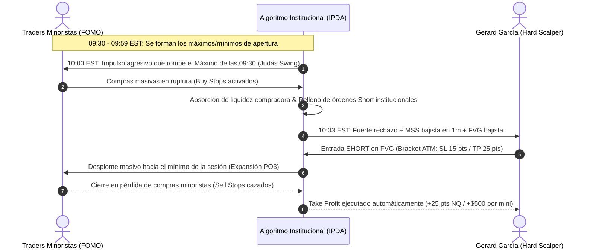
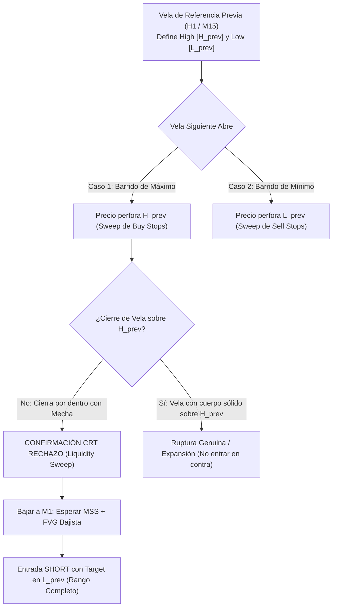
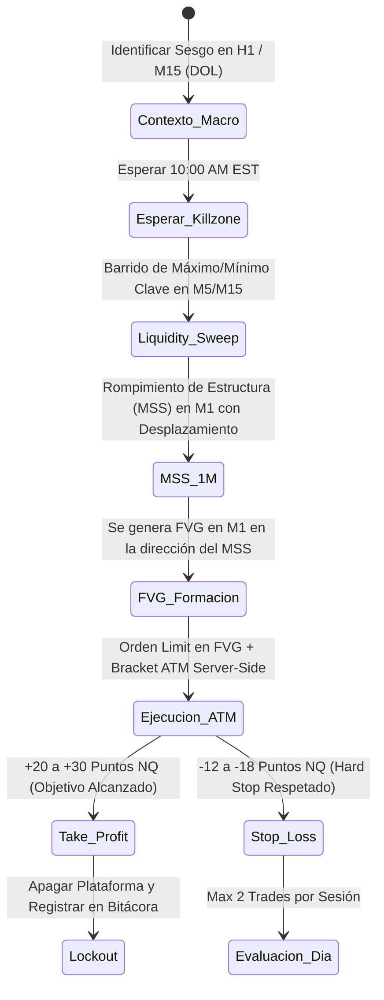
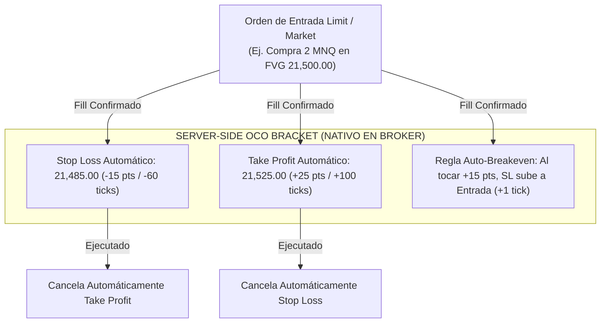
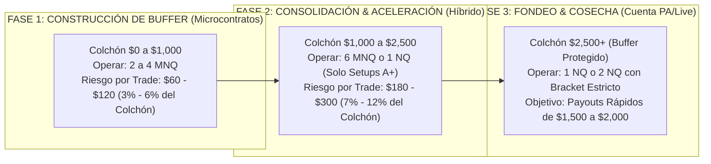
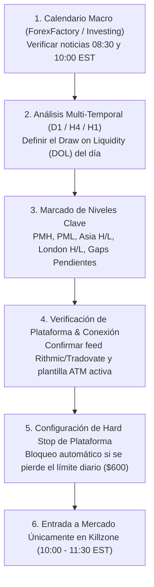

```mermaid
gantt
    title Cronograma Operativo Diario de Gerard García (Horario Nueva York EST)
    dateFormat HH:mm
    axisFormat %H:%M
    
    section Pre-Mercado
    Macro Data & Rango PMH/PML       :08:30, 09:30
    
    section Apertura NYSE
    Cash Open & Opening Range        :09:30, 10:00
    
    section Ventana de Oro
    Vela 10:00 AM & Judas Swing      :active, 10:00, 10:15
    Silver Bullet NY & Expansión     :crit, active, 10:15, 11:30
    
    section Zona Prohibida
    Chop Zone / Almuerzo Wall St     :11:30, 14:00
    
    section Cierre
    PM Session (Opcional)            :14:00, 15:30
    MOC Imbalance & Fin Sesión       :15:30, 16:00
```

# ⚡ Metodología Operativa, Horarios & Hard Scalping en Futuros CME — Doctrina Gerard García (@GerardGarciafx)

> **Tratado Maestro de Microestructura, Algoritmos de Entrega de Precio (IPDA/ICT), Teoría de Rango de Velas (CRT), Poder de Tres (PO3), Ejecución Atómica ATM y Gestión Asimétrica de Riesgo para Cuentas de Fondeo.**  
> **Proyecto:** 01 Ultrarentable | **Área:** Motor de Fondeo & Prop Firms | **Fecha:** 27 de Agosto de 2026  
> **Activos Principales:** E-mini Nasdaq 100 (`NQ`), Micro E-mini Nasdaq (`MNQ`), E-mini S&P 500 (`ES`), Micro E-mini S&P (`MES`).  
> **Plataformas de Ejecución:** NinjaTrader 8, Tradovate, Rithmic, TradingView.

---

## 🎯 Navegación y Enlaces Bidireccionales del Proyecto

- 📌 **Ficha Maestra Central:** [[Ultrarentable]]
- 🔗 **Sub-notas Maestras de Arquitectura & Capital:**
  - [[Motor de Fondeo y Prop Firms]] — *Matriz Comparativa Global de Prop Firms de Futuros CME*
  - [[Gestion de Capital — Balas y Estados]] — *Modelo de Balas, Transición de 6 Estados y Cosecha Segregada*
  - [[Plan 10 Fases]] — *Plan de Evolución de Fases Cuantitativas del Motor Ultrarentable*
  - [[Dashboard Web]] — *Consola Web y Calculadoras Interactivas (`apps/web`)*
- 📑 **Corpus Documental Especializado Tradesfera:**
  - [[01_ECOSISTEMA_TRADESFERA_Y_MODELO_DE_NEGOCIO]] — *Las 4 Puertas, Fundador, Libro Mayor y Partners*
  - [[02_MATEMATICA_BANKROLL_Y_CAPITAL_MUNICION]] — *Formulación KaTeX de Munición, EV, N Intentos y Supervivencia*
  - [[03_TEORIA_VARIANZA_Y_CONTROL_DE_RACHAS]] — *Colas Pesadas CME, Rachas Negativas, TP Cortos y Monte Carlo*
  - [[04_PROTOCOLO_INTELIGENTE_APROBACION_CUENTAS]] — *Drawdown Forense (EOD vs Intraday), Micro/Mini y Consistencia*
  - [[05_SISTEMA_MULTICUENTA_Y_COPYTRADING]] — *Cestas de 5-20 Cuentas, Replicanto NT8 y Latencias <5ms*
  - [[06_CICLO_OPTIMO_RETIROS_Y_PAYOUTS]] — *Desmitificación del Holding, Buffers de Seguridad y Reglas de Cobro*
  - [[07_PSICOLOGIA_DEL_FONDEO_Y_SESGOS_OPERATIVOS]] — *Perfil Bajo, Erradicación del Revenge Trading y Hard Stop*
  - [[08_COMPARATIVA_PROP_FIRMS_FUTUROS_CME]] — *Matriz Peras con Peras $50K/$100K, Costes Reales y Cupones*
  - [[09_INFRAESTRUCTURA_TECNICA_NINJATRADER_TOOLS]] — *Setup NinjaTrader 8, Feeds Kinetick/Rithmic y Spec Web*
  - [[10_DOSSIER_MAESTRO_TRADESFERA_FONDEO_FUTUROS]] — *Tratado Integral Unificado Tradesfera V2*
  - [[README]] — *Índice General, Glosario Técnico y Guía Rápida en 5 Pasos*

---

## 📑 Índice General del Tratado

1. **Introducción & Manifiesto del Hard Scalping en Cuentas de Fondeo**
2. **Dimensión I: El Reloj Institucional de Nueva York & Killzones de Alta Probabilidad**
   - 2.1 Matriz Horaria Maestra (EST vs CET/Madrid)
   - 2.2 Pre-Mercado NY (08:30 - 09:30 EST): Noticias Macro y Rango Inicial
   - 2.3 Apertura Cash Open (09:30 - 10:00 EST): Volatilidad Inicial y Opening Range
   - 2.4 La Vela Clave de las 10:00 AM NY: El Judas Swing y la Manipulación PO3
   - 2.5 Silver Bullet & NY Killzone (10:00 - 11:30 EST): La Ventana de Oro
   - 2.6 La Zona Muerta / Chop Zone del Mediodía (11:30 - 14:00 EST): El Veneno del Overtrading
3. **Dimensión II: El Arsenal Estratégico de Gerard García**
   - 3.1 PO3 (Power of Three / AMD): Acumulación, Manipulación y Expansión
   - 3.2 CRT (Candle Range Theory) & Barridos de Liquidez (Liquidity Sweeps)
   - 3.3 Fair Value Gaps (FVG), Consequent Encroachment (CE) e Inversión (IFVG)
   - 3.4 Hard Scalping en Microestructuras (Order Flow, Gráficos de 1m y Ticks)
4. **Dimensión III: Sistemas de Ejecución & Gestión de Órdenes ATM**
   - 4.1 Plantillas Bracket ATM (Server-Side OCO) en NinjaTrader 8 y Tradovate
   - 4.2 Parámetros ATM Exactos para NQ/MNQ y ES/MES
   - 4.3 Gestión Dinámica: Auto-Breakeven y Salidas Parciales
5. **Dimensión IV: Dimensionamiento Asimétrico de Capital y Adaptación a Prop Firms**
   - 5.1 La Trampa del Mini NQ frente al Trailing Drawdown
   - 5.2 Estrategia de Microcontratos (MNQ/MES) para Creación de Buffer
   - 5.3 Asimetría R:R vs WinRate en Evaluaciones y Cuentas Financiadas (PA)
6. **Dimensión V: Setups Operativos Paso a Paso con Ejemplos Forenses**
   - 6.1 Setup A+ 1: 10:00 AM Judas Swing + CRT Sweep + Entrada en FVG
   - 6.2 Setup A+ 2: Silver Bullet NY + Inversion FVG (IFVG) en Tendencia
7. **Dimensión VI: El Protocolo Diario de Francotirador & Las 7 Reglas Cardinales**
   - 7.1 Checklist Pre-Sesión de 6 Pasos
   - 7.2 Las 7 Reglas de Oro Innegociables de Gerard García
8. **Conclusiones & Conexión con el Ecosistema Ultrarentable**

---

## 🏛️ 1. Introducción & Manifiesto del Hard Scalping en Cuentas de Fondeo

En la industria del trading minorista y las empresas de fondeo de futuros (**CME Group**), persiste un error fatal: la creencia de que para superar una evaluación o vivir de una cuenta financiada (*Performance Account / Live*) se deben buscar movimientos macro de 100 o 200 puntos en el Nasdaq, manteniendo posiciones abiertas durante horas.

La metodología desarrollada y popularizada por **Gerard García** (@GerardGarciafx) —finalista en competiciones de prestigio como la *World Cup Trading Championship* y figura clave en la comunidad hispanohablante de futuros— establece un cambio de paradigma radical:

$$\boxed{\text{Hard Scalping} = \text{Precisión Quirúrgica} \times \text{Ventana Temporal Estricta} \times \text{R:R Asimétrico Corto} \times \text{Cero Apego Emocional}}$$

```mermaid
graph TD
    subgraph "PARADIGMA SWING / RETAIL CONVENCIONAL"
        A1["Busca R:R 1:5 o 1:10 (100+ pts NQ)"] --> A2["Largo Tiempo de Exposición (1-4 horas)"]
        A2 --> A3["Floating Profit sube el Trailing Drawdown"]
        A3 --> A4["Retroceso del Mercado devora el Colchón"]
        A4 --> A5["Quiebra de Cuenta por Drawdown Intradía"]
    end

    subgraph "PARADIGMA HARD SCALPING GERARD GARCIA"
        B1["Busca Ineficiencias de Alta Probabilidad (15-30 pts NQ)"] --> B2["Ultra-corta Exposición (1 a 15 minutos)"]
        B2 --> B3["Ejecución Bracket ATM Automático (OCO)"]
        B3 --> B4["Tasa de Acierto Elevada (65% - 75% WinRate)"]
        B4 --> B5["Retiros Constantes & Cero Riesgo del Beneficio Flotante"]
    end
```



### Principios Fundamentales del Manifiesto:
1. **El Trailing Drawdown castiga la codicia:** En empresas como Apex, Bulenox o cuentas con trailing intradía al pico (*Intraday Peak*), dejar correr una posición que va ganando $+1,200$ para buscar $+3,000$ eleva el umbral de liquidación $+1,200$. Si el precio retrocede y cierra en $+200$, se han destruido $\$1,000$ de margen de maniobra. El Hard Scalping ejecuta salidas inmediatas en zonas de liquidez obvia.
2. **El Mercado de Futuros es un Algoritmo de Entrega de Tiempo y Precio:** El precio no se mueve por volumen aleatorio de compradores y vendedores minoristas, sino por algoritmos institucionales (*Interbank Price Delivery Algorithm - IPDA*) programados para neutralizar liquidez (*Sweeps*) y rebalancear ineficiencias (*Fair Value Gaps*) en ventanas horarias estrictas (*Killzones*).
3. **Especialización Monoinstrumento:** Dominio exclusivo de los índices rectores del mercado estadounidense: **Nasdaq 100 (`NQ` / `MNQ`)** por su volatilidad expansiva y **S&P 500 (`ES` / `MES`)** por su estructura limpia y respeto institucional.

---

## ⏰ 2. Dimensión I: El Reloj Institucional de Nueva York & Killzones de Alta Probabilidad

En la doctrina de Gerard García, **el tiempo precede al precio**. Un setup técnico perfecto fuera del horario institucional carece de respaldo volumétrico y se convierte en una trampa estadística.

### 2.1 Matriz Horaria Maestra (EST vs Madrid CET/CEST)

| Franja Horaria (EST / New York) | Horario Madrid (CET / CEST) | Fase de Mercado | Dinámica Algorítmica & Volatilidad | Calificación de Operabilidad |
|---|---|---|---|:---:|
| **08:30 – 09:30 EST** | 14:30 – 15:30 | **Pre-Mercado NY (Macro Releases)** | Noticias de alto impacto (CPI, PPI, NFP, Jobless). Formación del rango de premercado (PMH/PML). | ⚠️ **Media / Cautela** (Solo si hay catalizador claro) |
| **09:30 – 10:00 EST** | 15:30 – 16:00 | **Cash Open (Apertura NYSE)** | Campana de Wall Street. Inyección masiva de volumen minorista e institucional. Volatilidad caótica inicial. | ⚠️ **Alta Dificultad** (Esperar estabilización o setup A+) |
| **10:00 – 10:15 EST** | 16:00 – 16:15 | **La Vela Clave de las 10:00 AM** | Apertura de vela horaria 10:00 AM + Noticias de 2º nivel (ISM, Sentiment). **Judas Swing / Manipulación PO3**. | 💎 **MÁXIMA PROBABILIDAD (A+)** |
| **10:15 – 11:30 EST** | 16:15 – 17:30 | **Silver Bullet & NY Killzone** | Expansión direccional limpia hacia el *Draw on Liquidity* (DOL). Respeto absoluto de FVGs y CRT. | 💎 **MÁXIMA PROBABILIDAD (A+)** |
| **11:30 – 14:00 EST** | 17:30 – 20:00 | **Chop Zone / Lunch Hour (Mediodía)** | Almuerzo en Nueva York. Retirada de mesas de dinero. Algoritmos de rango y barrido bilateral (*Whipsaws*). | 🚫 **PROHIBIDO OPERAR (Zona Muerta)** |
| **14:00 – 15:30 EST** | 20:00 – 21:30 | **PM Session / Afternoon Killzone** | Reanudación del flujo de órdenes hacia el cierre. Continuación o reversión del día. | ⚡ **Media** (Aceptable si no se cumplió objetivo) |
| **15:30 – 16:00 EST** | 21:30 – 22:00 | **Market-On-Close (MOC Imbalance)** | Ajustes de carteras institucionales. Spikes erráticos de volumen. | 🚫 **NO OPERABLE (Riesgo de Deslizamiento)** |

---



---

### 2.2 Pre-Mercado NY (08:30 – 09:30 EST / 14:30 – 15:30 Madrid)
- **Catalizadores Macroeconómicos:** A las 08:30 EST se publican los informes fundamentales de mayor relevancia (NFP, CPI, PPI, Retail Sales, Unemployment Claims).
- **Marcado de Niveles:** El trader debe identificar y marcar en el gráfico:
  - **PMH (*Pre-Market High*):** Máximo generado entre las 00:00 y las 09:30 EST.
  - **PML (*Pre-Market Low*):** Mínimo generado en la sesión nocturna / pre-mercado.
  - **Asia High / Low & London High / Low.**
- **Comportamiento:** Si a las 08:30 sale una noticia que barre el PMH con fuerza y crea una divergencia SMT con el S&P 500, el sesgo (*bias*) para la apertura queda prefijado hacia las zonas de liquidez contrarias.

### 2.3 Apertura Cash Open (09:30 – 10:00 EST / 15:30 – 16:00 Madrid)
- **La Campana de Wall Street:** A las 09:30 EST abren las acciones al contado (Apple, Microsoft, Nvidia, Tesla). La volatilidad en `NQ` y `ES` se dispara exponencialmente.
- **El Peligro del *Opening Range Breakout (ORB)* Minorista:** Los traders novatos entran en persecución de la primera vela verde o roja de 1 minuto. Los algoritmos institucionales suelen generar falsas rupturas en los primeros 10-15 minutos para acumular contrapartida.
- **Regla Gerard García:** *Paciencia activa*. Observar si la apertura expande directamente hacia un nivel clave o si está preparando la trampa para las 10:00 AM.

---

### 2.4 La Vela Clave de las 10:00 AM NY: El Judas Swing y la Manipulación PO3

La vela de las **10:00 AM EST (16:00 Madrid)** es el pivote algorítmico más crítico de toda la sesión americana. 



#### Anatomía Forense del Judas Swing de las 10:00 AM:
1. **Publicación de Datos Macro de las 10:00 EST:** Indicadores como el *ISM Manufacturing PMI*, *ISM Services*, *Consumer Confidence (CB)* o *New Home Sales* actúan como coartada perfecta para inyectar volatilidad.
2. **Apertura de la Nueva Vela Horaria (H1):** La vela de 10:00 a 11:00 EST necesita formar su mecha de manipulación (*High of the Day* o *Low of the Day*).
3. **Mecánica del Barrido:** Si el algoritmo planea distribuir a la baja durante la mañana:
   - Sube con violencia entre las 10:00 y las 10:07 EST.
   - Rompe el máximo del día previo, el PMH o el máximo de las 09:30-09:59.
   - Toma los *Buy Stops* de los vendedores en corto e induce a los compradores de breakout.
   - Deja una mecha de rechazo institucional, cambia de estructura en 1 minuto (*MSS*) y deja un *Fair Value Gap (FVG)*.
   - Éste es el punto exacto de entrada para el Hard Scalping.

---

### 2.5 Silver Bullet & NY Killzone (10:00 – 11:30 EST / 16:00 – 17:30 Madrid)
- **Definición ICT / Metodología Futuros:** La ventana comprendida entre las **10:00 y las 11:00 EST** (con extensión operativa de Gerard García hasta las 11:30 EST) es estadísticamente el periodo con menor coeficiente de ruido y mayor predictibilidad matemática de la jornada.
- **Objetivo Típico de la Silver Bullet:**
  - En `NQ`: Movimiento limpio de **20 a 50 puntos**.
  - En `ES`: Movimiento limpio de **5 a 12 puntos**.
- **Condición de Salida Inmediata:** Una vez que el precio alcanza el *Draw on Liquidity* (mínimo/máximo opuesto de la sesión, gap de apertura o nivel diario clave), el trade se cierra íntegramente. No se deja flotante expuesto a la siguiente fase.

---

### 2.6 La Zona Muerta / Chop Zone del Mediodía (11:30 – 14:00 EST / 17:30 – 20:00 Madrid)

> [!CAUTION]
> **ZONA DE ANIQUILACIÓN DE CUENTAS DE FONDEO:**  
> Más del 70% de las quiebras de cuentas de fondeo registradas en el Libro Mayor ocurren entre las 11:30 y las 14:00 EST por operar en la *Chop Zone* del almuerzo neoyorquino.

```text
┌──────────────────────────────────────────────────────────────────────────────────────────────────┐
│                      POR QUÉ EL MEDIODÍA DE NUEVA YORK ES MATEMÁTICAMENTE TÓXICO                 │
├──────────────────────────────────────────────────────────────────────────────────────────────────┤
│ 1. Drenaje de Volumen Institucional: Los directores de mesa y algoritmos principales pausan su   │
│    actividad direccional para el almuerzo en Wall Street.                                        │
│ 2. Algoritmos de Market Making (MM): El mercado pasa a ser controlado por algoritmos de cotización│
│    pasiva que barren 5-10 puntos arriba y abajo para capturar el spread, sin generar tendencia.   │
│ 3. Whipsaws y Falsos Rompimientos: Los soportes y resistencias se rompen por 2 ticks y revierten, │
│    activando consecutivamente Stop Losses en ambas direcciones.                                  │
│ 4. Regla Gerard García: "Cierra la plataforma a las 11:30 EST. Si ganaste, protege tu dinero.    │
│    Si perdiste, asume el stop. Quedarte al mediodía es garantía de revenge trading y quiebra."   │
└──────────────────────────────────────────────────────────────────────────────────────────────────┘
```

---

## 🛠️ 3. Dimensión II: El Arsenal Estratégico de Gerard García

La metodología técnica unifica conceptos clave de la teoría institucional adaptados al gráfico de futuros en tiempo real.

### 3.1 PO3 (Power of Three / AMD): Acumulación, Manipulación y Expansión

El modelo **Power of Three (PO3)**, conceptualizado originalmente por Michael J. Huddleston (ICT) y aplicado con rigor mecánico por Gerard García, describe el ciclo de vida fractal de cualquier vela o sesión:

$$\text{Ciclo PO3} = \text{Acumulación (A)} \longrightarrow \text{Manipulación (M)} \longrightarrow \text{Distribución / Expansión (D)}$$

```text
       [SESIÓN ALCISTA - BULLISH PO3]                  [SESIÓN BAJISTA - BEARISH PO3]

                   HIGH (Distribución)                              OPEN (Apertura)
                    │                                                ┌──────┴──────┐
                    │                                                │ Acumulación │
              ┌─────┴─────┐                                          └──────┬──────┘
              │ Expansión │                                                 ▲
              └─────┬─────┘                                                 │ HIGH (Manipulación / Judas)
                    ▲                                                       ▼
                    │                                                ┌──────┴──────┐
             ┌──────┴──────┐                                         │ Expansión   │
             │ Acumulación │                                         │ Direccional │
             └──────┬──────┘                                         └──────┬──────┘
                    ▼                                                       │
                   LOW (Manipulación / Judas)                              LOW (Distribución)
```

#### Aplicación Intradía en Futuros NQ/ES:
1. **Acumulación (08:00 – 09:59 EST):** El precio oscila en un rango delimitado, acumulando posiciones de ambos lados.
2. **Manipulación / Judas Swing (10:00 – 10:15 EST):** El precio rompe violentamente uno de los extremos del rango, induciendo compras/ventas emocionales.
3. **Expansión / Distribución (10:15 – 11:30 EST):** El precio acelera en dirección opuesta al Judas Swing, cubriendo ineficiencias hasta alcanzar el objetivo de liquidez.

---

### 3.2 CRT (Candle Range Theory) & Barridos de Liquidez (Liquidity Sweeps)

La **Candle Range Theory (CRT)** postula que el rango de una vela de referencia (típicamente de temporalidad superior: 4H, 1H o 15m) define los límites operativos de la siguiente vela.



#### Reglas de Validación de un Barrido CRT (Liquidity Sweep):
- **Condición de Mecha (*Wick Sweep*):** El precio debe superar el extremo previo ($H_{\text{prev}}$ o $L_{\text{prev}}$) únicamente con la mecha, cerrando el cuerpo de la vela por dentro del rango anterior.
- **Divergencia SMT (Smart Money Tool):** Si el `NQ` supera su máximo previo pero el `ES` falla en superarlo (*Divergencia de Correlación Intermercado*), el barrido queda confirmado con un 85%+ de fiabilidad institucional.
- **Fórmula de Rango Operativo CRT:**

$$\Delta R_{\text{CRT}} = |H_{\text{prev}} - L_{\text{prev}}| \quad \Longrightarrow \quad \text{Target}= L_{\text{prev}} \pm \delta_{\text{buffer}}$$

---

### 3.3 Fair Value Gaps (FVG), Consequent Encroachment (CE) e Inversión (IFVG)

Un **Fair Value Gap (FVG)** es una ineficiencia de tres velas consecutivas donde la mecha de la Vela 1 y la mecha de la Vela 3 no se solapan, dejando un vacío de liquidez unilateral en la Vela 2.

```text
     [BULLISH FVG - Ineficiencia Alcista]           [BEARISH FVG - Ineficiencia Bajista]

            [Vela 3]                                       [Vela 1]
             │ █ │  (Low de Vela 3)                         │ █ │  (High de Vela 1)
             └───┘                                          └───┘
               ▲                                              ▲
               │  [FAIR VALUE GAP]                            │  [FAIR VALUE GAP]
               │  Zona de Ineficiencia                        │  Zona de Ineficiencia
               │  CE (50% del Gap) ───                        │  CE (50% del Gap) ───
               ▼                                              ▼
             ┌───┐                                          ┌───┐
             │ █ │  (High de Vela 1)                        │ █ │  (Low de Vela 3)
            [Vela 1]                                       [Vela 3]
```

#### Tipos de Ineficiencias y Modos de Entrada:
1. **Regular FVG:** Entrada al toque del límite exterior del gap o al **Consequent Encroachment (CE)**, que corresponde exactamente al $50\%$ del rango del gap:

$$\text{Nivel CE} = \text{Low}_{\text{Vela 3}} + 0.50 \times \left( \text{High}_{\text{Vela 1}} - \text{Low}_{\text{Vela 3}} \right) \quad (\text{en FVG Alcista})$$

2. **Inversion Fair Value Gap (IFVG):** Cuando un FVG previo no es respetado y el precio lo cruza con una vela de cuerpo completo, el gap **invierte su polaridad**:
   - Un FVG alcista perforado a la baja se convierte en una **resistencia de entrada para ventas (Short IFVG)**.
   - Un FVG bajista perforado al alza se convierte en un **soporte de entrada para compras (Long IFVG)**.

---

### 3.4 Hard Scalping en Microestructuras (Order Flow, 1m y Ticks)

El Hard Scalping de Gerard García se ejecuta en la microestructura de **1 minuto (`1m`)** o gráficos de volumen/ticks (**1000 a 2000 ticks en NQ**):



#### Gatillos de Entrada (*Triggers*) de Hard Scalping:
- **Desplazamiento Claro:** La vela que genera el cambio de estructura (*Market Structure Shift - MSS*) debe tener un cuerpo sólido que cierre por fuera del último swing high/low. No se aceptan mechas vacilantes.
- **Tiempo de Permanencia:** El trade debe resolverse en un intervalo de **2 a 15 minutos**. Si tras 20 minutos el precio se queda oscilando en la zona de entrada sin expandir, Gerard García recomienda cerrar la posición a mercado o en *breakeven*, ya que la ventaja temporal ha caducado.

---

## ⚙️ 4. Dimensión III: Sistemas de Ejecución & Gestión de Órdenes ATM

En el trading de futuros de alta velocidad, la gestión manual del Stop Loss y Take Profit es inviable y propensa a desastres por deslizamiento o bloqueo emocional. Se exige el uso estricto de estrategias **ATM (Advanced Trade Management)** con arquitectura **Server-Side OCO (*One-Cancels-Other*)**.

### 4.1 Arquitectura Bracket ATM



---

### 4.2 Parámetros ATM Exactos para NQ/MNQ y ES/MES

A continuación se detalla la parametrización técnica exacta para configurar las plantillas ATM en **NinjaTrader 8** y **Tradovate**:

| Parámetro ATM | Micro Nasdaq (`MNQ`) | E-mini Nasdaq (`NQ`) | Micro S&P 500 (`MES`) | E-mini S&P 500 (`ES`) |
|---|---|---|---|---|
| **Tipo de Parámetro** | Ticks ($1\text{ pt} = 4\text{ ticks}$) | Ticks ($1\text{ pt} = 4\text{ ticks}$) | Ticks ($1\text{ pt} = 4\text{ ticks}$) | Ticks ($1\text{ pt} = 4\text{ ticks}$) |
| **Stop Loss (SL)** | **60 ticks** (15.0 puntos = $\$30.00$ / contrato) | **60 ticks** (15.0 puntos = $\$300.00$ / contrato) | **16 ticks** (4.0 puntos = $\$20.00$ / contrato) | **16 ticks** (4.0 puntos = $\$200.00$ / contrato) |
| **Profit Target (TP)** | **100 ticks** (25.0 puntos = $\$50.00$ / contrato) | **100 ticks** (25.0 puntos = $\$500.00$ / contrato) | **28 ticks** (7.0 puntos = $\$35.00$ / contrato) | **28 ticks** (7.0 puntos = $\$350.00$ / contrato) |
| **Auto-Breakeven Trigger** | **60 ticks** (+15.0 puntos) | **60 ticks** (+15.0 puntos) | **16 ticks** (+4.0 puntos) | **16 ticks** (+4.0 puntos) |
| **Auto-BE Offset** | **+4 ticks** (+1.0 punto / cubre comisiones) | **+4 ticks** (+1.0 punto / cubre comisiones) | **+1 tick** (+0.25 puntos / cubre comisiones) | **+1 tick** (+0.25 puntos / cubre comisiones) |
| **Ratio R:R Base** | **1 : 1.67** | **1 : 1.67** | **1 : 1.75** | **1 : 1.75** |
| **Duración Máxima Trade** | $\le 15$ minutos | $\le 15$ minutos | $\le 20$ minutos | $\le 20$ minutos |

---

### 4.3 Gestión Dinámica: Auto-Breakeven y Salidas Escalonadas

Para traders que operan con **2 o más contratos** (ej. 2 minis o 4 micros):
- **Contrato 1 (Scaler):** Se cierra automáticamente al alcanzar **+20 puntos en NQ** (+80 ticks).
- **Activación de Breakeven:** Inmediatamente al cerrarse el Contrato 1, el Stop Loss del Contrato 2 se desplaza automáticamente a precio de entrada $+1$ punto.
- **Contrato 2 (Runner):** Se deja correr hasta el siguiente nivel de liquidez mayor (DOL en M15) o hasta un máximo de **+40 puntos en NQ**.

---

## 📊 5. Dimensionamiento Asimétrico de Capital y Adaptación a Prop Firms

El mayor secreto de la consistencia de Gerard García en empresas de fondeo no es una fórmula mágica de análisis técnico, sino su **tratamiento matemático del colchón de drawdown**.

### 5.1 La Trampa del Mini NQ frente al Trailing Drawdown

En una cuenta estándar de **$50,000 USD** con un **Trailing Drawdown de $2,000 USD**:

$$\text{Colchón Operativo Real } (C_{\text{op}}) = \text{Balance Actual} - \text{Umbral de Liquidación} = \$2,000\,\text{USD}$$

Si un trader opera **1 contrato Mini de Nasdaq (`NQ`)** con un Stop Loss de 20 puntos:
- Pérdida monetaria por trade: $20\text{ pts} \times \$20/\text{pt} = \$400\,\text{USD}$ (más comisiones $\approx \$405$).
- Porcentaje de vida de la cuenta consumido en UN solo trade perdedor:

$$\text{Riesgo por Trade } (\%) = \frac{\$405}{\$2,000} \times 100 = \mathbf{20.25\% \text{ del Colchón Total}}$$

> [!WARNING]
> Con un riesgo del 20.25% por operación, una racha estadística común de **3 pérdidas consecutivas consume el 60.75% de la cuenta**, dejando al trader en estado de pánico y garantizando el fallo por revenge trading.

---

### 5.2 Estrategia de Microcontratos (MNQ/MES) para Creación de Buffer

Gerard García recomienda un protocolo estricto de **escalado por fases según el estado del colchón**:



---

### 5.3 Asimetría R:R vs WinRate en Evaluaciones y Cuentas Financiadas

Muchos traders intentan aplicar ratios $1:4$ o $1:5$ con WinRates bajos ($30\%-40\%$). En cuentas con **Trailing Drawdown Intradía**, este modelo colapsa por la siguiente demostración matemática:

$$\mathbb{E}[\text{Trade}] = (W \times \text{TP}) - ((1 - W) \times \text{SL})$$

Para el modelo de Gerard García con Hard Scalping:
- $W = 0.70$ (70% WinRate)
- $\text{TP} = +25\text{ pts} = +\$500$ (en 1 NQ)
- $\text{SL} = -15\text{ pts} = -\$300$ (en 1 NQ)

$$\mathbb{E}[\text{Trade}] = (0.70 \times 500) - (0.30 \times 300) = 350 - 90 = \mathbf{+\$260\,\text{USD por trade}}$$

#### Ventaja Crítica frente al Trailing Drawdown:
Al tomar beneficios a los 25 puntos en lugar de esperar 100 puntos:
1. La posición pasa menos del $5\%$ del tiempo en retroceso (*drawdown flotante*).
2. El umbral de liquidación no es arrastrado artificialmente hacia arriba por picos flotantes no realizados.
3. Se reduce la varianza de rachas negativas consecutivas ($L_{\max}$ disminuye drásticamente).

---

## 🎯 6. Dimensión V: Setups Operativos Paso a Paso con Ejemplos Forenses

### 6.1 Setup A+ 1: 10:00 AM Judas Swing + CRT Sweep + Entrada en FVG

```text
┌──────────────────────────────────────────────────────────────────────────────────────────────────┐
│                   SETUP FORENSE 1: VELA 10:00 AM JUDAS SWING + REVERSIÓN A+                      │
├──────────────────────────────────────────────────────────────────────────────────────────────────┤
│ ACTIVO: E-mini Nasdaq 100 (NQ)                                                                   │
│ CONTEXTO: Rango de Pre-Mercado (08:30-09:30) delimitado entre 21,420 (PML) y 21,480 (PMH).       │
│ SESGO DIARIO: Bajista hacia el mínimo del día anterior (DOL = 21,350).                            │
├──────────────────────────────────────────────────────────────────────────────────────────────────┤
│ PASO 1 (10:00 EST): Se abre la vela H1 de las 10:00 AM. El precio dispara un impulso alcista     │
│        agresivo, rompiendo el PMH (21,480) y marcando 21,495 (Judas Swing).                      │
│ PASO 2 (10:04 EST): La vela de M5 cierra en 21,475 dejando una mecha de rechazo superior de 20  │
│        puntos (Sweep confirmado según CRT, no hubo cierre sobre 21,480).                         │
│ PASO 3 (10:05 EST): En gráfico M1, se produce un desplazamiento bajista con cuerpo sólido que     │
│        rompe el último mínimo estructural (MSS en 21,468) y crea un Bearish FVG entre 21,478    │
│        y 21,472.                                                                                 │
│ PASO 4 (10:07 EST): Entrada ejecutada vía Orden Sell Limit en 21,474 (CE del FVG en M1).         │
│ PASO 5 (PARÁMETROS ATM):                                                                         │
│        • Stop Loss: 21,489 (-15 puntos = -$300 USD en 1 NQ / -$30 en 1 MNQ).                    │
│        • Profit Target: 21,449 (+25 puntos = +$500 USD en 1 NQ / +$50 en 1 MNQ).                │
│        • Auto-Breakeven: Al tocar 21,459 (+15 pts), SL pasa a 21,473 (+1 pt).                   │
│ PASO 6 (10:14 EST): Expansión rápida. Target alcanzado en 21,449 (+25 pts). Trade finalizado.   │
└──────────────────────────────────────────────────────────────────────────────────────────────────┘
```

---

### 6.2 Setup A+ 2: Silver Bullet NY + Inversion FVG (IFVG) en Tendencia

```text
┌──────────────────────────────────────────────────────────────────────────────────────────────────┐
│                   SETUP FORENSE 2: SILVER BULLET 10:30 AM + INVERSION FVG                        │
├──────────────────────────────────────────────────────────────────────────────────────────────────┤
│ ACTIVO: E-mini S&P 500 (ES)                                                                      │
│ CONTEXTO: Mercado fuertemente alcista tras la apertura de Wall Street.                             │
│ SESGO: Expansión hacia Buy-Side Liquidity en 5,980.00.                                           │
├──────────────────────────────────────────────────────────────────────────────────────────────────┤
│ PASO 1 (10:30 EST): El precio retrocede en M5 y genera un pequeño FVG bajista entre 5,958.00    │
│        y 5,960.00.                                                                               │
│ PASO 2 (10:33 EST): Una vela alcista institucional de 1 minuto perfora con cuerpo completo el   │
│        FVG bajista hasta 5,963.00, invalidándolo y convirtiéndolo en un Bullish IFVG.            │
│ PASO 3 (10:35 EST): El precio hace un pullback lento hacia el techo del IFVG (5,960.00).         │
│ PASO 4 (EJECUCIÓN): Buy Limit en 5,960.25.                                                       │
│ PASO 5 (PARÁMETROS ATM ES):                                                                      │
│        • Stop Loss: 5,956.25 (-4.0 puntos = -16 ticks = -$200 USD por contrato ES).              │
│        • Take Profit: 5,967.25 (+7.0 puntos = +28 ticks = +$350 USD por contrato ES).            │
│ PASO 6 (10:48 EST): TP ejecutado limpiamente (+7 puntos ES / +$350 por contrato).                │
└──────────────────────────────────────────────────────────────────────────────────────────────────┘
```

---

## 📋 7. Dimensión VI: El Protocolo Diario de Francotirador & Las 7 Reglas Cardinales

### 7.1 Checklist Pre-Sesión de 6 Pasos



---

### 7.2 Las 7 Reglas de Oro Innegociables de Gerard García

1. **Máximo 2 Operaciones por Sesión:** Si la primera operación es ganadora, el día está terminado. Si la primera es perdedora, solo se permite un segundo intento bajo un setup A+. Dos pérdidas consecutivas significan **apagado inmediato de pantalla**.
2. **Prohibido Operar Fuera de Killzones:** Queda terminantemente vetado meter órdenes durante el almuerzo de Nueva York (11:30 a 14:00 EST) o en la sesión asiática con cuentas fondeadas.
3. **El Bracket ATM es Inmodificable:** Una vez enviada la orden, **está estrictamente prohibido mover el Stop Loss hacia atrás** para "darle aire al precio". Si el stop se toca, se acepta como parte del coste de hacer negocios.
4. **Respeto a la Regla de Consistencia:** En firmas como Apex, Tradeify o MyFundedFutures, ningún día de trading puede representar más del $30\%-40\%$ del beneficio total. El Hard Scalping garantiza ganancias homogéneas de $\$400 - \$800$ diarios, cumpliendo la consistencia a la perfección.
5. **Transición Mental de Evaluación a Cuenta PA:** Cuando se aprueba un examen, no se aumentan los contratos. Se disminuye el tamaño a microcontratos hasta construir el **Safety Buffer ($52,100+)**.
6. **Doctrina del *Silent Trader* (Perfil Bajo):** Cero publicaciones de capturas de beneficios en redes sociales para inflar el ego. El trading profesional es una actividad privada, aburrida y mecánica de extracción monetaria.
7. **Cosecha Inmediata (Regla 50/30/20):** Al calificar para un retiro, se extrae el dinero de inmediato. Las cuentas de fondeo son herramientas transitorias de capitalización, no cuentas de jubilación a largo plazo.

---

## 🔗 8. Conclusiones & Conexión con el Ecosistema Ultrarentable

La metodología técnica de **Gerard García** (@GerardGarciafx) constituye el motor táctico de ejecución más eficaz y probado para operar cuentas de fondeo de futuros CME dentro de la arquitectura global de **01 Ultrarentable**:

```mermaid
graph TD
    subgraph "ARQUITECTURA INTEGRADA ULTRARENTABLE & TRADESFERA"
        T1["01 Tradesfera: Ecosistema & Bankroll de Munición\n[[01_ECOSISTEMA_TRADESFERA_Y_MODELO_DE_NEGOCIO]]"] --> T2["04 Protocolo Inteligente de Aprobación\n[[04_PROTOCOLO_INTELIGENTE_APROBACION_CUENTAS]]"]
        T2 --> T3["11 Metodología Gerard García: Hard Scalping & Killzones\n[[11_ESTRATEGIAS_Y_HORARIOS_GERARD_GARCIA_FUTUROS]]"]
        T3 --> T4["05 Trade Copier Multicuenta (Replicanto NT8)\n[[05_SISTEMA_MULTICUENTA_Y_COPYTRADING]]"]
        T4 --> T5["06 Ciclo de Retiros & Safety Buffers\n[[06_CICLO_OPTIMO_RETIROS_Y_PAYOUTS]]"]
        T5 --> T6["Ultrarentable: Balas, Estados y Cosecha Segregada\n[[Gestion de Capital — Balas y Estados]]"]
    end
```



### Síntesis Operativa Final:
- **Activo:** Nasdaq 100 (`NQ` / `MNQ`) o S&P 500 (`ES` / `MES`).
- **Horario:** 10:00 – 11:30 EST (16:00 – 17:30 Madrid).
- **Setup:** Judas Swing 10:00 AM + CRT Liquidity Sweep + Entrada en M1 FVG / IFVG.
- **Ejecución:** Bracket ATM (NQ: SL 15 pts / TP 25 pts; ES: SL 4 pts / TP 7 pts).
- **Riesgo:** Microcontratos en fase de buffer; Minis solo con colchón consolidado.
- **Resultado:** Aprobación sistemática de evaluaciones, preservación de cuentas PA y retiros periódicos sin estrés emocional.
