# 🧠 TRATADO DE MAESTRÍA PSICOLÓGICA Y PROTOCOLOS CLÍNICOS-OPERATIVOS: LA DOCTRINA DE VÍCTOR CORRALES (@ELPSICOLOGODELTRADING) EN EL FONDEO DE FUTUROS CME

> **Guía Clínica, Neurobiológica y Operativa para la Superación del Autosabotaje, Blindaje del Drawdown y Consistencia en Cuentas Financiadas (PA / Live Sim / Funded)**  
> *Desarrollo integral basado en la psicoterapia cognitivo-conductual, neurociencia aplicada y protocolos de choque de **Víctor Corrales** (@Elpsicologodeltrading), integrado en la arquitectura cuantitativa de **Tradesfera**.*  
> **Proyecto:** 01 Ultrarentable | **Área:** Psicología de Alto Rendimiento | **Fecha:** 27 de Agosto de 2026

---

## 🎯 0. Navegación y Enlaces Bidireccionales del Corpus

- 📌 **Ficha Central del Sistema:** [[Ultrarentable]]
- 🔗 **Módulos de Gestión y Capital:**
  - [[Gestion de Capital — Balas y Estados]] — *Modelo de Balas, Transición de 6 Estados y Cosecha Segregada*
  - [[02_MATEMATICA_BANKROLL_Y_CAPITAL_MUNICION]] — *Matemática de Bankroll, Supervivencia y Asimetría*
  - [[03_TEORIA_VARIANZA_Y_CONTROL_DE_RACHAS]] — *Varianza, Colas Pesadas y Control de Rachas Negativas*
  - [[04_PROTOCOLO_INTELIGENTE_APROBACION_CUENTAS]] — *Protocolo Escalonado de Pase de Evaluaciones*
  - [[06_CICLO_OPTIMO_RETIROS_Y_PAYOUTS]] — *Extracción Sistemática y Colchones de Seguridad (Buffers)*
  - [[07_PSICOLOGIA_DEL_FONDEO_Y_SESGOS_OPERATIVOS]] — *Tratado General de Psicotrading y Sesgos Cognitivos*
  - [[10_DOSSIER_MAESTRO_TRADESFERA_FONDEO_FUTUROS]] — *Dossier Maestro Unificado del Ecosistema*
- 🌐 **Plataforma Web & Dashboard:** `http://localhost:3000/prop-firms` | `http://localhost:3000/trading-desk/riesgo`

---

## 🏛️ 1. Marco Epistemológico: La Terapia Cognitivo-Conductual y la Neurociencia del Trading

El trading minorista en cuentas de fondeo de futuros (**CME Group**: MNQ, MES, NQ, ES, YM, CL, GC) constituye uno de los entornos más agresivos de **sobrecarga neuroquímica y disonancia cognitiva** que existen en la actividad profesional moderna.

A diferencia del trading institucional —donde existen comités de riesgo, mesas segregadas de ejecución, algoritmos de contención y límites de pérdida fijados por terceros—, el trader particular de prop firms actúa como **analista, ejecutor, gestor de riesgo y paciente psiquiátrico simultáneamente**.

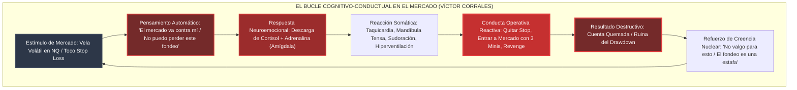

Como establece **Víctor Corrales (@Elpsicologodeltrading)**, el fallo del operador nunca es un problema de "falta de fuerza de voluntad" o "ignorancia técnica". Es la consecuencia directa de una **arquitectura biológica ancestral (cerebro reptiliano y límbico)** intentando operar en un entorno puramente contraintuitivo, artificial y probabilístico para el cual la evolución no nos preparó.

---

## ⚡ 2. El 'Shock del Fondeado' (The Funded Account Syndrome)

### 2.1 La Paradoja de la Transición Demo $\longrightarrow$ PA/Live

El **"Shock del Fondeado"** es el colapso psicológico, parálisis decisional y sobrepresión que sufre un trader en las primeras **48 a 72 horas** tras superar una cuenta de evaluación y recibir las credenciales de su cuenta financiada (*Performance Account / Live Sim / Funded Account*).

```text
┌────────────────────────────────────────────────────────────────────────────────────────────────────────┐
│                                LA PARADOJA DEL SHOCK DEL FONDEADO                                      │
├────────────────────────────────────────────────────┬───────────────────────────────────────────────────┤
│ FASE DE EVALUACIÓN (CHALLENGE / DEMO)              │ FASE FONDEADA (PA / LIVE SIM)                     │
├────────────────────────────────────────────────────┼───────────────────────────────────────────────────┤
│ • Coste de entrada: $35 - $60 USD (con cupón)      │ • Pago de Activación: $140 - $150 USD             │
│ • Percepción psicológica: "Juego de simulación"    │ • Percepción: "Capital real / Mi futuro en juego" │
│ • Fisiología: Relajada, desapegada, fluida         │ • Fisiología: Hipervigilancia, rigidez muscular   │
│ • Ejecución: Cero dudas en entradas del plan       │ • Ejecución: Parálisis por análisis o FOMO tardío │
│ • Gestión del trade: Deja correr hasta Take Profit │ • Gestión: Corta en +$40 y deja correr -$350      │
│ • Resultado: Tasa de aprobación > 25%              │ • Resultado: Quiebra de cuenta en menos de 3 días │
└────────────────────────────────────────────────────┴───────────────────────────────────────────────────┘
```

### 2.2 Etiología Clínica del Shock

1. **La Amenaza a la Identidad y Pérdida de Estatus:**  
   Al aprobar el examen, el cerebro adopta la etiqueta de *"Trader Fondeado"*. Perder la cuenta ya no es un mero revés estadístico; es una amenaza directa a la autoestima, al estatus percibido frente a la comunidad, la pareja o el entorno.
2. **Aversión Asimétrica a la Pérdida (Kahneman & Tversky):**  
   El dolor psicológico de perder el fondeo recién adquirido es entre **2.5 y 3 veces superior** al placer que generó conseguirlo. La mente entra en modo *"proteger a toda costa"*, lo que paradójicamente dispara conductas que garantizan la pérdida.
3. **El Efecto de "Cierre Prematuro por Alivio" (Disposición Inversa):**  
   Al ver un trade con flotante positivo de $+\$60$, el operador experimenta una ansiedad insoportable de que el mercado se lo quite. Cierra manualmente. Minutos después, el precio vuela $+150$ puntos a su favor ($+\$600$). En el trade perdedor, la esperanza irracional lo paraliza: no acepta el Stop Loss de $-\$150$ y aguanta hasta el toque fatal del Drawdown.

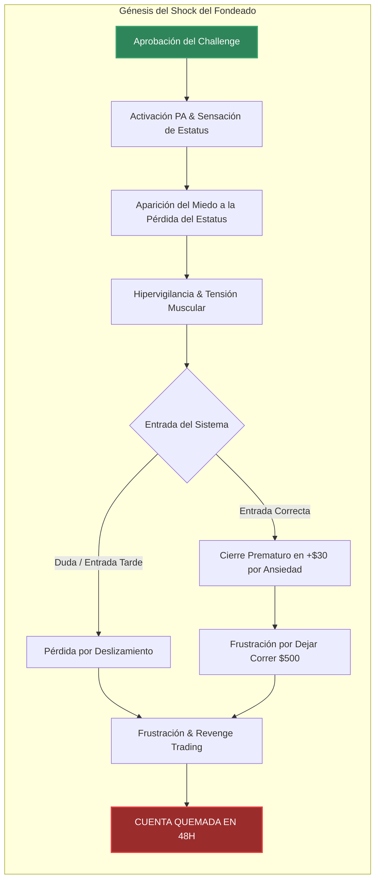

### 2.3 Protocolo Clínico-Operativo para Anular el Shock del Fondeado

Para erradicar esta distorsión, Víctor Corrales y la metodología Tradesfera prescriben el siguiente protocolo en tres fases obligatorias:

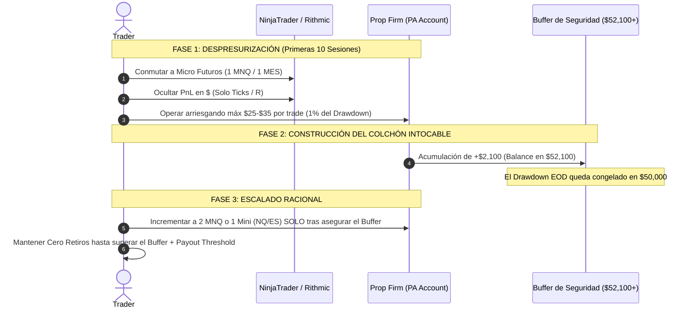

#### Reglas Innegociables de la Cuenta Fondeada:
1. **Regla de Micro-Lotes Iniciales (El Período de Aclimatación):**  
   Durante las primeras 10 sesiones en cuenta PA, **está estrictamente prohibido operar con contratos Mini estándar (NQ / ES)**. La operativa debe realizarse exclusivamente con **1 a 2 Micro-contratos (MNQ / MES)**.  
   $$\text{Riesgo por Operación} \le \$30 \text{ USD} \quad \left(\approx 1.2\% \text{ del colchón de } \$2,500\right)$$
2. **Construcción del Safety Buffer ($52,100 en cuentas de $50K):**  
   No existe presión de retiro mientras no se supere la cota de seguridad donde el trailing drawdown deja de perseguir al balance. La cuenta debe tratarse como un laboratorio estéril hasta alcanzar dicho nivel.

---

## 💵 3. Desensibilización Monetaria y Desanclaje del Dinero

### 3.1 La Neuropsicología del Símbolo "$"

Las investigaciones neurocientíficas demuestran que cuando el cerebro humano observa un número precedido por un signo monetario ($-\$250\text{ USD}$), activa la **corteza insular anterior**, la misma estructura cerebral que procesa el dolor físico agudo, el asco y la repugnancia.

```text
┌────────────────────────────────────────────────────────────────────────────────────────────────────────┐
│                               NEURO-IMPACTO DE LA INFORMACIÓN EN PANTALLA                             │
├───────────────────────────────────────────────────┬────────────────────────────────────────────────────┤
│ DISPLAY EN DÓLARES / EUROS                        │ DISPLAY EN TICKS / PUNTOS / UNIDADES R             │
├───────────────────────────────────────────────────┼────────────────────────────────────────────────────┤
│ • -$400.00 USD flotante                           │ • -20.0 Pts (o -1.0 R)                             │
│ • Asociación: "He perdido el pago del seguro"     │ • Asociación: "Ejecución dentro de la varianza"    │
│ • Reacción: Pánico, sudor, dolor somático         │ • Reacción: Evaluación puramente técnica           │
│ • Conducta: Mover el stop loss / Salir en pánico  │ • Conducta: Respetar la orden bracket OCO          │
│ • Zona cerebral: Corteza Insular (Dolor)          │ • Zona cerebral: Corteza Prefrontal Dorsolateral   │
└───────────────────────────────────────────────────┴────────────────────────────────────────────────────┘
```

> [!IMPORTANT]
> **MANTRA DE VÍCTOR CORRALES:**
> *"El dinero en el trading no es dinero: es el inventario fungible de una empresa de extracción de patrones. Si miras el dinero mientras operas, estás intentando hacer cirugía a corazón abierto pensando en cuánto cuesta el bisturí."*

### 3.2 Protocolo de Configuración Técnica Anti-Dólar

Para desensibilizar al sistema nervioso, se configura el entorno de NinjaTrader 8, Tradovate y TradingView siguiendo este estándar clínico:

```text
               ┌────────────────────────────────────────────────────────┐
               │    CONFIGURACIÓN DE PNL EN NINJATRADER 8 / TRADOVATE   │
               ├────────────────────────┬───────────────────────────────┤
               │ PARÁMETRO DE DISPLAY   │ VALOR OBLIGATORIO             │
               ├────────────────────────┼───────────────────────────────┤
               │ Chart Trader PnL Mode  │ [ Puntos / Ticks / R-Multiple]│
               │ Account Balance Window │ Minimizada / Oculta           │
               │ Executions / Fills     │ Sin notificación de audio ($) │
               │ Trade Summary          │ Ocultar columna Realized ($)  │
               └────────────────────────┴───────────────────────────────┘
```

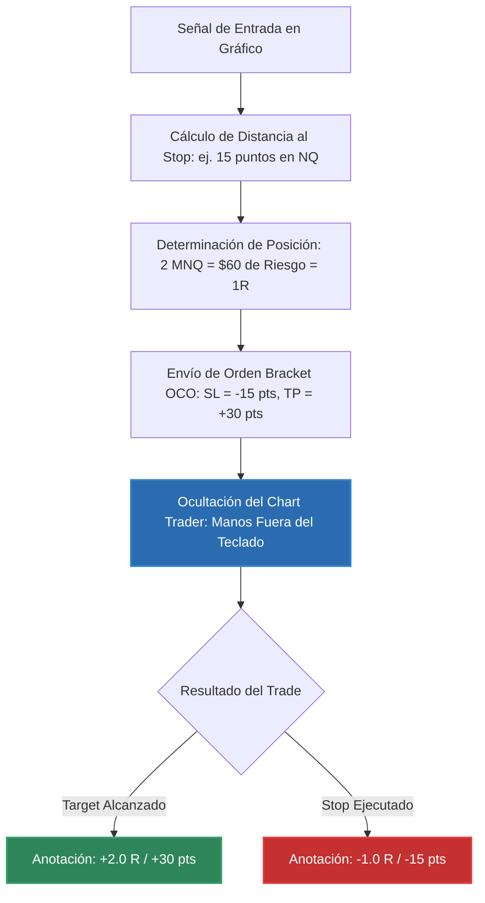

### 3.3 La Metáfora del Tablón de Madera y las Fichas de Casino

Víctor Corrales utiliza dos metáforas clínicas de reestructuración cognitiva:

1. **El Carpintero y el Tablón de Madera:**  
   Un carpintero compra 100 tablones de madera por 1.000 €. Cuando corta un tablón y sale defectuoso con un nudo podrido, no entra en depresión, no llora ni intenta pegar el serrín con pegamento. Simplemente desecha el tablón porque entiende que el coste de la materia prima forma parte inevitable del proceso productivo. En futuros CME, **un stop loss es un tablón con nudos: un coste de explotación operativo**.
2. **Las Fichas de Casino vs Billetes:**  
   Los casinos entregan fichas de plástico de colores para desanclar al jugador del valor real de su dinero. En el trading profesional, hacemos exactamente lo contrario para protegernos: transformamos el saldo en **Unidades de Riesgo ($R$)** para neutralizar el sesgo emocional del dinero y operar con la frialdad de un gestor cuantitativo.

---

## 🧠 4. Neurobiología del Secuestro Amigdalino (Amygdala Hijack)

### 4.1 La Fisiopatología del Tilt

El *Tilt* en el trading no es un fallo moral; es una **respuesta neurobiológica involuntaria** mediada por el eje Hipotálamo-Pituitaria-Adrenal (HPA).

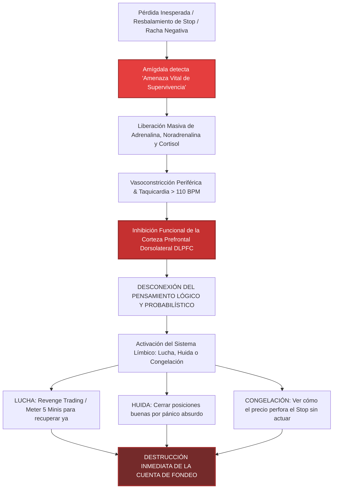

Cuando la amígdala toma el control, la **Corteza Prefrontal Dorsolateral (DLPFC)** —responsable de la memoria de trabajo, el autocontrol, la evaluación del riesgo y la inhibición de impulsos— queda literalmente **hipoperfundida (sin riego sanguíneo óptimo)**. El trader bajo secuestro amigdalino tiene temporalmente la capacidad de razonamiento de un primate acorralado.

### 4.2 Protocolos Clínicos de Reseteo Fisiológico Inmediato

Para recuperar el control ejecutivo prefrontal, es biológicamente imposible utilizar el pensamiento lógico directo (*"debo calmarme"* no funciona porque la zona que procesa ese pensamiento está inhibida). **Se debe intervenir primero sobre el cuerpo (vía somática aferente)**.

```text
┌────────────────────────────────────────────────────────────────────────────────────────────────────────┐
│                        PROTOCOLO DE RESETEO FISIOLÓGICO DE EMERGENCIA (P.R.F.E.)                       │
├────────────────────────────────────────────────────────────────────────────────────────────────────────┤
│ 1. INTERRUPCIÓN DEL PATRÓN SOMÁTICO (Primeros 10 segundos)                                             │
│    • Soltar inmediatamente el ratón y retirar las manos del escritorio.                                │
│    • Empujar la silla hacia atrás y ponerse de pie.                                                    │
│    • Romper la distancia focal: Mirar un punto lejano a más de 5 metros (desactiva visión túnel).     │
│                                                                                                        │
│ 2. ESTIMULACIÓN VAGAL Y RESPIRACIÓN CUADRADA (Box Breathing 4x4 - 2 Minutos)                           │
│    • Fase 1 (Inhalación Nasal Profunda Diafragmática): 4 segundos.                                     │
│    • Fase 2 (Retención con Pulmones Llenos): 4 segundos.                                               │
│    • Fase 3 (Exhalación Bucal Lenta y Constante): 4 segundos.                                          │
│    • Fase 4 (Retención en Vacío Pulmonar): 4 segundos.                                                 │
│    • Repetir 4 a 6 ciclos completos. (Dispara acetilcolina y reduce frecuencia cardíaca a <75 BPM).   │
│                                                                                                        │
│ 3. RESETEO PROPIOCEPTIVO Y TÉRMICO                                                                     │
│    • Lavarse la cara con agua muy fría (activa el 'Reflejo de Inmersión Mamífero').                    │
│    • Movimientos oculares sacádicos bilaterales horizontales (Protocolo EMDR breve de 30 segundos).    │
│                                                                                                        │
│ 4. AUTO-DIÁLOGO SOCRÁTICO DE RE-CONEXIÓN PREFRONTAL                                                    │
│    • "¿Cuál es mi ventaja estadística en el mercado?"                                                  │
│    • "¿Un trade individual tiene algún significado sobre una muestra de 100 operaciones?"              │
│    • "¿Aceptar la pérdida actual preserva mi derecho a operar mañana?"                                 │
└────────────────────────────────────────────────────────────────────────────────────────────────────────┘
```

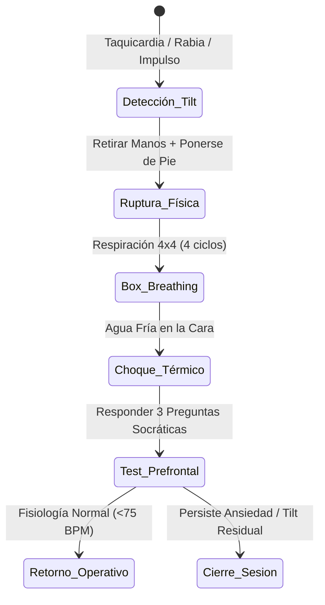

---

## 🌡️ 5. El Termostato Financiero y el Autosabotaje de Ganancias

### 5.1 La Teoría del Termostato Financiero Subconsciente

El concepto del **Termostato Financiero** describe el límite autoimpuesto de riqueza y merecimiento programado en el subconsciente de un individuo.

Al igual que un termostato de pared enciende el aire acondicionado cuando la habitación supera los 24 °C para devolverla a su temperatura de consigna, el subconsciente del trader activa **mecanismos destructivos de autosabotaje** cuando el saldo de su cuenta o sus beneficios superan su zona de confort financiero.

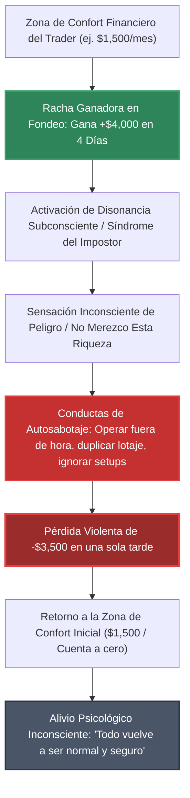

### 5.2 Anatomía del Autosabotaje Post-Target

Víctor Corrales documenta el patrón recurrente en traders que aprueban evaluaciones o acumulan grandes beneficios en cuentas PA:

1. **La Euforia de Superación:** El trader gana $\$3,000$ en una semana. Su mente consciente celebra; su mente subconsciente entra en pánico por romper el molde de ingresos familiares o personales históricos.
2. **La Relajación de los Estándares:** Aparece la falsa creencia de infalibilidad (*sesgo de autosuficiencia*). El trader piensa: *"Ya domino el Nasdaq, hoy voy a operar la sesión asiática con 4 contratos desde el móvil"*.
3. **La Devolución Catastrófica:** En menos de 48 horas, devuelve el 100% de las ganancias y quema la cuenta financiada.
4. **La Justificación Neurótica:** *"El mercado hoy estuvo manipulado por las noticias"*. La mente prefiere culpar al algoritmo antes que reconocer su propio techo de cristal financiero.

### 5.3 Técnicas Clínicas de Expansión de la Capacidad Receptiva

Para ensanchar el termostato financiero sin provocar el disparo del autosabotaje, se aplican cuatro intervenciones terapéuticas:

```text
┌────────────────────────────────────────────────────────────────────────────────────────────────────────┐
│                        PROTOCOLO DE EXPANSIÓN DE CAPACIDAD RECEPTIVA (VÍCTOR CORRALES)                 │
├────────────────────────────────────────────────────────────────────────────────────────────────────────┤
│ 1. LA REGLA DE COSECHA MATERIAL INMEDIATA (Regla Tradesfera 50/30/20)                                  │
│    • Tan pronto como la prop firm permita el primer payout, RETIRAR EL BENEFICIO.                      │
│    • El dinero en pantalla es etéreo; para reconfigurar el subconsciente, el dinero DEBE TOCARSE.      │
│    • Utilizar una porción del retiro (10-20%) para una recompensa física tangible (una cena familiar,  │
│      pagar una deuda real, comprar un bien útil). Esto ancla biológicamente el trading al bienestar.   │
│                                                                                                        │
│ 2. EXPOSICIÓN GRADUAL AL VOLUMEN MONETARIO                                                             │
│    • No saltar de ganar $200 al día a intentar ganar $2,000 al día.                                    │
│    • Escalamiento por bloques del 20%: Incrementar contratos solo cuando un nivel de beneficio haya   │
│      sido normalizado y mantenido durante al menos 20 sesiones consecutivas sin ansiedad somática.    │
│                                                                                                        │
│ 3. DESVINCULACIÓN DEL TIEMPO-TRABAJO VS RENDIMIENTO                                                   │
│    • Reestructurar la creencia industrial de que "para ganar más dinero hay que sufrir más horas".     │
│    • En el trading, ganar $1,000 en 4 minutos mediante un setup perfecto exige la misma energía que   │
│      ganar $10. La remuneración responde al apalancamiento sobre la probabilidad, no al esfuerzo físico│
└────────────────────────────────────────────────────────────────────────────────────────────────────────┘
```

---

## 🧼 6. Protocolos de Higiene Mental y Rutinas de Alto Rendimiento

El trading en prop firms de futuros debe tratarse con la rigurosidad operativa de un piloto de combate de las fuerzas aéreas. No existe espacio para la improvisación matutina.

### 6.1 Rutina Pre-Mercado de 15 Minutos (Checklist de Despegue)

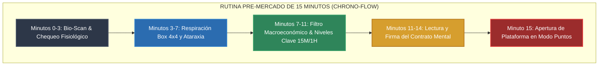

#### Checklist Clínico Pre-Vuelo:
- [ ] **1. Bio-Scan (0-3 min):**
  * ¿Horas de sueño $\ge 7\text{h}$? Si dormiste menos de 5 horas o estás bajo medicación alteradora: **DÍA NO OPERATIVO (NO TRADE DAY)**.
  * Nivel de estrés no relacionado con el mercado (0 a 10): Si supera 5/10 (discusión de pareja, problemas económicos urgentes): **PROHIBIDO OPERAR**.
- [ ] **2. Reseteo Vagal (3-7 min):**
  * 4 ciclos de Box Breathing 4x4.
  * Relajación consciente de hombros, cuello y maseteros (mandíbula).
- [ ] **3. Filtro Macro & Técnico (7-11 min):**
  * Revisar calendario económico (CPI, PPI, FOMC, NFP, ISM). Marcar alarmas 5 minutos antes.
  * Trazar niveles clave de liquidez: HOD/LOD anterior, Overnight High/Low, POC, VWAP.
- [ ] **4. El Contrato Mental Inviolable (11-14 min):**
  * Lectura en voz alta del compromiso operativo:

> *"Yo, operador disciplinado de futuros, acepto plena y voluntariamente la pérdida máxima de hoy fijada en \$300 USD (o 2 pérdidas consecutivas). Esta pérdida no afecta mi valor personal ni mi futuro financiero. Me comprometo a ejecutar únicamente mis setups A+, a disparar un máximo de 3 balas y a cerrar la pantalla en cuanto se cumpla cualquiera de los límites prefijados."*

---

## 🎯 7. Sistema de Balas Operativas y Cortafuegos de Sesión

### 7.1 El Modelo de las 2-3 Balas Diarias

El mayor destructor de cuentas es la **operativa continua o por desgaste**. En futuros CME, las mejores ventanas de liquidez institucional ocurren en lapsos muy concretos (típicamente entre las 09:30 y las 11:15 EST).

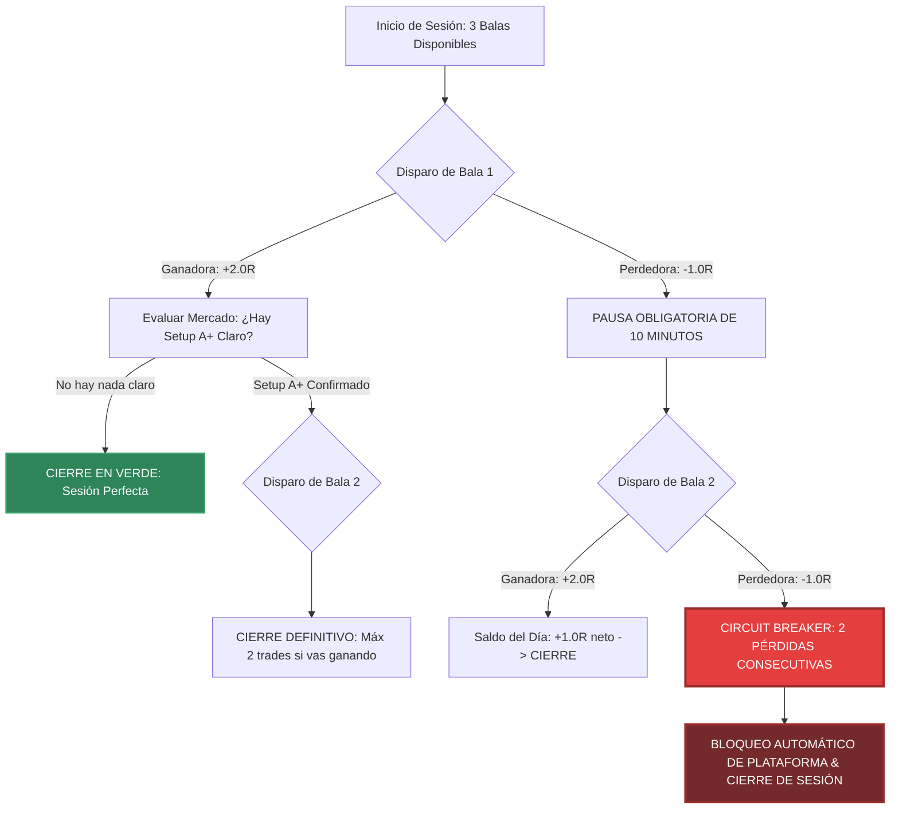

### 7.2 Regla del Doble Stop Consecutivo (Circuit Breaker Clínico)

> [!CAUTION]
> **LEY DE CORRALES-GARCÍA:**
> Si enlazas **2 pérdidas consecutivas en la misma sesión**, tu capacidad de juicio objetivo está degradada en más de un 80%, con independencia de lo que creas sentir. **LA SESIÓN QUEDA TERMINADA INMEDIATAMENTE**. Queda estrictamente prohibido disparar una 3ª bala tras dos pérdidas.

### 7.3 Protocolo de Cuarentena Obligatoria de 24 Horas Post-Quiebra

Cuando un trader pierde una cuenta de fondeo (o toca el Stop Loss Máximo Diario), se desencadena una necesidad biológica compulsiva de **"reparar la herida narcisista"** mediante la compra inmediata de un nuevo examen o reset:

```text
┌────────────────────────────────────────────────────────────────────────────────────────────────────────┐
│                        PROTOCOLO DE CUARENTENA DE 24 HORAS (ANTI-RESET COMPULSIVO)                     │
├────────────────────────────────────────────────────────────────────────────────────────────────────────┤
│ 1. BLOQUEO FÍSICO Y DIGITAL INMEDIATO                                                                  │
│    • Cerrar NinjaTrader, Tradovate y Rithmic.                                                          │
│    • Desconectar las tarjetas de crédito de las pasarelas de pago de prop firms.                       │
│    • PROHIBICIÓN PENAL de comprar cuentas, resets o pruebas en las siguientes 24 horas naturales.      │
│                                                                                                        │
│ 2. DESCONEXIÓN DEL ENTORNO OPERATIVO                                                                   │
│    • Salir inmediatamente de la habitación / oficina de trading durante al menos 60 minutos.          │
│    • Realizar actividad física aeróbica (caminar a paso ligero, correr, gimnasio) para metabolizar el  │
│      exceso de cortisol y adrenalina en sangre.                                                        │
│                                                                                                        │
│ 3. LA AUTOPSIA FORENSE EN FRÍO (Mínimo 12 horas después)                                               │
│    • Solo al día siguiente, con frecuencia cardíaca basal, se abre el gráfico para registrar:         │
│      a) ¿La entrada fue un Setup A+ del plan o una improvisación emocional?                            │
│      b) ¿Se respetó el tamaño de posición adecuado (Micros vs Minis)?                                  │
│      c) ¿Qué detonante psicológico previo provocó la indisciplina?                                     │
└────────────────────────────────────────────────────────────────────────────────────────────────────────┘
```

---

## 📊 8. Matrices de Diagnóstico Emocional y Toma de Decisiones Bajo Fuego

### 8.1 Matriz de Activación Neuro-Afectiva (Arousal vs Valencia)

Víctor Corrales categoriza el estado del trader según el modelo bidimensional de afecto de Russell, adaptado al entorno de alta volatilidad de los futuros:

```text
                                ALTO AROUSAL (ALTA ACTIVACIÓN FISIOLÓGICA)
                                                    ▲
                                                    │
                 CUADRANTE II: PELIGRO TILT         │       CUADRANTE I: PELIGRO EUFORIA
                 • Emociones: Rabia, Pánico, Ansia  │       • Emociones: Euforia, Omnipotencia, Avaricia
                 • Conducta: Revenge Trading,        │       • Conducta: Sobreapalancamiento, FOMO
                   mover stops, martingala suicida  │       • Estado: "Soy el rey del mercado"
                 • ACCIÓN: APAGAR PANTALLA INMEDIATO│       • ACCIÓN: RETIRAR MANOS DEL RATÓN
                                                    │
    VALENCIA NEGATIVA ──────────────────────────────┼──────────────────────────────► VALENCIA POSITIVA
    (Displacer / Frustración)                       │                                (Placer / Seguridad)
                                                    │
                 CUADRANTE III: PARÁLISIS           │       CUADRANTE IV: ATARAXIA (ZONA ÓPTIMA)
                 • Emociones: Resignación, Duda,    │       • Emociones: Frialdad, Calma, Aceptación
                   Miedo al clic, Desesperanza      │       • Conducta: Ejecución mecánica del plan,
                 • Conducta: No entrar en setups A+,│         respeto milimétrico de stops, cero apego
                   salir por pánico en breakeven    │       • ESTADO PROFESIONAL REQUERIDO
                 • ACCIÓN: PASO A 1 MICRO (MNQ)     │       • ACCIÓN: OPERATIVA AUTORIZADA
                                                    │
                                                    ▼
                                BAJO AROUSAL (BAJA ACTIVACIÓN FISIOLÓGICA)
```

### 8.2 Matriz de Decisiones Bajo Fuego (Matriz de Acción Táctica)

| Estado Somático Detectado | Indicadores Biológicos | Nivel de Riesgo | Acción Inmediata Requerida |
|---|---|---|---|
| **Verde (Ataraxia)** | Respiración lenta, pulso < 70 BPM, mente enfocada en niveles técnicos. | **Óptimo** | Ejecución normal según plan (Balas 1 a 3). |
| **Amarillo (Alerta)** | Mandíbula apretada, ganas de entrar antes de confirmación, chequeo constante del balance. | **Moderado** | Box Breathing 4x4 de 2 min, conmutar a 1 Micro (MNQ/MES), ocultar PnL. |
| **Naranja (Pre-Tilt)** | Taquicardia perceptible, rumiación mental tras pérdida previa, quejas en voz alta. | **Grave** | Pausa obligatoria de 15 minutos fuera de la pantalla. Prohibido entrar. |
| **Rojo (Secuestro Total)** | Sudoración, furia, impulso de meter contratos máximos, dedos listos para comprar a mercado. | **Crítico (Letal)** | **HARD STOP INMEDIATO**. Cerrar software por la fuerza. Cuarentena de 24h. |

---

## 🔬 9. Casos Prácticos Clínicos y Forenses en Futuros CME

### Caso Práctico 1: El Shock del Fondeado en Cuentas MFFU / Apex de $50,000

#### Perfil y Contexto:
- **Operador:** Carlos M., 32 años, 18 meses en trading.
- **Evento:** Tras 4 intentos fallidos, aprueba una evaluación de $\$50,000$ en MyFundedFutures Rapid (\$0 de cuota de activación) con un trailing drawdown de $\$2,500$.
- **El Colapso:** Recibe la cuenta PA el lunes. El martes a las 09:35 EST entra en NQ con 2 contratos Mini. El precio se mueve 15 puntos en contra ($-\$600$ USD). Siente taquicardia extrema: *"No puedo perder mi primera cuenta fondeada"*. Retira el Stop Loss manual. El precio expande 40 puntos a la baja. Pierde $-\$1,600$ en 4 minutos. En pleno secuestro amigdalino, compra 3 contratos más promediando a la baja. La cuenta queda liquidada por violación del Drawdown Máximo en menos de 10 minutos de sesión.

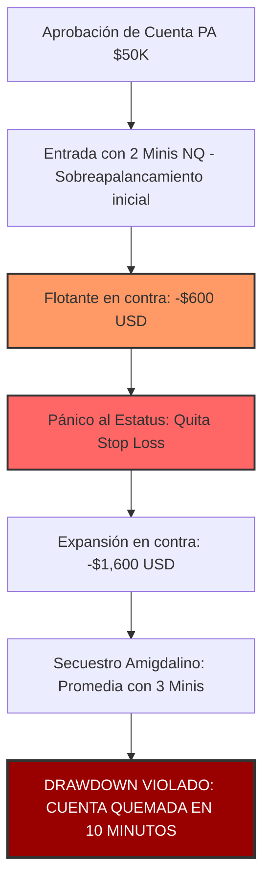

#### Tratamiento Clínico y Solución Aplicada (Doctrina Corrales):
1. **Descompresión Obligatoria:** Cuarentena de 7 días sin operar futuros reales.
2. **Reestructuración de Tamaño:** Reingreso con la regla de **1 Micro (MNQ)** durante las primeras 15 sesiones de la nueva cuenta.
3. **Hard Stop por Software:** Configurar en Rithmic Risk Manager un límite de pérdida diaria (*Daily Loss Limit*) de $-\$200$ USD bloqueante e inmodificable por el usuario durante la sesión.
4. **Resultado:** En su siguiente cuenta, Carlos acumuló un buffer de $+\$2,400$ en 22 sesiones operando exclusivamente 2 MNQ, logrando su primer retiro de $\$1,500$ USD sin experimentar taquicardias.

---

### Caso Práctico 2: El Autosabotaje del Termostato Financiero

#### Perfil y Contexto:
- **Operador:** Elena R., 28 años, salario profesional mensual habitual: 1.400 €/mes.
- **Evento:** Opera una cesta de 5 cuentas fondeadas de $\$50,000$ mediante Replicanto (Trade Copier) en NinjaTrader 8.
- **El Pánico al Éxito:** Encadena 3 sesiones extraordinarias en el E-mini S&P (ES), ganando $+1,200\text{ USD}$ por cuenta. El beneficio total agregado asciende a **$+\$6,000\text{ USD}$ en 72 horas** (más de 4 veces su sueldo mensual).
- **El Autosabotaje:** La noche del jueves no puede dormir por ansiedad. El viernes a las 10:00 EST entra en una operación fuera de plan en el petróleo (CL), instrumento que jamás había operado. Sobredimensiona la posición con 4 contratos por cuenta para "redondear a $\$10,000$". El trade falla. Comete revenge trading y quema 4 de las 5 cuentas antes del cierre de Nueva York.

```mermaid
graph LR
    A["Ganancia Rápida: +$6,000 USD en 3 Días"] --> B["Disonancia: Supera su Sueldo Mensual x4"]
    B --> C["Insomnio & Ansiedad Subconsciente"]
    C --> D["Operativa Impulsiva en Petróleo (CL)"]
    D --> E["Quiebra de 4 Cuentas Fondeadas"]
    E --> F["Vuelta al Punto Cero (Alivio Oculto)"]
    
    style A fill:#2f855a,stroke:#38a169,stroke-width:2px,color:#fff
    style D fill:#c53030,stroke:#e53e3e,stroke-width:2px,color:#fff
    style E fill:#9b2c2c,stroke:#e53e3e,stroke-width:3px,color:#fff
```

#### Tratamiento Clínico y Solución Aplicada (Doctrina Corrales):
1. **Diagnóstico:** Conflicto de lealtad familiar y techo de cristal de ingresos (miedo inconsciente a superar los ingresos de su entorno de referencia).
2. **Protocolo de Cosecha Segregada (50/30/20):** Se establece la obligación estricta de retirar fondos tan pronto como la cuenta supere el umbral mínimo (\$52,100), transfiriendo el 50% inmediatamente a una cuenta de ahorro intocable.
3. **Cierre Forzado Semanal:** Regla de desconexión obligatoria si se alcanza una ganancia semanal de $+3.0R$, prohibiendo operar los viernes tras una semana altamente positiva.

---

## 🛠️ 10. Checklists Clínicos y Plantilla de Registro Diario en Obsidian

Para integrar este tratado en el flujo diario de trabajo dentro de Obsidian, se implementa la siguiente bitácora de auto-auditoría clínica:

```markdown
### 📋 PROTOCOLO DIARIO DE PSICOTRADING Y MAESTRÍA CONDUCTUAL
**Fecha:** 2026-08-XX | **Sesión:** [ ] Londres | [x] NY Open (09:30 - 11:30 EST)
**Instrumento:** [ ] MNQ | [ ] MES | [ ] NQ | [ ] ES | **Cuentas Activas:** [ID Cesta PA]

---

#### 1. FASE PRE-MERCADO (15 Minutos Previos)
- [ ] Horas de sueño verificadas ($\ge 7\text{h}$) y nivel de energía óptimo.
- [ ] Bio-Scan: Estrés externo $< 4/10$. Tensión muscular liberada.
- [ ] 4 Ciclos de Box Breathing 4x4 completados.
- [ ] Noticias macro identificadas en ForexFactory. Alarmas fijadas.
- [ ] Niveles clave trazados en 15M/1H (HOD, LOD, POC, VWAP).
- [ ] PnL en NinjaTrader configurado estrictamente en **Ticks / Puntos / R**.
- [ ] Contrato Mental de aceptación de pérdida máxima leído en voz alta.

---

#### 2. AUDITORÍA DE EJECUCIÓN DE BALAS (Intra-Mercado)
| Bala # | Hora | Tipo | Contratos | Setup Técnico | Resultado (R / Pts) | Estado Emocional (1-10) | Cumplió Plan (S/N) |
|:---:|:---:|:---:|:---:|:---:|:---:|:---:|:---:|
| **Bala 1** | 09:42 | Long | 2 MNQ | FVG Retest + Delta Div | +2.2 R (+33 pts) | 8 (Calma absoluta) | S |
| **Bala 2** | 10:15 | Short | 2 MNQ | Failed High + Absorption | -1.0 R (-15 pts) | 7 (Aceptación plena) | S |
| **Bala 3** | --:-- | --- | --- | [NO REQUERIDA / PAUSA] | --- | --- | --- |

---

#### 3. TEST DE SEGURIDAD CONDUCTUAL
- ¿Hubo algún impulso de mover el Stop Loss?: [ ] Sí | [x] No
- ¿Se respetó el límite de 2 pérdidas seguidas?: [x] Sí | [ ] No
- ¿Se cerró la sesión dentro del horario estricto (antes de las 11:30 EST)?: [x] Sí | [ ] No
- ¿El ratón permaneció suelto durante el desarrollo del trade?: [x] Sí | [ ] No

---

#### 4. AUTOPSIA CLÍNICA POST-MERCADO
- **Nivel de Arousal Dominante:** [ ] Cuadrante IV (Ataraxia Óptima)
- **Acierto Conductual del Día:** Respetada la salida técnica por Take Profit sin cortar antes de tiempo.
- **Fuga de Energía Detectada:** Ligera impaciencia en el minuto 09:33 previa a la apertura de campana.
- **Estado del Buffer de la Cuenta:** $52,650 USD (Buffer consolidado de +$2,650).
```

---

## 🏆 11. Conclusiones y Manifiesto de Ataraxia Operativa

El fondeo de futuros en empresas como MyFundedFutures, Tradeify, Apex o Topstep no premia al operador más inteligente ni al que tiene la pantalla con más indicadores técnicos. **Premia con frialdad matemática al operador que ha conquistado su propia biología**.

```text
┌────────────────────────────────────────────────────────────────────────────────────────────────────────┐
│                               EL DECÁLOGO DE ATARAXIA DE VÍCTOR CORRALES                              │
├────────────────────────────────────────────────────────────────────────────────────────────────────────┤
│ 1. Mi valor como ser humano es independiente de si hoy gané o perdí puntos en el Nasdaq.               │
│ 2. Un stop loss ejecutado con disciplina es una victoria conductual idéntica a un take profit.         │
│ 3. Nunca opero para demostrar que tengo razón; opero para extraer una ventaja probabilística.          │
│ 4. Si siento la necesidad física de ganar dinero hoy, hoy es el día en que no debo operar.            │
│ 5. La cuenta de fondeo es munición de trabajo, no el reflejo de mi estatus social.                    │
│ 6. Cortar las pérdidas pequeñas es el único acto que me garantiza seguir vivo mañana.                 │
│ 7. Oculto el dinero de mi pantalla para que la avaricia y el pánico no secuestren mis manos.           │
│ 8. Acepto la incertidumbre radical: en cualquier trade individual, puede ocurrir cualquier cosa.        │
│ 9. El mercado no es mi enemigo, ni mi amigo; es un océano de liquidez que no sabe que existo.         │
│ 10. Mi mayor ventaja competitiva no está en mi gráfico, sino en mi respiración y mi paz mental.        │
└────────────────────────────────────────────────────────────────────────────────────────────────────────┘
```

---

> **Certificación Documental Tradesfera & Ultrarentable V2:**  
> Tratado formalizado y certificado como estándar clínico de psicotrading para la suite de evaluación y fondeo en futuros CME.
