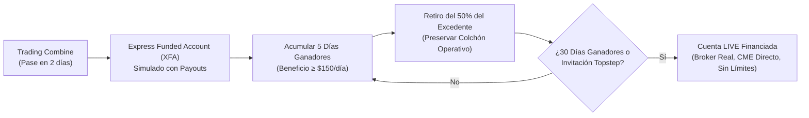
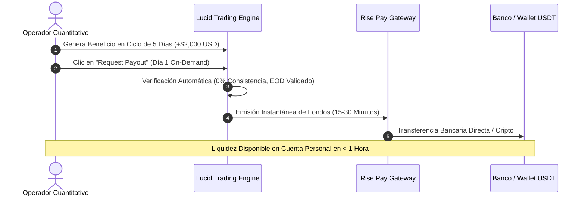
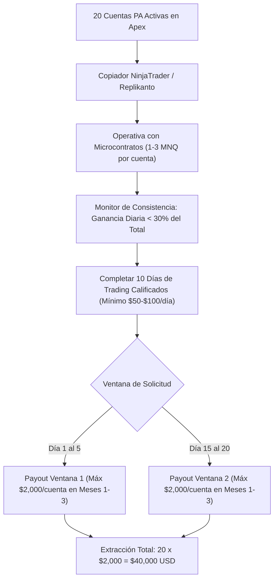
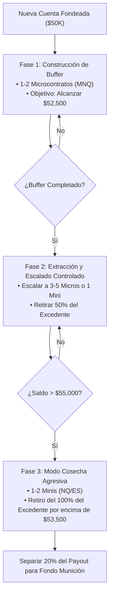
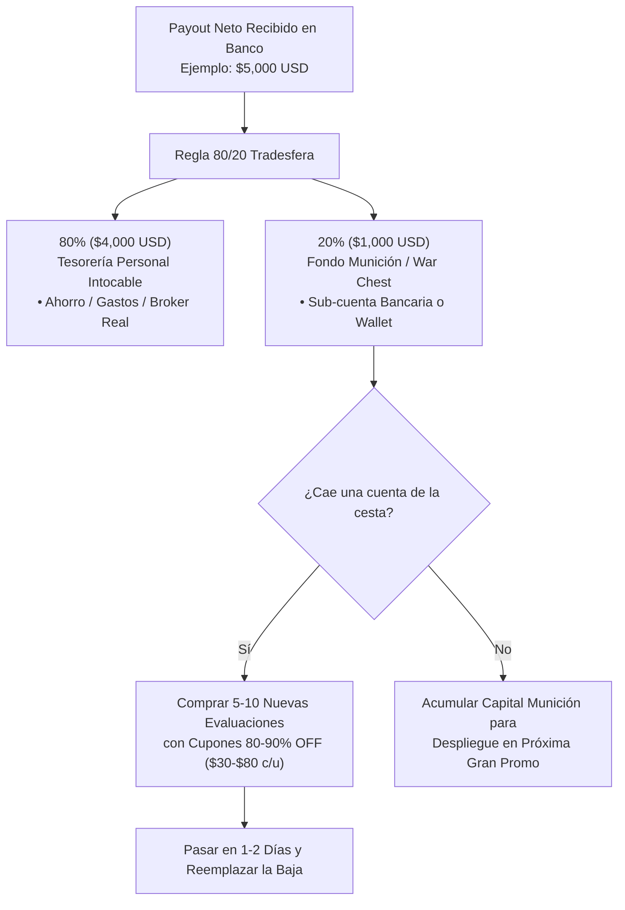
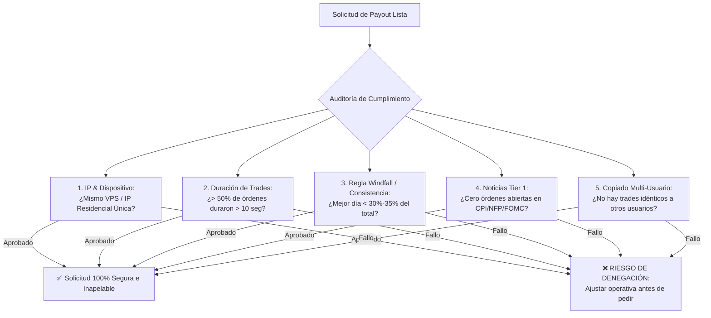
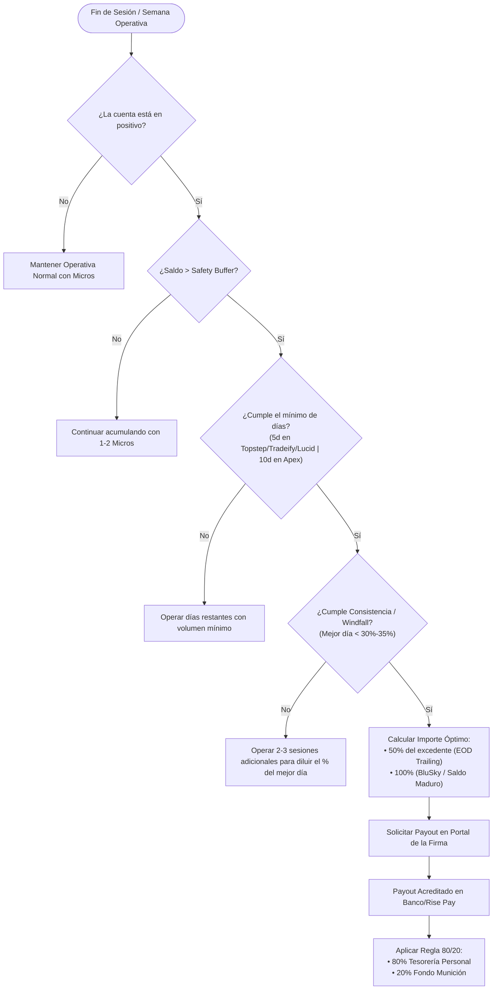
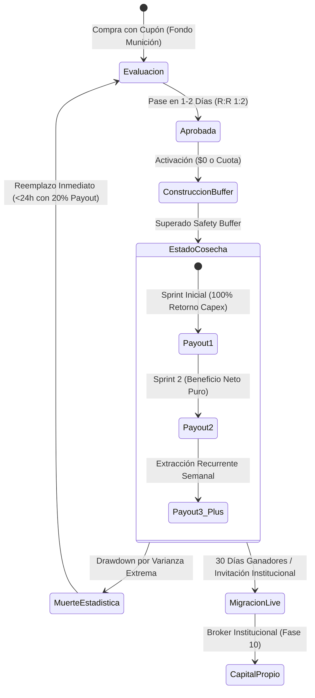

# ⚡ SISTEMA TÁCTICO DE MÁXIMA EXTRACCIÓN POR EMPRESA DE FONDEO (FUTUROS CME)
## Manual de Explotación Financiera, Calendario de Rotación Semanal de Payouts, Matriz de Apalancamiento Óptimo y Protocolo de Auto-Financiación Perpetua

> **Documento de Inteligencia Cuantitativa y Ejecución Táctica**  
> **Área:** Tradesfera & Ecosistema Ultrarentable V2 | **Fecha:** 27 de Agosto de 2026  
> **Activos CME:** Micro E-mini (MES, MNQ, MYM, M2K) y E-mini Estándar (ES, NQ, YM, RTY, CL, GC).  
> **Doctrina:** Zero-Mocks & 100% Datos Físicos Verificados.

---

## 🎯 Navegación y Enlaces Bidireccionales
- 📌 **Ficha Maestra:** [[Ultrarentable]]
- 🔗 **Módulos Relacionados:** [[Motor de Fondeo y Prop Firms]] | [[Gestion de Capital — Balas y Estados]] | [[Plan 10 Fases]] | [[Investigacion/04_SISTEMA_MUNDIAL_PROP_FIRMS_FUTUROS]]
- 📑 **Protocolos Hermanos:** [[docs/tradesfera/05_SISTEMA_MULTICUENTA_Y_COPYTRADING]] | [[docs/tradesfera/06_CICLO_OPTIMO_RETIROS_Y_PAYOUTS]] | [[docs/tradesfera/08_COMPARATIVA_PROP_FIRMS_FUTUROS_CME]] | [[docs/tradesfera/10_DOSSIER_MAESTRO_TRADESFERA_FONDEO_FUTUROS]]
- 🌐 **Panel Web Vivo:** `http://localhost:3000/prop-firms`
- 📊 **Dataset Canónico:** `apps/web/lib/prop-firms.ts` | `apps/web/lib/tradesfera-calculator.ts`

---

## 🏛️ Tesis Operativa: La Cuenta de Fondeo como Pozo Petrolífero de Extracción Asimétrica

En el modelo cuantitativo de **Tradesfera**, una cuenta de fondeo de futuros CME no es un activo patrimonial a largo plazo ni un empleo tradicional; es un **vehículo asimétrico de extracción de liquidez con vida útil finita**.

```text
┌──────────────────────────────────────────────────────────────────────────────────────────────────┐
│                     EL PRINCIPIO DE EXTRACCIÓN ASIMÉTRICA TRADESFERA                             │
├──────────────────────────────────────────────────────────────────────────────────────────────────┤
│ 1. COSTE DE ENTRADA MÍNIMO (CAPEX):  $30 - $150 USD (Evaluación con cupón 80-90% OFF).           │
│ 2. APALANCAMIENTO OPERATIVO:         $2,000 - $3,500 USD de Drawdown real gestionable.           │
│ 3. POTENCIAL DE EXTRACCIÓN:          $2,000 - $25,000+ USD netos por cuenta.                     │
│ 4. RIESGO MÁXIMO ASUMIDO:            Exclusivamente el capital invertido en la compra ($30-$150).│
│ 5. REGLA SUPREMA:                    "Ordeñar cada cuenta al máximo de su capacidad reglamentaria│
│                                      y reciclar el flujo de caja antes de su agotamiento."       │
└──────────────────────────────────────────────────────────────────────────────────────────────────┘
```

El objetivo supremo de este manual es proporcionar las **estrategias quirúrgicas empresa por empresa**, el **cronograma de cobros rotativos** y las **fórmulas de escalado y reinversión** para transformar una cesta de 5 a 20 cuentas fondeadas en una **máquina de flujo de caja continuo semanal de 4 cifras ($3,000 - $10,000 USD/semana)**.

---

## 🔬 1. Tácticas de Máxima Extracción por Empresa de Fondeo

Cada empresa de fondeo posee una arquitectura de reglas, modelos de drawdown, pasarelas de pago y ventanas de cobro completamente distintas. Aplicar la misma táctica a todas las firmas conduce a la denegación de pagos o a la quiebra prematura de cuentas. A continuación, se detalla el protocolo de explotación óptimo para las 6 firmas líderes.

---

### 1.1 Topstep: Protocolo XFA a Live, Payouts Diarios y Blindaje del Buffer (50% Rule)

Topstep es el decano institucional de la industria. Su ventaja crítica radica en su **solvencia intachable**, su plataforma propietaria **TopstepX** (sin comisiones de software ni conexión Rithmic) y su programa de **transición a Cuenta Real Financiada (Live Brokerage)**.



#### Parámetros Clave de Extracción
* **Condición de Retiro:** 5 días de trading ganadores acumulando **$\ge \$150.00\text{ USD}$ netos por día**.
* **Frecuencia de Pagos:** **Diaria On-Demand** (procesada el mismo día hábil si se solicita antes de las 10:00 AM CT).
* **Profit Split:** 100% de los primeros $10,000 USD netos; 90% Trader / 10% Topstep posteriormente.
* **Safety Buffer Obligatorio:**
  * Cuenta 50K: $\$2,000\text{ USD}$ (Saldo mínimo para retirar: $\$52,000$).
  * Cuenta 100K: $\$3,000\text{ USD}$ (Saldo mínimo para retirar: $\$103,000$).
  * Cuenta 150K: $\$4,500\text{ USD}$ (Saldo mínimo para retirar: $\$154,500$).

#### Protocolo Quirúrgico de Extracción Topstep
1. **Paso Rápido de Evaluación:** Superar el Combine en el mínimo reglamentario (2 días) arriesgando un ratio R:R de 1:2 sobre aperturas ORB en NQ/MNQ.
2. **Construcción del Safety Buffer:** En la cuenta Express Funded (XFA), operar con tamaño reducido (1 a 2 Micros) hasta alcanzar el umbral de seguridad ($\$52,000$ en cuenta de 50K).
3. **Generación de los 5 Días $\ge \$150$:** Operar micro-bloques de 1 o 2 operaciones de alta probabilidad buscando un target diario de $\$160 - \$220\text{ USD}$. Al alcanzar $\$155+$, **bloquear la operativa del día** en la plataforma para asegurar el día ganador calificado.
4. **La Regla del 50% de Retiro:** Jamás solicitar el 100% de las ganancias por encima del buffer.
   $$\text{Monto a Retirar} = 0.50 \times (\text{Balance Actual} - \text{Safety Buffer})$$
   * *Ejemplo:* Saldo en $\$54,000$ (Buffer en $\$52,000$, Excedente = $\$2,000$). Se retiran **$\$1,000\text{ USD}$** y se dejan **$\$1,000\text{ USD}$ como Colchón Operativo Adicional**. Esto evita que el suelo de liquidación (congelado en $\$50,000$) quede a menos de $\$3,000$ de distancia.
5. **Ruta hacia la Cuenta LIVE:** Al acumular consistencia sostenida o alcanzar el hito de 30 días operados, Topstep ofrece la migración a una cuenta **Live Brokerage** real. En Live, las comisiones corren a cargo de la firma, el capital es institucional y no existe riesgo de contrapartida de prop firm simulada.

---

### 1.2 Tradeify: Arbitraje Lightning vs Growth, Multiplicador x20 y Regla de los 10 Segundos

Tradeify se ha posicionado como la firma de mayor rentabilidad técnica gracias a sus programas **Growth** (pago único sin cuota de activación) y **Lightning** (acceso directo a cuenta financiada sin examen).

```text
┌──────────────────────────────────────────────────────────────────────────────────────────────────┐
│                    ARBITRAJE TÁCTICO TRADEIFY: LIGHTNING VS GROWTH                               │
├──────────────────────────────────┬───────────────────────────────────────────────────────────────┤
│ PLAN LIGHTNING (DIRECT TO FUNDED)│ PLAN GROWTH (PAGO ÚNICO, $0 ACTIVACIÓN)                       │
├──────────────────────────────────┼───────────────────────────────────────────────────────────────┤
│ • $0 Examen: Directo a cobrar.   │ • Evaluación de 1 solo día de pase.                           │
│ • Mayor coste de entrada ($200+).│ • Coste ultra-bajo con cupón `TNT` ($79.75 en 50K).           │
│ • Ideal para inyección urgente   │ • Ideal para construir la cesta masiva de 20 cuentas réplica. │
│   de liquidez en semana 1.       │ • EOD Trailing con congelación permanente en $50,100.         │
│ • Retiros cada 5 días ganadores. │ • Retiros cada 5 días ganadores, 90/10 Split desde Día 1.     │
└──────────────────────────────────┴───────────────────────────────────────────────────────────────┘
```

#### Parámetros Clave de Extracción
* **Frecuencia de Retiros:** Cada **5 días de trading ganadores** (procesados en 24 a 48 horas).
* **Profit Split:** 90% Trader / 10% Tradeify desde el primer dólar.
* **Capacidad Multicuenta:** Hasta **20 cuentas fondeadas activas** operadas simultáneamente mediante Trade Copier (Replikanto / Quantower).
* **Consistencia:** 35% en cuenta fondeada (ningún día puede superar el 35% del beneficio total al solicitar cobro).
* **Regla Crítica de los 10 Segundos:** Al menos el **50% de las operaciones ejecutadas** deben tener una duración superior a 10 segundos para habilitar el pago.

#### Protocolo Quirúrgico de Extracción Tradeify
1. **Despliegue de Cesta x20 Growth:** Comprar 20 cuentas Growth 50K aprovechando promociones (Coste total: $20 \times \$79.75 = \$1,595\text{ USD}$). Con $0 cuotas de activación, el coste fijo queda sellado.
2. **Copiado Asimétrico con Replikanto:** Conectar las 20 cuentas a 1 cuenta Máster en NinjaTrader 8.
3. **Cumplimiento Automatizado de la Regla de 10 Segundos:** Configurar las órdenes ATM (*Advanced Trade Management*) con un tiempo mínimo de permanencia en mercado o targets no inferiores a 6-8 ticks en NQ para asegurar que las operaciones se mantengan abiertas entre 15 y 120 segundos.
4. **Extracción Sincronizada en Bloque:** Al alcanzar cada cuenta $\$1,500\text{ USD}$ de excedente por encima del buffer en 5 días de trading:
   $$\text{Extracción Total del Bloque} = 20\text{ cuentas} \times \$1,000\text{ netos/cuenta} = \mathbf{\$20,000.00\text{ USD}}$$

---

### 1.3 Lucid Trading: Retiros Ultra-Fast (15-30 Minutos), Cero Consistencia y Ciclo de 5 Días

Lucid Trading representa la **mínima fricción burocrática del mercado**. Elimina la regla de consistencia en fase fondeada y liquida los fondos casi en tiempo real vía Rise Pay.



#### Parámetros Clave de Extracción
* **Velocidad de Pago:** **15 a 30 minutos** (procesamiento automatizado vía Rise Pay).
* **Regla de Consistencia en Fondeo:** **0% (Inexistente)**. Si un solo trade genera el 80% del beneficio del ciclo, el cobro se aprueba íntegramente.
* **Daily Loss Limit en Fondeada:** **NINGUNO ($0)**. El trader opera con total holgura dentro del Max Drawdown EOD.
* **Duración de Operaciones:** Sin restricción de 10 segundos ni penalizaciones por micro-scalping.
* **Profit Split:** 90% Trader / 10% Lucid Trading.

#### Protocolo Quirúrgico de Extracción Lucid
1. **Aprovechar la Ausencia de DLL:** Operar setups de alta volatilidad (aperturas de NY, 09:30 EST) sin el miedo a un *Soft Breach* intradiario que interrumpa la sesión.
2. **Ciclos Rápidos de 5 Días:** Solicitar el pago en el momento exacto en que se cumplen los 5 días de operativa y el saldo supera el buffer requerido.
3. **Caja Rápida de Rescate:** Lucid Trading debe ser utilizada en la cesta como el **vehículo de tesorería inmediata** para solventar gastos corrientes o recomprar cuentas caídas de otras firmas sin esperar cierres quincenales.

---

### 1.4 Earn2Trade: Escalado Institucional TCP hasta $400K y Cobros Semanales Helios

Earn2Trade no es un prop firm de consumo masivo con cupones desechables; es una **academia de selección con contrato institucional real a través de Helios Trading Partners**.

```text
┌──────────────────────────────────────────────────────────────────────────────────────────────────┐
│                   LA ESCALERA INSTITUCIONAL TRADER CAREER PATH (TCP)                             │
├───────────────────┬───────────────────┬───────────────────┬──────────────────────────────────────┤
│ NIVEL 1: 50K TCP  │ NIVEL 2: 100K TCP │ NIVEL 3: 200K TCP │ NIVEL 4: 400K TCP INSTITUCIONAL      │
├───────────────────┼───────────────────┼───────────────────┼──────────────────────────────────────┤
│ • Capital: $50,000│ • Capital:$100,000│ • Capital:$200,000│ • Capital: $400,000 USD              │
│ • Target: $3,000  │ • Target: $6,000  │ • Target: $12,000 │ • Drawdown: $20,000 100% Estático    │
│ • Max DD: $2,000  │ • Max DD: $3,500  │ • Max DD: $6,000  │ • Contratos: Hasta 30 Minis          │
│ • Payout: Semanal │ • Payout: Semanal │ • Payout: Semanal │ • Payout: Semanal sin límite alguno  │
└───────────────────┴───────────────────┴───────────────────┴──────────────────────────────────────┘
```

#### Parámetros Clave de Extracción
* **Frecuencia de Pagos:** **Semanal (Procesados puntualmente cada martes)**.
* **Profit Split:** 80% Trader / 20% Helios Trading Partners.
* **Cuota de Activación:** **$0 USD** (Helios cubre el alta en el broker y los datos CME en cuenta real).
* **Scaling Plan Obligatorio:** El número de contratos permitidos aumenta automáticamente conforme el saldo de la cuenta crece.
* **Transición de Drawdown:** En las cuentas avanzadas ($200K y $400K), el trailing drawdown desaparece y se convierte en **Drawdown 100% Estático**.

#### Protocolo Quirúrgico de Extracción Earn2Trade
1. **Disciplina de Hard DLL:** Earn2Trade aplica un *Hard Daily Loss Limit* ($1,100 en 50K). Se debe fijar un stop de pérdida diario por software en NinjaTrader a $-\$750\text{ USD}$ para jamás rozar el límite de la firma.
2. **Escalado sin Extracción Prematura (Fase de Crecimiento):** En los primeros 2 niveles ($50K \to \$100K$), no retirar el 100% del beneficio; dejar que la cuenta toque el target para recibir automáticamente la asignación de capital del siguiente nivel ($100K \to \$200K \to \$400K$).
3. **Ordeño Semanal en Nivel $400K:** Una vez alcanzado el nivel institucional de $\$400K$, retirar el **80% de todas las ganancias generadas cada martes**, disfrutando de un colchón de pérdida estático de $\$20,000\text{ USD}$.

---

### 1.5 Apex Trader Funding: Extracción Masiva en 20 Cuentas PA, Vencimiento Quincenal y Doma del Windfall 30%

Apex Trader Funding es el gigante del volumen masivo. Sus promociones del 80%-90% permiten adquirir 20 cuentas por una fracción del coste habitual, pero sus reglas en cuenta financiada (**Performance Account - PA**) son las más estrictas del sector.



#### Parámetros Clave de Extracción
* **Ventanas de Solicitud de Retiro:** Estrictamente **dos veces al mes**:
  * **Ventana 1:** Del día **1 al 5** del mes (pagos abonados el día 15).
  * **Ventana 2:** Del día **15 al 20** del mes (pagos abonados el último día del mes).
* **Requisito de Días Operados:** Mínimo de **10 días de trading individuales** entre cada solicitud de retiro.
* **Límites de Retiro por Cuenta (Meses 1 a 3):**
  * Cuenta 50K: Máximo $\$2,000\text{ USD}$ por ventana ($\$4,000\text{ USD/mes}$ por cuenta).
  * Cuenta 100K: Máximo $\$2,500\text{ USD}$ por ventana ($\$5,000\text{ USD/mes}$ por cuenta).
  * Mes 4 en adelante: **Ilimitado (Sin tope de retiro)**.
* **Prohibición de Bots/EAs en PA:** Apex **prohíbe tajantemente el uso de bots automatizados en cuentas PA**. La operativa debe ser ejecutada manualmente (discrecional o semi-automática con clicks humanos).
* **Regla del 30% Windfall (Consistencia):** Ningún día individual de trading puede representar el **30% o más del balance total acumulado** al momento de solicitar el retiro.

#### Protocolo Quirúrgico de Doma del Windfall 30% y 20 PAs
1. **La Ecuación del Windfall:** Si tu beneficio acumulado para pedir retiro es de $\$3,000\text{ USD}$, tu mejor día no puede haber superado $\$900\text{ USD}$ ($3,000 \times 0.30$). Si tuviste un día atípico de $+\$1,500\text{ USD}$, estás obligado a seguir operando hasta que el beneficio total sea de al menos $\$5,000\text{ USD}$ ($\$1,500 / 0.30$).
2. **Estrategia de Micro-Dosis Homogéneas:**
   * Operar la cesta de 20 cuentas PA utilizando **1 a 2 Microcontratos (MNQ)** por cuenta.
   * Fijar un objetivo diario estricto de **$\$200 - \$250\text{ USD}$ por cuenta**.
   * Al cabo de 10 días de trading, cada cuenta habrá acumulado entre $\$2,000$ y $\$2,500\text{ USD}$ con una distribución homogénea (10% del total por día), pulverizando la regla del 30%.
3. **El Golpe Quincenal de 20 Cuentas:**
   $$\text{Extracción Ventana 1} = 20\text{ cuentas} \times \$2,000 = \mathbf{\$40,000.00\text{ USD}}$$
   $$\text{Extracción Ventana 2} = 20\text{ cuentas} \times \$2,000 = \mathbf{\$40,000.00\text{ USD}}$$
   $$\text{Potencial Mensual Máximo (Meses 1-3)} = \mathbf{\$80,000.00\text{ USD Brutos}}$$

---

### 1.6 BluSky Trading: Minería Algorítmica con Drawdown Estático Puro y Cobro Diario Rise Pay

BluSky Trading es el santuario de los **traders sistemáticos y cuantitativos**. Al contar con un **Drawdown 100% Estático Puro** y permitir bots sin restricciones, es el entorno perfecto para la extracción pasiva continua.

```text
┌──────────────────────────────────────────────────────────────────────────────────────────────────┐
│                    LA VENTAJA MATEMÁTICA DEL DRAWDOWN ESTÁTICO BLUSKY                            │
├──────────────────────────────────────────────────────────────────────────────────────────────────┤
│ • Cuenta 50K Static: Suelo fijado en $48,000 USD desde el Día 1.                                 │
│ • La cuenta gana +$5,000 USD (Saldo sube a $55,000).                                             │
│ • En Apex/Topstep: El trailing te persigue hasta congelar en $50,000 o $50,100.                  │
│ • En BluSky: ¡EL SUELO SIGUE EN $48,000! Tu colchón real pasa de $2,000 a $7,000 USD.           │
│ • Safety Buffer para retirar: $0 USD. Puedes retirar desde el primer dólar ganado.               │
└──────────────────────────────────────────────────────────────────────────────────────────────────┘
```

#### Parámetros Clave de Extracción
* **Modelo de Drawdown:** **100% Static Drawdown** (Cero trailing intradiario, cero trailing EOD).
* **Frecuencia de Pagos:** **Diarios de Lunes a Viernes** a través de Rise Pay.
* **Safety Buffer Exigido:** **$0.00 USD**. No retiene capital forzoso tras superar la fase de evaluación.
* **Política de Algoritmos:** **100% Permitido & Recomendado**. Compatible con NinjaTrader 8 (C# Strategy Analyzer), Python APIs y servidores VPS dedicados en Equinix Chicago (CME data center).
* **Profit Split:** 90% Trader / 10% BluSky.

#### Protocolo Quirúrgico de Extracción BluSky
1. **Despliegue de Estrategias Automatizadas:** Alojar los algoritmos de reversión a la media o momentum en un VPS de baja latencia en Chicago.
2. **Cosecha Diaria Automatizada:** Configurar la solicitud de retiro al final de cada jornada ganadora. Al no existir retención de buffer, cada ganancia neta es transferida inmediatamente a la tesorería personal.
3. **Resistencia Inmune a Rachas:** Gracias al drawdown estático, las rachas de varianza negativa no reducen artificialmente el colchón acumulado en semanas previas.

---

### 1.7 Matriz Comparativa Resumen de Parámetros de Extracción

| Parámetro Táctico | Topstep | Tradeify | Lucid Trading | Earn2Trade | Apex Trader Funding | BluSky Trading |
| :--- | :---: | :---: | :---: | :---: | :---: | :---: |
| **Programa Recomendado** | 50K / 100K Combine | 50K Growth / Lightning | LucidFlex 50K | TCP 50K $\to$ 400K | 50K Full Eval (PA) | Propel 50K Static |
| **Cuota Activación** | $\$149\text{ USD}$ | **$\$0\text{ USD}$** | **$\$0\text{ USD}$** | **$\$0\text{ USD}$** | $\$140\text{ USD}$ | **$\$0\text{ USD}$** |
| **Tipo de Drawdown** | EOD Freeze | EOD Freeze | EOD Freeze | EOD / Estático | Intraday Peak | **100% Estático** |
| **Límite Diario (DLL)** | Soft Breach | Soft Breach | **Ninguno ($0)** | Hard Breach | **Ninguno ($0)** | **Ninguno ($0)** |
| **Política de Bots / EAs** | Restringido Local | **100% Permitido** | **100% Permitido** | Restringido | ❌ **PROHIBIDO en PA** | **100% Diseñado para Bots** |
| **Frecuencia de Pagos** | Diaria (5d $\ge \$150$) | Cada 5 días | **15-30 Minutos** | Semanal (Martes) | Quincenal (1-5 y 15-20) | **Diaria L-V** |
| **Safety Buffer Exigido** | $\$2,000$ (en 50K) | $\$2,000$ (en 50K) | $\$2,000$ (en 50K) | $\$0$ (Escalado) | $\$2,600$ (en 50K) | **$\$0\text{ USD}$** |
| **Regla de Consistencia** | Ninguna en XFA | 35% en Fondeo | **0% en Fondeo** | Scaling Plan | **30% Windfall Estricto**| **0% en Fondeo** |
| **Profit Split** | 100% ($10K) $\to$ 90/10 | 90/10 | 90/10 | 80/20 | 100% ($25K) $\to$ 90/10 | 90/10 |

---

## 📅 2. Calendario Maestro de Rotación de Retiros Semanales (El Motor de Cashflow Continuo)

El mayor error financiero de un trader de fondeo es depender de una sola fecha de cobro mensual o quincenal. El sistema **Tradesfera** distribuye una cesta multicuenta diversificada entre 4 y 6 empresas complementarias para generar una **cadencia ininterrumpida de transferencias bancarias semanales**.

```text
┌──────────────────────────────────────────────────────────────────────────────────────────────────┐
│              CRONOGRAMA DE FLUJO DE CAJA CONTINUO MENSUAL (CICLO DE 4 SEMANAS)                   │
├──────────────────┬──────────────────┬──────────────────┬─────────────────────────────────────────┤
│ SEMANA 1         │ SEMANA 2         │ SEMANA 3         │ SEMANA 4                                │
├──────────────────┼──────────────────┼──────────────────┼─────────────────────────────────────────┤
│ 🏆 TOPSTEP       │ 🏛️ APEX TRADER   │ ⚡ TRADEIFY      │ 🏛️ APEX TRADER                          │
│  • Payouts 5d    │  • Ventana 1     │  • Payouts 5d    │  • Ventana 2                            │
│ ⚡ LUCID TRADING │    (Días 1 al 5) │ 💼 EARN2TRADE    │    (Días 15 al 20)                      │
│  • Payouts 15min │ 🤖 BLUSKY        │  • Martes Helios │ ⚡ LUCID TRADING                        │
│ 🤖 BLUSKY        │  • Retiro Diario │ 🤖 BLUSKY        │  • Payouts 15min                        │
│  • Retiro Diario │                  │  • Retiro Diario │ 🤖 BLUSKY                               │
│                  │                  │                  │  • Retiro Diario                        │
└──────────────────┴──────────────────┴──────────────────┴─────────────────────────────────────────┘
```

---

### 2.1 Matriz de Asignación y Rotación por Días del Mes

A continuación se detalla la hoja de ruta operativa día a día para una cesta diversificada de **16 cuentas de $50K** (4 Topstep + 4 Tradeify + 2 Lucid + 2 Earn2Trade + 4 Apex PA):

| Día del Mes | Empresa Activa para Payout | Condición Requerida | Acción Operativa / Solicitud | Destino de los Fondos |
| :---: | :---: | :---: | :---: | :---: |
| **Día 1 - 5** | **Apex Trader Funding** (Ventana 1) | 10 días operados + Windfall < 30% | Solicitar hasta $\$2,000\text{ USD}$ en las 4 cuentas PA | Cuenta Bancaria / Wallet |
| **Día 2** | **Earn2Trade** (Martes Semanal) | Beneficio acumulado en Helios | Solicitar retiro semanal del 80% split | Rise Pay $\to$ Banco |
| **Día 5** | **Lucid Trading** | 5 días de ciclo completados | Retiro On-Demand (Recibido en 30 min) | Rise Pay $\to$ Cripto/Banco |
| **Día 6** | **Topstep** | 5 días $\ge \$150$ en XFA | Retiro del 50% del excedente del buffer | ACH / Transferencia |
| **Día 9** | **Earn2Trade** (Martes Semanal) | Beneficio semanal regular | Solicitar retiro semanal | Rise Pay $\to$ Banco |
| **Día 12** | **Tradeify** (Ciclo 1) | 5 días ganadores en cesta Growth | Solicitar retiro en bloque (4 cuentas) | Deel / Transferencia |
| **Día 15 - 20**| **Apex Trader Funding** (Ventana 2) | 10 días adicionales post-Ventana 1 | Solicitar hasta $\$2,000\text{ USD}$ en las 4 cuentas PA | Cuenta Bancaria / Wallet |
| **Día 16** | **Earn2Trade** (Martes Semanal) | Beneficio semanal regular | Solicitar retiro semanal | Rise Pay $\to$ Banco |
| **Día 20** | **Lucid Trading** (Ciclo 2) | 5 días de ciclo completados | Retiro On-Demand express | Rise Pay $\to$ Banco |
| **Día 23** | **Earn2Trade** (Martes Semanal) | Beneficio semanal regular | Solicitar retiro semanal | Rise Pay $\to$ Banco |
| **Día 25** | **Topstep** (Ciclo 2) | 5 días $\ge \$150$ acumulados | Retiro del 50% del excedente | ACH / Transferencia |
| **Día 27** | **Tradeify** (Ciclo 2) | 5 días ganadores acumulados | Solicitar segundo retiro del mes | Deel / Transferencia |
| **Día L-V** | **BluSky Trading** | Cualquier saldo positivo | Extracción diaria continua de bots | Rise Pay |

---

### 2.2 Proyección Cuantitativa de Flujo de Caja Mensual (Cesta Modelo 16 Cuentas)

Asumiendo una operativa prudente y conservadora basada en **microcontratos (MNQ/MES)** con un beneficio promedio diario de **$\$150 - \$200\text{ USD}$ por cuenta**:

```text
┌──────────────────────────────────────────────────────────────────────────────────────────────────┐
│              ESTIMACIÓN CONSERVADORA DE EXTRACCIÓN MENSUAL (CESTA DIVERSIFICADA)                 │
├─────────────────────────┬──────────────┬───────────────────┬─────────────────────────────────────┤
│ EMPRESA                 │ CUENTAS EN PA│ FRECUENCIA COBROS │ EXTRACCIÓN NETO ESTIMADA / MES      │
├─────────────────────────┼──────────────┼───────────────────┼─────────────────────────────────────┤
│ 1. Topstep              │ 4 Cuentas    │ 2 retiros / mes   │ $4,000.00 USD                       │
│ 2. Tradeify             │ 4 Cuentas    │ 2 retiros / mes   │ $4,000.00 USD                       │
│ 3. Lucid Trading        │ 2 Cuentas    │ 2 retiros / mes   │ $2,500.00 USD                       │
│ 4. Earn2Trade (Helios)  │ 2 Cuentas    │ 4 retiros / mes   │ $3,200.00 USD                       │
│ 5. Apex Trader Funding  │ 4 Cuentas    │ 2 ventanas / mes  │ $8,000.00 USD                       │
├─────────────────────────┴──────────────┴───────────────────┼─────────────────────────────────────┤
│ TOTAL MENSUAL EXTRAÍDO A TESORERÍA PERSONAL:               │ 💵 $23,700.00 USD / MES             │
│ PROMEDIO DE CASHFLOW SEMANAL RECURRENTE:                   │ 💸 $5,925.00 USD / SEMANA           │
└────────────────────────────────────────────────────────────┴─────────────────────────────────────┘
```

---

## 🧮 3. Matriz Táctica de 'Exprimir al Máximo' & Escalado Asimétrico

La diferencia entre un trader amateur que quema sus cuentas y un operador profesional cuantitativo reside en la **gestión de tres palancas críticas**: el escalado de contratos, la decisión binaria de retiro y el motor de auto-financiación.



---

### 3.1 Algoritmo de Escalado de Contratos: De Micros a Minis sin Suicidio Estadístico

El error más común es pasar inmediatamente a contratos estándar (E-minis) tan pronto como se aprueba la evaluación. En índices volátiles como el NQ ($20/punto), un retroceso intradiario de 50 puntos consume $\$1,000\text{ USD}$ (el 50% del Max Drawdown total de una cuenta de 50K).

#### Regla Cuantitativa de Apalancamiento por Fases de Equidad (Cuenta 50K)

$$\text{Apalancamiento Máximo Permitido} = f(\text{Colchón Real a la Ruina})$$

| Saldo de la Cuenta ($50K) | Distancia al Suelo de Ruina | Instrumento Autorizado | Tamaño Máximo de Posición | Riesgo Máximo por Trade |
| :---: | :---: | :---: | :---: | :---: |
| **$\$50,000 - \$51,500** | $\$0 - \$1,500$ *(Zona de Peligro)* | **Micro E-mini (MNQ/MES)** | 1 a 2 Micros | $\$100 - \$150\text{ USD}$ (5-7.5 pts NQ) |
| **$\$51,501 - \$53,000** | $\$1,501 - \$3,000$ *(Zona de Seguridad)* | **Micro E-mini (MNQ/MES)** | 3 a 5 Micros | $\$200 - \$300\text{ USD}$ (10-15 pts MNQ) |
| **$\$53,001 - \$55,000** | $\$3,001 - \$5,000$ *(Zona de Extracción)* | **E-mini Estándar / Micros** | **1 Mini** o 6-8 Micros | $\$400 - $\$500\text{ USD}$ (20-25 pts NQ) |
| **$> \$55,000** | $> \$5,000$ *(Zona de Cosecha Masiva)* | **E-mini Estándar** | **2 Minis** o 15 Micros | $\$800 - $\$1,000\text{ USD}$ (20-25 pts NQ) |

> [!IMPORTANT]
> **REGLA DE CONVERSIÓN DE ORO:** 1 contrato Mini equivale exactamente a 10 contratos Micro. Operar con **3 a 4 Micros** ofrece una flexibilidad matemática inmensamente superior a operar con 1 Mini: permite hacer tomas parciales de beneficios (*scaling-out*), mover stops a breakeven en posiciones divididas y sobrevivir a correcciones de mercado sin alterar el ratio de ruina.

---

### 3.2 La Decisión Binaria: ¿Cuándo Retirar el 50% Conservador vs el 100% del Buffer Excedente?

La decisión de cuánto capital retirar en cada ventana determina la longevidad de la cuenta.

```text
┌──────────────────────────────────────────────────────────────────────────────────────────────────┐
│                      MATRIZ DE DECISIÓN DE EXTRACCIÓN (50% VS 100%)                              │
├──────────────────────────────────┬───────────────────────────────────────────────────────────────┤
│ ESCENARIO A: RETIRAR EL 50%      │ ESCENARIO B: RETIRAR EL 100% DEL EXCEDENTE                    │
├──────────────────────────────────┼───────────────────────────────────────────────────────────────┤
│ • Cuenta joven (Payouts #1 a #3).│ • Cuentas con Drawdown Estático (BluSky).                     │
│ • Colchón operativo < $3,000.    │ • Cuentas con saldo muy maduro (> $56,000 en 50K).            │
│ • Empresas con EOD Trailing.     │ • Empresas con cuotas mensuales activas que urge amortizar.   │
│ • Objetivo: Preservar la cuenta  │ • El colchón restante tras el retiro es ≥ $3,500 USD reales.  │
│   viva durante 6 a 12 meses.     │ • Objetivo: Extracción inmediata de emergencia o hito clave.  │
└──────────────────────────────────┴───────────────────────────────────────────────────────────────┘
```

#### Fórmula de Extracción Óptima Condicionada

$$W = \begin{cases} 
0.50 \times (B_{actual} - SBT), & \text{si } (B_{actual} - SBT) < \$3,000 \\
(B_{actual} - SBT) - C_{reserva}, & \text{si } (B_{actual} - SBT) \ge \$3,000 \quad (C_{reserva} = \$1,500)
\end{cases}$$

Donde:
* $B_{actual}$ = Saldo líquido actual de la cuenta.
* $SBT$ = Safety Buffer Threshold exigido por la firma.
* $C_{reserva}$ = Colchón operativo intocable dejado en la cuenta para absorber la volatilidad futura.

---

### 3.3 El Bucle Perpetuo de Auto-Financiación (La Regla 80/20 de Reinversión de Payouts)

El principio cardinal de la independencia financiera en prop firms es: **JAMÁS VOLVER A PONER UN SOLO CÉNTIMO DE TU BOLSILLO TRAS EL PRIMER PAYOUT.**



#### La Mecánica Financiera del Fondo Munición
1. Cada vez que llega un pago de cualquier prop firm, el **80% se transfiere inmediatamente a la cuenta personal o al broker propio (Fase 10)**.
2. El **20% restante se desvía a una sub-cuenta dedicada ("Caja de Munición Tradesfera")**.
3. *Ejemplo de Rendimiento:*
   * Con una extracción mensual de $\$20,000\text{ USD}$:
     * **$\$16,000\text{ USD}$** quedan blindados como beneficio patrimonial neto.
     * **$\$4,000\text{ USD}$** nutren el Fondo Munición.
   * Con esos $\$4,000\text{ USD}$ en caja y cupones del 80%-90% ($35 por cuenta en Apex o $79 en Tradeify), el trader dispone de munición para adquirir y reponer **hasta 50 cuentas nuevas sin tocar su patrimonio**.

---

### 3.4 Protocolo de Contingencia: Resurrección y Reposición de Cuentas Caídas en < 24 Horas

En un modelo actuarial de alta frecuencia, la muerte de una cuenta fondeada no es un drama emocional; es un **evento estadístico previsto**.

```text
┌──────────────────────────────────────────────────────────────────────────────────────────────────┐
│                   PROTOCOLO FORENSE ANTE PÉRDIDA DE CUENTA EN CESTA                              │
├──────────────────────────────────────────────────────────────────────────────────────────────────┤
│ PASO 1: DESCONEXIÓN INMEDIATA (< 1 minuto)                                                       │
│   • Desmarcar la cuenta quemada en el Trade Copier (Replikanto/Quantower) para evitar que envíe  │
│     órdenes de error o rechazo a la pasarela Rithmic/Tradovate.                                  │
│                                                                                                  │
│ PASO 2: ADQUISICIÓN DE REEMPLAZO CON FONDO MUNICIÓN (< 10 minutos)                              │
│   • Entrar al portal de la firma (o firma hermana con promo activa) y comprar 1-2 cuentas nuevas │
│     usando exclusivamente el saldo del Fondo Munición (20%).                                     │
│                                                                                                  │
│ PASO 3: FASE DE CALIFICACIÓN ULTRA-RÁPIDA (Días 1 a 2)                                           │
│   • Conectar la nueva cuenta al copiador asignándole el rol de "Esclava de Aprobación".          │
│   • Alcanzar el Profit Target en 1 o 2 sesiones de trading normal de la cesta.                   │
│                                                                                                  │
│ PASO 4: RE-INTEGRACIÓN A LA CESTA ACTIVA                                                         │
│   • Pagar la cuota de activación (si aplica) con el Fondo Munición e integrarla a la cohorte     │
│     de construcción de colchón. La capacidad de fuego de la cesta se restablece al 100%.         │
└──────────────────────────────────────────────────────────────────────────────────────────────────┘
```

---

## 🛡️ 4. Guía Forense de Prevención de Denegación de Payouts (Auditoría de Letra Pequeña)

La gran mayoría de denegaciones de cobro no ocurren por falta de beneficios, sino por **infracciones técnicas de la letra pequeña de los contratos de prop firms**. Para blindar cada solicitud de retiro, se debe auditar estrictamente la siguiente lista de control:



### 4.1 Trampas de IP y VPS Multi-Login
* **El Problema:** Las firmas cruzan las direcciones IP y los IDs de máquina de cada conexión. Si inicias sesión desde diferentes países, conexiones VPN comerciales o compartes VPS con otros traders, el sistema de detección de fraude congelará los pagos por sospecha de *Account Sharing* o gestión de terceros.
* **La Solución Tradesfera:**
  * Operar siempre desde una **IP Residencial Fija** o desde un **VPS Dedicado Privado (Windows Server en Chicago)** donde solo tú tengas acceso root.
  * Jamás iniciar sesión en portales de prop firms desde redes Wi-Fi públicas o VPNs rotativas.

### 4.2 Prohibición de Flip-Trading y Micro-Scalping (< 10 segundos)
* **El Problema:** Entrar y salir del mercado en 2 a 5 segundos de forma masiva (para capturar 1 tick) es catalogado por firmas como Tradeify, Topstep o TPT como *arbitraje de latencia de simulación*, provocando la anulación inmediata de los beneficios.
* **La Solución Tradesfera:** Configurar la gestión de stops y targets para que las operaciones respiren un mínimo de **15 a 60 segundos**, asegurando que más del 80% del historial cumpla holgadamente la regla de los 10 segundos.

### 4.3 Bracketing y Noticias Macroeconómicas Tier 1
* **El Problema:** Abrir simultáneamente una orden Buy Stop y una orden Sell Stop 10 segundos antes de la publicación del CPI o las Nóminas No Agrícolas (NFP) para atrapar la explosión inicial (*News Straddling / Bracketing*) está terminantemente prohibido en todas las firmas. En Take Profit Trader (TPT), mantener cualquier posición 1 minuto antes o después de la noticia es un *Hard Breach* fatal.
* **La Solución Tradesfera:**
  * Estar **100% líquido y flat** 5 minutos antes y 5 minutos después de noticias de impacto rojo (CPI, NFP, Decisión de Tipos FOMC).
  * Operar únicamente la digestión del movimiento y la estructura técnica post-noticia.

---

## 📈 5. Diagramas de Decisión y Flujos de Trabajo Ejecutables

### 5.1 Diagrama de Decisión de Payouts (Árbol Lógico de Solicitud)



---

### 5.2 Diagrama de Vida Útil y Reciclaje de Capital



---

## 📋 6. Conclusiones Operativas y Checklist de Extracción Semanal

Para ejecutar este sistema con precisión quirúrgica, el operador debe revisar religiosamente el siguiente checklist cada viernes al cierre del mercado (16:10 CT):

```text
┌──────────────────────────────────────────────────────────────────────────────────────────────────┐
│                         CHECKLIST MAESTRO DE EXTRACCIÓN SEMANAL                                  │
├──────────────────────────────────────────────────────────────────────────────────────────────────┤
│ [ ] 1. AUDITORÍA DE SALDOS: Registrar el balance de cada cuenta de la cesta en la hoja de cálculo.│
│ [ ] 2. REVISIÓN DE BUFFERS: Identificar qué cuentas superan el Safety Buffer Threshold.          │
│ [ ] 3. CÓMPUTO DE DÍAS: Verificar si se han cumplido los 5 o 10 días calificados por empresa.    │
│ [ ] 4. TEST DE WINDFALL: Comprobar que ningún día supere el 30% del total en cuentas Apex/Tradeify│
│ [ ] 5. ENVÍO DE SOLICITUDES: Tramitar los retiros correspondientes a la semana activa del mes.   │
│ [ ] 6. DISTRIBUCIÓN 80/20: Al recibir las transferencias, mover el 20% exacto a la Caja Munición│
│ [ ] 7. AJUSTE DE MULTIPLICADORES: Reconfigurar el trade copier para que las cuentas post-retiro   │
│        vuelvan a operar con micro-lotes hasta reconstruir el colchón operativo.                  │
└──────────────────────────────────────────────────────────────────────────────────────────────────┘
```

Con la aplicación rigurosa de este manual táctico, la operativa sobre empresas de fondeo de futuros CME deja de ser un juego de azar para convertirse en una **industria de extracción de liquidez sistemática, diversificada y matemáticamente blindada**.
