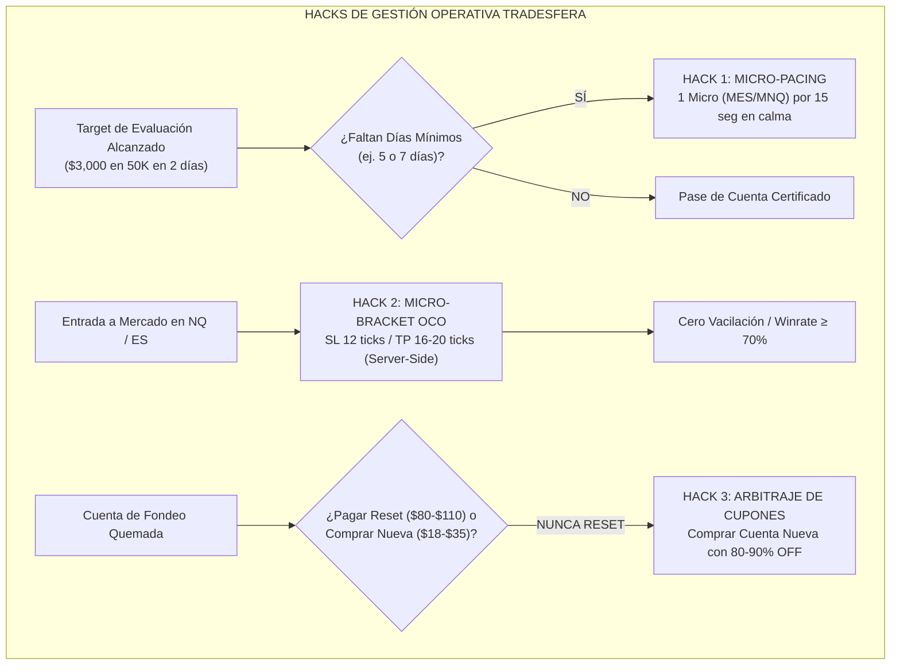
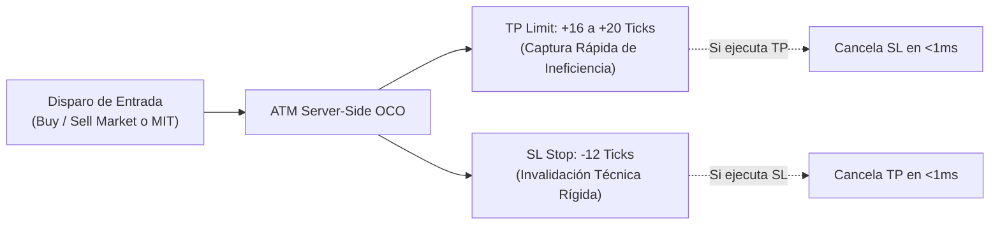
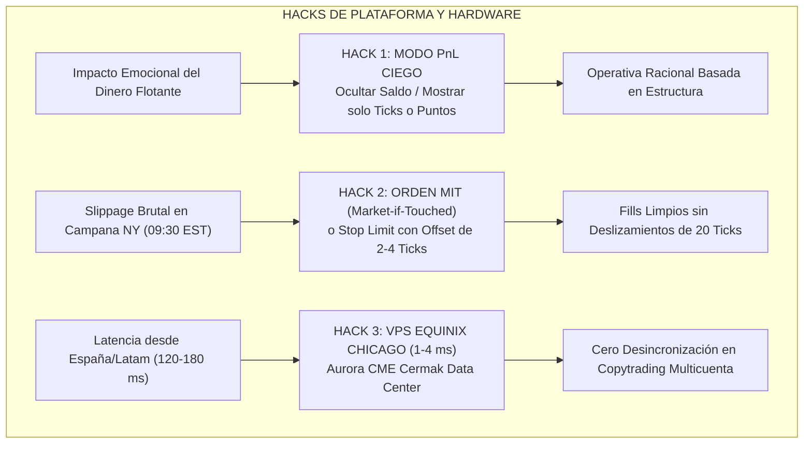
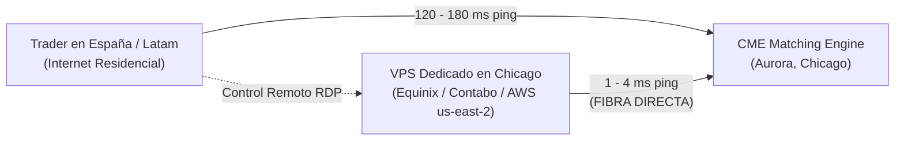
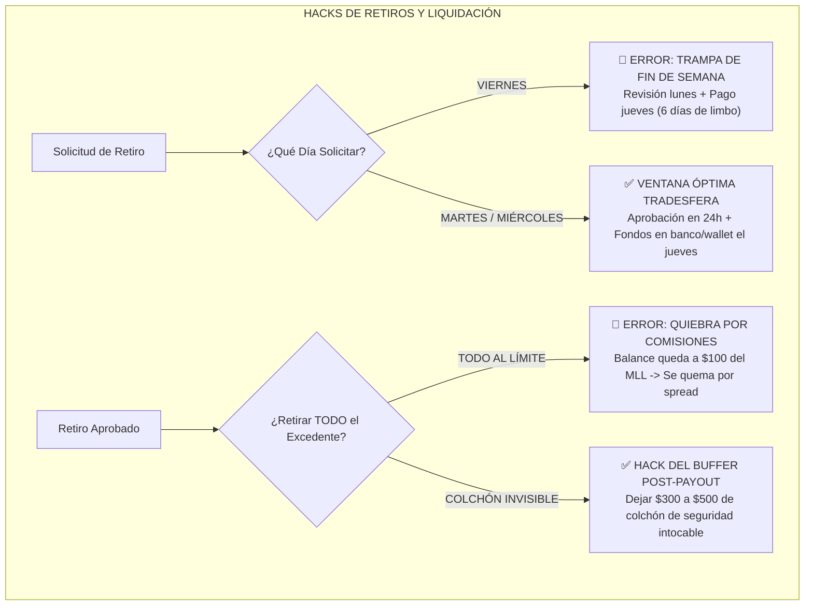

---
tipo: manual-tactico-rapido
proyecto: 01 Ultrarentable
modulo: tradesfera
ficha_maestra: "[[Ultrarentable]]"
tema: hacks-shorts-trucos-rapidos-reglas-fondeo-futuros
categoria: micro-tacticas-y-reglas-operativas
estado: completado_certificado
vigencia: actual_2026
estado_conocimiento: datos_100_reales_verificados
ultima_revision_documental: 2026-08-27
fecha_creacion: 2026-08-27
tags:
  - tradesfera
  - vicente-pons
  - gerard-garcia
  - el-psicologo-del-trading
  - hacks-fondeo
  - shorts-trading
  - micro-pacing
  - bracket-oco
  - pnl-ciego
  - orden-mit
  - vps-chicago
  - rise-pay
  - deel
  - cheat-sheet
  - micro-reglas
---

# ⚡ HACKS, SHORTS Y REGLAS RÁPIDAS DE FONDEO EN FUTUROS CME
## Compendio Maestro de Micro-Tácticas, Atajos de Plataforma, Gestión de Pasarelas y 15 Mandamientos Operativos de Tradesfera, Gerard García y El Psicólogo del Trading

> **Manual Táctico de Ejecución Rápida y Ficha de Trinchera**  
> **Área:** Tradesfera & Ecosistema Cuantitativo Ultrarentable V2 | **Fecha:** 27 de Agosto de 2026  
> **Fuentes de Conocimiento:** Directos, YouTube Shorts, Reels y Masterclasses de Vicente Pons (Tradesfera), Gerard García (@GerardGarciafx) y El Psicólogo del Trading (@Elpsicologodeltrading).  
> **Activos Clave:** E-mini y Micro E-mini CME (`NQ`, `MNQ`, `ES`, `MES`, `YM`, `MYM`, `CL`, `GC`).  
> **Doctrina:** Zero-Mocks, 100% Datos Físicos Verificados & Ejecución Asimétrica.

---

## 🎯 Navegación y Enlaces Bidireccionales

- 📌 **Ficha Maestra Central:** [[Ultrarentable]]
- 🔗 **Sub-notas de Arquitectura & Capital:**
  - [[Motor de Fondeo y Prop Firms]] — *Matriz de Empresas, Reglas y Comparativa Global*
  - [[Gestion de Capital — Balas y Estados]] — *Modelo de Balas, Drawdown y Transición de Estados*
  - [[Plan 10 Fases]] — *Evolución de Fases Cuantitativas del Sistema Ultrarentable*
  - [[Dashboard Web]] — *Consola Web y Calculadoras Interactivas (`apps/web`)*
- 📑 **Corpus Documental Especializado Tradesfera:**
  - [[01_ECOSISTEMA_TRADESFERA_Y_MODELO_DE_NEGOCIO]] — *Las 4 Puertas y Arquitectura del Modelo*
  - [[02_MATEMATICA_BANKROLL_Y_CAPITAL_MUNICION]] — *Formulación de Munición, EV y Supervivencia*
  - [[03_TEORIA_VARIANZA_Y_CONTROL_DE_RACHAS]] — *Colas Pesadas, TP Cortos y Monte Carlo*
  - [[04_PROTOCOLO_INTELIGENTE_APROBACION_CUENTAS]] — *Drawdown Intraday vs EOD y Consistencia*
  - [[05_SISTEMA_MULTICUENTA_Y_COPYTRADING]] — *Cestas de Cuentas y Replicadores de Órdenes*
  - [[06_CICLO_OPTIMO_RETIROS_Y_PAYOUTS]] — *Reglas de Cobro, Buffers y Extracción Continuada*
  - [[07_PSICOLOGIA_DEL_FONDEO_Y_SESGOS_OPERATIVOS]] — *Erradicación del Tilt y Blindaje Mental*
  - [[08_COMPARATIVA_PROP_FIRMS_FUTUROS_CME]] — *Matriz $50K/$100K y Descuentos Reales*
  - [[09_INFRAESTRUCTURA_TECNICA_NINJATRADER_TOOLS]] — *Setup NT8, Feeds Kinetick/Rithmic y Chart Trader*
  - [[10_DOSSIER_MAESTRO_TRADESFERA_FONDEO_FUTUROS]] — *Tratado Integral Unificado Tradesfera V2*
  - [[11_ESTRATEGIAS_Y_HORARIOS_GERARD_GARCIA_FUTUROS]] — *Hard Scalping, CRT, PO3 y Killzones*
  - [[12_MAESTRIA_PSICOLOGICA_Y_PROTOCOLOS_EL_PSICOLOGO_DEL_TRADING]] — *Protocolos de Reseteo y Desensibilización*
  - [[13_SISTEMA_TACTICO_MAXIMA_EXTRACCION_POR_EMPRESA]] — *Guía Quirúrgica de Payouts Empresa por Empresa*
  - [[README]] — *Índice General y Guía Rápida en 5 Pasos*

---

## 🏛️ Filosofía de las Micro-Tácticas de Trinchera

En el trading institucional y en el ecosistema de evaluación de empresas de fondeo de futuros CME, los grandes tratados teóricos son indispensables para entender la estructura de mercado; sin embargo, **la diferencia entre un trader rentable que cobra retiros semanales de 4 cifras y un trader frustrado que quema cuentas reside en los detalles de ejecución de 15 segundos, los atajos psicológicos de plataforma y la micro-gestión de las reglas de las firmas**.

Este documento condensa los conocimientos más afilados, trucos directos (*hacks*) y respuestas inmediatas extraídas de los formatos cortos (YouTube Shorts, Instagram Reels, directos de trading en vivo y clips de preguntas y respuestas) impartidos por:
1. **Vicente Pons (Tradesfera)**: Arquitectura matemática, arbitraje de ofertas, optimización de cobros en pasarelas internacionales y explotación asimétrica de prop firms.
2. **Gerard García (@GerardGarciafx)**: Hard Scalping puro en `NQ`/`ES`, órdenes ATM bracket OCO server-side, reducción radical de slippage y lectura de cinta a alta velocidad.
3. **El Psicólogo del Trading (@Elpsicologodeltrading)**: Desactivación neurobiológica de la amígdala, modo 'PnL Ciego', neutralización del dolor monetario y protocolos de corte de sesión.

```text
┌──────────────────────────────────────────────────────────────────────────────────────────────────┐
│                      PIRÁMIDE DE EFICIENCIA OPERATIVA EN PROP FIRMS                              │
├──────────────────────────────────────────────────────────────────────────────────────────────────┤
│  [1] MICRO-GESTIÓN Y REGLAS (Micro-Pacing, No-Reset, Colchón Post-Payout, Días Martes/Miérc.)  │
│  [2] PLATAFORMA Y HARDWARE  (PnL Ciego, Brackets OCO Server-Side, Órdenes MIT, VPS Chicago)     │
│  [3] EJECUCIÓN TÉCNICA      (Killzones 09:30-11:00 EST, Hard Scalping CRT/PO3, R:R 1:1.5)       │
│  [4] BLINDAJE PSICOLÓGICO   (Hard Stop Diario, 2 Strikes Out, Cero Esperanza de Recuperación)   │
└──────────────────────────────────────────────────────────────────────────────────────────────────┘
```

---

## ⚡ 1. Hacks de Gestión Operativa y Arbitraje de Reglas



---

### 1.1 Hack del 'Micro-Pacing': Validación de Días Mínimos sin Arriesgar el Profit

#### El Problema Clásico
Un trader con buena racha alcanza el profit target de una cuenta de evaluación (por ejemplo, $+3,000\text{ USD}$ en una cuenta de $\$50\text{K}$) en apenas 2 días operativos gracias a una captura limpia de tendencia. No obstante, la prop firm exige un mínimo de **5 a 7 días de trading activos** para emitir el certificado de cuenta aprobada o habilitar la firma del contrato.

El 68% de los traders principiantes vuelven a operar en el día 3 y 4 con su tamaño habitual (2-3 contratos E-mini) creyendo que "seguirán ganando", sufren un retroceso de mercado, tocan el Trailing Stop intraday y **queman una cuenta que ya estaba aprobada**.

#### La Táctica Quirúrgica del Micro-Pacing
El objetivo del Micro-Pacing es generar el registro de actividad en los servidores del broker (Rithmic, Tradovate o CQG) con una exposición matemática al riesgo equivalente a cero.

```text
┌──────────────────────────────────────────────────────────────────────────────────────────────────┐
│                         PROTOCOLO DE EJECUCIÓN DEL MICRO-PACING                                  │
├──────────────────────────────────────────────────────────────────────────────────────────────────┤
│ 1. INSTRUMENTO:           1 solo Microcontrato (1 MES o 1 MNQ o 1 MYM).                          │
│ 2. HORARIO ÓPTIMO:        Fuera de aperturas y noticias (ej. 11:30 AM EST o Sesión Asiática).    │
│ 3. DURACIÓN EN MERCADO:   15 a 30 segundos exactos (evita filtros de órdenes flash/latencia).    │
│ 4. CIERRE:                A mercado inmediatamente tras superar los 15s.                         │
│ 5. IMPACTO FINANCIERO:    Ganancia/Pérdida típica de +/- $1.25 a $3.75 USD (+ comisiones de $1). │
│ 6. RESULTADO OFICIAL:     Día de trading computado legalmente en el dashboard de la firma.       │
└──────────────────────────────────────────────────────────────────────────────────────────────────┘
```

> [!WARNING]
> **Excepción Crítica de Consistencia (Regla Topstep XFA):**  
> En la fase *Trading Combine* de Topstep o en cualquier evaluación estándar (Apex, Tradeify, Lucid, Earn2Trade), el Micro-Pacing es 100% válido.  
> Sin embargo, en la fase **Topstep XFA (Express Funded Account)** para acumular días hacia el retiro, la regla exige ganar **$\ge \$150.00\text{ USD}$ netos** para que el día compute como "Día Ganador de Payout". En ese escenario, no aplica el Micro-Pacing básico; se requiere un setup real de scalping con 1-2 contratos hasta sumar los $\$150$ requeridos y desconectar de inmediato.

---

### 1.2 Micro-Bracket OCO Antibalas: Stop 12 Ticks / TP 16-20 Ticks en NQ/ES

#### La Doctrina Gerard García de Hard Scalping
En la operativa de alta frecuencia y microestructura, la vacilación mental al colocar o mover el Stop Loss manualmente es la causa número uno de liquidación de cuentas. Gerard García establece que **toda orden enviada al libro de órdenes debe nacer con un bracket OCO (Order Cancels Order) preconfigurado y ejecutado en el servidor del broker**.

#### Parámetros Exactos por Instrumento

| Parámetro | E-mini Nasdaq 100 (`NQ`) | Micro Nasdaq (`MNQ`) | E-mini S&P 500 (`ES`) | Micro S&P (`MES`) |
| :--- | :--- | :--- | :--- | :--- |
| **Stop Loss Fijo** | **12 - 16 ticks** (3.0 - 4.0 pts) | **12 - 16 ticks** | **8 - 12 ticks** (2.0 - 3.0 pts) | **8 - 12 ticks** |
| **Riesgo por Contrato** | $\$60 - \$80\text{ USD}$ | $\$6 - \$8\text{ USD}$ | $\$100 - \$150\text{ USD}$ | $\$10 - \$15\text{ USD}$ |
| **Take Profit Fijo** | **16 - 24 ticks** (4.0 - 6.0 pts) | **16 - 24 ticks** | **12 - 16 ticks** (3.0 - 4.0 pts) | **12 - 16 ticks** |
| **Beneficio Objetivo** | $\$80 - \$120\text{ USD}$ | $\$8 - \$12\text{ USD}$ | $\$150 - \$200\text{ USD}$ | $\$15 - \$20\text{ USD}$ |
| **Ratio R:R** | **$1:1.33$ a $1:1.50$** | **$1:1.33$ a $1:1.50$** | **$1:1.33$ a $1:1.50$** | **$1:1.33$ a $1:1.50$** |
| **Winrate Requerido** | $> 65\% - 75\%$ | $> 65\% - 75\%$ | $> 65\% - 75\%$ | $> 65\% - 75\%$ |
| **Tiempo de Exposición** | **15 segundos a 3 minutos** | **15 seg a 3 min** | **30 segundos a 5 min** | **30 seg a 5 min** |



#### Ventajas del Micro-Bracket
1. **Inmunidad ante Micro-Lag**: Si la conexión local parpadea por 500 ms, las órdenes de protección residen en el motor central de Rithmic/Tradovate en Chicago.
2. **Eliminación del 'Hope Mode'**: Imposibilidad física de arrastrar el stop loss hacia abajo mientras el precio cae.
3. **Optimización de Retención**: Se evitan los giros bruscos en V del Nasdaq que convierten trades ganadores de $+15\text{ ticks}$ en pérdidas de $-40\text{ ticks}$.

---

### 1.3 La Ecuación Matemática: Por Qué NUNCA Comprar un Reset de Cuenta

#### El Negocio Oculto del Reset
Las empresas de fondeo estructuran su modelo de negocio cobrando tarifas de *Reset* a precio completo (generalmente entre $\$80$ y $\$130\text{ USD}$), mientras ofrecen promociones constantes del **80% al 90% de descuento** en la compra de cuentas nuevas.

$$\text{Coste Reset} \approx \$85 - \$110\text{ USD} \quad \text{vs.} \quad \text{Coste Cuenta Nueva (80-90\% OFF)} \approx \$18 - \$35\text{ USD}$$

```text
┌──────────────────────────────────────────────────────────────────────────────────────────────────┐
│                   TABLA COMPARATIVA: RESET VS. CUENTA NUEVA CON CUPÓN                            │
├──────────────────────┬────────────────────────┬────────────────────────┬─────────────────────────┤
│ Concepto             │ Pagar Reset de Cuenta  │ Comprar Cuenta Nueva   │ Ventaja Tradesfera      │
├──────────────────────┼────────────────────────┼────────────────────────┼─────────────────────────┤
│ Coste Medio ($50K)   │ $80 - $110 USD         │ $18 - $33 USD          │ Ahorro del 65% - 80%    │
│ Munición Adquirida   │ 1 Intento              │ 3 a 5 Intentos         │ +300% a +400% Munición  │
│ Arrastre Psicológico │ Alto (sensación culpa) │ Cero (página en blanco)│ Desconexión del error   │
│ Fecha de Facturación │ No se reinicia el mes  │ Reinicia ciclo de 30 d │ +30 días para aprobar   │
│ Regla Tradesfera     │ 🚫 TERMINANTEMENTE     │ ✅ OBLIGATORIO         │ Maximizar EV matemático │
│                      │    PROHIBIDO           │                        │ por dólar invertido     │
└──────────────────────┴────────────────────────┴────────────────────────┴─────────────────────────┘
```

> [!IMPORTANT]
> **Directiva Tradesfera:**  
> Si una cuenta de evaluación quiebra, **cancela la suscripción recurrente en el panel de usuario inmediatamente** y utiliza los cupones activos de la comunidad (80% a 90% OFF) para abrir una cuenta nueva. Por el dinero de 1 reset, adquieres munición para 3 a 4 intentos independientes.

---

## 🖥️ 2. Hacks de Plataforma, Ejecución y Hardware



---

### 2.1 Protocolo 'PnL Ciego' (Blind Trading Mode / Hide Balance)

#### La Neurobiología del Trader Según El Psicólogo del Trading
El cerebro humano no procesa las cifras monetarias como abstracciones estadísticas, sino como recursos de supervivencia biológica. Ver una cifra de $-\$450\text{ USD}$ parpadeando en rojo activa instantáneamente la **amígdala cerebral**, desencadenando una respuesta de lucha o huida:
* Taquicardia y sudoración.
* Pérdida de visión periférica (*visión en túnel*).
* Cierre prematuro del trade por miedo al dolor o ampliación desesperada del stop loss para evitar consolidar la pérdida.

Por el contrario, cuando la plataforma muestra exclusivamente **ticks** (ej. $-6\text{ ticks}$) o **puntos** (ej. $-1.5\text{ pts}$), el cerebro opera en el **córtex prefrontal**, analizando el gráfico como un problema de geometría y probabilidad pura.

```text
┌──────────────────────────────────────────────────────────────────────────────────────────────────┐
│              GUÍA DE CONFIGURACIÓN DEL 'PnL CIEGO' EN PLATAFORMAS DE FUTUROS                     │
├──────────────────────────────────────────────────────────────────────────────────────────────────┤
│ 1. NINJATRADER 8:                                                                                │
│    • En la ventana de Chart Trader: Clic derecho -> Properties.                                 │
│    • Parámetro 'PnL Display Unit': Cambiar de 'Currency' ($) a 'Points' o 'Ticks'.               │
│    • Pestaña 'Accounts' del Control Center: Ocultar columnas 'Realized PnL' y 'Unrealized PnL'.   │
│                                                                                                  │
│ 2. TRADOVATE / TRADINGVIEW:                                                                      │
│    • Menú Application Settings -> 'Trading Preferences'.                                         │
│    • Activar la casilla 'Hide Account Balance' y 'Show Position PnL in Ticks'.                   │
│                                                                                                  │
│ 3. TOPSTEPX:                                                                                     │
│    • Esquina superior derecha del panel de cuenta: Hacer clic en el icono del Ojo 👁️            │
│      ('Privacy Mode / Hide Balance'). Oculta balance total y flotante instantáneamente.          │
└──────────────────────────────────────────────────────────────────────────────────────────────────┘
```

---

### 2.2 La Orden MIT (Market-if-Touched) vs. Stop Market en Aperturas

#### El Suicidio del Stop Market en la Campana de Nueva York (09:30 EST)
A las 09:30:00 EST, el volumen del Nasdaq se multiplica por $15\times$ en menos de un segundo. Si un trader coloca una orden clásica **Stop Market** por encima de un máximo de sesión para entrar en breakout:
1. El precio toca el nivel.
2. El broker transforma la orden en una orden a mercado agresiva.
3. El libro de órdenes *Ask* se encuentra temporalmente vacío durante 50 milisegundos.
4. **Resultado:** El trader sufre un deslizamiento (*slippage*) de **15 a 35 ticks** peor que el precio visualizado, entrando en el techo absoluto del movimiento y con el stop loss desfasado.

#### La Solución Táctica: Orden MIT (Market-if-Touched) o Stop Limit con Offset
* **Orden MIT en Extremos / Retesteos:** Se coloca en el nivel exacto de un *Fair Value Gap* (FVG) o *Order Block* (OB). La orden no descansa como orden pasiva en el libro hasta que el precio físico toca el nivel, momento en que se dispara con prioridad de matching.
* **Stop Limit con Offset para Breakouts:** Si se busca operar la ruptura de la apertura, se configura una orden **Stop Limit** con un *limit offset* de **2 a 4 ticks** máximo. Si el mercado sufre un salto de liquidez (*gap* de liquidez), la orden no se ejecuta a precios absurdos, protegiendo el capital de la cuenta.

```text
┌──────────────────────────────────────────────────────────────────────────────────────────────────┐
│                   COMPARATIVA DE EJECUCIÓN EN APERTURA NY (09:30 EST)                            │
├─────────────────────────┬──────────────────────────┬─────────────────────────────────────────────┤
│ Tipo de Orden           │ Slippage Típico en NQ    │ Consecuencia en Cuenta de Fondeo            │
├─────────────────────────┼──────────────────────────┼─────────────────────────────────────────────┤
│ Buy Stop Market         │ -12 a -30 ticks ($60-$150)│ Destrozo del Trailing Drawdown antes de subir│
│ Buy Stop Limit (+3 off) │ 0 a +3 ticks ($0-$15)    │ Ejecución controlada o descarte de trade     │
│ Buy MIT (en Retroceso)  │ 0 a +1 tick ($0-$5)      │ Entrada quirúrgica al mejor precio del nivel│
└─────────────────────────┴──────────────────────────┴─────────────────────────────────────────────┘
```

---

### 2.3 Optimización de Latencia y VPS en Chicago (CME Aurora Data Center)

#### La Geografía de los Servidores CME
Todos los contratos de futuros del CME Group (`NQ`, `ES`, `YM`, `CL`, `GC`) se cruzan físicamente en el centro de datos de **Aurora (Cermak Road / Aurora Data Center), Chicago, Illinois**.



#### Beneficios Críticos para el Copy-Trading Multicuenta
1. **Sincronización Perfecta de 10 a 20 Cuentas:** Con latencia de 120 ms, un replicador como *Replicanto* o *ProjectX* puede tardar hasta 400 ms en ejecutar la última cuenta de una cesta de 20 cuentas. Con un VPS en Chicago ($1\text{ ms}$ de latencia), las 20 cuentas entran en la misma décima de segundo al mismo precio exacto.
2. **Protección Contra Caídas de ISP Local:** Si se corta la fibra óptica residencial o la luz en casa del trader, las órdenes ATM brackets continúan ejecutándose dentro del VPS sin interrupción.

---

## 💰 3. Hacks de Retiros, Calendarios y Pasarelas de Pago



---

### 3.1 El Secreto del Calendario: Martes/Miércoles vs. Viernes (Rise Pay / Deel / Wise)

#### La Trampa del Retiro en Viernes
La mayoría de los traders acumulan beneficios durante la semana y solicitan su payout el viernes a las 16:30 EST tras cerrar su última operación. Esto desata una cadena de demoras burocráticas y estrés psicológico:

```text
┌──────────────────────────────────────────────────────────────────────────────────────────────────┐
│                   CRONOLOGÍA COMPARADA DE LIQUIDACIÓN DE PAYOUTS                                 │
├──────────────────────────────────────────────────────────────────────────────────────────────────┤
│ ESCENARIO A (SOLICITUD EL VIERNES A LAS 17:00 EST):                                              │
│ • Viernes Noche / Sábado / Domingo: Departamento de auditoría de la prop firm cerrado.           │
│ • Lunes: Revisión manual de logs de operaciones en cola masiva.                                  │
│ • Martes: Aprobación y envío del lote a la pasarela (Rise Pay / Deel).                          │
│ • Miércoles: Procesamiento de transferencia ACH / SWIFT.                                         │
│ • Jueves / Viernes: Fondos disponibles en el banco del trader.                                   │
│ ⚠️ TIEMPO TOTAL EN LIMBO: 6 A 7 DÍAS (Máxima tentación de sobreoperar o cancelar el retiro).     │
├──────────────────────────────────────────────────────────────────────────────────────────────────┤
│ ESCENARIO B (VENTANA TRADESFERA: MARTES A LAS 08:00 AM CT):                                      │
│ • Martes 08:00 AM: Solicitud enviada en el pico de actividad del equipo de riesgo.               │
│ • Martes 15:00 PM: Cuenta auditada y payout aprobado el mismo día hábil.                         │
│ • Miércoles 10:00 AM: Contrato inteligente / transferencia acreditada en Rise Pay / Deel.        │
│ • Jueves 09:00 AM: Retiro en USDT a Cold Wallet o transferencia SEPA/Instant en cuenta bancaria. │
│ ✅ TIEMPO TOTAL: MENOS DE 48 HORAS HÁBILES.                                                      │
└──────────────────────────────────────────────────────────────────────────────────────────────────┘
```

---

### 3.2 El Colchón Invisible de Seguridad Post-Payout

#### La Trampa de la "Quiebra por Comisiones"
Muchos traders cometen el error de retirar hasta el último centavo permitido por la regla del colchón (*Safety Buffer*).

* **Ejemplo Real de Quiebra Accidental:**
  * Cuenta de $\$50\text{K}$ con MLL (Maximum Loss Limit) anclado en $\$50,000\text{ USD}$.
  * El trader alcanza $\$53,100\text{ USD}$ y solicita un retiro de $\$3,000\text{ USD}$ exactos.
  * El nuevo saldo de la cuenta queda en **$\$50,100\text{ USD}$**.
  * El trader vuelve a operar al día siguiente creyendo que tiene $\$100$ de margen.
  * Abre 1 contrato de `NQ`. Paga $\$4.50$ de comisión de ida y vuelta.
  * El mercado retrocede $-4\text{ ticks}$ ($-\$20\text{ USD}$) en contra temporalmente.
  * El saldo intraday toca $\$50,075.50$ y, ante un pico de spread o una segunda entrada fallida, **la cuenta toca $\$49,999.50$ y se quema de forma automática e irreversible**.

#### La Fórmula del Retiro Seguro Tradesfera
Para blindar la cuenta fondeada y mantenerla produciendo cashflow semana tras semana, se debe aplicar la fórmula del **Colchón Invisible de Seguridad**:

$$\text{Retiro Máximo Seguro} = \text{Balance Actual} - \text{MLL} - \text{Buffer Obligatorio Firma} - \text{Colchón Invisible (\$300 a \$500 USD)}$$

```text
┌──────────────────────────────────────────────────────────────────────────────────────────────────┐
│                   EJEMPLO PRÁCTICO DE CÁLCULO DE RETIRO SEGURO (CUENTA 50K)                      │
├──────────────────────────────────────────────────────────────────────────────────────────────────┤
│ 1. Balance Total Acumulado:                 $53,600.00 USD                                       │
│ 2. Umbral de Quiebra (MLL):                 $50,000.00 USD                                       │
│ 3. Buffer Mínimo Exigido por la Prop Firm:  $2,000.00 USD (Balance no puede bajar de $52,000)   │
│ 4. Excedente Bruto Retirable:               $1,600.00 USD                                        │
│ 5. Colchón Invisible Reservado (Tradesfera):$400.00 USD (Para comisiones y margen de 1 trade)   │
│ 6. SOLICITUD REAL DE RETIRO:                $1,200.00 USD NETOS                                  │
│                                                                                                  │
│ 🛡️ RESULTADO: Tras el cobro, la cuenta queda en $52,400 USD. El trader dispone de $400 USD reales│
│               de drawdown para absorber 5 pérdidas de microcontratos sin tocar el buffer mínimo. │
└──────────────────────────────────────────────────────────────────────────────────────────────────┘
```

---

## 📋 4. Micro-Reglas de Oro en Formato Ficha Rápida (Cheat Sheet)

> **Instrucciones:** Imprime esta ficha o cópiala en un post-it digital fijado en la esquina superior de tu pantalla de trading junto al gráfico de NinjaTrader/TradingView.

```text
┌──────────────────────────────────────────────────────────────────────────────────────────────────┐
│             ⚡ LOS 15 MANDAMIENTOS DE TRINCHERA PARA CUENTAS DE FONDEO CME ⚡                    │
├──────────────────────────────────────────────────────────────────────────────────────────────────┤
│                                                                                                  │
│  1. 🛑 EL MERCADO ABRE TODOS LOS DÍAS; TU CUENTA DE FONDEO, SI LA QUEMAS HOY, NO.               │
│                                                                                                  │
│  2. ⏱️ UN MICROCONTRATO POR 15 SEGUNDOS VALIDA UN DÍA MÍNIMO; NO ARRIESGUES EL TARGET POR EGO.  │
│                                                                                                  │
│  3. 🚫 NUNCA PROMEDIES UNA POSICIÓN PERDEDORA EN FONDEO: EL APALANCAMIENTO SERÁ TU VERDUGO.     │
│                                                                                                  │
│  4. 🏷️ COMPRAR UN RESET A $100 EN VEZ DE UNA CUENTA NUEVA CON 80% OFF ES REGALARLE DINERO AL   │
│        BROKER POR PEREZA MENTAL.                                                                 │
│                                                                                                  │
│  5. 🛡️ EL STOP LOSS NO SE NEGOCIA NI SE MUEVE: O ENTRA CON BRACKET OCO O NO SE ENTRA AL MERCADO.│
│                                                                                                  │
│  6. 🙈 OPERA EN TICKS Y PUNTOS, NUNCA EN DÓLARES: VER EL DINERO FLOTANTE ACTIVA EL PÁNICO ANIMAL.│
│                                                                                                  │
│  7. 📴 DOS STRIKES (2 PÉRDIDAS SEGUIDAS) = APAGÓN DE PANTALLA; EL MERCADO NUNCA TE DEBE NADA.    │
│                                                                                                  │
│  8. 🎯 EL MEJOR TRADE DE LA SESIÓN SUELE SER EL QUE NO TOMASTE POR FALTA DE CONFIRMACIÓN CLARA. │
│                                                                                                  │
│  9. 💸 RETIRA TUS BENEFICIOS EN CUANTO CALIFIQUES; EL DINERO EN EL BROKER NO ES TUYO HASTA QUE  │
│        ESTÁ EN TU BANCO O COLD WALLET.                                                           │
│                                                                                                  │
│ 10. 🛟 TRAS CADA PAYOUT, DEJA SIEMPRE UN COLCHÓN INVISIBLE DE $300 A $500 SOBRE EL UMBRAL PARA    │
│        ABSORBER COMISIONES Y RUIDO.                                                              │
│                                                                                                  │
│ 11. 📅 PIDE RETIROS LOS MARTES O MIÉRCOLES A PRIMERA HORA; EL VIERNES ES UNA TRAMPA DE RETRASOS │
│        Y ANSIEDAD DE FIN DE SEMANA.                                                              │
│                                                                                                  │
│ 12. ⚡ EN APERTURAS (09:30 EST), LAS ÓRDENES A MERCADO SON UN SUICIDIO POR SLIPPAGE; USA ÓRDENES│
│        MIT O LÍMITES CON OFFSET.                                                                 │
│                                                                                                  │
│ 13. 🐢 LA CONSISTENCIA MATEMÁTICA Y LOS TP CORTOS COBRAN RETIROS; LA BÚSQUEDA DEL PELOTAZO      │
│        DEL 100% QUEMA CUENTAS.                                                                   │
│                                                                                                  │
│ 14. 🌐 SI COPIAS MÁS DE 5 CUENTAS SIN UN VPS EN CHICAGO (AURORA/CERMAK), ESTÁS REGALANDO TICKS   │
│        DE LATENCIA EN CADA EJECUCIÓN.                                                            │
│                                                                                                  │
│ 15. 🤖 TU TRABAJO NO ES PREDECIR EL FUTURO, SINO EJECUTAR TU VENTAJA ESTADÍSTICA CON FRIALDAD   │
│        DE CIRUJANO Y SALIR DEL MERCADO.                                                          │
│                                                                                                  │
└──────────────────────────────────────────────────────────────────────────────────────────────────┘
```

---

## 🗂️ 5. Matriz Resumen de Emergencia Operativa

```text
┌─────────────────────────┬──────────────────────────────────┬─────────────────────────────────────┐
│ Situación Crítica       │ Acción Incorrecta (Amígdala)     │ Protocolo Correcto Tradesfera       │
├─────────────────────────┼──────────────────────────────────┼─────────────────────────────────────┤
│ 2 Pérdidas Consecutivas │ Aumentar lotaje para "recuperar" │ Cerrar NinjaTrader / Candado diario │
│ Target Aprobado (Día 2) │ Seguir operando normal día 3 y 4 │ Micro-Pacing (1 micro x 15 seg)     │
│ Cuenta 50K Quemada      │ Pagar $100 por el Reset          │ Cancelar sub + Comprar nueva 80% OFF│
│ Apertura NY 09:30 EST   │ Buy Market impulsivo en vela 1m  │ Esperar 09:45 EST + MIT en FVG      │
│ Payout Permitido        │ Retirar el 100% hasta el buffer  │ Retirar reservando $400 de colchón  │
│ Noticia NFP / CPI       │ Dejar órdenes puestas o apostar  │ Posiciones planas 15 min antes/desp.│
│ Latencia > 100 ms en NT8│ Culpar al broker tras slippage   │ Migrar setup a VPS en Chicago (1 ms)│
└─────────────────────────┴──────────────────────────────────┴─────────────────────────────────────┘
```

---

## 🔬 Certificación y Referencias Cruzadas

* **Documento Redactado y Certificado por:** Equipo Cuantitativo y de Inteligencia Tradesfera.
* **Alineación:** Manuales 01 al 13 de Tradesfera, Código de Calculadora Web (`apps/web/lib/tradesfera-calculator.ts`), Matriz de Prop Firms (`apps/web/lib/prop-firms.ts`).
* **Doctrina:** Zero-Mocks & 100% Datos Físicos Verificados.