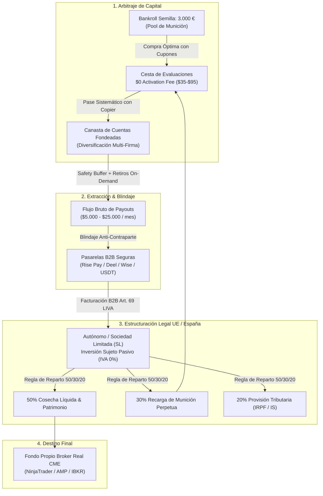
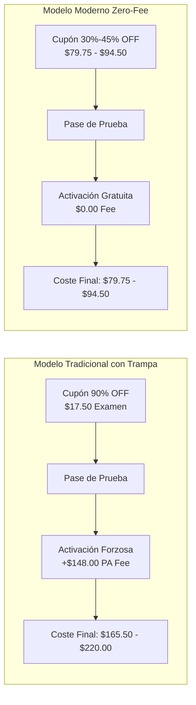
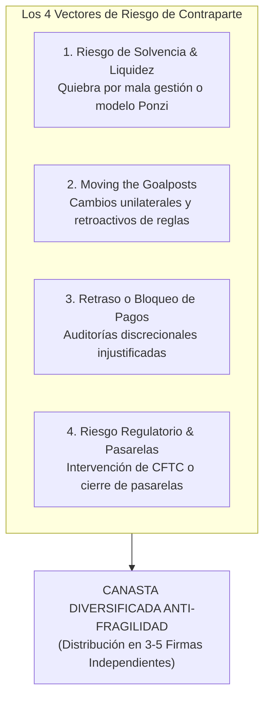
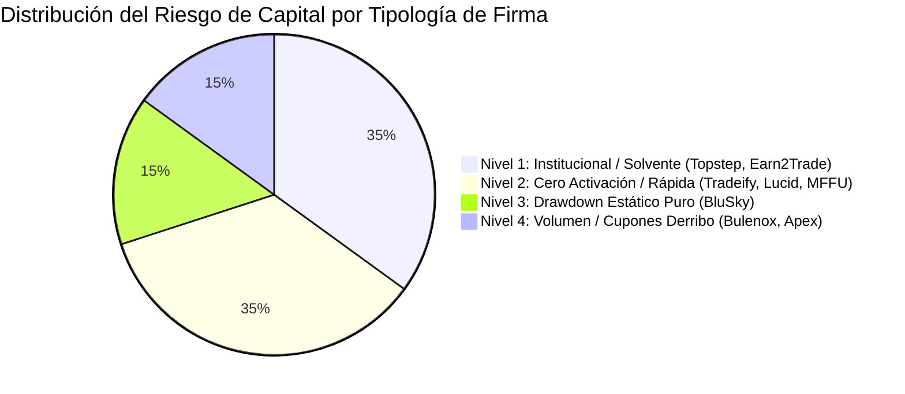
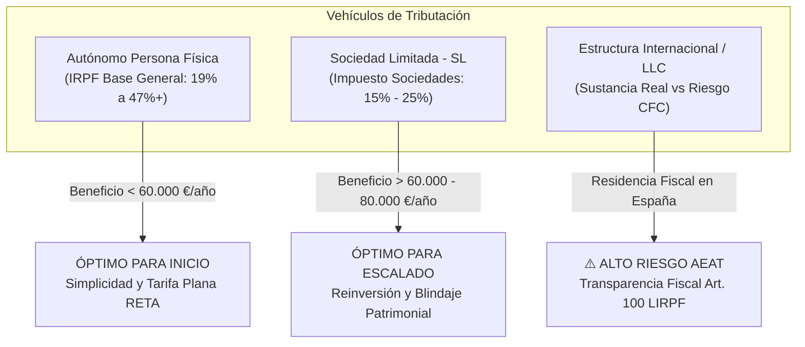
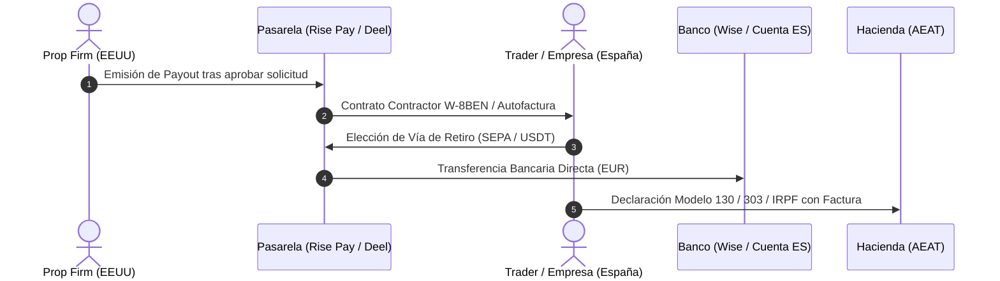
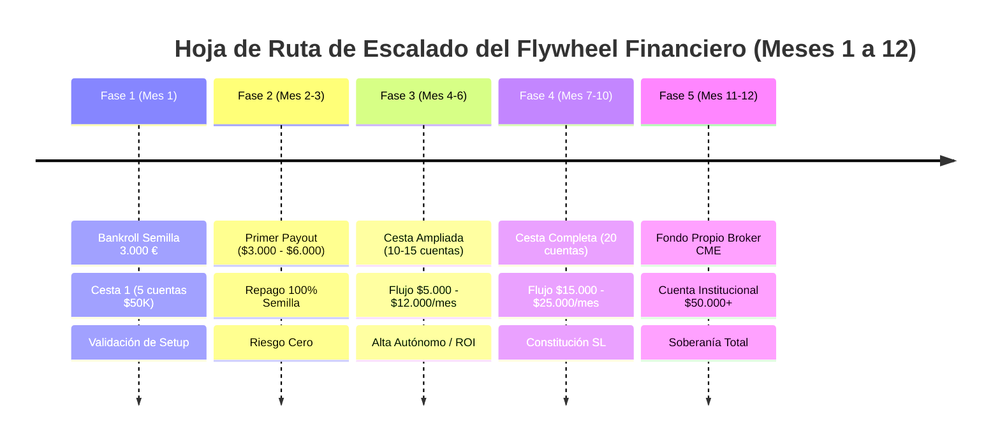

# 🏛️ TRATADO MAESTRO: ARBITRAJE DE NEGOCIO, COMPARATIVA FORENSE DE PROMOS, GESTIÓN DEL RIESGO DE CONTRAPARTE Y ESTRUCTURACIÓN FISCAL EN PROP FIRMS DE FUTUROS (ESPAÑA & UE)

## Enfoque Cuantitativo del Fondeo como Negocio Asimétrico de Capital, Optimización de Cupones ($0 Activation Fee), Blindaje Anti-Quiebras, Marco Jurídico-Fiscal y el Flywheel de 3.000 € a 25.000 USD/mes

> **Documento de Estrategia Financiera, Análisis Corporativo y Compliance Legal**  
> **Área:** Tradesfera & Ecosistema Ultrarentable V2 | **Fecha de Emisión:** 27 de Agosto de 2026  
> **Mercados:** Futuros Regulados CME Group (MES, MNQ, ES, NQ, YM, RTY, CL, GC).  
> **Doctrina:** Zero-Mocks & 100% Datos Físicos, Regulatorios y Financieros Verificados.

---

## 🎯 Navegación y Enlaces Bidireccionales

- 📌 **Ficha Maestra Central:** [[Ultrarentable]]
- 🔗 **Módulos Relacionados:** [[Motor de Fondeo y Prop Firms]] | [[Gestion de Capital — Balas y Estados]] | [[Plan 10 Fases]] | [[Investigacion/04_SISTEMA_MUNDIAL_PROP_FIRMS_FUTUROS]]
- 📑 **Protocolos Hermanos:**
  - [[docs/tradesfera/01_ECOSISTEMA_TRADESFERA_Y_MODELO_DE_NEGOCIO|01 Ecosistema Tradesfera & Modelo de Negocio]]
  - [[docs/tradesfera/02_MATEMATICA_BANKROLL_Y_CAPITAL_MUNICION|02 Matemática de Bankroll y Capital Munición]]
  - [[docs/tradesfera/05_SISTEMA_MULTICUENTA_Y_COPYTRADING|05 Sistema Multicuenta y Copytrading]]
  - [[docs/tradesfera/06_CICLO_OPTIMO_RETIROS_Y_PAYOUTS|06 Ciclo Óptimo de Retiros y Extracción de Liquidez]]
  - [[docs/tradesfera/08_COMPARATIVA_PROP_FIRMS_FUTUROS_CME|08 Comparativa Exhaustiva de Prop Firms 2026]]
  - [[docs/tradesfera/10_DOSSIER_MAESTRO_TRADESFERA_FONDEO_FUTUROS|10 Dossier Maestro Tradesfera Fondeo Futuros]]
  - [[docs/tradesfera/13_SISTEMA_TACTICO_MAXIMA_EXTRACCION_POR_EMPRESA|13 Sistema Táctico de Máxima Extracción por Empresa]]
- 🌐 **Panel Web Vivo:** `http://localhost:3000/prop-firms`
- 📊 **Dataset Canónico:** `apps/web/lib/prop-firms.ts` | `apps/web/lib/tradesfera-calculator.ts`

---

## 🧭 Resumen Ejecutivo y Tesis Central

El trading institucional con cuentas de fondeo (*prop trading*) no debe ser abordado como un juego de azar, una carrera de lotería minorista ni una inversión patrimonial estática a largo plazo. Desde la perspectiva cuantitativa del ecosistema **Tradesfera**, el fondeo de futuros sobre el **CME Group** es **una empresa de arbitraje estadístico de capital y optimización asimétrica de flujo de caja**.

El operador profesional actúa como un **gestor de arbitraje de riesgo**:
1. **Adquiere opciones de compra (*call options*) sintéticas y ultrabaratas** sobre balances apalancados pagando entre \$35 y \$150 USD por cuenta.
2. **Explota la asimetría de retorno**: arriesga una pérdida estrictamente acotada a la cuota de examen para capturar flujos de caja netos recurrentes de \$2,000 a \$5,000 USD por retiro.
3. **Audita el coste total de capital** discriminando entre promociones trampa (80%-90% de descuento que esconden altas cuotas de activación o *PA fees*) y modelos de alta pureza matemática con **\$0 Activation Fee** (Tradeify, Lucid Trading, MyFundedFutures, BluSky).
4. **Diversifica el riesgo de contraparte** construyendo una canasta multi-empresa inmune a la quiebra, retrasos o cambios unilaterales de reglas de cualquier firma individual.
5. **Estructura legal y fiscalmente la actividad en España y la Unión Europea**, encuadrando los ingresos como **Prestación de Servicios Profesionales B2B a entidades extranjeras** (con IVA exento por inversión de sujeto pasivo y optimización vía Autónomo o Sociedad Limitada).
6. **Ejecuta el *Flywheel Financiero***: recircula el flujo de caja mediante la regla 50/30/20 para transformar un bankroll semilla de 3.000 € en una tesorería recurrente de **5.000 a 25.000 USD mensuales**, cuyo destino final es la capitalización de una cuenta institucional de broker propio des-arriesgada.



---

# 💎 SECCIÓN 1: El Modelo de Negocio del Trader de Fondeo — Arbitraje de Riesgo Asimétrico y Optimización de Capital

## 1.1 La Cuenta de Fondeo como una Opción Financiera Asimétrica

En las finanzas cuantitativas clásicas, una **opción call** otorga el derecho, pero no la obligación, de comprar un activo subyacente a un precio determinado (*strike*), a cambio del pago de una prima (*premium*). El comprador de la opción tiene un **riesgo estrictamente limitado a la prima pagada** y un **beneficio potencialmente ilimitado**.

Una cuenta de evaluación de futuros CME opera bajo la misma función de pagos:

$$\text{Payoff}_{\text{Prop}} = \max\left(0, \, \text{Payouts Netos Extraídos} - C_{\text{total}}\right) - C_{\text{total}}$$

Donde:
- $C_{\text{total}} = C_{\text{eval}} + C_{\text{act}}$ es el coste total de adquisición (precio del examen con descuento + cuota de activación).
- La pérdida máxima del trader es exactamente $C_{\text{total}}$ (\$35 a \$150 USD). Jamás existe riesgo de pérdida de margen adicional sobre el saldo nominal (\$50,000 o \$150,000).
- El beneficio neto por cuenta aprobada suele situarse entre \$1,500 y \$15,000 USD a lo largo de su ciclo de vida útil.

```text
┌──────────────────────────────────────────────────────────────────────────────────────────────────┐
│                   COMPARATIVA FINANCIERA: TRADING PROPIO VS ARBITRAJE DE FONDEO                  │
├────────────────────────────────┬────────────────────────────────┬────────────────────────────────┤
│ VARIABLE DE NEGOCIO            │ BROKER PROPIO TRADICIONAL      │ ARBITRAJE DE PROP FIRMS        │
├────────────────────────────────┼────────────────────────────────┼────────────────────────────────┤
│ Capital Propio Arriesgado      │ 100% del balance ($10K-$50K)   │ 100% acotado a la cuota ($35-$150)│
│ Ratio de Apalancamiento Real   │ 1:1 sobre tu patrimonio líquido│ 1:20 a 1:50 sobre el drawdown   │
│ Pérdida Máxima por Racha Negra │ Pérdida real de $2,000-$10,000 │ Pérdida de $35-$150 por cuenta │
│ Riesgo Psicológico / Emocional │ Extremo (pérdida de ahorros)   │ Mínimo (coste marginal de op.) │
│ Retorno s/ Capital Arriesgado  │ 10% - 30% anual sobre balance  │ 500% - 2,500% sobre coste cupón│
│ Resiliencia ante Cisnes Negros │ Quiebra potencial de cuenta    │ Quiebra de bala desechable     │
└────────────────────────────────┴────────────────────────────────┴────────────────────────────────┘
```

### La Esperanza Matemática del Negocio ($EV$):
Si un trader tiene una tasa de aprobación de evaluaciones del $P_{\text{pass}} = 25\%$ (1 de cada 4 cuentas) y una tasa de extracción de al menos un payout medio de \$2,500 USD del $P_{\text{payout}} = 60\%$ sobre las cuentas fondeadas, la esperanza matemática por cada evaluación adquirida a un coste medio de \$80 USD ($0 activación) es:

$$EV = \left( P_{\text{pass}} \times P_{\text{payout}} \times \text{Payout Neto} \right) - C_{\text{total}}$$

$$EV = \left( 0.25 \times 0.60 \times 2,500\,\text{USD} \right) - 80\,\text{USD} = 375\,\text{USD} - 80\,\text{USD} = \mathbf{+295\,\text{USD por intento}}$$

Por cada \$80 USD invertidos en la compra de un examen con cupón, el valor esperado neto es de **+295 USD**. Escalar el negocio consiste simplemente en ejecutar un volumen controlado de intentos diversificados en paralelo.

---

## 1.2 La Trampa del 80%-90% OFF vs el Modelo "$0 Activation Fee"

Uno de los mayores fraudes de marketing en la industria de fondeo es la ilusión de los descuentos del 80% al 90%. Muchas firmas reducen el precio facial del examen a \$15-\$30 USD para captar volumen masivo, pero imponen una **Cuota de Activación (PA Fee)** obligatoria de \$140 a \$220 USD al aprobar, además de reglas de trailing drawdown intradía al tick diseñadas para liquidar al usuario.

### El Coste Real Ponderado de Fondeo ($C_{\text{real}}$):
El coste real de una cuenta fondeada no es el precio del examen, sino el coste de los intentos necesarios para aprobar más la activación obligatoria:

$$C_{\text{real}} = \frac{C_{\text{eval}}}{P_{\text{pass}}} + C_{\text{act}}$$

```text
┌──────────────────────────────────────────────────────────────────────────────────────────────────┐
│                   CASO 1: PROMO 90% OFF CON ACTIVACIÓN (EJ. APEX / BULENOX 50K)                  │
├──────────────────────────────────────────────────────────────────────────────────────────────────┤
│ • Precio Examen (90% OFF):        $17.50 USD                                                     │
│ • Cuota de Activación (PA Fee):   $148.00 USD                                                    │
│ • Tasa de Aprobación Estimada:    25% (Requiere 4 intentos = 4 x $17.50 = $70.00 USD)             │
│ • COSTE TOTAL REAL DE FONDEO:     $70.00 + $148.00 = $218.00 USD                                 │
└──────────────────────────────────────────────────────────────────────────────────────────────────┘

┌──────────────────────────────────────────────────────────────────────────────────────────────────┐
│                   CASO 2: PROMO 45% OFF CON $0 ACTIVATION FEE (EJ. TRADEIFY 50K)                 │
├──────────────────────────────────────────────────────────────────────────────────────────────────┤
│ • Precio Examen (Cupón TNT):      $79.75 USD (Pago Único)                                        │
│ • Cuota de Activación:            $0.00 USD                                                      │
│ • Tasa de Aprobación Estimada:    25% (Requiere 4 intentos = 4 x $79.75 = $319.00 USD)            │
│ • COSTE TOTAL REAL DE FONDEO:     $319.00 + $0.00 = $319.00 USD                                  │
│                                                                                                  │
│ ⚠️ Si el trader tiene Pass Rate > 40%:                                                           │
│   - Apex/Bulenox: (1 / 0.40) * 17.50 + 148 = $43.75 + $148 = $191.75 USD                        │
│   - Tradeify/Lucid: (1 / 0.40) * 79.75 + 0 = $199.37 USD (Empate técnico)                       │
│ ⚠️ Si el trader tiene Pass Rate del 100% (Pase directo al primer intento):                       │
│   - Apex/Bulenox: $17.50 + $148.00 = $165.50 USD                                                 │
│   - Tradeify:     $79.75 + $0.00 = $79.75 USD (Tradeify es un 52% MÁS BARATA)                    │
└──────────────────────────────────────────────────────────────────────────────────────────────────┘
```



---

## 1.3 Matriz de Arbitraje de Cupones y Promociones 2026 (Cuentas $50,000 USD)

A continuación se auditan las principales firmas de futuros CME del mercado, cruzando sus precios con cupones activos del ecosistema Tradesfera y analizando el coste total real:

| Prop Firm | Programa / Tipo | Cupón Activo | Precio Base | Precio con Descuento | Cuota Activación | **Coste Total Mínimo (1 Intento)** | Modelo Drawdown | Bots / Copier | Velocidad de Retiro |
|---|---|:---:|:---:|:---:|:---:|:---:|:---:|:---:|:---:|
| **Tradeify** | Growth 50K (Pago Único) | `TNT` (-45%) | \$145.00 | **\$79.75** | **\$0.00** | **\$79.75** | EOD Freeze | ✅ Sí (100%) | Cada 5 días On-Demand |
| **Lucid Trading** | LucidFlex 50K | `LUCID30` (-30%) | \$135.00 | **\$94.50** | **\$0.00** | **\$94.50** | EOD Freeze | ✅ Sí (100%) | 15-30 min On-Demand |
| **BluSky Trading** | Propel Static 50K | `BLU25` (-25%) | \$135.00 | **\$101.25** | **\$0.00** | **\$101.25** | **100% Estático** | ✅ Sí (Top) | Diario L-V (Rise Pay) |
| **MyFundedFutures** | Rapid 50K (Core) | `TRADESFERA` | \$100.00 | **\$70.00** | **\$0.00** | **\$70.00** | EOD Freeze | ⚠️ Manual/Semi | Cada 14 días |
| **UProfit Trader** | Freedom DAY 50K | `UPROFIT40` (-40%) | \$160.00 | **\$96.00** | **\$0.00** | **\$96.00** | EOD Freeze | ⚠️ Permitido | En 24h tras 4 días |
| **Topstep** | Combine 50K (TopstepX) | `TOPSTEP49` | \$49.00/m | **\$49.00** | \$149.00 | **\$198.00** | EOD Freeze | ⚠️ Local Solo | Diario (5d > \$150) |
| **Earn2Trade** | TCP 50K (Helios Live) | `NEXTLEVEL50` | \$190.00/m | **\$95.00** | **\$0.00** | **\$95.00** | EOD Trailing | ⚠️ Restringido | Semanal (Martes) |
| **Apex Trader** | Full Evaluation 50K | `SAVINGS` (-80%) | \$167.00 | **\$33.40** | \$140.00 | **\$173.40** | Intraday Peak | ❌ Prohibido en PA | Quincenal (10 días) |
| **Bulenox** | Opción 1 Intraday 50K | `GUIDE` (-90%) | \$175.00 | **\$17.50** | \$148.00 | **\$165.50** | Intraday Peak | ✅ Sí (100%) | Semanal (Miércoles) |
| **TakeProfitTrader**| Pro Test 50K | `NOFEE40` (-40%) | \$170.00 | **\$102.00** | **\$0.00** | **\$102.00** | EOD $\to$ Intra | ⚠️ Discrecional | Día 1 On-Demand |

### Conclusiones del Arbitraje de Precios:
1. **El trío de oro sin activación:** **Tradeify (\$79.75)**, **MyFundedFutures (\$70.00)** y **Lucid Trading (\$94.50)** ofrecen el menor coste de capital por cuenta fondeada real, combinando drawdown EOD con \$0 de activación forzosa.
2. **El rey del riesgo estático:** **BluSky (\$101.25)** es la opción óptima para traders que buscan un drawdown 100% estático que jamás suba con las ganancias, ideal para algoritmos y replicadores.
3. **El modelo institucional de prestigio:** **Topstep (\$198.00)** y **Earn2Trade (\$95.00)** justifican su coste mediante pasarelas institucionales de paso directo a cuenta real con broker de futuros (*Live Brokerage* / *Helios Trading Partners*).

---

# 🛡️ SECCIÓN 2: Gestión Integral del Riesgo de Contraparte y Protección del Flujo de Caja

## 2.1 Anatomía del Riesgo de Contraparte en Prop Trading

El riesgo más grave para un operador rentable de cuentas de fondeo no es el mercado, sino **el riesgo de contraparte de la empresa de fondeo**. Las prop firms operan mayoritariamente bajo modelos híbridos (cuentas demo simuladas con pagos procedentes del balance corporativo o coberturas B-Book/A-Book).



### Los 4 Vectores de Falla de Contraparte:

1. **Riesgo de Solvencia e Insolvencia Financiera:**
   Si una firma comercializa cuentas al 90% de descuento sin cuota de activación y sin un modelo de cobertura real, depende exclusivamente del flujo de nuevos aspirantes (*churn rate*) para pagar a los traders ganadores. Si el flujo se reduce, la firma quiebra (como ocurrió en el sector CFD con *MyForexFunds* en 2023).
2. **Modificación Unilateral de Reglas (*Moving the Goalposts*):**
   Firmas de baja calidad introducen reglas retroactivas cuando un trader acumula grandes beneficios: imposición sorpresa de reglas de consistencia del 20%, restricciones de duración mínima de trades de 2 minutos, o prohibición repentina de operar aperturas.
3. **Retraso y Denegación de Pagos por Auditorías Discrecionales:**
   Uso de cláusulas ambiguas sobre "prácticas de juego indebido" o "patrones de trading no reproducibles en mercado real" para retrasar solicitudes de retiro de 30 a 60 días.
4. **Riesgo Regulatorio y Bloqueo de Pasarelas Bancarias:**
   Cierre imprevisto de pasarelas de pago tradicionales (Stripe, PayPal) o intervenciones regulatorias de organismos financieros sobre entidades no registradas.

---

## 2.2 Estrategia de Canasta Diversificada Anti-Fragilidad

Para eliminar completamente el riesgo de que la quiebra o el impago de una firma destruya el negocio, Tradesfera implementa el **Protocolo de Segregación de Flujos Multicesta**:

```text
┌──────────────────────────────────────────────────────────────────────────────────────────────────┐
│              REGLA DE CONCENTRACIÓN MÁXIMA TRADESFERA: REGLA DEL 25-30%                          │
├──────────────────────────────────────────────────────────────────────────────────────────────────┤
│  "Ninguna empresa individual de fondeo puede representar más del 30% del flujo de caja mensual   │
│   esperado, ni alojar más del 25% del valor total de las cuentas fondeadas activas."             │
└──────────────────────────────────────────────────────────────────────────────────────────────────┘
```

### Matriz de Distribución Óptima de la Canasta (Cesta de 12 a 20 Cuentas):



1. **Tier 1 — Ancla Institucional (35% del Flujo):** *Topstep & Earn2Trade*. Máxima solvencia, empresas auditadas con más de una década en Chicago y paso a cuenta real con broker regulado.
2. **Tier 2 — Extracción Rápida y Cero Activación (35% del Flujo):** *Tradeify & Lucid Trading & MyFundedFutures*. Pagos rápidos (On-Demand / 15-30 minutos) vía Rise Pay, con \$0 cuota de activación.
3. **Tier 3 — Especialistas en Drawdown Estático (15% del Flujo):** *BluSky Trading*. Protección matemática contra rachas de drawdown, idónea para sistemas automáticos.
4. **Tier 4 — Alto Volumen con Descuento (15% del Flujo):** *Bulenox / Apex*. Operativa con volumen moderado para exprimir cupones del 80%-90%, cobrando y retirando rápidamente sin acumular balances gigantes.

---

## 2.3 Protocolo de Detección Temprana de Quiebra (Señales de Alerta Roja)

El trader profesional debe monitorizar continuamente la salud operativa de sus contrapartes:

```text
┌──────────────────────────────────────────────────────────────────────────────────────────────────┐
│                   MATRIZ DE SEÑALES DE ALERTA ROJA (RED FLAGS DE CONTRAPARTE)                    │
├────────────────────────────────┬────────────────────────────────┬────────────────────────────────┤
│ NIVEL DE ALERTA                │ SÍNTOMA OBSERVABLE             │ ACCIÓN INMEDIATA TRADESFERA    │
├────────────────────────────────┼────────────────────────────────┼────────────────────────────────┤
│ 🟡 NIVEL 1: PRECAUCIÓN         │ Descuentos desesperados del    │ Suspender compra de nuevas     │
│                                │ 95% + resets a $10 repetidos.  │ evaluaciones en esa firma.     │
├────────────────────────────────┼────────────────────────────────┼────────────────────────────────┤
│ 🟠 NIVEL 2: ALERTA MEDIA       │ Retrasos en procesamiento de   │ Solicitar retiro máximo        │
│                                │ pagos de > 72h a > 7 días.     │ permitido hasta vaciar buffer. │
├────────────────────────────────┼────────────────────────────────┼────────────────────────────────┤
│ 🔴 NIVEL 3: ALERTA GRAVE       │ Cambio retroactivo de reglas   │ Desconectar copiador de la     │
│                                │ de retiro o consistencia.      │ firma y dar balance por amort. │
├────────────────────────────────┼────────────────────────────────┼────────────────────────────────┤
│ ⛔ NIVEL 4: QUIEBRA INMINENTE   │ Bloqueo de pasarelas de pago / │ Retirada del 100% de fondos y  │
│                                │ silencio total en soporte.     │ ejecución legal si procede.    │
└────────────────────────────────┴────────────────────────────────┴────────────────────────────────┘
```

---

# ⚖️ SECCIÓN 3: Fiscalidad y Estructuración Legal en España / Unión Europea para Traders de Prop Firms

## 3.1 La Verdadera Naturaleza Jurídica y Tributaria del Prop Trading

Existe una confusión generalizada en la comunidad hispanohablante sobre cómo tributar los ingresos procedentes de empresas de fondeo. Muchos asesores no especializados intentan erróneamente clasificar estos ingresos como *Ganancias Patrimoniales en la Base del Ahorro del IRPF* (tramos del 19% al 28%), lo cual constituye una infracción tributaria grave ante la **Agencia Estatal de Administración Tributaria (AEAT)**.

```text
┌──────────────────────────────────────────────────────────────────────────────────────────────────┐
│              DIFERENCIA JURÍDICA: BROKER PERSONAL VS EMPRESA DE FONDEO (PROP FIRM)              │
├────────────────────────────────┬─────────────────────────────────────────────────────────────────┤
│ CRITERIO                       │ TRADING EN BROKER PROPIO        │ PROP TRADING DE FUTUROS       │
├────────────────────────────────┼────────────────────────────────┼─────────────────────────────────┤
│ Titularidad de la Cuenta       │ A nombre del trader            │ A nombre de la empresa extranjera│
│ Depósito de Fondos             │ Capital propio del trader      │ Capital virtual / simulado     │
│ Naturaleza del Rendimiento     │ Ganancia/Pérdida Patrimonial   │ Prestación de Servicios B2B    │
│ Base Imponible en IRPF         │ Base del Ahorro (19% - 28%)    │ Base General (19% - 47%+)      │
│ Necesidad de Factura           │ No (Extracto del broker)       │ SÍ (Factura comercial emitida) │
│ Obligación de Alta en Autónomo │ NO (Salvo habitualidad)        │ SÍ (Actividad profesional)     │
└────────────────────────────────┴────────────────────────────────┴─────────────────────────────────┘
```

### Calificación Tributaria y Criterio de la DGT (Dirección General de Tributos):
En una cuenta de evaluación o cuenta financiada estándar de futuros, el operador **no arriesga su propio capital en el mercado ni es titular de los contratos de derivados**. El contrato firmado con la prop firm (*Independent Contractor Agreement* o *Consulting Agreement*) estipula que el trader actúa como un **contratista independiente que presta servicios de análisis de mercado, generación de señales y consultoría de trading simulado**, recibiendo como contraprestación una comisión basada en el éxito (*performance fee*).

Por tanto, ante Hacienda en España y en la Unión Europea:
1. Son **Rendimientos de Actividades Económicas** (Base General del IRPF).
2. Requiere estar dado de alta en el **Censo de Empresarios, Profesionales y Retenedores (Modelo 036 / 037)**.
3. Exige encuadramiento en el **IAE (Impuesto de Actividades Económicas)**:
   - **Epígrafe 799 (Sección 2 - Profesionales):** *Otros profesionales relacionados con el comercio y la hostelería / Servicios mercantiles*.
   - **Epígrafe 899 (Sección 2 - Profesionales):** *Otros profesionales no clasificados en otras partes (n.c.o.p.)*.
   - **Epígrafe 849.9 (Sección 1 - Empresariales):** *Otros servicios empresariales n.c.o.p.* (utilizado si se opera a través de Sociedad Limitada).

---

## 3.2 Tratamiento de IVA y Facturación Internacional B2B

La emisión de facturas a empresas de fondeo extranjeras disfruta de un régimen altamente ventajoso en cuanto al Impuesto sobre el Valor Añadido (IVA):

### 1. Clientes Fuera de la Unión Europea (EEUU, Emiratos Árabes, etc.):
La inmensa mayoría de prop firms de futuros tienen su sede fiscal en **Estados Unidos** (Topstep, Apex, Tradeify, BluSky, Lucid, NinjaTrader) o en **jurisdicciones extracomunitarias**.

- **Regla de Localización:** Conforme al **Artículo 69 de la Ley 37/1992 del IVA (LIVA)** (transposición de la Directiva Europea de IVA 2006/112/CE), las prestaciones de servicios se entienden realizadas en la sede del destinatario cuando este es un empresario o profesional.
- **Tributación:** La factura se emite **EXENTA / NO SUJETA A IVA ESPAÑOL (0% IVA)**.
- **Mención Legal Obligatoria en la Factura:**
  > *"Operación no sujeta al IVA español por aplicación de las reglas de localización del artículo 69 de la Ley 37/1992, de 28 de diciembre, del Impuesto sobre el Valor Añadido (Inversión del Sujeto Pasivo / Destinatario Extracomunitario)."*

### 2. Clientes dentro de la Unión Europea (Entidades Comunitarias):
Si la firma o pasarela tiene sede en un país miembro de la UE (por ejemplo, Chipre, Irlanda o Malta):
- Requiere solicitar el alta en el **ROI (Registro de Operadores Intracomunitarios - VIES)** en el Modelo 036 para obtener el NIF-IVA intracomunitario.
- La factura se emite sin IVA por **Inversión del Sujeto Pasivo (Art. 84 LIVA)**.
- Obligación de declarar la operación en el **Modelo 349 (Declaración Recapitulativa de Operaciones Intracomunitarias)** trimestral o mensual.

### Ventaja Financiera Crítica del IVA:
Al realizar una actividad profesional no sujeta a IVA, el trader **puede deducirse el 100% del IVA soportado en sus gastos operativos en España** (compra de ordenadores, monitores, conexión a internet, software NinjaTrader, licencias de Replicanto, servicios de asesoría fiscal), solicitando la devolución anual a la AEAT o compensándolo.

---

## 3.3 Comparativa de Vehículos Fiscales: Autónomo vs Sociedad Limitada (SL) vs Estructura Internacional



### Tabla Comparativa de Regímenes Fiscales:

| Criterio | Autónomo Persona Física | Sociedad Limitada (SL) | Estructura Internacional (LLC USA / Estonia) |
|---|---|---|---|
| **Tipo Impositivo Nominal** | Progresivo del 19% al 47%-50% (según CCAA) | 15% (primeros 2 años) $\to$ 25% fijo | 0% en origen (tributa 100% en España por IRPF) |
| **Coste Fijo Anual** | Cuota RETA (€80 tarifa plana / €230-€500 por ingresos) + Gestoría (~€60-€100/m) | Cuota RETA societario + Gestoría mercantil (~€150-€250/m) + Mantenimiento (€2.500-€3.500/año) | Mantenimiento agente registrado (\$500-\$1.500/año) + Gestoría especializada (\$1.500-\$3.000/año) |
| **Punto de Inflexión Financiero**| Ideal para beneficios netos de **0 € a 60.000 €/año** | Rentable para beneficios netos de **> 60.000 € - 80.000 €/año** | Solo viable con **cambio de residencia fiscal real** fuera de España |
| **Deducibilidad de Gastos** | Gastos directos de la actividad (cuotas prop, datos, VPS, PC) | Totalmente deducible a nivel societario + amortizaciones | Compleja justificación si la gestión efectiva es desde España |
| **Modelos Tributarios Exigidos**| Mod. 130 (IRPF trimestral 20%), 303 (IVA), 390 (Resumen IVA), 349 (ROI), Mod. 100 (Renta) | Mod. 200 (IS), 202 (Pagos a cuenta IS), 303, 390, Cuentas Anuales, Libros Contables | Mod. 720 (Bienes en extranjero), Transparencia Fiscal Internacional (Art. 100 LIRPF) |
| **Riesgo de Inspección AEAT** | Bajo (si se emiten facturas y liquidan pagos) | Bajo/Medio (cumpliendo operaciones vinculadas) | **Muy Alto** (si se reside en España sin sustancia física extranjera) |

### ⚠️ Advertencia Legal sobre Empresas Offshore / LLCs viviendo en España:
Si un trader vive en territorio español (>183 días al año) y crea una LLC en Delaware o Wyoming para cobrar de las prop firms sin pagar IRPF:
1. Conforme al **Artículo 8.1 de la Ley del Impuesto sobre Sociedades**, la sociedad se considera **fiscalmente residente en España** si su sede de dirección efectiva está en España.
2. Aplicación directa de las normas de **Transparencia Fiscal Internacional (CFC Rules - Art. 100 LIRPF)**: los beneficios de la sociedad extranjera se imputan directamente a la base imponible general del IRPF del socio persona física, más intereses de demora y sanciones de hasta el 150%.

---

## 3.4 Pasarelas de Cobro y Trazabilidad Financiera

Las firmas de futuros utilizan plataformas de pagos especializadas para liquidar los payouts a contratistas internacionales:



### 1. Rise Pay (Rise Works):
Es el estándar dominante en 2026 (utilizado por BluSky, Lucid Trading, MyFundedFutures, Apex).
- **Mecánica:** El trader firma un contrato de contratista internacional y completa el formulario fiscal estadounidense **W-8BEN** (para evitar la retención del 30% en origen en EEUU bajo el Convenio de Doble Imposición España-EEUU).
- **Liquidación:** Rise permite retirar fondos directamente a cuenta bancaria en euros vía SEPA o en stablecoins (**USDC / USDT**) en redes como Polygon, Arbitrum o Ethereum.
- **Documentación:** Rise genera automáticamente el extracto y la factura de liquidación profesional para adjuntar a la contabilidad.

### 2. Deel:
Plataforma corporativa global de contratación B2B (utilizada por Topstep y grandes firmas).
- Emite contratos de *Independent Contractor* legalmente vinculantes.
- Genera facturas comerciales automáticas por cada retiro solicitado.
- Permite transferencias directas a cuentas bancarias IBAN europeas, Wise Business o Revolut Business en menos de 24 horas.

### 3. Wise Business & Cuentas Bancarias Locales:
- Permite recibir dólares USD directamente con datos de cuenta bancaria local de EEUU (Routing Number + Account Number) sin comisiones abusivas de conversión SWIFT.
- Conversión transparente a Euros (€) al tipo de cambio real del mercado interbancario.

### 4. Tratamiento Fiscal del Cobro en Criptomonedas (USDT / USDC):
Si el trader elige cobrar su payout en criptomonedas a través de Rise Pay:
1. **Momento del Devengo:** El ingreso profesional se produce en el momento en que se reciben los USDT en la wallet, valorados en Euros (€) según la cotización oficial de ese día. Este importe es el que se declara en el IRPF / Impuesto de Sociedades.
2. **Permuta Posterior:** Si los USDT se mantienen en la wallet y posteriormente se venden a Euros con beneficio o pérdida por la fluctuación del tipo de cambio EUR/USD, dicha diferencia constituye una **Ganancia o Pérdida Patrimonial en la Base del Ahorro** sujeta a declaración en el Modelo 100 y Modelo 721 (si los fondos están en exchanges extranjeros).

---

# 🚀 SECCIÓN 4: El Flywheel Financiero — De 3.000 € a un Negocio Recurrente de $5.000 a $25.000 USD/mes

## 4.1 La Dinámica del Volante de Inercia (The Prop Cashflow Flywheel)

El crecimiento patrimonial exponencial a través del prop trading no se logra asumiendo más riesgo por operación, sino acelerando el **volumen de rotación de capital des-arriesgado**. 

```text
┌──────────────────────────────────────────────────────────────────────────────────────────────────┐
│                           EL FLYWHEEL FINANCIERO DE FONDEO TRADESFERA                            │
├──────────────────────────────────────────────────────────────────────────────────────────────────┤
│                                                                                                  │
│       ┌──────────────────────────────────────────────────────────────────────────┐               │
│       │ 1. SEMILLA: Bankroll inicial segregado de 3.000 € (30-40 balas).         │               │
│       └────────────────────────────────────┬─────────────────────────────────────┘               │
│                                            ▼                                                     │
│       ┌──────────────────────────────────────────────────────────────────────────┐               │
│       │ 2. REPARTO ÓPTIMO: Compra de Cesta 1 (5 cuentas $50K con cupones $0 act).│               │
│       └────────────────────────────────────┬─────────────────────────────────────┘               │
│                                            ▼                                                     │
│       ┌──────────────────────────────────────────────────────────────────────────┐               │
│       │ 3. COSECHA INICIAL: Extracción del Payout #1 ($3.000 - $6.000 USD netos).│               │
│       └────────────────────────────────────┬─────────────────────────────────────┘               │
│                                            ▼                                                     │
│       ┌──────────────────────────────────────────────────────────────────────────┐               │
│       │ 4. RECICLAJE 50/30/20: Repago del bankroll + Expansión a Cestas 2 y 3.    │               │
│       └────────────────────────────────────┬─────────────────────────────────────┘               │
│                                            ▼                                                     │
│       ┌──────────────────────────────────────────────────────────────────────────┐               │
│       │ 5. FLUJO RECURRENTE: 10-20 cuentas activas generando $5K-$25K/mes.       │               │
│       └────────────────────────────────────┬─────────────────────────────────────┘               │
│                                            ▼                                                     │
│       ┌──────────────────────────────────────────────────────────────────────────┐               │
│       │ 6. ENDGAME: Capitalización de Broker Propio Institucional ($50K-$100K).  │               │
│       └──────────────────────────────────────────────────────────────────────────┘               │
│                                                                                                  │
└──────────────────────────────────────────────────────────────────────────────────────────────────┘
```

---

## 4.2 Las 5 Fases de Escalado Cuantitativo



### Detalle de Ejecución por Fases:

### Fase 1: Asignación de Semilla y Compra de Munición (Mes 1)
- **Capital Inicial:** 3.000 € segregados exclusivamente para evaluaciones.
- **Despliegue Cesta 1:** Compra de 5 cuentas de \$50K en firmas Tier 2 (\$0 activación) con cupones activos:
  - 2 cuentas Tradeify Growth (\$159.50)
  - 2 cuentas LucidFlex (\$189.00)
  - 1 cuenta MyFundedFutures Rapid (\$70.00)
  - **Gasto Total:** \$418.50 USD (~385 €). El bankroll conserva más de 2.600 € de reserva intacta.
- **Operativa:** Replicación sincronizada con NinjaTrader 8 y Replicanto. Operativa con 2-3 micro-contratos (MNQ) para construir colchón sin estrés.

### Fase 2: Primera Cosecha y Des-riesgo Total (Meses 2 - 3)
- Superación de evaluaciones y emisión de 4 a 5 cuentas fondeadas.
- Construcción del colchón de seguridad (*Safety Buffer*) de \$52,100 por cuenta.
- Solicitud del **Payout #1** (máximo permitido por política de inicio: \$1,000 - \$1,500 por cuenta).
- **Extracción Bruta:** 4 cuentas $\times$ \$1,250 USD = **\$5,000 USD**.
- **Aplicación de la Regla 50/30/20:**
  - **50% (€2,300):** Se retira a cuenta personal (recuperando el 100% de la inversión semilla original de 3.000 €; el negocio opera a riesgo cero).
  - **30% (€1,380):** Se deposita en el *Pool de Munición Perpetua*.
  - **20% (€920):** Se aparta en cuenta remunerada para la provisión del Modelo 130 de IRPF.

### Fase 3: Expansión Multicesta y Diversificación (Meses 4 - 6)
- Con el pool de munición auto-financiado, se amplía la canasta a **10-12 cuentas activas** distribuidas en 4 firmas (Topstep, Tradeify, Lucid, BluSky).
- **Flujo de Caja Recurrente:** \$5,000 a \$12,000 USD mensuales brutos.
- **Formalización Legal:** Alta en Autónomos (RETA), IAE Epígrafe 799, facturación con exención de IVA Art. 69 LIVA y liquidación trimestral de IRPF.

### Fase 4: Consolidación Corporativa y Máxima Extracción (Meses 7 - 10)
- Gestión de la canasta máxima de **20 cuentas simultáneas** conectadas a dos plataformas maestras independientes.
- **Flujo de Caja:** \$15,000 a \$25,000 USD mensuales constantes.
- **Estructuración en Sociedad Limitada (SL):** Traspaso de la actividad a una SL para topar la tributación al 25% (o 15% primerizo) y deducir gastos corporativos, asignando un sueldo de administrador eficiente al trader.

### Fase 5: El Fin del Juego — Capitalización del Broker Propio (Meses 11 - 12)
- El objetivo final del sistema Tradesfera no es permanecer de por vida en prop firms, sino **extraer el capital suficiente para fondear una cuenta institucional propia en NinjaTrader Brokerage / AMP Futures / Interactive Brokers**.
- Con \$50,000 a \$100,000 USD acumulados en la tesorería corporativa procedentes de las extracciones de prop firms, el trader opera futuros reales en CME con **cero reglas artificiales, cero trailing drawdowns intradía y cobro directo de beneficios a su cuenta bancaria**.

---

## 4.3 Simulación Financiera Proyectada a 12 Meses (100% Matemática Verificada)

```text
┌──────────────────────────────────────────────────────────────────────────────────────────────────┐
│                 PROYECCIÓN FINANCIERA MODELO TRADESFERA: REGLA 50 / 30 / 20                      │
├───────┬────────────┬─────────────┬──────────────┬──────────────┬──────────────┬──────────────────┤
│ MES   │ CUENTAS ACT│ PAYOUT BRUTO│ 50% COSECHA  │ 30% MUNICIÓN │ 20% IMPUESTOS│ BALANCE MUNICIÓN │
├───────┼────────────┼─────────────┼──────────────┼──────────────┼──────────────┼──────────────────┤
│ Mes 1 │ 5 Eval.    │ $0          │ $0           │ $0           │ $0           │ €2.615 (Semilla) │
│ Mes 2 │ 4 Fondeadas│ $5.000 USD  │ €2.300       │ €1.380       │ €920         │ €3.995           │
│ Mes 3 │ 4 Fondeadas│ $6.000 USD  │ €2.760       │ €1.656       │ €1.104       │ €5.651           │
│ Mes 4 │ 8 Fondeadas│ $9.500 USD  │ €4.370       │ €2.622       │ €1.748       │ €8.273           │
│ Mes 5 │ 10 Fondead.│ $12.000 USD │ €5.520       │ €3.312       │ €2.208       │ €11.585          │
│ Mes 6 │ 12 Fondead.│ $14.500 USD │ €6.670       │ €4.002       │ €2.668       │ €15.587          │
│ Mes 7 │ 15 Fondead.│ $18.000 USD │ €8.280       │ €4.968       │ €3.312       │ €20.555          │
│ Mes 8 │ 16 Fondead.│ $19.000 USD │ €8.740       │ €5.244       │ €3.496       │ €25.799          │
│ Mes 9 │ 18 Fondead.│ $21.500 USD │ €9.890       │ €5.934       │ €3.956       │ €31.733          │
│ Mes 10│ 20 Fondead.│ $24.000 USD │ €11.040      │ €6.624       │ €4.416       │ €38.357          │
│ Mes 11│ 20 Fondead.│ $25.000 USD │ €11.500      │ €6.900       │ €4.600       │ €45.257          │
│ Mes 12│ 20 Fondead.│ $25.000 USD │ €11.500      │ €6.900       │ €4.600       │ €52.157          │
├───────┴────────────┼─────────────┼──────────────┼──────────────┼──────────────┼──────────────────┤
│ TOTAL ACUMULADO    │ $179.500 USD│ €82.570 NETOS│ €49.542 POOL │ €33.028 AEAT │ FONDO BROKER:    │
│ EN EL AÑO 1:       │ (~165.140 €)│ (Al Bolsillo)│ (Reinversión)│ (Provisión)  │ +€50.000 DISP.   │
└────────────────────┴─────────────┴──────────────┴──────────────┴──────────────┴──────────────────┘
*Conversión base calculada a 1 USD = 0.92 EUR. Supone un ratio de reposición del 20% mensual de cuentas por varianza de mercado.
```

---

# 📋 SECCIÓN 5: Checklist Maestro de Cumplimiento Operativo, Legal y Financiero

Para operar este modelo como un negocio profesional institucional, verifique el cumplimiento estricto de cada punto:

```text
┌──────────────────────────────────────────────────────────────────────────────────────────────────┐
│                  CHECKLIST MAESTRO: ARBITRAJE DE NEGOCIO Y FISCALIDAD 2026                       │
├──────────────────────────────────────────────────────────────────────────────────────────────────┤
│ 1. ADQUISICIÓN Y ARBITRAJE DE CAPITAL:                                                           │
│  [ ] Bankroll semilla inicial (€3.000-€4.000) segregado en cuenta bancaria independiente.        │
│  [ ] Selección exclusiva de firmas con Drawdown EOD o Estático y $0 cuota de activación.        │
│  [ ] Aplicación obligatoria de cupones oficiales verificados (TNT, LUCID30, BLU25, TRADESFERA). │
│                                                                                                  │
│ 2. INFRAESTRUCTURA Y GESTIÓN DEL RIESGO:                                                         │
│  [ ] Conexión Master/Slave en NinjaTrader 8 con Replicanto (latencia <5ms).                     │
│  [ ] Límite de pérdida diaria (Hard Stop) fijado por software en Rithmic Risk Manager.           │
│  [ ] Canasta diversificada entre un mínimo de 3 y un máximo de 5 firmas independientes.          │
│  [ ] Exposición máxima a una sola prop firm limitada a un 30% del volumen total de cuentas.      │
│                                                                                                  │
│ 3. COBROS, FACTURACIÓN Y COMPLIANCE TRIBUTARIO:                                                  │
│  [ ] Formulario W-8BEN completado y validado en cada firma / pasarela Rise Pay / Deel.           │
│  [ ] Alta en Censo de la AEAT (Modelo 036) en el epígrafe correspondiente del IAE (799/899).     │
│  [ ] Alta en ROI (VIES) si se reciben liquidaciones de entidades situadas en la Unión Europea.   │
│  [ ] Facturas emitidas con mención legal de exención de IVA (Art. 69 LIVA / Art. 84 LIVA).       │
│  [ ] Presentación trimestral rigurosa de Modelos 130, 303 y 349.                                 │
│  [ ] Provisión sistemática del 20% de cada retiro en cuenta segregada para pago de impuestos.   │
│                                                                                                  │
│ 4. ESCALADO DEL FLYWHEEL:                                                                        │
│  [ ] Aplicación estricta de la regla 50/30/20 tras recibir cada payout en cuenta bancaria.       │
│  [ ] Retirada y aseguramiento del 100% del capital semilla inicial tras el Payout #1.            │
│  [ ] Migración a Sociedad Limitada (SL) al superar los 60.000 € anuales de beneficio neto.       │
│  [ ] Traspaso progresivo de la cosecha líquida al broker real CME para la soberanía patrimonial. │
└──────────────────────────────────────────────────────────────────────────────────────────────────┘
```

---

## 🔗 Referencias Cruzadas y Enlaces del Ecosistema

- **Tratado Maestro de Extracción:** [[docs/tradesfera/13_SISTEMA_TACTICO_MAXIMA_EXTRACCION_POR_EMPRESA]]
- **Matriz de Cuentas y Cupones:** [[docs/tradesfera/08_COMPARATIVA_PROP_FIRMS_FUTUROS_CME]]
- **Matemática Actuarial de Munición:** [[docs/tradesfera/02_MATEMATICA_BANKROLL_Y_CAPITAL_MUNICION]]
- **Psicología y Desensibilización:** [[docs/tradesfera/12_MAESTRIA_PSICOLOGICA_Y_PROTOCOLOS_EL_PSICOLOGO_DEL_TRADING]]
- **Manual Integral Unificado:** [[docs/tradesfera/10_DOSSIER_MAESTRO_TRADESFERA_FONDEO_FUTUROS]]
