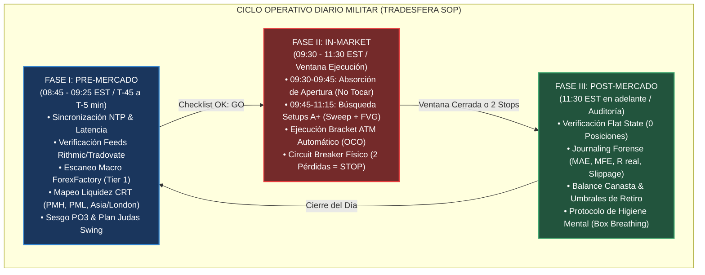
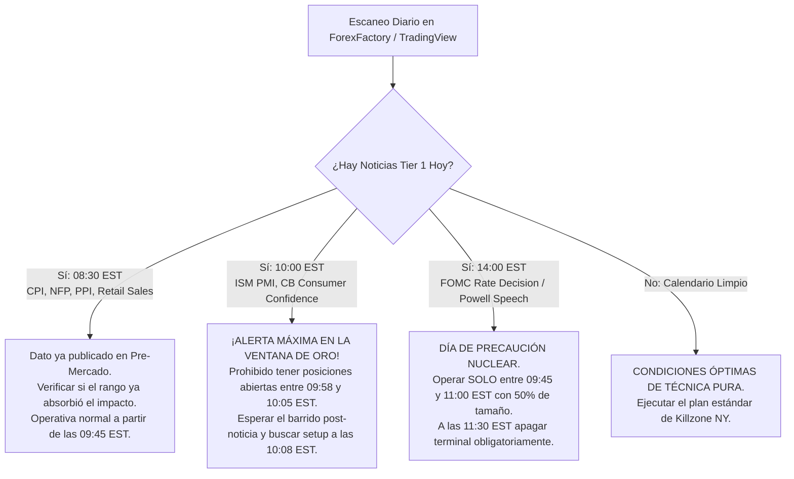
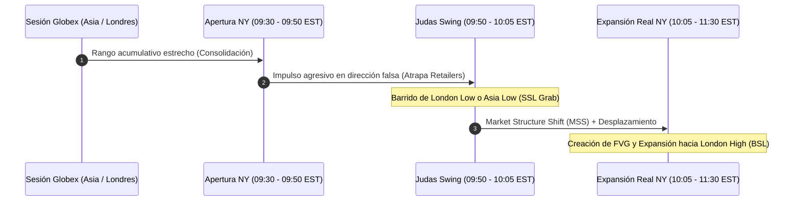
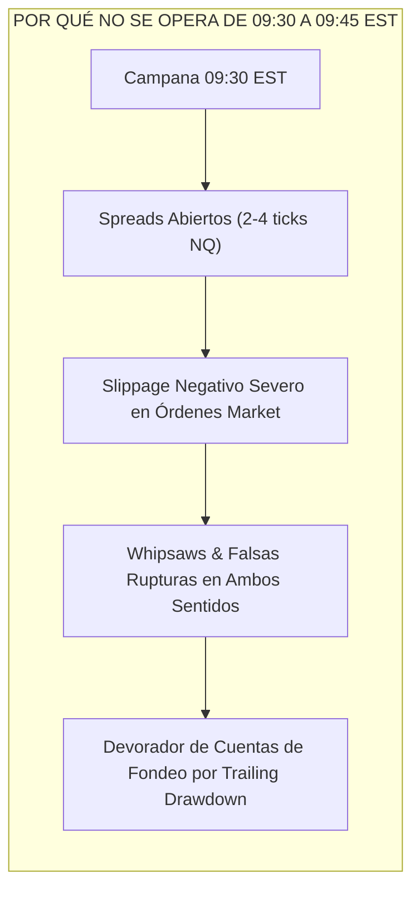
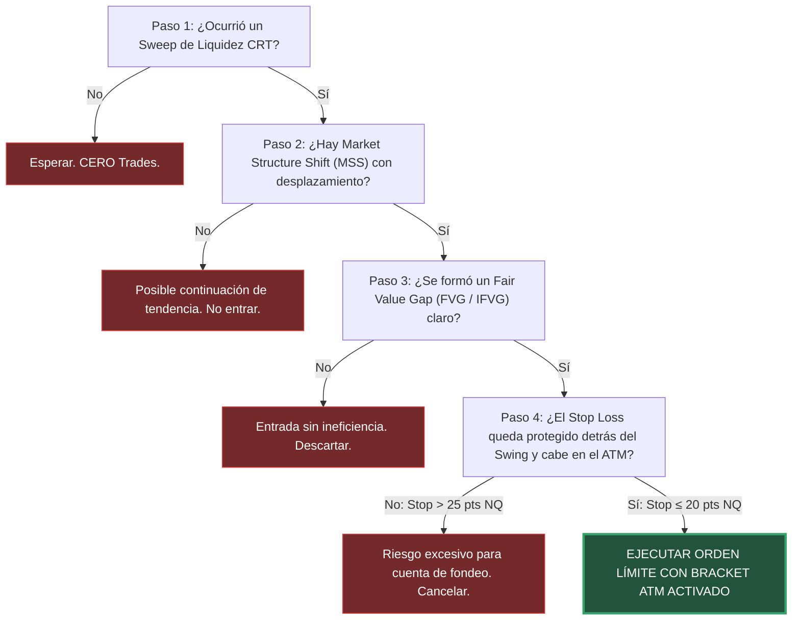
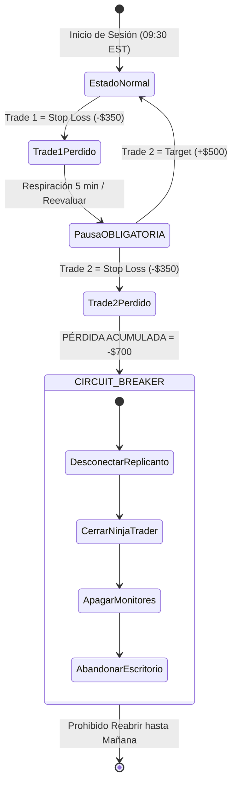
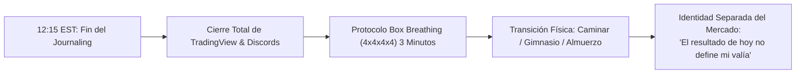

# 📋 16. PLAYBOOK OPERATIVO DIARIO & CHECKLIST DE EJECUCIÓN PASO A PASO (FUTUROS CME)
## Protocolo Quirúrgico de 3 Fases (Pre-Mercado, In-Market, Post-Mercado), Árboles de Decisión Atómica, Blindaje de Cuentas de Fondeo y Checklists Interactivos de 1 Página

> **Manual de Campo y Procedimiento Operativo Estandarizado (SOP)**  
> **Área:** Tradesfera & Ecosistema Ultrarentable V2 | **Fecha:** 27 de Agosto de 2026  
> **Activos CME:** Micro E-mini Nasdaq (`MNQ`), E-mini Nasdaq (`NQ`), Micro E-mini S&P 500 (`MES`), E-mini S&P 500 (`ES`).  
> **Infraestructura:** NinjaTrader 8, Tradovate, Rithmic, Replicanto Trade Copier, TradingView, ForexFactory.  
> **Doctrina:** Zero-Mocks, 100% Datos Físicos Verificados & Ejecución Asimétrica de Alta Probabilidad.

---

## 🎯 0. Navegación y Enlaces Bidireccionales del Ecosistema

- 📌 **Ficha Maestra Central:** [[Ultrarentable]]
- 🔗 **Módulos de Gestión de Capital & Arquitectura:**
  - [[Motor de Fondeo y Prop Firms]] — *Matriz Comparativa Global de Prop Firms de Futuros CME*
  - [[Gestion de Capital — Balas y Estados]] — *Modelo de Balas, Transición de 6 Estados y Cosecha Segregada*
  - [[02_MATEMATICA_BANKROLL_Y_CAPITAL_MUNICION]] — *Formulación KaTeX de Munición, EV y Supervivencia*
  - [[03_TEORIA_VARIANZA_Y_CONTROL_DE_RACHAS]] — *Colas Pesadas CME, Rachas Negativas y Monte Carlo*
  - [[04_PROTOCOLO_INTELIGENTE_APROBACION_CUENTAS]] — *Drawdown Forense (EOD vs Intraday Trailing)*
  - [[05_SISTEMA_MULTICUENTA_Y_COPYTRADING]] — *Cestas de 5-20 Cuentas, Replicanto NT8 y Latencias <5ms*
  - [[06_CICLO_OPTIMO_RETIROS_Y_PAYOUTS]] — *Extracción Sistemática y Colchones de Seguridad (Buffers)*
  - [[09_INFRAESTRUCTURA_TECNICA_NINJATRADER_TOOLS]] — *Setup NinjaTrader 8, Feeds Kinetick/Rithmic y Spec Web*
  - [[10_DOSSIER_MAESTRO_TRADESFERA_FONDEO_FUTUROS]] — *Tratado Integral Unificado Tradesfera V2*
  - [[11_ESTRATEGIAS_Y_HORARIOS_GERARD_GARCIA_FUTUROS]] — *Doctrina Gerard García: Hard Scalping, PO3, CRT, FVG y Brackets ATM*
  - [[12_MAESTRIA_PSICOLOGICA_Y_PROTOCOLOS_EL_PSICOLOGO_DEL_TRADING]] — *Víctor Corrales: Shock del Fondeado, Secuestro Amigdalino y Box Breathing*
  - [[13_SISTEMA_TACTICO_MAXIMA_EXTRACCION_POR_EMPRESA]] — *Sistema Táctico de Máxima Extracción por Empresa & Calendario Semanal*
- 🌐 **Panel Web Vivo:** `http://localhost:3000/prop-firms` | `http://localhost:3000/trading-desk/riesgo`

---

## 🏛️ 1. Filosofía de Operación: El Trader como Piloto Militar de Combate

En el modelo profesional de **Tradesfera**, la operativa con cuentas de evaluación y fondeo de futuros (**CME Group**) no es un ejercicio creativo ni un juego de corazonadas bursátiles: es una **misión de extracción sistemática de liquidez regida por un Procedimiento Operativo Estandarizado (SOP)**.



### Los 3 Postulados Inquebrantables del Operador Disciplinado:
1. **La Preparación Define el Resultado:** Si entras a las 09:29 EST corriendo y abriendo gráficos a ciegas, estás jugando a la ruleta. El 80% del éxito del trade se construye entre las 08:45 y las 09:25 EST.
2. **Cero Decisiones Discrecionales Bajo Fuego:** Los parámetros de riesgo (Stop Loss, Take Profit, tamaño de posición y número máximo de intentos) se definen en frío antes de la apertura. En vivo sólo se ejecuta la señal o se deja pasar.
3. **Protección Absoluta del Capital Munición:** El mercado de futuros siempre estará abierto mañana. Una pérdida de $300 en el plan es un gasto operativo normal; una pérdida de $2,000 por perder el control es una falta profesional gravísima.

---

## ⏰ 2. Fase I: Protocolo Pre-Mercado (T - 45 min a T - 5 min / 08:45 - 09:25 EST)

La sesión comienza formalmente **45 minutos antes de la campana de apertura de Wall Street (Cash Open)**. Durante esta fase se preparan las 4 dimensiones críticas: Hardware/Conectividad, Datos/Software, Contexto Macroeconómico y Arquitectura del Gráfico.

```text
┌────────────────────────────────────────────────────────────────────────────────────────────────────────┐
│                                 CRONOGRAMA DE LA FASE PRE-MERCADO                                      │
├───────────────────┬─────────────────────────────┬──────────────────────────────────────────────────────┤
│ HORARIO (EST)     │ TIEMPO RELATIVO             │ ACCIÓN OBLIGATORIA                                   │
├───────────────────┼─────────────────────────────┼──────────────────────────────────────────────────────┤
│ 08:45 - 08:55 EST │ T - 45 min a T - 35 min     │ Sincronización Horaria NTP, Test Ping y Trade Copier │
│ 08:55 - 09:05 EST │ T - 35 min a T - 25 min     │ Verificación Feeds Rithmic/Tradovate & Hot-Standby   │
│ 09:05 - 09:15 EST │ T - 25 min a T - 15 min     │ Escaneo Macro ForexFactory (Noticias Tier 1 / Tier 2)│
│ 09:15 - 09:25 EST │ T - 15 min a T - 5 min      │ Mapeo CRT (PMH/PML, Asia/London H/L) y PO3 Bias      │
│ 09:25 - 09:30 EST │ T - 5 min a 09:30 EST       │ Entrada en Silencio Operativo & Concentración Zen    │
└───────────────────┴─────────────────────────────┴──────────────────────────────────────────────────────┘
```

---

### 2.1 Sincronización Horaria y Latencia de Red (T - 45 a T - 35 min)

En el trading de alta frecuencia y scalping en el Nasdaq (`NQ`/`MNQ`), una desincronización de reloj de más de $50\text{ ms}$ provoca desalineación en el timestamp de las órdenes límite y divergencia en el cierre de velas de 1 minuto.

#### 1. Sincronización Forzada NTP (Windows PowerShell / Terminal):
Ejecutar el comando de resincronización con el servidor horario oficial del *National Institute of Standards and Technology (NIST)* o el pool de Windows:

```powershell
# Comprobar estado del servicio de tiempo de Windows
w32tm /query /status

# Forzar resincronización inmediata con NTP Stratum 1
w32tm /resync /force
```

$$\text{Tolerancia Máxima de Drift Horario: } \Delta t_{\text{NTP}} \le 20\text{ ms}$$

#### 2. Diagnóstico de Latencia y Jitter hacia Gateways CME (Aurora, IL):
Verificar que la conexión hacia los servidores de enrutamiento de Rithmic o Tradovate en Chicago presente latencias estables y cero pérdida de paquetes (`packet loss = 0%`):

```powershell
# Test de conectividad hacia el gateway de Rithmic Chicago
Test-NetConnection -ComputerName chicagomarket.rithmic.com -Port 443
```

* **Latencia Óptima (VPS Chicago):** $< 3\text{ ms}$.
* **Latencia Óptima (Fibra España / Europa):** $95 - 110\text{ ms}$ (estable, sin jitter $>15\text{ ms}$).
* **Latencia Óptima (Costa Este USA):** $15 - 30\text{ ms}$.

#### 3. Auditoría de Recursos de NinjaTrader 8:
* Uso de memoria RAM de NT8: $< 4.5\text{ GB}$. Si supera los 6 GB, reiniciar NT8 para limpiar el Garbage Collector de .NET.
* Carga de CPU en reposo: $< 12\%$.
* Desactivar procesos en segundo plano de alto consumo (descargas de Steam, copias de seguridad en la nube, torrents, antivirus escaneando discos).

#### 4. Verificación del Trade Copier (Replicanto):
* Comprobar que la **Cuenta Maestra (Leader)** sea exactamente la seleccionada (ej. `Sim101` o Cuenta PA Principal).
* Comprobar que las **Cuentas Esclavas (Followers)** estén en estado `Connected` y con el multiplicador $1:1$ (o escalado micro:mini correspondiente).
* Modo de transmisión: `Local Network` o `Cross-Broker` según la infraestructura.
* Realizar un test de envío de orden en cuenta demo de prueba para certificar replicación simultánea en $< 2\text{ ms}$.

---

### 2.2 Verificación de Infraestructura & Feeds de Datos (T - 35 a T - 25 min)

```text
┌────────────────────────────────────────────────────────────────────────────────────────────────────────┐
│                             MATRIZ DE CONECTIVIDAD DE FEEDS & HARDWARE                                 │
├────────────────────────┬──────────────────────┬────────────────────────────────────────────────────────┤
│ ELEMENTO               │ ESTADO REQUERIDO     │ ACCIÓN DE CONTINGENCIA SI FALLA                        │
├────────────────────────┼──────────────────────┼────────────────────────────────────────────────────────┤
│ Feed Rithmic / Apex    │ Verde (Connected)    │ Reconectar / Alternar servidor (Chicago Area vs Top)   │
│ Feed Tradovate Direct  │ Verde (Connected)    │ Reiniciar API token / Verificar login web              │
│ Feed Kinetick (Unfilt) │ Verde (Connected)    │ Limpiar cache de datos históricos en NT8               │
│ DOM / Level 2 Depth    │ Ticks fluidos        │ Reabrir ventana SuperDOM / Verificar suscripción CME   │
│ Conexión 5G Backup     │ Smartphone listo     │ Hotspot activo con R-Trader Pro / Tradovate App        │
└────────────────────────┴──────────────────────┴────────────────────────────────────────────────────────┘
```

#### Protocolo de Emergencia Hot-Standby (Cierre Forzado por Caída):
Tener siempre abierto en el teléfono móvil o tableta secundaria la aplicación oficial del broker (**R-Trader Pro Mobile** o **Tradovate Mobile**) conectada mediante red móvil 5G (independiente de la fibra óptica de la vivienda). 
* Si se produce un corte de luz o caída del proveedor de internet estando dentro de una posición, el trader dispone de **10 segundos** para pulsar `Flatten All & Cancel Orders` desde el smartphone.

---

### 2.3 Escaneo Macro y Calendario Económico Tier 1 (T - 25 a T - 15 min)

El trader institucional nunca opera a ciegas frente a la publicación de datos del gobierno de los Estados Unidos o de la Reserva Federal.



#### Clasificación de Eventos Macroeconómicos:

| Nivel de Impacto | Eventos Representativos | Ventana de Prohibición Operativa | Comportamiento Esperado |
|---|---|:---:|---|
| **Tier 1 Nuclear (Carpeta Roja Extrema)** | **CPI** (Inflación), **NFP** (Empleo No Agrícola), **FOMC** (Tipos Fed / Powell), **GDP** Advance. | **$\pm 15\text{ min}$** del evento | Velas de 80-150 puntos en NQ en 5 segundos, slippage severo, spreads abiertos de 8-16 ticks. |
| **Tier 1 Medio (Carpeta Roja)** | **ISM Manufacturing / Services PMI**, **JOLTS** Job Openings, **Consumer Sentiment** (Michigan), **PPI**. | **$\pm 5\text{ min}$** del evento | Spikes direccionales rápidos de 30-60 puntos, barrido de liquidez de stops previos. |
| **Tier 2 (Carpeta Naranja)** | **Jobless Claims** semanales, **Existing Home Sales**, **Durable Goods Orders**. | **$\pm 2\text{ min}$** del evento | Aumento transitorio de volatilidad y micro-ineficiencias. |

> [!WARNING]
> **Normativas de Prop Firms sobre Noticias de Alto Impacto:**
> Empresas como **Tradeify**, **Apex** y **Earn2Trade** aplican restricciones estrictas sobre la ejecución durante noticias de carpeta roja. Operar en una ventana prohibida puede conllevar la anulación de beneficios del trade o la denegación directa del payout.

---

### 2.4 Mapeo de Liquidez CRT & Niveles Clave Institucionales (T - 15 a T - 5 min)

El mapa del gráfico no se llena de decenas de indicadores rezagados (RSI, MACD, Medias Móviles saturadas). Se marcan con precisión quirúrgica los **niveles de liquidez magnética y piscinas de órdenes (Order Pools)**:

```text
┌────────────────────────────────────────────────────────────────────────────────────────────────────────┐
│                              MATRIZ DE NIVELES CLAVE DE LIQUIDEZ CRT & ICT                             │
├────────────────────────┬──────────────────────┬────────────────────────────────────────────────────────┤
│ NIVEL INSTITUCIONAL    │ ABREVIATURA          │ SIGNIFICADO MICROESTRUCTURAL                           │
├────────────────────────┼──────────────────────┼────────────────────────────────────────────────────────┤
│ Previous Day High      │ PDH / PMH            │ Buy-Side Liquidity (BSL) mayor. Paradas de compradores.│
│ Previous Day Low       │ PDL / PML            │ Sell-Side Liquidity (SSL) mayor. Paradas de vendedores.│
│ Asia Session High      │ Asia High            │ Máximo sesión Tokio (18:00 - 02:00 EST). BSL asiática. │
│ Asia Session Low       │ Asia Low             │ Mínimo sesión Tokio. SSL asiática.                     │
│ London Session High    │ London High          │ Máximo sesión Londres (02:00 - 08:00 EST). BSL Europa. │
│ London Session Low     │ London Low           │ Mínimo sesión Londres. SSL Europa.                     │
│ Overnight High / Low   │ ONH / ONL            │ Extremos absolutos de la sesión Globex (18:00 - 09:30).│
│ New Day Opening Gap    │ NDOG                 │ Gap entre el cierre de ayer (17:00) y apertura (18:00).│
│ New Week Opening Gap   │ NWOG                 │ Gap de apertura dominical. Imán de alta probabilidad.  │
│ Equal Highs / Lows     │ EQH / EQL            │ Liquidez de doble techo/suelo virgen (Engine Fuel).    │
└────────────────────────┴──────────────────────┴────────────────────────────────────────────────────────┘
```

```mermaid
graph TD
    subgraph "ANATOMÍA DEL MAPEO CRT (CANDLE RANGE THEORY)"
        D1["Vela Diaria / 4H Anterior"] --> C1["Identificar High & Low del Rango Anterior"]
        C1 --> C2{"¿Dónde cotiza el precio respecto al rango?"}
        C2 -->|Por encima del High (Premium Extremo)| P1["Búsqueda de Barrido de BSL $\longrightarrow$ Distribución Corta"]
        C2 -->|Por debajo del Low (Discount Extremo)| P2["Búsqueda de Barrido de SSL $\longrightarrow$ Acumulación Larga"]
        C2 -->|Dentro del Rango (Equilibrium)| P3["Esperar Expansión hacia uno de los extremos"]
    end
```

---

### 2.5 Determinación del Sesgo PO3 & Plan Judas Swing (T - 5 min a 09:30 EST)

El algoritmo interbancario de entrega de precio (**IPDA**) estructura la sesión regular de Nueva York mediante el modelo **Power of Three (PO3)**:

$$\boxed{\text{PO3 (AMD)} = \text{Acumulación (Asia/Globex)} \longrightarrow \text{Manipulación (Judas Swing 09:30-10:00)} \longrightarrow \text{Expansión (10:00-11:30)}}$$



#### Criterio de Selección del Plan del Día:
* **Escenario A (Bullish Day Expected):** 
  * *Premisa:* Manipulación bajista inicial barriendo el mínimo de Londres (`London Low`) o el mínimo de Asia (`Asia Low`).
  * *Disparador:* Rechazo violento, cambio de estructura de mercado (`MSS`) en gráfico de 1m/2m y creación de un Fair Value Gap (`FVG`) alcista.
  * *Objetivo:* Expansión alcista hacia `PDH` o `London High`.
* **Escenario B (Bearish Day Expected):** 
  * *Premisa:* Manipulación alcista inicial barriendo el máximo de Londres (`London High`) o el máximo de Asia (`Asia High`).
  * *Disparador:* Rechazo violento, `MSS` bajista y creación de `FVG` bajista.
  * *Objetivo:* Expansión bajista hacia `PDL` o `London Low`.

---

## ⚔️ 3. Fase II: Protocolo In-Market (09:30 EST a 11:30 EST)

Esta es la **Ventana de Ejecución Militar**. Durante exactamente 120 minutos, el trader pasa de la fase de análisis a la ejecución mecánica más estricta.

```text
┌────────────────────────────────────────────────────────────────────────────────────────────────────────┐
│                                CRONOGRAMA DE LA FASE IN-MARKET                                         │
├───────────────────┬──────────────────────────────────┬─────────────────────────────────────────────────┤
│ HORARIO (EST)     │ FASE OPERATIVA                   │ DIRECTRIZ DE EJECUCIÓN                          │
├───────────────────┼─────────────────────────────-────┼─────────────────────────────────────────────────┤
│ 09:30 - 09:45 EST │ Absorción de Apertura (Opening)  │ PROHIBIDO OPERAR. Manos fuera del ratón.        │
│ 09:45 - 10:00 EST │ Formación del Judas Swing        │ Monitoreo de barridos de liquidez CRT.          │
│ 10:00 - 11:00 EST │ Ventana de Oro / Silver Bullet   │ EJECUCIÓN QUIRÚRGICA DE SETUPS A+ (Bracket ATM) │
│ 11:00 - 11:30 EST │ Extensión Final / Trailing Exit  │ Gestión de corredores y cierre de posiciones.   │
│ 11:30 EST         │ Hard Stop Temporal (Chop Zone)   │ CIERRE OBLIGATORIO DE PLATAFORMA. FIN DE SESIÓN.│
└───────────────────┴──────────────────────────────────┴─────────────────────────────────────────────────┘
```

---

### 3.1 La Regla de los Primeros 15 Minutos (09:30 - 09:45 EST: Absorción)

A las 09:30:00 EST suena la campana de Wall Street. Entran millones de órdenes de balanceo de fondos institucionales, órdenes de apertura de mercado (`MOO`), algoritmos de alta frecuencia (`HFT`) cruzando carteras y swaps de acciones individuales del S&P 500 y Nasdaq 100.



#### Protocolo de los Primeros 15 Minutos:
1. **Posición Corporal:** Apoyar la espalda en el respaldo, retirar las manos del ratón y el teclado.
2. **Observación Pasiva:** Observar cómo se construye el rango inicial de 15 minutos (`OR15`).
3. **Preguntas Clave de Diagnóstico:**
   * ¿El precio está buscando inmediatamente los máximos de Londres o los mínimos?
   * ¿Hay volumen institucional genuino o es un movimiento errático sin desplazamiento?
   * ¿Qué nivel de liquidez previo está siendo atacado?

---

### 3.2 Identificación y Validación del Setup A+ (09:45 - 11:00 EST)

Un trade sólo es ejecutable si cumple estrictamente con el **Algoritmo de 4 Pasos de Gerard García**:

```text
┌────────────────────────────────────────────────────────────────────────────────────────────────────────┐
│                             EL ALGORITMO DE EJECUCIÓN A+ EN 4 PASOS                                    │
├──────┬───────────────────────────────┬─────────────────────────────────────────────────────────────────┤
│ PASO │ COMPONENTE                    │ CRITERIO DE VALIDACIÓN TÉCNICA                                  │
├──────┼───────────────────────────────┼─────────────────────────────────────────────────────────────────┤
│ 1    │ Barrido de Liquidez (Sweep)   │ El precio perfora un nivel CRT clave (Asia H/L, London H/L,     │
│      │                               │ PDH/PDL o EQH/EQL) y rechaza dejando mecha evidente en 1m/2m.   │
├──────┼───────────────────────────────┼─────────────────────────────────────────────────────────────────┤
│ 2    │ Quiebre Estructural (MSS)     │ Ruptura con cuerpo de vela del último swing high/low opuesto    │
│      │                               │ con vela de desplazamiento institucional (displacement candle).  │
├──────┼───────────────────────────────┼─────────────────────────────────────────────────────────────────┤
│ 3    │ Ineficiencia Fair Value Gap   │ Generación de un FVG (espacio no mitigado de 3 velas) en 1m/2m. │
│      │                               │ La entrada se posiciona en el límite del FVG o en su 50% (CE).  │
├──────┼───────────────────────────────┼─────────────────────────────────────────────────────────────────┤
│ 4    │ Confluencia de Order Flow     │ Delta de volumen divergiendo (absorción de vendedores en suelo   │
│      │                               │ o compradores en techo) o ratio R:R mínimo de 1:1.5 al target.  │
└──────┴───────────────────────────────┴─────────────────────────────────────────────────────────────────┘
```



---

### 3.3 Protocolo de Ejecución Atómica & Brackets ATM

Queda terminantemente prohibido pulsar botones de compra/venta a mercado sin órdenes de protección automáticas acopladas en el servidor del broker (**Server-Side OCO Brackets**).

#### Plantillas ATM Estandarizadas por Instrumento:

| Activo | Instrumento | Contratos Recomendados | Stop Loss Fijo | Take Profit 1 (80%) | Runner (20%) | Auto-Breakeven Trigger |
|---|---|:---:|:---:|:---:|:---:|:---:|
| **Micro Nasdaq** | `MNQ` | 2 a 5 micros | $18\text{ pts } (\$36/\text{ctr})$ | $25\text{ pts } (\$50/\text{ctr})$ | $45\text{ pts } (\$90/\text{ctr})$ | Al alcanzar $+18\text{ pts}$ |
| **Mini Nasdaq** | `NQ` | 1 mini | $18\text{ pts } (\$360)$ | $25\text{ pts } (\$500)$ | $45\text{ pts } (\$900)$ | Al alcanzar $+18\text{ pts}$ |
| **Micro S&P 500** | `MES` | 3 a 6 micros | $5\text{ pts } (\$25/\text{ctr})$ | $8\text{ pts } (\$40/\text{ctr})$ | $15\text{ pts } (\$75/\text{ctr})$ | Al alcanzar $+5\text{ pts}$ |
| **Mini S&P 500** | `ES` | 1 mini | $5\text{ pts } (\$250)$ | $8\text{ pts } (\$400)$ | $15\text{ pts } (\$750)$ | Al alcanzar $+5\text{ pts}$ |

```text
┌────────────────────────────────────────────────────────────────────────────────────────────────────────┐
│                                 REGLAS DE ORO DE LA GESTIÓN EN VIVO                                    │
├────────────────────────────────────────────────────────────────────────────────────────────────────────┤
│ 1. NUNCA MOVER EL STOP LOSS HACIA ATRÁS: El stop inicial es sagrado. Si el mercado te saca, se acepta.│
│ 2. AUTO-BREAKEVEN: Al tocar el Target 1, el Stop Loss del resto de contratos se mueve automáticamente  │
│    a Precio de Entrada + 1 tick (protegiendo comisiones).                                             │
│ 3. PROHIBIDO AGREGAR CONTRATOS A POSICIONES PERDEDORAS (MARTINGALA): La peor aberración en fondeo.    │
│ 4. UN TRADE A LA VEZ: No abrir trades simultáneos en NQ y ES (correlación > 0.90 duplica el riesgo).  │
└────────────────────────────────────────────────────────────────────────────────────────────────────────┘
```

---

### 3.4 El Disparador del Circuit Breaker Físico (2 Pérdidas = Apagado de Pantalla)

El mayor destructor de cuentas financiadas no es la falta de análisis, sino el **Revenge Trading** derivado del secuestro amigdalino.

$$\boxed{\text{Si Trades Consecutivos Perdidos en el Día} = 2 \implies \textbf{CIRCUIT BREAKER INMEDIATO}}$$



#### Fundamento Cuantitativo del Circuit Breaker:
1. **Preservación del Colchón de Drawdown:** En una cuenta de $50K con drawdown diario de $\$1,000$, dos pérdidas de $\$350$ suman $\$700$. La cuenta queda intacta con un margen de $\$300$ de seguridad para el día siguiente. Un 3er trade impulsivo provocaría la quiebra de la cuenta ($-\$1,050$).
2. **Degradación Psicológica:** Tras dos pérdidas consecutivas, el cerebro entra en estado de amenaza biológica. La probabilidad estadística de tomar una decisión errónea en el 3er intento supera el **$78\%$**.

---

## 📊 4. Fase III: Protocolo Post-Mercado (11:30 EST en adelante / 17:30 CET)

La jornada operativa concluye a las 11:30 EST. En ese momento cesa la actividad en los mercados y comienza la **auditoría forense y reconciliación contable**.

```text
┌────────────────────────────────────────────────────────────────────────────────────────────────────────┐
│                                CRONOGRAMA DE LA FASE POST-MERCADO                                      │
├───────────────────┬──────────────────────────────────┬─────────────────────────────────────────────────┤
│ HORARIO (EST)     │ FASE DE AUDITORÍA                │ ACCIÓN OBLIGATORIA                              │
├───────────────────┼──────────────────────────────────┼─────────────────────────────────────────────────┤
│ 11:30 - 11:35 EST │ Cierre Terminal & Flat State     │ Verificar 0 posiciones y 0 órdenes pendientes   │
│ 11:35 - 12:00 EST │ Journaling Cuantitativo Forense  │ Registro de MAE, MFE, R real, slippage y sesgos │
│ 12:00 - 12:15 EST │ Conciliación Canasta Multicuenta │ Actualización de balances, buffers y payouts    │
│ 12:15 EST $\to$   │ Protocolo de Higiene Mental      │ Box Breathing, desconexión y deporte/vida real  │
└───────────────────┴──────────────────────────────────┴─────────────────────────────────────────────────┘
```

---

### 4.1 Cierre de Terminal y Verificación de Flat State (11:30 - 11:35 EST)

1. En la pestaña `Accounts` de NinjaTrader 8 y Tradovate, verificar que la columna **Position** marque exactamente `0` en todas las cuentas de la cesta.
2. En la pestaña `Orders`, verificar que la lista de órdenes activas (`Working Orders`) esté completamente vacía (`0 working`).
3. Desactivar el interruptor principal del Trade Copier (**Replicanto: OFF**).
4. Tomar captura de pantalla en alta resolución del gráfico de 1 minuto con las ejecuciones marcadas para el registro visual.

---

### 4.2 Registro Forense del Trade Log (Journaling Cuantitativo) (11:35 - 12:00 EST)

Cada operación debe quedar registrada en la base de datos de rendimiento con los parámetros forenses estándar de la industria cuantitativa:

#### Tabla Modelo de Registro Diario (Trade Log):

| Campo | Definición Técnica | Ejemplo Real |
|---|---|---|
| **ID Trade / Fecha** | Identificador único y timestamp exacto | `TRD-20260827-01` \| 10:14:22 EST |
| **Instrumento / Cesta** | Ticker operado y número de cuentas replicadas | `MNQ` (4 contratos) \| Cesta 10 Cuentas PA |
| **Setup Técnico** | Patrón institucional clasificado | `10:00 AM Judas Sweep (London Low) + FVG 1m` |
| **Dirección** | Long (Compra) o Short (Venta) | `LONG` |
| **Precio Entrada / SL / TP** | Precios exactos de ejecución | Entry: `19,840.50` \| SL: `19,822.50` \| TP: `19,870.50` |
| **MAE (Max Adverse Excursion)** | Máxima caída en contra sufrida durante el trade | **$3.25\text{ pts}$** (Excelente timing de entrada) |
| **MFE (Max Favorable Excursion)** | Máximo recorrido a favor alcanzado por el precio | **$38.50\text{ pts}$** |
| **R Planificado vs R Capturado** | Ratio riesgo/beneficio teórico vs real | $R_{\text{plan}} = 1:1.66$ $\longrightarrow$ $R_{\text{real}} = 1:1.66$ |
| **Slippage** | Deslizamiento de ticks en la orden | $0\text{ ticks}$ (Entrada límite perfecta) |
| **P&L Neto por Cuenta** | Resultado monetario tras comisiones | **$+\$234.80\text{ USD}$** por cuenta |
| **P&L Total Canasta (10 PAs)** | Resultado neto agregado del sistema | **$+\$2,348.00\text{ USD}$** |
| **Disciplina (1 a 5)** | Grado de cumplimiento estricto del plan | **5 / 5** (Ejecución 100% mecánica) |
| **Estado Emocional** | Registro psicobiológico de Víctor Corrales | *Calma absoluta, cero FOMO, respiración regular* |

$$\boxed{\text{Eficiencia de Entrada} = 1 - \frac{\text{MAE}}{\text{Distancia Stop Loss}} = 1 - \frac{3.25}{18.00} = 81.94\%}$$

---

### 4.3 Actualización de la Canasta Multicuenta & Umbrales de Payout (12:00 - 12:15 EST)

Reconciliar los balances en la hoja de cálculo de gestión de cuentas y verificar la proximidad a los **hitos de extracción de capital**:

```text
┌────────────────────────────────────────────────────────────────────────────────────────────────────────┐
│                          TABLA DE CONTROL DE BUFFERS & COBROS (CESTA 5 CUENTAS 50K)                    │
├─────────┬──────────────┬──────────────┬────────────────┬───────────────────┬───────────────────────────┤
│ CUENTA  │ BALANCE HOY  │ SAFETY BUFFER│ DISTANCIA RETIRO│ DÍAS GANADORES ≥$150│ ESTADO DE PAYOUT          │
├─────────┼──────────────┼──────────────┼────────────────┼───────────────────┼───────────────────────────┤
│ PA-01   │ $52,840.00   │ +$2,840.00   │ META ALCANZADA │ 5 / 5 días        │ ✅ ELEGIBLE RETIRO ($1,500)│
│ PA-02   │ $52,840.00   │ +$2,840.00   │ META ALCANZADA │ 5 / 5 días        │ ✅ ELEGIBLE RETIRO ($1,500)│
│ PA-03   │ $52,120.00   │ +$2,120.00   │ Falta $480.00  │ 4 / 5 días        │ ⏳ Buffer en Construcción  │
│ PA-04   │ $52,120.00   │ +$2,120.00   │ Falta $480.00  │ 4 / 5 días        │ ⏳ Buffer en Construcción  │
│ PA-05   │ $51,650.00   │ +$1,650.00   │ Falta $950.00  │ 3 / 5 días        │ ⏳ Fase de Crecimiento    │
└─────────┴──────────────┴──────────────┴────────────────┴───────────────────┴───────────────────────────┘
```

* Si una cuenta alcanza los requisitos de retiro de la firma (ej. Topstep 5 días ganadores $+ \$150$ y balance $> \$52,600$), **solicitar el payout inmediatamente**.
* Aplicar la **Regla 50/30/20 de Tradesfera**:
  * $50\%$ a Cuenta Bancaria Personal (Cosecha Intocable).
  * $30\%$ a Pool de Munición / Recompra de Evaluaciones con Descuento.
  * $20\%$ a Provisión Fiscal para Impuestos.

---

### 4.4 Protocolo Clínico de Desconexión Mental & Higiene Psicológica (12:15 EST en adelante)

La sesión ha terminado. Quedarse mirando el gráfico durante la sesión de la tarde (*PM Session*) genera **fatiga cognitiva, sesgo retrospectivo ("mira todo lo que me perdí") y tentación de overtrading**.



#### Ejercicio de Reseteo Fisiológico (Box Breathing):
1. **Inhalar** profundamente por la nariz durante **4 segundos**.
2. **Mantener** el aire en los pulmones durante **4 segundos**.
3. **Exhalar** lentamente por la boca durante **4 segundos**.
4. **Mantener** el vacío pulmonar durante **4 segundos**.
5. Repetir el ciclo **4 veces** para desactivar el sistema simpático y reactivar el nervio vago.

---

## 📑 5. Checklists Operativos Interactivos de 1 Página (Ready-to-Print / Digital)

---

### 📄 CHECKLIST 1: FASE PRE-MERCADO (08:45 - 09:25 EST)

```text
====================================================================================================
                        TRADESFERA — CHECKLIST DIARIO PRE-MERCADO
Fecha: ____ / ____ / 2026    |  Día: [L] [M] [X] [J] [V]  |  Operador: ___________________________
====================================================================================================

[ ] 1. INFRAESTRUCTURA TÉCNICA & HARDWARE (08:45 - 08:55 EST)
    [ ] Sincronización horaria NTP forzada (w32tm /resync) -> Drift < 20ms verificado.
    [ ] Latencia de red probada (< 30ms USA / < 110ms Europa, 0% packet loss).
    [ ] NinjaTrader 8 reiniciado y verificado (RAM < 4.5 GB, CPU < 12%).
    [ ] Replicanto Trade Copier verificado (Cuenta Leader correcta, Followers conectadas 1:1).
    [ ] Hot-Standby de emergencia activo (R-Trader / Tradovate abierto en móvil 5G).

[ ] 2. FEEDS DE DATOS & BROKER (08:55 - 09:05 EST)
    [ ] Conexión Rithmic / Tradovate en estado VERDE en NT8.
    [ ] Conexión Kinetick (datos sin filtrar) en estado VERDE.
    [ ] SuperDOM y Gráficos recibiendo Level 2 Depth con fluidez y spread normal (1 tick).

[ ] 3. CALENDARIO MACROECONÓMICO TIER 1 (09:05 - 09:15 EST)
    [ ] Escaneo en ForexFactory / TradingView completado.
    [ ] ¿Hay noticias a las 08:30 EST? [SÍ] [NO] -> Impacto previo absorbido: [ ]
    [ ] ¿Hay noticias a las 10:00 EST (ISM / PMI / JOLTS)? [SÍ] [NO] -> Alarma puesta a las 09:55: [ ]
    [ ] ¿Hay FOMC / Powell a las 14:00 EST? [SÍ] [NO] -> Apagado obligatorio a las 11:30: [ ]

[ ] 4. MAPEO CRT & ESTRUCTURA DE LIQUIDEZ (09:15 - 09:25 EST)
    [ ] Marcado Previous Day High (PDH / PMH) y Previous Day Low (PDL / PML).
    [ ] Marcado Asia Session High & Low (18:00 - 02:00 EST).
    [ ] Marcado London Session High & Low (02:00 - 08:00 EST).
    [ ] Marcado Opening Gaps (NDOG / NWOG) y niveles de Equal Highs / Lows vírgenes.
    [ ] Determinación de Rango CRT en 1H/4H: [Premium / Distribución] [Discount / Acumulación]

[ ] 5. SESGO PO3 & PLAN DE ENTRADA (09:25 - 09:30 EST)
    [ ] Dirección esperada del Judas Swing (09:30 - 10:00 EST): [Barrido Bajista] [Barrido Alcista]
    [ ] Nivel clave de entrada planificado: __________________________________________________
    [ ] Tamaño de posición asignado: ______ Microcontratos / ______ Minis
    [ ] Estado mental: [ ] Calma  [ ] Concentración  [ ] Desapego del P&L monetario

ESTADO FINAL PRE-MERCADO:  [ ] GO (Operativa Autorizada)    [ ] NO-GO (Condiciones No Óptimas)
====================================================================================================
```

---

### 📄 CHECKLIST 2: FASE IN-MARKET (09:30 - 11:30 EST)

```text
====================================================================================================
                        TRADESFERA — CHECKLIST DIARIO IN-MARKET
====================================================================================================

[ ] 1. PROTOCOLO DE APERTURA (09:30 - 09:45 EST)
    [ ] Manos fuera del teclado durante los primeros 15 minutos (09:30 - 09:45 EST).
    [ ] Observación de la formación del Opening Range (OR15).
    [ ] CERO órdenes abiertas durante el pico inicial de volatilidad y ensanchamiento de spread.

[ ] 2. FILTRADO DEL SETUP A+ (09:45 - 11:00 EST)
    [ ] ¿Ocurrió un Sweep claro de liquidez CRT (Asia H/L, London H/L, PDH/PDL)? [SÍ] [NO]
    [ ] ¿Hubo Market Structure Shift (MSS) con vela de desplazamiento en 1m/2m? [SÍ] [NO]
    [ ] ¿Se generó un Fair Value Gap (FVG) o IFVG limpio y bien definido? [SÍ] [NO]
    [ ] ¿La orden límite está colocada en el límite del FVG o en su 50% (CE)? [SÍ] [NO]
    [ ] ¿El Stop Loss queda protegido estructuralmente detrás del swing de manipulación? [SÍ] [NO]
    [ ] ¿El Stop Loss es <= 20 pts en NQ (<= 5 pts en ES)? [SÍ] [NO]

[ ] 3. EJECUCIÓN DEL TRADE & BRACKET ATM
    [ ] Plantilla ATM activada (Server-Side OCO acoplado automáticamente).
    [ ] Orden lanzada como LÍMITE (evitando compras a mercado desprotegidas).
    [ ] Una vez dentro: PROHIBIDO tocar el Stop Loss hacia atrás.
    [ ] Take Profit 1 fijado a 20-25 pts en NQ.
    [ ] Auto-Breakeven configurado tras alcanzar TP1.

[ ] 4. GESTIÓN DEL CIRCUIT BREAKER
    [ ] Trade 1 Resultado: [WIN: +$______]  [LOSS: -$______]
    [ ] Si Trade 1 = LOSS -> Pausa obligatoria de 5 minutos y respiración profunda.
    [ ] Trade 2 Resultado: [WIN: +$______]  [LOSS: -$______]
    [ ] SI SE ACUMULAN 2 PÉRDIDAS CONSECUTIVAS:
        [ ] CIRCUIT BREAKER ACTIVADO INMEDIATAMENTE.
        [ ] Desconectar Replicanto.
        [ ] Cerrar NinjaTrader 8.
        [ ] Apagar monitores y abandonar la sala de trading hasta mañana.

[ ] 5. CIERRE DE LA VENTANA (11:30 EST)
    [ ] Sonó la campana de las 11:30 EST.
    [ ] Todas las posiciones abiertas cerradas (Flat).
    [ ] Cero órdenes trabajando en el libro.
====================================================================================================
```

---

### 📄 CHECKLIST 3: FASE POST-MERCADO & AUDITORÍA (11:30 EST EN ADELANTE)

```text
====================================================================================================
                    TRADESFERA — CHECKLIST POST-MERCADO & AUDITORÍA
====================================================================================================

[ ] 1. CIERRE TÉCNICO & SEGURIDAD (11:30 - 11:35 EST)
    [ ] Verificado en NinjaTrader / Tradovate: Positions = 0.
    [ ] Verificado en NinjaTrader / Tradovate: Working Orders = 0.
    [ ] Replicanto desactivado (OFF).
    [ ] Capturas de pantalla de los gráficos guardadas en la carpeta del diario.

[ ] 2. JOURNALING FORENSE CUANTITATIVO (11:35 - 12:00 EST)
    [ ] ID y Horarios de entrada/salida registrados.
    [ ] MAE (Maximum Adverse Excursion) anotado en puntos.
    [ ] MFE (Maximum Favorable Excursion) anotado en puntos.
    [ ] R real capturado vs R planificado calculado.
    [ ] Slippage registrado (ticks de desviación).
    [ ] Calificación de Disciplina Operativa (1 al 5): [ 1 ] [ 2 ] [ 3 ] [ 4 ] [ 5 ]
    [ ] Registro del estado psicobiológico y anotaciones conductuales.

[ ] 3. CONCILIACIÓN DE CANASTA & SOLICITUD DE PAYOUTS (12:00 - 12:15 EST)
    [ ] Balances de todas las cuentas de la cesta actualizados en el Excel/Web Tracker.
    [ ] Safety Buffers recalculados (Margen disponible sobre el balance inicial).
    [ ] Días ganadores cualificados (> $150) contabilizados.
    [ ] ¿Hay cuentas elegibles para Payout hoy? [SÍ] [NO]
        [ ] Si SÍ -> Solicitud de retiro tramitada en el portal de la Prop Firm.
        [ ] Aplicar división 50% Banco / 30% Munición / 20% Impuestos.

[ ] 4. HIGIENE MENTAL & DESCONEXIÓN TOTAL (12:15 EST en adelante)
    [ ] Sesión de Box Breathing (4x4x4x4) completada (3 minutos).
    [ ] TradingView cerrado en PC y móvil. Notificaciones de trading silenciadas.
    [ ] Prohibido mirar cotizaciones por la tarde.
    [ ] Transición completada a actividades personales, deportivas o familiares.

FIRMA DEL OPERADOR: ___________________________    FECHA: ____ / ____ / 2026
====================================================================================================
```

---

## 🔄 6. Diagramas Mermaid de Flujo de Decisión Operativa

### Árbol de Decisión Completo de Ejecución de un Trade (In-Market):

```mermaid
flowchart TD
    Start(["09:30 EST: Inicio Sesión NY"]) --> Wait15["09:30 - 09:45 EST:<br/>Fase de Absorción (Manos Fuera)"]
    Wait15 --> Scan["09:45 - 11:00 EST:<br/>Escaneo de Barridos CRT"]
    
    Scan --> CheckSweep{"¿Hubo Sweep de BSL/SSL<br/>en nivel clave CRT?"}
    CheckSweep -- No --> Scan
    CheckSweep -- Sí --> CheckMSS{"¿Se produce MSS con<br/>desplazamiento en 1m/2m?"}
    
    CheckMSS -- No --> Scan
    CheckMSS -- Sí --> CheckFVG{"¿Aparece FVG / IFVG<br/>con R:R ≥ 1:1.5?"}
    
    CheckFVG -- No --> Scan
    CheckFVG -- Sí --> CheckNews{"¿Hay Noticia Tier 1<br/>en los próximos 5 min?"}
    
    CheckNews -- Sí --> WaitNews["Esperar publicación y absorción post-noticia"]
    WaitNews --> Scan
    CheckNews -- No --> PlaceLimit["Colocar Orden LÍMITE en FVG<br/>con Bracket ATM Server-Side"]
    
    PlaceLimit --> InPosition{"¿Orden Rellenada (In Position)?"}
    InPosition -- No --> CancelCheck{"¿El precio tocó el TP sin rellenar?"}
    CancelCheck -- Sí --> CancelOrder["Cancelar Orden Límite (Missed Trade)"]
    CancelOrder --> Scan
    CancelCheck -- No --> InPosition
    
    InPosition -- Sí --> ManageTrade{"Evolución del Trade"}
    ManageTrade -->|Toca Stop Loss| HitSL["Stop Loss Ejecutado (-$350)"]
    ManageTrade -->|Toca TP1 (+20 pts)| HitTP1["TP1 Ejecutado (80% Cerrado)<br/>Mover SL a Breakeven + 1 tick"]
    
    HitTP1 --> Runner{"Gestión del Runner (20%)"}
    Runner -->|Toca TP2 (+40 pts)| FullWin["Cierre Completo en Target (+$$$)"]
    Runner -->|Regresa a BE| BEWin["Cierre Runner en Breakeven"]
    
    HitSL --> CountLoss{"¿Pérdidas Hoy?"}
    CountLoss -- "1 Pérdida" --> Pause5["Pausa Obligatoria 5 min + Box Breathing"]
    Pause5 --> Scan
    CountLoss -- "2 Pérdidas" --> CircuitBreaker["🚨 CIRCUIT BREAKER ACTIVADO 🚨<br/>Apagar Plataforma. Fin del Día."]
    
    FullWin --> FinishDay["Trade Ganador Logrado.<br/>Evaluar si se alcanzó el Target Diario.<br/>Si P&L ≥ +$500 $\longrightarrow$ Cerrar Sesión."]
    BEWin --> FinishDay

    style CircuitBreaker fill:#742a2a,stroke:#e53e3e,stroke-width:3px,color:#fff
    style FullWin fill:#22543d,stroke:#38a169,stroke-width:3px,color:#fff
    style PlaceLimit fill:#1a365d,stroke:#3182ce,stroke-width:2px,color:#fff
```

---

## 🛡️ 7. Síntesis y Enlaces de Continuidad

El presente **Playbook Operativo Diario y Checklist de Ejecución** constituye el eslabón de campo que conecta la teoría macroeconómica, el modelado cuantitativo de varianza y la gestión psicológica de Tradesfera con la realidad física de los mercados de futuros de Chicago.

```text
┌──────────────────────────────────────────────────────────────────────────────────────────────────┐
│                                 LA CADENA DE VALOR TRADESFERA                                    │
├──────────────────────────────────────────────────────────────────────────────────────────────────┤
│ 1. Capital Munición & Descuentos       -> [[01_ECOSISTEMA_TRADESFERA_Y_MODELO_DE_NEGOCIO]]        │
│ 2. Esperanza Matemática & Varianza     -> [[02_MATEMATICA_BANKROLL_Y_CAPITAL_MUNICION]]          │
│ 3. Infraestructura & Copiador          -> [[05_SISTEMA_MULTICUENTA_Y_COPYTRADING]]               │
│ 4. Estrategia & Killzones              -> [[11_ESTRATEGIAS_Y_HORARIOS_GERARD_GARCIA_FUTUROS]]    │
│ 5. Control Emocional & Reseteo         -> [[12_MAESTRIA_PSICOLOGICA_Y_PROTOCOLOS_EL_PSICOLOGO]] │
│ 6. Extracción Sistemática & Payouts    -> [[13_SISTEMA_TACTICO_MAXIMA_EXTRACCION_POR_EMPRESA]]   │
│ 7. EJECUCIÓN MILITAR DIARIA            -> [[16_PLAYBOOK_OPERATIVO_DIARIO_Y_CHECKLIST_EJECUCION]] │
└──────────────────────────────────────────────────────────────────────────────────────────────────┘
```

> [!TIP]
> **Recomendación de Uso Práctico:**
> Imprima los **Checklists de la Sección 5** o manténgalos fijados en una pantalla secundaria en formato digital. Cada casilla debe ser marcada de forma consciente y deliberada antes de autorizar la apertura de una posición. La disciplina no es un estado de ánimo; es la repetición implacable de un protocolo verificado.
