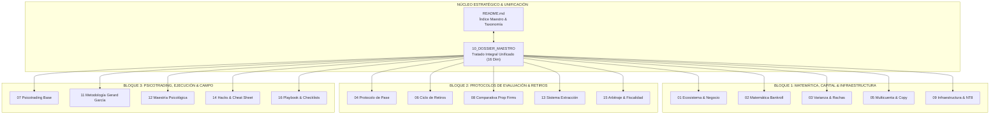
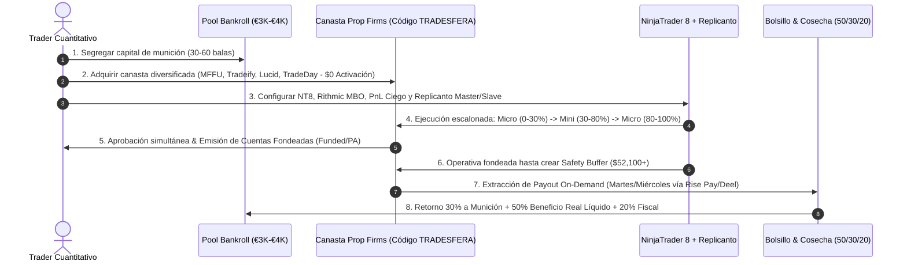

# 🌐 Ecosistema Tradesfera: Sistema Inteligente de Fondeo de Futuros CME

> **Índice Maestro, Síntesis Ejecutiva, Mapa de Navegación del Corpus Documental (16 Módulos), Glosario Técnico y Guía de Inicio Rápido**  
> **Proyecto:** 01 Ultrarentable | **Área:** Motor de Fondeo & Prop Firms | **Fecha:** 27 de Agosto de 2026  
> **Autores & Fuentes de Autoridad:** Vicente Pons Martínez (`tradesfera.com`), Gerard García (@GerardGarciafx), Víctor Corrales Urrutia (@Elpsicologodeltrading).

---

## 🎯 Navegación y Enlaces Bidireccionales del Proyecto

- 📌 **Ficha Maestra Central:** [[Ultrarentable]]
- 🔗 **Sub-notas Maestras de Arquitectura y Capital:**
  - [[Motor de Fondeo y Prop Firms]] — *Matriz Comparativa Global de Prop Firms de Futuros CME*
  - [[Gestion de Capital — Balas y Estados]] — *Modelo de Balas, Transición de 6 Estados y Cosecha Segregada*
  - [[Plan 10 Fases]] — *Plan de Evolución de Fases Cuantitativas del Motor Ultrarentable*
  - [[Dashboard Web]] — *Consola Web y Calculadoras Interactivas (`apps/web`)*
- 📑 **Entregables de Investigación:**
  - [[04_SISTEMA_MUNDIAL_PROP_FIRMS_FUTUROS.md]] — *Suite de Futuros CME y Asistente UltraBot AI*
  - [[03_CATALOGO_MAESTRO_34_PROP_FIRMS.md]] — *Catálogo Maestro de Firmas de Fondeo*
- 🌐 **Tratado Integral Unificado:** [[10_DOSSIER_MAESTRO_TRADESFERA_FONDEO_FUTUROS]]

---

## 🏛️ 1. Síntesis Ejecutiva del Ecosistema Tradesfera

El ecosistema **Tradesfera**, fundado y dirigido por el ingeniero y trader **Vicente Pons Martínez** (`tradesfera.com`), representa un cambio de paradigma en la operativa con cuentas de evaluación y fondeo en los mercados de futuros regulados (**CME Group**: MES, MNQ, ES, NQ, YM, RTY, CL, GC).

A diferencia de la narrativa convencional de "hacerse millonario rápido" promovida por el marketing agresivo del sector minorista, la metodología Tradesfera —en estrecha consonancia conceptual con la visión operativa de **Gerard García** (@GerardGarciafx) y los análisis conductuales y clínicos de **Víctor Corrales Urrutia / El Psicólogo del Trading** (@Elpsicologodeltrading)— concibe el fondeo de futuros como un **negocio cuantitativo de asimetría positiva, explotación estadística y extracción sistemática de liquidez**.

```mermaid
graph TD
    subgraph "TESIS FUNDAMENTAL TRADESFERA & ULTRARENTABLE V2"
        A["Capital Personal: Pool de Munición €3K-€4K"] --> B["Compra de Cestas Multicuenta con Descuento TRADESFERA ($0 Fee)"]
        B --> C["Protocolo Escalonado de Pase: Micro (0-30%) ➔ Mini (30-80%) ➔ Micro (80-100%)"]
        C --> D["Cuentas Fondeadas Activas en NinjaTrader 8 + Rithmic/Tradovate"]
        D --> E["Trade Copier (Replicanto): 1 Trade = N Cuentas Replicadas (<5ms)"]
        E --> F["Creación Rápida de Safety Buffer ($52,000+ / $52,100+)"]
        F --> G["Extracción Sistemática de Payouts On-Demand (Martes/Miércoles)"]
        G --> H["Algoritmo 50/30/20: Cosecha Intocable / Recarga de Munición / Colchón Fiscal"]
        H --> I["Destino Final: Capitalización de Cuenta Institucional Propia Des-arriesgada"]
    end
```



### Los 4 Principios Innegociables de Tradesfera:
1. **Ventaja Matemática sobre el Gráfico (Edge Real):** Ninguna gestión de capital salva un sistema con esperanza matemática negativa ($EV \le 0$). Se exige un modelo probado con edge estadístico en la microestructura de futuros (IPDA, PO3, CRT, FVG y Brackets ATM).
2. **Riesgo Estrictamente Limitado al Coste del Examen:** El trader nunca expone su patrimonio familiar al mercado; únicamente arriesga el valor de compra de la evaluación ($C_{\text{eval}} \approx \$30 - \$60$ con descuento), obteniendo acceso a colchones de drawdown operativo de $\$1,500$ a $\$3,000$ por cuenta.
3. **Transparencia Total y Cero Mocks (Public Ledger):** La comunidad audita en abierto sus métricas. El Libro Mayor de Tradesfera acredita **más de 167.839 € cobrados en 198 retiros verificados**, con una **tasa de fondeo real del 26,6%** (frente a la media de la industria de menos del 3%).
4. **Desconexión Emocional & Higiene Psicológica:** La cuenta financiada no es un trofeo ni un plan de jubilación a 10 años, sino un activo perecedero (vida media de 3 a 6 meses) destinado a extraer liquidez constante sin involucrar el ego.

---

## 🗺️ 2. Mapa de Navegación del Corpus Tradesfera (16 Módulos Completos)

El corpus documental se estructura en **15 tratados temáticos especializados de máxima profundidad** y **1 dossier maestro unificado de nivel publicación científica**:

```text
docs/tradesfera/
├── README.md                                             ← [Estás aquí] Índice General, Síntesis, Taxonomía, Glosario y Guía Rápida
├── 01_ECOSISTEMA_TRADESFERA_Y_MODELO_DE_NEGOCIO.md        ← Las 4 Puertas, Fundador, Public Ledger (167K€) y Red de Partners
├── 02_MATEMATICA_BANKROLL_Y_CAPITAL_MUNICION.md          ← Formulación KaTeX de Munición, EV, N Intentos, Binomial y Regla 50/30/20
├── 03_TEORIA_VARIANZA_Y_CONTROL_DE_RACHAS.md             ← Colas Pesadas CME, Rachas Negativas (L_max), TP Cortos y Monte Carlo
├── 04_PROTOCOLO_INTELIGENTE_APROBACION_CUENTAS.md        ← Drawdown Forense (Intraday Peak vs EOD vs Estático), Micro/Mini y Consistencia
├── 05_SISTEMA_MULTICUENTA_Y_COPYTRADING.md               ← Cestas de 5-20 Cuentas, Replicanto NT8, Latencias <5ms y Dilución Cognitiva
├── 06_CICLO_OPTIMO_RETIROS_Y_PAYOUTS.md                  ← Desmitificación del Holding, Buffers de Seguridad y Reglas de Cobro
├── 07_PSICOLOGIA_DEL_FONDEO_Y_SESGOS_OPERATIVOS.md       ← Doctrina de Perfil Bajo, Erradicación del Revenge Trading y Hard Stop por Software
├── 08_COMPARATIVA_PROP_FIRMS_FUTUROS_CME.md              ← Matriz Peras con Peras $50K/$100K, Costes Reales Totales, EAs y Cupones
├── 09_INFRAESTRUCTURA_TECNICA_NINJATRADER_TOOLS.md       ← Setup NinjaTrader 8, Feeds Kinetick/Rithmic y Spec TypeScript Calculadora Web
├── 10_DOSSIER_MAESTRO_TRADESFERA_FONDEO_FUTUROS.md        ← TRATADO INTEGRAL UNIFICADO (Compendio Holístico de las 16 Dimensiones)
├── 11_ESTRATEGIAS_Y_HORARIOS_GERARD_GARCIA_FUTUROS.md    ← Metodología Gerard García: Hard Scalping, Killzones NY, PO3, CRT, FVG y ATM
├── 12_MAESTRIA_PSICOLOGICA_Y_PROTOCOLOS_EL_PSICOLOGO_DEL_TRADING.md ← Psicología Clínica Víctor Corrales: Shock del Fondeado, Box Breathing y Auto-Cuarentena
├── 13_SISTEMA_TACTICO_MAXIMA_EXTRACCION_POR_EMPRESA.md  ← Tácticas Quirúrgicas Topstep, Tradeify, Lucid, Earn2Trade, Apex y BluSky (Calendario 30d)
├── 14_HACKS_SHORTS_Y_REGLAS_RAPIDAS_DE_FONDEO.md        ← Micro-Hacks, Shorts, Micro-Pacing 15s, PnL Ciego, MIT vs Stop y 15 Mandamientos
├── 15_ARBITRAJE_DE_NEGOCIO_PROMOS_Y_FISCALIDAD.md        ← Arbitraje de Capital, Cupones $0 Act., Riesgo Contraparte, Fiscalidad B2B España/UE y Flywheel
└── 16_PLAYBOOK_OPERATIVO_DIARIO_Y_CHECKLIST_EJECUCION.md  ← Playbook Militar Diario de 3 Fases (Pre/In/Post) y Checklists 1 Página
```



---

### Taxonomía de los 16 Módulos Especializados:

| # | Módulo Documental | Enfoque Principal | Contenido Clave, Métricas & Fórmulas | Enlace Directo |
|:---:|---|---|---|:---:|
| **01** | **Ecosistema & Negocio** | Arquitectura Tradesfera | Las 4 Puertas (Descuentos, Ticks, Telegram, Hub), Vicente Pons, Public Ledger (167.839 € cobrados, 198 retiros, 26,6% tasa de éxito). | [[01_ECOSISTEMA_TRADESFERA_Y_MODELO_DE_NEGOCIO]] |
| **02** | **Matemática Bankroll** | Capital como Munición | Modelado de $B \in [3000, 4000]\,\text{€}$, $N = \lfloor \frac{B}{C_{\text{eval}}+C_{\text{act}}} \rfloor$, $P(K \ge 1)$, $EV(B)$ y regla de segregación 50/30/20. | [[02_MATEMATICA_BANKROLL_Y_CAPITAL_MUNICION]] |
| **03** | **Varianza & Rachas** | Microestructura & Probabilidad | Fat tails NQ/ES (curtosis $>3$), Racha máxima $L_{\max} \approx \frac{\ln(T)}{\ln(1/(1-W))}$, ventaja de Take Profits cortos frente al Trailing Drawdown. | [[03_TEORIA_VARIANZA_Y_CONTROL_DE_RACHAS]] |
| **04** | **Protocolo de Pase** | Aprobación de Evaluaciones | Intraday Peak vs EOD Trailing vs Estático Puro, dimensionamiento en 3 fases (Semilla Micro $\to$ Expansión Mini $\to$ Cierre Micro). | [[04_PROTOCOLO_INTELIGENTE_APROBACION_CUENTAS]] |
| **05** | **Escalado Multicuenta** | Copytrading & Replicación | Cestas de 5 a 20 cuentas, Trade Copier NinjaTrader 8 (Replicanto), latencia $<5\text{ms}$, mitigación del estrés cognitivo por dilución. | [[05_SISTEMA_MULTICUENTA_Y_COPYTRADING]] |
| **06** | **Ciclo de Retiros** | Extracción de Liquidez | Desmitificación del holding a 10 años, Safety Buffers obligatorios ($52.100 en MFFU, $52.600 en Apex), ventanas y calendario de cobro. | [[06_CICLO_OPTIMO_RETIROS_Y_PAYOUTS]] |
| **07** | **Psicología de Fondeo** | Control de Sesgos | Mentalidad de perfil bajo (@Elpsicologodeltrading / Gerard García), Hard Stop diario por software, deconstrucción del coste hundido. | [[07_PSICOLOGIA_DEL_FONDEO_Y_SESGOS_OPERATIVOS]] |
| **08** | **Comparativa Prop Firms**| Matriz de Mercado 2026 | Análisis $50K y $100K: MFFU, Tradeify, TradeDay, BluSky, Lucid, Earn2Trade, Apex, Bulenox, Topstep, Take Profit Trader. | [[08_COMPARATIVA_PROP_FIRMS_FUTUROS_CME]] |
| **09** | **Infraestructura & Spec**| Tecnología & Herramientas | Setup NinjaTrader 8 64-bit, feeds Kinetick/Rithmic, contratos TypeScript y JSON Schema para la Calculadora Web en `apps/web`. | [[09_INFRAESTRUCTURA_TECNICA_NINJATRADER_TOOLS]] |
| **10** | **Dossier Maestro** | Tratado Integral Unificado | Síntesis holística completa de las 16 dimensiones en un único documento de referencia absoluta (Nivel Publicación Científica). | [[10_DOSSIER_MAESTRO_TRADESFERA_FONDEO_FUTUROS]] |
| **11** | **Metodología Gerard García** | Hard Scalping & Horarios | Killzones NY (08:30-11:30 EST), Vela 10:00 AM Judas Swing, IPDA, PO3, CRT, FVG/IFVG, Brackets ATM ultra-rápidos y MNQ vs NQ. | [[11_ESTRATEGIAS_Y_HORARIOS_GERARD_GARCIA_FUTUROS]] |
| **12** | **Maestría Psicológica** | Protocolos Clínicos Víctor Corrales | @Elpsicologodeltrading: Shock del Fondeado, desensibilización monetaria, secuestro amigdalino, Box Breathing 4x4, termostato y auto-cuarentena 24h. | [[12_MAESTRIA_PSICOLOGICA_Y_PROTOCOLOS_EL_PSICOLOGO_DEL_TRADING]] |
| **13** | **Sistema Táctico Extracción** | Máxima Extracción & Cashflow | Tácticas quirúrgicas Topstep, Tradeify, Lucid, Earn2Trade, Apex, BluSky, Calendario Semanal de Rotación 30d y Regla 80/20. | [[13_SISTEMA_TACTICO_MAXIMA_EXTRACCION_POR_EMPRESA]] |
| **14** | **Hacks, Shorts & Quick Rules** | Micro-Tácticas & Cheat Sheet | Micro-Pacing 15s, Brackets OCO 12/20 ticks, PnL Ciego en NT8/Tradovate, MIT vs Stop Market, Timing Rise Pay, Colchón Invisible y 15 Mandamientos. | [[14_HACKS_SHORTS_Y_REGLAS_RAPIDAS_DE_FONDEO]] |
| **15** | **Arbitraje, Promos & Fiscalidad** | Business Model & Compliance Legal | Arbitraje de riesgo asimétrico, trampas de cupones vs $0 Activation Fee, blindaje anti-quiebras de firmas, IRPF vs SL B2B (IVA exento) y Flywheel. | [[15_ARBITRAJE_DE_NEGOCIO_PROMOS_Y_FISCALIDAD]] |
| **16** | **Playbook Diario & Checklists** | Protocolo Operativo Militar | Procedimiento SOP de 3 fases (Pre-Mercado NTP <20ms, In-Market Judas 10:00 AM, Post-Mercado MAE/MFE) y Checklists Interactivos de 1 Página. | [[16_PLAYBOOK_OPERATIVO_DIARIO_Y_CHECKLIST_EJECUCION]] |

---

## 📖 3. Glosario Técnico de Fondeo de Futuros CME (A — Z)

- **Activation Fee (Cuota de Activación / PA Fee):** Tarifa única que algunas firmas exigen tras aprobar la evaluación para emitir la cuenta financiada (ej. $140 - $150 en Apex, Bulenox o Topstep). En firmas como MyFundedFutures, Tradeify, TradeDay o BluSky la activación es **$0**.
- **Arbitraje de Asimetría de Capital:** Estrategia donde el riesgo financiero máximo queda estrictamente limitado a la compra del examen ($35-$95 USD), mientras que el beneficio potencial es un flujo recurrente de miles de dólares por retiro.
- **ATM Strategy (Advanced Trade Management):** Plantilla automática de NinjaTrader que adjunta instantáneamente órdenes Stop Loss y Take Profit vinculadas (OCO) en el mismo milisegundo en que se ejecuta la orden de entrada.
- **Bankroll de Munición:** Pool de capital líquido ($3.000 € - $4.000 €) dedicado exclusivamente a comprar intentos de evaluación de forma diversificada y sistemática, absorbiendo las rachas de varianza sin comprometer las finanzas personales.
- **Box Breathing 4x4:** Protocolo fisiológico respiratorio (4s inhalación, 4s retención con aire, 4s exhalación, 4s retención en vacío) para desactivar el secuestro amigdalino y reducir la frecuencia cardíaca antes y durante la sesión.
- **Candle Range Theory (CRT):** Teoría de rango de velas que define la toma de liquidez en los extremos (High/Low) de una vela temporal superior (4H/Daily) para ejecutar reversiones o continuaciones en temporalidades menores (1m/2m).
- **Circuit Breaker (Cortacircuitos Operativo):** Regla innegociable de parar la operativa del día tras alcanzar 2 Stop Loss consecutivos, apagando la plataforma para proteger el capital y evitar el tilt.
- **Consistency Rule (Regla de Consistencia):** Restricción que exige que ningún día operativo individual represente más de un porcentaje fijado (típicamente 30%, 40% o 50%) de la ganancia total acumulada al solicitar un retiro o aprobar la evaluación.
- **Daily Loss Limit (DLL / Límite de Pérdida Diaria):** Pérdida máxima permitida en una sola sesión de mercado. Puede ser *Hard* (quiebra automática de cuenta) o *Soft* (cierre de posiciones y bloqueo hasta la siguiente sesión).
- **Drawdown Estático Puro (Static Drawdown):** Modelo de riesgo donde el umbral de pérdida permanece invariablemente congelado en el balance inicial (ej. $48,500 para una cuenta de $50K), independientemente de cuánto aumente el beneficio acumulado.
- **Drawdown Fin de Día (End of Day Trailing Drawdown - EOD):** El umbral de pérdida se actualiza únicamente al cierre de la sesión bursátil (17:00 ET) con base en el balance cerrado, ignorando las fluctuaciones intra-vela del balance flotante no realizado.
- **Drawdown Intradía al Pico (Intraday Trailing Peak Drawdown):** El umbral de pérdida persigue en tiempo real el balance máximo flotante tick a tick. Si una posición sube +$1,800 y se cierra en +$200, el drawdown ha subido $1,800, consumiendo el colchón operativo.
- **Fair Value Gap (FVG / IFVG):** Desequilibrio de liquidez de 3 velas en el gráfico donde el precio se desplaza violentamente sin subasta eficiente, sirviendo como imán magnético y zona de entrada óptima (OTE).
- **Flywheel Financiero:** Ciclo de recirculación de capital 50/30/20 que utiliza los payouts de prop firms para recargar munición, blindar ahorros y fondear una cuenta institucional de broker propio des-arriesgada.
- **Hard Stop de Plataforma:** Parámetro configurado directamente en NinjaTrader 8 o Rithmic Risk Manager que bloquea el envío de órdenes y liquida posiciones automáticamente al tocar el límite de pérdida diaria prefijado.
- **Judas Swing:** Movimiento de manipulación institucional que ocurre habitualmente entre las 09:30 y 10:00 EST (o tras la apertura de la vela de las 10:00 AM) para inducir liquidez en la dirección contraria a la verdadera expansión del día.
- **Kinetick / Rithmic / Tradovate:** Pasarelas y proveedores de datos de futuros CME. Rithmic ofrece enrutamiento directo MBO de ultrabaja latencia; Tradovate opera sobre WebSockets para entornos multiplataforma y TradingView.
- **Micro E-mini (MES / MNQ / MYM / M2K):** Contratos de futuros con un valor nominal equivalente a 1/10 del contrato estándar mini (MES = $5/punto, MNQ = $2/punto), indispensables para fases iniciales de acumulación de colchón.
- **Micro-Pacing (Regla de los 15 Segundos):** Táctica que consiste en abrir y cerrar 1 microcontrato durante 15 segundos con ganancia/pérdida de $1-$2 para validar días mínimos requeridos por la firma sin arriesgar el target ya alcanzado.
- **Order Flow (Flujo de Órdenes):** Análisis de la cinta de transacciones ejecutadas en tiempo real (Time & Sales), libro de órdenes (DOM / Depth of Market) y perfiles de volumen/delta para verificar el esfuerzo institucional.
- **PnL Ciego (Blind PnL):** Ocultación del saldo y ganancias flotantes monetarias en NinjaTrader 8 o Tradovate, visualizando únicamente puntos/ticks para evitar la distorsión emocional del valor del dinero.
- **Poder de Tres (PO3):** Ciclo algorítmico diario ICT compuesto por Acumulación (Asia/Londres) $\to$ Manipulación (Judas Swing NY) $\to$ Distribución (Expansión direccional).
- **Replicanto / Trade Copier:** Software de replicación de órdenes locales que duplica instantáneamente las operaciones de una cuenta máster en múltiples cuentas esclavas con latencias inferiores a 5 milisegundos.
- **Safety Buffer (Colchón de Seguridad de Retiro):** Capital mínimo de beneficio que debe dejarse en la cuenta fondeada al solicitar un payout para no situar el balance en el umbral del trailing drawdown (ej. balance mínimo de $52,100 para retirar en una cuenta de $50K en MFFU).
- **Shock del Fondeado:** Estado de parálisis neuroquímica o euforia desmedida que sufre el trader tras aprobar una cuenta, provocado por la presión de enfrentarse al cobro real y al miedo a perder la cuenta.
- **Ticks (Sistema de Recompensas Tradesfera):** Puntos acumulables por cada compra realizada con el código `TRADESFERA` canjeables por evaluaciones gratuitas, mentorías 1 a 1, indicadores y licencias.

---

## 🚀 4. Guía de Inicio Rápido en 5 Pasos para el Fondeo Profesional



### Protocolo Operativo Resumido en 5 Fases:
1. **Paso 1 — Asignación de Munición Segregada:** Disponer de un pool de 3.000 € a 4.000 € totalmente aislado de los gastos personales. Esto garantiza entre 30 y 80 intentos de evaluación con cupones activos del código `TRADESFERA`.
2. **Paso 2 — Selección de Firmas de Alta Calidad y $0 Cuota de Activación:** Priorizar cuentas con Drawdown EOD o Estático y $0 de cuota de activación (ej. MyFundedFutures Rapid, Tradeify Growth, TradeDay, BluSky, Lucid Trading).
3. **Paso 3 — Despliegue de Infraestructura Militar:** Instalar NinjaTrader 8 64-bit con conexión Rithmic Direct MBO, activar PnL Ciego, configurar Brackets ATM fijos y Replicanto para conectar la canasta de cuentas.
4. **Paso 4 — Pase Escalonado con Micro-Contratos:** Operar con 2-4 MNQ/MES durante los primeros $1,000 de beneficio para no arriesgar más del 5% del colchón por trade. Escalar a 1 mini solo con colchón positivo acumulado y cerrar el target con micros.
5. **Paso 5 — Creación de Buffer y Extracción Inmediata:** Al obtener la cuenta financiada, alcanzar el umbral de seguridad ($52,100) y solicitar el retiro máximo permitido en ventanas óptimas (martes/miércoles). Aplicar estrictamente la regla 50/30/20 y facturar B2B exento de IVA.

---

## 🔗 Conexión con el Sistema Central Ultrarentable

El conocimiento del ecosistema Tradesfera se integra directamente en los módulos de **01 Ultrarentable**:
- La lógica de **Balas y Estados** ([[Gestion de Capital — Balas y Estados]]) modela las fases de cada cuenta de fondeo (Inicio $\to$ Confirmación $\to$ Crecimiento $\to$ Cosecha $\to$ Protección $\to$ Cierre).
- El **Comparador de Prop Firms** en `http://localhost:3000/prop-firms` implementa en tiempo real los cupones, costes reales y modelos de drawdown documentados aquí.
- La **Calculadora de Bankroll y Varianza** formalizada en [[09_INFRAESTRUCTURA_TECNICA_NINJATRADER_TOOLS]] provee las interfaces TypeScript y algoritmos para el frontend de la plataforma (`apps/web`).
- El **Playbook Militar de Ejecución** ([[16_PLAYBOOK_OPERATIVO_DIARIO_Y_CHECKLIST_EJECUCION]]) proporciona las checklists de 1 página para la operativa intradía diaria.

Para estudiar el tratado completo con todo el rigor analítico y formulación KaTeX, accede a:  
👉 **[[10_DOSSIER_MAESTRO_TRADESFERA_FONDEO_FUTUROS]]**
